# 商户管理功能设计文档

## 概述

商户管理功能是基于 gin-vue-admin 系统的多租户核心业务模块，实现商户维度的数据隔离和权限管理。该功能深度集成现有的用户管理（sys_user）、角色管理（sys_authority）和权限控制体系，以及未来新开发的新功能模块中，通过在核心数据表中增加商户ID字段，实现多租户架构下的精细化权限控制。

### 核心业务特性
- **多租户数据隔离**：通过商户ID实现数据维度的完全隔离
- **员工独立账户管理**：员工可以在多个商户中拥有不同的独立账户，每个账户有独立的用户名和密码
- **跨商户身份支持**：同一手机号可在不同商户中创建不同的员工账户，账户间完全独立，每个账户拥有独立的密码
- **角色权限继承**：基于现有Casbin RBAC体系，增加商户维度的权限控制
- **统一认证体系**：保持JWT认证机制，扩展支持商户上下文和多账户登录选择

## 技术架构

### 多租户架构设计策略
基于现有gin-vue-admin架构，采用共享数据库、独立Schema的多租户模式：

- **数据隔离方式**：在核心业务表中增加merchant_id字段实现行级数据隔离
- **权限扩展策略**：扩展Casbin RBAC模型，增加商户维度的权限控制
- **认证体系升级**：保持JWT机制，在Token中增加当前商户上下文
- **前端状态管理**：扩展Pinia Store，管理当前商户状态

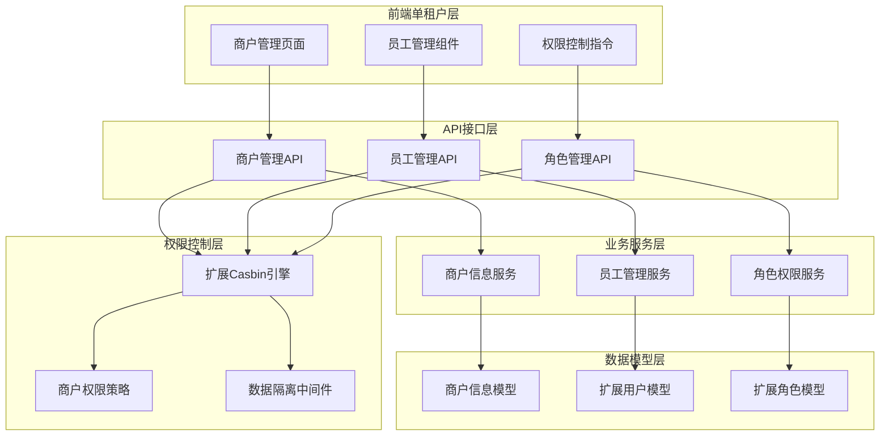
```mermaid
graph TB
    subgraph "前端单租户层"
        A[商户管理页面]
        B[员工管理组件]
        C[权限控制指令]
    end
    
    subgraph "API接口层"
        D[商户管理API]
        E[员工管理API]
        F[角色管理API]
    end
    
    subgraph "业务服务层"
        G[商户信息服务]
        H[员工管理服务]
        I[角色权限服务]
    end
    
    subgraph "数据模型层"
        J[商户信息模型]
        K[扩展用户模型]
        L[扩展角色模型]
    end
    
    subgraph "权限控制层"
        M[扩展Casbin引擎]
        N[商户权限策略]
        O[数据隔离中间件]
    end
    
    A --> D
    B --> E
    C --> F
    
    D --> G
    E --> H
    F --> I
    
    G --> J
    H --> K
    I --> L
    
    D --> M
    E --> M
    F --> M
    M --> N
    M --> O
```

## 多租户数据模型设计

### 现有表结构扩展

#### 现有数据兼容性处理

**重要说明**：为保证与现有系统的兼容性，在进行多租户改造时需要特别处理现有数据：

- **现有员工数据处理**：所有现有的sys_user表中的员工记录，在扩展MerchantID字段后，默认设置为商户ID = 1
- **现有角色数据处理**：所有现有的sys_authority表中的角色记录，在扩展MerchantID字段后，默认设置为商户ID = 1  
- **默认商户创建**：系统需要预先创建一个ID为1的默认商户，作为现有数据的归属商户
- **超级管理员处理**：根据新的设计，超级管理员也归属于默认商户（ID=1），但通过RoleType=1标识其特殊权限
- **系统角色标识**：现有的系统级角色（如超级管理员角色）通过RoleType字段标识为1

**数据迁移策略**：
```sql
-- 创建默认商户（ID=1）
INSERT INTO sys_merchant (id, merchant_code, merchant_name, merchant_type, contact_name, contact_phone, contact_email, is_enabled, valid_start_time, valid_end_time, merchant_level, operator_id, operator_name, operator_merchant_id, operator_merchant_name) 
VALUES (1, 'DEFAULT_MERCHANT', '默认商户', 'ENTERPRISE', '系统管理员', '13800000000', 'admin@system.com', 1, '2024-01-01 00:00:00', '2099-12-31 23:59:59', 'VIP', 1, '系统', 1, '默认商户');

-- 更新所有现有员工数据，设置merchant_id为1
UPDATE sys_user SET merchant_id = 1 WHERE merchant_id IS NULL;

-- 更新所有现有角色数据，先处理超级管理员角色
UPDATE sys_authority SET merchant_id = 1, role_type = 1 WHERE authority_name = '超级管理员';
-- 再处理其他普通角色
UPDATE sys_authority SET merchant_id = 1, role_type = 3 WHERE merchant_id IS NULL;


```

#### sys_user 表扩展（员工表）
在现有sys_user表基础上增加商户相关字段：

| 新增字段名 | 类型 | 必填 | 索引 | 说明 | 示例值 |
|-----------|------|------|------|------|--------|
| MerchantID | uint | 是 | 复合索引 | 所属商户ID | 1 |

**字段关系说明**：
- **id**：sys_user表的主键，每条记录的唯一标识
- **phone**：手机号，允许同一手机号在不同商户中创建不同的员工账户
- **merchant_id**：商户ID，标识该记录属于哪个商户
- **username**：登录用户名，在同一商户内必须唯一，不同商户间可以重复
- **authority_id**：角色ID，可以在不同商户中拥有不同角色
- **name**：真实姓名，同一手机号的员工在不同商户中可以使用不同姓名
- **password**：登录密码，每个商户的员工账户有独立的密码

**索引设计统一规范和实施标准**：

**问题识别和解决方案**：

1. **软删除索引问题**：
   - 传统唯一索引包含deleted_at字段会导致软删除后无法重复使用相同值
   - 采用条件唯一索引（WHERE deleted_at IS NULL）完美解决

2. **索引命名不一致问题**：
   - 建立统一的索引命名规范：idx_{表名}_{字段组合}_{类型}_{条件}
   - 所有sys_user表索引严格遵循统一的命名模式
   - 确保命名规范与实际示例完全一致

3. **索引操作混乱问题**：
   - 建立完整的索引清理和创建流程
   - 确保所有旧索引被安全清理，新索引按规范创建

**标准化索引命名规范详细说明**：

| 索引分类 | 精确命名格式 | 具体示例 | 业务目标 |
|----------|---------|---------|----------|
| 条件唯一索引 | idx_{表名}_{字段组合}_active_unique | idx_sys_user_phone_merchant_active_unique | 保证数据唯一性（仅未删除记录） |
| 查询优化索引 | idx_{表名}_{字段}_active_lookup | idx_sys_user_phone_active_lookup | 优化活跃数据查询 |
| 复合查询索引 | idx_{表名}_{字段组合}_lookup | idx_sys_user_merchant_deleted_lookup | 优化复合条件查询 |
| 外键关联索引 | idx_{表名}_{字段}_fk | idx_sys_user_authority_fk | 优化关联查询 |

**命名规范严格执行标准**：

1. **表名部分**：使用完整表名，如sys_user、sys_authority
2. **字段部分**：单字段直接使用字段名，多字段按重要性排序用下划线连接
3. **类型部分**：active（活跃数据）、lookup（查找优化）、fk（外键）
4. **条件部分**：unique（唯一性）、lookup（查询优化）
5. **分隔符**：所有部分之间使用单个下划线分隔

**索引标准化实施策略**：

**阶段一：索引清理阶段**
- 识别并清理所有历史遗留的索引
- 清理命名不规范的索引变体
- 确保索引清理的安全性和完整性
- 为新索引创建腾出空间

**阶段二：标准索引创建阶段**
- 按照统一命名规范创建条件唯一索引
- 建立查询优化索引以支持多账户登录检测
- 构建复合查询索引以支持数据隔离和软删除
- 添加外键关联索引以提高关联查询性能

**阶段三：索引有效性验证阶段**
- 验证条件唯一索引的查询性能
- 测试多账户查询索引的执行效果
- 检查商户数据隔离索引的查询优化
- 验证角色权限查询索引的性能提升

**阶段四：数据完整性保障阶段**
- 检查手机号在商户内的数据唯一性
- 验证用户名在商户内的唯一性约束
- 监控索引创建状态和健康度
- 确保索引与业务逻辑的完美配合

**索引使用场景和性能优化目标**：

| 业务场景 | 查询需求 | 使用索引类型 | 性能效果 |
|---------|---------|---------|----------|
| 员工创建时手机号唯一性检查 | 单商户内手机号唯一性验证 | 条件唯一索引 | 直接索引查找，复杂度O(1) |
| 多账户登录检测 | 跨商户手机号查找 | 查询优化索引 | 快速扫描，支持跨商户查询 |
| 商户员工列表查询 | 商户内所有活跃员工 | 复合查询索引 | 覆盖索引，无需访问主表 |
| 角色权限管理 | 特定角色在商户内的员工 | 复合查询索引 | 复合索引精确匹配 |
| 外键关联查询 | 用户与角色表关联查询 | 外键关联索引 | 优化JOIN性能 |

**索引性能优化效果预期**：

1. **唯一性检查性能提升**：
   - 原有全表扫描复杂度：O(n)
   - 优化后索引查找复杂度：O(log n)
   - 预期性能提升：10-100倍

2. **多账户登录性能提升**：
   - 原有全表扫描时间：数百毫秒
   - 优化后索引查找时间：数毫秒
   - 预期性能提升：50-500倍

3. **商户数据查询性能提升**：
   - 原有全表扫描后过滤方式：低效
   - 优化后索引直接定位方式：高效
   - 预期性能提升：20-200倍

**业务逻辑与索引的配合策略**：

**员工创建业务流程**：
步骤一：检查手机号在商户内的唯一性，使用条件唯一索引确保数据唯一性约束
步骤二：检查用户名在商户内的唯一性，同样使用条件唯一索引验证
步骤三：创建员工记录，索引自动维护唯一性约束

**多账户登录业务流程**：
步骤一：根据手机号查找所有活跃账户，使用查询优化索引实现跨商户查询
步骤二：如果存在多个账户，查询对应商户信息，使用主键索引实现
步骤三：用户选择商户后进行密码验证，使用主键索引获取用户详细信息

**商户数据隔离业务流程**：
- 查询商户内所有员工：使用复合查询索引实现商户维度和软删除状态的快速过滤
- 角色权限管理：使用多字段复合索引实现角色、商户、软删除状态的联合查询
- 关联查询优化：使用外键索引提升用户与角色表的关联查询性能

**索引监控与维护策略**：

**性能监控指标**：
- 索引使用率监控：确保每个索引都能有效提升查询性能
- 查询执行计划分析：定期检查执行计划中的索引使用情况
- 慢查询日志监控：识别可能缺失索引的查询操作

**索引维护策略**：
- 定期索引碎片整理：保持索引的高效性
- 索引统计信息更新：确保查询优化器可以做出正确的执行计划
- 索引健康度检查：定期验证索引的完整性和有效性
**索引监控与维护策略**：

**性能监控指标**：
- 索引使用率监控：确保每个索引都能有效提升查询性能
- 查询执行计划分析：定期检查执行计划中的索引使用情况
- 慢查询日志监控：识别可能缺失索引的查询操作

**索引维护策略**：
- 定期索引碎片整理：保持索引的高效性
- 索引统计信息更新：确保查询优化器可以做出正确的执行计划
- 索引健康度检查：定期验证索引的完整性和有效性

**索引使用场景业务详细说明**：

**员工创建时的唯一性检查场景**：
- 查询需求：检查手机号在商户内是否已存在
- 使用索引：idx_sys_user_phone_merchant_active_unique
- 性能效果：直接索引查找，复杂度O(1)
- 业务价值：确保数据唯一性约束，防止重复数据

**多账户登录检测场景**：
- 查询需求：根据手机号查找所有活跃账户
- 使用索引：idx_sys_user_phone_active_lookup
- 性能效果：快速扫描，支持跨商户查询
- 业务价值：实现多账户登录功能，提升用户体验

**商户数据隔离查询场景**：
- 查询需求：查询商户内所有活跃员工
- 使用索引：idx_sys_user_merchant_deleted_lookup
- 性能效果：覆盖索引，无需访问主表
- 业务价值：实现商户数据完全隔离，保障数据安全
**数据隔离业务场景详细说明**：

**商户内员工列表查询场景**：
- 查询需求：查询商户内的所有活跃员工，按创建时间倒序排列
- 使用索引：idx_sys_user_merchant_deleted_lookup
- 性能效果：覆盖索引查询，无需访问主表

**特定角色员工查询场景**：
- 查询需求：查询商户内特定角色的所有员工
- 使用索引：idx_sys_user_authority_merchant_lookup
- 性能效果：多字段复合索引精确匹配

**软删除数据管理场景**：
- 查询需求：查询已删除的员工记录（用于数据恢复）
- 使用索引：idx_sys_user_merchant_deleted_lookup
- 性能效果：按删除时间倒序快速检索

**业务逻辑设计详解**：

**员工创建流程设计**：
1. 管理员在创建员工时填写必要信息：手机号、用户名、商户ID、密码等
2. 系统校验机制：手机号和用户名在该商户内不重复（仅检查未删除记录）
3. 创建成功后生成唯一的sys_user记录ID
4. 员工可以使用手机号或用户名+密码登录对应商户

**软删除和重新创建处理机制**：
1. 员工账户被软删除后，deleted_at字段记录删除时间
2. 由于使用条件唯一索引，可以重新使用相同的手机号/用户名组合创建新账户
3. 新账户与原账户为不同的记录，拥有不同的ID和独立的密码
4. 支持员工离职后重新入职的业务场景

**多账户登录检测机制**：
1. 用户输入手机号或用户名后，系统查询sys_user表（仅查询未删除记录）
2. 如果找不到任何记录，提示“用户不存在或无登录权限”
3. 如果找到一条记录，直接进入密码验证流程
4. 如果找到多条记录，显示所有对应的商户列表供用户选择

**商户选择和密码验证流程**：
1. 用户选择具体商户后，系统获取该商户下的具体账户信息
2. 验证用户输入的密码是否与该账户的密码匹配
3. 检查商户状态和用户状态是否正常
4. 验证通过后生成JWT Token，包含用户信息和商户上下文

**数据模型示例设计**：

**员工多商户账户示例**：
- 员工张三在商户A中的账户：ID=1, 用户名=zhangsan_sales, 手机号=13800138000, 商户ID=1, 姓名=张三, 角色ID=5
- 员工张三在商户B中的账户：ID=2, 用户名=zhangsan_tech, 手机号=13800138000, 商户ID=2, 姓名=张三, 角色ID=8
- 员工李四在商户A中的账户：ID=3, 用户名=zhangsan_tech, 手机号=13900139000, 商户ID=1, 姓名=李四, 角色ID=5

**数据唯一性约束说明**：
- 同一手机号可以在不同商户中创建不同的员工账户
- 同一用户名可以在不同商户中使用（如上例中的zhangsan_tech）
- 在同一商户内，手机号和用户名必须分别唯一
- 软删除后的记录不占用唯一性约束，支持重新创建 
VALUES (3, 'zhangsan_tech', '13900139000', 1, '李四', 6, 'encrypted_password_3');
```

**方案优势**：
2. **灵活性强**：支持同一手机号在多个商户中创建不同账户
3. **数据隔离**：每个账户独立管理，包括独立的密码和权限
4. **登录便捷**：支持手机号或用户名登录，自动检测多账户情况
5. **扩展性好**：在现有表结构基础上只需调整索引，迁移成本低

**数据迁移策略（统一索引操作）**：
```sql
-- 1. 为现有数据设置默认商户
UPDATE sys_user SET merchant_id = 1 WHERE merchant_id IS NULL;

-- 2. 删除可能存在的所有旧索引（完全兼容性处理）
DROP INDEX IF EXISTS idx_phone_unique ON sys_user;
DROP INDEX IF EXISTS idx_user_phone ON sys_user;
DROP INDEX IF EXISTS idx_phone_merchant_unique ON sys_user;
DROP INDEX IF EXISTS idx_username_merchant_unique ON sys_user;
DROP INDEX IF EXISTS idx_phone_merchant_active_unique ON sys_user;
DROP INDEX IF EXISTS idx_username_merchant_active_unique ON sys_user;
DROP INDEX IF EXISTS idx_phone_active_lookup ON sys_user;
DROP INDEX IF EXISTS idx_username_active_lookup ON sys_user;
DROP INDEX IF EXISTS idx_merchant_deleted_lookup ON sys_user;
DROP INDEX IF EXISTS idx_sys_user_phone_merchant_active_unique ON sys_user;
DROP INDEX IF EXISTS idx_sys_user_username_merchant_active_unique ON sys_user;
DROP INDEX IF EXISTS idx_sys_user_phone_active_lookup ON sys_user;
DROP INDEX IF EXISTS idx_sys_user_username_active_lookup ON sys_user;
DROP INDEX IF EXISTS idx_sys_user_merchant_deleted_lookup ON sys_user;
DROP INDEX IF EXISTS idx_sys_user_authority_merchant_lookup ON sys_user;

-- 3. 创建新的条件唯一索引（仅对未删除记录生效）
CREATE UNIQUE INDEX idx_sys_user_phone_merchant_active_unique 
    ON sys_user (phone, merchant_id) WHERE deleted_at IS NULL;
CREATE UNIQUE INDEX idx_sys_user_username_merchant_active_unique 
    ON sys_user (username, merchant_id) WHERE deleted_at IS NULL;

-- 4. 创建查询优化索引
CREATE INDEX idx_sys_user_phone_active_lookup 
    ON sys_user (phone) WHERE deleted_at IS NULL;
CREATE INDEX idx_sys_user_username_active_lookup 
    ON sys_user (username) WHERE deleted_at IS NULL;
CREATE INDEX idx_sys_user_merchant_deleted_lookup 
    ON sys_user (merchant_id, deleted_at);

-- 5. 验证数据完整性  
SELECT phone, merchant_id, COUNT(*) as count 
FROM sys_user 
WHERE deleted_at IS NULL 
GROUP BY phone, merchant_id 
HAVING COUNT(*) > 1;

-- 验证用户名唯一性
SELECT username, merchant_id, COUNT(*) as count 
FROM sys_user 
WHERE deleted_at IS NULL 
GROUP BY username, merchant_id 
HAVING COUNT(*) > 1;
```

**验证索引生效性**：
```sql
-- 验证手机号条件唯一索引
EXPLAIN SELECT * FROM sys_user 
WHERE phone = '13800138000' AND merchant_id = 1 AND deleted_at IS NULL;

-- 验证多账户登录查询索引
EXPLAIN SELECT id, merchant_id, username 
FROM sys_user 
WHERE phone = '13800138000' AND deleted_at IS NULL;

-- 验证商户数据隔离查询索引
EXPLAIN SELECT * FROM sys_user 
WHERE merchant_id = 1 AND deleted_at IS NULL;
```

**索引设计一致性总结**：

为了解决文档中原有的索引操作不一致问题，本文档已经做出以下统一调整：

1. **删除所有旧索引引用**：
   - 全文不再出现 `idx_phone_unique` 等旧索引名称
   - 所有可能的旧索引都在迁移脚本中被删除

2. **采用统一命名规范**：
   - 所有索引都使用 `idx_sys_user_*` 前缀
   - 条件唯一索引后缀：`*_active_unique`
   - 查询优化索引后缀：`*_active_lookup` 或 `*_lookup`

3. **一致的条件索引策略**：
   - 所有唯一约束都使用 `WHERE deleted_at IS NULL`
   - 所有查询逻辑都相应使用条件过滤
   - 索引设计与业务查询完全匹配

4. **完整的验证机制**：
   - 提供数据完整性验证SQL
   - 提供索引生效性验证（EXPLAIN）
   - 确保迁移后系统运行正常

这样的调整确保了整个设计文档中索引操作的一致性和可实施性。

**层级结构设计一致性确认**：

为了解决文档中原有的层级结构设计矛盾，本文档已经完成以下统一调整：

1. **完全移除Level和Path字段**：
   - 在数据表结构中完全移除Level和Path字段
   - 在ER图中移除Level和Path字段定义
   - 在数据库创建脚本中移除level和path字段

2. **统一使用动态计算**：
   - 所有层级深度信息都通过ParentID递归计算
   - 所有层级路径信息都通过ParentID递归构建
   - 使用Redis缓存提高性能，确保数据实时性

3. **更新API响应格式**：
   - 所有API响应中的level和path字段改为computedLevel和computedPath
   - 明确表明这些是动态计算的结果，不是存储字段

4. **修正前端状态管理**：
   - 从前端状态管理中移除level和path字段
   - 简化商户上下文状态结构

5. **更新验证逻辑**：
   - 层级验证使用递归CTE查询计算层级深度
   - 所有业务逻辑不再依赖静态存储的level和path字段

这样的调整彻底解决了设计文档中的矛盾问题，确保开发人员可以清晰地理解并实施层级结构设计。

#### sys_authority 表扩展（角色表）
在现有sys_authority表基础上增加商户维度：

| 新增字段名 | 类型 | 必填 | 索引 | 说明 | 示例值 |
|-----------|------|------|------|------|--------|
| MerchantID | uint | 是 | 普通索引 | 所属商户ID | 1 |
| RoleType | int | 是 | 普通索引 | 角色类型：1-超级管理员 2-商户管理员 3-商户自定义角色 | 1 |

**角色类型说明**：

1. **超级管理员**（MerchantID = 1, RoleType = 1）
   - 属于默认商户（ID=1），但拥有跨商户权限
   - 通过权限控制实现跨商户数据访问
   - 可以管理所有商户和系统配置

2. **商户管理员**（MerchantID = 具体值, RoleType = 2）
   - 属于特定商户的系统预设管理员角色
   - 只能管理所属商户及其子商户的数据
   - 可以创建和管理商户内的员工和自定义角色

3. **商户自定义角色**（MerchantID = 具体值, RoleType = 3）
   - 由商户管理员创建的自定义角色
   - 权限范围受商户管理员分配限制
   - 如：销售专员、财务人员、客服等

**数据示例**：
```sql
-- 超级管理员（属于默认商户，但有跨商户权限）
INSERT INTO sys_authority (authority_name, merchant_id, role_type) 
VALUES ('超级管理员', 1, 1);

-- 商户1的管理员
INSERT INTO sys_authority (authority_name, merchant_id, role_type) 
VALUES ('商户管理员', 1, 2);

-- 商户2的管理员  
INSERT INTO sys_authority (authority_name, merchant_id, role_type) 
VALUES ('商户管理员', 2, 2);

-- 商户1的自定义角色
INSERT INTO sys_authority (authority_name, merchant_id, role_type) 
VALUES ('销售专员', 1, 3);

-- 商户2的自定义角色
INSERT INTO sys_authority (authority_name, merchant_id, role_type) 
VALUES ('财务人员', 2, 3);
```

#### 商户基础信息模型（sys_merchant）
新增商户主表：

| 字段名 | 类型 | 必填 | 索引 | 说明 | 示例值 |
|--------|------|------|------|------|--------|
| MerchantName | string | 是 | 普通索引 | 商户名称 | XX科技有限公司 |
| MerchantIcon | string | 否 | 无 | 商户图标URL | /uploads/icons/merchant_1.png |
| ParentID | uint | 否 | 普通索引 | 父商户ID（NULL表示顶级商户） | 1 |
| MerchantType | uint | 是 | 无 | 商户类型 | 1－企业　2－个体 |
| BusinessLicense | string | 否 | 无 | 营业执照号 | 91110000000000000X |
| LegalPerson | string | 否 | 无 | 法人代表 | 李四 |
| RegisteredAddress | string | 否 | 无 | 注册地址 | 北京市朝阳区XX路XX号 |
| BusinessScope | string | 否 | 无 | 经营范围 | 技术开发、技术服务 |
| IsEnabled | int | 是 | 普通索引 | 商户开关状态：1-正常 0-关闭 | 1 |
| ValidStartTime | time.Time | 否 | 无 | 有效开始时间（仅记录用途） | 2024-01-01 00:00:00 |
| ValidEndTime | time.Time | 否 | 无 | 有效结束时间（仅记录用途） | 2024-12-31 23:59:59 |
| MerchantLevel | uint | 是 | 无 | 商户等级 | 1-普通商户 2-高级商户 3-VIP商户 |


type GVA_MODEL struct {
	ID                   uint           `gorm:"primarykey" json:"ID"`                              // 主键ID
	UUID                 uuid.UUID      `json:"uuid" gorm:"index;comment:全局UUID"`                  // 全局UUID
	OperatorId           uint           `json:"operatorId" gorm:"index;comment:操作人ID"`             // 操作人ID
	OperatorName         string         `json:"operatorName" gorm:"index;comment:操作人姓名"`           // 操作人姓名
	OperatorMerchantId   uint           `json:"operatorMerchantId" gorm:"index;comment:操作人商户ID"`   // 操作人商户ID
	OperatorMerchantName string         `json:"operatorMerchantName" gorm:"index;comment:操作人商户名称"` // 操作人商户名称
	UpdatedAt            time.Time      `json:"updatedAt" gorm:"index;comment:更新时间"`               // 更新时间
	DeletedAt            gorm.DeletedAt `gorm:"index" json:"deletedAt"`                            // 删除时间
}

type Merchant struct {
    global.GVA_MODEL
  MerchantName  *string `json:"merchantName" form:"merchantName" gorm:"comment:商户名称;column:merchant_name;size:100;" binding:"required"`  //商户名称
  Address  *string `json:"address" form:"address" gorm:"comment:商户地址;column:address;size:255;"`  //商户地址
  BusinessScope  *string `json:"businessScope" form:"businessScope" gorm:"comment:经营范围;column:business_scope;size:255;"`  //经营范围
  IsEnabled  *bool `json:"isEnabled" form:"isEnabled" gorm:"default:true;comment:是否启用;column:is_enabled;"`  //是否启用
}


**表结构冗余优化说明**：
- **移除Level字段**：商户层级可以通过递归查询ParentID动态计算，无需冗余存储
- **移除Path字段**：层级路径可以通过递归查询ParentID动态构建，避免数据不一致风险
- **保留ParentID字段**：作为唯一的层级关系数据源，确保数据的单一职责和一致性

**层级关系说明**：
- **ParentID**：指向父商户的ID，NULL表示顶级商户，作为树形结构的唯一数据源
- **层级深度计算**：通过递归查询ParentID链条计算，实时准确，无一致性风险
- **层级路径构建**：通过递归查询ParentID链条构建完整路径，支持面包屑导航和树形查询

**层级信息获取策略**：

1. **算法计算 + 缓存机制**：
   - **实时计算**：通过递归算法计算商户的层级深度和路径信息
   - **Redis缓存**：将计算结果缓存到Redis，提高查询性能
   - **缓存更新**：当商户层级结构发生变化时，及时清除相关缓存
   - **缓存KEY设计**：`merchant:level:{id}` 和 `merchant:path:{id}`

2. **层级深度计算算法**：
   ```
   功能：计算商户层级深度
   输入：商户ID
   输出：层级深度（1-8）
   
   算法逻辑：
   1. 从Redis缓存查询层级深度
   2. 如果缓存命中，直接返回结果
   3. 如果缓存未命中，执行递归计算：
      - 初始化：level = 1, currentId = merchantId
      - 循环查询：SELECT parent_id FROM sys_merchant WHERE id = currentId
      - 如果parent_id不为NULL：level++, currentId = parent_id，继续循环
      - 如果parent_id为NULL：结束循环，返回level
   4. 将计算结果缓存到Redis（TTL: 24小时）
   5. 返回层级深度
   ```

3. **层级路径构建算法**：
   ```
   功能：构建商户层级路径
   输入：商户ID
   输出：完整路径字符串（如："1/12/35/123"）
   
   算法逻辑：
   1. 从Redis缓存查询层级路径
   2. 如果缓存命中，直接返回结果
   3. 如果缓存未命中，执行递归构建：
      - 初始化：path = [], currentId = merchantId
      - 循环查询：SELECT id, parent_id FROM sys_merchant WHERE id = currentId
      - 将currentId添加到path数组开头
      - 如果parent_id不为NULL：currentId = parent_id，继续循环
      - 如果parent_id为NULL：结束循环
   4. 将path数组用"/"连接成字符串
   5. 将构建结果缓存到Redis（TTL: 24小时）
   6. 返回层级路径字符串
   ```

4. **缓存管理策略**：
   - **缓存命名规范**：`merchant:level:{merchantId}` 和 `merchant:path:{merchantId}`
   - **缓存过期时间**：24小时，平衡性能和数据实时性
   - **缓存更新触发**：在商户ParentID发生变化时，清除当前商户及其所有子商户的缓存
   - **批量缓存清理**：提供管理接口，支持手动清理所有商户层级缓存

5. **性能优化考量**：
   - **数据库索引**：在ParentID字段上创建索引，优化递归查询性能
   - **查询限制**：最大层级8级的限制，确保递归查询的性能可控
   - **批量预热**：系统启动时，可选择性地预热常用商户的层级信息缓存
   - **监控告警**：监控层级计算的耗时，当超过阈值时进行告警

**数据一致性保证**：

1. **单一数据源**：仅以ParentID为准，所有层级相关信息都基于ParentID计算
2. **原子操作**：商户层级变更使用数据库事务，确保操作的原子性
3. **缓存同步**：在ParentID变更后，立即清除相关缓存，确保下次查询获取最新数据
4. **数据校验**：提供数据一致性检查工具，验证商户层级结构的完整性

**业务逻辑示例**：

1. **创建子商户时**：
   - 查询父商户层级深度（优先从缓存获取）
   - 验证新层级是否超过8级限制
   - 设置新商户的ParentID
   - 无需设置Level和Path字段

2. **商户层级变更时**：
   - 更新商户的ParentID
   - 清除该商户及其所有子商户的层级缓存
   - 系统下次查询时自动重新计算并缓存

3. **查询商户层级信息时**：
   - 优先从Redis缓存获取
   - 缓存未命中时触发实时计算
   - 将计算结果缓存供后续使用

**优化方案优势**：

1. **数据一致性**：消除了Level和Path字段可能导致的数据不一致问题
2. **维护简化**：层级结构变更时只需更新ParentID字段，无需同步更新多个字段
3. **灵活性强**：支持任意层级结构调整，不受预存储路径信息限制
4. **性能优化**：通过缓存机制在保证数据准确性的前提下提供高性能查询
5. **扩展性好**：为未来可能的层级限制调整、路径格式变更等需求提供灵活性


#### 商户状态变更记录模型（sys_merchant_status_log）

| 字段名 | 类型 | 必填 | 索引 | 说明 | 示例值 |
|--------|------|------|------|------|--------|
| ID | uint | 是 | 主键 | 主键ID | 1 |
| MerchantID | uint | 是 | 外键索引 | 商户ID | 1 |
| PreviousEnabled | int | 是 | 无 | 变更前IsEnabled状态（1-正常 0-关闭） | 1 |
| NewEnabled | int | 是 | 无 | 变更后IsEnabled状态（1-正常 0-关闭） | 0 |
| ChangeReason | string | 是 | 无 | 变更原因 | 商户违规被禁用 |
| OperatorID | uint | 是 | 无 | 操作者用户ID | 2 |
| OperatorName | string | 是 | 无 | 操作者姓名 | 张三 |
| OperatorMerchantID | uint | 否 | 无 | 操作者所属商户ID | 1 |
| OperatorMerchantName | string | 否 | 无 | 操作者所属商户名称 | 默认商户 |
| CreatedAt | time.Time | 是 | 无 | 变更时间 | 2024-01-02 15:00:00 |

**字段设计说明**：
- **PreviousEnabled/NewEnabled**：直接对应sys_merchant表的IsEnabled字段值（int类型：1或0）
- **状态值含义**：1表示商户正常运营，0表示商户被关闭
- **数据一致性**：确保记录的状态值与sys_merchant表的IsEnabled字段完全一致
- **审计完整性**：记录操作者的详细信息，包括所属商户，便于审计追踪

**记录示例**：
```sql
-- 记录商户状态从正常（1）变更为关闭（0）
INSERT INTO sys_merchant_status_log (merchant_id, previous_enabled, new_enabled, change_reason, operator_id, operator_name, operator_merchant_id, operator_merchant_name) 
VALUES (2, 1, 0, '商户违规被禁用', 1, '超级管理员', 1, '默认商户');

-- 记录商户状态从关闭（0）恢复为正常（1）
INSERT INTO sys_merchant_status_log (merchant_id, previous_enabled, new_enabled, change_reason, operator_id, operator_name, operator_merchant_id, operator_merchant_name) 
VALUES (2, 0, 1, '整改完成，恢复正常运营', 1, '超级管理员', 1, '默认商户');
```

**业务逻辑集成**：

1. **状态变更触发**：
   - 在sys_merchant表的IsEnabled字段发生变更时自动触发记录创建
   - 通过数据库触发器或应用层事务确保记录的完整性
   - 只有当IsEnabled值实际发生变化时才创建变更记录

2. **变更记录查询**：
   ```sql
   -- 查询指定商户的状态变更历史
   SELECT 
       merchant_id,
       CASE previous_enabled WHEN 1 THEN '正常' WHEN 0 THEN '关闭' END as previous_status,
       CASE new_enabled WHEN 1 THEN '正常' WHEN 0 THEN '关闭' END as new_status,
       change_reason,
       operator_name,
       operator_merchant_name,
       created_at
   FROM sys_merchant_status_log 
   WHERE merchant_id = 2 
   ORDER BY created_at DESC;
   ```

3. **数据完整性约束**：
   - PreviousEnabled和NewEnabled字段只能为0或1
   - 确保PreviousEnabled != NewEnabled（避免无效变更记录）
   - MerchantID必须对应sys_merchant表中的有效记录
   - OperatorID必须对应sys_user表中的有效用户

### 商户状态控制设计

#### 商户开关状态说明

**IsEnabled 字段作用**：
- **1（正常）**：商户处于正常运营状态，商户内所有用户可以正常登录和使用系统
- **0（关闭）**：商户处于关闭状态，商户内所有用户无法登录系统平台

**有效时间设计**：
- **ValidStartTime**：商户有效开始时间，用于记录商户的合同或授权起始时间
- **ValidEndTime**：商户有效结束时间，用于记录商户的合同或授权结束时间
- **注意**：有效时间段目前仅做记录用途，不对登录逻辑进行处理，为未来自动化合同管理预留

#### 商户层级限制设计

**层级深度限制**：
- **最大8级**：为保证系统性能和数据查询效率，限制商户层级最多8级
- **层级校验**：在创建子商户时，系统自动校验层级深度，超过限制时拒绝创建
- **性能优化**：合理的层级深度可以确保树形查询和面包屑导航的性能

**层级验证逻辑详细设计**：

**创建前验证流程设计**：
1. **层级计算方法**：
   - 从目标父商户开始，递归向上查找至根商户
   - 统计从根商户到父商户的层级深度
   - 新建子商户的层级 = 父商户层级 + 1
   - 验证新层级是否超过8级限制

2. **验证算法逻辑**：
   - 输入参数：父商户ID（如parent_merchant_id = 123）
   - 查询条件：从指定父商户开始，递归查找其父级链路
   - 计算深度：统计完整父级链路的层级数量
   - 限制校验：如果（父商户层级 + 1）> 8，则拒绝创建

3. **递归查询设计思路**：
   - 起始条件：从指定的父商户ID开始查询
   - 递归条件：沿着parent_id字段向上追溯
   - 终止条件：到达根商户（parent_id为NULL）
   - 结果统计：计算整个查询链路的深度

**前端验证逻辑**：
- 在创建商户表单提交前，检查父商户的层级
- 如果父商户已达到8级，禁用"创建子商户"按钮
- 在选择父商户时，显示层级信息和剩余可创建层数

**后端业务逻辑验证**：
- API接口在处理创建请求时，必须再次校验层级限制
- 使用数据库事务确保并发创建时的数据一致性
- 记录操作日志，包括层级限制拒绝的情况

**超过限制的错误处理**：

**错误码定义和处理机制**：

**错误码规范**：
- 错误码：40312
- 错误消息：商户层级超过限制，最多支持8级商户结构
- 返回数据：包含当前层级、最大层级、父商户信息等

**前端错误提示**：
- 页面提示：在创建商户页面显示明确的错误信息
- 视觉反馈：禁用相关按钮，显示灰色状态和提示文字
- 操作建议：提示用户可以在上级商户中重新组织结构

**管理员操作提示**：
- 在商户列表中显示每个商户的层级信息
- 对于已达到8级的商户，显示"已达最大层级"标识
- 提供层级统计报表，帮助管理员了解商户结构复杂度

**业务场景处理示例**：

**正常创建流程场景**：
- 父商户："部门A"（动态计算层级为6）
- 创建子商户："小组A1"（动态计算层级为7）→ 允许创建
- 再创建子商户："项目组A1-1"（动态计算层级为8）→ 允许创建
- 继续创建：拒绝，返回错误码40312

**边界情况处理**：
- 当父商户动态计算层级为8时，"新增子商户"按钮自动禁用
- 在商户详情页面显示"已达最大层级，无法创建子商户"
- 提供"查看层级结构"功能，帮助用户理解当前层级关系

**性能优化考量**：

1. **索引优化**：
   - 在ParentID字段上创建索引，优化层级查询性能
   - 支持快速的祖先查询和子孙查询

2. **缓存策略**：
   - 缓存商户层级信息，减少频繁的数据库查询
   - 在商户结构变更时，及时更新相关缓存

3. **批量操作优化**：
   - 对于大量商户的层级计算，采用批量处理方式
   - 使用递归CTE或其他高效算法进行树形结构遍历

**API接口层级限制处理设计**：

**创建商户接口请求参数**：
- 商户名称：新部门
- 父商户ID：123
- 商户类型：部门类型
- 联系人姓名：张三
- 联系人手机：13800138000

**成功响应内容（层级未超限）**：
- 状态码：200
- 消息：商户创建成功
- 返回数据：包含新商户ID、名称、父商户信息、计算层级、计算路径

**失败响应内容（层级超限）**：
- 状态码：40312
- 消息：商户层级超过限制，最多支持8级商户结构
- 返回数据：包含当前层级、最大层级、父商户信息、操作建议

**前端页面层级信息显示**：

1. **商户列表显示**：
   - 显示每个商户的动态计算层级信息（如：“第1级/最大8级”“第5级/最大8级”）
   - 使用不同颜色区分层级，8级显示为红色警告
   - 提供层级数量的视觉化指示器

2. **创建商户表单**：
   - 在选择父商户时，实时显示当前层级和剩余可创建层数
   - 对于8级商户，禁用选择并显示“已达最大层级”提示
   - 提供层级预览功能，显示完整的层级路径

3. **商户详情页面**：
   - 以面包屑形式显示完整的层级路径
   - 显示子商户数量和剩余可创建层数
   - 提供层级结构树形视图，帮助用户理解商户组织架构

#### 登录限制逻辑

**影响范围**：
当商户状态设置为关闭（IsEnabled = 0）时，以下用户将无法登录系统：
- 该商户的所有员工（RoleType = 3）
- 该商户的管理员（RoleType = 2）
- **例外**：超级管理员（RoleType = 1）不受商户状态影响，可以正常登录

**登录校验流程**：

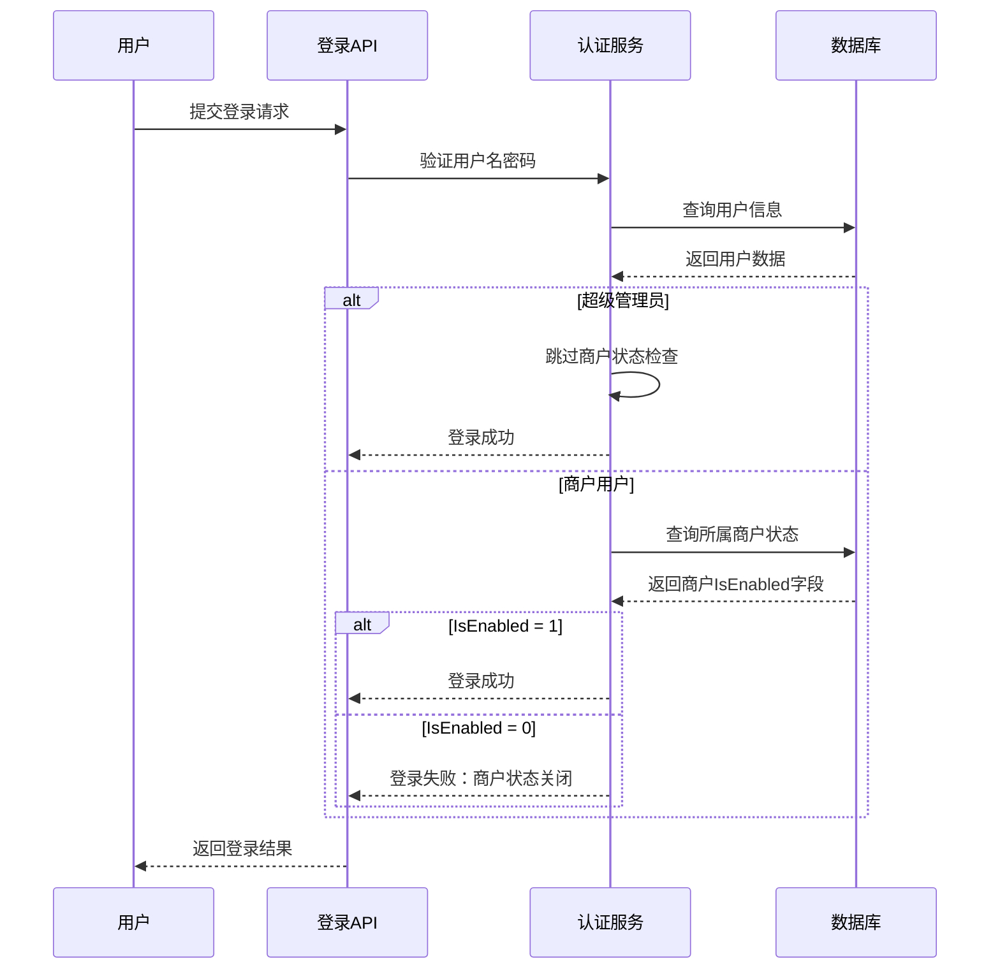
```mermaid
sequenceDiagram
    participant U as 用户
    participant API as 登录API
    participant AUTH as 认证服务
    participant DB as 数据库
    
    U->>API: 提交登录请求
    API->>AUTH: 验证用户名密码
    AUTH->>DB: 查询用户信息
    DB-->>AUTH: 返回用户数据
    
    alt 超级管理员
        AUTH->>AUTH: 跳过商户状态检查
        AUTH-->>API: 登录成功
    else 商户用户
        AUTH->>DB: 查询所属商户状态
        DB-->>AUTH: 返回商户IsEnabled字段
        
        alt IsEnabled = 1
            AUTH-->>API: 登录成功
        else IsEnabled = 0
            AUTH-->>API: 登录失败：商户状态关闭
        end
    end
    
    API-->>U: 返回登录结果
```

**错误提示信息**：
```json
{
    "code": 40303,
    "message": "商户状态关闭，请联系管理员",
    "data": {
        "merchantId": 2,
        "merchantName": "XX科技有限公司",
        "isEnabled": 0,
        "lastStatusChange": {
            "changeTime": "2024-01-02 15:00:00",
            "changeReason": "商户违规被禁用",
            "operatorName": "超级管理员"
        }
    }
}
```

**实现要点**：
1. 在用户登录时，需要同时查询用户所属商户的IsEnabled状态
2. 超级管理员不受商户状态限制，可以管理关闭的商户
3. 已登录的用户在商户被关闭后，需要在下次请求时进行状态检查
4. 提供明确的错误提示，帮助用户理解限制原因

### 商户层级关系设计

```mermaid
erDiagram
    SysMerchant ||--o{ SysMerchant : "父子关系"

    
    SysMerchant ||--o{ SysMerchant : "父子关系"
    SysMerchant ||--o{ SysUser : "拥有员工"
    SysMerchant ||--o{ SysAuthority : "拥有角色"
    SysMerchant ||--o{ SysMerchantStatusLog : "状态记录"
    
    SysUser }|--|| SysAuthority : "主角色"
    SysUser ||--o{ SysUserAuthority : "多角色"
    
    SysAuthority ||--o{ SysUserAuthority : "用户关联"
    
    SysMerchant {
        uint ID PK
        string MerchantCode UK
        string MerchantName
        string MerchantIcon
        uint ParentID FK
        string MerchantType
        int IsEnabled
        time ValidStartTime
        time ValidEndTime
        string MerchantLevel
        uint OperatorID FK
        string OperatorName
        uint OperatorMerchantID
        string OperatorMerchantName
    }
        uint OperatorID FK
        string OperatorName
        uint OperatorMerchantID
        string OperatorMerchantName
    }
    
    SysUser {
        uint ID PK
        string Username UK
        string Phone UK
        uint MerchantID FK
        uint AuthorityId FK
        bool Enable
    }
    
    SysAuthority {
        uint AuthorityId PK
        string AuthorityName
        uint MerchantID FK
        int RoleType
        uint ParentId FK
    }
    
    SysMerchantStatusLog {
        uint ID PK
        uint MerchantID FK
        string PreviousStatus
        string NewStatus
        string ChangeReason
        uint OperatorID FK
        string OperatorName
    }
```

### 商户层级结构示例

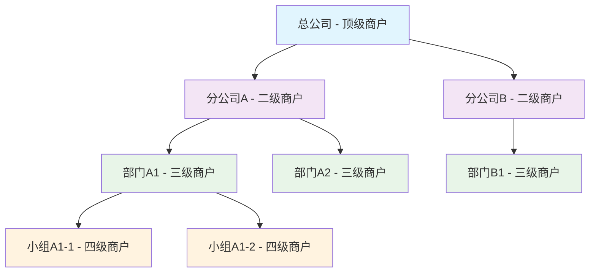
```mermaid
graph TD
    A[总公司 - 顶级商户]
    B[分公司A - 二级商户]
    C[分公司B - 二级商户]
    D[部门A1 - 三级商户]
    E[部门A2 - 三级商户]
    F[部门B1 - 三级商户]
    G[小组A1-1 - 四级商户]
    H[小组A1-2 - 四级商户]
    
    A --> B
    A --> C
    B --> D
    B --> E
    C --> F
    D --> G
    D --> H
    
    style A fill:#e1f5fe
    style B fill:#f3e5f5
    style C fill:#f3e5f5
    style D fill:#e8f5e8
    style E fill:#e8f5e8
    style F fill:#e8f5e8
    style G fill:#fff3e0
    style H fill:#fff3e0
```

**层级结构说明**：
- **顶级商户**：总公司（ParentID = NULL）
- **二级商户**：分公司A、B（ParentID = 1）
- **三级商户**：各部门（ParentID = 对应分公司ID）
- **四级商户**：小组（ParentID = 对应部门ID）
- **层级深度**：通过递归查询ParentID链条动态计算
- **层级路径**：通过递归查询ParentID链条动态构建

## 多租户API接口设计

### 接口规范说明
- 遵循 RESTful API 设计规范，增加商户上下文
- 统一使用 JSON 格式进行数据交换
- 扩展JWT认证，Token中包含当前用户身份和商户ID信息
- 集成商户维度的Casbin权限控制
- 所有业务接口自动进行商户数据隔离
- 支持多商户身份切换和上下文管理

### 多商户登录功能设计

支持同一用户在多个商户中拥有不同身份的智能登录功能。

#### 登录流程设计

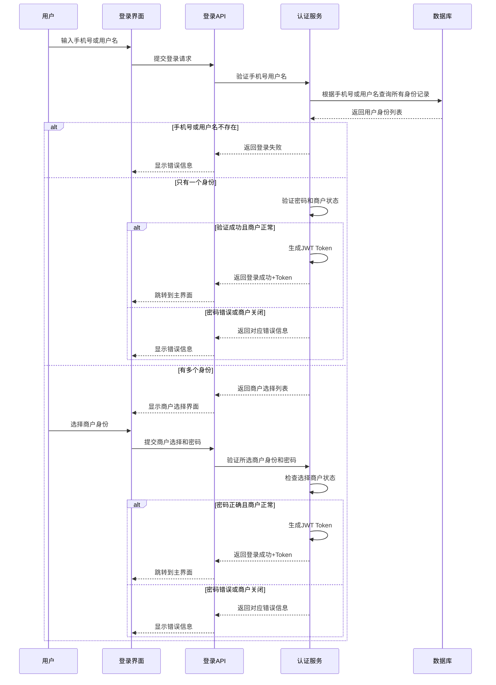
```mermaid
sequenceDiagram
    participant U as 用户
    participant LOGIN as 登录界面
    participant API as 登录API
    participant AUTH as 认证服务
    participant DB as 数据库
    
    U->>LOGIN: 输入手机号或用户名
    LOGIN->>API: 提交登录请求
    API->>AUTH: 验证手机号用户名
    AUTH->>DB: 根据手机号或用户名查询所有身份记录
    DB-->>AUTH: 返回用户身份列表
    
    alt 手机号或用户名不存在
        AUTH-->>API: 返回登录失败
        API-->>LOGIN: 显示错误信息
    else 只有一个身份
        AUTH->>AUTH: 验证密码和商户状态
        alt 验证成功且商户正常
            AUTH->>AUTH: 生成JWT Token
            AUTH-->>API: 返回登录成功+Token
            API-->>LOGIN: 跳转到主界面
        else 密码错误或商户关闭
            AUTH-->>API: 返回对应错误信息
            API-->>LOGIN: 显示错误信息
        end
    else 有多个身份
        AUTH-->>API: 返回商户选择列表
        API-->>LOGIN: 显示商户选择界面
        U->>LOGIN: 选择商户身份
        LOGIN->>API: 提交商户选择和密码
        API->>AUTH: 验证所选商户身份和密码
        AUTH->>AUTH: 检查选择商户状态
        alt 密码正确且商户正常
            AUTH->>AUTH: 生成JWT Token
            AUTH-->>API: 返回登录成功+Token
            API-->>LOGIN: 跳转到主界面
        else 密码错误或商户关闭
            AUTH-->>API: 返回对应错误信息
            API-->>LOGIN: 显示错误信息
        end
    end
```

#### 登录接口设计

**第一步：统一登录接口**
- **接口路径**：`POST /api/v1/auth/login`
- **请求参数**：

| 参数名 | 类型 | 必填 | 说明 |
|--------|------|------|------|
| identifier | string | 是 | 用户标识（手机号或用户名） |
| password | string | 是 | 密码 |

**响应格式** - 只有一个身份：
```json
{
    "code": 0,
    "message": "登录成功",
    "data": {
        "token": "eyJhbGciOiJIUzI1NiIsInR5cCI6IkpXVCJ9...",
        "user": {
            "id": 1,
            "username": "zhangsan_sales",
            "name": "张三",
            "phone": "13800138000",
            "merchantInfo": {
                "merchantId": 1,
                "merchantName": "XX科技有限公司",
                "merchantIcon": "/uploads/icons/merchant_1.png",
                "authorityId": 5,
                "authorityName": "销售经理",
                "roleType": 3
            }
        },
        "needMerchantSelect": false
    }
}
```

**响应格式** - 多个账户：
```json
{
    "code": 10001,
    "message": "请选择登录商户",
    "data": {
        "name": "张三",
        "identifier": "13800138000",
        "accounts": [
            {
                "id": 1,
                "merchantId": 1,
                "merchantName": "XX科技有限公司",
                "merchantIcon": "/uploads/icons/merchant_1.png",
                "username": "zhangsan_sales",
                "authorityName": "销售经理",
                "roleType": 3,
                "merchantStatus": "ACTIVE",
                "merchantEnabled": 1,
                "isDefault": true
            },
            {
                "id": 2,
                "merchantId": 2,
                "merchantName": "YY贸易有限公司",
                "merchantIcon": "/uploads/icons/merchant_2.png",
                "username": "zhangsan_tech",
                "authorityName": "技术顾问",
                "roleType": 3,
                "merchantStatus": "ACTIVE",
                "merchantEnabled": 1,
                "isDefault": false
            }
        ],
        "needMerchantSelect": true,
        "tempToken": "temp_token_for_merchant_selection"
    }
}
```

**第二步：商户身份选择接口**
- **接口路径**：`POST /api/v1/auth/select-identity`
- **请求参数**：

| 参数名 | 类型 | 必填 | 说明 |
|--------|------|------|------|
| identityId | uint | 是 | 选择的账户记录ID（sys_user.id） |
| tempToken | string | 是 | 临时令牌（用于验证） |

**响应格式**：
```json
{
    "code": 0,
    "message": "登录成功",
    "data": {
        "token": "eyJhbGciOiJIUzI1NiIsInR5cCI6IkpXVCJ9...",
        "user": {
            "id": 2,
            "username": "zhangsan_tech",
            "name": "张三",
            "phone": "13800138000",
            "merchantInfo": {
                "merchantId": 2,
                "merchantName": "YY贸易有限公司",
                "merchantIcon": "/uploads/icons/merchant_2.png",
                "authorityId": 8,
                "authorityName": "技术顾问",
                "roleType": 3
            }
        }
    }
}
```

#### JWT Token 扩展设计

在JWT Payload中增加用户账户和商户上下文信息：

```json
{
    "userId": 2,
    "username": "zhangsan_tech",
    "phone": "13800138000",
    "name": "张三",
    "merchantId": 2,
    "merchantName": "YY贸易有限公司",
    "authorityId": 8,
    "authorityName": "技术顾问",
    "roleType": 3,
    "iat": 1640995200,
    "exp": 1641081600
}
```

#### 账户切换功能

**账户切换接口**
- **接口路径**：`POST /api/v1/auth/switch-account`
- **权限要求**：需要已登录用户的有效Token
- **请求参数**：

| 参数名 | 类型 | 必填 | 说明 |
|--------|------|------|------|
| targetAccountId | uint | 是 | 目标账户记录ID |

**功能说明**：
- 用户在不退出的情况下切换到另一个商户账户
- 系统验证目标账户是否属于当前用户（相同手机号）
- 检查目标商户的状态和账户在该商户中的状态
- 生成新的JWT Token包含目标账户信息

#### 多账户登录会话管理机制

**会话管理核心设计**：

1. **临时令牌机制**：
   - 用户输入手机号后，系统检测到多账户情况时生成临时令牌
   - 临时令牌有效期：15分钟，仅用于商户选择阶段
   - 临时令牌包含：用户标识、可选商户列表、生成时间
   - 与IP地址绑定，防止临时令牌被盗用

2. **商户选择验证流程**：
   - 用户选择商户后输入密码
   - 系统验证临时令牌有效性和IP匹配
   - 验证用户在所选商户中的密码
   - 检查商户和账户状态是否正常

3. **正式会话建立**：
   - 验证通过后清理临时令牌
   - 生成包含完整商户上下文的JWT Token
   - 在Redis中存储用户会话信息
   - 前端存储Token并初始化商户上下文

**详细的会话管理流程**：

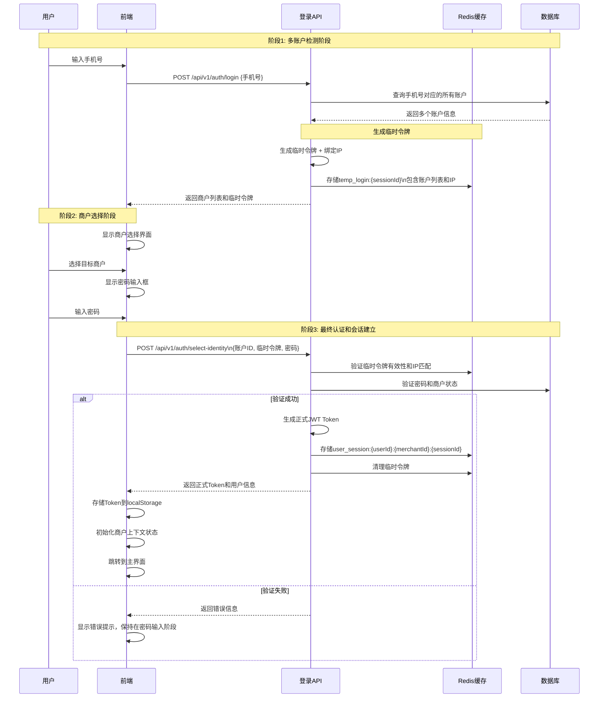
```mermaid
sequenceDiagram
    participant U as 用户
    participant F as 前端
    participant API as 登录API
    participant CACHE as Redis缓存
    participant DB as 数据库
    
    Note over U,DB: 阶段1: 多账户检测阶段
    U->>F: 输入手机号
    F->>API: POST /api/v1/auth/login {手机号}
    API->>DB: 查询手机号对应的所有账户
    DB-->>API: 返回多个账户信息
    
    Note over API,CACHE: 生成临时令牌
    API->>API: 生成临时令牌 + 绑定IP
    API->>CACHE: 存储temp_login:{sessionId}\n包含账户列表和IP
    API-->>F: 返回商户列表和临时令牌
    
    Note over U,F: 阶段2: 商户选择阶段
    F->>F: 显示商户选择界面
    U->>F: 选择目标商户
    F->>F: 显示密码输入框
    U->>F: 输入密码
    
    Note over F,DB: 阶段3: 最终认证和会话建立
    F->>API: POST /api/v1/auth/select-identity\n{账户ID, 临时令牌, 密码}
    API->>CACHE: 验证临时令牌有效性和IP匹配
    API->>DB: 验证密码和商户状态
    
    alt 验证成功
        API->>API: 生成正式JWT Token
        API->>CACHE: 存储user_session:{userId}:{merchantId}:{sessionId}
        API->>CACHE: 清理临时令牌
        API-->>F: 返回正式Token和用户信息
        F->>F: 存储Token到localStorage
        F->>F: 初始化商户上下文状态
        F->>F: 跳转到主界面
    else 验证失败
        API-->>F: 返回错误信息
        F->>F: 显示错误提示，保持在密码输入阶段
    end
```

**临时令牌安全机制**：

1. **临时令牌结构**：
   ```json
   {
       "tokenType": "TEMP_LOGIN",
       "identifier": "13800138000",
       "clientIP": "192.168.1.100",
       "availableAccounts": [
           {
               "accountId": 1,
               "merchantId": 1,
               "merchantName": "XX科技",
               "authorityName": "销售经理",
               "merchantStatus": "ACTIVE"
           }
       ],
       "expiresAt": 1640995200,
       "sessionId": "temp_session_uuid"
   }
   ```

2. **Redis缓存管理**：
   ```
   Key: temp_login:{sessionId}
   Value: {临时令牌数据}
   TTL: 900秒 (15分钟)
   ```

3. **安全限制措施**：
   - 临时令牌只能使用一次，使用后立即删除
   - 同一IP地址最多同时搁3个临时令牌
   - 临时令牌与IP地址绑定，在其他IP使用无效
   - 超过重试次数限制后自动锁定账户

**正式JWT Token管理**：

1. **Token Payload扩展**：
   ```json
   {
       "sub": "user_authentication",
       "userId": 2,
       "accountId": 2,
       "username": "zhangsan_tech",
       "phone": "13800138000",
       "name": "张三",
       "merchantContext": {
           "merchantId": 2,
           "merchantName": "YY贸易有限公司",
           "merchantCode": "YY_TRADE_001",
           "merchantType": "ENTERPRISE"
       },
       "authorities": {
           "authorityId": 8,
           "authorityName": "技术顾问",
           "roleType": 3,
           "permissions": [
               "merchant:info:view",
               "merchant:user:view"
           ]
       },
       "sessionInfo": {
           "loginTime": 1640995200,
           "loginIP": "192.168.1.100",
           "deviceType": "WEB",
           "sessionId": "session_uuid"
       },
       "iat": 1640995200,
       "exp": 1641081600,
       "jti": "session_uuid"
   }
   ```

2. **会话状态存储**：
   ```
   Key: user_session:{userId}:{merchantId}:{sessionId}
   Value: {
       "accountId": 2,
       "merchantId": 2,
       "loginTime": 1640995200,
       "lastActiveTime": 1640995800,
       "loginIP": "192.168.1.100",
       "deviceInfo": {
           "userAgent": "Mozilla/5.0...",
           "platform": "Web"
       },
       "permissions": ["merchant:info:view"],
       "isActive": true
   }
   TTL: 86400秒 (24小时)
   ```

**商户上下文状态管理**：

1. **前端状态管理策略**：
   - 从 JWT Token 中解析商户上下文信息
   - 在 Pinia Store 中统一管理商户状态
   - 支持商户切换和状态持久化
   - 页面刷新后自动恢复商户上下文

2. **后端会话验证机制**：
   - 解析请求中的 JWT Token
   - 验证 Redis 中的会话状态
   - 更新最后活跃时间
   - 设置请求上下文中的商户信息

**Token刷新接口**：
- **接口路径**：`POST /api/v1/auth/refresh`
- **请求头**：`Authorization: Bearer {current_token}`
- **响应格式**：
  ```json
  {
      "code": 0,
      "message": "Token刷新成功",
      "data": {
          "token": "new_jwt_token_here",
          "expiresAt": "2024-01-02T10:00:00Z"
      }
  }
  ```

**会话验证接口**：
- **接口路径**：`GET /api/v1/auth/validate`
- **功能说明**：验证当前Token和会话有效性，返回最新的用户和商户信息
- **响应格式**：
  ```json
  {
      "code": 0,
      "message": "会话有效",
      "data": {
          "isValid": true,
          "user": {
              "userId": 2,
              "username": "zhangsan_tech",
              "name": "张三",
              "merchantInfo": {
                  "merchantId": 2,
                  "merchantName": "YY贸易有限公司"
              }
          },
          "sessionInfo": {
              "loginTime": 1640995200,
              "lastActiveTime": 1640995800,
              "expiresAt": 1641081600
          }
      }
  }
  ```

**登出接口升级**：
- **接口路径**：`POST /api/v1/auth/logout`
- **功能增强**：清理Redis中的会话信息，支持全部设备登出选项
- **请求参数**：
  ```json
  {
      "logoutAll": false  // 是否登出所有设备
  }
  ```

**响应格式**：
```json
{
    "code": 0,
    "message": "账户切换成功",
    "data": {
        "token": "eyJhbGciOiJIUzI1NiIsInR5cCI6IkpXVCJ9...",
        "user": {
            "id": 3,
            "username": "zhangsan_finance",
            "name": "张三",
            "phone": "13800138000",
            "merchantInfo": {
                "merchantId": 3,
                "merchantName": "ZZ金融服务有限公司",
                "merchantIcon": "/uploads/icons/merchant_3.png",
                "authorityId": 12,
                "authorityName": "财务专员",
                "roleType": 3
            }
        }
    }
}
```

### 商户信息管理接口

#### 创建商户
- **接口路径**：`POST /api/v1/merchant`
- **权限要求**：系统管理员权限（不受商户限制）
- **请求参数**：

| 参数名 | 类型 | 必填 | 说明 |
|--------|------|------|------|
| merchantCode | string | 是 | 商户编码（全局唯一标识） |
| merchantName | string | 是 | 商户名称 |
| merchantIcon | string | 否 | 商户图标URL |
| parentId | uint | 否 | 父商户ID（不填为顶级商户） |
| merchantType | string | 是 | 商户类型（ENTERPRISE/INDIVIDUAL） |
| contactName | string | 是 | 联系人姓名 |
| contactPhone | string | 是 | 联系电话 |
| contactEmail | string | 是 | 联系邮箱 |
| businessLicense | string | 否 | 营业执照号 |
| legalPerson | string | 否 | 法人代表 |
| registeredAddress | string | 否 | 注册地址 |
| businessScope | string | 否 | 经营范围 |
| merchantLevel | string | 是 | 商户等级（BASIC/PREMIUM/VIP） |
| isEnabled | int | 否 | 商户开关状态（默认1-正常） |
| validStartTime | string | 否 | 有效开始时间 |
| validEndTime | string | 否 | 有效结束时间 |

**字段详细说明**：

1. **merchantCode**（必填）：
   - 商户唯一编码，在整个系统中必须唯一
   - 建议格式：`MERCH + 年份 + 序号`，如：`MERCH20240001`
   - 创建后不可修改，用于系统内部标识和外部接口调用
   - 支持字母、数字、下划线，长度6-32位
   - 系统会自动验证编码的唯一性

2. **merchantName**（必填）：
   - 商户显示名称，支持中文
   - 用于前端显示和业务交互
   - 长度限制：2-100字符

3. **parentId**（可选）：
   - 指定父商户，不填表示创建顶级商户
   - 系统会自动验证父商户的存在性和层级限制
   - 不能超过8级层级深度

**层级关系处理**：
- 系统会根据ParentID自动计算商户层级深度
- 如果超过8级限制，返回错误码40312
- 会自动构建完整的层级路径信息

**请求示例**：
```json
{
  "merchantCode": "MERCH20240005",
  "merchantName": "XX科技有限公司",
  "merchantIcon": "/uploads/icons/merchant_logo.png",
  "parentId": 1,
  "merchantType": "ENTERPRISE",
  "contactName": "张三",
  "contactPhone": "13800138000",
  "contactEmail": "contact@xxtech.com",
  "businessLicense": "91110000000000000X",
  "legalPerson": "张三",
  "registeredAddress": "北京市朝阳区XX路XX号",
  "businessScope": "技术开发、技术服务",
  "merchantLevel": "PREMIUM",
  "isEnabled": 1,
  "validStartTime": "2024-01-01 00:00:00",
  "validEndTime": "2024-12-31 23:59:59"
}
```

**字段验证规则**：
- **merchantCode**：系统自动检查全局唯一性，不允许重复
- **contactPhone**：验证手机号格式的合法性
- **contactEmail**：验证邮箱格式的合法性
- **businessLicense**：如果提供，验证营业执照号格式
- **parentId**：验证父商户存在性和层级限制
- **merchantType**：限定为ENTERPRISE或INDIVIDUAL
- **merchantLevel**：限定为BASIC、PREMIUM或VIP

**响应格式**：
```json
{
  "code": 0,
  "message": "创建成功",
  "data": {
    "merchantId": 5,
    "merchantCode": "MERCH20240005",
    "merchantName": "XX科技有限公司",
    "parentId": 1,
    "computedLevel": 2,
    "computedPath": "1/5",
    "operatorInfo": {
      "operatorId": 1,
      "operatorName": "超级管理员",
      "operatorMerchantId": 1,
      "operatorMerchantName": "默认商户"
    },
    "createdAt": "2024-01-01T10:00:00Z"
  }
}
```

**错误响应示例**：

1. **商户编码重复**：
```json
{
  "code": 40309,
  "message": "商户编码已存在",
  "data": {
    "merchantCode": "MERCH20240005",
    "existingMerchantId": 3,
    "existingMerchantName": "其他科技公司"
  }
}
```

2. **层级超过限制**：
```json
{
  "code": 40312,
  "message": "商户层级超过限制，最多支持8级商户结构",
  "data": {
    "currentLevel": 8,
    "maxLevel": 8,
    "parentMerchantId": 123,
    "parentMerchantName": "XX八级部门"
  }
}
```

3. **必填字段缺失**：
```json
{
  "code": 40001,
  "message": "参数验证失败",
  "data": {
    "errors": [
      {
        "field": "merchantCode",
        "message": "商户编码不能为空"
      },
      {
        "field": "contactPhone",
        "message": "联系电话格式不正确"
      }
    ]
  }
}
```

#### 查询商户层级结构
- **接口路径**：`GET /api/v1/merchant/tree`
- **权限要求**：根据角色自动过滤数据
- **查询参数**：

| 参数名 | 类型 | 必填 | 说明 |
|--------|------|------|------|
| rootId | uint | 否 | 指定根节点ID（不填则显示所有顶级商户） |
| maxLevel | int | 否 | 最大层级深度（限制展示层数） |
| includeInactive | bool | 否 | 是否包含非活跃商户 |

- **响应格式**：
```json
{
    "code": 0,
    "message": "获取成功",
    "data": {
        "merchantTree": [
            {
                "merchantId": 1,
                "merchantName": "总公司",
                "merchantIcon": "/uploads/icons/merchant_1.png",
                "parentId": null,
                "computedLevel": 1,
                "computedPath": "1",
                "isEnabled": 1,
                "children": [
                    {
                        "merchantId": 2,
                        "merchantName": "分公司A",
                        "merchantIcon": "/uploads/icons/merchant_2.png",
                        "parentId": 1,
                        "computedLevel": 2,
                        "computedPath": "1/2",
                        "isEnabled": 1,
                        "children": []
                    }
                ]
            }
        ]
    }
}
```

#### 查询商户子级列表
- **接口路径**：`GET /api/v1/merchant/:id/children`
- **权限要求**：商户管理员或系统管理员
- **功能说明**：获取指定商户的直接子级商户列表

#### 查询商户祖先路径
- **接口路径**：`GET /api/v1/merchant/:id/ancestors`
- **权限要求**：商户管理员或系统管理员
- **功能说明**：获取从根节点到当前商户的完整路径

#### 移动商户位置
- **接口路径**：`PUT /api/v1/merchant/:id/move`
- **权限要求**：仅系统管理员可操作
- **请求参数**：

| 参数名 | 类型 | 必填 | 说明 |
|--------|------|------|------|
| newParentId | uint | 否 | 新的父商户ID（NULL表示移动到顶级） |

**校验规则**：
- 不能将商户移动到其自身或其子孙节点下
- 移动后自动更新所有子孙节点的level和path

#### 查询商户列表
- **接口路径**：`GET /api/v1/merchant/list`
- **权限要求**：根据角色自动过滤数据
  - 系统管理员：可查看所有商户
  - 商户管理员：只能查看所属商户及其子级商户
- **查询参数**：

| 参数名 | 类型 | 必填 | 说明 |
|--------|------|------|------|
| page | int | 否 | 页码（默认1） |
| pageSize | int | 否 | 每页数量（默认10） |
| merchantName | string | 否 | 商户名称（模糊查询） |
| merchantType | string | 否 | 商户类型筛选 |
| isEnabled | int | 否 | 状态筛选（1-正常 0-关闭） |
| parentId | uint | 否 | 父商户ID筛选 |
| treeView | bool | 否 | 是否返回树形结构 |

#### 更新商户信息
- **接口路径**：`PUT /api/v1/merchant/:id`
- **权限要求**：商户管理员或系统管理员
- **数据隔离**：自动校验商户权限，只能修改所属商户

#### 商户状态管理
- **接口路径**：`PUT /api/v1/merchant/:id/status`
- **权限要求**：仅系统管理员可操作

#### 创建商户员工
- **接口路径**：`POST /api/v1/merchant/user`
- **权限要求**：商户管理员权限或超级管理员
- **功能说明**：
- 在当前商户中创建新员工或为一个手机号在当前商户中创建账户
- 支持同一手机号在不同商户中创建不同账户
- 每个账户拥有独立的用户名、密码、角色
- **请求参数**：

| 参数名 | 类型 | 必填 | 说明 |
|--------|------|------|------|
| phone | string | 是 | 手机号 |　（在当前商户内唯一）
| name | string | 是 | 真实姓名 |
| username | string | 是 | 登录用户名（在当前商户内唯一） |
| password | string | 是 | 登录密码 |
| email | string | 否 | 邮箱地址 |
| nickName | string | 否 | 显示昵称 |
| headerImg | string | 否 | 头像地址 |
| authorityId | uint | 是 | 角色ID（必须是当前商户的角色） |
| enable | int | 否 | 启用状态（默认1-启用） |

**业务逻辑**：
1. **创建新员工**：
   - 检查手机号和用户名在当前商户内是否已存在
   - 在当前商户中创建新的员工记录
   - 设置用户在该商户中的特定信息（用户名、角色、密码等）

2. **支持同一手机号在不同商户中创建账户**：
   - 同一手机号可以在不同商户中创建不同的员工账户
   - 每个账户拥有独立的用户名、密码、角色
   - 同一商户内手机号和用户名必须唯一

**响应格式**：
```json
{
    "code": 0,
    "message": "创建成功",
    "data": {
        "id": 5,
        "username": "lisi_sales",
        "name": "李四",
        "phone": "13800138001",
        "merchantId": 1,
        "authorityId": 6,
        "createdAt": "2024-01-01T10:00:00Z"
    }
}
```

#### 查询商户员工列表
- **接口路径**：`GET /api/v1/merchant/user/list`
- **权限要求**：商户管理员或超级管理员
- **数据隔离**：自动过滤，只返回当前商户的员工
- **查询参数**：

| 参数名 | 类型 | 必填 | 说明 |
|--------|------|------|------|
| page | int | 否 | 页码（默认1） |
| pageSize | int | 否 | 每页数量（默认10） |
| name | string | 否 | 姓名模糊查询 |
| phone | string | 否 | 手机号模糊查询 |
| username | string | 否 | 用户名模糊查询 |
| authorityId | uint | 否 | 角色ID筛选 |
| enable | int | 否 | 启用状态筛选 |

**响应格式**：
```json
{
    "code": 0,
    "message": "获取成功",
    "data": {
        "list": [
            {
                "id": 1,
                "username": "zhangsan_sales",
                "name": "张三",
                "phone": "13800138000",
                "email": "zhangsan@example.com",
                "nickName": "张三",
                "headerImg": "/uploads/avatar/zhangsan.jpg",
                "enable": 1,
                "merchantId": 1,
                "authorityInfo": {
                    "authorityId": 5,
                    "authorityName": "销售经理",
                    "roleType": 3
                },
                "createdAt": "2024-01-01T10:00:00Z",
                "hasOtherAccounts": true,
                "otherMerchantCount": 2
            }
        ],
        "total": 25,
        "page": 1,
        "pageSize": 10
    }
}
```

#### 员工账户状态管理
- **接口路径**：`PUT /api/v1/merchant/user/:id/status`
- **权限要求**：商户管理员或超级管理员
- **请求参数**：

| 参数名 | 类型 | 必填 | 说明 |
|--------|------|------|------|
| enable | bool | 是 | 在当前商户中的启用状态 |
| reason | string | 否 | 状态变更原因 |

**注意**：此操作仅影响该员工在当前商户中的状态，不影响其在其他商户中的账户。

#### 移除商户员工
- **接口路径**：`DELETE /api/v1/merchant/user/:id`
- **权限要求**：商户管理员或超级管理员
- **功能说明**：仅删除该员工在当前商户中的账户记录，不影响其在其他商户中的账户

**请求参数**：

| 参数名 | 类型 | 必填 | 说明 |
|--------|------|------|------|
| reason | string | 否 | 删除原因 |
| transferAuthorityId | uint | 否 | 如果该员工有待处理事务，转移给的角色ID |

**响应格式**：
```json
{
    "code": 0,
    "message": "移除成功",
    "data": {
        "removedAccountId": 5,
        "merchantId": 1,
        "hasOtherAccounts": false,
        "message": "已移除该用户在当前商户中的账户"
    }
}
```

### 员工角色权限管理接口

#### 获取商户内可分配角色权限
- **接口路径**：`GET /api/v1/merchant/role/permissions/assignable`
- **权限要求**：商户管理员或超级管理员
- **功能说明**：获取当前商户内可以分配给员工角色的权限列表

#### 分配角色权限
- **接口路径**：`PUT /api/v1/merchant/role/:roleId/permissions`
- **权限要求**：商户管理员或超级管理员
- **请求参数**：

| 参数名 | 类型 | 必填 | 说明 |
|--------|------|------|------|
| permissions | array | 是 | 权限代码数组 |

#### 员工角色分配
- **接口路径**：`PUT /api/v1/merchant/user/:userId/roles`
- **权限要求**：商户管理员或超级管理员
- **请求参数**：

| 参数名 | 类型 | 必填 | 说明 |
|--------|------|------|------|
| roleIds | array | 是 | 角色ID数组 |

### 商户权限分配管理接口

#### 获取可分配权限列表
- **接口路径**：`GET /api/v1/system/permissions/assignable`
- **权限要求**：仅超级管理员可操作
- **功能说明**：获取所有可以分配给商户管理员的权限列表
- **响应格式**：
```json
{
    "code": 0,
    "message": "获取成功",
    "data": {
        "permissions": [
            {
                "permissionCode": "merchant:info:view",
                "permissionName": "商户信息查看",
                "category": "merchant_info",
                "description": "查看商户基本信息",
                "isRequired": true
            },
            {
                "permissionCode": "merchant:info:update",
                "permissionName": "商户信息编辑",
                "category": "merchant_info",
                "description": "编辑商户基本信息",
                "isRequired": false
            },
            {
                "permissionCode": "merchant:user:list",
                "permissionName": "商户员工查看",
                "category": "employee_management",
                "description": "查看商户员工列表",
                "isRequired": false
            },
            {
                "permissionCode": "merchant:user:create",
                "permissionName": "商户员工创建",
                "category": "employee_management",
                "description": "创建新的商户员工",
                "isRequired": false
            },
            {
                "permissionCode": "merchant:user:update",
                "permissionName": "商户员工编辑",
                "category": "employee_management",
                "description": "编辑商户员工信息",
                "isRequired": false
            },
            {
                "permissionCode": "merchant:user:delete",
                "permissionName": "商户员工删除",
                "category": "employee_management",
                "description": "删除商户员工",
                "isRequired": false
            },
            {
                "permissionCode": "merchant:role:list",
                "permissionName": "商户角色查看",
                "category": "role_management",
                "description": "查看商户角色列表",
                "isRequired": false
            },
            {
                "permissionCode": "merchant:role:create",
                "permissionName": "商户角色创建",
                "category": "role_management",
                "description": "创建新的商户角色",
                "isRequired": false
            },
            {
                "permissionCode": "merchant:role:update",
                "permissionName": "商户角色编辑",
                "category": "role_management",
                "description": "编辑商户角色信息",
                "isRequired": false
            },
            {
                "permissionCode": "merchant:role:delete",
                "permissionName": "商户角色删除",
                "category": "role_management",
                "description": "删除商户角色",
                "isRequired": false
            }
        ],
        "categories": [
            {
                "categoryCode": "merchant_info",
                "categoryName": "商户信息管理",
                "description": "商户基本信息管理相关权限"
            },
            {
                "categoryCode": "employee_management",
                "categoryName": "员工管理",
                "description": "商户员工管理相关权限"
            },
            {
                "categoryCode": "role_management",
                "categoryName": "角色管理",
                "description": "商户角色管理相关权限"
            }
        ]
    }
}
```

#### 分配商户权限
- **接口路径**：`PUT /api/v1/merchant/:id/permissions`
- **权限要求**：仅超级管理员可操作
- **请求参数**：

| 参数名 | 类型 | 必填 | 说明 |
|--------|------|------|------|
| permissions | array | 是 | 权限代码数组 |
| assignToAdmin | bool | 否 | 是否同时分配给商户管理员 |

- **请求示例**：
```json
{
    "permissions": [
        "merchant:info:view",
        "merchant:info:update",
        "merchant:user:list",
        "merchant:user:create",
        "merchant:user:update",
        "merchant:role:list",
        "merchant:role:create"
    ],
    "assignToAdmin": true
}
```

- **响应格式**：
```json
{
    "code": 0,
    "message": "权限分配成功",
    "data": {
        "merchantId": 1,
        "assignedPermissions": [
            "merchant:info:view",
            "merchant:info:update",
            "merchant:user:list",
            "merchant:user:create",
            "merchant:user:update",
            "merchant:role:list",
            "merchant:role:create"
        ],
        "adminUserId": 2,
        "adminUpdated": true,
        "assignTime": "2024-01-01T10:00:00Z"
    }
}
```

#### 获取商户权限
- **接口路径**：`GET /api/v1/merchant/:id/permissions`
- **权限要求**：超级管理员或商户管理员
- **功能说明**：获取指定商户已分配的权限列表
- **响应格式**：
```json
{
    "code": 0,
    "message": "获取成功",
    "data": {
        "merchantId": 1,
        "merchantName": "XX科技有限公司",
        "permissions": [
            {
                "permissionCode": "merchant:info:view",
                "permissionName": "商户信息查看",
                "category": "merchant_info",
                "assignedAt": "2024-01-01T10:00:00Z",
                "assignedBy": "super_admin"
            }
        ],
        "lastUpdated": "2024-01-01T10:00:00Z"
    }
}
```

## 多租户业务流程设计

### 三级权限体系流程设计

#### 超级管理员分配商户权限流程

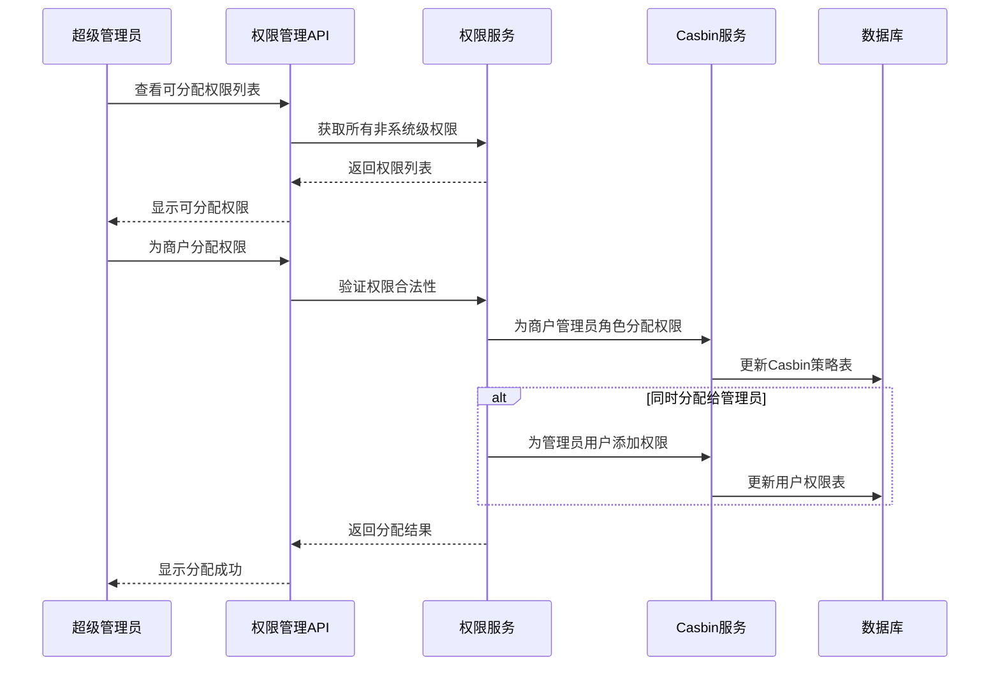
```mermaid
sequenceDiagram
    participant SA as 超级管理员
    participant API as 权限管理API
    participant PS as 权限服务
    participant CS as Casbin服务
    participant DB as 数据库
    
    SA->>API: 查看可分配权限列表
    API->>PS: 获取所有非系统级权限
    PS-->>API: 返回权限列表
    API-->>SA: 显示可分配权限
    
    SA->>API: 为商户分配权限
    API->>PS: 验证权限合法性
    PS->>CS: 为商户管理员角色分配权限
    CS->>DB: 更新Casbin策略表
    
    alt 同时分配给管理员
        PS->>CS: 为管理员用户添加权限
        CS->>DB: 更新用户权限表
    end
    
    PS-->>API: 返回分配结果
    API-->>SA: 显示分配成功
```

#### 商户管理员分配员工权限流程

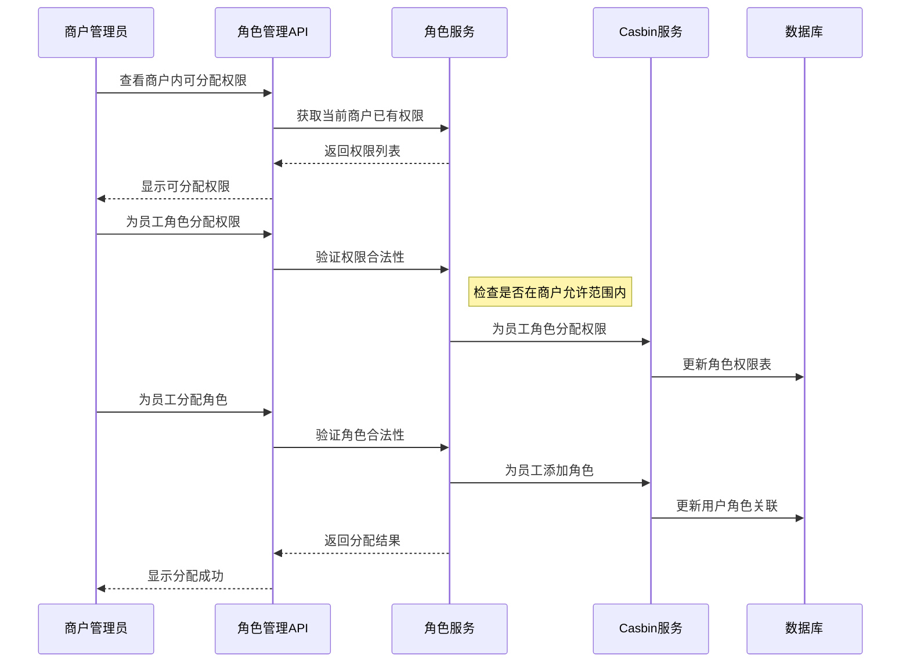
```mermaid
sequenceDiagram
    participant MA as 商户管理员
    participant API as 角色管理API
    participant RS as 角色服务
    participant CS as Casbin服务
    participant DB as 数据库
    
    MA->>API: 查看商户内可分配权限
    API->>RS: 获取当前商户已有权限
    RS-->>API: 返回权限列表
    API-->>MA: 显示可分配权限
    
    MA->>API: 为员工角色分配权限
    API->>RS: 验证权限合法性
    note right of RS: 检查是否在商户允许范围内
    RS->>CS: 为员工角色分配权限
    CS->>DB: 更新角色权限表
    
    MA->>API: 为员工分配角色
    API->>RS: 验证角色合法性
    RS->>CS: 为员工添加角色
    CS->>DB: 更新用户角色关联
    
    RS-->>API: 返回分配结果
    API-->>MA: 显示分配成功
```

### 商户移动操作流程

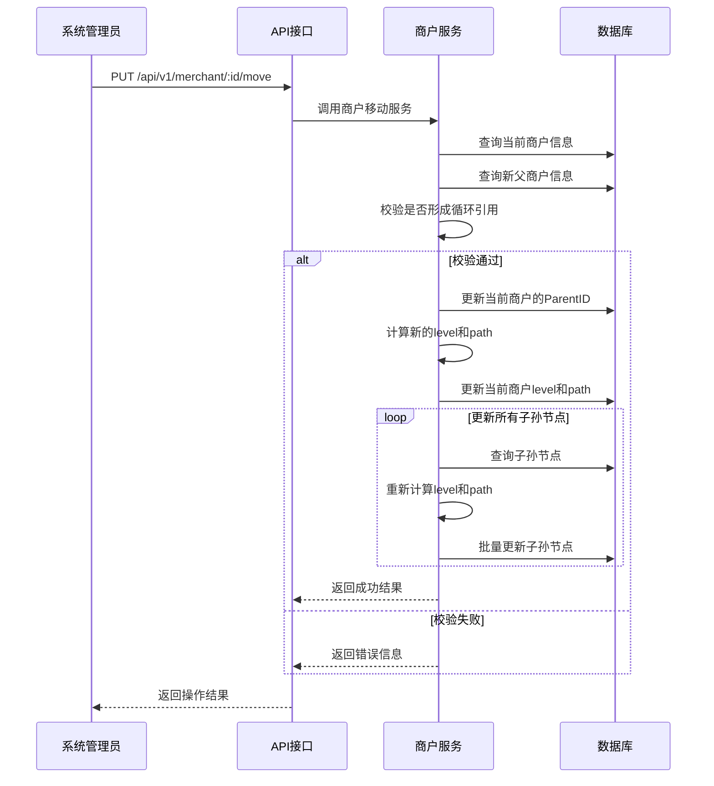
```mermaid
sequenceDiagram
    participant Admin as 系统管理员
    participant API as API接口
    participant MS as 商户服务
    participant DB as 数据库
    
    Admin->>API: PUT /api/v1/merchant/:id/move
    API->>MS: 调用商户移动服务
    
    MS->>DB: 查询当前商户信息
    MS->>DB: 查询新父商户信息
    MS->>MS: 校验是否形成循环引用
    
    alt 校验通过
        MS->>DB: 更新当前商户的ParentID
        MS->>MS: 计算新的level和path
        MS->>DB: 更新当前商户level和path
        
        loop 更新所有子孙节点
            MS->>DB: 查询子孙节点
            MS->>MS: 重新计算level和path
            MS->>DB: 批量更新子孙节点
        end
        
        MS-->>API: 返回成功结果
    else 校验失败
        MS-->>API: 返回错误信息
    end
    
    API-->>Admin: 返回操作结果
```

### 单一商户员工登录流程

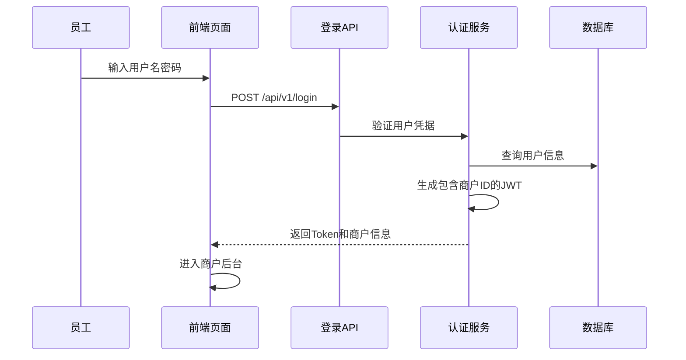
```mermaid
sequenceDiagram
    participant U as 员工
    participant F as 前端页面
    participant API as 登录API
    participant AUTH as 认证服务
    participant DB as 数据库
    
    U->>F: 输入用户名密码
    F->>API: POST /api/v1/login
    API->>AUTH: 验证用户凭据
    AUTH->>DB: 查询用户信息
    AUTH->>AUTH: 生成包含商户ID的JWT
    AUTH-->>F: 返回Token和商户信息
    F->>F: 进入商户后台
```

### 商户内数据隔离流程

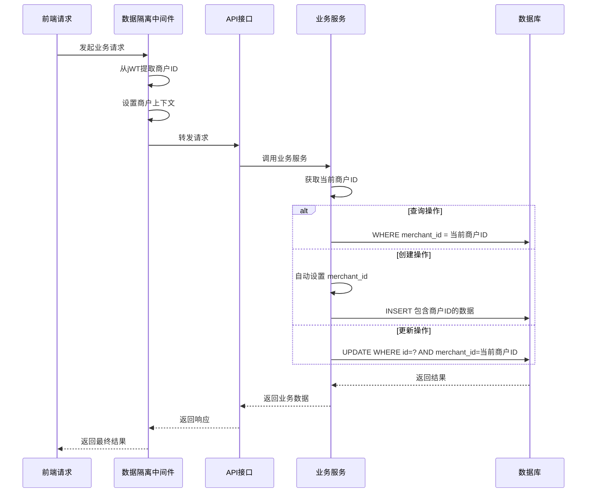
```mermaid
sequenceDiagram
    participant F as 前端请求
    participant MW as 数据隔离中间件
    participant API as API接口
    participant SVC as 业务服务
    participant DB as 数据库
    
    F->>MW: 发起业务请求
    MW->>MW: 从jWT提取商户ID
    MW->>MW: 设置商户上下文
    MW->>API: 转发请求
    
    API->>SVC: 调用业务服务
    SVC->>SVC: 获取当前商户ID
    
    alt 查询操作
        SVC->>DB: WHERE merchant_id = 当前商户ID
    else 创建操作
        SVC->>SVC: 自动设置 merchant_id
        SVC->>DB: INSERT 包含商户ID的数据
    else 更新操作
        SVC->>DB: UPDATE WHERE id=? AND merchant_id=当前商户ID
    end
    
    DB-->>SVC: 返回结果
    SVC-->>API: 返回业务数据
    API-->>MW: 返回响应
    MW-->>F: 返回最终结果
```

#### 数据隔离具体实现机制

**1. 数据隔离中间件设计**：

```go
// middleware/merchant_isolation.go
func MerchantDataIsolationMiddleware() gin.HandlerFunc {
    return func(c *gin.Context) {
        // 获取JWT中的商户信息
        claims, exists := c.Get("claims")
        if !exists {
            response.FailWithMessage("认证失败", c)
            c.Abort()
            return
        }
        
        waitUse := claims.(*systemReq.CustomClaims)
        
        // 超级管理员绕过数据隔离
        if waitUse.AuthorityId == "super_admin" {
            c.Set("bypassMerchantIsolation", true)
            c.Next()
            return
        }
        
        // 设置商户上下文
        merchantID := waitUse.MerchantID
        if merchantID == 0 {
            response.FailWithCodeMessage(40302, "商户上下文缺失", c)
            c.Abort()
            return
        }
        
        // 在上下文中设置商户ID
        c.Set("merchantID", merchantID)
        c.Set("userRole", waitUse.AuthorityId)
        c.Set("merchantContext", waitUse.MerchantContext)
        
        c.Next()
    }
}
```

**2. GORM自动过滤器设计**：

```go
// service/merchant_scope.go
// 商户数据过滤器
func MerchantScope(merchantID uint) func(db *gorm.DB) *gorm.DB {
    return func(db *gorm.DB) *gorm.DB {
        return db.Where("merchant_id = ?", merchantID)
    }
}

// 上下文提取器
func GetMerchantIDFromContext(c *gin.Context) (uint, error) {
    // 检查是否绕过数据隔离
    if bypass, exists := c.Get("bypassMerchantIsolation"); exists && bypass.(bool) {
        return 0, nil // 超级管理员不限制
    }
    
    merchantID, exists := c.Get("merchantID")
    if !exists {
        return 0, fmt.Errorf("商户上下文不存在")
    }
    
    return merchantID.(uint), nil
}

// 通用查询方法
func QueryWithMerchantScope(c *gin.Context, db *gorm.DB) *gorm.DB {
    merchantID, err := GetMerchantIDFromContext(c)
    if err != nil {
        // 记录错误日志
        return db.Where("1 = 0") // 返回空结果
    }
    
    if merchantID == 0 {
        // 超级管理员，不限制查询
        return db
    }
    
    return db.Scopes(MerchantScope(merchantID))
}
```

**3. 服务层数据隔离实现**：

```go
// service/sys_user.go - 用户服务改造
func (userService *UserService) GetUserInfoList(c *gin.Context, info request.PageInfo) (list interface{}, total int64, err error) {
    limit := info.PageSize
    offset := info.PageSize * (info.Page - 1)
    
    // 获取基础查询
    db := global.GVA_DB.Model(&system.SysUser{})
    
    // 应用商户数据隔离
    db = QueryWithMerchantScope(c, db)
    
    var userList []system.SysUser
    err = db.Count(&total).Error
    if err != nil {
        return nil, 0, err
    }
    
    // 预加载商户信息
    err = db.Limit(limit).Offset(offset).
        Preload("Authorities").
        Preload("Merchant").  // 预加载商户信息
        Find(&userList).Error
        
    return userList, total, err
}

func (userService *UserService) Register(c *gin.Context, u system.SysUser) (userInter system.SysUser, err error) {
    // 获取商户上下文
    merchantID, err := GetMerchantIDFromContext(c)
    if err != nil {
        return userInter, fmt.Errorf("无法获取商户上下文: %v", err)
    }
    
    if merchantID > 0 {
        // 自动设置商户ID
        u.MerchantID = merchantID
    }
    
    // 执行创建操作
    err = global.GVA_DB.Create(&u).Error
    return u, err
}

func (userService *UserService) SetUserInfo(c *gin.Context, reqUser system.SysUser) error {
    // 获取商户上下文进行权限校验
    db := QueryWithMerchantScope(c, global.GVA_DB)
    
    // 只能更新当前商户内的用户
    return db.Where("id = ?", reqUser.ID).
        Select("username", "nick_name", "email", "phone", "enable").
        Updates(&reqUser).Error
}
```

**4. API控制器改造**：

```go
// api/v1/system/sys_user.go
func (b *BaseApi) GetUserList(c *gin.Context) {
    var pageInfo request.PageInfo
    err := c.ShouldBindQuery(&pageInfo)
    if err != nil {
        response.FailWithMessage(err.Error(), c)
        return
    }
    
    // 传递上下文到服务层，自动应用数据隔离
    list, total, err := userService.GetUserInfoList(c, pageInfo)
    if err != nil {
        global.GVA_LOG.Error("获取失败!", zap.Error(err))
        response.FailWithMessage("获取失败", c)
        return
    }
    
    response.OkWithDetailed(response.PageResult{
        List:     list,
        Total:    total,
        Page:     pageInfo.Page,
        PageSize: pageInfo.PageSize,
    }, "获取成功", c)
}

func (b *BaseApi) Register(c *gin.Context) {
    var r request.Register
    err := c.ShouldBindJSON(&r)
    if err != nil {
        response.FailWithMessage(err.Error(), c)
        return
    }
    
    user := &system.SysUser{
        Username:    r.Username,
        NickName:    r.NickName,
        Password:    r.Password,
        AuthorityId: r.AuthorityId,
        // MerchantID 在服务层自动填充
    }
    
    userReturn, err := userService.Register(c, *user)
    if err != nil {
        response.FailWithDetailed(response.SysUserResponse{User: userReturn}, fmt.Sprintf("%v", err), c)
        return
    }
    
    response.OkWithDetailed(response.SysUserResponse{User: userReturn}, "用户创建成功", c)
}
```

**5. 数据模型适配**：

```go
// model/system/sys_user.go
type SysUser struct {
    global.GVA_MODEL
    UUID        uuid.UUID      `json:"uuid" gorm:"index;comment:用户UUID"`
    Username    string         `json:"userName" gorm:"index;comment:用户登录名"`
    Password    string         `json:"-" gorm:"comment:用户登录密码"`
    NickName    string         `json:"nickName" gorm:"default:系统用户;comment:用户昵称"`
    Phone       string         `json:"phone" gorm:"comment:用户手机号"`
    Email       string         `json:"email" gorm:"comment:用户邮箱"`
    Enable      int            `json:"enable" gorm:"default:1;comment:用户是否被冻结 1正常 2冻结"`
    AuthorityId string         `json:"authorityId" gorm:"default:888;comment:用户角色ID"`
    MerchantID  uint           `json:"merchantId" gorm:"index;comment:所属商户ID"` // 新增字段
    Authorities []SysAuthority `json:"authorities" gorm:"many2many:sys_user_authority;"`
    Merchant    *SysMerchant   `json:"merchant,omitempty" gorm:"foreignkey:MerchantID"` // 关联商户
}

// 表名
func (SysUser) TableName() string {
    return "sys_users"
}
```

**6. 批量操作的数据隔离**：

```go
// service/batch_operations.go
func (userService *UserService) DeleteUserByIds(c *gin.Context, ids []uint) (err error) {
    // 应用商户数据隔离
    db := QueryWithMerchantScope(c, global.GVA_DB)
    
    // 只能删除当前商户的用户
    return db.Where("id IN (?)", ids).Delete(&system.SysUser{}).Error
}

func (userService *UserService) SetUserAuthorities(c *gin.Context, id uint, authorityIds []string) (err error) {
    // 验证用户是否属于当前商户
    db := QueryWithMerchantScope(c, global.GVA_DB)
    
    var user system.SysUser
    err = db.Where("id = ?", id).First(&user).Error
    if err != nil {
        return fmt.Errorf("用户不存在或无权限访问")
    }
    
    // 执行权限更新操作...
    return nil
}
```

**7. 数据隔离安全校验**：

```go
// utils/security/merchant_validator.go
// 商户数据访问校验器
func ValidateMerchantAccess(c *gin.Context, targetMerchantID uint) error {
    currentMerchantID, err := GetMerchantIDFromContext(c)
    if err != nil {
        return fmt.Errorf("无法获取当前商户上下文")
    }
    
    // 超级管理员可以访问所有商户
    if currentMerchantID == 0 {
        return nil
    }
    
    // 检查目标商户是否为当前商户或其子商户
    if !IsMerchantAccessible(currentMerchantID, targetMerchantID) {
        return fmt.Errorf("无权访问目标商户数据")
    }
    
    return nil
}

// 商户层级访问权限检查
func IsMerchantAccessible(currentMerchantID, targetMerchantID uint) bool {
    if currentMerchantID == targetMerchantID {
        return true
    }
    
    // 检查目标商户是否为当前商户的子商户
    var targetMerchant model.SysMerchant
    err := global.GVA_DB.Where("id = ?", targetMerchantID).First(&targetMerchant).Error
    if err != nil {
        return false
    }
    
    // 解析层级路径，检查是否包含当前商户
    pathParts := strings.Split(targetMerchant.Path, "/")
    for _, part := range pathParts {
        if merchantID, _ := strconv.ParseUint(part, 10, 32); merchantID == uint64(currentMerchantID) {
            return true
        }
    }
    
    return false
}
```

**8. 数据隔离监控和日志**：

```go
// middleware/audit_log.go
func DataAccessAuditMiddleware() gin.HandlerFunc {
    return func(c *gin.Context) {
        start := time.Now()
        
        // 记录请求信息
        merchantID, _ := c.Get("merchantID")
        userRole, _ := c.Get("userRole")
        
        c.Next()
        
        // 记录访问日志
        duration := time.Since(start)
        logData := map[string]interface{}{
            "method":      c.Request.Method,
            "uri":         c.Request.RequestURI,
            "merchant_id": merchantID,
            "user_role":   userRole,
            "status":      c.Writer.Status(),
            "duration":    duration.Milliseconds(),
            "client_ip":   c.ClientIP(),
        }
        
        // 记录数据访问日志
        global.GVA_LOG.Info("数据访问日志", zap.Any("audit", logData))
    }
}
```

**9. 配置和初始化**：

```go
// initialize/router.go
func Routers() *gin.Engine {
    Router := gin.Default()
    
    // ... 其他中间件
    
    // 数据隔离中间件（在认证中间件之后）
    Router.Use(middleware.JWTAuth())
    Router.Use(middleware.MerchantDataIsolationMiddleware())
    Router.Use(middleware.DataAccessAuditMiddleware())
    
    // API 路由组
    PublicGroup := Router.Group("")
    {
        // 公开接口（登录等）
    }
    
    PrivateGroup := Router.Group("")
    PrivateGroup.Use(middleware.CasbinHandler())
    {
        // 需要数据隔离的接口
        systemRouter.InitUserRouter(PrivateGroup)
        systemRouter.InitAuthorityRouter(PrivateGroup)
        // ... 其他路由
    }
    
    return Router
}
```

**10. 前端数据隔离实现**：

```javascript
// utils/request.js - Axios拦截器扩展
// 自动添加商户上下文
request.interceptors.request.use(
    config => {
        const token = getToken()
        if (token) {
            config.headers['Authorization'] = `Bearer ${token}`
            
            // 从 Token 中提取商户信息
            const merchantInfo = getMerchantContextFromToken(token)
            if (merchantInfo && merchantInfo.merchantId) {
                config.headers['X-Merchant-ID'] = merchantInfo.merchantId
                config.headers['X-Merchant-Context'] = JSON.stringify(merchantInfo)
            }
        }
        return config
    },
    error => {
        return Promise.reject(error)
    }
)

// 响应拦截器 - 处理数据隔离错误
request.interceptors.response.use(
    response => {
        return response
    },
    error => {
        const { response } = error
        if (response?.status === 403 && response?.data?.code === 40301) {
            // 商户数据访问被拒绝
            ElMessage.error('无权访问该数据，请检查商户权限')
            return Promise.reject(error)
        }
        
        if (response?.status === 401 && response?.data?.code === 40302) {
            // 商户上下文缺失
            ElMessage.error('商户上下文异常，请重新登录')
            // 跳转到登录页
            router.push('/login')
            return Promise.reject(error)
        }
        
        return Promise.reject(error)
    }
)
```

```javascript
// stores/merchant.js - 商户上下文状态管理
export const useMerchantStore = defineStore('merchant', {
    state: () => ({
        currentMerchant: null,
        merchantContext: {
            merchantId: null,
            merchantName: '',
            permissions: []
        },
        dataScope: 'MERCHANT' // 'GLOBAL' | 'MERCHANT' | 'DEPARTMENT'
    }),
    
    getters: {
        // 判断当前用户是否为超级管理员
        isSuperAdmin: (state) => {
            const userStore = useUserStore()
            return userStore.userInfo.authorityId === 'super_admin'
        },
        
        // 获取数据范围标识
        getDataScope: (state) => {
            if (this.isSuperAdmin) return 'GLOBAL'
            return state.dataScope
        }
    },
    
    actions: {
        // 初始化商户上下文
        initMerchantContext(tokenPayload) {
            if (tokenPayload.merchantContext) {
                this.merchantContext = tokenPayload.merchantContext
                this.currentMerchant = {
                    merchantId: tokenPayload.merchantContext.merchantId,
                    merchantName: tokenPayload.merchantContext.merchantName
                }
                this.dataScope = 'MERCHANT'
            } else {
                // 超级管理员
                this.dataScope = 'GLOBAL'
            }
        },
        
        // 验证数据访问权限
        validateDataAccess(targetMerchantId) {
            if (this.isSuperAdmin) return true
            if (!this.merchantContext.merchantId) return false
            
            // 只能访问当前商户数据
            return this.merchantContext.merchantId === targetMerchantId
        }
    }
})
```

```vue
<!-- components/MerchantDataFilter.vue - 数据过滤组件 -->
<template>
  <div class="merchant-data-filter">
    <!-- 超级管理员显示商户选择器 -->
    <el-select 
      v-if="merchantStore.isSuperAdmin" 
      v-model="selectedMerchantId"
      placeholder="选择商户"
      clearable
      @change="handleMerchantChange"
    >
      <el-option label="全部商户" :value="null" />
      <el-option 
        v-for="merchant in availableMerchants"
        :key="merchant.id"
        :label="merchant.merchantName"
        :value="merchant.id"
      />
    </el-select>
    
    <!-- 商户管理员显示当前商户信息 -->
    <div v-else class="current-merchant-info">
      <el-tag type="info">
        当前商户：{{ merchantStore.merchantContext.merchantName }}
      </el-tag>
    </div>
  </div>
</template>

<script setup>
import { ref, computed, onMounted } from 'vue'
import { useMerchantStore } from '@/stores/merchant'

const merchantStore = useMerchantStore()
const selectedMerchantId = ref(null)
const availableMerchants = ref([])

const emit = defineEmits(['merchant-change'])

function handleMerchantChange(merchantId) {
  emit('merchant-change', merchantId)
}

onMounted(async () => {
  if (merchantStore.isSuperAdmin) {
    // 加载所有商户列表
    try {
      const response = await getMerchantList()
      availableMerchants.value = response.data.list
    } catch (error) {
      console.error('加载商户列表失败:', error)
    }
  }
})
</script>
```

**11. 数据隔离测试策略**：

```javascript
// tests/unit/data-isolation.test.js
describe('数据隔离测试', () => {
  describe('中间件测试', () => {
    test('应该正确提取商户上下文', () => {
      const mockContext = {
        get: jest.fn().mockImplementation((key) => {
          if (key === 'claims') {
            return {
              MerchantID: 123,
              AuthorityId: 'merchant_admin'
            }
          }
        }),
        set: jest.fn()
      }
      
      // 模拟中间件执行
      const middleware = MerchantDataIsolationMiddleware()
      middleware(mockContext, () => {})
      
      expect(mockContext.set).toHaveBeenCalledWith('merchantID', 123)
    })
    
    test('超级管理员应该绕过数据隔离', () => {
      const mockContext = {
        get: jest.fn().mockReturnValue({
          AuthorityId: 'super_admin'
        }),
        set: jest.fn()
      }
      
      const middleware = MerchantDataIsolationMiddleware()
      middleware(mockContext, () => {})
      
      expect(mockContext.set).toHaveBeenCalledWith('bypassMerchantIsolation', true)
    })
  })
  
  describe('服务层数据隔离测试', () => {
    test('查询时应该自动添加商户过滤条件', () => {
      const mockContext = {
        get: jest.fn().mockImplementation((key) => {
          if (key === 'merchantID') return 123
          if (key === 'bypassMerchantIsolation') return false
        })
      }
      
      const mockDB = {
        Where: jest.fn().mockReturnThis(),
        Find: jest.fn()
      }
      
      const result = QueryWithMerchantScope(mockContext, mockDB)
      expect(mockDB.Where).toHaveBeenCalledWith('merchant_id = ?', 123)
    })
    
    test('创建操作应该自动设置商户ID', async () => {
      const mockContext = {
        get: jest.fn().mockReturnValue(123)
      }
      
      const userService = new UserService()
      const userData = {
        Username: 'testuser',
        NickName: '测试用户'
      }
      
      await userService.Register(mockContext, userData)
      expect(userData.MerchantID).toBe(123)
    })
  })
  
  describe('安全性测试', () => {
    test('不同商户用户无法访问对方数据', async () => {
      const merchantAContext = { get: () => 1 }
      const merchantBContext = { get: () => 2 }
      
      // 商户A创建用户
      const userA = await userService.Register(merchantAContext, {
        Username: 'userA'
      })
      
      // 商户B尝试访问商户A的用户
      const userList = await userService.GetUserInfoList(merchantBContext, {
        Page: 1,
        PageSize: 10
      })
      
      expect(userList.list).not.toContain(userA)
    })
    
    test('跨商户数据操作应该被限制', async () => {
      const merchantAContext = { get: () => 1 }
      const merchantBContext = { get: () => 2 }
      
      // 商户A创建用户
      const userA = await userService.Register(merchantAContext, {
        Username: 'userA'
      })
      
      // 商户B尝试修改商户A的用户
      await expect(
        userService.SetUserInfo(merchantBContext, {
          ID: userA.ID,
          NickName: '修改后的名称'
        })
      ).rejects.toThrow()
    })
  })
})
```

```go
// tests/integration/data_isolation_test.go
func TestDataIsolation(t *testing.T) {
    // 初始化测试数据库
    db := setupTestDB()
    defer db.Close()
    
    t.Run("数据隔离基础功能测试", func(t *testing.T) {
        // 创建测试商户
        merchant1 := createTestMerchant("merchant1")
        merchant2 := createTestMerchant("merchant2")
        
        // 创建不同商户的用户
        user1 := createTestUser(merchant1.ID, "user1")
        user2 := createTestUser(merchant2.ID, "user2")
        
        // 测试商户1的上下文
        ctx1 := createMerchantContext(merchant1.ID)
        userList1 := getUserList(ctx1)
        
        assert.Len(t, userList1, 1)
        assert.Equal(t, user1.ID, userList1[0].ID)
        
        // 测试商户2的上下文
        ctx2 := createMerchantContext(merchant2.ID)
        userList2 := getUserList(ctx2)
        
        assert.Len(t, userList2, 1)
        assert.Equal(t, user2.ID, userList2[0].ID)
    })
    
    t.Run("超级管理员数据访问测试", func(t *testing.T) {
        // 超级管理员上下文
        superAdminCtx := createSuperAdminContext()
        allUsers := getUserList(superAdminCtx)
        
        // 应该能看到所有商户的用户
        assert.Len(t, allUsers, 2)
    })
}
```

**12. 性能优化和监控**：

```go
// utils/performance/data_isolation_metrics.go
// 数据隔离性能监控
func MonitorDataIsolationPerformance() gin.HandlerFunc {
    return func(c *gin.Context) {
        start := time.Now()
        
        c.Next()
        
        duration := time.Since(start)
        
        // 记录数据隔离相关指标
        merchantID, _ := c.Get("merchantID")
        if merchantID != nil {
            // 监控数据隔离查询性能
            prometheus.RecordDataIsolationLatency(
                c.Request.Method,
                c.FullPath(),
                fmt.Sprintf("%d", merchantID),
                duration,
            )
        }
    }
}

// 数据隔离查询优化建议
func OptimizeDataIsolationQuery(db *gorm.DB, merchantID uint) *gorm.DB {
    // 添加合适的索引提示
    return db.Scopes(MerchantScope(merchantID)).
        Select("*").  // 明确指定需要的字段
        Order("id DESC") // 优化排序
}
```


### 原有系统界面兼容性改造

#### 员工列表页面改造

**前端页面修改（user.vue）**

1. **表格列增加**
   - 在现有表格中增加"商户信息"列，显示商户ID和商户名称
   - 位置：在"用户角色"列之后，"状态"列之前

2. **搜索条件扩展**
   - 增加商户筛选下拉框，支持按商户过滤员工列表
   - 超级管理员可看到所有商户选项
   - 商户管理员只能看到自己的商户及子商户

3. **数据获取逻辑**
   - 调用API时自动根据当前用户权限过滤数据
   - 界面显示时关联查询商户信息

**后端接口修改（GetUserList）**

1. **请求参数扩展**
   - GetUserList结构体增加MerchantId字段，支持按商户筛选
   - 增加MerchantName字段，支持按商户名称模糊搜索

2. **查询逻辑增强**
   - 在GetUserInfoList方法中增加商户关联查询
   - 使用Preload加载商户信息
   - 根据用户权限自动过滤可见数据范围

3. **返回数据结构**
   - SysUser结构体关联Merchant信息
   - 返回数据包含完整的商户ID和商户名称

#### 角色列表页面改造

**前端页面修改（authority.vue）**

1. **表格列增加**
   - 在现有表格中增加"所属商户"列，显示商户ID和商户名称
   - 位置：在"角色名称"列之后，"更新时间"列之前

2. **商户筛选功能**
   - 增加商户下拉筛选器
   - 根据用户权限控制可见商户范围

3. **角色创建/编辑**
   - 新增角色时需要选择所属商户
   - 商户管理员只能在自己的商户下创建角色

**后端接口修改（GetAuthorityList）**

1. **查询逻辑修改**
   - GetAuthorityInfoList方法增加商户过滤逻辑
   - 根据当前用户的商户权限过滤角色列表
   - 支持商户层级查询（父子商户关系）

2. **数据关联**
   - SysAuthority结构体关联Merchant信息
   - 查询时预加载商户数据

#### 接口兼容性设计

**请求参数结构扩展**

| 接口 | 原有参数 | 新增参数 | 说明 |
|------|----------|----------|---------|
| GetUserList | Username, NickName, Phone, Email | MerchantId, MerchantName | 商户筛选支持 |
| GetAuthorityList | PageInfo | MerchantId, MerchantName | 商户角色筛选 |

**响应数据结构扩展**

| 实体 | 原有字段 | 新增字段 | 说明 |
|------|----------|----------|---------|
| SysUser | 基础用户信息 | MerchantId, MerchantName, Merchants | 商户关联信息 |
| SysAuthority | 基础角色信息 | MerchantId, MerchantName | 商户归属信息 |

**权限控制策略**

1. **数据可见性**
   - 超级管理员：查看所有商户的员工和角色
   - 商户管理员：仅查看本商户及子商户的员工和角色
   - 普通员工：仅查看本人信息

2. **操作权限**
   - 员工管理：只能管理所属商户范围内的员工
   - 角色管理：只能管理所属商户的角色
   - 跨商户操作需要相应权限验证

#### 界面交互优化

**商户信息展示**
- 采用两行显示格式：第一行显示商户名称，第二行显示商户ID
- 使用颜色区分不同商户，提升用户体验
- 支持点击商户名称快速筛选该商户下的数据

**筛选器设计**
- 商户下拉框支持搜索功能
- 记住用户的筛选偏好
- 提供"全部商户"选项（仅超级管理员可见）

**兼容性保证**
- 现有功能保持不变
- 新增字段采用非必填设计
- 向前兼容旧版本API调用

#### 现有员工登录界面改造

#### 登录流程优化设计

**多商户员工登录场景分析**：
- 员工在登录时，系统检查该手机号或用户名是否在多个商户中有账户
- 如果员工只属于一个商户：直接进入该商户后台
- 如果员工属于多个商户：显示商户选择界面，让用户选择要进入的商户
- 保持现有单商户用户体验不变，多商户功能对原用户透明

#### 多商户登录流程

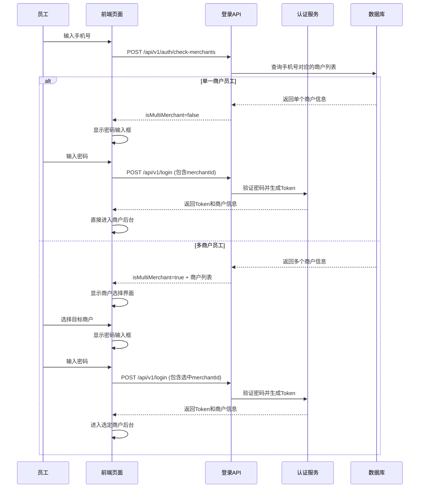
```mermaid
sequenceDiagram
    participant U as 员工
    participant F as 前端页面
    participant API as 登录API
    participant AUTH as 认证服务
    participant DB as 数据库
    
    U->>F: 输入手机号
    F->>API: POST /api/v1/auth/check-merchants
    API->>DB: 查询手机号对应的商户列表
    
    alt 单一商户员工
        DB-->>API: 返回单个商户信息
        API-->>F: isMultiMerchant=false
        F->>F: 显示密码输入框
        U->>F: 输入密码
        F->>API: POST /api/v1/login (包含merchantId)
        API->>AUTH: 验证密码并生成Token
        AUTH-->>F: 返回Token和商户信息
        F->>F: 直接进入商户后台
    else 多商户员工
        DB-->>API: 返回多个商户信息
        API-->>F: isMultiMerchant=true + 商户列表
        F->>F: 显示商户选择界面
        U->>F: 选择目标商户
        F->>F: 显示密码输入框
        U->>F: 输入密码
        F->>API: POST /api/v1/login (包含选中merchantId)
        API->>AUTH: 验证密码并生成Token
        AUTH-->>F: 返回Token和商户信息
        F->>F: 进入选定商户后台
    end
```

#### 登录接口扩展

**现有登录接口修改（/api/v1/base/login）**

**请求参数扩展**：
| 参数名 | 类型 | 必填 | 说明 |
|--------|------|------|------|
| username | string | 是 | 用户名或手机号 |
| password | string | 是 | 密码 |
| captcha | string | 否 | 验证码 |
| captchaId | string | 否 | 验证码ID |
| merchantId | uint | 否 | 选择的商户ID（多商户时必填） |

**响应数据结构扩展**：
```json
{
  "code": 0,
  "message": "登录成功",
  "data": {
    "user": {
      "userName": "admin",
      "nickName": "管理员",
      "uuid": "xxx-xxx-xxx",
      "userId": 1,
      "authorityId": "super_admin",
      "merchantId": 1,
      "merchantName": "XX科技有限公司",
      "roleType": 2,
      "phone": "13800138000"
    },
    "token": "jwt_token_here",
    "expiresAt": "2024-01-01T10:00:00Z"
  }
}
```

#### 商户选择页面设计

**页面路由设计**
- 路由地址：在登录页面内部状态切换，不单独设置路由
- 页面状态：`loginStep: 'phone' | 'merchant-select' | 'password'`

**商户选择界面组件**
```vue
<template>
  <div class="merchant-select-container">
    <div class="select-header">
      <h3>选择工作商户</h3>
      <p>检测到您在多个商户中有账户，请选择要登录的商户</p>
    </div>
    
    <div class="merchant-list">
      <div 
        v-for="merchant in merchants" 
        :key="merchant.merchantId"
        class="merchant-item"
        :class="{ active: selectedMerchantId === merchant.merchantId }"
        @click="selectMerchant(merchant)"
      >
        <div class="merchant-icon">
          
          <div v-else class="default-icon">{{ merchant.merchantName.charAt(0) }}</div>
        </div>
        <div class="merchant-info">
          <h4>{{ merchant.merchantName }}</h4>
          <span class="role-tag">{{ merchant.userRole }}</span>
        </div>
        <div class="select-indicator">
          <el-icon v-if="selectedMerchantId === merchant.merchantId"><Check /></el-icon>
        </div>
      </div>
    </div>
    
    <div class="action-buttons">
      <el-button @click="goBack">返回</el-button>
      <el-button type="primary" :disabled="!selectedMerchantId" @click="continueLogin">
        继续登录
      </el-button>
    </div>
  </div>
</template>
```

**交互逻辑**：
1. 用户输入手机号后，自动检测多商户身份
2. 如果是多商户，显示商户选择界面
3. 用户选择商户后，显示密码输入框
4. 提交登录时携带选中的商户ID
5. 支持返回重新选择商户

#### 前端状态管理

**登录状态管理扩展**
```javascript
// stores/auth.js
export const useAuthStore = defineStore('auth', {
  state: () => ({
    loginStep: 'phone', // 'phone' | 'merchant-select' | 'password'
    phoneNumber: '',
    isMultiMerchant: false,
    availableMerchants: [],
    selectedMerchantId: null,
    selectedMerchant: null
  }),
  
  actions: {
    // 检测多商户身份
    async checkMerchants(phone) {
      const response = await checkMerchants({ phone })
      this.phoneNumber = phone
      this.isMultiMerchant = response.data.isMultiMerchant
      this.availableMerchants = response.data.merchants || []
      
      if (this.isMultiMerchant) {
        this.loginStep = 'merchant-select'
      } else {
        this.loginStep = 'password'
        // 单商户时自动设置商户ID
        if (this.availableMerchants.length > 0) {
          this.selectedMerchantId = this.availableMerchants[0].merchantId
          this.selectedMerchant = this.availableMerchants[0]
        }
      }
    },
    
    // 选择商户
    selectMerchant(merchant) {
      this.selectedMerchantId = merchant.merchantId
      this.selectedMerchant = merchant
      this.loginStep = 'password'
    },
    
    // 登录
    async login(password) {
      const loginData = {
        username: this.phoneNumber,
        password,
        merchantId: this.selectedMerchantId
      }
      
      const response = await login(loginData)
      // 处理登录成功逻辑
      return response
    },
    
    // 重置状态
    resetLoginState() {
      this.loginStep = 'phone'
      this.phoneNumber = ''
      this.isMultiMerchant = false
      this.availableMerchants = []
      this.selectedMerchantId = null
      this.selectedMerchant = null
    }
  }
})
```

#### 兼容性保障措施

**1. 现有用户体验保持不变**
- 单商户员工登录流程保持不变，直接进入后台系统
- 登录界面UI保持原有设计，用户无感知
- 现有的自动登录、图片验证码、记住密码等功能正常工作

**2. 多商户功能透明升级**
- 对现有单商户用户无任何影响
- 多商户功能仅在需要时才会显示，不会干扰现有用户
- 支持渐进式升级，新增多商户员工时自动生效

**3. 错误处理和降级**
- 商户检测接口失败时，默认使用单商户模式
- 商户状态关闭时提供明确的错误提示
- 网络异常时，保留基础的登录功能


    merchantCount: 0,
    isMultiMerchant: false,
    userMerchants: []
  }),
  
  actions: {
    // 登录方法增强
    async login(loginForm) {
      const response = await login(loginForm)
      
      // 保存用户基础信息
      this.userInfo = response.data.user
      this.token = response.data.token
      this.merchantCount = response.data.user.merchantCount
      this.isMultiMerchant = response.data.user.isMultiMerchant
      
      // 设置Token
      setToken(response.data.token)
      
      // 如果是多商户用户，获取商户列表
      if (this.isMultiMerchant) {
        await this.fetchUserMerchants()
      }
      
      return response.data
    },
    
    // 获取用户商户列表
    async fetchUserMerchants() {
      const response = await getUserMerchants()
      this.userMerchants = response.data.merchants
      
      
})
```

#### 兼容性保障措施

**1. 现有用户体验保持不变**
- 现有单商户用户登录后直接进入后台，无需额外选择
- 登录界面UI保持原有设计，用户无感知
- 现有的自动登录、记住密码等功能正常工作

**2. 渐进式升级支持**
- 支持用户逐步被添加到多个商户
- 首次成为多商户用户时，引导用户了解商户选择功能
#### 兼容性保障措施

**1. 现有用户体验保持不变**
- 员工登录后直接进入所属商户的后台系统
- 登录界面UI保持原有设计，用户无感知
- 现有的自动登录、记住密码等功能正常工作

**2. 错误处理和降级**
- 商户状态关闭时提供明确的错误提示
- 网络异常时，保留基础的登录功能


## 多租户前端组件架构

### 商户层级管理组件结构

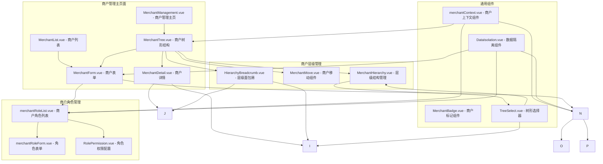
```mermaid
graph TB
    subgraph "商户管理主页面"
        A[MerchantManagement.vue - 商户管理主页]
        B[MerchantList.vue - 商户列表]
        C[MerchantTree.vue - 商户树形结构]
        D[MerchantForm.vue - 商户表单]
        E[MerchantDetail.vue - 商户详情]
    end
    
    subgraph "商户层级管理"
        F[MerchantHierarchy.vue - 层级结构管理]
        G[MerchantMove.vue - 商户移动组件]
        H[HierarchyBreadcrumb.vue - 层级面包屑]
    end
    

    
    subgraph "商户角色管理"
        K[merchantRoleList.vue - 商户角色列表]
        L[merchantRoleForm.vue - 角色表单]
        M[RolePermission.vue - 角色权限配置]
    end
    
    subgraph "通用组件"
        Q[merchantContext.vue - 商户上下文组件]
        R[DataIsolation.vue - 数据隔离组件]
        S[MerchantBadge.vue - 商户标记组件]
        T[TreeSelect.vue - 树形选择器]
    end
    
    A --> C
    B --> D
    C --> D
    C --> E
    C --> F
    C --> G
    C --> H
    D --> K
    D --> N
    E --> I
    E --> J
    F --> T
    H --> I
    H --> J
    K --> L
    K --> M
    N --> O
    N --> P
    
    Q --> C
    Q --> K
    Q --> N
    R --> D
    R --> K
    R --> N
    T --> F
    T --> I
```

### 商户层级组件设计说明

#### 商户树形结构组件（MerchantTree.vue）
- **功能职责**：以树形结构展示商户层级关系
- **交互功能**：支持节点展开/折叠、拖拽排序、右键菜单
- **操作支持**：新增子商户、编辑商户、移动商户、删除商户
- **数据加载**：支持懒加载和全量加载两种模式

#### 层级结构管理组件（MerchantHierarchy.vue）
- **功能职责**：提供商户层级结构的全面管理界面
- **视图切换**：支持树形视图、列表视图、组织架构图等多种展示方式
- **搜索过滤**：支持按商户名称、层级、状态等条件进行过滤
- **批量操作**：支持批量更改状态、批量移动等操作

#### 商户移动组件（MerchantMove.vue）
- **功能职责**：处理商户在层级结构中的移动操作
- **选择器**：提供树形选择器选择新的父商户
- **校验机制**：防止循环引用、防止移动到子节点
- **影响预览**：显示移动后将影响的所有子孙节点

#### 层级面包屑组件（HierarchyBreadcrumb.vue）
- **功能职责**：展示当前商户在层级结构中的位置
- **导航功能**：点击面包屑中的任意层级可快速导航
- **层级信息**：显示每个层级的商户名称和状态
- **响应式设计**：在移动设备上自动折叠显示

#### 树形选择器组件（TreeSelect.vue）
- **功能职责**：为表单提供层级商户选择功能
- **选择模式**：支持单选、多选、级联选择等模式
- **搜索功能**：支持按商户名称进行实时搜索过滤
- **数据限制**：可配置只显示特定层级或状态的商户### 多租户状态管理设计

#### Pinia Store 扩展结构
``javascript
// stores/merchant.js - 多租户状态管理
export const usemerchantStore = defineStore('merchant', {
  state: () => ({
    // 当前商户信息
    currentMerchant: null,
    // 用户所属商户列表
    userMerchants: [],
    // 商户树结构
    merchantTree: [],
    // 商户员工列表
    merchantUsers: [],
    // 商户角色列表
    merchantRoles: [],
    // 搜索条件
    searchConditions: {},
    // 分页信息
    pagination: {
      page: 1,
      pageSize: 10,
      total: 0
    }
  }),
  
  getters: {
    // 当前商户ID
    currentMerchantId: (state) => state.currentMerchant?.merchantId,
    // 当前商户名称
    currentMerchantName: (state) => state.currentMerchant?.merchantName,
    // 是否多商户用户
    isMultimerchant: (state) => state.userMerchants.length > 1,
    // 当前用户在当前商户的角色
    currentUserRole: (state) => state.currentMerchant?.userRole
  },
  
  actions: {
    // 获取用户所属商户列表
    async fetchUserMerchants() {
      try {
        const response = await api.get('/api/v1/user/merchants')
        this.userMerchants = response.data.merchants
        return response.data
      } catch (error) {
        console.error('获取商户列表失败:', error)
        throw error
      }
    },
    
    // 切换商户
    async switchMerchant(merchantId) {
      try {
        const response = await api.post('/api/v1/user/switch-merchant', {
          merchantId
        })
        
        // 更新Token
        const newToken = response.data.token
        localStorage.setItem('token', newToken)
        
        // 更新当前商户信息
        this.currentMerchant = response.data.merchantInfo
        
        // 重新初始化权限信息
        await useUserStore().getUserInfo()
        
        return response.data
      } catch (error) {
        console.error('切换商户失败:', error)
        throw error
      }
    },
    
    // 获取商户列表（管理员）
    async fetchMerchantList(params) {
      try {
        const response = await api.get('/api/v1/merchant/list', { params })
        this.merchantList = response.data.list
        this.pagination = response.data.pagination
        return response.data
      } catch (error) {
        console.error('获取商户列表失败:', error)
        throw error
      }
    },
    
    // 获取商户树形结构
    async fetchMerchantTree(params) {
      try {
        const response = await api.get('/api/v1/merchant/tree', { params })
        this.merchantTree = response.data.merchantTree
        return response.data
      } catch (error) {
        console.error('获取商户树结构失败:', error)
        throw error
      }
    },
    
    // 创建商户（支持层级）
    async createMerchant(merchantData) {
      try {
        const response = await api.post('/api/v1/merchant', merchantData)
        // 刷新列表和树结构
        await Promise.all([
          this.fetchMerchantList(this.searchConditions),
          this.fetchMerchantTree()
        ])
        return response.data
      } catch (error) {
        console.error('创建商户失败:', error)
        throw error
      }
    },
    
    // 移动商户位置
    async moveMerchant(merchantId, newParentId) {
      try {
        const response = await api.put(`/api/v1/merchant/${merchantId}/move`, {
          newParentId
        })
        // 刷新列表和树结构
        await Promise.all([
          this.fetchMerchantList(this.searchConditions),
          this.fetchMerchantTree()
        ])
        return response.data
      } catch (error) {
        console.error('移动商户失败:', error)
        throw error
      }
    },
    
    // 获取商户员工列表
    async fetchmerchantUsers(params) {
      try {
        const response = await api.get('/api/v1/merchant/user/list', { params })
        this.merchantUsers = response.data.list
        return response.data
      } catch (error) {
        console.error('获取商户员工列表失败:', error)
        throw error
      }
    },
    
    // 创建商户员工
    async createmerchantUser(userData) {
      try {
        const response = await api.post('/api/v1/merchant/user', userData)
        await this.fetchmerchantUsers()
        return response.data
      } catch (error) {
        console.error('创建商户员工失败:', error)
        throw error
      }
    },
    
    // 获取商户角色列表
    async fetchmerchantRoles(params) {
      try {
        const response = await api.get('/api/v1/merchant/authority/list', { params })
        this.merchantRoles = response.data.list
        return response.data
      } catch (error) {
        console.error('获取商户角色列表失败:', error)
        throw error
      }
    },
    
    // 创建商户角色
    async createmerchantRole(roleData) {
      try {
        const response = await api.post('/api/v1/merchant/authority', roleData)
        await this.fetchmerchantRoles()
        return response.data
      } catch (error) {
        console.error('创建商户角色失败:', error)
        throw error
      }
    }
  }
})
```

## 多租户权限控制设计

### Casbin 多租户权限策略扩展

#### 扩展权限模型
基于现有的 Casbin RBAC 体系，设计三级权限体系：

**原有模型**：`p = sub, obj, act`
**扩展模型**：`p = sub, obj, act, merchant`

其中：
- `sub`：主体（用户角色）
- `obj`：对象（API路径或菜单资源）
- `act`：操作（HTTP方法或菜单操作）
- `merchant`：租户（商户ID，超级管理员为*）

### 三级权限体系详细设计

#### 1. 超级管理员（Super Admin）
- **角色标识**：MerchantID = 1, RoleType = 1
- **角色特性**：属于默认商户但拥有跨商户权限，是系统最高权限角色
- **权限范围**：所有现有和未来开发的API接口和菜单权限
- **数据访问**：可访问所有商户的数据，通过中间件跳过多租户限制
- **菜单权限**：拥有所有系统菜单和商户菜单的完整访问权限
- **API权限**：拥有所有以'system:'和'merchant:'开头的权限代码
- **核心职责**：
  - 商户生命周期管理：创建、编辑、删除、状态管理
  - 商户权限分配：为商户管理员分配具体的功能权限
  - 商户层级管理：调整商户父子关系和层级结构
  - 系统配置：管理系统级配置和参数
  - 跨商户数据分析：查看和分析所有商户数据

#### 2. 商户管理员（Merchant Admin）
- **角色标识**：MerchantID = 具体值, RoleType = 2
- **角色特性**：受商户限制，只能管理所属商户，不能访问其他商户数据
- **权限范围**：由超级管理员手动分配，无需商户审核流程
- **数据访问**：严格限制在所属商户范围内，数据隔离中间件强制执行
- **菜单权限**：只能访问被超级管理员分配的商户管理相关菜单
- **API权限**：只能调用被分配的以'merchant:'开头的权限代码对应的API
- **权限分配限制**：只能在已拥有的权限范围内为员工分配权限
- **核心职责**：
  - 商户信息维护：更新商户基本信息、联系方式等
  - 员工全生命周期管理：创建、编辑、删除、状态管理
  - 角色权限管理：在权限范围内创建角色并分配权限
  - 商户内部数据分析：查看商户内部运营数据

#### 3. 商户自定义角色（Custom Employee Role）
- **角色标识**：MerchantID = 具体值, RoleType = 3
- **角色特性**：受商户和具体角色双重限制
- **权限范围**：由商户管理员或超级管理员在权限范围内手动分配
- **数据访问**：只能访问所属商户的特定业务数据
- **菜单权限**：只能访问被分配的具体功能菜单
- **API权限**：只能调用被分配的具体权限代码对应的API
- **角色细分**：
  - 商户操作员（merchant_operator）：日常业务操作权限
  - 商户查看员（merchant_viewer）：只读权限，数据查看
  - 商户会计（merchant_accountant）：财务相关数据权限
  - 商户客服（merchant_service）：客户服务相关权限
  - 其他定制角色：根据商户具体业务需要定义

#### 权限继承与限制原则

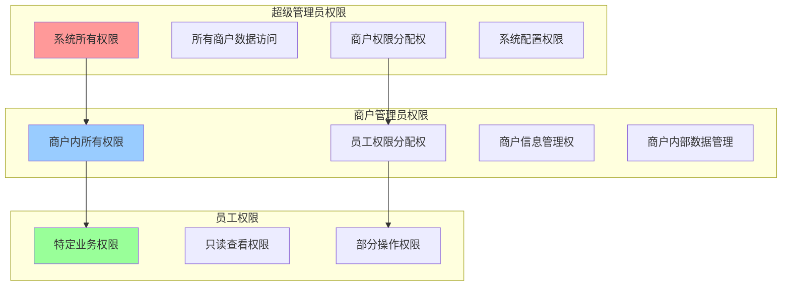
```mermaid
graph TB
    subgraph "超级管理员权限"
        A1[系统所有权限]
        A2[所有商户数据访问]
        A3[商户权限分配权]
        A4[系统配置权限]
    end
    
    subgraph "商户管理员权限"
        B1[商户内所有权限]
        B2[员工权限分配权]
        B3[商户信息管理权]
        B4[商户内部数据管理]
    end
    
    subgraph "员工权限"
        C1[特定业务权限]
        C2[只读查看权限]
        C3[部分操作权限]
    end
    
    A1 --> B1
    A3 --> B2
    B1 --> C1
    B2 --> C3
    
    style A1 fill:#ff9999
    style B1 fill:#99ccff
    style C1 fill:#99ff99
```

**权限分配原则**：
1. **向下分配原则**：上级角色只能将自己拥有的权限分配给下级
2. **商户隔离原则**：商户管理员不能访问其他商户（包括子商户）数据
3. **最小权限原则**：员工角色默认只分配必要的最小权限
4. **审批流程简化**：商户管理员分配权限无需审核，但有日志记录

#### 菜单权限配置系统

为三级权限体系设计分层菜单配置：

**超级管理员菜单配置**：
| 菜单名称 | 菜单路径 | 菜单级别 | 权限代码 | 菜单显示条件 | 说明 |
|-----------|----------|-----------|----------|--------------|------|
| 系统管理 | /system | 1 | system:* | 始终显示 | 一级菜单 |
| 商户管理 | /system/merchant | 2 | system:merchant:list | 始终显示 | 商户列表管理 |
| 商户创建 | /system/merchant/create | 3 | system:merchant:create | 始终显示 | 创建商户 |
| 商户权限配置 | /system/merchant/permission | 3 | system:merchant:permission | 始终显示 | 权限分配 |
| 用户管理 | /system/user | 2 | system:user:* | 始终显示 | 系统用户管理 |
| 角色管理 | /system/authority | 2 | system:authority:* | 始终显示 | 系统角色管理 |
| 菜单管理 | /system/menu | 2 | system:menu:* | 始终显示 | 系统菜单管理 |
| 系统配置 | /system/config | 2 | system:config:* | 始终显示 | 系统参数配置 |
| 日志管理 | /system/logs | 2 | system:logs:* | 始终显示 | 系统日志查看 |

**商户管理员菜单配置**：
| 菜单名称 | 菜单路径 | 菜单级别 | 权限代码 | 菜单显示条件 | 说明 |
|-----------|----------|-----------|----------|--------------|------|
| 商户管理 | /merchant | 1 | merchant:* | 商户上下文存在 | 一级菜单 |
| 商户信息 | /merchant/info | 2 | merchant:info:view | 可分配 | 商户基本信息 |
| 信息编辑 | /merchant/info/edit | 3 | merchant:info:update | 可分配 | 编辑商户信息 |
| 员工管理 | /merchant/user | 2 | merchant:user:list | 可分配 | 商户员工管理 |
| 员工创建 | /merchant/user/create | 3 | merchant:user:create | 可分配 | 新增员工 |
| 员工编辑 | /merchant/user/edit | 3 | merchant:user:update | 可分配 | 编辑员工 |
| 角色管理 | /merchant/role | 2 | merchant:role:list | 可分配 | 商户角色管理 |
| 角色创建 | /merchant/role/create | 3 | merchant:role:create | 可分配 | 新增角色 |
| 权限分配 | /merchant/role/permission | 3 | merchant:role:permission | 可分配 | 角色权限配置 |
| 数据统计 | /merchant/statistics | 2 | merchant:statistics:view | 可分配 | 商户数据统计 |

**员工角色菜单配置**（根据具体分配权限显示）：
| 菜单名称 | 菜单路径 | 菜单级别 | 权限代码 | 菜单显示条件 | 说明 |
|-----------|----------|-----------|----------|--------------|------|
| 工作台 | /workbench | 1 | * | 始终显示 | 员工工作台 |
| 信息查看 | /workbench/info | 2 | merchant:info:view | 有相应权限 | 查看商户信息 |
| 员工列表 | /workbench/users | 2 | merchant:user:view | 有相应权限 | 查看员工列表 |
| 业务操作 | /workbench/business | 2 | business:* | 有相应权限 | 具体业务操作 |
| 个人中心 | /profile | 1 | * | 始终显示 | 个人信息管理 |

#### 菜单动态加载机制

基于用户角色和权限的动态菜单加载机制：

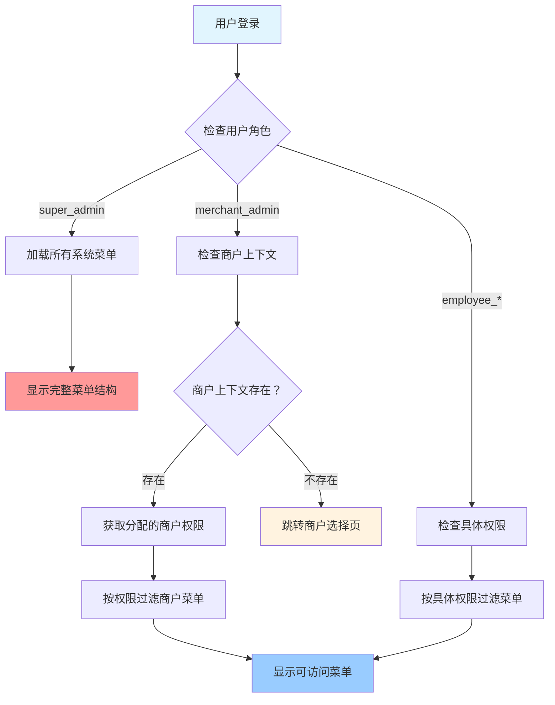
```mermaid
flowchart TD
    A[用户登录] --> B{检查用户角色}
    B -->|super_admin| C[加载所有系统菜单]
    B -->|merchant_admin| D[检查商户上下文]
    B -->|employee_*| E[检查具体权限]
    
    C --> F[显示完整菜单结构]
    
    D --> G{商户上下文存在？}
    G -->|存在| H[获取分配的商户权限]
    G -->|不存在| I[跳转商户选择页]
    
    H --> J[按权限过滤商户菜单]
    E --> K[按具体权限过滤菜单]
    
    J --> L[显示可访问菜单]
    K --> L
    
    style A fill:#e1f5fe
    style F fill:#ff9999
    style L fill:#99ccff
    style I fill:#fff3e0
```

#### 三级权限验证流程设计

**权限验证层级结构**：
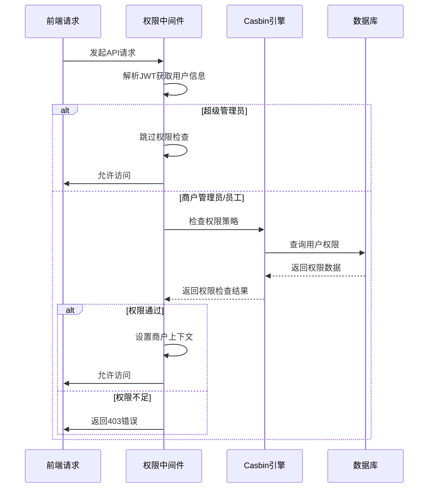
```mermaid
sequenceDiagram
    participant Client as 前端请求
    participant MW as 权限中间件
    participant Casbin as Casbin引擎
    participant DB as 数据库
    
    Client->>MW: 发起API请求
    MW->>MW: 解析JWT获取用户信息
    
    alt 超级管理员
        MW->>MW: 跳过权限检查
        MW->>Client: 允许访问
    else 商户管理员/员工
        MW->>Casbin: 检查权限策略
        Casbin->>DB: 查询用户权限
        DB-->>Casbin: 返回权限数据
        Casbin-->>MW: 返回权限检查结果
        
        alt 权限通过
            MW->>MW: 设置商户上下文
            MW->>Client: 允许访问
        else 权限不足
            MW->>Client: 返回403错误
        end
    end
```

**三级权限验证规则**：
1. **超级管理员验证**：authority_id = 'super_admin'，直接通过所有权限检查
2. **商户管理员验证**：检查是否拥有对应的'merchant:'权限，并验证商户上下文
3. **员工角色验证**：检查具体的权限代码，并进行双重验证（角色权限+商户权限）

#### 权限分配和管理机制

**超级管理员权限分配流程**：
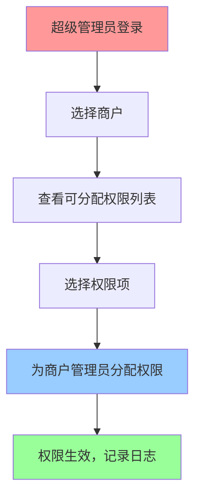
```mermaid
flowchart TD
    A[超级管理员登录] --> B[选择商户]
    B --> C[查看可分配权限列表]
    C --> D[选择权限项]
    D --> E[为商户管理员分配权限]
    E --> F[权限生效，记录日志]
    
    style A fill:#ff9999
    style E fill:#99ccff
    style F fill:#99ff99
```

**商户管理员权限分配流程**：
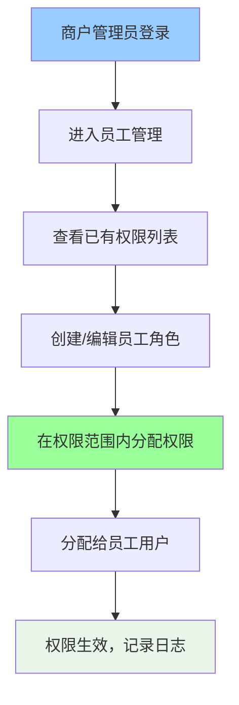
```mermaid
flowchart TD
    A[商户管理员登录] --> B[进入员工管理]
    B --> C[查看已有权限列表]
    C --> D[创建/编辑员工角色]
    D --> E[在权限范围内分配权限]
    E --> F[分配给员工用户]
    F --> G[权限生效，记录日志]
    
    style A fill:#99ccff
    style E fill:#99ff99
    style G fill:#e8f5e8
```

#### 权限资源定义表

| 权限代码 | 权限名称 | API路径 | HTTP方法 | 超级管理员 | 商户管理员 | 员工角色 | 备注 |
|----------|----------|---------|----------|------------|------------|----------|------|
| system:merchant:create | 商户创建 | /api/v1/merchant | POST | ✓ | ✗ | ✗ | 仅超级管理员 |
| system:merchant:list | 商户列表查看 | /api/v1/merchant/list | GET | ✓ | ✗ | ✗ | 查看所有商户 |
| system:merchant:update | 商户信息编辑 | /api/v1/merchant/:id | PUT | ✓ | ✗ | ✗ | 跨商户编辑 |
| system:merchant:delete | 商户删除 | /api/v1/merchant/:id | DELETE | ✓ | ✗ | ✗ | 删除任意商户 |
| system:merchant:status | 商户状态管理 | /api/v1/merchant/:id/status | PUT | ✓ | ✗ | ✗ | 状态管理 |
| system:merchant:permission | 商户权限分配 | /api/v1/merchant/:id/permissions | PUT | ✓ | ✗ | ✗ | 分配商户权限 |
| merchant:info:view | 商户信息查看 | /api/v1/merchant/info | GET | ✓ | 可分配 | 可分配 | 查看所属商户信息 |
| merchant:info:update | 商户信息编辑 | /api/v1/merchant/info | PUT | ✓ | 可分配 | 可分配 | 编辑所属商户信息 |
| merchant:user:list | 商户员工查看 | /api/v1/merchant/user/list | GET | ✓ | 可分配 | 可分配 | 查看商户员工 |
| merchant:user:create | 商户员工创建 | /api/v1/merchant/user | POST | ✓ | 可分配 | 可分配 | 创建商户员工 |
| merchant:user:update | 商户员工编辑 | /api/v1/merchant/user/:id | PUT | ✓ | 可分配 | 可分配 | 编辑商户员工 |
| merchant:user:delete | 商户员工删除 | /api/v1/merchant/user/:id | DELETE | ✓ | 可分配 | ✗ | 删除商户员工 |
| merchant:role:list | 商户角色查看 | /api/v1/merchant/role/list | GET | ✓ | 可分配 | 可分配 | 查看商户角色 |
| merchant:role:create | 商户角色创建 | /api/v1/merchant/role | POST | ✓ | 可分配 | ✗ | 创建商户角色 |
| merchant:role:update | 商户角色编辑 | /api/v1/merchant/role/:id | PUT | ✓ | 可分配 | ✗ | 编辑商户角色 |
| merchant:role:delete | 商户角色删除 | /api/v1/merchant/role/:id | DELETE | ✓ | 可分配 | ✗ | 删除商户角色 |

**权限分类说明**：
- **✓**：默认拥有该权限
- **可分配**：由上级角色手动分配决定是否拥有
- **✗**：不能拥有该权限

#### 三级权限体系分配策略

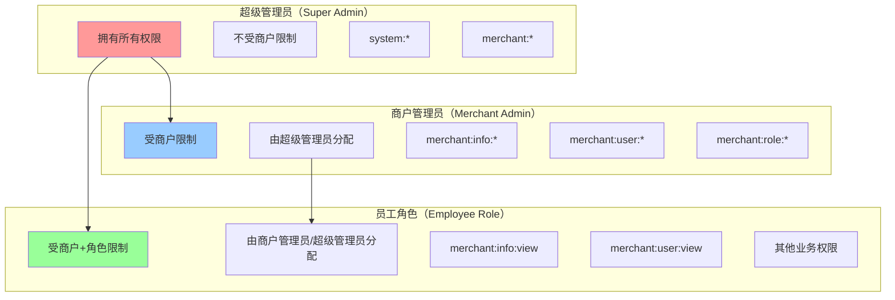
```mermaid
graph TD
    subgraph "超级管理员（Super Admin）"
        A1[拥有所有权限]
        A2[不受商户限制]
        A3[system:*]
        A4[merchant:*]
    end
    
    subgraph "商户管理员（Merchant Admin）"
        B1[受商户限制]
        B2[由超级管理员分配]
        B3[merchant:info:*]
        B4[merchant:user:*]
        B5[merchant:role:*]
    end
    
    subgraph "员工角色（Employee Role）"
        C1[受商户+角色限制]
        C2[由商户管理员/超级管理员分配]
        C3[merchant:info:view]
        C4[merchant:user:view]
        C5[其他业务权限]
    end
    
    A1 --> B1
    A1 --> C1
    B2 --> C2
    
    style A1 fill:#ff9999
    style B1 fill:#99ccff
    style C1 fill:#99ff99
```

### 三级权限中间件设计

#### 超级管理员权限中间件
``go
// middleware/super_admin.go
func SuperAdminMiddleware() gin.HandlerFunc {
    return func(c *gin.Context) {
        claims, exists := c.Get("claims")
        if !exists {
            response.FailWithMessage("认证失败", c)
            c.Abort()
            return
        }
        
        waitUse := claims.(*systemReq.CustomClaims)
        
        // 检查是否为超级管理员角色
        if waitUse.AuthorityId != "super_admin" {
            response.FailWithCodeMessage(40301, "仅超级管理员可访问", c)
            c.Abort()
            return
        }
        
        // 设置超级管理员标识
        c.Set("isSuperAdmin", true)
        c.Set("bypassmerchantIsolation", true) // 绕过商户隔离
        
        c.Next()
    }
}
```

#### 商户权限校验中间件
``go
// middleware/merchant_permission.go
func MerchantPermissionMiddleware() gin.HandlerFunc {
    return func(c *gin.Context) {
        claims, exists := c.Get("claims")
        if !exists {
            response.FailWithMessage("认证失败", c)
            c.Abort()
            return
        }
        
        waitUse := claims.(*systemReq.CustomClaims)
        
        // 超级管理员绕过权限检查
        if waitUse.AuthorityId == "super_admin" {
            c.Set("isSuperAdmin", true)
            c.Next()
            return
        }
        
        // 获取当前用户的商户ID
        merchantID := waitUse.MerchantID
        if merchantID == 0 {
            response.FailWithCodeMessage(40302, "商户上下文缺失", c)
            c.Abort()
            return
        }
        
        // 设置商户上下文
        c.Set("merchantID", merchantID)
        c.Set("userRole", waitUse.AuthorityId)
        
        c.Next()
    }
}
```

### 前端三级权限控制实现

#### 三级权限指令系统
``javascript
// directive/role-auth.js
import { useUserStore } from '@/stores/user'
import { usemerchantStore } from '@/stores/merchant'

export default {
  mounted(el, binding) {
    const userStore = useUserStore()
    const merchantStore = usemerchantStore()
    
    const requiredPermission = binding.value
    const userRole = userStore.userInfo.authorityId
    const userPermissions = userStore.userInfo.permissions || []
    
    // 超级管理员拥有所有权限
    if (userRole === 'super_admin') {
      return
    }
    
    // 检查用户是否拥有该权限
    if (!userPermissions.includes(requiredPermission)) {
      el.style.display = 'none'
      return
    }
    
    // 商户维度权限检查
    const merchantId = merchantStore.currentMerchantId
    if (!merchantId && requiredPermission.startsWith('merchant:')) {
      el.style.display = 'none'
      return
    }
  },
  
  updated(el, binding) {
    this.mounted(el, binding)
  }
}
```

#### 按钮级权限控制实例
``vue
<template>
  <div class="permission-demo">
    <!-- 超级管理员专属按钮 -->
    <el-button 
      v-role-auth="'system:merchant:create'"
      type="primary" 
      @click="createMerchant">
      创建商户
    </el-button>
    
    <!-- 商户管理员可见按钮 -->
    <el-button 
      v-role-auth="'merchant:user:create'"
      type="success" 
      @click="createUser">
      新增员工
    </el-button>
    
    <!-- 员工角色可见按钮 -->
    <el-button 
      v-role-auth="'merchant:info:view'"
      type="info" 
      @click="viewInfo">
      查看信息
    </el-button>
  </div>
</template>

<script setup>
// 业务逻辑
</script>
```

#### 多租户路由配置
``javascript
// router/modules/merchant.js
const merchantRoutes = [
  {
    path: '/merchant-selector',
    name: 'MerchantSelector',
    component: () => import('@/views/merchant/MerchantSelector.vue'),
    meta: {
      title: '商户选择',
      hidden: true // 隐藏在菜单中
    }
  },
  {
    path: '/merchant',
    name: 'Merchant',
    component: () => import('@/views/layout/index.vue'),
    meta: {
      title: '商户管理',
      icon: 'merchant',
      roles: ['admin', 'platform_admin']
    },
    children: [
      {
        path: 'list',
        name: 'MerchantList',
        component: () => import('@/views/merchant/list.vue'),
        meta: {
          title: '商户列表',
          permission: 'merchant:list'
        }
      },
      {
        path: 'merchant-user',
        name: 'merchantUser',
        component: () => import('@/views/merchant/merchant-user.vue'),
        meta: {
          title: '商户员工',
          permission: 'merchant:user:list',
          requireMerchant: true // 需要商户上下文
        }
      },
      {
        path: 'merchant-role',
        name: 'merchantRole',
        component: () => import('@/views/merchant/merchant-role.vue'),
        meta: {
          title: '商户角色',
          permission: 'merchant:role:list',
          requireMerchant: true
        }
      }
    ]
  }
]

export default merchantRoutes
```

#### 按钮级权限控制
``vue
<template>
  <div class="merchant-user-list">
    <!-- 创建按钮 -->
    <el-button 
      v-auth="'merchant:user:create'"
      v-merchant-auth="currentMerchantId"
      type="primary" 
      @click="handleCreate">
      新建员工
    </el-button>
    
    <!-- 操作列 -->
    <el-table-column label="操作" width="200">
      <template #default="{ row }">
        <el-button 
          v-auth="'merchant:user:update'"
          v-merchant-auth="row.merchantId"
          size="small" 
          @click="handleEdit(row)">
          编辑
        </el-button>
        <el-button 
          v-auth="'merchant:user:delete'"
          v-merchant-auth="row.merchantId"
          size="small" 
          type="danger" 
          @click="handleDelete(row)">
          删除
        </el-button>
      </template>
    </el-table-column>
  </div>
</template>

<script setup>
import { usemerchantStore } from '@/stores/merchant'

const merchantStore = usemerchantStore()
const currentMerchantId = computed(() => merchantStore.currentMerchantId)
</script>
```

#### 多租户权限指令
``javascript
// directive/merchant-auth.js
import { usemerchantStore } from '@/stores/merchant'
import { useUserStore } from '@/stores/user'

export default {
  mounted(el, binding) {
    const merchantStore = usemerchantStore()
    const userStore = useUserStore()
    
    const requiredMerchantId = binding.value
    const currentMerchantId = merchantStore.currentMerchantId
    const userRole = userStore.userInfo.authorityId
    
    // 系统管理员不受商户限制
    if (userRole === 'admin' || userRole === 'platform_admin') {
      return
    }
    
    // 检查商户权限
    if (requiredMerchantId && requiredMerchantId !== currentMerchantId) {
      el.style.display = 'none'
      // 或者移除元素
      // el.parentNode?.removeChild(el)
    }
  },
  
  updated(el, binding) {
    // 商户切换时重新检查权限
    this.mounted(el, binding)
  }
}
```

## 三级权限体系实现细节

### 商户权限分配界面设计

**超级管理员权限分配界面**：
- 商户选择器：显示所有商户列表
- 权限分类显示：按功能模块分类展示可分配权限
- 批量分配：支持选中多个权限同时分配
- 权限预览：分配前预览将要分配的权限列表
- 分配日志：记录所有权限分配操作的历史

**商户管理员权限管理界面**：
- 已有权限显示：显示当前商户已获得的所有权限
- 员工角色管理：在权限范围内创建和管理员工角色
- 权限分配限制：只能在已拥有的权限范围内分配给员工
- 权限使用统计：查看各种权限的使用情况和频次

### 前端权限组件设计

**权限控制组件集**：

1. **RoleAuthButton.vue** - 权限按钮组件
2. **merchantSwitcher.vue** - 商户切换组件
3. **PermissionTable.vue** - 权限表格组件
4. **MerchantPermissionAssign.vue** - 商户权限分配组件
5. **RolePermissionMatrix.vue** - 角色权限矩阵组件

### 权限检查流程优化

**高效权限检查策略**：
- 缓存权限数据：在前端缓存用户权限信息，减少服务器请求
- 权限预计算：用户登录时预计算所有权限，提高检查效率
- 懒加载验证：权限检查只在必要时执行，避免无效计算
- 权限变更通知：权限变更时实时清理相关缓存

### 数据隔离安全加强

**严格的数据隔离机制**：
- SQL注入防护：所有查询都使用参数化查询，防止SQL注入
- 行级安全：所有数据访问都必须包含merchant_id条件
- 接口参数校验：严格校验所有输入参数，防止越权访问
- 数据返回过滤：返回数据前再次过滤，确保数据安全

### 日志审计强化

**全面的审计日志系统**：
- 权限操作日志：记录所有权限分配、变更、删除操作
- 商户切换日志：记录用户的商户切换历史
- 敏感操作监控：重点监控跨商户操作和管理员权限变更
- 实时报警：异常权限操作实时报警通知

### 性能优化建议

**数据库优化**：
- 建立复合索引：(merchant_id, user_id)、(merchant_id, authority_id)等
- 分区表设计：按商户ID对大表进行分区，提高查询效率
- 读写分离：查询操作使用只读实例，减少主库压力
- 数据归档：定期归档历史数据，保持表的高效性

**前端优化**：
- 组件懒加载：大型组件按需加载，减少初始打包体积
- 数据虚拟化：大列表使用虚拟滚动，提高渲染性能
- 权限缓存：在localStorage/sessionStorage中缓存用户权限
- 防抖处理：搜索和筛选功能使用防抖，减少请求频次

### 系统集成建议

**与现有gin-vue-admin系统集成**：
- 保持现有API接口兼容：渐进式升级，不影响现有功能
- 统一认证系统：继续使用JWT认证，扩展支持商户上下文
- 数据库升级脚本：提供自动化脚本，安全升级现有数据库
- 配置参数管理：增加多租户相关的系统配置参数

### 系统测试策略

#### 单元测试设计

**后端单元测试**：

```go
// service/merchant_service_test.go
package service

import (
    "testing"
    "github.com/stretchr/testify/assert"
    "github.com/stretchr/testify/suite"
    "gorm.io/gorm"
)

type MerchantServiceTestSuite struct {
    suite.Suite
    db      *gorm.DB
    service *MerchantService
}

func (suite *MerchantServiceTestSuite) SetupTest() {
    // 初始化测试数据库
    suite.db = setupTestDB()
    suite.service = &MerchantService{db: suite.db}
}

func (suite *MerchantServiceTestSuite) TearDownTest() {
    // 清理测试数据
    cleanupTestDB(suite.db)
}

// 测试商户创建
func (suite *MerchantServiceTestSuite) TestCreateMerchant() {
    req := &request.CreateMerchantRequest{
        MerchantName:    "Test Merchant",
        MerchantType:    "ENTERPRISE",
        ContactName:     "Test Contact",
        ContactPhone:    "13800138000",
        ContactEmail:    "test@example.com",
        CreatedBy:       1,
    }
    
    merchant, err := suite.service.CreateMerchant(req)
    
    assert.NoError(suite.T(), err)
    assert.NotNil(suite.T(), merchant)
    assert.Equal(suite.T(), "Test Merchant", merchant.MerchantName)
    assert.Equal(suite.T(), 1, merchant.Level)
    assert.NotEmpty(suite.T(), merchant.MerchantCode)
}

// 测试商户数据隔离
func (suite *MerchantServiceTestSuite) TestDataIsolation() {
    // 创建两个商户
    merchant1 := suite.createTestMerchant("Merchant 1")
    merchant2 := suite.createTestMerchant("Merchant 2")
    
    // 为每个商户创建用户
    user1 := suite.createTestUser("user1", merchant1.ID)
    user2 := suite.createTestUser("user2", merchant2.ID)
    
    // 测试数据隔离
    users1, err1 := suite.service.GetMerchantUsers(merchant1.ID)
    users2, err2 := suite.service.GetMerchantUsers(merchant2.ID)
    
    assert.NoError(suite.T(), err1)
    assert.NoError(suite.T(), err2)
    assert.Len(suite.T(), users1, 1)
    assert.Len(suite.T(), users2, 1)
    assert.Equal(suite.T(), user1.ID, users1[0].ID)
    assert.Equal(suite.T(), user2.ID, users2[0].ID)
}

// 测试商户层级结构
func (suite *MerchantServiceTestSuite) TestMerchantHierarchy() {
    // 创建父商户
    parentReq := &request.CreateMerchantRequest{
        MerchantName: "Parent Merchant",
        CreatedBy:    1,
    }
    parent, err := suite.service.CreateMerchant(parentReq)
    assert.NoError(suite.T(), err)
    
    // 创建子商户
    childReq := &request.CreateMerchantRequest{
        MerchantName: "Child Merchant",
        ParentID:     &parent.ID,
        CreatedBy:    1,
    }
    child, err := suite.service.CreateMerchant(childReq)
    assert.NoError(suite.T(), err)
    
    // 验证层级结构
    assert.Equal(suite.T(), 1, parent.Level)
    assert.Equal(suite.T(), 2, child.Level)
    assert.Equal(suite.T(), fmt.Sprintf("%d", parent.ID), parent.Path)
    assert.Equal(suite.T(), fmt.Sprintf("%d/%d", parent.ID, child.ID), child.Path)
}

func TestMerchantServiceTestSuite(t *testing.T) {
    suite.Run(t, new(MerchantServiceTestSuite))
}
```

**前端单元测试**：

```javascript
// tests/unit/stores/merchant.test.js
import { describe, it, expect, beforeEach, vi } from 'vitest'
import { setActivePinia, createPinia } from 'pinia'
import { usemerchantStore } from '@/stores/merchant'
import * as api from '@/api/merchant'

// Mock API
vi.mock('@/api/merchant')

describe('merchantStore', () => {
  beforeEach(() => {
    setActivePinia(createPinia())
    vi.clearAllMocks()
  })

  describe('fetchUserMerchants', () => {
    it('should fetch user merchants successfully', async () => {
      const mockMerchants = [
        { merchantId: 1, merchantName: 'Merchant 1', isDefault: true },
        { merchantId: 2, merchantName: 'Merchant 2', isDefault: false }
      ]
      
      api.getUserMerchants.mockResolvedValue({ data: { merchants: mockMerchants } })
      
      const store = usemerchantStore()
      const result = await store.fetchUserMerchants()
      
      expect(result.merchants).toEqual(mockMerchants)
      expect(store.userMerchants).toEqual(mockMerchants)
      expect(api.getUserMerchants).toHaveBeenCalledOnce()
    })

    it('should handle fetch error', async () => {
      api.getUserMerchants.mockRejectedValue(new Error('Network error'))
      
      const store = usemerchantStore()
      
      await expect(store.fetchUserMerchants()).rejects.toThrow('Network error')
    })
  })

  describe('switchMerchant', () => {
    it('should switch merchant successfully', async () => {
      const mockResponse = {
        data: {
          token: 'new-token',
          merchantInfo: {
            merchantId: 2,
            merchantName: 'Merchant 2',
            userRole: 'merchant_admin'
          }
        }
      }
      
      api.switchMerchant.mockResolvedValue(mockResponse)
      
      const store = usemerchantStore()
      const result = await store.switchMerchant(2)
      
      expect(result).toEqual(mockResponse.data)
      expect(store.currentMerchant).toEqual(mockResponse.data.merchantInfo)
      expect(localStorage.getItem('token')).toBe('new-token')
    })
  })
})
```

#### 集成测试设计

**API集成测试**：

```go
// test/integration/merchant_api_test.go
package integration

import (
    "bytes"
    "encoding/json"
    "net/http"
    "testing"
    "github.com/stretchr/testify/assert"
)

type MerchantAPITestSuite struct {
    suite.Suite
    server     *gin.Engine
    superToken string
    adminToken string
}

func (suite *MerchantAPITestSuite) SetupSuite() {
    // 初始化测试服务器
    suite.server = setupTestServer()
    
    // 获取测试Token
    suite.superToken = suite.getSuperAdminToken()
    suite.adminToken = suite.getMerchantAdminToken()
}

func (suite *MerchantAPITestSuite) TestCreateMerchant() {
    payload := map[string]interface{}{
        "merchantName":  "Test Merchant API",
        "merchantType":  "ENTERPRISE",
        "contactName":   "API Test",
        "contactPhone":  "13800138001",
        "contactEmail":  "api@test.com",
    }
    
    body, _ := json.Marshal(payload)
    req := httptest.NewRequest("POST", "/api/v1/merchant", bytes.NewBuffer(body))
    req.Header.Set("Content-Type", "application/json")
    req.Header.Set("Authorization", "Bearer "+suite.superToken)
    
    w := httptest.NewRecorder()
    suite.server.ServeHTTP(w, req)
    
    assert.Equal(suite.T(), http.StatusOK, w.Code)
    
    var response map[string]interface{}
    err := json.Unmarshal(w.Body.Bytes(), &response)
    assert.NoError(suite.T(), err)
    assert.Equal(suite.T(), float64(0), response["code"])
}

func (suite *MerchantAPITestSuite) TestDataIsolationAPI() {
    // 创建两个商户及其用户
    merchant1ID := suite.createTestMerchant("Merchant 1")
    merchant2ID := suite.createTestMerchant("Merchant 2")
    
    user1Token := suite.createMerchantUser(merchant1ID, "user1")
    user2Token := suite.createMerchantUser(merchant2ID, "user2")
    
    // 测试用户1无法访问商户2的数据
    req := httptest.NewRequest("GET", "/api/v1/merchant/user/list", nil)
    req.Header.Set("Authorization", "Bearer "+user1Token)
    
    w := httptest.NewRecorder()
    suite.server.ServeHTTP(w, req)
    
    var response map[string]interface{}
    json.Unmarshal(w.Body.Bytes(), &response)
    
    // 验证只能看到自己商户的数据
    data := response["data"].(map[string]interface{})
    users := data["list"].([]interface{})
    
    for _, user := range users {
        userMap := user.(map[string]interface{})
        assert.Equal(suite.T(), float64(merchant1ID), userMap["merchantId"])
    }
}
```

#### E2E测试设计

**Cypress E2E测试**：

```javascript
// cypress/e2e/merchant-management.cy.js
describe('Merchant Management E2E', () => {
  beforeEach(() => {
    // 清理数据库
    cy.task('db:seed')
    
    // 登录超级管理员
    cy.loginAsSuperAdmin()
  })

  describe('Merchant CRUD Operations', () => {
    it('should create a new merchant successfully', () => {
      cy.visit('/system/merchant')
      
      // 点击新增按钮
      cy.get('[data-cy="create-merchant-btn"]').click()
      
      // 填写表单
      cy.get('[data-cy="merchant-name"]').type('E2E Test Merchant')
      cy.get('[data-cy="merchant-type"]').select('ENTERPRISE')
      cy.get('[data-cy="contact-name"]').type('E2E Contact')
      cy.get('[data-cy="contact-phone"]').type('13800138888')
      cy.get('[data-cy="contact-email"]').type('e2e@test.com')
      
      // 提交表单
      cy.get('[data-cy="submit-btn"]').click()
      
      // 验证结果
      cy.get('.el-message--success').should('contain', '创建成功')
      cy.get('[data-cy="merchant-table"]').should('contain', 'E2E Test Merchant')
    })

    it('should handle merchant hierarchy correctly', () => {
      cy.visit('/system/merchant')
      
      // 切换到树形视图
      cy.get('[data-cy="tree-view-toggle"]').click()
      
      // 选择父节点，创建子商户
      cy.get('[data-cy="merchant-tree-node-1"]').rightclick()
      cy.get('[data-cy="add-child-merchant"]').click()
      
      // 填写子商户信息
      cy.get('[data-cy="merchant-name"]').type('Child Merchant')
      cy.get('[data-cy="submit-btn"]').click()
      
      // 验证层级结构
      cy.get('[data-cy="merchant-tree"]')
        .find('[data-level="2"]')
        .should('contain', 'Child Merchant')
    })
  })

  describe('Permission Assignment', () => {
    it('should assign permissions to merchant admin', () => {
      // 进入权限管理页面
      cy.visit('/system/merchant/permission')
      
      // 选择商户
      cy.get('[data-cy="merchant-selector"]').click()
      cy.get('.el-select-dropdown__item').first().click()
      
      // 选择权限
      cy.get('[data-cy="permission-merchant-info-view"]').check()
      cy.get('[data-cy="permission-merchant-user-list"]').check()
      cy.get('[data-cy="permission-merchant-user-create"]').check()
      
      // 提交权限分配
      cy.get('[data-cy="assign-permissions-btn"]').click()
      
      // 验证结果
      cy.get('.el-message--success').should('contain', '权限分配成功')
    })
  })

  describe('Multi-merchant Login Flow', () => {
    it('should handle multi-merchant user login', () => {
      // 登出超级管理员
      cy.logout()
      
      // 登录多商户用户
      cy.login('multiuser@test.com', 'password123')
      
      // 应该显示商户选择页面
      cy.url().should('include', '/merchant-selector')
      cy.get('[data-cy="merchant-list"]').should('be.visible')
      
      // 选择商户
      cy.get('[data-cy="merchant-item-1"]').click()
      
      // 验证跳转到对应页面
      cy.url().should('include', '/merchant')
      cy.get('[data-cy="current-merchant-name"]').should('contain', 'Test Merchant')
    })
  })

  describe('Data Isolation Verification', () => {
    it('should enforce strict data isolation', () => {
      // 登录商户A的管理员
      cy.loginAsMerchantAdmin('merchant-a@test.com', 'password123')
      
      // 尝试访问其他商户的数据
      cy.request({
        url: '/api/v1/merchant/user/list',
        headers: {
          'Authorization': `Bearer ${Cypress.env('merchantAToken')}`
        },
        failOnStatusCode: false
      }).then((response) => {
        // 验证只能看到自己商户的数据
        expect(response.body.data.list).to.have.length.greaterThan(0)
        response.body.data.list.forEach(user => {
          expect(user.merchantId).to.equal(1) // 商户A的ID
        })
      })
    })
  })
})
```

#### 性能测试设计

**JMeter性能测试计划**：

```xml
<!-- performance-test-plan.jmx -->
<?xml version="1.0" encoding="UTF-8"?>
<jmeterTestPlan version="1.2">
  <hashTree>
    <TestPlan testname="Merchant Management Performance Test">
      <!-- 线程组配置 -->
      <ThreadGroup testname="API Load Test">
        <elementProp name="ThreadGroup.arguments" elementType="Arguments" guiclass="ArgumentsPanel">
          <collectionProp name="Arguments.arguments">
            <elementProp name="baseUrl" elementType="Argument">
              <stringProp name="Argument.name">baseUrl</stringProp>
              <stringProp name="Argument.value">http://localhost:8888</stringProp>
            </elementProp>
          </collectionProp>
        </elementProp>
        
        <!-- 并发用户数：100 -->
        <stringProp name="ThreadGroup.num_threads">100</stringProp>
        <!-- 启动时间：30秒 -->
        <stringProp name="ThreadGroup.ramp_time">30</stringProp>
        <!-- 循环次数：10 -->
        <stringProp name="ThreadGroup.loops">10</stringProp>
        
        <hashTree>
          <!-- 登录接口测试 -->
          <HTTPSamplerProxy testname="Login API">
            <stringProp name="HTTPSampler.path">/api/v1/login</stringProp>
            <stringProp name="HTTPSampler.method">POST</stringProp>
            <stringProp name="HTTPSampler.postBodyRaw">{
              "username": "testuser${__threadNum}",
              "password": "password123"
            }</stringProp>
          </HTTPSamplerProxy>
          
          <!-- 商户列表接口测试 -->
          <HTTPSamplerProxy testname="Merchant List API">
            <stringProp name="HTTPSampler.path">/api/v1/merchant/list</stringProp>
            <stringProp name="HTTPSampler.method">GET</stringProp>
          </HTTPSamplerProxy>
          
          <!-- 商户创建接口测试 -->
          <HTTPSamplerProxy testname="Create Merchant API">
            <stringProp name="HTTPSampler.path">/api/v1/merchant</stringProp>
            <stringProp name="HTTPSampler.method">POST</stringProp>
            <stringProp name="HTTPSampler.postBodyRaw">{
              "merchantName": "Performance Test Merchant ${__time()}",
              "merchantType": "ENTERPRISE",
              "contactName": "Performance Test",
              "contactPhone": "13800${__Random(100000,999999)}",
              "contactEmail": "perf${__threadNum}@test.com"
            }</stringProp>
          </HTTPSamplerProxy>
          
          <!-- 响应时间断言 -->
          <ResponseAssertion testname="Response Time Assertion">
            <stringProp name="Assertion.test_field">Assertion.response_time</stringProp>
            <stringProp name="Assertion.test_type">Assertion.response_time</stringProp>
            <stringProp name="Assertion.assume_success">false</stringProp>
            <stringProp name="Assertion.response_time">2000</stringProp> <!-- 2秒内 -->
          </ResponseAssertion>
          
          <!-- 结果监听器 -->
          <ResultCollector testname="View Results Tree" enabled="true">
            <stringProp name="filename">performance-test-results.jtl</stringProp>
            <objProp>
              <name>saveConfig</name>
              <value class="SampleSaveConfiguration">
                <time>true</time>
                <latency>true</latency>
                <timestamp>true</timestamp>
                <success>true</success>
                <label>true</label>
                <code>true</code>
                <message>true</message>
                <threadName>true</threadName>
                <dataType>true</dataType>
                <encoding>false</encoding>
                <assertions>true</assertions>
                <subresults>true</subresults>
                <responseData>false</responseData>
                <samplerData>false</samplerData>
                <xml>false</xml>
                <fieldNames>true</fieldNames>
                <responseHeaders>false</responseHeaders>
                <requestHeaders>false</requestHeaders>
                <responseDataOnError>false</responseDataOnError>
                <saveAssertionResultsFailureMessage>true</saveAssertionResultsFailureMessage>
                <assertionsResultsToSave>0</assertionsResultsToSave>
                <bytes>true</bytes>
                <sentBytes>true</sentBytes>
                <url>true</url>
                <threadCounts>true</threadCounts>
                <idleTime>true</idleTime>
                <connectTime>true</connectTime>
              </value>
            </objProp>
          </ResultCollector>
        </hashTree>
      </ThreadGroup>
    </TestPlan>
  </hashTree>
</jmeterTestPlan>
```

**分阶段上线策略**：

**第一阶段**：基础多租户架构
- 商户数据模型创建
- 基础数据隔离中间件
- 商户管理CRUD接口

**第二阶段**：权限体系集成
- 三级权限体系实现
- Casbin权限模型扩展
- 商户切换功能

**第三阶段**：高级功能完善
- 商户层级管理
- 认证流程系统
- 日志审计系统

**第四阶段**：优化与监控
- 性能优化实施
- 监控报警系统
- 自动化运维工具

### 多租户文件存储策略
- **存储路径隔离**：按商户ID组织文件目录结构
- **访问权限控制**：只能访问所属商户的文件
- **存储方式集成**：兼容本地存储、阿里云OSS、腾讯云COS、MinIO等
- **文件安全**：支持文件加密和数字签名

### 多租户存储路径规划
```
uploads/
├── merchants/                    # 多租户文件根目录
│   ├── merchant_1/           # 商户ID目录
│   │   ├── business_license/   # 营业执照
│   │   ├── tax_registration/   # 税务登记证
│   │   ├── legal_person_id/    # 法人身份证
│   │   └── other_docs/         # 其他证件
│   └── merchant_2/
└── system/                   # 系统级文件（不受商户限制）
```

### 文件上传安全控制
- **文件类型限制**：只允许PDF、JPG、PNG、DOC、DOCX格式
- **文件大小限制**：单文件不超过10MB，单次上传总大小不超过50MB
- **病毒扫描**：集成病毒扫描引擎，拦截恶意文件
- **数字水印**：重要证件文件支持数字水印验证

## 数据安全与验证

### 多租户数据验证规则

#### 后端验证规则
- **商户名称**：2-100个字符，全平台唯一
- **联系电话**：符合中国大陆手机号格式
- **邮箱地址**：符合标准邮箱格式
- **员工手机号**：在同一商户内唯一
- **商户编码**：系统自动生成，全平台唯一
- **角色名称**：在同一商户内唯一

#### 前端验证规则
``javascript
const merchantValidationRules = {
  // 商户验证规则
  merchantName: [
    { required: true, message: '请输入商户名称', trigger: 'blur' },
    { min: 2, max: 100, message: '商户名称长度为2-100个字符', trigger: 'blur' },
    { 
      validator: async (rule, value) => {
        // 检查商户名称全平台唯一性
        const exists = await api.checkMerchantNameExists(value)
        if (exists) {
          throw new Error('商户名称已存在')
        }
      }, 
      trigger: 'blur' 
    }
  ],
  
  // 员工验证规则
  userPhone: [
    { required: true, message: '请输入手机号', trigger: 'blur' },
    { pattern: /^1[3-9]\d{9}$/, message: '请输入正确的手机号', trigger: 'blur' },
    { 
      validator: async (rule, value) => {
        const merchantStore = usemerchantStore()
        // 检查在当前商户内的唯一性
        const exists = await api.checkUserPhoneInmerchant(value, merchantStore.currentMerchantId)
        if (exists) {
          throw new Error('该手机号在当前商户内已存在')
        }
      }, 
      trigger: 'blur' 
    }
  ],
  
  // 角色验证规则
  authorityName: [
    { required: true, message: '请输入角色名称', trigger: 'blur' },
    { min: 2, max: 50, message: '角色名称长度为2-50个字符', trigger: 'blur' },
    { 
      validator: async (rule, value) => {
        const merchantStore = usemerchantStore()
        // 检查在当前商户内的唯一性
        const exists = await api.checkAuthorityNameInmerchant(value, merchantStore.currentMerchantId)
        if (exists) {
          throw new Error('该角色名称在当前商户内已存在')
        }
      }, 
      trigger: 'blur' 
    }
  ]
}
```

### 多租户数据脱敏处理
- **手机号脱敏**：显示为138****8000格式
- **邮箱脱敏**：显示为user***@example.com格式
- **身份证号脱敏**：显示为110***********1234格式
- **银行账号脱敏**：显示为622***********1234格式
- **商户间数据隔离**：严格防止跨商户数据泄露

## 日志审计设计

### 多租户操作日志记录
基于系统现有的操作审计中间件，扩展记录商户维度的操作日志：

- **商户创建**：记录创建人、创建时间、商户基本信息、初始管理员信息
- **商户修改**：记录修改人、所属商户、修改时间、修改前后数据对比
- **商户切换**：记录用户切换商户的操作日志和时间
- **员工管理**：记录商户员工的创建、修改、删除、角色变更操作
- **角色权限**：记录商户角色的创建、修改、权限变更操作
- **跨商户操作**：重点监控系统管理员的跨商户操作

### 多租户审计日志格式
``json
{
  "operation": "merchant_user_create",
  "operator_id": 1,
  "operator_name": "merchant_admin",
  "operator_merchant_id": 1,
  "operator_merchant_name": "XX科技有限公司",
  "target_merchant_id": 1,
  "target_user_id": 123,
  "details": {
    "user_name": "张三",
    "user_phone": "138****8000",
    "assigned_roles": ["merchant_operator"]
  },
  "data_isolation": {
    "is_cross_merchant": false,
    "source_merchant": 1,
    "target_merchant": 1
  },
  "timestamp": "2024-01-01T10:00:00Z",
  "ip_address": "192.168.1.100",
  "user_agent": "Mozilla/5.0..."
}
```

## 性能优化设计

### 多租户中间件详细实现

#### 数据隔离中间件增强版

```go
// middleware/merchant_isolation.go
func merchantIsolationMiddleware() gin.HandlerFunc {
    return func(c *gin.Context) {
        claims, exists := c.Get("claims")
        if !exists {
            response.FailWithMessage("认证失败", c)
            c.Abort()
            return
        }
        
        waitUse := claims.(*systemReq.CustomClaims)
        
        // 超级管理员绕过租户隔离
        if waitUse.AuthorityId == "super_admin" {
            c.Set("isSuperAdmin", true)
            c.Set("bypassmerchantIsolation", true)
            c.Next()
            return
        }
        
        // 检查商户上下文
        merchantID := waitUse.MerchantID
        if merchantID == 0 {
            response.FailWithCodeMessage(40302, "商户上下文缺失", c)
            c.Abort()
            return
        }
        
        // 验证商户状态
        merchantService := service.ServiceGroupApp.MerchantServiceGroup.MerchantService
        merchant, err := merchantService.GetMerchantByID(merchantID)
        if err != nil {
            response.FailWithCodeMessage(40303, "商户信息获取失败", c)
            c.Abort()
            return
        }
        
        if merchant.Status != "ACTIVE" {
            response.FailWithCodeMessage(40303, "商户状态异常", c)
            c.Abort()
            return
        }
        
        // 设置租户上下文
        c.Set("merchantID", merchantID)
        c.Set("merchantInfo", merchant)
        c.Set("userRole", waitUse.AuthorityId)
        
        c.Next()
    }
}
```

#### 权限验证中间件

```go
// middleware/permission_check.go
func PermissionCheckMiddleware(requiredPermission string) gin.HandlerFunc {
    return func(c *gin.Context) {
        // 超级管理员直接通过
        if isSuperAdmin, exists := c.Get("isSuperAdmin"); exists && isSuperAdmin.(bool) {
            c.Next()
            return
        }
        
        claims, exists := c.Get("claims")
        if !exists {
            response.FailWithCodeMessage(403, "权限验证失败", c)
            c.Abort()
            return
        }
        
        waitUse := claims.(*systemReq.CustomClaims)
        
        // 使用Casbin进行权限检查
        casbinService := service.ServiceGroupApp.SystemServiceGroup.CasbinService
        success := casbinService.Enforce(waitUse.AuthorityId, requiredPermission, "execute")
        
        if !success {
            response.FailWithCodeMessage(403, "权限不足", c)
            c.Abort()
            return
        }
        
        c.Next()
    }
}
```
### 商户数据服务层设计

#### 商户管理服务

```go
// service/merchant_service.go
type MerchantService struct {
    db *gorm.DB
}

// 创建商户（支持层级结构）
func (m *MerchantService) CreateMerchant(req *request.CreateMerchantRequest) (*model.SysMerchant, error) {
    // 事务处理
    tx := m.db.Begin()
    defer func() {
        if r := recover(); r != nil {
            tx.Rollback()
        }
    }()
    
    // 生成商户编码
    merchantCode := m.generateMerchantCode()
    
    // 计算层级信息
    level := 1
    path := ""
    if req.ParentID != nil {
        parentMerchant, err := m.GetMerchantByID(*req.ParentID)
        if err != nil {
            tx.Rollback()
            return nil, err
        }
        level = parentMerchant.Level + 1
        path = parentMerchant.Path
    }
    
    // 创建商户记录
    merchant := &model.SysMerchant{
        MerchantCode:      merchantCode,
        MerchantName:      req.MerchantName,
        ParentID:          req.ParentID,
        MerchantType:      req.MerchantType,
        Level:            level,
        ContactName:       req.ContactName,
        ContactPhone:      req.ContactPhone,
        ContactEmail:      req.ContactEmail,
        BusinessLicense:   req.BusinessLicense,
        LegalPerson:      req.LegalPerson,
        RegisteredAddress: req.RegisteredAddress,
        BusinessScope:    req.BusinessScope,
        Status:           "PENDING",
        MerchantLevel:    "BASIC",
        CreatedBy:        req.CreatedBy,
    }
    
    if err := tx.Create(merchant).Error; err != nil {
        tx.Rollback()
        return nil, err
    }
    
    // 更新路径信息
    if path != "" {
        merchant.Path = fmt.Sprintf("%s/%d", path, merchant.ID)
    } else {
        merchant.Path = fmt.Sprintf("%d", merchant.ID)
    }
    
    if err := tx.Save(merchant).Error; err != nil {
        tx.Rollback()
        return nil, err
    }
    
    // 创建商户管理员用户
    if req.AdminUserInfo != nil {
        adminUser := &model.SysUser{
            Username:     req.AdminUserInfo.Username,
            Password:     req.AdminUserInfo.Password, // 需要加密
            NickName:     req.AdminUserInfo.NickName,
            Name:         req.AdminUserInfo.Name,
            Phone:        req.AdminUserInfo.Phone,
            Email:        req.AdminUserInfo.Email,
            MerchantID:   merchant.ID,
            AuthorityId:  fmt.Sprintf("merchant_admin_%d", merchant.ID),
            IsMainAccount: true,
        }
        
        if err := tx.Create(adminUser).Error; err != nil {
            tx.Rollback()
            return nil, err
        }
        
        merchant.AdminUserID = &adminUser.ID
        if err := tx.Save(merchant).Error; err != nil {
            tx.Rollback()
            return nil, err
        }
    }
    
    tx.Commit()
    return merchant, nil
}

// 获取商户树形结构
func (m *MerchantService) GetMerchantTree(rootID *uint, maxLevel int) ([]*response.MerchantTreeNode, error) {
    var merchants []model.SysMerchant
    query := m.db.Model(&model.SysMerchant{})
    
    if rootID != nil {
        // 查询指定根节点及其子节点
        rootMerchant, err := m.GetMerchantByID(*rootID)
        if err != nil {
            return nil, err
        }
        query = query.Where("path LIKE ? OR id = ?", rootMerchant.Path+"/%", *rootID)
    }
    
    if maxLevel > 0 {
        query = query.Where("level <= ?", maxLevel)
    }
    
    query = query.Order("level, parent_id, id")
    
    if err := query.Find(&merchants).Error; err != nil {
        return nil, err
    }
    
    return m.buildMerchantTree(merchants, rootID), nil
}

// 移动商户位置
func (m *MerchantService) MoveMerchant(merchantID uint, newParentID *uint) error {
    tx := m.db.Begin()
    defer func() {
        if r := recover(); r != nil {
            tx.Rollback()
        }
    }()
    
    // 获取当前商户
    merchant, err := m.GetMerchantByID(merchantID)
    if err != nil {
        tx.Rollback()
        return err
    }
    
    // 验证是否形成循环引用
    if newParentID != nil {
        if err := m.validateMoveOperation(merchantID, *newParentID); err != nil {
            tx.Rollback()
            return err
        }
    }
    
    // 计算新的level和path
    newLevel := 1
    newPath := fmt.Sprintf("%d", merchantID)
    
    if newParentID != nil {
        parentMerchant, err := m.GetMerchantByID(*newParentID)
        if err != nil {
            tx.Rollback()
            return err
        }
        newLevel = parentMerchant.Level + 1
        newPath = fmt.Sprintf("%s/%d", parentMerchant.Path, merchantID)
    }
    
    // 更新当前商户
    oldPath := merchant.Path
    oldLevel := merchant.Level
    
    merchant.ParentID = newParentID
    merchant.Level = newLevel
    merchant.Path = newPath
    
    if err := tx.Save(merchant).Error; err != nil {
        tx.Rollback()
        return err
    }
    
    // 更新所有子孙节点
    if err := m.updateChildrenPaths(tx, oldPath, newPath, oldLevel, newLevel); err != nil {
        tx.Rollback()
        return err
    }
    
    tx.Commit()
    return nil
}
```
### 数据库迁移与初始化脚本

#### 数据库迁移脚本

```
-- 创建商户主表
CREATE TABLE `sys_merchant` (
  `id` bigint(20) unsigned NOT NULL AUTO_INCREMENT COMMENT '主键ID',
  `merchant_code` varchar(50) NOT NULL COMMENT '商户编码',
  `merchant_name` varchar(100) NOT NULL COMMENT '商户名称',
  `parent_id` bigint(20) unsigned DEFAULT NULL COMMENT '父商户ID',
  `merchant_type` varchar(20) NOT NULL DEFAULT 'ENTERPRISE' COMMENT '商户类型',
  `contact_name` varchar(50) NOT NULL COMMENT '联系人姓名',
  `contact_phone` varchar(20) NOT NULL COMMENT '联系电话',
  `contact_email` varchar(100) NOT NULL COMMENT '联系邮箱',
  `business_license` varchar(50) DEFAULT NULL COMMENT '营业执照号',
  `legal_person` varchar(50) DEFAULT NULL COMMENT '法人代表',
  `registered_address` varchar(255) DEFAULT NULL COMMENT '注册地址',
  `business_scope` text COMMENT '经营范围',

  `merchant_level` varchar(20) NOT NULL DEFAULT 'BASIC' COMMENT '商户等级',


  PRIMARY KEY (`id`),
  UNIQUE KEY `idx_merchant_code` (`merchant_code`),
  KEY `idx_merchant_parent_id` (`parent_id`),
  KEY `idx_merchant_status` (`status`),
  KEY `idx_merchant_path` (`path`),
  KEY `idx_merchant_level` (`level`),
  KEY `idx_merchant_deleted_at` (`deleted_at`)
) ENGINE=InnoDB DEFAULT CHARSET=utf8mb4 COMMENT='商户信息表';

-- 扩展sys_user表，增加商户相关字段
ALTER TABLE `sys_user` 
ADD COLUMN `merchant_id` bigint(20) unsigned DEFAULT NULL COMMENT '所属商户ID' AFTER `authority_id`,
ADD COLUMN `is_main_account` tinyint(1) DEFAULT '0' COMMENT '是否为主账号' AFTER `merchant_id`,
ADD INDEX `idx_user_merchant_id` (`merchant_id`),
ADD INDEX `idx_user_phone_merchant` (`phone`, `merchant_id`, `deleted_at`);


-- 创建商户用户关联表
CREATE TABLE `sys_merchant_user` (
  `id` bigint(20) unsigned NOT NULL AUTO_INCREMENT COMMENT '主键ID',
  `user_id` bigint(20) unsigned NOT NULL COMMENT '用户ID',
  `merchant_id` bigint(20) unsigned NOT NULL COMMENT '商户ID',
  `is_default` tinyint(1) DEFAULT '0' COMMENT '是否为默认商户',
  `joined_at` datetime(3) NOT NULL COMMENT '加入时间',
  `status` varchar(20) NOT NULL DEFAULT 'ACTIVE' COMMENT '关联状态',
  `created_at` datetime(3) DEFAULT NULL COMMENT '创建时间',
  `updated_at` datetime(3) DEFAULT NULL COMMENT '更新时间',
  PRIMARY KEY (`id`),
  UNIQUE KEY `idx_merchant_user_unique` (`user_id`, `merchant_id`),
  KEY `idx_merchant_user_merchant_id` (`merchant_id`),
  KEY `idx_merchant_user_user_id` (`user_id`)
) ENGINE=InnoDB DEFAULT CHARSET=utf8mb4 COMMENT='商户用户关联表';


-- 创建商户状态变更日志表
CREATE TABLE `sys_merchant_status_log` (
  `id` bigint(20) unsigned NOT NULL AUTO_INCREMENT COMMENT '主键ID',
  `merchant_id` bigint(20) unsigned NOT NULL COMMENT '商户ID',
  `previous_status` varchar(20) NOT NULL COMMENT '变更前状态',
  `new_status` varchar(20) NOT NULL COMMENT '变更后状态',
  `change_reason` varchar(255) NOT NULL COMMENT '变更原因',
  `operator_id` bigint(20) unsigned NOT NULL COMMENT '操作人 ID',
  `operator_merchant_id` bigint(20) unsigned DEFAULT NULL COMMENT '操作人所属商户ID',
  `created_at` datetime(3) DEFAULT NULL COMMENT '变更时间',
  PRIMARY KEY (`id`),
  KEY `idx_merchant_status_log_merchant_id` (`merchant_id`),
  KEY `idx_merchant_status_log_operator_id` (`operator_id`)
) ENGINE=InnoDB DEFAULT CHARSET=utf8mb4 COMMENT='商户状态变更日志表';
```

#### 数据初始化脚本

```
-- 初始化商户权限数据
INSERT INTO `sys_api` (`path`, `description`, `api_group`, `method`) VALUES 
('/api/v1/merchant', '创建商户', '商户管理', 'POST'),
('/api/v1/merchant/list', '商户列表', '商户管理', 'GET'),
('/api/v1/merchant/:id', '更新商户', '商户管理', 'PUT'),
('/api/v1/merchant/:id', '删除商户', '商户管理', 'DELETE'),
('/api/v1/merchant/:id/status', '更新商户状态', '商户管理', 'PUT'),
('/api/v1/merchant/:id/permissions', '分配商户权限', '商户管理', 'PUT'),
('/api/v1/merchant/:id/move', '移动商户', '商户管理', 'PUT'),
('/api/v1/merchant/tree', '商户树结构', '商户管理', 'GET'),
('/api/v1/merchant/info', '商户信息', '商户管理', 'GET'),
('/api/v1/merchant/user', '商户员工管理', '商户管理', 'POST'),
('/api/v1/merchant/user/list', '商户员工列表', '商户管理', 'GET'),
('/api/v1/merchant/user/:id', '更新商户员工', '商户管理', 'PUT'),
('/api/v1/merchant/user/:id', '删除商户员工', '商户管理', 'DELETE'),
('/api/v1/user/merchants', '用户商户列表', '用户管理', 'GET'),
('/api/v1/user/switch-merchant', '切换商户', '用户管理', 'POST');

-- 初始化菜单数据
INSERT INTO `sys_base_menu` (`name`, `path`, `hidden`, `component`, `sort`, `meta`, `parent_id`) VALUES 
('系统管理', '/system', 0, 'view/layout/index.vue', 1, '{"icon":"setting","title":"系统管理"}', 0),
('商户管理', '/system/merchant', 0, 'view/merchant/index.vue', 10, '{"icon":"shop","title":"商户管理"}', 1),
('商户列表', '/system/merchant/list', 0, 'view/merchant/list.vue', 1, '{"icon":"list","title":"商户列表"}', 2),
('商户权限', '/system/merchant/permission', 0, 'view/merchant/permission.vue', 2, '{"icon":"key","title":"商户权限"}', 2);

-- 初始化Casbin权限策略
INSERT INTO `casbin_rule` (`ptype`, `v0`, `v1`, `v2`) VALUES 
('p', 'super_admin', '/api/v1/merchant', 'POST'),
('p', 'super_admin', '/api/v1/merchant/list', 'GET'),
('p', 'super_admin', '/api/v1/merchant/:id', 'PUT'),
('p', 'super_admin', '/api/v1/merchant/:id', 'DELETE'),
('p', 'super_admin', '/api/v1/merchant/:id/status', 'PUT'),
('p', 'super_admin', '/api/v1/merchant/:id/permissions', 'PUT'),
('p', 'super_admin', '/api/v1/merchant/:id/move', 'PUT');
```
### 前端完整组件实现

#### 商户选择器组件

```
<!-- components/MerchantSelector.vue -->
<template>
  <div class="merchant-selector">
    <el-card class="selector-card">
      <template #header>
        <div class="card-header">
          <span>选择商户</span>
          <el-button type="text" @click="refreshMerchants">
            <el-icon><Refresh /></el-icon>
          </el-button>
        </div>
      </template>
      
      <div class="merchant-list">
        <el-empty v-if="merchants.length === 0" description="暂无可用商户" />
        
        <div 
          v-for="merchant in merchants" 
          :key="merchant.merchantId"
          class="merchant-item"
          :class="{ 'is-default': merchant.isDefault }"
          @click="selectMerchant(merchant)">
          
          <div class="merchant-info">
            <div class="merchant-name">{{ merchant.merchantName }}</div>
            <div class="merchant-code">{{ merchant.merchantCode }}</div>
            <div class="merchant-status">
              <el-tag :type="getStatusType(merchant.status)">{{ getStatusText(merchant.status) }}</el-tag>
```

## 现有数据处理与数据库迁移

### 现有系统数据处理策略

为了保证与现有gin-vue-admin系统的兼容性，在实施多租户改造时，需要特别处理现有数据：

#### 数据迁移原则

1. **默认商户创建**：创建一个ID为1的默认商户，作为现有数据的归属商户
2. **员工数据迁移**：所有现有员工设置为商户ID=1（超级管理员除外）
3. **角色数据迁移**：所有现有角色设置为商户ID=1（系统角色除外）
4. **超级管理员特殊处理**：超级管理员不属于任何商户，MerchantID为NULL
5. **主账号标识**：为默认商户指定主管理员账号

#### 完整数据库迁移脚本

```
-- ====================================
-- 商户管理系统数据库迁移脚本
-- 适用于现有gin-vue-admin系统升级为多租户架构
-- ====================================

-- 第一步：创建商户主表
CREATE TABLE `sys_merchant` (
  `id` bigint(20) unsigned NOT NULL AUTO_INCREMENT COMMENT '主键ID',
  `merchant_code` varchar(50) NOT NULL COMMENT '商户编码',
  `merchant_name` varchar(100) NOT NULL COMMENT '商户名称',
  `merchant_icon` varchar(255) DEFAULT NULL COMMENT '商户图标URL',
  `parent_id` bigint(20) unsigned DEFAULT NULL COMMENT '父商户ID',
  `merchant_type` varchar(20) NOT NULL DEFAULT 'ENTERPRISE' COMMENT '商户类型',
  `contact_name` varchar(50) NOT NULL COMMENT '联系人姓名',
  `contact_phone` varchar(20) NOT NULL COMMENT '联系电话',
  `contact_email` varchar(100) NOT NULL COMMENT '联系邮箱',
  `business_license` varchar(50) DEFAULT NULL COMMENT '营业执照号',
  `legal_person` varchar(50) DEFAULT NULL COMMENT '法人代表',
  `registered_address` varchar(255) DEFAULT NULL COMMENT '注册地址',
  `business_scope` text COMMENT '经营范围',

  `merchant_level` varchar(20) NOT NULL DEFAULT 'BASIC' COMMENT '商户等级',

  `operator_id` bigint(20) unsigned NOT NULL COMMENT '操作者用户ID',
  `operator_name` varchar(50) NOT NULL COMMENT '操作者姓名',
  `created_at` datetime(3) DEFAULT NULL COMMENT '创建时间',
  `updated_at` datetime(3) DEFAULT NULL COMMENT '更新时间',
  `deleted_at` datetime(3) DEFAULT NULL COMMENT '删除时间',
  PRIMARY KEY (`id`),
  UNIQUE KEY `idx_merchant_code` (`merchant_code`),
  KEY `idx_merchant_parent_id` (`parent_id`),
  KEY `idx_merchant_status` (`status`),
  KEY `idx_merchant_path` (`path`),
  KEY `idx_merchant_level` (`level`),
  KEY `idx_merchant_deleted_at` (`deleted_at`)
) ENGINE=InnoDB DEFAULT CHARSET=utf8mb4 COMMENT='商户信息表';

-- 第二步：创建默认商户（ID=1）
INSERT INTO `sys_merchant` 
(`id`, `merchant_code`, `merchant_name`, `merchant_type`, `level`, `path`, 
 `contact_name`, `contact_phone`, `contact_email`, `status`, `merchant_level`, 
 `operator_id`, `operator_name`, `created_at`, `updated_at`) 
VALUES 
(1, 'DEFAULT_MERCHANT', '默认商户', 'ENTERPRISE', 1, '1', 
 '系统管理员', '13800000000', 'admin@system.com', 'ACTIVE', 'VIP', 
 1, '系统', NOW(), NOW());

-- 第三步：扩展sys_user表，增加商户相关字段
ALTER TABLE `sys_user` 
ADD COLUMN `merchant_id` bigint(20) unsigned DEFAULT NULL COMMENT '所属商户ID' AFTER `authority_id`,
ADD COLUMN `is_main_account` tinyint(1) DEFAULT '0' COMMENT '是否为主账号' AFTER `merchant_id`;

-- 第四步：创建商户相关索引
ALTER TABLE `sys_user` 
ADD INDEX `idx_user_merchant_id` (`merchant_id`);

-- 第五步：处理手机号索引约束（采用条件唯一索引）
-- 删除原有的手机号相关索引
ALTER TABLE `sys_user` DROP INDEX IF EXISTS `idx_user_phone`;
ALTER TABLE `sys_user` DROP INDEX IF EXISTS `idx_phone_unique`;
ALTER TABLE `sys_user` DROP INDEX IF EXISTS `idx_phone_merchant_unique`;

-- 创建条件唯一索引（仅对未删除记录生效）
-- 注意：如果数据库不支持条件索引，则使用应用层逻辑控制
CREATE UNIQUE INDEX `idx_phone_merchant_active_unique` ON `sys_user` (`phone`, `merchant_id`) WHERE `deleted_at` IS NULL;
CREATE UNIQUE INDEX `idx_username_merchant_active_unique` ON `sys_user` (`username`, `merchant_id`) WHERE `deleted_at` IS NULL;

-- 对于MySQLv5.7及以下版本，如果不支持条件索引，则使用以下替代方案：
-- CREATE UNIQUE INDEX `idx_phone_merchant_unique` ON `sys_user` (`phone`, `merchant_id`);
-- CREATE UNIQUE INDEX `idx_username_merchant_unique` ON `sys_user` (`username`, `merchant_id`);
-- 然后在应用层通过逻辑处理软删除的唯一性校验

-- 第六步：更新现有员工数据，设置商户ID为1（排除超级管理员）
UPDATE `sys_user` 
SET `merchant_id` = 1 
WHERE `authority_id` != 'super_admin' AND `merchant_id` IS NULL;

-- 第七步：设置默认商户的主管理员账号（取第一个非超级管理员用户）
UPDATE `sys_user` 
SET `is_main_account` = 1 
WHERE `merchant_id` = 1 
AND `authority_id` != 'super_admin'
AND `id` = (
    SELECT temp.min_id FROM (
        SELECT MIN(id) as min_id 
        FROM `sys_user` 
        WHERE `merchant_id` = 1 AND `authority_id` != 'super_admin'
    ) temp
);

-- 第八步：更新默认商户的管理员用户ID
UPDATE `sys_merchant` 
SET `admin_user_id` = (
    SELECT `id` FROM `sys_user` 
    WHERE `merchant_id` = 1 AND `is_main_account` = 1 
    LIMIT 1
) 
WHERE `id` = 1;

-- 第九步：扩展sys_authority表，增加商户相关字段
ALTER TABLE `sys_authority` 
ADD COLUMN `merchant_id` bigint(20) unsigned DEFAULT NULL COMMENT '所属商户ID' AFTER `parent_id`,
ADD COLUMN `is_system_role` tinyint(1) DEFAULT '0' COMMENT '是否为系统角色' AFTER `merchant_id`;

-- 第十步：更新所有现有角色的merchant_id为1（排除系统角色）
UPDATE `sys_authority` 
SET `merchant_id` = 1 
WHERE `authority_id` != 'super_admin' AND `merchant_id` IS NULL;

-- 第十一步：标识系统角色
UPDATE `sys_authority` 
SET `is_system_role` = 1 
WHERE `authority_id` = 'super_admin';

-- 迁移完成提示
SELECT '数据库迁移已完成！现有员工和角色都已归属于商户ID=1。' as '提示信息';
```

#### 迁移后验证清单

执行以上迁移脚本后，请验证以下内容：

1. **默认商户创建成功**：
   - sys_merchant表中存在ID=1的记录
   - 商户状态为ACTIVE
   - 已指定管理员用户

2. **现有员工数据迁移**：
   - 所有非超级管理员的merchant_id = 1
   - 超级管理员的merchant_id = NULL
   - 已指定主管理员账号

3. **现有角色数据迁移**：
   - 所有非系统角色的merchant_id = 1
   - 超级管理员角色标记为系统角色

4. **数据一致性验证**：
   - 手机号唯一约束已更新为商户级别
   - 所有现有业务数据正常运行
   - 权限控制仍然有效

#### 重要说明

- **向后兼容**：所有现有功能在迁移后仍然正常工作，用户无需重新登录
- **数据安全**：迁移过程中不会丢失任何现有数据
- **权限保持**：现有用户的所有权限在迁移后保持不变
- **渐进升级**：系统可以在运行中逐步添加新商户，无需停服升级
              <el-tag v-if="merchant.isDefault" type="warning" size="small">default</el-tag>
            </div>
          </div>
          
          <div class="merchant-actions">
            <el-icon><ArrowRight /></el-icon>
          </div>
        </div>
      </div>
      
      <div class="selector-footer">
        <el-button @click="handleLogout" type="text">退出登录</el-button>
      </div>
    </el-card>
  </div>
</template>

<script setup>
import { ref, onMounted } from 'vue'

import { useRouter } from 'vue-router'
import { usemerchantStore } from '@/stores/merchant'
import { useUserStore } from '@/stores/user'
import { ElMessage } from 'element-plus'
import { Refresh, ArrowRight } from '@element-plus/icons-vue'

const router = useRouter()
const merchantStore = usemerchantStore()
const userStore = useUserStore()

const merchants = ref([])
const loading = ref(false)

onMounted(async () => {
  await loadMerchants()
})

async function loadMerchants() {
  try {
    loading.value = true
    const response = await merchantStore.fetchUserMerchants()
    merchants.value = response.merchants
  } catch (error) {
    ElMessage.error('获取商户列表失败')
  } finally {
    loading.value = false
  }
}

async function selectMerchant(merchant) {
  try {
    await merchantStore.switchMerchant(merchant.merchantId)
    ElMessage.success(`切换到 ${merchant.merchantName}`)
    
    // 根据用户角色跳转不同页面
    const userRole = userStore.userInfo.authorityId
    if (userRole === 'super_admin') {
      router.push('/system/merchant')
    } else if (userRole.startsWith('merchant_admin')) {
      router.push('/merchant/info')
    } else {
      router.push('/workbench')
    }
  } catch (error) {
    ElMessage.error('切换商户失败')
  }
}

function refreshMerchants() {
  loadMerchants()
}

function handleLogout() {
  userStore.logout()
  router.push('/login')
}

function getStatusType(status) {
  const typeMap = {
    'ACTIVE': 'success',
    'PENDING': 'warning',
    'SUSPENDED': 'info',
    'DISABLED': 'danger'
  }
  return typeMap[status] || 'info'
}

function getStatusText(status) {
  const textMap = {
    'ACTIVE': '正常',
    'PENDING': '待审核',
    'SUSPENDED': '暂停',
    'DISABLED': '已禁用'
  }
  return textMap[status] || status
}
</script>

<style scoped>
.merchant-selector {
  display: flex;
  justify-content: center;
  align-items: center;
  min-height: 100vh;
  background: linear-gradient(135deg, #667eea 0%, #764ba2 100%);
}

.selector-card {
  width: 400px;
  max-height: 600px;
}

.card-header {
  display: flex;
  justify-content: space-between;
  align-items: center;
}

.merchant-list {
  max-height: 400px;
  overflow-y: auto;
}

.merchant-item {
  display: flex;
  justify-content: space-between;
  align-items: center;
  padding: 15px;
  margin-bottom: 10px;
  border: 1px solid #e4e7ed;
  border-radius: 6px;
  cursor: pointer;
  transition: all 0.3s;
}

.merchant-item:hover {
  border-color: #409eff;
  box-shadow: 0 2px 12px 0 rgba(0, 0, 0, 0.1);
}

.merchant-item.is-default {
  border-color: #e6a23c;
  background-color: #fdf6ec;
}

.merchant-info {
  flex: 1;
}

.merchant-name {
  font-weight: bold;
  margin-bottom: 5px;
}

.merchant-code {
  color: #909399;
  font-size: 12px;
  margin-bottom: 5px;
}

.merchant-status {
  display: flex;
  gap: 5px;
}

.merchant-actions {
  color: #c0c4cc;
}

.selector-footer {
  text-align: center;
  margin-top: 20px;
  padding-top: 20px;
  border-top: 1px solid #e4e7ed;
}
</style>
```

#### 商户管理列表组件

```vue
<!-- views/merchant/list.vue -->
<template>
  <div class="merchant-list-container">
    <!-- 搜索区域 -->
    <el-card class="search-card">
      <el-form :model="searchForm" :inline="true">
        <el-form-item label="商户名称">
          <el-input 
            v-model="searchForm.merchantName" 
            placeholder="请输入商户名称"
            clearable />
        </el-form-item>
        
        <el-form-item label="商户状态">
          <el-select v-model="searchForm.status" placeholder="请选择状态" clearable>
            <el-option label="正常" value="ACTIVE" />
            <el-option label="待审核" value="PENDING" />
            <el-option label="暂停" value="SUSPENDED" />
            <el-option label="已禁用" value="DISABLED" />
          </el-select>
        </el-form-item>
        
        <el-form-item label="商户类型">
          <el-select v-model="searchForm.merchantType" placeholder="请选择类型" clearable>
            <el-option label="企业" value="ENTERPRISE" />
            <el-option label="个人" value="INDIVIDUAL" />
          </el-select>
        </el-form-item>
        
        <el-form-item>
          <el-button type="primary" @click="handleSearch">搜索</el-button>
          <el-button @click="handleReset">重置</el-button>
        </el-form-item>
      </el-form>
    </el-card>
    
    <!-- 操作区域 -->
    <el-card class="action-card">
      <el-row :gutter="20">
        <el-col :span="12">
          <el-button 
            v-role-auth="'system:merchant:create'"
            type="primary" 
            @click="handleCreate">
            <el-icon><Plus /></el-icon>
            新增商户
          </el-button>
          
          <el-button 
            v-role-auth="'system:merchant:permission'"
            type="warning" 
            @click="handleBatchPermission"
            :disabled="selectedMerchants.length === 0">
            <el-icon><Key /></el-icon>
            批量分配权限
          </el-button>
        </el-col>
        
        <el-col :span="12" style="text-align: right;">
          <el-switch 
            v-model="treeView"
            active-text="树形视图"
            inactive-text="列表视图" />
        </el-col>
      </el-row>
    </el-card>
    
    <!-- 数据展示区域 -->
    <el-card class="data-card">
      <!-- 树形视图 -->
      <div v-if="treeView" class="tree-view">
        <el-tree
          :data="merchantTree"
          :props="treeProps"
          node-key="merchantId"
          default-expand-all
          :expand-on-click-node="false">
          
          <template #default="{ node, data }">
            <div class="tree-node">
              <div class="node-info">
                <span class="node-name">{{ data.merchantName }}</span>
                <el-tag :type="getStatusType(data.status)" size="small">{{ getStatusText(data.status) }}</el-tag>
              </div>
              
              <div class="node-actions">
                <el-button 
                  v-role-auth="'system:merchant:update'"
                  type="text" 
                  size="small" 
                  @click="handleEdit(data)">
                  编辑
                </el-button>
                
                <el-button 
                  v-role-auth="'system:merchant:permission'"
                  type="text" 
                  size="small" 
                  @click="handlePermission(data)">
                  权限
                </el-button>
                
                <el-dropdown trigger="click">
                  <el-button type="text" size="small">
                    更多<el-icon><ArrowDown /></el-icon>
                  </el-button>
                  <template #dropdown>
                    <el-dropdown-menu>
                      <el-dropdown-item @click="handleAddChild(data)">添加子商户</el-dropdown-item>
                      <el-dropdown-item @click="handleMove(data)">移动位置</el-dropdown-item>
                      <el-dropdown-item divided @click="handleDelete(data)">删除</el-dropdown-item>
                    </el-dropdown-menu>
                  </template>
                </el-dropdown>
              </div>
            </div>
          </template>
        </el-tree>
      </div>
      
      <!-- 列表视图 -->
      <div v-else class="table-view">
        <el-table 
          :data="merchantList" 
          v-loading="loading"
          @selection-change="handleSelectionChange">
          
          <el-table-column type="selection" width="55" />
          
          <el-table-column prop="merchantCode" label="商户编码" width="150" />
          
          <el-table-column prop="merchantName" label="商户名称" min-width="200" />
          
          <el-table-column prop="merchantType" label="类型" width="100">
            <template #default="{ row }">
              {{ row.merchantType === 'ENTERPRISE' ? '企业' : '个人' }}
            </template>
          </el-table-column>
          
          <el-table-column prop="level" label="层级" width="80" />
          
          <el-table-column prop="contactName" label="联系人" width="120" />
          
          <el-table-column prop="contactPhone" label="联系电话" width="150" />
          
          <el-table-column prop="status" label="状态" width="100">
            <template #default="{ row }">
              <el-tag :type="getStatusType(row.status)">{{ getStatusText(row.status) }}</el-tag>
            </template>
          </el-table-column>
          
          <el-table-column prop="createdAt" label="创建时间" width="180">
            <template #default="{ row }">
              {{ formatDate(row.createdAt) }}
            </template>
          </el-table-column>
          
          <el-table-column label="操作" width="300" fixed="right">
            <template #default="{ row }">
              <el-button 
                v-role-auth="'system:merchant:update'"
                type="primary" 
                size="small" 
                @click="handleEdit(row)">
                编辑
              </el-button>
              
              <el-button 
                v-role-auth="'system:merchant:permission'"
                type="warning" 
                size="small" 
                @click="handlePermission(row)">
                权限
              </el-button>
              
              <el-button 
                v-role-auth="'system:merchant:status'"
                :type="row.status === 'ACTIVE' ? 'info' : 'success'" 
                size="small" 
                @click="handleToggleStatus(row)">
                {{ row.status === 'ACTIVE' ? '禁用' : '启用' }}
              </el-button>
              
              <el-button 
                v-role-auth="'system:merchant:delete'"
                type="danger" 
                size="small" 
                @click="handleDelete(row)">
                删除
              </el-button>
            </template>
          </el-table-column>
        </el-table>
        
        <!-- 分页 -->
        <div class="pagination-container">
          <el-pagination
            v-model:current-page="pagination.page"
            v-model:page-size="pagination.pageSize"
            :page-sizes="[10, 20, 50, 100]"
            :total="pagination.total"
            layout="total, sizes, prev, pager, next, jumper"
            @size-change="handleSizeChange"
            @current-change="handleCurrentChange" />
        </div>
      </div>
    </el-card>
  </div>
</template>

<script setup>
import { ref, reactive, onMounted } from 'vue'
import { usemerchantStore } from '@/stores/merchant'
import { ElMessage, ElMessageBox } from 'element-plus'
import { Plus, Key, ArrowDown } from '@element-plus/icons-vue'
import { formatDate } from '@/utils/date'

const merchantStore = usemerchantStore()

const loading = ref(false)
const treeView = ref(false)
const merchantList = ref([])
const merchantTree = ref([])
const selectedMerchants = ref([])

const searchForm = reactive({
  merchantName: '',
  status: '',
  merchantType: ''
})

const pagination = reactive({
  page: 1,
  pageSize: 10,
  total: 0
})

const treeProps = {
  children: 'children',
  label: 'merchantName'
}

onMounted(() => {
  loadData()
})

async function loadData() {
  if (treeView.value) {
    await loadMerchantTree()
  } else {
    await loadMerchantList()
  }
}

async function loadMerchantList() {
  try {
    loading.value = true
    const params = {
      ...searchForm,
      page: pagination.page,
      pageSize: pagination.pageSize
    }
    const response = await merchantStore.fetchMerchantList(params)
    merchantList.value = response.list
    pagination.total = response.total
  } catch (error) {
    ElMessage.error('获取商户列表失败')
  } finally {
    loading.value = false
  }
}

async function loadMerchantTree() {
  try {
    loading.value = true
    const response = await merchantStore.fetchMerchantTree()
    merchantTree.value = response.merchantTree
  } catch (error) {
    ElMessage.error('获取商户树结构失败')
  } finally {
    loading.value = false
  }
}

function handleSearch() {
  pagination.page = 1
  loadData()
}

function handleReset() {
  Object.assign(searchForm, {
    merchantName: '',
    status: '',
    merchantType: ''
  })
  pagination.page = 1
  loadData()
}

function handleCreate() {
  // 跳转到创建页面
}

function handleEdit(row) {
  // 跳转到编辑页面
}

function handlePermission(row) {
  // 打开权限分配对话框
}

function handleDelete(row) {
  ElMessageBox.confirm(`确定要删除商户「${row.merchantName}」吗？`, '警告', {
    confirmButtonText: '确定',
    cancelButtonText: '取消',
    type: 'warning'
  }).then(async () => {
    try {
      await merchantStore.deleteMerchant(row.merchantId)
      ElMessage.success('删除成功')
      loadData()
    } catch (error) {
      ElMessage.error('删除失败')
    }
  })
}

function handleSelectionChange(selection) {
  selectedMerchants.value = selection
}

function handleSizeChange(size) {
  pagination.pageSize = size
  pagination.page = 1
  loadData()
}

function handleCurrentChange(page) {
  pagination.page = page
  loadData()
}

function getStatusType(status) {
  const typeMap = {
    'ACTIVE': 'success',
    'PENDING': 'warning',
    'SUSPENDED': 'info',
    'DISABLED': 'danger'
  }
  return typeMap[status] || 'info'
}

function getStatusText(status) {
  const textMap = {
    'ACTIVE': '正常',
    'PENDING': '待审核',
    'SUSPENDED': '暂停',
    'DISABLED': '已禁用'
  }
  return textMap[status] || status
}
</script>

<style scoped>
.merchant-list-container {
  padding: 20px;
}

.search-card, .action-card, .data-card {
  margin-bottom: 20px;
}

.tree-node {
  display: flex;
  justify-content: space-between;
  align-items: center;
  width: 100%;
  padding-right: 20px;
}

.node-info {
  display: flex;
  align-items: center;
  gap: 10px;
}

.node-name {
  font-weight: bold;
}

.pagination-container {
  margin-top: 20px;
  text-align: right;
}
</style>
```

### 监控和运维设计

#### 系统监控指标

**关键性能指标（KPI）**：
- **商户管理指标**：
  - 商户注册量（日/周/月）
  - 商户激活率（有效登录的商户比例）
  - 平均商户员工数量
  - 商户认证通过率

- **性能指标**：
  - API响应时间（P95/P99）
  - 数据库连接池使用率
  - Redis缓存命中率
  - 并发用户数

- **安全指标**：
  - 登录失败次数
  - 越权访问尝试次数
  - 异常权限操作次数
  - SQL注入尝试次数


### JWT令牌扩展设计

#### 扩展JWT Claims结构

```go
// model/jwt_claims.go
type CustomClaims struct {
    BaseClaims
    BufferTime   int64  `json:"bufferTime"`
    AuthorityId  string `json:"authorityId"`
    MerchantID   uint   `json:"merchantId"`   // 新增：当前商户ID
    MerchantName string `json:"merchantName"` // 新增：当前商户名称
    UserRole     string `json:"userRole"`     // 新增：用户角色类型
    Permissions  []string `json:"permissions"` // 新增：用户权限列表
    jwt.RegisteredClaims
}

// 生成包含商户信息的JWT Token
func (j *JWT) CreateTokenByOldToken(oldToken string, merchantID uint) (string, error) {
    // 解析旧Token
    claims, err := j.ParseToken(oldToken)
    if err != nil {
        return "", err
    }
    
    // 获取商户信息
    merchantService := service.ServiceGroupApp.MerchantServiceGroup.MerchantService
    merchant, err := merchantService.GetMerchantByID(merchantID)
    if err != nil {
        return "", err
    }
    
    // 获取用户在该商户下的权限
    userService := service.ServiceGroupApp.SystemServiceGroup.UserService
    permissions, err := userService.GetUserPermissionsInMerchant(claims.BaseClaims.ID, merchantID)
    if err != nil {
        return "", err
    }
    
    // 更新Claims
    claims.MerchantID = merchantID
    claims.MerchantName = merchant.MerchantName
    claims.Permissions = permissions
    claims.ExpiresAt = jwt.NewNumericDate(time.Now().Add(7 * 24 * time.Hour))
    
    // 生成新Token
    token := jwt.NewWithClaims(jwt.SigningMethodHS256, claims)
    return token.SignedString([]byte(j.SigningKey))
}
```

#### 商户切换服务实现

```go
// service/merchant_switch_service.go
type MerchantSwitchService struct {
    db *gorm.DB
}

// 切换商户
func (m *MerchantSwitchService) SwitchMerchant(userID uint, merchantID uint) (*response.SwitchMerchantResponse, error) {
    // 验证用户是否属于该商户
    var merchantUser model.SysMerchantUser
    err := m.db.Where("user_id = ? AND merchant_id = ? AND status = ?", userID, merchantID, "ACTIVE").First(&merchantUser).Error
    if err != nil {
        if errors.Is(err, gorm.ErrRecordNotFound) {
            return nil, errors.New("用户不属于该商户")
        }
        return nil, err
    }
    
    // 获取商户信息
    var merchant model.SysMerchant
    err = m.db.Where("id = ? AND status = ?", merchantID, "ACTIVE").First(&merchant).Error
    if err != nil {
        return nil, errors.New("商户不存在或已禁用")
    }
    
    // 获取用户信息
    var user model.SysUser
    err = m.db.Where("id = ?", userID).First(&user).Error
    if err != nil {
        return nil, err
    }
    
    // 确定用户在该商户下的角色
    userRole := m.determineUserRole(user, merchant)
    
    // 获取用户在该商户下的权限
    permissions, err := m.getUserPermissionsInMerchant(userID, merchantID, userRole)
    if err != nil {
        return nil, err
    }
    
    // 生成新的JWT Token
    jwtService := utils.JWT{
        SigningKey: []byte(global.GVA_CONFIG.JWT.SigningKey),
    }
    
    claims := systemReq.CustomClaims{
        BaseClaims: systemReq.BaseClaims{
            ID:       user.ID,
            Username: user.Username,
            NickName: user.NickName,
        },
        BufferTime:   global.GVA_CONFIG.JWT.BufferTime,
        AuthorityId:  userRole,
        MerchantID:   merchantID,
        MerchantName: merchant.MerchantName,
        UserRole:     userRole,
        Permissions:  permissions,
        RegisteredClaims: jwt.RegisteredClaims{
            Issuer:    global.GVA_CONFIG.JWT.Issuer,
            ExpiresAt: jwt.NewNumericDate(time.Now().Add(7 * 24 * time.Hour)),
            NotBefore: jwt.NewNumericDate(time.Now().Add(-1000)),
        },
    }
    
    token, err := jwtService.CreateToken(claims)
    if err != nil {
        return nil, err
    }
    
    // 记录切换日志
    m.logMerchantSwitch(userID, merchantID, "SUCCESS")
    
    return &response.SwitchMerchantResponse{
        Token: token,
        MerchantInfo: response.MerchantInfo{
            MerchantId:   merchantID,
            MerchantName: merchant.MerchantName,
            UserRole:     userRole,
        },
    }, nil
}

// 确定用户角色
func (m *MerchantSwitchService) determineUserRole(user model.SysUser, merchant model.SysMerchant) string {
    // 如果是商户管理员
    if merchant.AdminUserID != nil && *merchant.AdminUserID == user.ID {
        return fmt.Sprintf("merchant_admin_%d", merchant.ID)
    }
    
    // 如果有指定的角色
    if user.AuthorityId != "" {
        return user.AuthorityId
    }
    
    // 默认为员工角色
    return fmt.Sprintf("employee_default_%d", merchant.ID)
}
```
- **分层缓存**：
  - L1: 当前商户信息缓存（内存级）
  - L2: 商户用户列表缓存（Redis）
  - L3: 商户角色权限缓存（Redis）
  - L4: 商户树结构缓存（Redis）
- **缓存Key设计**：包含商户ID的分层Key结构
  - `merchant:{merchantId}:user:list`
  - `merchant:{merchantId}:role:list`
  - `merchant:{merchantId}:permission:cache`
  - `merchant:tree:structure` （全局树结构）
  - `merchant:{merchantId}:children` （子商户列表）
- **缓存失效**：商户数据变更时精准失效相关缓存
- **缓存隔离**：不同商户的缓存数据完全隔离，防止跨租户数据泄露
- **层级缓存优化**：商户移动后自动刷新影响的所有缓存

### 前端性能优化
- **懒加载组件**：商户相关组件按需加载，减少初始打包体积
- **状态管理优化**：使用Pinia的持久化功能缓存商户上下文
- **防抖处理**：商户切换和搜索功能使用防抖避免频繁请求
- **虚拟列表**：大数据量列表使用虚拟滚动技术
- **数据预加载**：预加载用户常用功能数据，提升交互体验

## 错误处理设计

### 多租户错误处理
``json
{
  "code": 40301,
  "message": "商户数据访问被拒绝",
  "data": {
    "requested_merchant_id": 2,
    "current_merchant_id": 1,
    "user_role": "merchant_admin"
  },
  "timestamp": "2024-01-01T10:00:00Z",
  "path": "/api/v1/merchant/user/list"
}
```

### 多租户错误码定义

| 错误码 | 错误信息 | 说明 |
|--------|----------|------|
| 40301 | 商户数据访问被拒绝 | 跨商户数据访问被拦截 |
| 40302 | 商户上下文缺失| JWT中缺少商户ID信息 |
| 40303 | 商户状态关闭 | 商户已停用或禁用 |
| 40304 | 商户切换失败 | 用户不属于目标商户 |
| 40305 | 商户员工数量超限 | 超出商户员工数量限制 |
| 40306 | 商户角色数量超限 | 超出商户角色数量限制 |
| 40307 | 手机号在当前商户已存在 | 同一商户内手机号重复 |
| 40308 | 用户名在当前商户已存在 | 同一商户内用户名重复 |
| 40309 | 角色名称在当前商户已存在 | 同一商户内角色名称重复 |
| 40310 | 商户层级结构异常 | 商户层级数据不一致 |
| 40311 | 商户移动操作失败 | 不能移动到子节点或形成循环 |
| 40312 | 商户层级超出限制 | 超出最大8级的层级深度 |
| 40313 | 商户名称已存在 | 商户名称在全平台不唯一 |
| 40314 | 商户编码生成失败 | 系统生成商户编码失败 |
| 40315 | 商户权限不足 | 当前用户无权操作该商户 |
| 40316 | 多账户登录检测失败 | 无法检测用户的多商户账户 |
| 40317 | 临时令牌无效 | 商户选择临时令牌已过期或无效 |
| 40318 | 商户数据导入失败 | 现有数据迁移到多租户架构失败 |

### 前端错误处理策略
- **全局错误拦截**：在Axios响应拦截器中统一处理多租户错误
- **商户上下文失效**：当检测到商户上下文失效时，自动重定向到商户选择页面
- **权限不足处理**：提供明确的权限不足提示和申请权限入口
- **网络重试机制**：商户切换失败时提供重试选项
- **降级处理**：服务异常时保留基础查看功能

## 测试策略

### 多租户单元测试
- **数据隔离测试**：验证不同商户数据的完全隔离
- **权限控制测试**：测试跨商户访问被正确拦截
- **商户切换测试**：验证商户切换功能的正确性
- **多租户业务逻辑测试**：测试商户管理、员工管理、角色管理的核心业务

### 多租户集成测试
- **数据库集成测试**：测试多租户数据持久化和查询功能
- **缓存集成测试**：测试多租户缓存的隔离性和一致性
- **文件存储测试**：测试多租户文件的存储隔离和访问控制
- **权限集成测试**：测试与扩展Casbin多租户权限系统的集成

### 前端多租户测试
- **组件单元测试**：使用Vue Test Utils测试多租户组件功能
- **商户切换E2E测试**：使用Cypress测试完整的商户切换流程
- **权限界面测试**：验证不同商户角色下的界面展示
- **多租户表单验证测试**：测试多租户场景下的表单验证规则

### 测试用例示例
```
// 多租户数据隔离测试
describe('merchantDataIsolation', () => {
  test('应该只返回当前商户的用户数据', async () => {
    const merchantId = 1
    const userService = new merchantUserService()
    
    // 设置商户上下文
    userService.setmerchantContext({ merchantId })
    
    const users = await userService.getUserList()
    
    // 验证所有返回的用户都属于当前商户
    users.forEach(user => {
      expect(user.merchantId).toBe(merchantId)
    })
  })
  
  test('跨商户数据访问应该被拦截', async () => {
    const currentMerchantId = 1
    const targetMerchantId = 2
    const userService = new merchantUserService()
    
    userService.setmerchantContext({ merchantId: currentMerchantId })
    
    // 尝试访问其他商户的用户数据
    await expect(userService.getUserById(targetMerchantId, 123))
      .rejects.toThrow('商户数据访问被拒绝')
  })
})

// 商户切换功能测试
describe('MerchantSwitching', () => {
  test('用户应该能够成功切换到有权限的商户', async () => {
    const merchantStore = usemerchantStore()
    const targetMerchantId = 2
    
    // 模拟用户有多个商户权限
    merchantStore.userMerchants = [
      { merchantId: 1, merchantName: '商户A' },
      { merchantId: 2, merchantName: '商户B' }
    ]
    
    const result = await merchantStore.switchMerchant(targetMerchantId)
    
    expect(result.merchantInfo.merchantId).toBe(targetMerchantId)
    expect(merchantStore.currentMerchantId).toBe(targetMerchantId)
  })
  
  test('切换到无权限商户应该失败', async () => {
    const merchantStore = usemerchantStore()
    const unauthorizedMerchantId = 999
    
    await expect(merchantStore.switchMerchant(unauthorizedMerchantId))
      .rejects.toThrow('商户切换失败')
  })
})