# 商户管理功能设计文档

## 概述

商户管理功能是基于 gin-vue-admin 系统的多租户核心业务模块，实现商户维度的数据隔离和权限管理。该功能深度集成现有的用户管理（sys_user）、角色管理（sys_authority）和权限控制体系，以及未来新开发的新功能模块中，通过在核心数据表中增加商户ID字段，实现多租户架构下的精细化权限控制。

### 核心业务特性
- **多租户数据隔离**：通过商户ID实现数据维度的完全隔离
- **员工归属管理**：员工必须归属于某个商户，同一商户内员工手机号唯一
- **多商户切换**：支持员工可拥有多个商户身份，登录时手动选择
- **角色权限继承**：基于现有Casbin RBAC体系，增加商户维度的权限控制
- **统一认证体系**：保持JWT认证机制，扩展支持商户上下文

## 技术架构

### 多租户架构设计策略
基于现有gin-vue-admin架构，采用共享数据库、独立Schema的多租户模式：

- **数据隔离方式**：在核心业务表中增加merchant_id字段实现行级数据隔离
- **权限扩展策略**：扩展Casbin RBAC模型，增加商户维度的权限控制
- **认证体系升级**：保持JWT机制，在Token中增加当前商户上下文
- **前端状态管理**：扩展Pinia Store，管理当前商户状态和切换逻辑

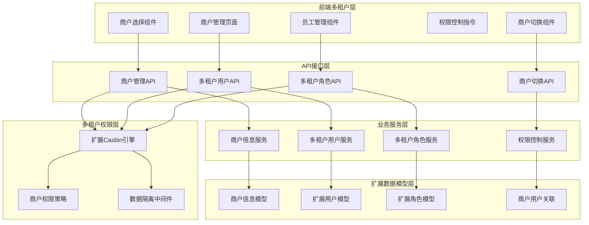
```mermaid
graph TB
    subgraph "前端多租户层"
        A[商户选择组件]
        B[商户管理页面]
        C[员工管理组件]
        D[权限控制指令]
        E[商户切换组件]
    end
    
    subgraph "API接口层"
        F[商户管理API]
        G[多租户用户API]
        H[多租户角色API]
        I[商户切换API]
    end
    
    subgraph "业务服务层"
        J[商户信息服务]
        K[多租户用户服务]
        L[多租户角色服务]
        M[权限控制服务]
    end
    
    subgraph "扩展数据模型层"
        N[商户信息模型]
        O[扩展用户模型]
        P[扩展角色模型]
        Q[商户用户关联]
    end
    
    subgraph "多租户权限层"
        R[扩展Casbin引擎]
        S[商户权限策略]
        T[数据隔离中间件]
    end
    
    A --> F
    B --> G
    C --> H
    E --> I
    F --> J
    G --> K
    H --> L
    I --> M
    J --> N
    K --> O
    L --> P
    M --> Q
    F --> R
    G --> R
    H --> R
    R --> S
    R --> T
```

## 多租户数据模型设计

### 现有表结构扩展

#### 现有数据兼容性处理

**重要说明**：为保证与现有系统的兼容性，在进行多租户改造时需要特别处理现有数据：

- **现有员工数据处理**：所有现有的sys_user表中的员工记录，在扩展MerchantID字段后，默认设置为商户ID = 1
- **现有角色数据处理**：所有现有的sys_authority表中的角色记录，在扩展MerchantID字段后，默认设置为商户ID = 1  
- **默认商户创建**：系统需要预先创建一个ID为1的默认商户，作为现有数据的归属商户
- **超级管理员处理**：根据新的设计，超级管理员也归属于默认商户（ID=1），但通过RoleType=1标识其特殊权限
- **系统角色标识**：现有的系统级角色（如超级管理员角色）通过RoleType字段标识为1

**数据迁移策略**：
```sql
-- 创建默认商户（ID=1）
INSERT INTO sys_merchant (id, merchant_code, merchant_name, merchant_type, level, path, contact_name, contact_phone, contact_email, status, merchant_level, operator_id, operator_name) 
VALUES (1, 'DEFAULT_MERCHANT', '默认商户', 'ENTERPRISE', 1, '1', '系统管理员', '13800000000', 'admin@system.com', 'ACTIVE', 'VIP', 1, '系统');

-- 更新所有现有员工数据，设置商户ID为1
UPDATE sys_user SET merchant_id = 1 WHERE merchant_id IS NULL;

-- 更新所有现有角色数据，设置商户ID为1，超级管理员角色设置RoleType=1
UPDATE sys_authority SET merchant_id = 1, role_type = 3 WHERE merchant_id IS NULL AND authority_name != '超级管理员';
UPDATE sys_authority SET merchant_id = 1, role_type = 1 WHERE authority_name = '超级管理员';

-- 创建员工商户关联记录
INSERT INTO sys_merchant_user (user_id, merchant_id, is_default, created_at, updated_at)
SELECT id, 1, true, NOW(), NOW() FROM sys_user WHERE id NOT IN (SELECT user_id FROM sys_merchant_user WHERE user_id IS NOT NULL);
```

#### sys_user 表扩展（员工表）
在现有sys_user表基础上增加商户相关字段：

| 新增字段名 | 类型 | 必填 | 索引 | 说明 | 示例值 |
|-----------|------|------|------|------|--------|
| MerchantID | uint | 是 | 普通索引 | 所属商户ID | 1 |
| IsMainAccount | bool | 否 | 无 | 是否为主账号 | true |

**注意**：原有Phone字段的唯一索引需要修改为复合唯一索引：`(phone, merchant_id, deleted_at)`，确保同一商户内手机号唯一。

**IsMainAccount字段说明**：
- 标识用户是否为商户的主管理员账号
- 商户创建时，同时创建的管理员用户该字段为 `true`
- 后续添加的员工用户该字段为 `false`
- 用于快速判断用户在商户中的管理权限等级
- 主账号通常拥有该商户的最高管理权限

**现有数据处理**：
- 现有员工数据在迁移后默认归属于商户ID=1
- 现有的第一个管理员用户（或指定的管理员）设置IsMainAccount=true
- 其他现有员工用户设置IsMainAccount=false

#### sys_authority 表扩展（角色表）
在现有sys_authority表基础上增加商户维度：

| 新增字段名 | 类型 | 必填 | 索引 | 说明 | 示例值 |
|-----------|------|------|------|------|--------|
| MerchantID | uint | 是 | 普通索引 | 所属商户ID | 1 |
| RoleType | int | 是 | 普通索引 | 角色类型：1-超级管理员 2-商户管理员 3-商户自定义角色 | 1 |

**角色类型说明**：

1. **超级管理员**（MerchantID = 1, RoleType = 1）
   - 属于默认商户（ID=1），但拥有跨商户权限
   - 通过权限控制实现跨商户数据访问
   - 可以管理所有商户和系统配置

2. **商户管理员**（MerchantID = 具体值, RoleType = 2）
   - 属于特定商户的系统预设管理员角色
   - 只能管理所属商户及其子商户的数据
   - 可以创建和管理商户内的员工和自定义角色

3. **商户自定义角色**（MerchantID = 具体值, RoleType = 3）
   - 由商户管理员创建的自定义角色
   - 权限范围受商户管理员分配限制
   - 如：销售专员、财务人员、客服等

**数据示例**：
```sql
-- 超级管理员（属于默认商户，但有跨商户权限）
INSERT INTO sys_authority (authority_name, merchant_id, role_type) 
VALUES ('超级管理员', 1, 1);

-- 商户1的管理员
INSERT INTO sys_authority (authority_name, merchant_id, role_type) 
VALUES ('商户管理员', 1, 2);

-- 商户2的管理员  
INSERT INTO sys_authority (authority_name, merchant_id, role_type) 
VALUES ('商户管理员', 2, 2);

-- 商户1的自定义角色
INSERT INTO sys_authority (authority_name, merchant_id, role_type) 
VALUES ('销售专员', 1, 3);

-- 商户2的自定义角色
INSERT INTO sys_authority (authority_name, merchant_id, role_type) 
VALUES ('财务人员', 2, 3);
```

#### 商户基础信息模型（sys_merchant）
新增商户主表：

| 字段名 | 类型 | 必填 | 索引 | 说明 | 示例值 |
|--------|------|------|------|------|--------|
| ID | uint | 是 | 主键 | 主键ID | 1 |
| MerchantCode | string | 是 | 唯一索引 | 商户编码 | MERCH20240001 |
| MerchantName | string | 是 | 普通索引 | 商户名称 | XX科技有限公司 |
| MerchantIcon | string | 否 | 无 | 商户图标URL | /uploads/icons/merchant_1.png |
| ParentID | uint | 否 | 普通索引 | 父商户ID（NULL表示顶级商户） | 1 |
| MerchantType | string | 是 | 无 | 商户类型 | ENTERPRISE, INDIVIDUAL |
| Level | int | 是 | 无 | 商户层级（1为顶级） | 1 |
| Path | string | 是 | 无 | 层级路径（如：1/2/3） | 1/2 |
| ContactName | string | 是 | 无 | 联系人姓名 | 张三 |
| ContactPhone | string | 是 | 无 | 联系电话 | 13800138000 |
| ContactEmail | string | 是 | 无 | 联系邮箱 | contact@example.com |
| BusinessLicense | string | 否 | 无 | 营业执照号 | 91110000000000000X |
| LegalPerson | string | 否 | 无 | 法人代表 | 李四 |
| RegisteredAddress | string | 否 | 无 | 注册地址 | 北京市朝阳区XX路XX号 |
| BusinessScope | string | 否 | 无 | 经营范围 | 技术开发、技术服务 |
| Status | string | 是 | 普通索引 | 商户状态 | PENDING, ACTIVE, SUSPENDED, DISABLED |
| MerchantLevel | string | 是 | 无 | 商户等级 | BASIC, PREMIUM, VIP |
| AdminUserID | uint | 否 | 外键 | 管理员用户ID | 2 |
| OperatorID | uint | 是 | 无 | 操作者用户ID | 1 |
| OperatorName | string | 是 | 无 | 操作者姓名 | 张三 |
| CreatedAt | time.Time | 是 | 无 | 创建时间 | 2024-01-01 10:00:00 |
| UpdatedAt | time.Time | 是 | 无 | 更新时间 | 2024-01-02 15:30:00 |
| DeletedAt | gorm.DeletedAt | 否 | 无 | 删除时间 | NULL |

**层级关系说明**：
- **ParentID**：指向父商户的ID，NULL表示顶级商户
- **Level**：商户在层级中的深度，顶级商户为1，子商户为2，依此类推
- **Path**：记录从根节点到当前节点的完整路径，便于层级查询

#### 商户用户关联模型（sys_merchant_user）
支持员工拥有多个商户身份的关联表：

| 字段名 | 类型 | 必填 | 索引 | 说明 | 示例值 |
|--------|------|------|------|------|--------|
| ID | uint | 是 | 主键 | 主键ID | 1 |
| UserID | uint | 是 | 复合索引1 | 用户ID | 2 |
| MerchantID | uint | 是 | 复合索引1 | 商户ID | 1 |
| IsDefault | bool | 否 | 无 | 是否为默认商户 | true |
| JoinedAt | time.Time | 是 | 无 | 加入时间 | 2024-01-01 10:00:00 |
| Status | string | 是 | 无 | 关联状态 | ACTIVE, SUSPENDED |
| CreatedAt | time.Time | 是 | 无 | 创建时间 | 2024-01-01 10:00:00 |
| UpdatedAt | time.Time | 是 | 无 | 更新时间 | 2024-01-02 15:30:00 |

**复合唯一索引**：`(user_id, merchant_id)` 确保用户与商户的关联唯一性

#### 商户状态变更记录模型（sys_merchant_status_log）

| 字段名 | 类型 | 必填 | 索引 | 说明 | 示例值 |
|--------|------|------|------|------|--------|
| ID | uint | 是 | 主键 | 主键ID | 1 |
| MerchantID | uint | 是 | 外键索引 | 商户ID | 1 |
| PreviousStatus | string | 是 | 无 | 变更前状态 | PENDING |
| NewStatus | string | 是 | 无 | 变更后状态 | ACTIVE |
| ChangeReason | string | 是 | 无 | 变更原因 | 审核通过 |
| OperatorID | uint | 是 | 无 | 操作者用户ID | 2 |
| OperatorName | string | 是 | 无 | 操作者姓名 | 张三 |
| OperatorMerchantID | uint | 否 | 无 | 操作者所属商户ID | 1 |
| CreatedAt | time.Time | 是 | 无 | 变更时间 | 2024-01-02 15:00:00 |

### 商户层级关系设计

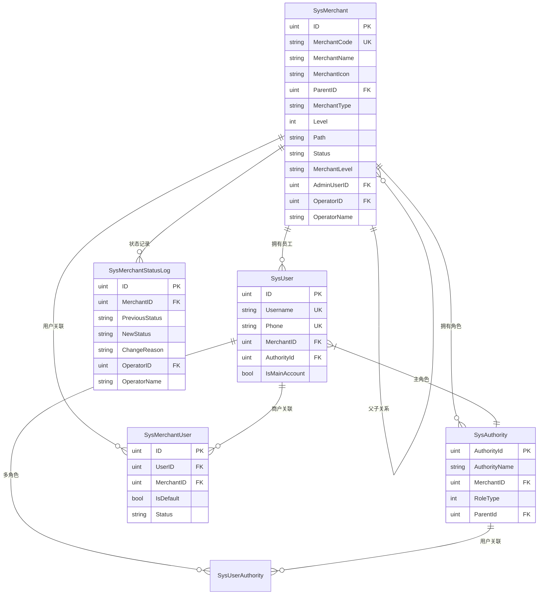
```mermaid
erDiagram
    SysMerchant ||--o{ SysMerchant : "父子关系"
    SysMerchant ||--o{ SysUser : "拥有员工"
    SysMerchant ||--o{ SysAuthority : "拥有角色"
    SysMerchant ||--o{ SysMerchantStatusLog : "状态记录"
    SysMerchant ||--o{ SysMerchantUser : "用户关联"
    
    SysUser ||--o{ SysMerchantUser : "商户关联"
    SysUser }|--|| SysAuthority : "主角色"
    SysUser ||--o{ SysUserAuthority : "多角色"
    
    SysAuthority ||--o{ SysUserAuthority : "用户关联"
    
    SysMerchant {
        uint ID PK
        string MerchantCode UK
        string MerchantName
        string MerchantIcon
        uint ParentID FK
        string MerchantType
        int Level
        string Path
        string Status
        string MerchantLevel
        uint AdminUserID FK
        uint OperatorID FK
        string OperatorName
    }
    
    SysUser {
        uint ID PK
        string Username UK
        string Phone UK
        uint MerchantID FK
        uint AuthorityId FK
        bool IsMainAccount
    }
    
    SysAuthority {
        uint AuthorityId PK
        string AuthorityName
        uint MerchantID FK
        int RoleType
        uint ParentId FK
    }
    
    SysMerchantUser {
        uint ID PK
        uint UserID FK
        uint MerchantID FK
        bool IsDefault
        string Status
    }
    
    SysMerchantStatusLog {
        uint ID PK
        uint MerchantID FK
        string PreviousStatus
        string NewStatus
        string ChangeReason
        uint OperatorID FK
        string OperatorName
    }
```

### 商户层级结构示例

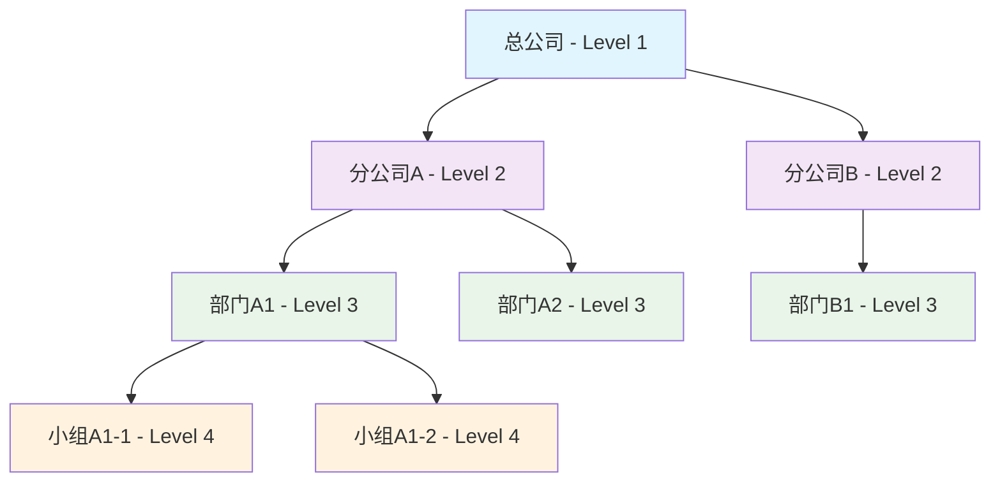
```mermaid
graph TD
    A[总公司 - Level 1]
    B[分公司A - Level 2]
    C[分公司B - Level 2]
    D[部门A1 - Level 3]
    E[部门A2 - Level 3]
    F[部门B1 - Level 3]
    G[小组A1-1 - Level 4]
    H[小组A1-2 - Level 4]
    
    A --> B
    A --> C
    B --> D
    B --> E
    C --> F
    D --> G
    D --> H
    
    style A fill:#e1f5fe
    style B fill:#f3e5f5
    style C fill:#f3e5f5
    style D fill:#e8f5e8
    style E fill:#e8f5e8
    style F fill:#e8f5e8
    style G fill:#fff3e0
    style H fill:#fff3e0
```

## 多租户API接口设计

### 接口规范说明
- 遵循 RESTful API 设计规范，增加商户上下文
- 统一使用 JSON 格式进行数据交换
- 扩展JWT认证，Token中包含当前商户ID信息
- 集成商户维度的Casbin权限控制
- 所有业务接口自动进行商户数据隔离
- 支持多商户切换和上下文管理

### 商户选择与切换接口

#### 获取用户所属商户列表
- **接口路径**：`GET /api/v1/user/merchants`
- **权限要求**：已登录用户
- **响应格式**：
```json
{
    "code": 0,
    "message": "获取成功",
    "data": {
        "merchants": [
            {
                "merchantId": 1,
                "merchantCode": "MERCH20240001",
                "merchantName": "XX科技有限公司",
                "isDefault": true,
                "status": "ACTIVE",
                "joinedAt": "2024-01-01T10:00:00Z"
            }
        ]
    }
}
```

#### 切换当前商户
- **接口路径**：`POST /api/v1/user/switch-merchant`
- **权限要求**：已登录用户
- **请求参数**：

| 参数名 | 类型 | 必填 | 说明 |
|--------|------|------|------|
| merchantId | uint | 是 | 要切换到的商户ID |

- **响应格式**：
```json
{
    "code": 0,
    "message": "切换成功",
    "data": {
        "token": "new_jwt_token_with_merchant_context",
        "merchantInfo": {
            "merchantId": 1,
            "merchantName": "XX科技有限公司",
            "userRole": "merchant_admin"
        }
    }
}
```

### 商户信息管理接口

#### 创建商户
- **接口路径**：`POST /api/v1/merchant`
- **权限要求**：系统管理员权限（不受商户限制）
- **请求参数**：

| 参数名 | 类型 | 必填 | 说明 |
|--------|------|------|------|
| merchantName | string | 是 | 商户名称 |
| parentId | uint | 否 | 父商户ID（不填为顶级商户） |
| merchantType | string | 是 | 商户类型（ENTERPRISE/INDIVIDUAL） |
| contactName | string | 是 | 联系人姓名 |
| contactPhone | string | 是 | 联系电话 |
| contactEmail | string | 是 | 联系邮箱 |
| businessLicense | string | 否 | 营业执照号 |
| legalPerson | string | 否 | 法人代表 |
| registeredAddress | string | 否 | 注册地址 |
| businessScope | string | 否 | 经营范围 |
| adminUserInfo | object | 是 | 管理员用户信息 |

**adminUserInfo 对象结构：**
| 参数名 | 类型 | 必填 | 说明 |
|--------|------|------|------|
| username | string | 是 | 管理员登录名 |
| password | string | 是 | 管理员密码 |
| nickName | string | 是 | 管理员昵称 |
| name | string | 是 | 管理员真实姓名 |
| phone | string | 是 | 管理员手机号 |
| email | string | 是 | 管理员邮箱 |

**层级关系处理**：
- 如果提供parentId，系统会自动计算level和path
- 顶级商户：level=1, path=merchantId
- 子商户：level=父商户level+1, path=父商户path/merchantId

#### 查询商户层级结构
- **接口路径**：`GET /api/v1/merchant/tree`
- **权限要求**：根据角色自动过滤数据
- **查询参数**：

| 参数名 | 类型 | 必填 | 说明 |
|--------|------|------|------|
| rootId | uint | 否 | 指定根节点ID（不填则显示所有顶级商户） |
| maxLevel | int | 否 | 最大层级深度（限制展示层数） |
| includeInactive | bool | 否 | 是否包含非活跃商户 |

- **响应格式**：
```json
{
    "code": 0,
    "message": "获取成功",
    "data": {
        "merchantTree": [
            {
                "merchantId": 1,
                "merchantName": "总公司",
                "merchantIcon": "/uploads/icons/merchant_1.png",
                "parentId": null,
                "level": 1,
                "path": "1",
                "status": "ACTIVE",
                "children": [
                    {
                        "merchantId": 2,
                        "merchantName": "分公司A",
                        "merchantIcon": "/uploads/icons/merchant_2.png",
                        "parentId": 1,
                        "level": 2,
                        "path": "1/2",
                        "status": "ACTIVE",
                        "children": []
                    }
                ]
            }
        ]
    }
}
```

#### 查询商户子级列表
- **接口路径**：`GET /api/v1/merchant/:id/children`
- **权限要求**：商户管理员或系统管理员
- **功能说明**：获取指定商户的直接子级商户列表

#### 查询商户祖先路径
- **接口路径**：`GET /api/v1/merchant/:id/ancestors`
- **权限要求**：商户管理员或系统管理员
- **功能说明**：获取从根节点到当前商户的完整路径

#### 移动商户位置
- **接口路径**：`PUT /api/v1/merchant/:id/move`
- **权限要求**：仅系统管理员可操作
- **请求参数**：

| 参数名 | 类型 | 必填 | 说明 |
|--------|------|------|------|
| newParentId | uint | 否 | 新的父商户ID（NULL表示移动到顶级） |

**校验规则**：
- 不能将商户移动到其自身或其子孙节点下
- 移动后自动更新所有子孙节点的level和path

#### 查询商户列表
- **接口路径**：`GET /api/v1/merchant/list`
- **权限要求**：根据角色自动过滤数据
  - 系统管理员：可查看所有商户
  - 商户管理员：只能查看所属商户及其子级商户
- **查询参数**：

| 参数名 | 类型 | 必填 | 说明 |
|--------|------|------|------|
| page | int | 否 | 页码（默认1） |
| pageSize | int | 否 | 每页数量（默认10） |
| merchantName | string | 否 | 商户名称（模糊查询） |
| merchantType | string | 否 | 商户类型筛选 |
| status | string | 否 | 状态筛选 |
| parentId | uint | 否 | 父商户ID筛选 |
| level | int | 否 | 层级筛选 |
| treeView | bool | 否 | 是否返回树形结构 |

#### 更新商户信息
- **接口路径**：`PUT /api/v1/merchant/:id`
- **权限要求**：商户管理员或系统管理员
- **数据隔离**：自动校验商户权限，只能修改所属商户

#### 商户状态管理
- **接口路径**：`PUT /api/v1/merchant/:id/status`
- **权限要求**：仅系统管理员可操作

### 多租户员工管理接口

#### 创建商户员工
- **接口路径**：`POST /api/v1/merchant/user`
- **权限要求**：商户管理员权限
- **自动处理**：自动设置员工的merchant_id为当前商户
- **校验规则**：手机号在当前商户内唯一

#### 查询商户员工列表
- **接口路径**：`GET /api/v1/merchant/user/list`
- **数据隔离**：自动过滤，只返回当前商户的员工

#### 添加现有员工到商户
- **接口路径**：`POST /api/v1/merchant/user/add`
- **权限要求**：商户管理员权限
- **请求参数**：

| 参数名 | 类型 | 必填 | 说明 |
|--------|------|------|------|
| userId | uint | 是 | 用户ID |
| isDefault | bool | 否 | 是否为默认商户 |

### 员工角色权限管理接口

#### 获取商户内可分配角色权限
- **接口路径**：`GET /api/v1/merchant/role/permissions/assignable`
- **权限要求**：商户管理员或超级管理员
- **功能说明**：获取当前商户内可以分配给员工角色的权限列表

#### 分配角色权限
- **接口路径**：`PUT /api/v1/merchant/role/:roleId/permissions`
- **权限要求**：商户管理员或超级管理员
- **请求参数**：

| 参数名 | 类型 | 必填 | 说明 |
|--------|------|------|------|
| permissions | array | 是 | 权限代码数组 |

#### 员工角色分配
- **接口路径**：`PUT /api/v1/merchant/user/:userId/roles`
- **权限要求**：商户管理员或超级管理员
- **请求参数**：

| 参数名 | 类型 | 必填 | 说明 |
|--------|------|------|------|
| roleIds | array | 是 | 角色ID数组 |

### 商户权限分配管理接口

#### 获取可分配权限列表
- **接口路径**：`GET /api/v1/system/permissions/assignable`
- **权限要求**：仅超级管理员可操作
- **功能说明**：获取所有可以分配给商户管理员的权限列表
- **响应格式**：
```json
{
    "code": 0,
    "message": "获取成功",
    "data": {
        "permissions": [
            {
                "permissionCode": "merchant:info:view",
                "permissionName": "商户信息查看",
                "category": "merchant_info",
                "description": "查看商户基本信息",
                "isRequired": true
            },
            {
                "permissionCode": "merchant:info:update",
                "permissionName": "商户信息编辑",
                "category": "merchant_info",
                "description": "编辑商户基本信息",
                "isRequired": false
            },
            {
                "permissionCode": "merchant:user:list",
                "permissionName": "商户员工查看",
                "category": "employee_management",
                "description": "查看商户员工列表",
                "isRequired": false
            },
            {
                "permissionCode": "merchant:user:create",
                "permissionName": "商户员工创建",
                "category": "employee_management",
                "description": "创建新的商户员工",
                "isRequired": false
            },
            {
                "permissionCode": "merchant:user:update",
                "permissionName": "商户员工编辑",
                "category": "employee_management",
                "description": "编辑商户员工信息",
                "isRequired": false
            },
            {
                "permissionCode": "merchant:user:delete",
                "permissionName": "商户员工删除",
                "category": "employee_management",
                "description": "删除商户员工",
                "isRequired": false
            },
            {
                "permissionCode": "merchant:role:list",
                "permissionName": "商户角色查看",
                "category": "role_management",
                "description": "查看商户角色列表",
                "isRequired": false
            },
            {
                "permissionCode": "merchant:role:create",
                "permissionName": "商户角色创建",
                "category": "role_management",
                "description": "创建新的商户角色",
                "isRequired": false
            },
            {
                "permissionCode": "merchant:role:update",
                "permissionName": "商户角色编辑",
                "category": "role_management",
                "description": "编辑商户角色信息",
                "isRequired": false
            },
            {
                "permissionCode": "merchant:role:delete",
                "permissionName": "商户角色删除",
                "category": "role_management",
                "description": "删除商户角色",
                "isRequired": false
            },
            {
                "permissionCode": "merchant:auth:submit",
                "permissionName": "认证资料提交",
                "category": "authentication",
                "description": "提交商户认证资料",
                "isRequired": false
            }
        ],
        "categories": [
            {
                "categoryCode": "merchant_info",
                "categoryName": "商户信息管理",
                "description": "商户基本信息管理相关权限"
            },
            {
                "categoryCode": "employee_management",
                "categoryName": "员工管理",
                "description": "商户员工管理相关权限"
            },
            {
                "categoryCode": "role_management",
                "categoryName": "角色管理",
                "description": "商户角色管理相关权限"
            },
            {
                "categoryCode": "authentication",
                "categoryName": "认证管理",
                "description": "商户认证相关权限"
            }
        ]
    }
}
```

#### 分配商户权限
- **接口路径**：`PUT /api/v1/merchant/:id/permissions`
- **权限要求**：仅超级管理员可操作
- **请求参数**：

| 参数名 | 类型 | 必填 | 说明 |
|--------|------|------|------|
| permissions | array | 是 | 权限代码数组 |
| assignToAdmin | bool | 否 | 是否同时分配给商户管理员 |

- **请求示例**：
```json
{
    "permissions": [
        "merchant:info:view",
        "merchant:info:update",
        "merchant:user:list",
        "merchant:user:create",
        "merchant:user:update",
        "merchant:role:list",
        "merchant:role:create"
    ],
    "assignToAdmin": true
}
```

- **响应格式**：
```json
{
    "code": 0,
    "message": "权限分配成功",
    "data": {
        "merchantId": 1,
        "assignedPermissions": [
            "merchant:info:view",
            "merchant:info:update",
            "merchant:user:list",
            "merchant:user:create",
            "merchant:user:update",
            "merchant:role:list",
            "merchant:role:create"
        ],
        "adminUserId": 2,
        "adminUpdated": true,
        "assignTime": "2024-01-01T10:00:00Z"
    }
}
```

#### 获取商户权限
- **接口路径**：`GET /api/v1/merchant/:id/permissions`
- **权限要求**：超级管理员或商户管理员
- **功能说明**：获取指定商户已分配的权限列表
- **响应格式**：
```json
{
    "code": 0,
    "message": "获取成功",
    "data": {
        "merchantId": 1,
        "merchantName": "XX科技有限公司",
        "permissions": [
            {
                "permissionCode": "merchant:info:view",
                "permissionName": "商户信息查看",
                "category": "merchant_info",
                "assignedAt": "2024-01-01T10:00:00Z",
                "assignedBy": "super_admin"
            }
        ],
        "lastUpdated": "2024-01-01T10:00:00Z"
    }
}
```

## 多租户业务流程设计

### 三级权限体系流程设计

#### 超级管理员分配商户权限流程

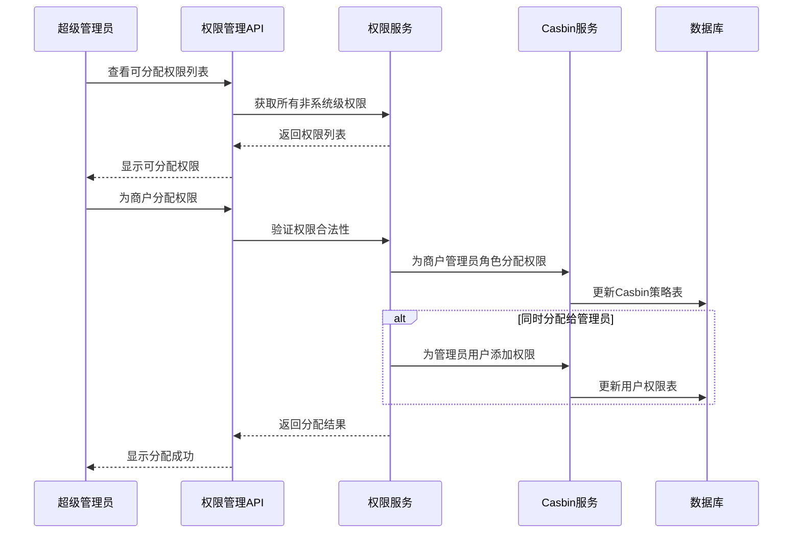
```mermaid
sequenceDiagram
    participant SA as 超级管理员
    participant API as 权限管理API
    participant PS as 权限服务
    participant CS as Casbin服务
    participant DB as 数据库
    
    SA->>API: 查看可分配权限列表
    API->>PS: 获取所有非系统级权限
    PS-->>API: 返回权限列表
    API-->>SA: 显示可分配权限
    
    SA->>API: 为商户分配权限
    API->>PS: 验证权限合法性
    PS->>CS: 为商户管理员角色分配权限
    CS->>DB: 更新Casbin策略表
    
    alt 同时分配给管理员
        PS->>CS: 为管理员用户添加权限
        CS->>DB: 更新用户权限表
    end
    
    PS-->>API: 返回分配结果
    API-->>SA: 显示分配成功
```

#### 商户管理员分配员工权限流程

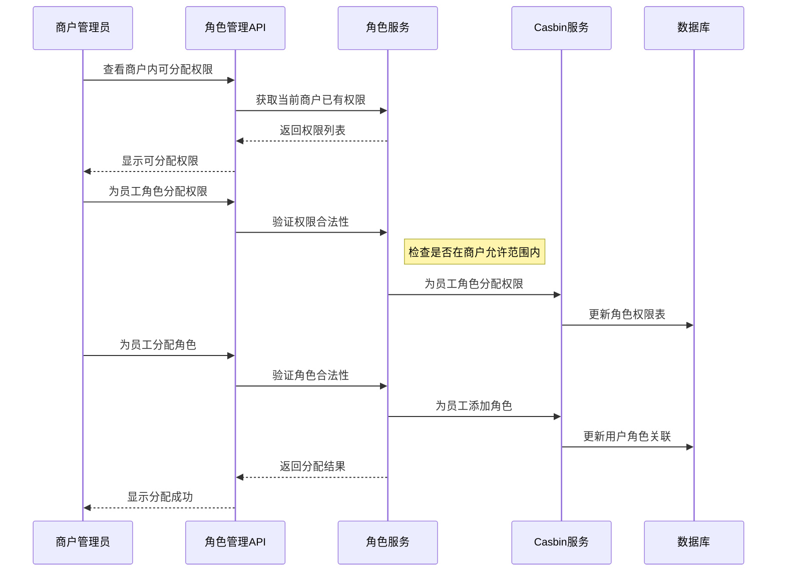
```mermaid
sequenceDiagram
    participant MA as 商户管理员
    participant API as 角色管理API
    participant RS as 角色服务
    participant CS as Casbin服务
    participant DB as 数据库
    
    MA->>API: 查看商户内可分配权限
    API->>RS: 获取当前商户已有权限
    RS-->>API: 返回权限列表
    API-->>MA: 显示可分配权限
    
    MA->>API: 为员工角色分配权限
    API->>RS: 验证权限合法性
    note right of RS: 检查是否在商户允许范围内
    RS->>CS: 为员工角色分配权限
    CS->>DB: 更新角色权限表
    
    MA->>API: 为员工分配角色
    API->>RS: 验证角色合法性
    RS->>CS: 为员工添加角色
    CS->>DB: 更新用户角色关联
    
    RS-->>API: 返回分配结果
    API-->>MA: 显示分配成功
```

### 商户移动操作流程

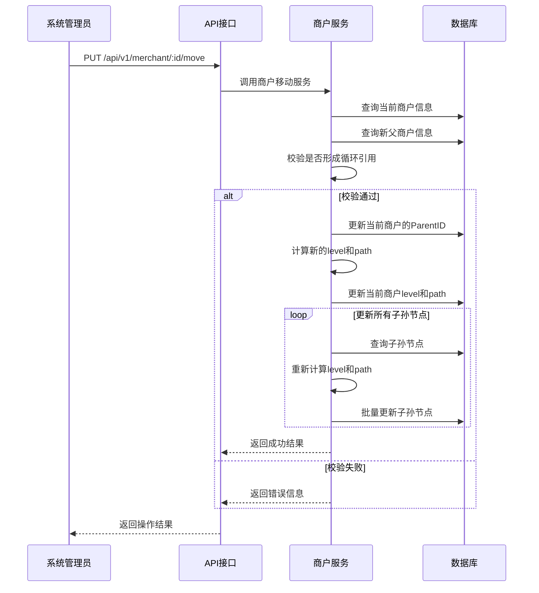
```mermaid
sequenceDiagram
    participant Admin as 系统管理员
    participant API as API接口
    participant MS as 商户服务
    participant DB as 数据库
    
    Admin->>API: PUT /api/v1/merchant/:id/move
    API->>MS: 调用商户移动服务
    
    MS->>DB: 查询当前商户信息
    MS->>DB: 查询新父商户信息
    MS->>MS: 校验是否形成循环引用
    
    alt 校验通过
        MS->>DB: 更新当前商户的ParentID
        MS->>MS: 计算新的level和path
        MS->>DB: 更新当前商户level和path
        
        loop 更新所有子孙节点
            MS->>DB: 查询子孙节点
            MS->>MS: 重新计算level和path
            MS->>DB: 批量更新子孙节点
        end
        
        MS-->>API: 返回成功结果
    else 校验失败
        MS-->>API: 返回错误信息
    end
    
    API-->>Admin: 返回操作结果
```

### 商户认证审核流程

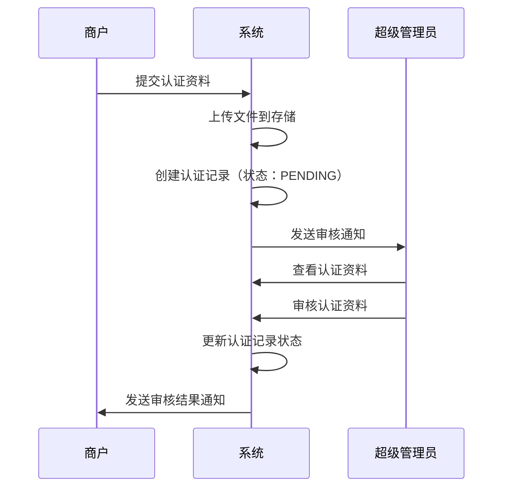
```mermaid
sequenceDiagram
    participant M as 商户
    participant S as 系统
    participant SA as 超级管理员
    
    M->>S: 提交认证资料
    S->>S: 上传文件到存储
    S->>S: 创建认证记录（状态：PENDING）
    S->>SA: 发送审核通知
    
    SA->>S: 查看认证资料
    SA->>S: 审核认证资料
    S->>S: 更新认证记录状态
    S->>M: 发送审核结果通知
```

### 多商户员工登录流程

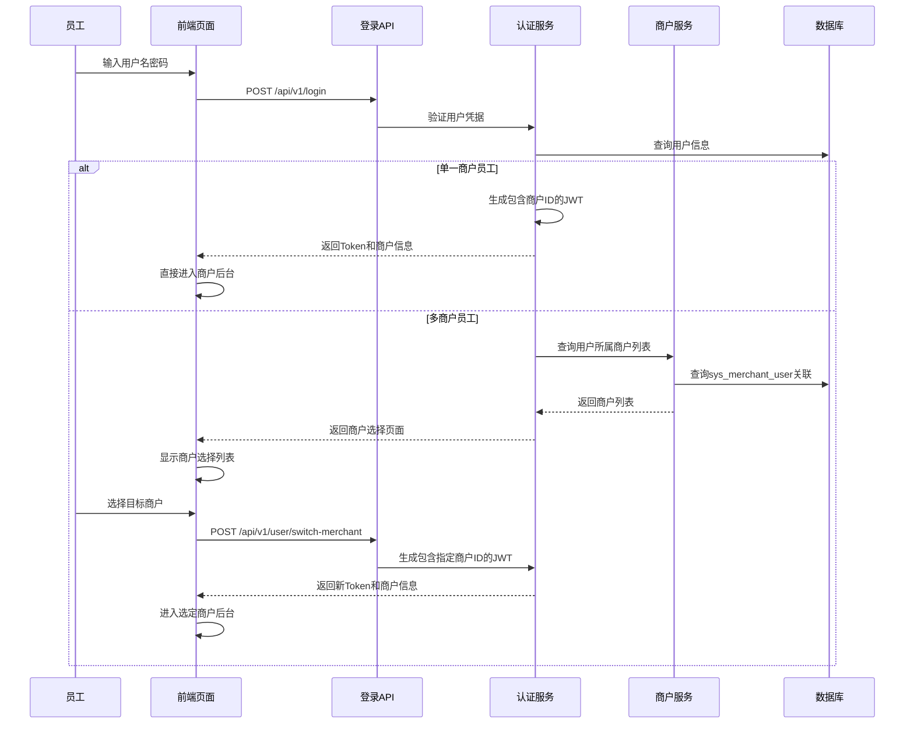
```mermaid
sequenceDiagram
    participant U as 员工
    participant F as 前端页面
    participant API as 登录API
    participant AUTH as 认证服务
    participant MS as 商户服务
    participant DB as 数据库
    
    U->>F: 输入用户名密码
    F->>API: POST /api/v1/login
    API->>AUTH: 验证用户凭据
    AUTH->>DB: 查询用户信息
    
    alt 单一商户员工
        AUTH->>AUTH: 生成包含商户ID的JWT
        AUTH-->>F: 返回Token和商户信息
        F->>F: 直接进入商户后台
    else 多商户员工
        AUTH->>MS: 查询用户所属商户列表
        MS->>DB: 查询sys_merchant_user关联
        MS-->>AUTH: 返回商户列表
        AUTH-->>F: 返回商户选择页面
        F->>F: 显示商户选择列表
        U->>F: 选择目标商户
        F->>API: POST /api/v1/user/switch-merchant
        API->>AUTH: 生成包含指定商户ID的JWT
        AUTH-->>F: 返回新Token和商户信息
        F->>F: 进入选定商户后台
    end
```

### 商户内数据隔离流程

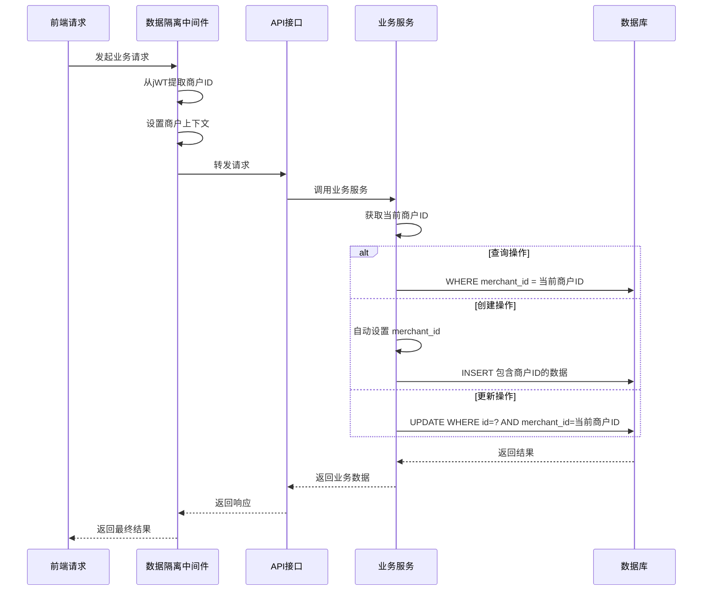
```mermaid
sequenceDiagram
    participant F as 前端请求
    participant MW as 数据隔离中间件
    participant API as API接口
    participant SVC as 业务服务
    participant DB as 数据库
    
    F->>MW: 发起业务请求
    MW->>MW: 从jWT提取商户ID
    MW->>MW: 设置商户上下文
    MW->>API: 转发请求
    
    API->>SVC: 调用业务服务
    SVC->>SVC: 获取当前商户ID
    
    alt 查询操作
        SVC->>DB: WHERE merchant_id = 当前商户ID
    else 创建操作
        SVC->>SVC: 自动设置 merchant_id
        SVC->>DB: INSERT 包含商户ID的数据
    else 更新操作
        SVC->>DB: UPDATE WHERE id=? AND merchant_id=当前商户ID
    end
    
    DB-->>SVC: 返回结果
    SVC-->>API: 返回业务数据
    API-->>MW: 返回响应
    MW-->>F: 返回最终结果
```

### 商户切换流程

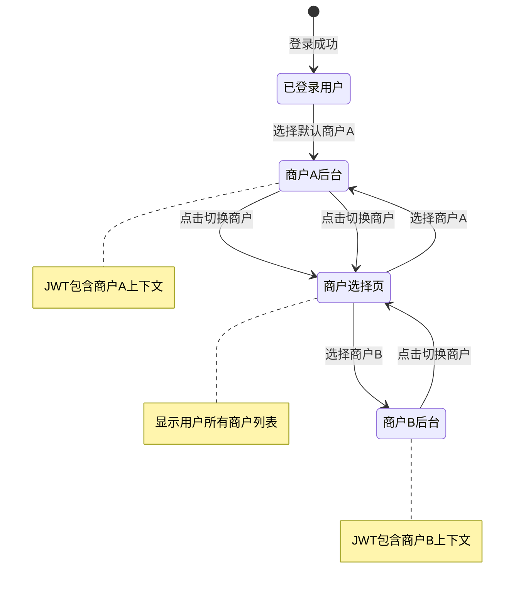
```mermaid
stateDiagram-v2
    [*] --> 已登录用户 : 登录成功
    已登录用户 --> 商户A后台 : 选择默认商户A
    商户A后台 --> 商户选择页 : 点击切换商户
    商户选择页 --> 商户B后台 : 选择商户B
    商户B后台 --> 商户选择页 : 点击切换商户
    商户A后台 --> 商户选择页 : 点击切换商户
    商户选择页 --> 商户A后台 : 选择商户A
    
    note right of 商户A后台 : JWT包含商户A上下文
    note right of 商户B后台 : JWT包含商户B上下文
    note right of 商户选择页 : 显示用户所有商户列表
```

### 原有系统界面兼容性改造

#### 员工列表页面改造

**前端页面修改（user.vue）**

1. **表格列增加**
   - 在现有表格中增加"商户信息"列，显示商户ID和商户名称
   - 位置：在"用户角色"列之后，"状态"列之前

2. **搜索条件扩展**
   - 增加商户筛选下拉框，支持按商户过滤员工列表
   - 超级管理员可看到所有商户选项
   - 商户管理员只能看到自己的商户及子商户

3. **数据获取逻辑**
   - 调用API时自动根据当前用户权限过滤数据
   - 界面显示时关联查询商户信息

**后端接口修改（GetUserList）**

1. **请求参数扩展**
   - GetUserList结构体增加MerchantId字段，支持按商户筛选
   - 增加MerchantName字段，支持按商户名称模糊搜索

2. **查询逻辑增强**
   - 在GetUserInfoList方法中增加商户关联查询
   - 使用Preload加载商户信息
   - 根据用户权限自动过滤可见数据范围

3. **返回数据结构**
   - SysUser结构体关联Merchant信息
   - 返回数据包含完整的商户ID和商户名称

#### 角色列表页面改造

**前端页面修改（authority.vue）**

1. **表格列增加**
   - 在现有表格中增加"所属商户"列，显示商户ID和商户名称
   - 位置：在"角色名称"列之后，"更新时间"列之前

2. **商户筛选功能**
   - 增加商户下拉筛选器
   - 根据用户权限控制可见商户范围

3. **角色创建/编辑**
   - 新增角色时需要选择所属商户
   - 商户管理员只能在自己的商户下创建角色

**后端接口修改（GetAuthorityList）**

1. **查询逻辑修改**
   - GetAuthorityInfoList方法增加商户过滤逻辑
   - 根据当前用户的商户权限过滤角色列表
   - 支持商户层级查询（父子商户关系）

2. **数据关联**
   - SysAuthority结构体关联Merchant信息
   - 查询时预加载商户数据

#### 接口兼容性设计

**请求参数结构扩展**

| 接口 | 原有参数 | 新增参数 | 说明 |
|------|----------|----------|---------|
| GetUserList | Username, NickName, Phone, Email | MerchantId, MerchantName | 商户筛选支持 |
| GetAuthorityList | PageInfo | MerchantId, MerchantName | 商户角色筛选 |

**响应数据结构扩展**

| 实体 | 原有字段 | 新增字段 | 说明 |
|------|----------|----------|---------|
| SysUser | 基础用户信息 | MerchantId, MerchantName, Merchants | 商户关联信息 |
| SysAuthority | 基础角色信息 | MerchantId, MerchantName | 商户归属信息 |

**权限控制策略**

1. **数据可见性**
   - 超级管理员：查看所有商户的员工和角色
   - 商户管理员：仅查看本商户及子商户的员工和角色
   - 普通员工：仅查看本人信息

2. **操作权限**
   - 员工管理：只能管理所属商户范围内的员工
   - 角色管理：只能管理所属商户的角色
   - 跨商户操作需要相应权限验证

#### 界面交互优化

**商户信息展示**
- 采用两行显示格式：第一行显示商户名称，第二行显示商户ID
- 使用颜色区分不同商户，提升用户体验
- 支持点击商户名称快速筛选该商户下的数据

**筛选器设计**
- 商户下拉框支持搜索功能
- 记住用户的筛选偏好
- 提供"全部商户"选项（仅超级管理员可见）

**兼容性保证**
- 现有功能保持不变
- 新增字段采用非必填设计
- 向前兼容旧版本API调用

### 现有员工登录界面改造

#### 登录流程优化设计

**多商户登录场景分析**：
1. **单商户员工**：用户只属于一个商户，登录后直接进入该商户后台
2. **多商户员工**：用户属于多个商户，登录后需要选择要进入的商户
3. **现有员工兼容**：现有员工默认归属商户ID=1，保持原有登录体验

#### 前端登录页面改造（login.vue）

**1. 登录表单保持不变**
- 保留原有的用户名/手机号、密码、验证码输入框
- 不在登录页面增加商户选择，避免用户困惑
- 保持原有的登录UI设计和交互逻辑

**2. 登录后处理逻辑修改**
- 登录成功后调用 `/api/v1/user/merchants` 获取用户所属商户列表
- 根据商户数量进行不同的跳转处理：
  - 单商户：直接跳转到后台首页（保持原有体验）
  - 多商户：跳转到商户选择页面

**3. 商户选择页面设计（merchant-select.vue）**

```vue
<template>
  <div class="merchant-select-container">
    <div class="select-header">
      <h2>选择要进入的商户</h2>
      <p class="user-info">欢迎，{{ userInfo.nickName }}</p>
    </div>
    
    <div class="merchant-list">
      <div 
        v-for="merchant in merchantList" 
        :key="merchant.merchantId"
        class="merchant-card"
        @click="selectMerchant(merchant)"
      >
        <div class="merchant-icon">
          
          <div v-else class="default-icon">{{ merchant.merchantName.charAt(0) }}</div>
        </div>
        <div class="merchant-info">
          <h3>{{ merchant.merchantName }}</h3>
          <p class="merchant-id">商户ID: {{ merchant.merchantId }}</p>
          <span v-if="merchant.isDefault" class="default-badge">默认</span>
        </div>
        <div class="enter-btn">
          <el-button type="primary">进入</el-button>
        </div>
      </div>
    </div>
    
    <div class="footer-actions">
      <el-button @click="logout">退出登录</el-button>
    </div>
  </div>
</template>
```

**4. 商户选择页面交互逻辑**
- 展示用户所属的所有商户列表
- 支持点击选择商户并进入对应后台
- 记住用户的选择偏好（下次登录时优先显示）
- 提供退出登录选项

#### 后端登录接口修改

**现有登录接口保持兼容（/api/v1/base/login）**

1. **登录验证逻辑不变**
   - 保持原有的用户名/密码验证
   - 保持原有的验证码校验
   - 保持原有的用户状态检查

2. **响应数据结构扩展**
   ```json
   {
     "code": 0,
     "message": "登录成功",
     "data": {
       "user": {
         "userName": "admin",
         "nickName": "管理员",
         "uuid": "xxx-xxx-xxx",
         "userId": 1,
         "authorityId": "super_admin",
         // 新增字段
         "merchantId": 1,
         "merchantCount": 1,  // 用户所属商户数量
         "isMultiMerchant": false  // 是否多商户用户
       },
       "token": "jwt_token_here",
       "expiresAt": "2024-01-01T10:00:00Z"
     }
   }
   ```

3. **Token生成策略**
   - **单商户用户**：直接在Token中包含商户ID信息
   - **多商户用户**：生成临时Token，不包含具体商户ID，用于获取商户列表
   - **商户选择后**：通过 `/api/v1/user/switch-merchant` 获取包含商户上下文的正式Token

#### 用户商户列表接口

**新增接口：获取用户所属商户列表**
- **接口路径**：`GET /api/v1/user/merchants`
- **调用时机**：登录成功后立即调用
- **权限要求**：需要有效的登录Token
- **响应格式**：
```json
{
  "code": 0,
  "message": "获取成功",
  "data": {
    "merchants": [
      {
        "merchantId": 1,
        "merchantCode": "MERCH20240001",
        "merchantName": "XX科技有限公司",
        "merchantIcon": "/uploads/icons/merchant_1.png",
        "isDefault": true,
        "status": "ACTIVE",
        "userRole": "merchant_admin",
        "joinedAt": "2024-01-01T10:00:00Z"
      }
    ],
    "defaultMerchantId": 1  // 用户的默认商户ID
  }
}
```

#### 商户选择接口优化

**商户切换接口增强（/api/v1/user/switch-merchant）**
- 支持登录后的首次商户选择
- 支持已登录用户的商户切换
- 统一的Token刷新机制

#### 前端路由守卫修改

**路由拦截逻辑更新**
```javascript
// router/index.js - 路由守卫
router.beforeEach(async (to, from, next) => {
  const userStore = useUserStore()
  const tenantStore = useTenantStore()
  const token = getToken()
  
  if (token) {
    // 已登录用户
    if (!userStore.userInfo.userId) {
      // 获取用户信息
      await userStore.getUserInfo()
    }
    
    // 检查是否需要选择商户
    if (userStore.userInfo.isMultiMerchant && !tenantStore.currentMerchantId) {
      // 多商户用户但未选择商户，跳转到商户选择页
      if (to.path !== '/merchant-select') {
        next('/merchant-select')
        return
      }
    }
    
    // 单商户用户或已选择商户，正常访问
    next()
  } else {
    // 未登录，跳转登录页
    if (to.path !== '/login') {
      next('/login')
    } else {
      next()
    }
  }
})
```

#### 状态管理修改

**用户状态管理扩展（stores/user.js）**
```javascript
export const useUserStore = defineStore('user', {
  state: () => ({
    // 原有字段保持不变
    userInfo: {},
    token: '',
    
    // 新增多商户相关字段
    merchantCount: 0,
    isMultiMerchant: false,
    userMerchants: []
  }),
  
  actions: {
    // 登录方法增强
    async login(loginForm) {
      const response = await login(loginForm)
      
      // 保存用户基础信息
      this.userInfo = response.data.user
      this.token = response.data.token
      this.merchantCount = response.data.user.merchantCount
      this.isMultiMerchant = response.data.user.isMultiMerchant
      
      // 设置Token
      setToken(response.data.token)
      
      // 如果是多商户用户，获取商户列表
      if (this.isMultiMerchant) {
        await this.fetchUserMerchants()
      }
      
      return response.data
    },
    
    // 获取用户商户列表
    async fetchUserMerchants() {
      const response = await getUserMerchants()
      this.userMerchants = response.data.merchants
      
      // 设置默认商户
      const defaultMerchant = response.data.merchants.find(m => m.isDefault)
      if (defaultMerchant && !this.isMultiMerchant) {
        useTenantStore().setCurrentMerchant(defaultMerchant)
      }
    }
  }
})
```

#### 兼容性保障措施

**1. 现有用户体验保持不变**
- 现有单商户用户登录后直接进入后台，无需额外选择
- 登录界面UI保持原有设计，用户无感知
- 现有的自动登录、记住密码等功能正常工作

**2. 渐进式升级支持**
- 支持用户逐步被添加到多个商户
- 首次成为多商户用户时，引导用户了解商户选择功能
- 提供用户偏好设置，可选择默认进入的商户

**3. 错误处理和降级**
- 商户列表获取失败时，提供重试机制
- 商户切换失败时，回退到用户的默认商户
- 网络异常时，保留基础的登录功能

**4. 用户引导和帮助**
- 在商户选择页面提供功能说明
- 为多商户功能提供帮助文档链接
- 支持客服联系方式，协助用户处理登录问题

## 多租户前端组件架构

### 商户层级管理组件结构

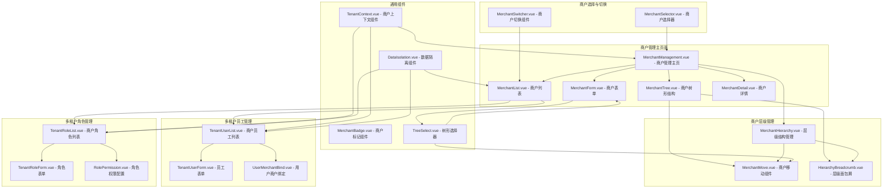
```mermaid
graph TB
    subgraph "商户选择与切换"
        A[MerchantSelector.vue - 商户选择器]
        B[MerchantSwitcher.vue - 商户切换组件]
    end
    
    subgraph "商户管理主页面"
        C[MerchantManagement.vue - 商户管理主页]
        D[MerchantList.vue - 商户列表]
        E[MerchantTree.vue - 商户树形结构]
        F[MerchantForm.vue - 商户表单]
        G[MerchantDetail.vue - 商户详情]
    end
    
    subgraph "商户层级管理"
        H[MerchantHierarchy.vue - 层级结构管理]
        I[MerchantMove.vue - 商户移动组件]
        J[HierarchyBreadcrumb.vue - 层级面包屑]
    end
    
    subgraph "多租户员工管理"
        K[TenantUserList.vue - 商户员工列表]
        L[TenantUserForm.vue - 员工表单]
        M[UserMerchantBind.vue - 用户商户绑定]
    end
    
    subgraph "多租户角色管理"
        N[TenantRoleList.vue - 商户角色列表]
        O[TenantRoleForm.vue - 角色表单]
        P[RolePermission.vue - 角色权限配置]
    end
    
    subgraph "通用组件"
        Q[TenantContext.vue - 商户上下文组件]
        R[DataIsolation.vue - 数据隔离组件]
        S[MerchantBadge.vue - 商户标记组件]
        T[TreeSelect.vue - 树形选择器]
    end
    
    A --> C
    B --> D
    C --> D
    C --> E
    C --> F
    C --> G
    C --> H
    D --> K
    D --> N
    E --> I
    E --> J
    F --> T
    H --> I
    H --> J
    K --> L
    K --> M
    N --> O
    N --> P
    
    Q --> C
    Q --> K
    Q --> N
    R --> D
    R --> K
    R --> N
    T --> F
    T --> I
```

### 商户层级组件设计说明

#### 商户树形结构组件（MerchantTree.vue）
- **功能职责**：以树形结构展示商户层级关系
- **交互功能**：支持节点展开/折叠、拖拽排序、右键菜单
- **操作支持**：新增子商户、编辑商户、移动商户、删除商户
- **数据加载**：支持懒加载和全量加载两种模式

#### 层级结构管理组件（MerchantHierarchy.vue）
- **功能职责**：提供商户层级结构的全面管理界面
- **视图切换**：支持树形视图、列表视图、组织架构图等多种展示方式
- **搜索过滤**：支持按商户名称、层级、状态等条件进行过滤
- **批量操作**：支持批量更改状态、批量移动等操作

#### 商户移动组件（MerchantMove.vue）
- **功能职责**：处理商户在层级结构中的移动操作
- **选择器**：提供树形选择器选择新的父商户
- **校验机制**：防止循环引用、防止移动到子节点
- **影响预览**：显示移动后将影响的所有子孙节点

#### 层级面包屑组件（HierarchyBreadcrumb.vue）
- **功能职责**：展示当前商户在层级结构中的位置
- **导航功能**：点击面包屑中的任意层级可快速导航
- **层级信息**：显示每个层级的商户名称和状态
- **响应式设计**：在移动设备上自动折叠显示

#### 树形选择器组件（TreeSelect.vue）
- **功能职责**：为表单提供层级商户选择功能
- **选择模式**：支持单选、多选、级联选择等模式
- **搜索功能**：支持按商户名称进行实时搜索过滤
- **数据限制**：可配置只显示特定层级或状态的商户### 多租户状态管理设计

#### Pinia Store 扩展结构
``javascript
// stores/tenant.js - 多租户状态管理
export const useTenantStore = defineStore('tenant', {
  state: () => ({
    // 当前商户信息
    currentMerchant: null,
    // 用户所属商户列表
    userMerchants: [],
    // 商户树结构
    merchantTree: [],
    // 商户员工列表
    tenantUsers: [],
    // 商户角色列表
    tenantRoles: [],
    // 搜索条件
    searchConditions: {},
    // 分页信息
    pagination: {
      page: 1,
      pageSize: 10,
      total: 0
    }
  }),
  
  getters: {
    // 当前商户ID
    currentMerchantId: (state) => state.currentMerchant?.merchantId,
    // 当前商户名称
    currentMerchantName: (state) => state.currentMerchant?.merchantName,
    // 是否多商户用户
    isMultiTenant: (state) => state.userMerchants.length > 1,
    // 当前用户在当前商户的角色
    currentUserRole: (state) => state.currentMerchant?.userRole
  },
  
  actions: {
    // 获取用户所属商户列表
    async fetchUserMerchants() {
      try {
        const response = await api.get('/api/v1/user/merchants')
        this.userMerchants = response.data.merchants
        return response.data
      } catch (error) {
        console.error('获取商户列表失败:', error)
        throw error
      }
    },
    
    // 切换商户
    async switchMerchant(merchantId) {
      try {
        const response = await api.post('/api/v1/user/switch-merchant', {
          merchantId
        })
        
        // 更新Token
        const newToken = response.data.token
        localStorage.setItem('token', newToken)
        
        // 更新当前商户信息
        this.currentMerchant = response.data.merchantInfo
        
        // 重新初始化权限信息
        await useUserStore().getUserInfo()
        
        return response.data
      } catch (error) {
        console.error('切换商户失败:', error)
        throw error
      }
    },
    
    // 获取商户列表（管理员）
    async fetchMerchantList(params) {
      try {
        const response = await api.get('/api/v1/merchant/list', { params })
        this.merchantList = response.data.list
        this.pagination = response.data.pagination
        return response.data
      } catch (error) {
        console.error('获取商户列表失败:', error)
        throw error
      }
    },
    
    // 获取商户树形结构
    async fetchMerchantTree(params) {
      try {
        const response = await api.get('/api/v1/merchant/tree', { params })
        this.merchantTree = response.data.merchantTree
        return response.data
      } catch (error) {
        console.error('获取商户树结构失败:', error)
        throw error
      }
    },
    
    // 创建商户（支持层级）
    async createMerchant(merchantData) {
      try {
        const response = await api.post('/api/v1/merchant', merchantData)
        // 刷新列表和树结构
        await Promise.all([
          this.fetchMerchantList(this.searchConditions),
          this.fetchMerchantTree()
        ])
        return response.data
      } catch (error) {
        console.error('创建商户失败:', error)
        throw error
      }
    },
    
    // 移动商户位置
    async moveMerchant(merchantId, newParentId) {
      try {
        const response = await api.put(`/api/v1/merchant/${merchantId}/move`, {
          newParentId
        })
        // 刷新列表和树结构
        await Promise.all([
          this.fetchMerchantList(this.searchConditions),
          this.fetchMerchantTree()
        ])
        return response.data
      } catch (error) {
        console.error('移动商户失败:', error)
        throw error
      }
    },
    
    // 获取商户员工列表
    async fetchTenantUsers(params) {
      try {
        const response = await api.get('/api/v1/merchant/user/list', { params })
        this.tenantUsers = response.data.list
        return response.data
      } catch (error) {
        console.error('获取商户员工列表失败:', error)
        throw error
      }
    },
    
    // 创建商户员工
    async createTenantUser(userData) {
      try {
        const response = await api.post('/api/v1/merchant/user', userData)
        await this.fetchTenantUsers()
        return response.data
      } catch (error) {
        console.error('创建商户员工失败:', error)
        throw error
      }
    },
    
    // 获取商户角色列表
    async fetchTenantRoles(params) {
      try {
        const response = await api.get('/api/v1/merchant/authority/list', { params })
        this.tenantRoles = response.data.list
        return response.data
      } catch (error) {
        console.error('获取商户角色列表失败:', error)
        throw error
      }
    },
    
    // 创建商户角色
    async createTenantRole(roleData) {
      try {
        const response = await api.post('/api/v1/merchant/authority', roleData)
        await this.fetchTenantRoles()
        return response.data
      } catch (error) {
        console.error('创建商户角色失败:', error)
        throw error
      }
    }
  }
})
```

## 多租户权限控制设计

### Casbin 多租户权限策略扩展

#### 扩展权限模型
基于现有的 Casbin RBAC 体系，设计三级权限体系：

**原有模型**：`p = sub, obj, act`
**扩展模型**：`p = sub, obj, act, tenant`

其中：
- `sub`：主体（用户角色）
- `obj`：对象（API路径或菜单资源）
- `act`：操作（HTTP方法或菜单操作）
- `tenant`：租户（商户ID，超级管理员为*）

### 三级权限体系详细设计

#### 1. 超级管理员（Super Admin）
- **角色标识**：MerchantID = 1, RoleType = 1
- **角色特性**：属于默认商户但拥有跨商户权限，是系统最高权限角色
- **权限范围**：所有现有和未来开发的API接口和菜单权限
- **数据访问**：可访问所有商户的数据，通过中间件跳过多租户限制
- **菜单权限**：拥有所有系统菜单和商户菜单的完整访问权限
- **API权限**：拥有所有以'system:'和'merchant:'开头的权限代码
- **核心职责**：
  - 商户生命周期管理：创建、编辑、删除、状态管理
  - 商户权限分配：为商户管理员分配具体的功能权限
  - 商户层级管理：调整商户父子关系和层级结构
  - 系统配置：管理系统级配置和参数
  - 跨商户数据分析：查看和分析所有商户数据

#### 2. 商户管理员（Merchant Admin）
- **角色标识**：MerchantID = 具体值, RoleType = 2
- **角色特性**：受商户限制，只能管理所属商户，不能访问其他商户数据
- **权限范围**：由超级管理员手动分配，无需商户审核流程
- **数据访问**：严格限制在所属商户范围内，数据隔离中间件强制执行
- **菜单权限**：只能访问被超级管理员分配的商户管理相关菜单
- **API权限**：只能调用被分配的以'merchant:'开头的权限代码对应的API
- **权限分配限制**：只能在已拥有的权限范围内为员工分配权限
- **核心职责**：
  - 商户信息维护：更新商户基本信息、联系方式等
  - 员工全生命周期管理：创建、编辑、删除、状态管理
  - 角色权限管理：在权限范围内创建角色并分配权限
  - 商户内部数据分析：查看商户内部运营数据

#### 3. 商户自定义角色（Custom Employee Role）
- **角色标识**：MerchantID = 具体值, RoleType = 3
- **角色特性**：受商户和具体角色双重限制
- **权限范围**：由商户管理员或超级管理员在权限范围内手动分配
- **数据访问**：只能访问所属商户的特定业务数据
- **菜单权限**：只能访问被分配的具体功能菜单
- **API权限**：只能调用被分配的具体权限代码对应的API
- **角色细分**：
  - 商户操作员（merchant_operator）：日常业务操作权限
  - 商户查看员（merchant_viewer）：只读权限，数据查看
  - 商户会计（merchant_accountant）：财务相关数据权限
  - 商户客服（merchant_service）：客户服务相关权限
  - 其他定制角色：根据商户具体业务需要定义

#### 权限继承与限制原则

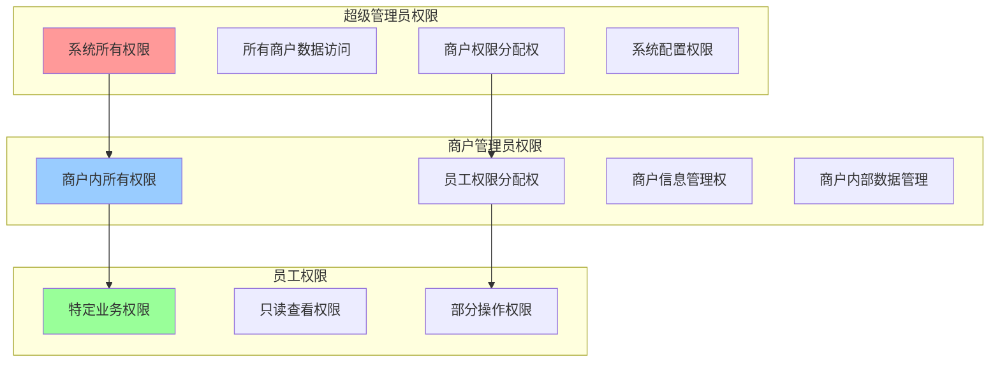
```mermaid
graph TB
    subgraph "超级管理员权限"
        A1[系统所有权限]
        A2[所有商户数据访问]
        A3[商户权限分配权]
        A4[系统配置权限]
    end
    
    subgraph "商户管理员权限"
        B1[商户内所有权限]
        B2[员工权限分配权]
        B3[商户信息管理权]
        B4[商户内部数据管理]
    end
    
    subgraph "员工权限"
        C1[特定业务权限]
        C2[只读查看权限]
        C3[部分操作权限]
    end
    
    A1 --> B1
    A3 --> B2
    B1 --> C1
    B2 --> C3
    
    style A1 fill:#ff9999
    style B1 fill:#99ccff
    style C1 fill:#99ff99
```

**权限分配原则**：
1. **向下分配原则**：上级角色只能将自己拥有的权限分配给下级
2. **商户隔离原则**：商户管理员不能访问其他商户（包括子商户）数据
3. **最小权限原则**：员工角色默认只分配必要的最小权限
4. **审批流程简化**：商户管理员分配权限无需审核，但有日志记录

#### 菜单权限配置系统

为三级权限体系设计分层菜单配置：

**超级管理员菜单配置**：
| 菜单名称 | 菜单路径 | 菜单级别 | 权限代码 | 菜单显示条件 | 说明 |
|-----------|----------|-----------|----------|--------------|------|
| 系统管理 | /system | 1 | system:* | 始终显示 | 一级菜单 |
| 商户管理 | /system/merchant | 2 | system:merchant:list | 始终显示 | 商户列表管理 |
| 商户创建 | /system/merchant/create | 3 | system:merchant:create | 始终显示 | 创建商户 |
| 商户权限配置 | /system/merchant/permission | 3 | system:merchant:permission | 始终显示 | 权限分配 |
| 用户管理 | /system/user | 2 | system:user:* | 始终显示 | 系统用户管理 |
| 角色管理 | /system/authority | 2 | system:authority:* | 始终显示 | 系统角色管理 |
| 菜单管理 | /system/menu | 2 | system:menu:* | 始终显示 | 系统菜单管理 |
| 系统配置 | /system/config | 2 | system:config:* | 始终显示 | 系统参数配置 |
| 日志管理 | /system/logs | 2 | system:logs:* | 始终显示 | 系统日志查看 |

**商户管理员菜单配置**：
| 菜单名称 | 菜单路径 | 菜单级别 | 权限代码 | 菜单显示条件 | 说明 |
|-----------|----------|-----------|----------|--------------|------|
| 商户管理 | /merchant | 1 | merchant:* | 商户上下文存在 | 一级菜单 |
| 商户信息 | /merchant/info | 2 | merchant:info:view | 可分配 | 商户基本信息 |
| 信息编辑 | /merchant/info/edit | 3 | merchant:info:update | 可分配 | 编辑商户信息 |
| 员工管理 | /merchant/user | 2 | merchant:user:list | 可分配 | 商户员工管理 |
| 员工创建 | /merchant/user/create | 3 | merchant:user:create | 可分配 | 新增员工 |
| 员工编辑 | /merchant/user/edit | 3 | merchant:user:update | 可分配 | 编辑员工 |
| 角色管理 | /merchant/role | 2 | merchant:role:list | 可分配 | 商户角色管理 |
| 角色创建 | /merchant/role/create | 3 | merchant:role:create | 可分配 | 新增角色 |
| 权限分配 | /merchant/role/permission | 3 | merchant:role:permission | 可分配 | 角色权限配置 |
| 数据统计 | /merchant/statistics | 2 | merchant:statistics:view | 可分配 | 商户数据统计 |

**员工角色菜单配置**（根据具体分配权限显示）：
| 菜单名称 | 菜单路径 | 菜单级别 | 权限代码 | 菜单显示条件 | 说明 |
|-----------|----------|-----------|----------|--------------|------|
| 工作台 | /workbench | 1 | * | 始终显示 | 员工工作台 |
| 信息查看 | /workbench/info | 2 | merchant:info:view | 有相应权限 | 查看商户信息 |
| 员工列表 | /workbench/users | 2 | merchant:user:view | 有相应权限 | 查看员工列表 |
| 业务操作 | /workbench/business | 2 | business:* | 有相应权限 | 具体业务操作 |
| 个人中心 | /profile | 1 | * | 始终显示 | 个人信息管理 |

#### 菜单动态加载机制

基于用户角色和权限的动态菜单加载机制：

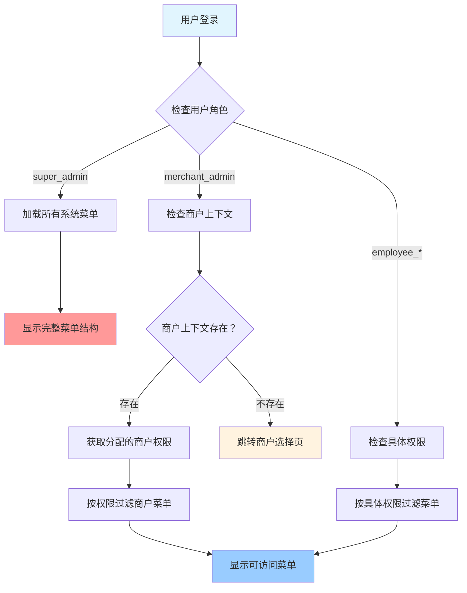
```mermaid
flowchart TD
    A[用户登录] --> B{检查用户角色}
    B -->|super_admin| C[加载所有系统菜单]
    B -->|merchant_admin| D[检查商户上下文]
    B -->|employee_*| E[检查具体权限]
    
    C --> F[显示完整菜单结构]
    
    D --> G{商户上下文存在？}
    G -->|存在| H[获取分配的商户权限]
    G -->|不存在| I[跳转商户选择页]
    
    H --> J[按权限过滤商户菜单]
    E --> K[按具体权限过滤菜单]
    
    J --> L[显示可访问菜单]
    K --> L
    
    style A fill:#e1f5fe
    style F fill:#ff9999
    style L fill:#99ccff
    style I fill:#fff3e0
```

#### 三级权限验证流程设计

**权限验证层级结构**：
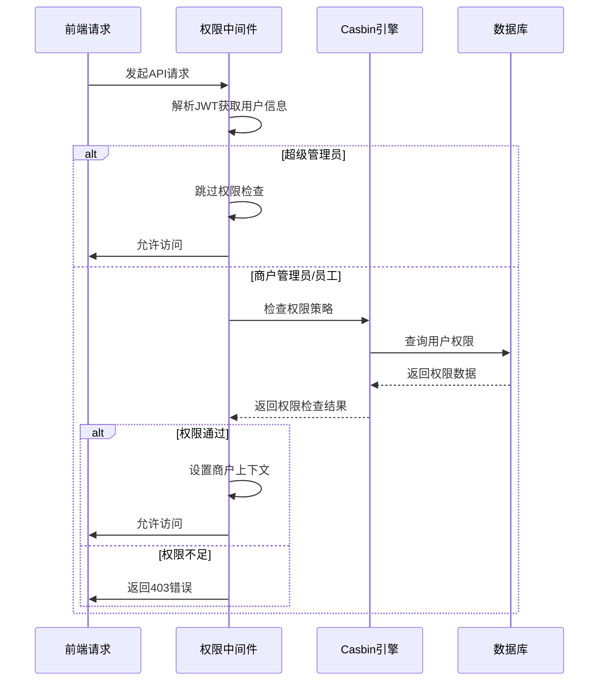
```mermaid
sequenceDiagram
    participant Client as 前端请求
    participant MW as 权限中间件
    participant Casbin as Casbin引擎
    participant DB as 数据库
    
    Client->>MW: 发起API请求
    MW->>MW: 解析JWT获取用户信息
    
    alt 超级管理员
        MW->>MW: 跳过权限检查
        MW->>Client: 允许访问
    else 商户管理员/员工
        MW->>Casbin: 检查权限策略
        Casbin->>DB: 查询用户权限
        DB-->>Casbin: 返回权限数据
        Casbin-->>MW: 返回权限检查结果
        
        alt 权限通过
            MW->>MW: 设置商户上下文
            MW->>Client: 允许访问
        else 权限不足
            MW->>Client: 返回403错误
        end
    end
```

**三级权限验证规则**：
1. **超级管理员验证**：authority_id = 'super_admin'，直接通过所有权限检查
2. **商户管理员验证**：检查是否拥有对应的'merchant:'权限，并验证商户上下文
3. **员工角色验证**：检查具体的权限代码，并进行双重验证（角色权限+商户权限）

#### 权限分配和管理机制

**超级管理员权限分配流程**：
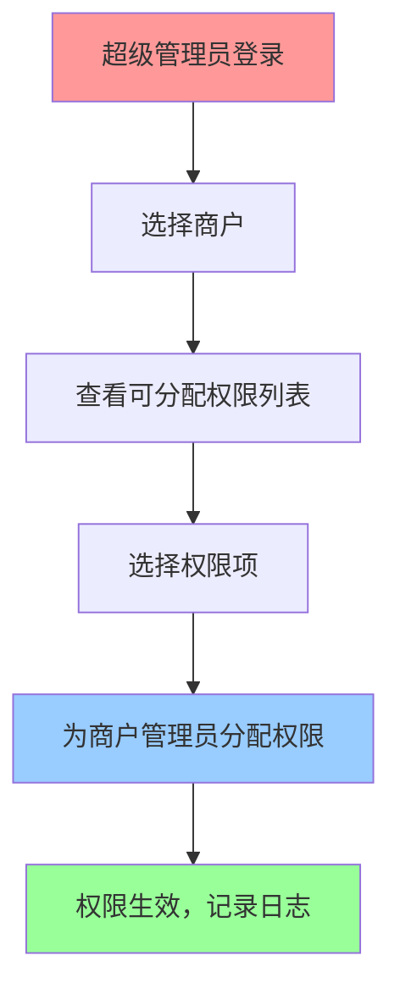
```mermaid
flowchart TD
    A[超级管理员登录] --> B[选择商户]
    B --> C[查看可分配权限列表]
    C --> D[选择权限项]
    D --> E[为商户管理员分配权限]
    E --> F[权限生效，记录日志]
    
    style A fill:#ff9999
    style E fill:#99ccff
    style F fill:#99ff99
```

**商户管理员权限分配流程**：
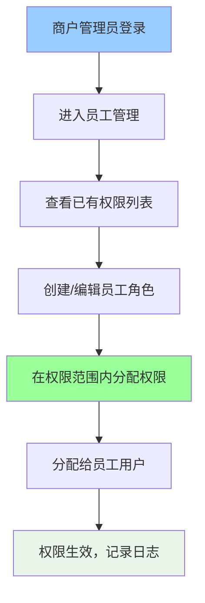
```mermaid
flowchart TD
    A[商户管理员登录] --> B[进入员工管理]
    B --> C[查看已有权限列表]
    C --> D[创建/编辑员工角色]
    D --> E[在权限范围内分配权限]
    E --> F[分配给员工用户]
    F --> G[权限生效，记录日志]
    
    style A fill:#99ccff
    style E fill:#99ff99
    style G fill:#e8f5e8
```

#### 权限资源定义表
|----------|----------|---------|----------|------------|------------|----------|------|
| system:merchant:create | 商户创建 | /api/v1/merchant | POST | ✓ | ✗ | ✗ | 仅超级管理员 |
| system:merchant:list | 商户列表查看 | /api/v1/merchant/list | GET | ✓ | ✗ | ✗ | 查看所有商户 |
| system:merchant:update | 商户信息编辑 | /api/v1/merchant/:id | PUT | ✓ | ✗ | ✗ | 跨商户编辑 |
| system:merchant:delete | 商户删除 | /api/v1/merchant/:id | DELETE | ✓ | ✗ | ✗ | 删除任意商户 |
| system:merchant:status | 商户状态管理 | /api/v1/merchant/:id/status | PUT | ✓ | ✗ | ✗ | 状态管理 |
| system:merchant:permission | 商户权限分配 | /api/v1/merchant/:id/permissions | PUT | ✓ | ✗ | ✗ | 分配商户权限 |
| merchant:info:view | 商户信息查看 | /api/v1/merchant/info | GET | ✓ | 可分配 | 可分配 | 查看所属商户信息 |
| merchant:info:update | 商户信息编辑 | /api/v1/merchant/info | PUT | ✓ | 可分配 | 可分配 | 编辑所属商户信息 |
| merchant:user:list | 商户员工查看 | /api/v1/merchant/user/list | GET | ✓ | 可分配 | 可分配 | 查看商户员工 |
| merchant:user:create | 商户员工创建 | /api/v1/merchant/user | POST | ✓ | 可分配 | 可分配 | 创建商户员工 |
| merchant:user:update | 商户员工编辑 | /api/v1/merchant/user/:id | PUT | ✓ | 可分配 | 可分配 | 编辑商户员工 |
| merchant:user:delete | 商户员工删除 | /api/v1/merchant/user/:id | DELETE | ✓ | 可分配 | ✗ | 删除商户员工 |
| merchant:role:list | 商户角色查看 | /api/v1/merchant/role/list | GET | ✓ | 可分配 | 可分配 | 查看商户角色 |
| merchant:role:create | 商户角色创建 | /api/v1/merchant/role | POST | ✓ | 可分配 | ✗ | 创建商户角色 |
| merchant:role:update | 商户角色编辑 | /api/v1/merchant/role/:id | PUT | ✓ | 可分配 | ✗ | 编辑商户角色 |
| merchant:role:delete | 商户角色删除 | /api/v1/merchant/role/:id | DELETE | ✓ | 可分配 | ✗ | 删除商户角色 |

**权限分类说明**：
- **✓**：默认拥有该权限
- **可分配**：由上级角色手动分配决定是否拥有
- **✗**：不能拥有该权限

#### 三级权限体系分配策略

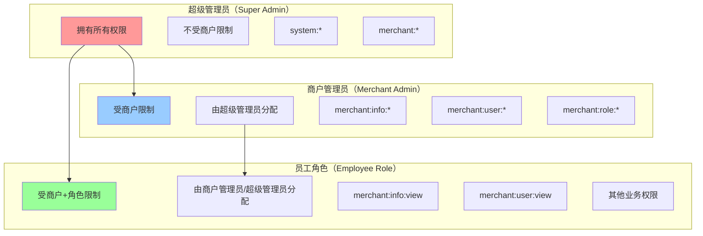
```mermaid
graph TD
    subgraph "超级管理员（Super Admin）"
        A1[拥有所有权限]
        A2[不受商户限制]
        A3[system:*]
        A4[merchant:*]
    end
    
    subgraph "商户管理员（Merchant Admin）"
        B1[受商户限制]
        B2[由超级管理员分配]
        B3[merchant:info:*]
        B4[merchant:user:*]
        B5[merchant:role:*]
    end
    
    subgraph "员工角色（Employee Role）"
        C1[受商户+角色限制]
        C2[由商户管理员/超级管理员分配]
        C3[merchant:info:view]
        C4[merchant:user:view]
        C5[其他业务权限]
    end
    
    A1 --> B1
    A1 --> C1
    B2 --> C2
    
    style A1 fill:#ff9999
    style B1 fill:#99ccff
    style C1 fill:#99ff99
```

### 三级权限中间件设计

#### 超级管理员权限中间件
``go
// middleware/super_admin.go
func SuperAdminMiddleware() gin.HandlerFunc {
    return func(c *gin.Context) {
        claims, exists := c.Get("claims")
        if !exists {
            response.FailWithMessage("认证失败", c)
            c.Abort()
            return
        }
        
        waitUse := claims.(*systemReq.CustomClaims)
        
        // 检查是否为超级管理员角色
        if waitUse.AuthorityId != "super_admin" {
            response.FailWithCodeMessage(40301, "仅超级管理员可访问", c)
            c.Abort()
            return
        }
        
        // 设置超级管理员标识
        c.Set("isSuperAdmin", true)
        c.Set("bypassTenantIsolation", true) // 绕过商户隔离
        
        c.Next()
    }
}
```

#### 商户权限校验中间件
``go
// middleware/merchant_permission.go
func MerchantPermissionMiddleware() gin.HandlerFunc {
    return func(c *gin.Context) {
        claims, exists := c.Get("claims")
        if !exists {
            response.FailWithMessage("认证失败", c)
            c.Abort()
            return
        }
        
        waitUse := claims.(*systemReq.CustomClaims)
        
        // 超级管理员绕过权限检查
        if waitUse.AuthorityId == "super_admin" {
            c.Set("isSuperAdmin", true)
            c.Next()
            return
        }
        
        // 获取当前用户的商户ID
        merchantID := waitUse.MerchantID
        if merchantID == 0 {
            response.FailWithCodeMessage(40302, "商户上下文缺失", c)
            c.Abort()
            return
        }
        
        // 设置商户上下文
        c.Set("merchantID", merchantID)
        c.Set("userRole", waitUse.AuthorityId)
        
        c.Next()
    }
}
```

### 前端三级权限控制实现

#### 三级权限指令系统
``javascript
// directive/role-auth.js
import { useUserStore } from '@/stores/user'
import { useTenantStore } from '@/stores/tenant'

export default {
  mounted(el, binding) {
    const userStore = useUserStore()
    const tenantStore = useTenantStore()
    
    const requiredPermission = binding.value
    const userRole = userStore.userInfo.authorityId
    const userPermissions = userStore.userInfo.permissions || []
    
    // 超级管理员拥有所有权限
    if (userRole === 'super_admin') {
      return
    }
    
    // 检查用户是否拥有该权限
    if (!userPermissions.includes(requiredPermission)) {
      el.style.display = 'none'
      return
    }
    
    // 商户维度权限检查
    const merchantId = tenantStore.currentMerchantId
    if (!merchantId && requiredPermission.startsWith('merchant:')) {
      el.style.display = 'none'
      return
    }
  },
  
  updated(el, binding) {
    this.mounted(el, binding)
  }
}
```

#### 按钮级权限控制实例
``vue
<template>
  <div class="permission-demo">
    <!-- 超级管理员专属按钮 -->
    <el-button 
      v-role-auth="'system:merchant:create'"
      type="primary" 
      @click="createMerchant">
      创建商户
    </el-button>
    
    <!-- 商户管理员可见按钮 -->
    <el-button 
      v-role-auth="'merchant:user:create'"
      type="success" 
      @click="createUser">
      新增员工
    </el-button>
    
    <!-- 员工角色可见按钮 -->
    <el-button 
      v-role-auth="'merchant:info:view'"
      type="info" 
      @click="viewInfo">
      查看信息
    </el-button>
  </div>
</template>

<script setup>
// 业务逻辑
</script>
```

#### 多租户路由配置
``javascript
// router/modules/merchant.js
const merchantRoutes = [
  {
    path: '/merchant-selector',
    name: 'MerchantSelector',
    component: () => import('@/views/merchant/MerchantSelector.vue'),
    meta: {
      title: '商户选择',
      hidden: true // 隐藏在菜单中
    }
  },
  {
    path: '/merchant',
    name: 'Merchant',
    component: () => import('@/views/layout/index.vue'),
    meta: {
      title: '商户管理',
      icon: 'merchant',
      roles: ['admin', 'platform_admin']
    },
    children: [
      {
        path: 'list',
        name: 'MerchantList',
        component: () => import('@/views/merchant/list.vue'),
        meta: {
          title: '商户列表',
          permission: 'merchant:list'
        }
      },
      {
        path: 'tenant-user',
        name: 'TenantUser',
        component: () => import('@/views/merchant/tenant-user.vue'),
        meta: {
          title: '商户员工',
          permission: 'tenant:user:list',
          requireMerchant: true // 需要商户上下文
        }
      },
      {
        path: 'tenant-role',
        name: 'TenantRole',
        component: () => import('@/views/merchant/tenant-role.vue'),
        meta: {
          title: '商户角色',
          permission: 'tenant:role:list',
          requireMerchant: true
        }
      }
    ]
  }
]

export default merchantRoutes
```

#### 按钮级权限控制
``vue
<template>
  <div class="tenant-user-list">
    <!-- 创建按钮 -->
    <el-button 
      v-auth="'tenant:user:create'"
      v-tenant-auth="currentMerchantId"
      type="primary" 
      @click="handleCreate">
      新建员工
    </el-button>
    
    <!-- 操作列 -->
    <el-table-column label="操作" width="200">
      <template #default="{ row }">
        <el-button 
          v-auth="'tenant:user:update'"
          v-tenant-auth="row.merchantId"
          size="small" 
          @click="handleEdit(row)">
          编辑
        </el-button>
        <el-button 
          v-auth="'tenant:user:delete'"
          v-tenant-auth="row.merchantId"
          size="small" 
          type="danger" 
          @click="handleDelete(row)">
          删除
        </el-button>
      </template>
    </el-table-column>
  </div>
</template>

<script setup>
import { useTenantStore } from '@/stores/tenant'

const tenantStore = useTenantStore()
const currentMerchantId = computed(() => tenantStore.currentMerchantId)
</script>
```

#### 多租户权限指令
``javascript
// directive/tenant-auth.js
import { useTenantStore } from '@/stores/tenant'
import { useUserStore } from '@/stores/user'

export default {
  mounted(el, binding) {
    const tenantStore = useTenantStore()
    const userStore = useUserStore()
    
    const requiredMerchantId = binding.value
    const currentMerchantId = tenantStore.currentMerchantId
    const userRole = userStore.userInfo.authorityId
    
    // 系统管理员不受商户限制
    if (userRole === 'admin' || userRole === 'platform_admin') {
      return
    }
    
    // 检查商户权限
    if (requiredMerchantId && requiredMerchantId !== currentMerchantId) {
      el.style.display = 'none'
      // 或者移除元素
      // el.parentNode?.removeChild(el)
    }
  },
  
  updated(el, binding) {
    // 商户切换时重新检查权限
    this.mounted(el, binding)
  }
}
```

## 三级权限体系实现细节

### 商户权限分配界面设计

**超级管理员权限分配界面**：
- 商户选择器：显示所有商户列表
- 权限分类显示：按功能模块分类展示可分配权限
- 批量分配：支持选中多个权限同时分配
- 权限预览：分配前预览将要分配的权限列表
- 分配日志：记录所有权限分配操作的历史

**商户管理员权限管理界面**：
- 已有权限显示：显示当前商户已获得的所有权限
- 员工角色管理：在权限范围内创建和管理员工角色
- 权限分配限制：只能在已拥有的权限范围内分配给员工
- 权限使用统计：查看各种权限的使用情况和频次

### 前端权限组件设计

**权限控制组件集**：

1. **RoleAuthButton.vue** - 权限按钮组件
2. **TenantSwitcher.vue** - 商户切换组件
3. **PermissionTable.vue** - 权限表格组件
4. **MerchantPermissionAssign.vue** - 商户权限分配组件
5. **RolePermissionMatrix.vue** - 角色权限矩阵组件

### 权限检查流程优化

**高效权限检查策略**：
- 缓存权限数据：在前端缓存用户权限信息，减少服务器请求
- 权限预计算：用户登录时预计算所有权限，提高检查效率
- 懒加载验证：权限检查只在必要时执行，避免无效计算
- 权限变更通知：权限变更时实时清理相关缓存

### 数据隔离安全加强

**严格的数据隔离机制**：
- SQL注入防护：所有查询都使用参数化查询，防止SQL注入
- 行级安全：所有数据访问都必须包含merchant_id条件
- 接口参数校验：严格校验所有输入参数，防止越权访问
- 数据返回过滤：返回数据前再次过滤，确保数据安全

### 日志审计强化

**全面的审计日志系统**：
- 权限操作日志：记录所有权限分配、变更、删除操作
- 商户切换日志：记录用户的商户切换历史
- 敏感操作监控：重点监控跨商户操作和管理员权限变更
- 实时报警：异常权限操作实时报警通知

### 性能优化建议

**数据库优化**：
- 建立复合索引：(merchant_id, user_id)、(merchant_id, authority_id)等
- 分区表设计：按商户ID对大表进行分区，提高查询效率
- 读写分离：查询操作使用只读实例，减少主库压力
- 数据归档：定期归档历史数据，保持表的高效性

**前端优化**：
- 组件懒加载：大型组件按需加载，减少初始打包体积
- 数据虚拟化：大列表使用虚拟滚动，提高渲染性能
- 权限缓存：在localStorage/sessionStorage中缓存用户权限
- 防抖处理：搜索和筛选功能使用防抖，减少请求频次

### 系统集成建议

**与现有gin-vue-admin系统集成**：
- 保持现有API接口兼容：渐进式升级，不影响现有功能
- 统一认证系统：继续使用JWT认证，扩展支持商户上下文
- 数据库升级脚本：提供自动化脚本，安全升级现有数据库
- 配置参数管理：增加多租户相关的系统配置参数

### 系统测试策略

#### 单元测试设计

**后端单元测试**：

```go
// service/merchant_service_test.go
package service

import (
    "testing"
    "github.com/stretchr/testify/assert"
    "github.com/stretchr/testify/suite"
    "gorm.io/gorm"
)

type MerchantServiceTestSuite struct {
    suite.Suite
    db      *gorm.DB
    service *MerchantService
}

func (suite *MerchantServiceTestSuite) SetupTest() {
    // 初始化测试数据库
    suite.db = setupTestDB()
    suite.service = &MerchantService{db: suite.db}
}

func (suite *MerchantServiceTestSuite) TearDownTest() {
    // 清理测试数据
    cleanupTestDB(suite.db)
}

// 测试商户创建
func (suite *MerchantServiceTestSuite) TestCreateMerchant() {
    req := &request.CreateMerchantRequest{
        MerchantName:    "Test Merchant",
        MerchantType:    "ENTERPRISE",
        ContactName:     "Test Contact",
        ContactPhone:    "13800138000",
        ContactEmail:    "test@example.com",
        CreatedBy:       1,
    }
    
    merchant, err := suite.service.CreateMerchant(req)
    
    assert.NoError(suite.T(), err)
    assert.NotNil(suite.T(), merchant)
    assert.Equal(suite.T(), "Test Merchant", merchant.MerchantName)
    assert.Equal(suite.T(), 1, merchant.Level)
    assert.NotEmpty(suite.T(), merchant.MerchantCode)
}

// 测试商户数据隔离
func (suite *MerchantServiceTestSuite) TestDataIsolation() {
    // 创建两个商户
    merchant1 := suite.createTestMerchant("Merchant 1")
    merchant2 := suite.createTestMerchant("Merchant 2")
    
    // 为每个商户创建用户
    user1 := suite.createTestUser("user1", merchant1.ID)
    user2 := suite.createTestUser("user2", merchant2.ID)
    
    // 测试数据隔离
    users1, err1 := suite.service.GetMerchantUsers(merchant1.ID)
    users2, err2 := suite.service.GetMerchantUsers(merchant2.ID)
    
    assert.NoError(suite.T(), err1)
    assert.NoError(suite.T(), err2)
    assert.Len(suite.T(), users1, 1)
    assert.Len(suite.T(), users2, 1)
    assert.Equal(suite.T(), user1.ID, users1[0].ID)
    assert.Equal(suite.T(), user2.ID, users2[0].ID)
}

// 测试商户层级结构
func (suite *MerchantServiceTestSuite) TestMerchantHierarchy() {
    // 创建父商户
    parentReq := &request.CreateMerchantRequest{
        MerchantName: "Parent Merchant",
        CreatedBy:    1,
    }
    parent, err := suite.service.CreateMerchant(parentReq)
    assert.NoError(suite.T(), err)
    
    // 创建子商户
    childReq := &request.CreateMerchantRequest{
        MerchantName: "Child Merchant",
        ParentID:     &parent.ID,
        CreatedBy:    1,
    }
    child, err := suite.service.CreateMerchant(childReq)
    assert.NoError(suite.T(), err)
    
    // 验证层级结构
    assert.Equal(suite.T(), 1, parent.Level)
    assert.Equal(suite.T(), 2, child.Level)
    assert.Equal(suite.T(), fmt.Sprintf("%d", parent.ID), parent.Path)
    assert.Equal(suite.T(), fmt.Sprintf("%d/%d", parent.ID, child.ID), child.Path)
}

func TestMerchantServiceTestSuite(t *testing.T) {
    suite.Run(t, new(MerchantServiceTestSuite))
}
```

**前端单元测试**：

```javascript
// tests/unit/stores/tenant.test.js
import { describe, it, expect, beforeEach, vi } from 'vitest'
import { setActivePinia, createPinia } from 'pinia'
import { useTenantStore } from '@/stores/tenant'
import * as api from '@/api/tenant'

// Mock API
vi.mock('@/api/tenant')

describe('TenantStore', () => {
  beforeEach(() => {
    setActivePinia(createPinia())
    vi.clearAllMocks()
  })

  describe('fetchUserMerchants', () => {
    it('should fetch user merchants successfully', async () => {
      const mockMerchants = [
        { merchantId: 1, merchantName: 'Merchant 1', isDefault: true },
        { merchantId: 2, merchantName: 'Merchant 2', isDefault: false }
      ]
      
      api.getUserMerchants.mockResolvedValue({ data: { merchants: mockMerchants } })
      
      const store = useTenantStore()
      const result = await store.fetchUserMerchants()
      
      expect(result.merchants).toEqual(mockMerchants)
      expect(store.userMerchants).toEqual(mockMerchants)
      expect(api.getUserMerchants).toHaveBeenCalledOnce()
    })

    it('should handle fetch error', async () => {
      api.getUserMerchants.mockRejectedValue(new Error('Network error'))
      
      const store = useTenantStore()
      
      await expect(store.fetchUserMerchants()).rejects.toThrow('Network error')
    })
  })

  describe('switchMerchant', () => {
    it('should switch merchant successfully', async () => {
      const mockResponse = {
        data: {
          token: 'new-token',
          merchantInfo: {
            merchantId: 2,
            merchantName: 'Merchant 2',
            userRole: 'merchant_admin'
          }
        }
      }
      
      api.switchMerchant.mockResolvedValue(mockResponse)
      
      const store = useTenantStore()
      const result = await store.switchMerchant(2)
      
      expect(result).toEqual(mockResponse.data)
      expect(store.currentMerchant).toEqual(mockResponse.data.merchantInfo)
      expect(localStorage.getItem('token')).toBe('new-token')
    })
  })
})
```

#### 集成测试设计

**API集成测试**：

```go
// test/integration/merchant_api_test.go
package integration

import (
    "bytes"
    "encoding/json"
    "net/http"
    "testing"
    "github.com/stretchr/testify/assert"
)

type MerchantAPITestSuite struct {
    suite.Suite
    server     *gin.Engine
    superToken string
    adminToken string
}

func (suite *MerchantAPITestSuite) SetupSuite() {
    // 初始化测试服务器
    suite.server = setupTestServer()
    
    // 获取测试Token
    suite.superToken = suite.getSuperAdminToken()
    suite.adminToken = suite.getMerchantAdminToken()
}

func (suite *MerchantAPITestSuite) TestCreateMerchant() {
    payload := map[string]interface{}{
        "merchantName":  "Test Merchant API",
        "merchantType":  "ENTERPRISE",
        "contactName":   "API Test",
        "contactPhone":  "13800138001",
        "contactEmail":  "api@test.com",
    }
    
    body, _ := json.Marshal(payload)
    req := httptest.NewRequest("POST", "/api/v1/merchant", bytes.NewBuffer(body))
    req.Header.Set("Content-Type", "application/json")
    req.Header.Set("Authorization", "Bearer "+suite.superToken)
    
    w := httptest.NewRecorder()
    suite.server.ServeHTTP(w, req)
    
    assert.Equal(suite.T(), http.StatusOK, w.Code)
    
    var response map[string]interface{}
    err := json.Unmarshal(w.Body.Bytes(), &response)
    assert.NoError(suite.T(), err)
    assert.Equal(suite.T(), float64(0), response["code"])
}

func (suite *MerchantAPITestSuite) TestDataIsolationAPI() {
    // 创建两个商户及其用户
    merchant1ID := suite.createTestMerchant("Merchant 1")
    merchant2ID := suite.createTestMerchant("Merchant 2")
    
    user1Token := suite.createMerchantUser(merchant1ID, "user1")
    user2Token := suite.createMerchantUser(merchant2ID, "user2")
    
    // 测试用户1无法访问商户2的数据
    req := httptest.NewRequest("GET", "/api/v1/merchant/user/list", nil)
    req.Header.Set("Authorization", "Bearer "+user1Token)
    
    w := httptest.NewRecorder()
    suite.server.ServeHTTP(w, req)
    
    var response map[string]interface{}
    json.Unmarshal(w.Body.Bytes(), &response)
    
    // 验证只能看到自己商户的数据
    data := response["data"].(map[string]interface{})
    users := data["list"].([]interface{})
    
    for _, user := range users {
        userMap := user.(map[string]interface{})
        assert.Equal(suite.T(), float64(merchant1ID), userMap["merchantId"])
    }
}
```

#### E2E测试设计

**Cypress E2E测试**：

```javascript
// cypress/e2e/merchant-management.cy.js
describe('Merchant Management E2E', () => {
  beforeEach(() => {
    // 清理数据库
    cy.task('db:seed')
    
    // 登录超级管理员
    cy.loginAsSuperAdmin()
  })

  describe('Merchant CRUD Operations', () => {
    it('should create a new merchant successfully', () => {
      cy.visit('/system/merchant')
      
      // 点击新增按钮
      cy.get('[data-cy="create-merchant-btn"]').click()
      
      // 填写表单
      cy.get('[data-cy="merchant-name"]').type('E2E Test Merchant')
      cy.get('[data-cy="merchant-type"]').select('ENTERPRISE')
      cy.get('[data-cy="contact-name"]').type('E2E Contact')
      cy.get('[data-cy="contact-phone"]').type('13800138888')
      cy.get('[data-cy="contact-email"]').type('e2e@test.com')
      
      // 提交表单
      cy.get('[data-cy="submit-btn"]').click()
      
      // 验证结果
      cy.get('.el-message--success').should('contain', '创建成功')
      cy.get('[data-cy="merchant-table"]').should('contain', 'E2E Test Merchant')
    })

    it('should handle merchant hierarchy correctly', () => {
      cy.visit('/system/merchant')
      
      // 切换到树形视图
      cy.get('[data-cy="tree-view-toggle"]').click()
      
      // 选择父节点，创建子商户
      cy.get('[data-cy="merchant-tree-node-1"]').rightclick()
      cy.get('[data-cy="add-child-merchant"]').click()
      
      // 填写子商户信息
      cy.get('[data-cy="merchant-name"]').type('Child Merchant')
      cy.get('[data-cy="submit-btn"]').click()
      
      // 验证层级结构
      cy.get('[data-cy="merchant-tree"]')
        .find('[data-level="2"]')
        .should('contain', 'Child Merchant')
    })
  })

  describe('Permission Assignment', () => {
    it('should assign permissions to merchant admin', () => {
      // 进入权限管理页面
      cy.visit('/system/merchant/permission')
      
      // 选择商户
      cy.get('[data-cy="merchant-selector"]').click()
      cy.get('.el-select-dropdown__item').first().click()
      
      // 选择权限
      cy.get('[data-cy="permission-merchant-info-view"]').check()
      cy.get('[data-cy="permission-merchant-user-list"]').check()
      cy.get('[data-cy="permission-merchant-user-create"]').check()
      
      // 提交权限分配
      cy.get('[data-cy="assign-permissions-btn"]').click()
      
      // 验证结果
      cy.get('.el-message--success').should('contain', '权限分配成功')
    })
  })

  describe('Multi-tenant Login Flow', () => {
    it('should handle multi-merchant user login', () => {
      // 登出超级管理员
      cy.logout()
      
      // 登录多商户用户
      cy.login('multiuser@test.com', 'password123')
      
      // 应该显示商户选择页面
      cy.url().should('include', '/merchant-selector')
      cy.get('[data-cy="merchant-list"]').should('be.visible')
      
      // 选择商户
      cy.get('[data-cy="merchant-item-1"]').click()
      
      // 验证跳转到对应页面
      cy.url().should('include', '/merchant')
      cy.get('[data-cy="current-merchant-name"]').should('contain', 'Test Merchant')
    })
  })

  describe('Data Isolation Verification', () => {
    it('should enforce strict data isolation', () => {
      // 登录商户A的管理员
      cy.loginAsMerchantAdmin('merchant-a@test.com', 'password123')
      
      // 尝试访问其他商户的数据
      cy.request({
        url: '/api/v1/merchant/user/list',
        headers: {
          'Authorization': `Bearer ${Cypress.env('merchantAToken')}`
        },
        failOnStatusCode: false
      }).then((response) => {
        // 验证只能看到自己商户的数据
        expect(response.body.data.list).to.have.length.greaterThan(0)
        response.body.data.list.forEach(user => {
          expect(user.merchantId).to.equal(1) // 商户A的ID
        })
      })
    })
  })
})
```

#### 性能测试设计

**JMeter性能测试计划**：

```xml
<!-- performance-test-plan.jmx -->
<?xml version="1.0" encoding="UTF-8"?>
<jmeterTestPlan version="1.2">
  <hashTree>
    <TestPlan testname="Merchant Management Performance Test">
      <!-- 线程组配置 -->
      <ThreadGroup testname="API Load Test">
        <elementProp name="ThreadGroup.arguments" elementType="Arguments" guiclass="ArgumentsPanel">
          <collectionProp name="Arguments.arguments">
            <elementProp name="baseUrl" elementType="Argument">
              <stringProp name="Argument.name">baseUrl</stringProp>
              <stringProp name="Argument.value">http://localhost:8888</stringProp>
            </elementProp>
          </collectionProp>
        </elementProp>
        
        <!-- 并发用户数：100 -->
        <stringProp name="ThreadGroup.num_threads">100</stringProp>
        <!-- 启动时间：30秒 -->
        <stringProp name="ThreadGroup.ramp_time">30</stringProp>
        <!-- 循环次数：10 -->
        <stringProp name="ThreadGroup.loops">10</stringProp>
        
        <hashTree>
          <!-- 登录接口测试 -->
          <HTTPSamplerProxy testname="Login API">
            <stringProp name="HTTPSampler.path">/api/v1/login</stringProp>
            <stringProp name="HTTPSampler.method">POST</stringProp>
            <stringProp name="HTTPSampler.postBodyRaw">{
              "username": "testuser${__threadNum}",
              "password": "password123"
            }</stringProp>
          </HTTPSamplerProxy>
          
          <!-- 商户列表接口测试 -->
          <HTTPSamplerProxy testname="Merchant List API">
            <stringProp name="HTTPSampler.path">/api/v1/merchant/list</stringProp>
            <stringProp name="HTTPSampler.method">GET</stringProp>
          </HTTPSamplerProxy>
          
          <!-- 商户创建接口测试 -->
          <HTTPSamplerProxy testname="Create Merchant API">
            <stringProp name="HTTPSampler.path">/api/v1/merchant</stringProp>
            <stringProp name="HTTPSampler.method">POST</stringProp>
            <stringProp name="HTTPSampler.postBodyRaw">{
              "merchantName": "Performance Test Merchant ${__time()}",
              "merchantType": "ENTERPRISE",
              "contactName": "Performance Test",
              "contactPhone": "13800${__Random(100000,999999)}",
              "contactEmail": "perf${__threadNum}@test.com"
            }</stringProp>
          </HTTPSamplerProxy>
          
          <!-- 响应时间断言 -->
          <ResponseAssertion testname="Response Time Assertion">
            <stringProp name="Assertion.test_field">Assertion.response_time</stringProp>
            <stringProp name="Assertion.test_type">Assertion.response_time</stringProp>
            <stringProp name="Assertion.assume_success">false</stringProp>
            <stringProp name="Assertion.response_time">2000</stringProp> <!-- 2秒内 -->
          </ResponseAssertion>
          
          <!-- 结果监听器 -->
          <ResultCollector testname="View Results Tree" enabled="true">
            <stringProp name="filename">performance-test-results.jtl</stringProp>
            <objProp>
              <name>saveConfig</name>
              <value class="SampleSaveConfiguration">
                <time>true</time>
                <latency>true</latency>
                <timestamp>true</timestamp>
                <success>true</success>
                <label>true</label>
                <code>true</code>
                <message>true</message>
                <threadName>true</threadName>
                <dataType>true</dataType>
                <encoding>false</encoding>
                <assertions>true</assertions>
                <subresults>true</subresults>
                <responseData>false</responseData>
                <samplerData>false</samplerData>
                <xml>false</xml>
                <fieldNames>true</fieldNames>
                <responseHeaders>false</responseHeaders>
                <requestHeaders>false</requestHeaders>
                <responseDataOnError>false</responseDataOnError>
                <saveAssertionResultsFailureMessage>true</saveAssertionResultsFailureMessage>
                <assertionsResultsToSave>0</assertionsResultsToSave>
                <bytes>true</bytes>
                <sentBytes>true</sentBytes>
                <url>true</url>
                <threadCounts>true</threadCounts>
                <idleTime>true</idleTime>
                <connectTime>true</connectTime>
              </value>
            </objProp>
          </ResultCollector>
        </hashTree>
      </ThreadGroup>
    </TestPlan>
  </hashTree>
</jmeterTestPlan>
```

**分阶段上线策略**：

**第一阶段**：基础多租户架构
- 商户数据模型创建
- 基础数据隔离中间件
- 商户管理CRUD接口

**第二阶段**：权限体系集成
- 三级权限体系实现
- Casbin权限模型扩展
- 商户切换功能

**第三阶段**：高级功能完善
- 商户层级管理
- 认证流程系统
- 日志审计系统

**第四阶段**：优化与监控
- 性能优化实施
- 监控报警系统
- 自动化运维工具

### 多租户文件存储策略
- **存储路径隔离**：按商户ID组织文件目录结构
- **访问权限控制**：只能访问所属商户的文件
- **存储方式集成**：兼容本地存储、阿里云OSS、腾讯云COS、MinIO等
- **文件安全**：支持文件加密和数字签名

### 多租户存储路径规划
```
uploads/
├── tenants/                    # 多租户文件根目录
│   ├── merchant_1/           # 商户ID目录
│   │   ├── business_license/   # 营业执照
│   │   ├── tax_registration/   # 税务登记证
│   │   ├── legal_person_id/    # 法人身份证
│   │   └── other_docs/         # 其他证件
│   └── merchant_2/
└── system/                   # 系统级文件（不受商户限制）
```

### 文件上传安全控制
- **文件类型限制**：只允许PDF、JPG、PNG、DOC、DOCX格式
- **文件大小限制**：单文件不超过10MB，单次上传总大小不超过50MB
- **病毒扫描**：集成病毒扫描引擎，拦截恶意文件
- **数字水印**：重要证件文件支持数字水印验证

## 数据安全与验证

### 多租户数据验证规则

#### 后端验证规则
- **商户名称**：2-100个字符，全平台唯一
- **联系电话**：符合中国大陆手机号格式
- **邮箱地址**：符合标准邮箱格式
- **员工手机号**：在同一商户内唯一
- **商户编码**：系统自动生成，全平台唯一
- **角色名称**：在同一商户内唯一

#### 前端验证规则
``javascript
const tenantValidationRules = {
  // 商户验证规则
  merchantName: [
    { required: true, message: '请输入商户名称', trigger: 'blur' },
    { min: 2, max: 100, message: '商户名称长度为2-100个字符', trigger: 'blur' },
    { 
      validator: async (rule, value) => {
        // 检查商户名称全平台唯一性
        const exists = await api.checkMerchantNameExists(value)
        if (exists) {
          throw new Error('商户名称已存在')
        }
      }, 
      trigger: 'blur' 
    }
  ],
  
  // 员工验证规则
  userPhone: [
    { required: true, message: '请输入手机号', trigger: 'blur' },
    { pattern: /^1[3-9]\d{9}$/, message: '请输入正确的手机号', trigger: 'blur' },
    { 
      validator: async (rule, value) => {
        const tenantStore = useTenantStore()
        // 检查在当前商户内的唯一性
        const exists = await api.checkUserPhoneInTenant(value, tenantStore.currentMerchantId)
        if (exists) {
          throw new Error('该手机号在当前商户内已存在')
        }
      }, 
      trigger: 'blur' 
    }
  ],
  
  // 角色验证规则
  authorityName: [
    { required: true, message: '请输入角色名称', trigger: 'blur' },
    { min: 2, max: 50, message: '角色名称长度为2-50个字符', trigger: 'blur' },
    { 
      validator: async (rule, value) => {
        const tenantStore = useTenantStore()
        // 检查在当前商户内的唯一性
        const exists = await api.checkAuthorityNameInTenant(value, tenantStore.currentMerchantId)
        if (exists) {
          throw new Error('该角色名称在当前商户内已存在')
        }
      }, 
      trigger: 'blur' 
    }
  ]
}
```

### 多租户数据脱敏处理
- **手机号脱敏**：显示为138****8000格式
- **邮箱脱敏**：显示为user***@example.com格式
- **身份证号脱敏**：显示为110***********1234格式
- **银行账号脱敏**：显示为622***********1234格式
- **商户间数据隔离**：严格防止跨商户数据泄露

## 日志审计设计

### 多租户操作日志记录
基于系统现有的操作审计中间件，扩展记录商户维度的操作日志：

- **商户创建**：记录创建人、创建时间、商户基本信息、初始管理员信息
- **商户修改**：记录修改人、所属商户、修改时间、修改前后数据对比
- **商户切换**：记录用户切换商户的操作日志和时间
- **员工管理**：记录商户员工的创建、修改、删除、角色变更操作
- **角色权限**：记录商户角色的创建、修改、权限变更操作
- **跨商户操作**：重点监控系统管理员的跨商户操作

### 多租户审计日志格式
``json
{
  "operation": "tenant_user_create",
  "operator_id": 1,
  "operator_name": "merchant_admin",
  "operator_merchant_id": 1,
  "operator_merchant_name": "XX科技有限公司",
  "target_merchant_id": 1,
  "target_user_id": 123,
  "details": {
    "user_name": "张三",
    "user_phone": "138****8000",
    "assigned_roles": ["merchant_operator"]
  },
  "data_isolation": {
    "is_cross_tenant": false,
    "source_tenant": 1,
    "target_tenant": 1
  },
  "timestamp": "2024-01-01T10:00:00Z",
  "ip_address": "192.168.1.100",
  "user_agent": "Mozilla/5.0..."
}
```

## 性能优化设计

### 多租户中间件详细实现

#### 数据隔离中间件增强版

```go
// middleware/tenant_isolation.go
func TenantIsolationMiddleware() gin.HandlerFunc {
    return func(c *gin.Context) {
        claims, exists := c.Get("claims")
        if !exists {
            response.FailWithMessage("认证失败", c)
            c.Abort()
            return
        }
        
        waitUse := claims.(*systemReq.CustomClaims)
        
        // 超级管理员绕过租户隔离
        if waitUse.AuthorityId == "super_admin" {
            c.Set("isSuperAdmin", true)
            c.Set("bypassTenantIsolation", true)
            c.Next()
            return
        }
        
        // 检查商户上下文
        merchantID := waitUse.MerchantID
        if merchantID == 0 {
            response.FailWithCodeMessage(40302, "商户上下文缺失", c)
            c.Abort()
            return
        }
        
        // 验证商户状态
        merchantService := service.ServiceGroupApp.MerchantServiceGroup.MerchantService
        merchant, err := merchantService.GetMerchantByID(merchantID)
        if err != nil {
            response.FailWithCodeMessage(40303, "商户信息获取失败", c)
            c.Abort()
            return
        }
        
        if merchant.Status != "ACTIVE" {
            response.FailWithCodeMessage(40303, "商户状态异常", c)
            c.Abort()
            return
        }
        
        // 设置租户上下文
        c.Set("merchantID", merchantID)
        c.Set("merchantInfo", merchant)
        c.Set("userRole", waitUse.AuthorityId)
        
        c.Next()
    }
}
```

#### 权限验证中间件

```go
// middleware/permission_check.go
func PermissionCheckMiddleware(requiredPermission string) gin.HandlerFunc {
    return func(c *gin.Context) {
        // 超级管理员直接通过
        if isSuperAdmin, exists := c.Get("isSuperAdmin"); exists && isSuperAdmin.(bool) {
            c.Next()
            return
        }
        
        claims, exists := c.Get("claims")
        if !exists {
            response.FailWithCodeMessage(403, "权限验证失败", c)
            c.Abort()
            return
        }
        
        waitUse := claims.(*systemReq.CustomClaims)
        
        // 使用Casbin进行权限检查
        casbinService := service.ServiceGroupApp.SystemServiceGroup.CasbinService
        success := casbinService.Enforce(waitUse.AuthorityId, requiredPermission, "execute")
        
        if !success {
            response.FailWithCodeMessage(403, "权限不足", c)
            c.Abort()
            return
        }
        
        c.Next()
    }
}
```
### 商户数据服务层设计

#### 商户管理服务

```go
// service/merchant_service.go
type MerchantService struct {
    db *gorm.DB
}

// 创建商户（支持层级结构）
func (m *MerchantService) CreateMerchant(req *request.CreateMerchantRequest) (*model.SysMerchant, error) {
    // 事务处理
    tx := m.db.Begin()
    defer func() {
        if r := recover(); r != nil {
            tx.Rollback()
        }
    }()
    
    // 生成商户编码
    merchantCode := m.generateMerchantCode()
    
    // 计算层级信息
    level := 1
    path := ""
    if req.ParentID != nil {
        parentMerchant, err := m.GetMerchantByID(*req.ParentID)
        if err != nil {
            tx.Rollback()
            return nil, err
        }
        level = parentMerchant.Level + 1
        path = parentMerchant.Path
    }
    
    // 创建商户记录
    merchant := &model.SysMerchant{
        MerchantCode:      merchantCode,
        MerchantName:      req.MerchantName,
        ParentID:          req.ParentID,
        MerchantType:      req.MerchantType,
        Level:            level,
        ContactName:       req.ContactName,
        ContactPhone:      req.ContactPhone,
        ContactEmail:      req.ContactEmail,
        BusinessLicense:   req.BusinessLicense,
        LegalPerson:      req.LegalPerson,
        RegisteredAddress: req.RegisteredAddress,
        BusinessScope:    req.BusinessScope,
        Status:           "PENDING",
        MerchantLevel:    "BASIC",
        CreatedBy:        req.CreatedBy,
    }
    
    if err := tx.Create(merchant).Error; err != nil {
        tx.Rollback()
        return nil, err
    }
    
    // 更新路径信息
    if path != "" {
        merchant.Path = fmt.Sprintf("%s/%d", path, merchant.ID)
    } else {
        merchant.Path = fmt.Sprintf("%d", merchant.ID)
    }
    
    if err := tx.Save(merchant).Error; err != nil {
        tx.Rollback()
        return nil, err
    }
    
    // 创建商户管理员用户
    if req.AdminUserInfo != nil {
        adminUser := &model.SysUser{
            Username:     req.AdminUserInfo.Username,
            Password:     req.AdminUserInfo.Password, // 需要加密
            NickName:     req.AdminUserInfo.NickName,
            Name:         req.AdminUserInfo.Name,
            Phone:        req.AdminUserInfo.Phone,
            Email:        req.AdminUserInfo.Email,
            MerchantID:   merchant.ID,
            AuthorityId:  fmt.Sprintf("merchant_admin_%d", merchant.ID),
            IsMainAccount: true,
        }
        
        if err := tx.Create(adminUser).Error; err != nil {
            tx.Rollback()
            return nil, err
        }
        
        merchant.AdminUserID = &adminUser.ID
        if err := tx.Save(merchant).Error; err != nil {
            tx.Rollback()
            return nil, err
        }
    }
    
    tx.Commit()
    return merchant, nil
}

// 获取商户树形结构
func (m *MerchantService) GetMerchantTree(rootID *uint, maxLevel int) ([]*response.MerchantTreeNode, error) {
    var merchants []model.SysMerchant
    query := m.db.Model(&model.SysMerchant{})
    
    if rootID != nil {
        // 查询指定根节点及其子节点
        rootMerchant, err := m.GetMerchantByID(*rootID)
        if err != nil {
            return nil, err
        }
        query = query.Where("path LIKE ? OR id = ?", rootMerchant.Path+"/%", *rootID)
    }
    
    if maxLevel > 0 {
        query = query.Where("level <= ?", maxLevel)
    }
    
    query = query.Order("level, parent_id, id")
    
    if err := query.Find(&merchants).Error; err != nil {
        return nil, err
    }
    
    return m.buildMerchantTree(merchants, rootID), nil
}

// 移动商户位置
func (m *MerchantService) MoveMerchant(merchantID uint, newParentID *uint) error {
    tx := m.db.Begin()
    defer func() {
        if r := recover(); r != nil {
            tx.Rollback()
        }
    }()
    
    // 获取当前商户
    merchant, err := m.GetMerchantByID(merchantID)
    if err != nil {
        tx.Rollback()
        return err
    }
    
    // 验证是否形成循环引用
    if newParentID != nil {
        if err := m.validateMoveOperation(merchantID, *newParentID); err != nil {
            tx.Rollback()
            return err
        }
    }
    
    // 计算新的level和path
    newLevel := 1
    newPath := fmt.Sprintf("%d", merchantID)
    
    if newParentID != nil {
        parentMerchant, err := m.GetMerchantByID(*newParentID)
        if err != nil {
            tx.Rollback()
            return err
        }
        newLevel = parentMerchant.Level + 1
        newPath = fmt.Sprintf("%s/%d", parentMerchant.Path, merchantID)
    }
    
    // 更新当前商户
    oldPath := merchant.Path
    oldLevel := merchant.Level
    
    merchant.ParentID = newParentID
    merchant.Level = newLevel
    merchant.Path = newPath
    
    if err := tx.Save(merchant).Error; err != nil {
        tx.Rollback()
        return err
    }
    
    // 更新所有子孙节点
    if err := m.updateChildrenPaths(tx, oldPath, newPath, oldLevel, newLevel); err != nil {
        tx.Rollback()
        return err
    }
    
    tx.Commit()
    return nil
}
```
### 数据库迁移与初始化脚本

#### 数据库迁移脚本

```
-- 创建商户主表
CREATE TABLE `sys_merchant` (
  `id` bigint(20) unsigned NOT NULL AUTO_INCREMENT COMMENT '主键ID',
  `merchant_code` varchar(50) NOT NULL COMMENT '商户编码',
  `merchant_name` varchar(100) NOT NULL COMMENT '商户名称',
  `parent_id` bigint(20) unsigned DEFAULT NULL COMMENT '父商户ID',
  `merchant_type` varchar(20) NOT NULL DEFAULT 'ENTERPRISE' COMMENT '商户类型',
  `level` int(11) NOT NULL DEFAULT '1' COMMENT '商户层级',
  `path` varchar(500) NOT NULL DEFAULT '' COMMENT '层级路径',
  `contact_name` varchar(50) NOT NULL COMMENT '联系人姓名',
  `contact_phone` varchar(20) NOT NULL COMMENT '联系电话',
  `contact_email` varchar(100) NOT NULL COMMENT '联系邮箱',
  `business_license` varchar(50) DEFAULT NULL COMMENT '营业执照号',
  `legal_person` varchar(50) DEFAULT NULL COMMENT '法人代表',
  `registered_address` varchar(255) DEFAULT NULL COMMENT '注册地址',
  `business_scope` text COMMENT '经营范围',
  `status` varchar(20) NOT NULL DEFAULT 'PENDING' COMMENT '商户状态',
  `merchant_level` varchar(20) NOT NULL DEFAULT 'BASIC' COMMENT '商户等级',
  `admin_user_id` bigint(20) unsigned DEFAULT NULL COMMENT '管理员用户ID',
  `created_by` bigint(20) unsigned NOT NULL COMMENT '创建人 ID',
  `updated_by` bigint(20) unsigned DEFAULT NULL COMMENT '更新人 ID',
  `created_at` datetime(3) DEFAULT NULL COMMENT '创建时间',
  `updated_at` datetime(3) DEFAULT NULL COMMENT '更新时间',
  `deleted_at` datetime(3) DEFAULT NULL COMMENT '删除时间',
  PRIMARY KEY (`id`),
  UNIQUE KEY `idx_merchant_code` (`merchant_code`),
  KEY `idx_merchant_parent_id` (`parent_id`),
  KEY `idx_merchant_status` (`status`),
  KEY `idx_merchant_path` (`path`),
  KEY `idx_merchant_level` (`level`),
  KEY `idx_merchant_deleted_at` (`deleted_at`)
) ENGINE=InnoDB DEFAULT CHARSET=utf8mb4 COMMENT='商户信息表';

-- 扩展sys_user表，增加商户相关字段
ALTER TABLE `sys_user` 
ADD COLUMN `merchant_id` bigint(20) unsigned DEFAULT NULL COMMENT '所属商户ID' AFTER `authority_id`,
ADD COLUMN `is_main_account` tinyint(1) DEFAULT '0' COMMENT '是否为主账号' AFTER `merchant_id`,
ADD INDEX `idx_user_merchant_id` (`merchant_id`),
ADD INDEX `idx_user_phone_merchant` (`phone`, `merchant_id`, `deleted_at`);

-- 删除原有的手机号唯一索引，改为复合唯一索引
ALTER TABLE `sys_user` DROP INDEX `idx_user_phone`;
ALTER TABLE `sys_user` ADD UNIQUE INDEX `idx_user_phone_merchant_unique` (`phone`, `merchant_id`, `deleted_at`);

-- 扩展sys_authority表，增加商户相关字段
ALTER TABLE `sys_authority` 
ADD COLUMN `merchant_id` bigint(20) unsigned DEFAULT NULL COMMENT '所属商户ID' AFTER `parent_id`,
ADD COLUMN `is_system_role` tinyint(1) DEFAULT '0' COMMENT '是否为系统角色' AFTER `merchant_id`,
ADD INDEX `idx_authority_merchant_id` (`merchant_id`);

-- 创建商户用户关联表
CREATE TABLE `sys_merchant_user` (
  `id` bigint(20) unsigned NOT NULL AUTO_INCREMENT COMMENT '主键ID',
  `user_id` bigint(20) unsigned NOT NULL COMMENT '用户ID',
  `merchant_id` bigint(20) unsigned NOT NULL COMMENT '商户ID',
  `is_default` tinyint(1) DEFAULT '0' COMMENT '是否为默认商户',
  `joined_at` datetime(3) NOT NULL COMMENT '加入时间',
  `status` varchar(20) NOT NULL DEFAULT 'ACTIVE' COMMENT '关联状态',
  `created_at` datetime(3) DEFAULT NULL COMMENT '创建时间',
  `updated_at` datetime(3) DEFAULT NULL COMMENT '更新时间',
  PRIMARY KEY (`id`),
  UNIQUE KEY `idx_merchant_user_unique` (`user_id`, `merchant_id`),
  KEY `idx_merchant_user_merchant_id` (`merchant_id`),
  KEY `idx_merchant_user_user_id` (`user_id`)
) ENGINE=InnoDB DEFAULT CHARSET=utf8mb4 COMMENT='商户用户关联表';

-- 创建商户认证信息表
CREATE TABLE `sys_merchant_auth` (
  `id` bigint(20) unsigned NOT NULL AUTO_INCREMENT COMMENT '主键ID',
  `merchant_id` bigint(20) unsigned NOT NULL COMMENT '商户ID',
  `auth_type` varchar(50) NOT NULL COMMENT '认证类型',
  PRIMARY KEY (`id`),
  UNIQUE KEY `uk_merchant_code` (`merchant_code`),
  KEY `idx_parent_id` (`parent_id`),
  KEY `idx_status` (`status`)
) ENGINE=InnoDB DEFAULT CHARSET=utf8mb4 COMMENT='商户信息表';
  KEY `idx_merchant_auth_merchant_id` (`merchant_id`),
  KEY `idx_merchant_auth_status` (`auth_status`),
  KEY `idx_merchant_auth_deleted_at` (`deleted_at`)
) ENGINE=InnoDB DEFAULT CHARSET=utf8mb4 COMMENT='商户认证信息表';

-- 创建商户状态变更日志表
CREATE TABLE `sys_merchant_status_log` (
  `id` bigint(20) unsigned NOT NULL AUTO_INCREMENT COMMENT '主键ID',
  `merchant_id` bigint(20) unsigned NOT NULL COMMENT '商户ID',
  `previous_status` varchar(20) NOT NULL COMMENT '变更前状态',
  `new_status` varchar(20) NOT NULL COMMENT '变更后状态',
  `change_reason` varchar(255) NOT NULL COMMENT '变更原因',
  `operator_id` bigint(20) unsigned NOT NULL COMMENT '操作人 ID',
  `operator_merchant_id` bigint(20) unsigned DEFAULT NULL COMMENT '操作人所属商户ID',
  `created_at` datetime(3) DEFAULT NULL COMMENT '变更时间',
  PRIMARY KEY (`id`),
  KEY `idx_merchant_status_log_merchant_id` (`merchant_id`),
  KEY `idx_merchant_status_log_operator_id` (`operator_id`)
) ENGINE=InnoDB DEFAULT CHARSET=utf8mb4 COMMENT='商户状态变更日志表';

-- 初始化超级管理员角色
INSERT INTO `sys_authority` (`authority_id`, `authority_name`, `parent_id`, `merchant_id`, `is_system_role`, `default_router`) 
VALUES ('super_admin', '超级管理员', 0, NULL, 1, 'dashboard');

-- 初始化超级管理员用户（密码需要加密）
INSERT INTO `sys_user` (`username`, `password`, `nick_name`, `name`, `phone`, `email`, `merchant_id`, `authority_id`, `is_main_account`) 
VALUES ('superadmin', '$2a$10$encrypted_password_here', '超级管理员', '系统管理员', '13800000000', 'admin@system.com', NULL, 'super_admin', 1);
```

#### 数据初始化脚本

```
-- 初始化商户权限数据
INSERT INTO `sys_api` (`path`, `description`, `api_group`, `method`) VALUES 
('/api/v1/merchant', '创建商户', '商户管理', 'POST'),
('/api/v1/merchant/list', '商户列表', '商户管理', 'GET'),
('/api/v1/merchant/:id', '更新商户', '商户管理', 'PUT'),
('/api/v1/merchant/:id', '删除商户', '商户管理', 'DELETE'),
('/api/v1/merchant/:id/status', '更新商户状态', '商户管理', 'PUT'),
('/api/v1/merchant/:id/permissions', '分配商户权限', '商户管理', 'PUT'),
('/api/v1/merchant/:id/move', '移动商户', '商户管理', 'PUT'),
('/api/v1/merchant/tree', '商户树结构', '商户管理', 'GET'),
('/api/v1/merchant/info', '商户信息', '商户管理', 'GET'),
('/api/v1/merchant/user', '商户员工管理', '商户管理', 'POST'),
('/api/v1/merchant/user/list', '商户员工列表', '商户管理', 'GET'),
('/api/v1/merchant/user/:id', '更新商户员工', '商户管理', 'PUT'),
('/api/v1/merchant/user/:id', '删除商户员工', '商户管理', 'DELETE'),
('/api/v1/user/merchants', '用户商户列表', '用户管理', 'GET'),
('/api/v1/user/switch-merchant', '切换商户', '用户管理', 'POST');

-- 初始化菜单数据
INSERT INTO `sys_base_menu` (`name`, `path`, `hidden`, `component`, `sort`, `meta`, `parent_id`) VALUES 
('系统管理', '/system', 0, 'view/layout/index.vue', 1, '{"icon":"setting","title":"系统管理"}', 0),
('商户管理', '/system/merchant', 0, 'view/merchant/index.vue', 10, '{"icon":"shop","title":"商户管理"}', 1),
('商户列表', '/system/merchant/list', 0, 'view/merchant/list.vue', 1, '{"icon":"list","title":"商户列表"}', 2),
('商户权限', '/system/merchant/permission', 0, 'view/merchant/permission.vue', 2, '{"icon":"key","title":"商户权限"}', 2);

-- 初始化Casbin权限策略
INSERT INTO `casbin_rule` (`ptype`, `v0`, `v1`, `v2`) VALUES 
('p', 'super_admin', '/api/v1/merchant', 'POST'),
('p', 'super_admin', '/api/v1/merchant/list', 'GET'),
('p', 'super_admin', '/api/v1/merchant/:id', 'PUT'),
('p', 'super_admin', '/api/v1/merchant/:id', 'DELETE'),
('p', 'super_admin', '/api/v1/merchant/:id/status', 'PUT'),
('p', 'super_admin', '/api/v1/merchant/:id/permissions', 'PUT'),
('p', 'super_admin', '/api/v1/merchant/:id/move', 'PUT');
```
### 前端完整组件实现

#### 商户选择器组件

```
<!-- components/MerchantSelector.vue -->
<template>
  <div class="merchant-selector">
    <el-card class="selector-card">
      <template #header>
        <div class="card-header">
          <span>选择商户</span>
          <el-button type="text" @click="refreshMerchants">
            <el-icon><Refresh /></el-icon>
          </el-button>
        </div>
      </template>
      
      <div class="merchant-list">
        <el-empty v-if="merchants.length === 0" description="暂无可用商户" />
        
        <div 
          v-for="merchant in merchants" 
          :key="merchant.merchantId"
          class="merchant-item"
          :class="{ 'is-default': merchant.isDefault }"
          @click="selectMerchant(merchant)">
          
          <div class="merchant-info">
            <div class="merchant-name">{{ merchant.merchantName }}</div>
            <div class="merchant-code">{{ merchant.merchantCode }}</div>
            <div class="merchant-status">
              <el-tag :type="getStatusType(merchant.status)">{{ getStatusText(merchant.status) }}</el-tag>
```

## 现有数据处理与数据库迁移

### 现有系统数据处理策略

为了保证与现有gin-vue-admin系统的兼容性，在实施多租户改造时，需要特别处理现有数据：

#### 数据迁移原则

1. **默认商户创建**：创建一个ID为1的默认商户，作为现有数据的归属商户
2. **员工数据迁移**：所有现有员工设置为商户ID=1（超级管理员除外）
3. **角色数据迁移**：所有现有角色设置为商户ID=1（系统角色除外）
4. **超级管理员特殊处理**：超级管理员不属于任何商户，MerchantID为NULL
5. **主账号标识**：为默认商户指定主管理员账号

#### 完整数据库迁移脚本

```
-- ====================================
-- 商户管理系统数据库迁移脚本
-- 适用于现有gin-vue-admin系统升级为多租户架构
-- ====================================

-- 第一步：创建商户主表
CREATE TABLE `sys_merchant` (
  `id` bigint(20) unsigned NOT NULL AUTO_INCREMENT COMMENT '主键ID',
  `merchant_code` varchar(50) NOT NULL COMMENT '商户编码',
  `merchant_name` varchar(100) NOT NULL COMMENT '商户名称',
  `merchant_icon` varchar(255) DEFAULT NULL COMMENT '商户图标URL',
  `parent_id` bigint(20) unsigned DEFAULT NULL COMMENT '父商户ID',
  `merchant_type` varchar(20) NOT NULL DEFAULT 'ENTERPRISE' COMMENT '商户类型',
  `level` int(11) NOT NULL DEFAULT '1' COMMENT '商户层级',
  `path` varchar(500) NOT NULL DEFAULT '' COMMENT '层级路径',
  `contact_name` varchar(50) NOT NULL COMMENT '联系人姓名',
  `contact_phone` varchar(20) NOT NULL COMMENT '联系电话',
  `contact_email` varchar(100) NOT NULL COMMENT '联系邮箱',
  `business_license` varchar(50) DEFAULT NULL COMMENT '营业执照号',
  `legal_person` varchar(50) DEFAULT NULL COMMENT '法人代表',
  `registered_address` varchar(255) DEFAULT NULL COMMENT '注册地址',
  `business_scope` text COMMENT '经营范围',
  `status` varchar(20) NOT NULL DEFAULT 'PENDING' COMMENT '商户状态',
  `merchant_level` varchar(20) NOT NULL DEFAULT 'BASIC' COMMENT '商户等级',
  `admin_user_id` bigint(20) unsigned DEFAULT NULL COMMENT '管理员用户ID',
  `operator_id` bigint(20) unsigned NOT NULL COMMENT '操作者用户ID',
  `operator_name` varchar(50) NOT NULL COMMENT '操作者姓名',
  `created_at` datetime(3) DEFAULT NULL COMMENT '创建时间',
  `updated_at` datetime(3) DEFAULT NULL COMMENT '更新时间',
  `deleted_at` datetime(3) DEFAULT NULL COMMENT '删除时间',
  PRIMARY KEY (`id`),
  UNIQUE KEY `idx_merchant_code` (`merchant_code`),
  KEY `idx_merchant_parent_id` (`parent_id`),
  KEY `idx_merchant_status` (`status`),
  KEY `idx_merchant_path` (`path`),
  KEY `idx_merchant_level` (`level`),
  KEY `idx_merchant_deleted_at` (`deleted_at`)
) ENGINE=InnoDB DEFAULT CHARSET=utf8mb4 COMMENT='商户信息表';

-- 第二步：创建默认商户（ID=1）
INSERT INTO `sys_merchant` 
(`id`, `merchant_code`, `merchant_name`, `merchant_type`, `level`, `path`, 
 `contact_name`, `contact_phone`, `contact_email`, `status`, `merchant_level`, 
 `operator_id`, `operator_name`, `created_at`, `updated_at`) 
VALUES 
(1, 'DEFAULT_MERCHANT', '默认商户', 'ENTERPRISE', 1, '1', 
 '系统管理员', '13800000000', 'admin@system.com', 'ACTIVE', 'VIP', 
 1, '系统', NOW(), NOW());

-- 第三步：扩展sys_user表，增加商户相关字段
ALTER TABLE `sys_user` 
ADD COLUMN `merchant_id` bigint(20) unsigned DEFAULT NULL COMMENT '所属商户ID' AFTER `authority_id`,
ADD COLUMN `is_main_account` tinyint(1) DEFAULT '0' COMMENT '是否为主账号' AFTER `merchant_id`;

-- 第四步：创建商户相关索引
ALTER TABLE `sys_user` 
ADD INDEX `idx_user_merchant_id` (`merchant_id`);

-- 第五步：处理手机号唯一约束（先删除后创建）
ALTER TABLE `sys_user` DROP INDEX IF EXISTS `idx_user_phone`;
ALTER TABLE `sys_user` 
ADD UNIQUE INDEX `idx_user_phone_merchant_unique` (`phone`, `merchant_id`, `deleted_at`);

-- 第六步：更新现有员工数据，设置商户ID为1（排除超级管理员）
UPDATE `sys_user` 
SET `merchant_id` = 1 
WHERE `authority_id` != 'super_admin' AND `merchant_id` IS NULL;

-- 第七步：设置默认商户的主管理员账号（取第一个非超级管理员用户）
UPDATE `sys_user` 
SET `is_main_account` = 1 
WHERE `merchant_id` = 1 
AND `authority_id` != 'super_admin'
AND `id` = (
    SELECT temp.min_id FROM (
        SELECT MIN(id) as min_id 
        FROM `sys_user` 
        WHERE `merchant_id` = 1 AND `authority_id` != 'super_admin'
    ) temp
);

-- 第八步：更新默认商户的管理员用户ID
UPDATE `sys_merchant` 
SET `admin_user_id` = (
    SELECT `id` FROM `sys_user` 
    WHERE `merchant_id` = 1 AND `is_main_account` = 1 
    LIMIT 1
) 
WHERE `id` = 1;

-- 第九步：扩展sys_authority表，增加商户相关字段
ALTER TABLE `sys_authority` 
ADD COLUMN `merchant_id` bigint(20) unsigned DEFAULT NULL COMMENT '所属商户ID' AFTER `parent_id`,
ADD COLUMN `is_system_role` tinyint(1) DEFAULT '0' COMMENT '是否为系统角色' AFTER `merchant_id`;

-- 第十步：更新所有现有角色的merchant_id为1（排除系统角色）
UPDATE `sys_authority` 
SET `merchant_id` = 1 
WHERE `authority_id` != 'super_admin' AND `merchant_id` IS NULL;

-- 第十一步：标识系统角色
UPDATE `sys_authority` 
SET `is_system_role` = 1 
WHERE `authority_id` = 'super_admin';

-- 迁移完成提示
SELECT '数据库迁移已完成！现有员工和角色都已归属于商户ID=1。' as '提示信息';
```

#### 迁移后验证清单

执行以上迁移脚本后，请验证以下内容：

1. **默认商户创建成功**：
   - sys_merchant表中存在ID=1的记录
   - 商户状态为ACTIVE
   - 已指定管理员用户

2. **现有员工数据迁移**：
   - 所有非超级管理员的merchant_id = 1
   - 超级管理员的merchant_id = NULL
   - 已指定主管理员账号

3. **现有角色数据迁移**：
   - 所有非系统角色的merchant_id = 1
   - 超级管理员角色标记为系统角色

4. **数据一致性验证**：
   - 手机号唯一约束已更新为商户级别
   - 所有现有业务数据正常运行
   - 权限控制仍然有效

#### 重要说明

- **向后兼容**：所有现有功能在迁移后仍然正常工作，用户无需重新登录
- **数据安全**：迁移过程中不会丢失任何现有数据
- **权限保持**：现有用户的所有权限在迁移后保持不变
- **渐进升级**：系统可以在运行中逐步添加新商户，无需停服升级
              <el-tag v-if="merchant.isDefault" type="warning" size="small">default</el-tag>
            </div>
          </div>
          
          <div class="merchant-actions">
            <el-icon><ArrowRight /></el-icon>
          </div>
        </div>
      </div>
      
      <div class="selector-footer">
        <el-button @click="handleLogout" type="text">退出登录</el-button>
      </div>
    </el-card>
  </div>
</template>

<script setup>
import { ref, onMounted } from 'vue'

import { useRouter } from 'vue-router'
import { useTenantStore } from '@/stores/tenant'
import { useUserStore } from '@/stores/user'
import { ElMessage } from 'element-plus'
import { Refresh, ArrowRight } from '@element-plus/icons-vue'

const router = useRouter()
const tenantStore = useTenantStore()
const userStore = useUserStore()

const merchants = ref([])
const loading = ref(false)

onMounted(async () => {
  await loadMerchants()
})

async function loadMerchants() {
  try {
    loading.value = true
    const response = await tenantStore.fetchUserMerchants()
    merchants.value = response.merchants
  } catch (error) {
    ElMessage.error('获取商户列表失败')
  } finally {
    loading.value = false
  }
}

async function selectMerchant(merchant) {
  try {
    await tenantStore.switchMerchant(merchant.merchantId)
    ElMessage.success(`切换到 ${merchant.merchantName}`)
    
    // 根据用户角色跳转不同页面
    const userRole = userStore.userInfo.authorityId
    if (userRole === 'super_admin') {
      router.push('/system/merchant')
    } else if (userRole.startsWith('merchant_admin')) {
      router.push('/merchant/info')
    } else {
      router.push('/workbench')
    }
  } catch (error) {
    ElMessage.error('切换商户失败')
  }
}

function refreshMerchants() {
  loadMerchants()
}

function handleLogout() {
  userStore.logout()
  router.push('/login')
}

function getStatusType(status) {
  const typeMap = {
    'ACTIVE': 'success',
    'PENDING': 'warning',
    'SUSPENDED': 'info',
    'DISABLED': 'danger'
  }
  return typeMap[status] || 'info'
}

function getStatusText(status) {
  const textMap = {
    'ACTIVE': '正常',
    'PENDING': '待审核',
    'SUSPENDED': '暂停',
    'DISABLED': '已禁用'
  }
  return textMap[status] || status
}
</script>

<style scoped>
.merchant-selector {
  display: flex;
  justify-content: center;
  align-items: center;
  min-height: 100vh;
  background: linear-gradient(135deg, #667eea 0%, #764ba2 100%);
}

.selector-card {
  width: 400px;
  max-height: 600px;
}

.card-header {
  display: flex;
  justify-content: space-between;
  align-items: center;
}

.merchant-list {
  max-height: 400px;
  overflow-y: auto;
}

.merchant-item {
  display: flex;
  justify-content: space-between;
  align-items: center;
  padding: 15px;
  margin-bottom: 10px;
  border: 1px solid #e4e7ed;
  border-radius: 6px;
  cursor: pointer;
  transition: all 0.3s;
}

.merchant-item:hover {
  border-color: #409eff;
  box-shadow: 0 2px 12px 0 rgba(0, 0, 0, 0.1);
}

.merchant-item.is-default {
  border-color: #e6a23c;
  background-color: #fdf6ec;
}

.merchant-info {
  flex: 1;
}

.merchant-name {
  font-weight: bold;
  margin-bottom: 5px;
}

.merchant-code {
  color: #909399;
  font-size: 12px;
  margin-bottom: 5px;
}

.merchant-status {
  display: flex;
  gap: 5px;
}

.merchant-actions {
  color: #c0c4cc;
}

.selector-footer {
  text-align: center;
  margin-top: 20px;
  padding-top: 20px;
  border-top: 1px solid #e4e7ed;
}
</style>
```

#### 商户管理列表组件

```vue
<!-- views/merchant/list.vue -->
<template>
  <div class="merchant-list-container">
    <!-- 搜索区域 -->
    <el-card class="search-card">
      <el-form :model="searchForm" :inline="true">
        <el-form-item label="商户名称">
          <el-input 
            v-model="searchForm.merchantName" 
            placeholder="请输入商户名称"
            clearable />
        </el-form-item>
        
        <el-form-item label="商户状态">
          <el-select v-model="searchForm.status" placeholder="请选择状态" clearable>
            <el-option label="正常" value="ACTIVE" />
            <el-option label="待审核" value="PENDING" />
            <el-option label="暂停" value="SUSPENDED" />
            <el-option label="已禁用" value="DISABLED" />
          </el-select>
        </el-form-item>
        
        <el-form-item label="商户类型">
          <el-select v-model="searchForm.merchantType" placeholder="请选择类型" clearable>
            <el-option label="企业" value="ENTERPRISE" />
            <el-option label="个人" value="INDIVIDUAL" />
          </el-select>
        </el-form-item>
        
        <el-form-item>
          <el-button type="primary" @click="handleSearch">搜索</el-button>
          <el-button @click="handleReset">重置</el-button>
        </el-form-item>
      </el-form>
    </el-card>
    
    <!-- 操作区域 -->
    <el-card class="action-card">
      <el-row :gutter="20">
        <el-col :span="12">
          <el-button 
            v-role-auth="'system:merchant:create'"
            type="primary" 
            @click="handleCreate">
            <el-icon><Plus /></el-icon>
            新增商户
          </el-button>
          
          <el-button 
            v-role-auth="'system:merchant:permission'"
            type="warning" 
            @click="handleBatchPermission"
            :disabled="selectedMerchants.length === 0">
            <el-icon><Key /></el-icon>
            批量分配权限
          </el-button>
        </el-col>
        
        <el-col :span="12" style="text-align: right;">
          <el-switch 
            v-model="treeView"
            active-text="树形视图"
            inactive-text="列表视图" />
        </el-col>
      </el-row>
    </el-card>
    
    <!-- 数据展示区域 -->
    <el-card class="data-card">
      <!-- 树形视图 -->
      <div v-if="treeView" class="tree-view">
        <el-tree
          :data="merchantTree"
          :props="treeProps"
          node-key="merchantId"
          default-expand-all
          :expand-on-click-node="false">
          
          <template #default="{ node, data }">
            <div class="tree-node">
              <div class="node-info">
                <span class="node-name">{{ data.merchantName }}</span>
                <el-tag :type="getStatusType(data.status)" size="small">{{ getStatusText(data.status) }}</el-tag>
              </div>
              
              <div class="node-actions">
                <el-button 
                  v-role-auth="'system:merchant:update'"
                  type="text" 
                  size="small" 
                  @click="handleEdit(data)">
                  编辑
                </el-button>
                
                <el-button 
                  v-role-auth="'system:merchant:permission'"
                  type="text" 
                  size="small" 
                  @click="handlePermission(data)">
                  权限
                </el-button>
                
                <el-dropdown trigger="click">
                  <el-button type="text" size="small">
                    更多<el-icon><ArrowDown /></el-icon>
                  </el-button>
                  <template #dropdown>
                    <el-dropdown-menu>
                      <el-dropdown-item @click="handleAddChild(data)">添加子商户</el-dropdown-item>
                      <el-dropdown-item @click="handleMove(data)">移动位置</el-dropdown-item>
                      <el-dropdown-item divided @click="handleDelete(data)">删除</el-dropdown-item>
                    </el-dropdown-menu>
                  </template>
                </el-dropdown>
              </div>
            </div>
          </template>
        </el-tree>
      </div>
      
      <!-- 列表视图 -->
      <div v-else class="table-view">
        <el-table 
          :data="merchantList" 
          v-loading="loading"
          @selection-change="handleSelectionChange">
          
          <el-table-column type="selection" width="55" />
          
          <el-table-column prop="merchantCode" label="商户编码" width="150" />
          
          <el-table-column prop="merchantName" label="商户名称" min-width="200" />
          
          <el-table-column prop="merchantType" label="类型" width="100">
            <template #default="{ row }">
              {{ row.merchantType === 'ENTERPRISE' ? '企业' : '个人' }}
            </template>
          </el-table-column>
          
          <el-table-column prop="level" label="层级" width="80" />
          
          <el-table-column prop="contactName" label="联系人" width="120" />
          
          <el-table-column prop="contactPhone" label="联系电话" width="150" />
          
          <el-table-column prop="status" label="状态" width="100">
            <template #default="{ row }">
              <el-tag :type="getStatusType(row.status)">{{ getStatusText(row.status) }}</el-tag>
            </template>
          </el-table-column>
          
          <el-table-column prop="createdAt" label="创建时间" width="180">
            <template #default="{ row }">
              {{ formatDate(row.createdAt) }}
            </template>
          </el-table-column>
          
          <el-table-column label="操作" width="300" fixed="right">
            <template #default="{ row }">
              <el-button 
                v-role-auth="'system:merchant:update'"
                type="primary" 
                size="small" 
                @click="handleEdit(row)">
                编辑
              </el-button>
              
              <el-button 
                v-role-auth="'system:merchant:permission'"
                type="warning" 
                size="small" 
                @click="handlePermission(row)">
                权限
              </el-button>
              
              <el-button 
                v-role-auth="'system:merchant:status'"
                :type="row.status === 'ACTIVE' ? 'info' : 'success'" 
                size="small" 
                @click="handleToggleStatus(row)">
                {{ row.status === 'ACTIVE' ? '禁用' : '启用' }}
              </el-button>
              
              <el-button 
                v-role-auth="'system:merchant:delete'"
                type="danger" 
                size="small" 
                @click="handleDelete(row)">
                删除
              </el-button>
            </template>
          </el-table-column>
        </el-table>
        
        <!-- 分页 -->
        <div class="pagination-container">
          <el-pagination
            v-model:current-page="pagination.page"
            v-model:page-size="pagination.pageSize"
            :page-sizes="[10, 20, 50, 100]"
            :total="pagination.total"
            layout="total, sizes, prev, pager, next, jumper"
            @size-change="handleSizeChange"
            @current-change="handleCurrentChange" />
        </div>
      </div>
    </el-card>
  </div>
</template>

<script setup>
import { ref, reactive, onMounted } from 'vue'
import { useTenantStore } from '@/stores/tenant'
import { ElMessage, ElMessageBox } from 'element-plus'
import { Plus, Key, ArrowDown } from '@element-plus/icons-vue'
import { formatDate } from '@/utils/date'

const tenantStore = useTenantStore()

const loading = ref(false)
const treeView = ref(false)
const merchantList = ref([])
const merchantTree = ref([])
const selectedMerchants = ref([])

const searchForm = reactive({
  merchantName: '',
  status: '',
  merchantType: ''
})

const pagination = reactive({
  page: 1,
  pageSize: 10,
  total: 0
})

const treeProps = {
  children: 'children',
  label: 'merchantName'
}

onMounted(() => {
  loadData()
})

async function loadData() {
  if (treeView.value) {
    await loadMerchantTree()
  } else {
    await loadMerchantList()
  }
}

async function loadMerchantList() {
  try {
    loading.value = true
    const params = {
      ...searchForm,
      page: pagination.page,
      pageSize: pagination.pageSize
    }
    const response = await tenantStore.fetchMerchantList(params)
    merchantList.value = response.list
    pagination.total = response.total
  } catch (error) {
    ElMessage.error('获取商户列表失败')
  } finally {
    loading.value = false
  }
}

async function loadMerchantTree() {
  try {
    loading.value = true
    const response = await tenantStore.fetchMerchantTree()
    merchantTree.value = response.merchantTree
  } catch (error) {
    ElMessage.error('获取商户树结构失败')
  } finally {
    loading.value = false
  }
}

function handleSearch() {
  pagination.page = 1
  loadData()
}

function handleReset() {
  Object.assign(searchForm, {
    merchantName: '',
    status: '',
    merchantType: ''
  })
  pagination.page = 1
  loadData()
}

function handleCreate() {
  // 跳转到创建页面
}

function handleEdit(row) {
  // 跳转到编辑页面
}

function handlePermission(row) {
  // 打开权限分配对话框
}

function handleDelete(row) {
  ElMessageBox.confirm(`确定要删除商户「${row.merchantName}」吗？`, '警告', {
    confirmButtonText: '确定',
    cancelButtonText: '取消',
    type: 'warning'
  }).then(async () => {
    try {
      await tenantStore.deleteMerchant(row.merchantId)
      ElMessage.success('删除成功')
      loadData()
    } catch (error) {
      ElMessage.error('删除失败')
    }
  })
}

function handleSelectionChange(selection) {
  selectedMerchants.value = selection
}

function handleSizeChange(size) {
  pagination.pageSize = size
  pagination.page = 1
  loadData()
}

function handleCurrentChange(page) {
  pagination.page = page
  loadData()
}

function getStatusType(status) {
  const typeMap = {
    'ACTIVE': 'success',
    'PENDING': 'warning',
    'SUSPENDED': 'info',
    'DISABLED': 'danger'
  }
  return typeMap[status] || 'info'
}

function getStatusText(status) {
  const textMap = {
    'ACTIVE': '正常',
    'PENDING': '待审核',
    'SUSPENDED': '暂停',
    'DISABLED': '已禁用'
  }
  return textMap[status] || status
}
</script>

<style scoped>
.merchant-list-container {
  padding: 20px;
}

.search-card, .action-card, .data-card {
  margin-bottom: 20px;
}

.tree-node {
  display: flex;
  justify-content: space-between;
  align-items: center;
  width: 100%;
  padding-right: 20px;
}

.node-info {
  display: flex;
  align-items: center;
  gap: 10px;
}

.node-name {
  font-weight: bold;
}

.pagination-container {
  margin-top: 20px;
  text-align: right;
}
</style>
```
### 部署配置与环境设置

#### Docker容器化部署

```yaml
# docker-compose.yml
version: '3.8'

services:
  # 应用服务
  gin-vue-admin:
    build: .
    ports:
      - "8888:8888"
    environment:
      - GVA_CONFIG=/app/config.yaml
      - DB_HOST=mysql
      - DB_PORT=3306
      - DB_USER=gva
      - DB_PASSWORD=gva123456
      - DB_NAME=gva_merchant
      - REDIS_HOST=redis
      - REDIS_PORT=6379
    depends_on:
      - mysql
      - redis
    volumes:
      - ./uploads:/app/uploads
      - ./logs:/app/logs
    networks:
      - gva-network

  # 数据库服务
  mysql:
    image: mysql:8.0
    environment:
      - MYSQL_ROOT_PASSWORD=root123456
      - MYSQL_DATABASE=gva_merchant
      - MYSQL_USER=gva
      - MYSQL_PASSWORD=gva123456
    ports:
      - "3306:3306"
    volumes:
      - mysql_data:/var/lib/mysql
      - ./sql/init.sql:/docker-entrypoint-initdb.d/init.sql
    command: --default-authentication-plugin=mysql_native_password
    networks:
      - gva-network

  # Redis缓存服务
  redis:
    image: redis:7-alpine
    ports:
      - "6379:6379"
    volumes:
      - redis_data:/data
    networks:
      - gva-network

  # Nginx反向代理
  nginx:
    image: nginx:alpine
    ports:
      - "80:80"
      - "443:443"
    volumes:
      - ./nginx/nginx.conf:/etc/nginx/nginx.conf
      - ./nginx/ssl:/etc/nginx/ssl
      - ./web/dist:/usr/share/nginx/html
    depends_on:
      - gin-vue-admin
    networks:
      - gva-network

volumes:
  mysql_data:
  redis_data:

networks:
  gva-network:
    driver: bridge
```

#### Nginx配置

```nginx
# nginx/nginx.conf
user nginx;
worker_processes auto;
error_log /var/log/nginx/error.log;
pid /run/nginx.pid;

events {
    worker_connections 1024;
}

http {
    log_format main '$remote_addr - $remote_user [$time_local] "$request" '
                    '$status $body_bytes_sent "$http_referer" '
                    '"$http_user_agent" "$http_x_forwarded_for"';

    access_log /var/log/nginx/access.log main;

    sendfile on;
    tcp_nopush on;
    tcp_nodelay on;
    keepalive_timeout 65;
    types_hash_max_size 2048;

    include /etc/nginx/mime.types;
    default_type application/octet-stream;

    # Gzip压缩
    gzip on;
    gzip_vary on;
    gzip_min_length 1024;
    gzip_comp_level 6;
    gzip_types text/plain text/css text/xml text/javascript application/javascript application/json application/xml+rss;

    # 上传文件大小限制
    client_max_body_size 50M;

    # 负载均衡配置
    upstream backend {
        server gin-vue-admin:8888;
        # 可以配置多个后端服务
        # server gin-vue-admin-2:8888;
    }

    # HTTP服务器配置
    server {
        listen 80;
        server_name localhost;

        # 前端静态资源
        location / {
            root /usr/share/nginx/html;
            index index.html index.htm;
            try_files $uri $uri/ /index.html;
            
            # 缓存配置
            location ~* \.(js|css|png|jpg|jpeg|gif|ico|svg)$ {
                expires 1y;
                add_header Cache-Control "public, immutable";
            }
        }

        # API接口代理
        location /api/ {
            proxy_pass http://backend;
            proxy_set_header Host $host;
            proxy_set_header X-Real-IP $remote_addr;
            proxy_set_header X-Forwarded-For $proxy_add_x_forwarded_for;
            proxy_set_header X-Forwarded-Proto $scheme;
            
            # 超时配置
            proxy_connect_timeout 30s;
            proxy_send_timeout 30s;
            proxy_read_timeout 30s;
        }

        # 文件上传接口
        location /upload/ {
            proxy_pass http://backend;
            proxy_set_header Host $host;
            proxy_set_header X-Real-IP $remote_addr;
            proxy_set_header X-Forwarded-For $proxy_add_x_forwarded_for;
            
            # 上传文件特殊配置
            client_max_body_size 50M;
            proxy_request_buffering off;
        }

        # WebSocket支持（如果需要）
        location /ws/ {
            proxy_pass http://backend;
            proxy_http_version 1.1;
            proxy_set_header Upgrade $http_upgrade;
            proxy_set_header Connection "upgrade";
            proxy_set_header Host $host;
            proxy_set_header X-Real-IP $remote_addr;
            proxy_set_header X-Forwarded-For $proxy_add_x_forwarded_for;
        }
    }

    # HTTPS服务器配置（可选）
    server {
        listen 443 ssl http2;
        server_name your-domain.com;

        ssl_certificate /etc/nginx/ssl/cert.pem;
        ssl_certificate_key /etc/nginx/ssl/key.pem;
        ssl_session_cache shared:SSL:1m;
        ssl_session_timeout 10m;
        ssl_protocols TLSv1.2 TLSv1.3;
        ssl_ciphers ECDHE-RSA-AES128-GCM-SHA256:ECDHE-ECDSA-AES128-GCM-SHA256;
        ssl_prefer_server_ciphers on;

        # 其他配置与HTTP相同
        location / {
            root /usr/share/nginx/html;
            index index.html index.htm;
            try_files $uri $uri/ /index.html;
        }

        location /api/ {
            proxy_pass http://backend;
            proxy_set_header Host $host;
            proxy_set_header X-Real-IP $remote_addr;
            proxy_set_header X-Forwarded-For $proxy_add_x_forwarded_for;
            proxy_set_header X-Forwarded-Proto $scheme;
        }
    }
}
```

#### 应用配置文件

```yaml
# config.yaml
system:
  env: 'production'
  addr: 8888
  db-type: mysql
  oss-type: local
  use-multipoint: false
  use-redis: true
  iplimit-count: 15000
  iplimit-time: 3600

# 数据库配置
mysql:
  path: '${DB_HOST:127.0.0.1}:${DB_PORT:3306}'
  port: '${DB_PORT:3306}'
  config: 'charset=utf8mb4&parseTime=True&loc=Local'
  db-name: '${DB_NAME:gva_merchant}'
  username: '${DB_USER:gva}'
  password: '${DB_PASSWORD:gva123456}'
  prefix: ''
  singular: false
  engine: ''
  max-idle-conns: 10
  max-open-conns: 100
  log-mode: 'info'
  log-zap: false

# Redis配置
redis:
  addr: '${REDIS_HOST:127.0.0.1}:${REDIS_PORT:6379}'
  password: '${REDIS_PASSWORD:}'
  db: 0

# JWT配置
jwt:
  signing-key: 'your-super-secret-jwt-key-merchant-management'
  expires-time: 604800  # 7天
  buffer-time: 86400    # 1天
  issuer: 'gin-vue-admin-merchant'

# Casbin权限配置
casbin:
  model-path: './resource/rbac_model.conf'

# 文件上传配置
local:
  path: 'uploads/file'
  store-path: 'uploads/file'

# 多租户配置
multi-tenant:
  enabled: true
  default-merchant-id: 0
  max-merchants-per-user: 10
  merchant-isolation-enabled: true
  super-admin-bypass: true

# 日志配置
zap:
  level: 'info'
  prefix: '[gin-vue-admin-merchant]'
  format: 'console'
  director: 'log'
  encode-level: 'LowercaseColorLevelEncoder'
  stacktrace-key: 'stacktrace'
  max-age: 7
  show-line: true
  log-in-console: true

# 邮件配置
email:
  to: 'admin@example.com'
  port: 587
  from: 'noreply@yourapp.com'
  host: 'smtp.example.com'
  is-ssl: false
  secret: 'your-email-password'
  nickname: '商户管理系统'

# 跨域配置
cors:
  mode: 'allow-all'
  whitelist:
    - allow-origin: 'https://your-domain.com'
      allow-headers: 'Content-Type,AccessToken,X-CSRF-Token,Authorization,Token,X-Token,X-User-Id'
      allow-methods: 'POST,GET,OPTIONS,DELETE,PUT'
      expose-headers: 'Content-Length,Access-Control-Allow-Origin,Access-Control-Allow-Headers,Content-Type'
```
### 监控和运维设计

#### 系统监控指标

**关键性能指标（KPI）**：
- **商户管理指标**：
  - 商户注册量（日/周/月）
  - 商户激活率（有效登录的商户比例）
  - 平均商户员工数量
  - 商户认证通过率

- **性能指标**：
  - API响应时间（P95/P99）
  - 数据库连接池使用率
  - Redis缓存命中率
  - 并发用户数

- **安全指标**：
  - 登录失败次数
  - 越权访问尝试次数
  - 异常权限操作次数
  - SQL注入尝试次数

#### Prometheus监控配置

```yaml
# monitoring/prometheus.yml
global:
  scrape_interval: 15s
  evaluation_interval: 15s

rule_files:
  - "rules/*.yml"

alerting:
  alertmanagers:
    - static_configs:
        - targets:
          - alertmanager:9093

scrape_configs:
  # 应用服务监控
  - job_name: 'gin-vue-admin-merchant'
    static_configs:
      - targets: ['gin-vue-admin:8888']
    metrics_path: '/metrics'
    scrape_interval: 10s
    scrape_timeout: 5s

  # MySQL监控
  - job_name: 'mysql'
    static_configs:
      - targets: ['mysql-exporter:9104']

  # Redis监控
  - job_name: 'redis'
    static_configs:
      - targets: ['redis-exporter:9121']

  # Nginx监控
  - job_name: 'nginx'
    static_configs:
      - targets: ['nginx-exporter:9113']

  # Node监控
  - job_name: 'node'
    static_configs:
      - targets: ['node-exporter:9100']
```

#### 报警规则配置

```yaml
# monitoring/rules/merchant_alerts.yml
groups:
  - name: merchant_management_alerts
    rules:
      # 高错误率报警
      - alert: HighErrorRate
        expr: rate(http_requests_total{status=~"5.."}[5m]) > 0.05
        for: 2m
        labels:
          severity: critical
        annotations:
          summary: "High error rate detected"
          description: "Error rate is {{ $value | humanizePercentage }} for the last 5 minutes"

      # API响应时间过高
      - alert: HighResponseTime
        expr: histogram_quantile(0.95, rate(http_request_duration_seconds_bucket[5m])) > 2
        for: 3m
        labels:
          severity: warning
        annotations:
          summary: "High API response time"
          description: "95th percentile response time is {{ $value }}s"

      # 数据库连接池告警
      - alert: DatabaseConnectionPoolHigh
        expr: mysql_global_status_threads_connected / mysql_global_variables_max_connections > 0.8
        for: 2m
        labels:
          severity: warning
        annotations:
          summary: "Database connection pool usage high"
          description: "Connection pool usage is {{ $value | humanizePercentage }}"

      # 异常登录尝试
      - alert: SuspiciousLoginAttempts
        expr: increase(failed_login_attempts_total[5m]) > 50
        for: 1m
        labels:
          severity: critical
        annotations:
          summary: "Suspicious login attempts detected"
          description: "{{ $value }} failed login attempts in the last 5 minutes"

      # 越权访问尝试
      - alert: UnauthorizedAccessAttempts
        expr: increase(unauthorized_access_attempts_total[5m]) > 10
        for: 1m
        labels:
          severity: critical
        annotations:
          summary: "Unauthorized access attempts detected"
          description: "{{ $value }} unauthorized access attempts in the last 5 minutes"

      # 商户数据异常
      - alert: MerchantDataInconsistency
        expr: merchant_data_consistency_errors_total > 0
        for: 0m
        labels:
          severity: critical
        annotations:
          summary: "Merchant data inconsistency detected"
          description: "Data consistency errors detected in merchant management"
```

#### Grafana仪表盘配置

```json
{
  "dashboard": {
    "title": "商户管理系统监控仪表盘",
    "panels": [
      {
        "title": "API请求量",
        "type": "graph",
        "targets": [
          {
            "expr": "rate(http_requests_total[5m])",
            "legendFormat": "{{method}} {{path}}"
          }
        ]
      },
      {
        "title": "响应时间分布",
        "type": "heatmap",
        "targets": [
          {
            "expr": "rate(http_request_duration_seconds_bucket[5m])",
            "format": "heatmap"
          }
        ]
      },
      {
        "title": "商户注册趋势",
        "type": "graph",
        "targets": [
          {
            "expr": "increase(merchant_registrations_total[1h])",
            "legendFormat": "小时新增"
          }
        ]
      },
      {
        "title": "活跃商户数",
        "type": "stat",
        "targets": [
          {
            "expr": "active_merchants_total",
            "legendFormat": "活跃商户"
          }
        ]
      },
      {
        "title": "数据库性能",
        "type": "graph",
        "targets": [
          {
            "expr": "mysql_global_status_queries",
            "legendFormat": "QPS"
          },
          {
            "expr": "mysql_global_status_threads_connected",
            "legendFormat": "连接数"
          }
        ]
      },
      {
        "title": "缓存命中率",
        "type": "stat",
        "targets": [
          {
            "expr": "redis_keyspace_hits_total / (redis_keyspace_hits_total + redis_keyspace_misses_total) * 100",
            "legendFormat": "命中率"
          }
        ]
      }
    ]
  }
}
```

#### 日志集中化管理

```yaml
# logging/filebeat.yml
filebeat.inputs:
  # 应用日志
  - type: log
    enabled: true
    paths:
      - /app/logs/*.log
    fields:
      service: gin-vue-admin-merchant
      environment: production
    multiline.pattern: '^\d{4}-\d{2}-\d{2}'
    multiline.negate: true
    multiline.match: after

  # Nginx访问日志
  - type: log
    enabled: true
    paths:
      - /var/log/nginx/access.log
    fields:
      service: nginx
      log_type: access

  # Nginx错误日志
  - type: log
    enabled: true
    paths:
      - /var/log/nginx/error.log
    fields:
      service: nginx
      log_type: error

output.elasticsearch:
  hosts: ["elasticsearch:9200"]
  index: "merchant-logs-%{+yyyy.MM.dd}"

processors:
  - add_host_metadata:
      when.not.contains.tags: forwarded
  - add_docker_metadata: ~
  - add_kubernetes_metadata: ~
```

#### 自动化运维脚本

```bash
#!/bin/bash
# scripts/deploy.sh - 自动化部署脚本

set -e

# 配置参数
APP_NAME="gin-vue-admin-merchant"
DOCKER_IMAGE="$APP_NAME:latest"
CONTAINER_NAME="$APP_NAME"
PORT=8888

# 颜色输出
RED='\033[0;31m'
GREEN='\033[0;32m'
YELLOW='\033[1;33m'
NC='\033[0m' # No Color

print_status() {
    echo -e "${GREEN}[INFO]${NC} $1"
}

print_warning() {
    echo -e "${YELLOW}[WARNING]${NC} $1"
}

print_error() {
    echo -e "${RED}[ERROR]${NC} $1"
}

# 检查依赖
check_dependencies() {
    print_status "Checking dependencies..."
    
    if ! command -v docker &> /dev/null; then
        print_error "Docker is not installed"
        exit 1
    fi
    
    if ! command -v docker-compose &> /dev/null; then
        print_error "Docker Compose is not installed"
        exit 1
    fi
    
    print_status "All dependencies are satisfied"
}

# 数据库备份
backup_database() {
    print_status "Creating database backup..."
    
    BACKUP_FILE="backup/db_backup_$(date +%Y%m%d_%H%M%S).sql"
    mkdir -p backup
    
    docker exec mysql mysqldump -u gva -pgva123456 gva_merchant > "$BACKUP_FILE"
    
    if [ $? -eq 0 ]; then
        print_status "Database backup created: $BACKUP_FILE"
    else
        print_error "Database backup failed"
        exit 1
    fi
}

# 构建镜像
build_image() {
    print_status "Building Docker image..."
    
    docker build -t "$DOCKER_IMAGE" .
    
    if [ $? -eq 0 ]; then
        print_status "Docker image built successfully"
    else
        print_error "Docker image build failed"
        exit 1
    fi
}

# 停止旧服务
stop_old_service() {
    print_status "Stopping old service..."
    
    if [ "$(docker ps -q -f name=$CONTAINER_NAME)" ]; then
        docker stop "$CONTAINER_NAME"
        docker rm "$CONTAINER_NAME"
        print_status "Old service stopped"
    else
        print_warning "No running service found"
    fi
}

# 部署新服务
deploy_service() {
    print_status "Deploying new service..."
    
    docker-compose up -d
    
    if [ $? -eq 0 ]; then
        print_status "Service deployed successfully"
    else
        print_error "Service deployment failed"
        exit 1
    fi
}

# 健康检查
health_check() {
    print_status "Performing health check..."
    
    max_attempts=30
    attempt=1
    
    while [ $attempt -le $max_attempts ]; do
        if curl -s "http://localhost:$PORT/health" > /dev/null; then
            print_status "Health check passed"
            return 0
        fi
        
        print_warning "Health check attempt $attempt/$max_attempts failed, retrying..."
        sleep 2
        ((attempt++))
    done
    
    print_error "Health check failed after $max_attempts attempts"
    return 1
}

# 清理旧镜像
cleanup() {
    print_status "Cleaning up old images..."
    
    docker image prune -f
    
    print_status "Cleanup completed"
}

# 主流程
main() {
    print_status "Starting deployment process..."
    
    check_dependencies
    backup_database
    build_image
    stop_old_service
    deploy_service
    
    if health_check; then
        cleanup
        print_status "Deployment completed successfully!"
    else
        print_error "Deployment failed during health check"
        exit 1
    fi
}

# 执行主流程
main "$@"
```

#### 数据备份策略

```bash
#!/bin/bash
# scripts/backup.sh - 数据备份脚本

set -e

# 配置参数
BACKUP_DIR="/backup/mysql"
S3_BUCKET="your-backup-bucket"
RETENTION_DAYS=30
DATE=$(date +%Y%m%d_%H%M%S)

# 创建备份目录
mkdir -p "$BACKUP_DIR"

# 数据库备份
echo "Starting database backup..."
docker exec mysql mysqldump \
    --single-transaction \
    --routines \
    --triggers \
    --all-databases \
    -u gva -pgva123456 | gzip > "$BACKUP_DIR/full_backup_$DATE.sql.gz"

# 上传到云存储（可选）
if command -v aws &> /dev/null; then
    echo "Uploading backup to S3..."
    aws s3 cp "$BACKUP_DIR/full_backup_$DATE.sql.gz" "s3://$S3_BUCKET/mysql/"
fi

# 清理过期备份
echo "Cleaning up old backups..."
find "$BACKUP_DIR" -name "*.sql.gz" -mtime +$RETENTION_DAYS -delete

echo "Backup completed: full_backup_$DATE.sql.gz"
```
- **层级数据一致性**：商户移动操作使用数据库事务保证一致性

### JWT令牌扩展设计

#### 扩展JWT Claims结构

```go
// model/jwt_claims.go
type CustomClaims struct {
    BaseClaims
    BufferTime   int64  `json:"bufferTime"`
    AuthorityId  string `json:"authorityId"`
    MerchantID   uint   `json:"merchantId"`   // 新增：当前商户ID
    MerchantName string `json:"merchantName"` // 新增：当前商户名称
    UserRole     string `json:"userRole"`     // 新增：用户角色类型
    Permissions  []string `json:"permissions"` // 新增：用户权限列表
    jwt.RegisteredClaims
}

// 生成包含商户信息的JWT Token
func (j *JWT) CreateTokenByOldToken(oldToken string, merchantID uint) (string, error) {
    // 解析旧Token
    claims, err := j.ParseToken(oldToken)
    if err != nil {
        return "", err
    }
    
    // 获取商户信息
    merchantService := service.ServiceGroupApp.MerchantServiceGroup.MerchantService
    merchant, err := merchantService.GetMerchantByID(merchantID)
    if err != nil {
        return "", err
    }
    
    // 获取用户在该商户下的权限
    userService := service.ServiceGroupApp.SystemServiceGroup.UserService
    permissions, err := userService.GetUserPermissionsInMerchant(claims.BaseClaims.ID, merchantID)
    if err != nil {
        return "", err
    }
    
    // 更新Claims
    claims.MerchantID = merchantID
    claims.MerchantName = merchant.MerchantName
    claims.Permissions = permissions
    claims.ExpiresAt = jwt.NewNumericDate(time.Now().Add(7 * 24 * time.Hour))
    
    // 生成新Token
    token := jwt.NewWithClaims(jwt.SigningMethodHS256, claims)
    return token.SignedString([]byte(j.SigningKey))
}
```

#### 商户切换服务实现

```go
// service/merchant_switch_service.go
type MerchantSwitchService struct {
    db *gorm.DB
}

// 切换商户
func (m *MerchantSwitchService) SwitchMerchant(userID uint, merchantID uint) (*response.SwitchMerchantResponse, error) {
    // 验证用户是否属于该商户
    var merchantUser model.SysMerchantUser
    err := m.db.Where("user_id = ? AND merchant_id = ? AND status = ?", userID, merchantID, "ACTIVE").First(&merchantUser).Error
    if err != nil {
        if errors.Is(err, gorm.ErrRecordNotFound) {
            return nil, errors.New("用户不属于该商户")
        }
        return nil, err
    }
    
    // 获取商户信息
    var merchant model.SysMerchant
    err = m.db.Where("id = ? AND status = ?", merchantID, "ACTIVE").First(&merchant).Error
    if err != nil {
        return nil, errors.New("商户不存在或已禁用")
    }
    
    // 获取用户信息
    var user model.SysUser
    err = m.db.Where("id = ?", userID).First(&user).Error
    if err != nil {
        return nil, err
    }
    
    // 确定用户在该商户下的角色
    userRole := m.determineUserRole(user, merchant)
    
    // 获取用户在该商户下的权限
    permissions, err := m.getUserPermissionsInMerchant(userID, merchantID, userRole)
    if err != nil {
        return nil, err
    }
    
    // 生成新的JWT Token
    jwtService := utils.JWT{
        SigningKey: []byte(global.GVA_CONFIG.JWT.SigningKey),
    }
    
    claims := systemReq.CustomClaims{
        BaseClaims: systemReq.BaseClaims{
            ID:       user.ID,
            Username: user.Username,
            NickName: user.NickName,
        },
        BufferTime:   global.GVA_CONFIG.JWT.BufferTime,
        AuthorityId:  userRole,
        MerchantID:   merchantID,
        MerchantName: merchant.MerchantName,
        UserRole:     userRole,
        Permissions:  permissions,
        RegisteredClaims: jwt.RegisteredClaims{
            Issuer:    global.GVA_CONFIG.JWT.Issuer,
            ExpiresAt: jwt.NewNumericDate(time.Now().Add(7 * 24 * time.Hour)),
            NotBefore: jwt.NewNumericDate(time.Now().Add(-1000)),
        },
    }
    
    token, err := jwtService.CreateToken(claims)
    if err != nil {
        return nil, err
    }
    
    // 记录切换日志
    m.logMerchantSwitch(userID, merchantID, "SUCCESS")
    
    return &response.SwitchMerchantResponse{
        Token: token,
        MerchantInfo: response.MerchantInfo{
            MerchantId:   merchantID,
            MerchantName: merchant.MerchantName,
            UserRole:     userRole,
        },
    }, nil
}

// 确定用户角色
func (m *MerchantSwitchService) determineUserRole(user model.SysUser, merchant model.SysMerchant) string {
    // 如果是商户管理员
    if merchant.AdminUserID != nil && *merchant.AdminUserID == user.ID {
        return fmt.Sprintf("merchant_admin_%d", merchant.ID)
    }
    
    // 如果有指定的角色
    if user.AuthorityId != "" {
        return user.AuthorityId
    }
    
    // 默认为员工角色
    return fmt.Sprintf("employee_default_%d", merchant.ID)
}
```
- **分层缓存**：
  - L1: 当前商户信息缓存（内存级）
  - L2: 商户用户列表缓存（Redis）
  - L3: 商户角色权限缓存（Redis）
  - L4: 商户树结构缓存（Redis）
- **缓存Key设计**：包含商户ID的分层Key结构
  - `tenant:{merchantId}:user:list`
  - `tenant:{merchantId}:role:list`
  - `tenant:{merchantId}:permission:cache`
  - `merchant:tree:structure` （全局树结构）
  - `merchant:{merchantId}:children` （子商户列表）
- **缓存失效**：商户数据变更时精准失效相关缓存
- **缓存隔离**：不同商户的缓存数据完全隔离，防止跨租户数据泄露
- **层级缓存优化**：商户移动后自动刷新影响的所有缓存

### 前端性能优化
- **懒加载组件**：商户相关组件按需加载，减少初始打包体积
- **状态管理优化**：使用Pinia的持久化功能缓存商户上下文
- **防抖处理**：商户切换和搜索功能使用防抖避免频繁请求
- **虚拟列表**：大数据量列表使用虚拟滚动技术
- **数据预加载**：预加载用户常用功能数据，提升交互体验

## 错误处理设计

### 多租户错误处理
``json
{
  "code": 40301,
  "message": "商户数据访问被拒绝",
  "data": {
    "requested_merchant_id": 2,
    "current_merchant_id": 1,
    "user_role": "merchant_admin"
  },
  "timestamp": "2024-01-01T10:00:00Z",
  "path": "/api/v1/merchant/user/list"
}
```

### 多租户错误码定义

| 错误码 | 错误信息 | 说明 |
|--------|----------|------|
| 40301 | 商户数据访问被拒绝 | 跨商户数据访问被拦截 |
| 40302 | 商户上下文缺失| JWT中缺少商户ID信息 |
| 40303 | 商户状态异常 | 商户已停用或禁用 |
| 40304 | 商户切换失败 | 用户不属于目标商户 |
| 40305 | 商户员工数量超限 | 超出商户员工数量限制 |
| 40306 | 商户角色数量超限 | 超出商户角色数量限制 |
| 40307 | 手机号在当前商户已存在 | 同一商户内手机号重复 |
| 40308 | 角色名称在当前商户已存在 | 同一商户内角色名称重复 |
| 40310 | 商户层级结构异常 | 商户层级数据不一致 |
| 40311 | 商户移动操作失败 | 不能移动到子节点或形成循环 |
| 40312 | 商户层级超出限制 | 超出最大允许的层级深度 |

### 前端错误处理策略
- **全局错误拦截**：在Axios响应拦截器中统一处理多租户错误
- **商户上下文失效**：当检测到商户上下文失效时，自动重定向到商户选择页面
- **权限不足处理**：提供明确的权限不足提示和申请权限入口
- **网络重试机制**：商户切换失败时提供重试选项
- **降级处理**：服务异常时保留基础查看功能

## 测试策略

### 多租户单元测试
- **数据隔离测试**：验证不同商户数据的完全隔离
- **权限控制测试**：测试跨商户访问被正确拦截
- **商户切换测试**：验证商户切换功能的正确性
- **多租户业务逻辑测试**：测试商户管理、员工管理、角色管理的核心业务

### 多租户集成测试
- **数据库集成测试**：测试多租户数据持久化和查询功能
- **缓存集成测试**：测试多租户缓存的隔离性和一致性
- **文件存储测试**：测试多租户文件的存储隔离和访问控制
- **权限集成测试**：测试与扩展Casbin多租户权限系统的集成

### 前端多租户测试
- **组件单元测试**：使用Vue Test Utils测试多租户组件功能
- **商户切换E2E测试**：使用Cypress测试完整的商户切换流程
- **权限界面测试**：验证不同商户角色下的界面展示
- **多租户表单验证测试**：测试多租户场景下的表单验证规则

### 测试用例示例
```
// 多租户数据隔离测试
describe('TenantDataIsolation', () => {
  test('应该只返回当前商户的用户数据', async () => {
    const merchantId = 1
    const userService = new TenantUserService()
    
    // 设置商户上下文
    userService.setTenantContext({ merchantId })
    
    const users = await userService.getUserList()
    
    // 验证所有返回的用户都属于当前商户
    users.forEach(user => {
      expect(user.merchantId).toBe(merchantId)
    })
  })
  
  test('跨商户数据访问应该被拦截', async () => {
    const currentMerchantId = 1
    const targetMerchantId = 2
    const userService = new TenantUserService()
    
    userService.setTenantContext({ merchantId: currentMerchantId })
    
    // 尝试访问其他商户的用户数据
    await expect(userService.getUserById(targetMerchantId, 123))
      .rejects.toThrow('商户数据访问被拒绝')
  })
})

// 商户切换功能测试
describe('MerchantSwitching', () => {
  test('用户应该能够成功切换到有权限的商户', async () => {
    const tenantStore = useTenantStore()
    const targetMerchantId = 2
    
    // 模拟用户有多个商户权限
    tenantStore.userMerchants = [
      { merchantId: 1, merchantName: '商户A' },
      { merchantId: 2, merchantName: '商户B' }
    ]
    
    const result = await tenantStore.switchMerchant(targetMerchantId)
    
    expect(result.merchantInfo.merchantId).toBe(targetMerchantId)
    expect(tenantStore.currentMerchantId).toBe(targetMerchantId)
  })
  
  test('切换到无权限商户应该失败', async () => {
    const tenantStore = useTenantStore()
    const unauthorizedMerchantId = 999
    
    await expect(tenantStore.switchMerchant(unauthorizedMerchantId))
      .rejects.toThrow('商户切换失败')
  })
})