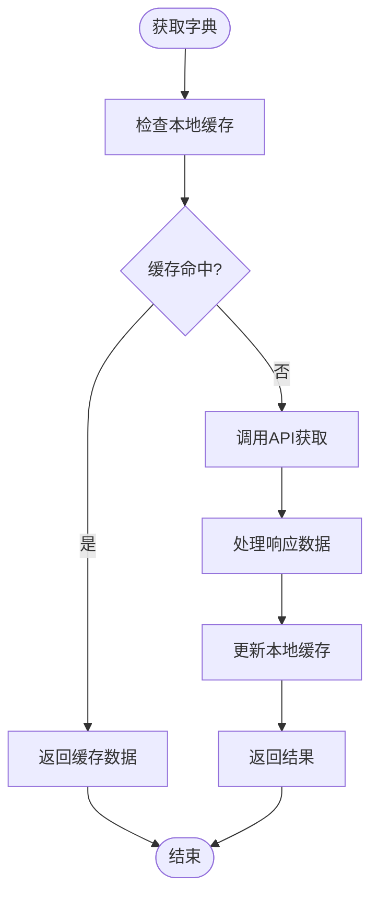

# 状态管理 (Pinia)

<cite>
**本文档引用的文件**  
- [user.js](file://web/src/pinia/modules/user.js)
- [app.js](file://web/src/pinia/modules/app.js)
- [router.js](file://web/src/pinia/modules/router.js)
- [dictionary.js](file://web/src/pinia/modules/dictionary.js)
- [params.js](file://web/src/pinia/modules/params.js)
- [index.js](file://web/src/pinia/index.js)
- [bus.js](file://web/src/utils/bus.js)
</cite>

## 目录
1. [简介](#简介)
2. [项目结构](#项目结构)
3. [核心组件](#核心组件)
4. [架构概述](#架构概述)
5. [详细组件分析](#详细组件分析)
6. [依赖分析](#依赖分析)
7. [性能考虑](#性能考虑)
8. [故障排除指南](#故障排除指南)
9. [结论](#结论)

## 简介
本项目采用 Pinia 作为 Vue 应用的状态管理库,实现了模块化的状态管理模式。通过将全局状态划分为 user(用户信息)、app(应用状态)、router(动态路由缓存)、dictionary(字典数据)等独立模块,提升了代码的可维护性和可测试性。每个模块都遵循 state、getters、actions 的设计模式,确保了状态变更的可预测性和响应式更新机制。

## 项目结构
项目中的状态管理模块位于 `web/src/pinia` 目录下,采用模块化设计,每个功能模块都有独立的 store 文件。

**图表来源**
- [app.js](file://web/src/pinia/modules/app.js)
- [user.js](file://web/src/pinia/modules/user.js)
- [router.js](file://web/src/pinia/modules/router.js)
- [dictionary.js](file://web/src/pinia/modules/dictionary.js)
- [params.js](file://web/src/pinia/modules/params.js)
- [index.js](file://web/src/pinia/index.js)

**章节来源**
- [index.js](file://web/src/pinia/index.js)

## 核心组件
系统定义了多个核心状态管理模块,包括用户信息管理、应用配置管理、路由管理、字典数据管理和参数管理。这些模块通过 Pinia 的模块化 store 设计实现了解耦和复用。

**章节来源**
- [user.js](file://web/src/pinia/modules/user.js)
- [app.js](file://web/src/pinia/modules/app.js)
- [router.js](file://web/src/pinia/modules/router.js)
- [dictionary.js](file://web/src/pinia/modules/dictionary.js)
- [params.js](file://web/src/pinia/modules/params.js)

## 架构概述
整个状态管理系统基于 Pinia 构建,采用模块化设计,各模块职责分明,通过统一的入口进行注册和使用。

**图表来源**
- [user.js](file://web/src/pinia/modules/user.js)
- [app.js](file://web/src/pinia/modules/app.js)
- [router.js](file://web/src/pinia/modules/router.js)
- [dictionary.js](file://web/src/pinia/modules/dictionary.js)
- [params.js](file://web/src/pinia/modules/params.js)

## 详细组件分析

### 用户模块分析
用户模块负责管理用户登录状态、用户信息和认证令牌。

**图表来源**
- [user.js](file://web/src/pinia/modules/user.js#L1-L150)

**章节来源**
- [user.js](file://web/src/pinia/modules/user.js#L1-L150)

### 应用模块分析
应用模块管理全局的应用配置和UI状态。

**图表来源**
- [app.js](file://web/src/pinia/modules/app.js#L1-L150)

**章节来源**
- [app.js](file://web/src/pinia/modules/app.js#L1-L150)

### 路由模块分析
路由模块处理动态路由加载和菜单管理。

**图表来源**
- [router.js](file://web/src/pinia/modules/router.js#L1-L180)

**章节来源**
- [router.js](file://web/src/pinia/modules/router.js#L1-L180)

### 字典模块分析
字典模块提供全局字典数据的缓存和查询功能。

**图表来源**
- [dictionary.js](file://web/src/pinia/modules/dictionary.js#L1-L40)

**章节来源**
- [dictionary.js](file://web/src/pinia/modules/dictionary.js#L1-L40)

## 依赖分析
各状态管理模块之间存在明确的依赖关系,通过模块间的协作实现复杂业务逻辑。

**图表来源**
- [user.js](file://web/src/pinia/modules/user.js)
- [router.js](file://web/src/pinia/modules/router.js)
- [bus.js](file://web/src/utils/bus.js)

**章节来源**
- [user.js](file://web/src/pinia/modules/user.js)
- [router.js](file://web/src/pinia/modules/router.js)
- [bus.js](file://web/src/utils/bus.js)

## 性能考虑
状态管理系统在设计时考虑了性能优化,通过合理的缓存策略和响应式更新机制确保应用流畅运行。

- **缓存策略**: 字典数据和路由信息在首次加载后会被缓存,避免重复请求
- **响应式更新**: 使用 Vue 的响应式系统,确保状态变更能够高效地触发视图更新
- **按需加载**: 动态路由按需加载,减少初始加载时间
- **内存管理**: 在用户登出时清理相关状态和缓存,防止内存泄漏

## 故障排除指南
针对常见的状态管理问题提供解决方案。

### 状态混乱问题
当出现状态不一致或更新失败时,可采取以下措施:

1. 检查 action 是否正确提交了状态变更
2. 确认是否在正确的 store 实例上调用了方法
3. 验证异步操作是否正确处理了 Promise
4. 检查是否存在多个 store 实例导致的状态隔离

### 更新失败问题
当状态更新未能触发视图重新渲染时:

1. 确保使用了 ref 或 reactive 包装状态
2. 检查是否直接修改了 state 而未通过 action
3. 验证 computed 属性的依赖是否正确
4. 确认是否在非响应式上下文中修改了状态

**章节来源**
- [user.js](file://web/src/pinia/modules/user.js)
- [app.js](file://web/src/pinia/modules/app.js)

## 结论
该项目的状态管理系统采用 Pinia 实现了模块化设计,各模块职责清晰,通过 state、getters、actions 的模式确保了状态管理的可预测性和可维护性。系统支持状态持久化(如 localStorage 同步)、响应式更新,并通过合理的架构设计实现了性能优化。跨模块调用通过明确的依赖关系进行管理,确保了系统的稳定性和可扩展性。