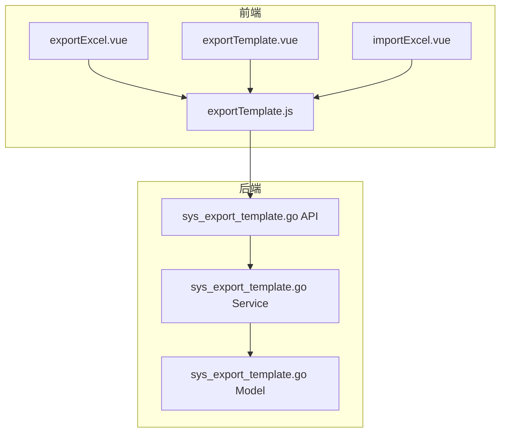
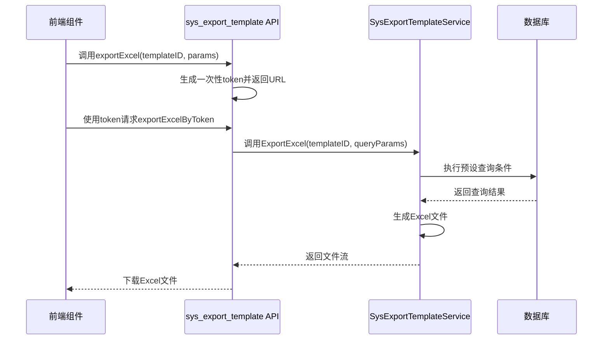
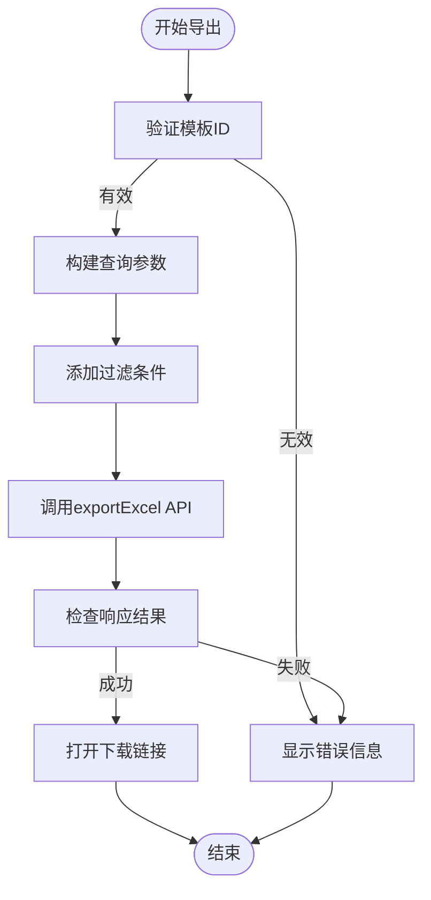
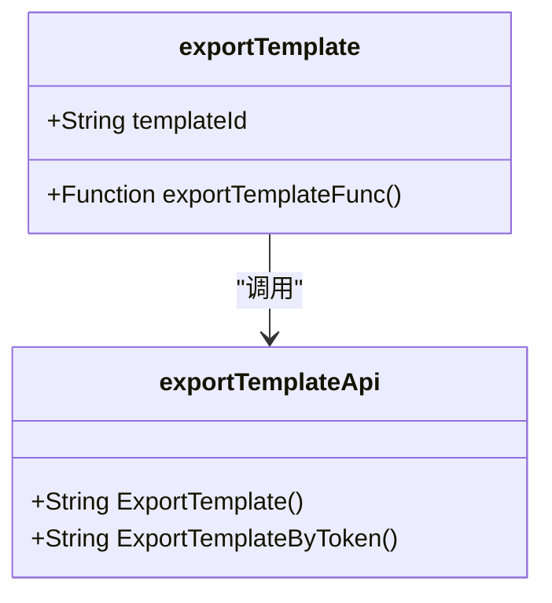
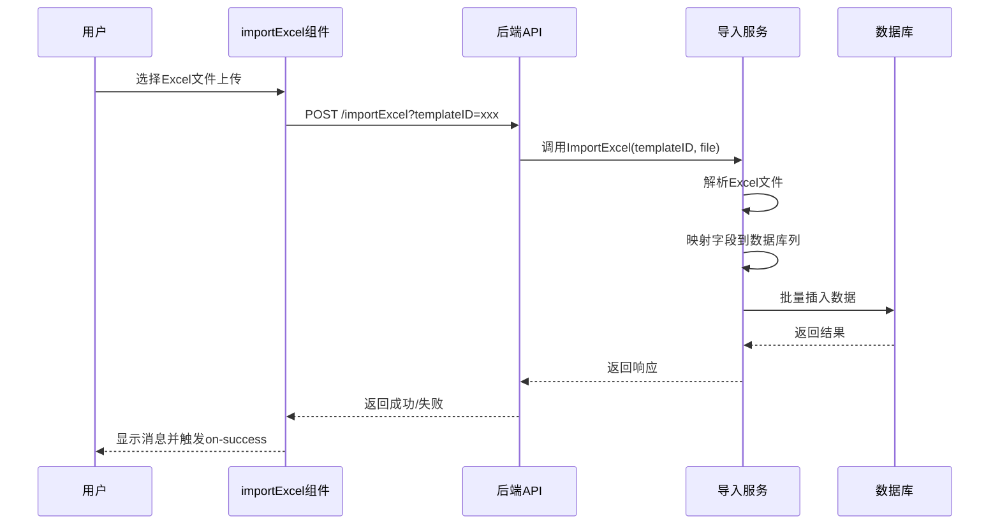
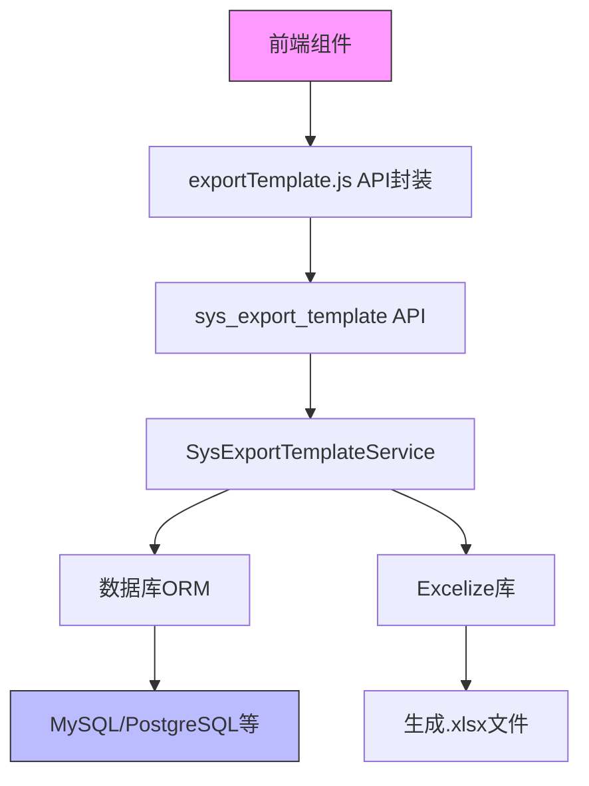

# Excel导入导出组件

<cite>
**本文档引用文件**   
- [exportExcel.vue](file://web/src/components/exportExcel/exportExcel.vue)
- [exportTemplate.vue](file://web/src/components/exportExcel/exportTemplate.vue)
- [importExcel.vue](file://web/src/components/exportExcel/importExcel.vue)
- [exportTemplate.js](file://web/src/api/exportTemplate.js)
- [sys_export_template.go](file://server/api/v1/system/sys_export_template.go)
- [sys_export_template.go](file://server/service/system/sys_export_template.go)
- [sys_export_template.go](file://server/model/system/sys_export_template.go)
- [sys_export_template.go](file://server/model/system/request/sys_export_template.go)
</cite>

## 目录
1. [简介](#简介)
2. [项目结构](#项目结构)
3. [核心组件](#核心组件)
4. [架构概览](#架构概览)
5. [详细组件分析](#详细组件分析)
6. [依赖分析](#依赖分析)
7. [性能考虑](#性能考虑)
8. [故障排除指南](#故障排除指南)
9. [结论](#结论)

## 简介
本技术文档深入解析gin-vue-admin系统中的Excel导入导出功能组件,涵盖`exportExcel`(数据导出)、`exportTemplate`(导出模板管理)和`importExcel`(数据导入)三大核心功能。文档详细阐述各组件的props参数、事件回调机制及与后端`sys_export_template`接口的协同工作流程。重点描述导出模板的动态字段绑定、自定义样式支持以及安全的数据流控制策略。通过完整使用示例和服务端代码解释,全面展示从模板配置到实际导出/导入的完整流程,以及模板持久化与动态渲染逻辑。

## 项目结构
Excel导入导出功能在前后端分别组织,前端组件位于`web/src/components/exportExcel/`目录下,包含三个核心Vue组件；后端API和服务逻辑位于`server/api/v1/system/`和`server/service/system/`目录中。

**Diagram sources**
- [exportExcel.vue](file://web/src/components/exportExcel/exportExcel.vue)
- [sys_export_template.go](file://server/api/v1/system/sys_export_template.go)

**Section sources**
- [exportExcel.vue](file://web/src/components/exportExcel/exportExcel.vue)
- [sys_export_template.go](file://server/api/v1/system/sys_export_template.go)

## 核心组件
系统提供三个独立但相互关联的Vue组件:`exportExcel`用于执行数据导出,`exportTemplate`用于下载空白模板,`importExcel`用于上传并导入数据。这些组件通过统一的API接口与后端服务通信,实现了完整的Excel数据交互闭环。

**Section sources**
- [exportExcel.vue](file://web/src/components/exportExcel/exportExcel.vue)
- [exportTemplate.vue](file://web/src/components/exportExcel/exportTemplate.vue)
- [importExcel.vue](file://web/src/components/exportExcel/importExcel.vue)

## 架构概览
系统采用前后端分离架构,前端组件通过API调用触发后端服务,后端服务处理数据库查询、Excel生成/解析等复杂逻辑。整个流程通过一次性token机制确保安全性,避免直接暴露敏感API端点。

**Diagram sources**
- [sys_export_template.go](file://server/api/v1/system/sys_export_template.go)
- [sys_export_template.go](file://server/service/system/sys_export_template.go)

## 详细组件分析

### exportExcel 组件分析
`exportExcel`组件提供数据导出功能,接收模板ID和查询条件作为输入参数,最终生成包含实际数据的Excel文件。

#### Props 参数说明
该组件接受以下props参数:

| 参数名 | 类型 | 必填 | 默认值 | 说明 |
|-------|------|------|--------|------|
| templateId | String | 是 | - | 指定使用的导出模板ID |
| condition | Object | 否 | {} | 查询条件对象 |
| filterDeleted | Boolean | 否 | true | 是否过滤软删除数据 |
| limit | Number | 否 | 0 | 导出数据条数限制 |
| offset | Number | 否 | 0 | 分页偏移量 |
| order | String | 否 | "" | 排序规则 |

**Diagram sources**
- [exportExcel.vue](file://web/src/components/exportExcel/exportExcel.vue#L1-L84)

**Section sources**
- [exportExcel.vue](file://web/src/components/exportExcel/exportExcel.vue#L1-L84)
- [exportTemplate.js](file://web/src/api/exportTemplate.js#L106-L112)

### exportTemplate 组件分析
`exportTemplate`组件专门用于下载空白的Excel模板文件,供用户填写数据后导入使用。

#### Props 参数说明
该组件仅需一个必要参数:

| 参数名 | 类型 | 必填 | 说明 |
|-------|------|------|------|
| templateId | String | 是 | 指定要下载的模板ID |

**Diagram sources**
- [exportTemplate.vue](file://web/src/components/exportExcel/exportTemplate.vue#L1-L40)
- [sys_export_template.go](file://server/api/v1/system/sys_export_template.go#L300-L340)

**Section sources**
- [exportTemplate.vue](file://web/src/components/exportExcel/exportTemplate.vue#L1-L40)

### importExcel 组件分析
`importExcel`组件实现Excel数据导入功能,允许用户上传填写好的模板文件,系统将解析并存入数据库。

#### Props 与事件
| 参数名 | 类型 | 必填 | 说明 |
|-------|------|------|------|
| templateId | String | 是 | 指定导入目标模板 |

| 事件名 | 参数 | 说明 |
|-------|------|------|
| on-success | - | 导入成功时触发 |

**Diagram sources**
- [importExcel.vue](file://web/src/components/exportExcel/importExcel.vue#L1-L45)
- [sys_export_template.go](file://server/api/v1/system/sys_export_template.go#L342-L370)

**Section sources**
- [importExcel.vue](file://web/src/components/exportExcel/importExcel.vue#L1-L45)

## 依赖分析
Excel导入导出功能依赖多个系统组件和服务,形成完整的功能链路。

**Diagram sources**
- [go.mod](file://go.mod)
- [sys_export_template.go](file://server/service/system/sys_export_template.go)

**Section sources**
- [sys_export_template.go](file://server/service/system/sys_export_template.go)
- [go.mod](file://go.mod)

## 性能考虑
系统在设计时充分考虑了性能因素:
- 使用`CreateInBatches`进行批量插入,提高导入效率
- 支持分页导出(`limit`/`offset`),避免单次导出大量数据
- 查询时自动处理软删除过滤,减少无效数据传输
- 服务端缓存一次性token,防止重复请求攻击

## 故障排除指南
常见问题及解决方案:

1. **导出失败提示"模板ID不能为空"**
   - 检查组件是否正确设置了`templateId`属性
   - 确认后端数据库中存在对应ID的模板记录

2. **导入时出现字段映射错误**
   - 确保上传的Excel文件标题行与模板定义完全一致
   - 检查是否有额外的空格字符

3. **导出数据量超出限制**
   - 调整模板的默认`Limit`设置或通过参数传入更大的`limit`值
   - 考虑使用分页导出功能

4. **token过期错误**
   - 一次性token有效期为30分钟,超时需重新发起请求
   - 网络延迟较大时可能需要优化token有效期

**Section sources**
- [sys_export_template.go](file://server/api/v1/system/sys_export_template.go)
- [sys_export_template.go](file://server/service/system/sys_export_template.go)

## 结论
gin-vue-admin的Excel导入导出组件提供了一套完整、安全且高效的数据交互解决方案。通过模板驱动的方式,实现了灵活的数据导出和标准化的数据导入。系统采用一次性token机制保障安全性,结合前后端协同工作,为用户提供流畅的数据操作体验。建议在使用时合理配置模板参数,充分利用条件查询和分页功能,以获得最佳性能表现。