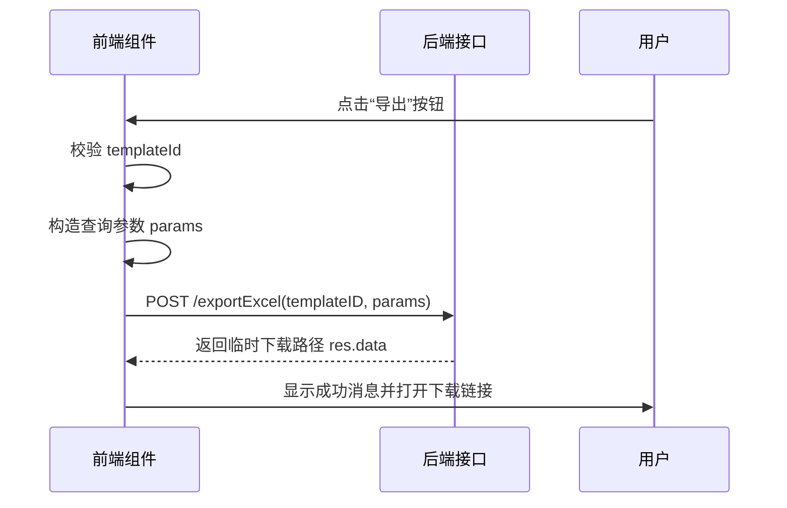

# 业务组件

<cite>
**本文档中引用的文件**  
- [exportExcel.vue](file://web/src/components/exportExcel/exportExcel.vue)
- [exportTemplate.vue](file://web/src/components/exportExcel/exportTemplate.vue)
- [importExcel.vue](file://web/src/components/exportExcel/importExcel.vue)
- [rich-edit.vue](file://web/src/components/richtext/rich-edit.vue)
- [rich-view.vue](file://web/src/components/richtext/rich-view.vue)
- [index.vue](file://web/src/components/office/index.vue)
- [docx.vue](file://web/src/components/office/docx.vue)
- [pdf.vue](file://web/src/components/office/pdf.vue)
- [excel.vue](file://web/src/components/office/excel.vue)
- [charts.vue](file://web/src/components/charts/index.vue)
- [commandMenu.vue](file://web/src/components/commandMenu/index.vue)
- [bottomInfo.vue](file://web/src/components/bottomInfo/bottomInfo.vue)
- [warningBar.vue](file://web/src/components/warningBar/warningBar.vue)
</cite>

## 目录
1. [简介](#简介)
2. [导出导入 Excel 组件](#导出导入-excel-组件)
3. [富文本编辑与预览组件](#富文本编辑与预览组件)
4. [Office 文档预览组件](#office-文档预览组件)
5. [图表展示组件](#图表展示组件)
6. [命令菜单组件](#命令菜单组件)
7. [底部信息栏组件](#底部信息栏组件)
8. [警告条组件](#警告条组件)
9. [组件集成示例](#组件集成示例)

## 简介
本项目提供了一系列可复用的前端业务级组件,涵盖数据导出、富文本处理、文档预览、可视化展示等常见企业级应用场景。这些组件封装了复杂的交互逻辑和外部依赖,通过标准化接口简化集成过程,提升开发效率。

## 导出导入 Excel 组件

### 功能概述
`exportExcel` 组件族包含三个核心子组件:`exportExcel`(数据导出)、`exportTemplate`(模板下载)和 `importExcel`(数据导入),共同实现完整的 Excel 数据流转能力。

### 业务场景适用性
适用于需要批量导出系统数据为 Excel 文件、基于模板进行数据填充或从 Excel 文件批量导入数据的业务场景,如报表生成、数据迁移、配置初始化等。

### 数据绑定方式
组件通过 `props` 接收参数:
- `templateId`: 必填,指定后端导出模板 ID
- `condition`: 可选,附加查询条件对象
- `filterDeleted`, `limit`, `offset`, `order`: 分页与排序控制参数

### 外部依赖
- 后端接口:`/sysExportTemplate/exportExcel`、`/sysExportTemplate/downloadTemplate`、`/sysExportTemplate/importExcel`
- 前端 API 模块:`@/api/exportTemplate`

### 封装策略
组件内部封装了请求构造、环境变量适配(`VITE_BASE_API`)、错误提示(`ElMessage`)及新窗口打开下载链接的完整流程,调用方仅需传入模板 ID 即可完成操作。

### 与后端协同工作流程


**Diagram sources**
- [exportExcel.vue](file://web/src/components/exportExcel/exportExcel.vue#L1-L84)
- [exportTemplate.vue](file://web/src/components/exportExcel/exportTemplate.vue#L1-L40)

**Section sources**
- [exportExcel.vue](file://web/src/components/exportExcel/exportExcel.vue#L1-L84)
- [exportTemplate.vue](file://web/src/components/exportExcel/exportTemplate.vue#L1-L40)
- [importExcel.vue](file://web/src/components/exportExcel/importExcel.vue#L1-L45)

## 富文本编辑与预览组件

### 功能概述
`richtext` 组件提供 `rich-edit`(编辑模式)和 `rich-view`(只读预览)两个组件,基于 `wangeditor` 实现富文本内容的输入与展示。

### 业务场景适用性
适用于需要支持图文混排的内容发布场景,如公告编辑、文章撰写、工单描述等。

### 数据绑定方式
使用 `v-model` 双向绑定 HTML 字符串内容,兼容 Vue 3 的 `defineModel` 语法。

### 安全过滤机制
- 图片上传通过后端接口 `/fileUploadAndDownload/upload?noSave=1` 进行服务端校验
- 使用 `customInsert` 回调确保仅插入合法返回的图片 URL
- 编辑器本身具备基础 XSS 防护能力,输出时建议配合前端 DOMPurify 或服务端过滤

### 外部依赖
- 第三方库:`@wangeditor/editor-for-vue`
- 样式文件:`@wangeditor/editor/dist/css/style.css`

### 封装策略
封装了编辑器实例生命周期管理(创建、销毁)、模型同步、图片上传配置等细节,暴露简洁的 `modelValue` 接口供父组件使用。

**Section sources**
- [rich-edit.vue](file://web/src/components/richtext/rich-edit.vue#L1-L93)
- [rich-view.vue](file://web/src/components/richtext/rich-view.vue#L1-L58)

## Office 文档预览组件

### 功能概述
`office` 组件族支持 `.docx`、`.pdf`、`.xlsx` 和常见图片格式的在线预览,通过统一入口 `index.vue` 自动识别文件类型并路由到对应渲染器。

### 业务场景适用性
适用于需要在系统内直接查看附件内容而无需下载的场景,如合同审阅、报告查阅、日志分析等。

### 数据绑定方式
通过 `v-model` 接收相对文件路径,自动拼接 `VITE_BASE_API` 构成完整 URL。

### 外部依赖
- 第三方库:
  - `@vue-office/docx` 用于 DOCX 预览
  - `@vue-office/pdf` 用于 PDF 预览
  - 内置 `<el-image>` 用于图片预览
- 样式文件:`@vue-office/docx/lib/index.css`

### 封装策略
采用组合模式统一处理不同格式文件的预览需求,内部通过计算属性 `ext` 判断文件类型,并动态渲染对应的子组件,对外提供一致的接口。

**Section sources**
- [index.vue](file://web/src/components/office/index.vue#L1-L49)
- [docx.vue](file://web/src/components/office/docx.vue#L1-L31)
- [pdf.vue](file://web/src/components/office/pdf.vue#L1-L39)
- [excel.vue](file://web/src/components/office/excel.vue)

## 图表展示组件

### 功能概述
`charts` 组件封装了常用的数据可视化功能,提供即插即用的图表展示能力。

### 业务场景适用性
适用于仪表盘、统计报表、趋势分析等需要图形化展示数据的页面。

### 数据绑定方式
具体数据绑定方式需参考组件内部实现,通常通过 `props` 接收数据集和配置项。

### 外部依赖
可能依赖 ECharts 或其他前端图表库(具体依赖未在代码片段中体现)。

### 封装策略
抽象通用图表逻辑,提供默认样式和响应式布局,降低使用门槛。

**Section sources**
- [charts.vue](file://web/src/components/charts/index.vue)

## 命令菜单组件

### 功能概述
`commandMenu` 组件提供快捷命令访问入口,提升高级用户操作效率。

### 业务场景适用性
适用于功能繁多的管理系统,作为快速导航或执行常用操作的辅助工具。

### 封装策略
封装了触发逻辑、搜索匹配、结果展示等交互细节,可通过全局快捷键激活。

**Section sources**
- [commandMenu.vue](file://web/src/components/commandMenu/index.vue)

## 底部信息栏组件

### 功能概述
`bottomInfo` 组件用于在页面底部固定显示状态信息、版权说明或其他辅助内容。

### 业务场景适用性
适用于需要持续展示系统状态、版本号或联系信息的布局场景。

**Section sources**
- [bottomInfo.vue](file://web/src/components/bottomInfo/bottomInfo.vue)

## 警告条组件

### 功能概述
`warningBar` 组件用于醒目地展示系统警告、升级提示或重要通知。

### 业务场景适用性
适用于需要引起用户注意的关键信息提示,如维护通知、安全警告等。

**Section sources**
- [warningBar.vue](file://web/src/components/warningBar/warningBar.vue)

## 组件集成示例

以下是一个综合使用多个业务组件的页面示例结构:

```vue
<template>
  <div class="page-container">
    <!-- 富文本编辑 -->
    <RichEdit v-model="content" />

    <!-- Office 文档预览 -->
    <Office v-model="docUrl" />

    <!-- 图表展示 -->
    <Charts :data="chartData" />

    <!-- Excel 导出 -->
    <ExportExcel 
      template-id="user_report_001"
      :condition="{ dept: 'IT' }"
    />

    <!-- 命令菜单 -->
    <CommandMenu />

    <!-- 底部信息与警告 -->
    <BottomInfo />
    <WarningBar message="系统将于今晚23:00进行维护" />
  </div>
</template>

<script setup>
import RichEdit from '@/components/richtext/rich-edit.vue'
import Office from '@/components/office/index.vue'
import Charts from '@/components/charts/index.vue'
import ExportExcel from '@/components/exportExcel/exportExcel.vue'
import CommandMenu from '@/components/commandMenu/index.vue'
import BottomInfo from '@/components/bottomInfo/bottomInfo.vue'
import WarningBar from '@/components/warningBar/warningBar.vue'

const content = ref('')
const docUrl = ref('/uploads/report.docx')
const chartData = ref({ /* 数据 */ })
</script>
```

此示例展示了如何在一个页面中协调使用多个业务组件,形成完整的企业级应用界面。