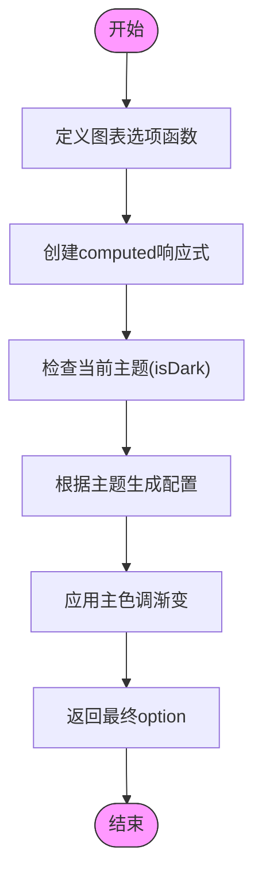

# 图表展示组件

<cite>
**本文档引用文件**  
- [charts/index.vue](file://web/src/components/charts/index.vue)
- [hooks/charts.js](file://web/src/hooks/charts.js)
- [view/dashboard/components/charts-content-numbers.vue](file://web/src/view/dashboard/components/charts-content-numbers.vue)
- [view/dashboard/components/charts-people-numbers.vue](file://web/src/view/dashboard/components/charts-people-numbers.vue)
- [view/dashboard/components/charts.vue](file://web/src/view/dashboard/components/charts.vue)
- [view/dashboard/index.vue](file://web/src/view/dashboard/index.vue)
- [hooks/use-windows-resize.js](file://web/src/hooks/use-windows-resize.js)
</cite>

## 目录
1. [简介](#简介)
2. [项目结构](#项目结构)
3. [核心组件](#核心组件)
4. [架构概览](#架构概览)
5. [详细组件分析](#详细组件分析)
6. [依赖分析](#依赖分析)
7. [性能考虑](#性能考虑)
8. [故障排除指南](#故障排除指南)
9. [结论](#结论)

## 简介
本组件为基于 Vue 3 和 ECharts 的图表封装组件,提供响应式布局、动态数据绑定和主题切换功能。通过 `vue-echarts` 实现图表渲染,并结合自定义 hooks 进行状态管理和视觉适配。

## 项目结构
图表相关组件位于 `web/src/components/charts/` 目录下,配套的数据处理逻辑存放在 `web/src/hooks/` 中,实际应用示例见于 `web/src/view/dashboard/` 模块。


**图表来源**
- [charts/index.vue](file://web/src/components/charts/index.vue#L1-L54)
- [hooks/charts.js](file://web/src/hooks/charts.js#L1-L18)
- [view/dashboard/components/charts.vue](file://web/src/view/dashboard/components/charts.vue#L1-L54)

**章节来源**
- [charts/index.vue](file://web/src/components/charts/index.vue#L1-L54)
- [hooks/use-windows-resize.js](file://web/src/hooks/use-windows-resize.js#L1-L24)

## 核心组件

`charts/index.vue` 是基础图表容器组件,封装了 `vue-echarts` 并实现了关键特性:
- 支持通过 `options` prop 传递完整的 ECharts 配置项
- 提供 `autoResize` 控制是否自动响应窗口变化
- 使用 `v-if` 控制渲染时机以避免初始化问题
- 内部通过 `nextTick` 确保 DOM 就绪后渲染

该组件作为所有具体图表类型的底层支撑,可渲染折线图、柱状图、饼图等各类图表。

**章节来源**
- [charts/index.vue](file://web/src/components/charts/index.vue#L1-L54)

## 架构概览

系统采用分层架构设计,从上至下分别为:
1. **展示层**:Dashboard 页面中的各种图表卡片
2. **组合层**:具体业务图表组件(如人数统计、内容数量)
3. **通用层**:基础图表组件 `index.vue`
4. **工具层**:Hooks 提供复用逻辑

数据流方向为:Pinia Store → Hooks → Options → ECharts 渲染


**图表来源**
- [charts/index.vue](file://web/src/components/charts/index.vue#L1-L54)
- [hooks/charts.js](file://web/src/hooks/charts.js#L1-L18)
- [hooks/use-windows-resize.js](file://web/src/hooks/use-windows-resize.js#L1-L24)

**章节来源**
- [charts/index.vue](file://web/src/components/charts/index.vue#L1-L54)
- [hooks/charts.js](file://web/src/hooks/charts.js#L1-L18)

## 详细组件分析

### 基础图表组件分析

#### 对象导向组件:


**图表来源**
- [charts/index.vue](file://web/src/components/charts/index.vue#L1-L54)

**章节来源**
- [charts/index.vue](file://web/src/components/charts/index.vue#L1-L54)

### 数据可视化流程分析

#### API/服务组件:


**图表来源**
- [view/dashboard/index.vue](file://web/src/view/dashboard/index.vue#L1-L77)
- [view/dashboard/components/charts.vue](file://web/src/view/dashboard/components/charts.vue#L1-L54)
- [view/dashboard/components/charts-people-numbers.vue](file://web/src/view/dashboard/components/charts-people-numbers.vue#L1-L139)

**章节来源**
- [view/dashboard/index.vue](file://web/src/view/dashboard/index.vue#L1-L77)
- [view/dashboard/components/charts.vue](file://web/src/view/dashboard/components/charts.vue#L1-L54)

### 动态配置生成分析

#### 复杂逻辑组件:


**图表来源**
- [hooks/charts.js](file://web/src/hooks/charts.js#L1-L18)
- [view/dashboard/components/charts-people-numbers.vue](file://web/src/view/dashboard/components/charts-people-numbers.vue#L1-L139)

**章节来源**
- [hooks/charts.js](file://web/src/hooks/charts.js#L1-L18)

## 依赖分析

组件间依赖关系清晰,遵循单一职责原则:

```mermaid
dependency-graph
charts.js --> pinia
charts/index.vue --> vue-echarts
charts/index.vue --> use-windows-resize.js
charts-people-numbers.vue --> charts.js
charts-people-numbers.vue --> charts/index.vue
charts-content-numbers.vue --> charts.js
charts-content-numbers.vue --> charts/index.vue
dashboard/components/charts.vue --> charts-people-numbers.vue
dashboard/components/charts.vue --> charts-content-numbers.vue
```

**图表来源**
- [go.mod](file://package.json)
- [charts/index.vue](file://web/src/components/charts/index.vue#L1-L54)

**章节来源**
- [charts/index.vue](file://web/src/components/charts/index.vue#L1-L54)
- [hooks/charts.js](file://web/src/hooks/charts.js#L1-L18)

## 性能考虑

- 使用 `shallowRef` 和 `computed` 最小化响应式开销
- 通过 `v-if` 控制重渲染而非直接更新
- 利用 `passive: true` 提升事件监听性能
- 图表配置使用计算属性缓存结果
- 避免在每次 resize 时频繁重建实例

## 故障排除指南

常见问题及解决方案:

| 问题现象 | 可能原因 | 解决方案 |
|---------|--------|--------|
| 图表不显示 | `renderChart` 未正确触发 | 检查 `nextTick` 是否正常执行 |
| 不响应窗口变化 | `useWindowResize` 未正确注册 | 确认已正确导入并调用hook |
| 主题切换无效 | Pinia store 状态未更新 | 检查 `appStore.isDark` 是否正确变更 |
| 数据未更新 | `options` 未响应式更新 | 确保传入的 options 是响应式的 |

**章节来源**
- [charts/index.vue](file://web/src/components/charts/index.vue#L1-L54)
- [hooks/use-windows-resize.js](file://web/src/hooks/use-windows-resize.js#L1-L24)

## 结论

`charts/index.vue` 组件成功封装了 ECharts 的复杂性,提供了简洁易用的接口。配合 `useChartOption` hook 实现了主题适配能力,通过 `useWindowResize` 确保响应式体验。整个图表体系结构清晰、职责分明,便于扩展和维护。