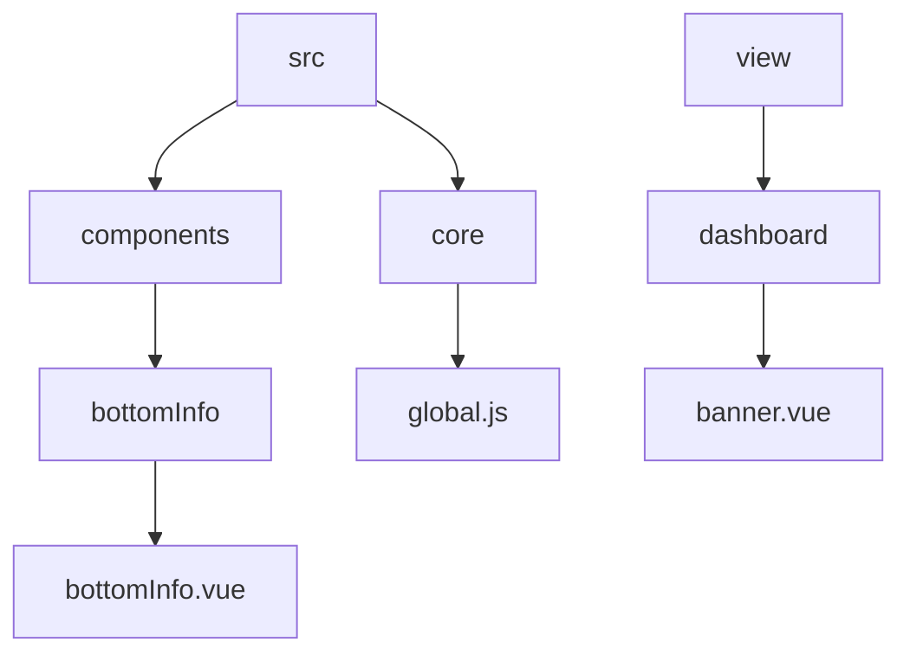
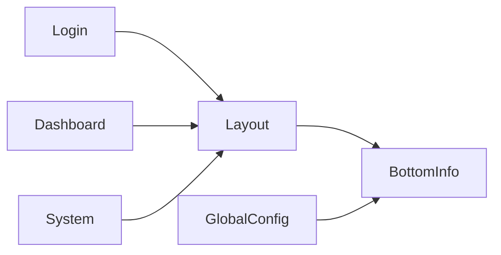
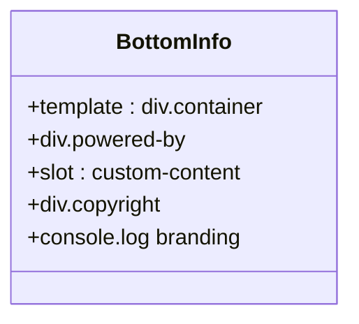
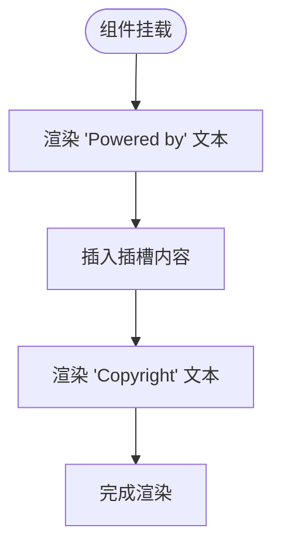
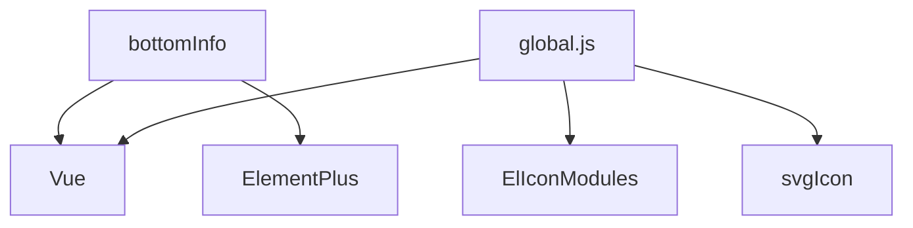

# 底部信息栏组件

<cite>
**本文档引用文件**  
- [bottomInfo.vue](file://web/src/components/bottomInfo/bottomInfo.vue)
- [global.js](file://web/src/core/global.js)
- [banner.vue](file://web/src/view/dashboard/components/banner.vue)
</cite>

## 目录
1. [简介](#简介)
2. [项目结构](#项目结构)
3. [核心功能分析](#核心功能分析)
4. [架构概述](#架构概述)
5. [详细组件分析](#详细组件分析)
6. [依赖关系分析](#依赖关系分析)
7. [性能考量](#性能考量)
8. [故障排查指南](#故障排查指南)
9. [结论](#结论)

## 简介
`bottomInfo` 组件是 gin-vue-admin 项目中用于展示系统底部静态信息的核心 UI 组件。该组件主要负责渲染版本信息、版权说明和系统归属等基础内容，为用户界面提供完整的视觉收尾。通过与 `global.js` 中的全局配置联动，实现了跨页面的一致性展示，并支持在不同布局场景下灵活使用。

## 项目结构
`bottomInfo` 组件位于前端源码的组件目录中，作为独立可复用的 Vue 组件存在。其结构设计遵循了模块化原则，便于在多个页面布局中集成使用。

**图示来源**
- [bottomInfo.vue](file://web/src/components/bottomInfo/bottomInfo.vue)
- [global.js](file://web/src/core/global.js)
- [banner.vue](file://web/src/view/dashboard/components/banner.vue)

**本节来源**
- [bottomInfo.vue](file://web/src/components/bottomInfo/bottomInfo.vue#L0-L43)
- [global.js](file://web/src/core/global.js#L0-L59)
- [banner.vue](file://web/src/view/dashboard/components/banner.vue#L0-L43)

## 核心功能分析
`bottomInfo` 组件具备以下核心能力：
- 静态信息展示：包含 "Powered by Gin-Vue-Admin" 和 "Copyright flipped-aurora团队" 的固定文本
- 版权链接支持：所有文字内容均封装在可点击的超链接中，指向项目官方仓库
- 响应式布局：采用 Tailwind CSS 的 flex 布局，在移动端显示为垂直排列，在桌面端显示为水平排列
- 插槽扩展机制：通过 `<slot />` 提供自定义内容插入点，允许开发者扩展额外信息
- 控制台品牌输出：在浏览器控制台打印品牌标识，增强开发体验

该组件不直接读取动态数据，而是作为标准化的信息展示单元，在所有使用它的页面中保持一致的外观和行为。

**本节来源**
- [bottomInfo.vue](file://web/src/components/bottomInfo/bottomInfo.vue#L0-L43)

## 架构概述
`bottomInfo` 组件在整个系统架构中扮演着统一视觉规范的角色。它被集成到多个顶级布局组件中，确保无论用户导航至哪个页面，底部信息始终保持一致。

**图示来源**
- [bottomInfo.vue](file://web/src/components/bottomInfo/bottomInfo.vue)
- [global.js](file://web/src/core/global.js)

## 详细组件分析

### bottomInfo 组件分析
`bottomInfo` 是一个典型的展示型 Vue 3 组件，采用 `<script setup>` 语法糖编写，具有简洁的模板结构和最小化的逻辑处理。

#### 组件结构

**图示来源**
- [bottomInfo.vue](file://web/src/components/bottomInfo/bottomInfo.vue#L1-L43)

#### 信息渲染流程

**图示来源**
- [bottomInfo.vue](file://web/src/components/bottomInfo/bottomInfo.vue#L10-L28)

**本节来源**
- [bottomInfo.vue](file://web/src/components/bottomInfo/bottomInfo.vue#L0-L43)

### 全局变量联动机制
虽然 `bottomInfo` 组件当前未直接使用 `global.js` 中的 `$GIN_VUE_ADMIN` 配置对象，但其设计理念与全局配置体系相契合。通过 `app.config.globalProperties.$GIN_VUE_ADMIN = config` 的注册方式，为未来可能的动态信息注入提供了技术基础。

这种设计模式允许将应用名称、版本号等信息从全局配置中提取，实现真正的动态化管理。目前组件采用硬编码方式展示信息，保证了基本的品牌一致性需求。

**本节来源**
- [global.js](file://web/src/core/global.js#L57)
- [bottomInfo.vue](file://web/src/components/bottomInfo/bottomInfo.vue#L0-L43)

## 依赖关系分析
`bottomInfo` 组件的依赖关系极为简单，体现了高内聚低耦合的设计原则。

**图示来源**
- [bottomInfo.vue](file://web/src/components/bottomInfo/bottomInfo.vue)
- [global.js](file://web/src/core/global.js)

**本节来源**
- [bottomInfo.vue](file://web/src/components/bottomInfo/bottomInfo.vue#L0-L43)
- [global.js](file://web/src/core/global.js#L0-L59)

## 性能考量
由于 `bottomInfo` 组件仅包含静态 HTML 结构和简单的样式类，其性能开销几乎可以忽略不计。组件不涉及任何复杂计算、异步操作或大量 DOM 操作，因此在各种设备上都能保持流畅的渲染性能。

建议保持当前轻量级设计，避免引入不必要的响应式数据或复杂逻辑，以维持最佳性能表现。

## 故障排查指南
当 `bottomInfo` 组件出现显示异常时，可参考以下排查步骤：
1. 检查组件是否正确导入并注册
2. 确认父组件中是否正确使用了 `<bottom-info />` 标签
3. 验证网络环境是否阻止了外部链接访问
4. 检查浏览器控制台是否有样式加载错误
5. 确保没有全局 CSS 规则覆盖了组件的默认样式

对于插槽内容不显示的问题，需确认插槽语法使用正确且传递的内容非空。

**本节来源**
- [bottomInfo.vue](file://web/src/components/bottomInfo/bottomInfo.vue#L0-L43)

## 结论
`bottomInfo` 组件成功实现了底部信息栏的基本功能需求，通过简洁的设计和良好的可扩展性，为系统提供了统一的品牌展示方案。尽管当前采用硬编码方式，但其架构预留了与全局配置联动的可能性，为未来的功能演进奠定了基础。结合 dashboard 页面的 banner 区域使用，共同构建了完整而专业的用户界面形象。