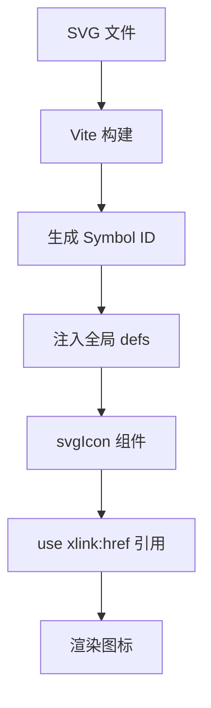

# 图标组件 (svgIcon)

<cite>
**本文档中引用的文件**  
- [svgIcon.vue](file://web/src/components/svgIcon/svgIcon.vue)
- [global.js](file://web/src/core/global.js)
- [vite.config.js](file://web/vite.config.js)
</cite>

## 目录
1. [简介](#简介)
2. [核心实现机制](#核心实现机制)
3. [属性定义与类型](#属性定义与类型)
4. [事件绑定与插槽使用](#事件绑定与插槽使用)
5. [Element Plus 图标集成实践](#element-plus-图标集成实践)
6. [自定义图标集扩展](#自定义图标集扩展)
7. [构建工具配置（Vite）](#构建工具配置vite)
8. [样式覆盖与响应式适配](#样式覆盖与响应式适配)
9. [常见问题排查](#常见问题排查)
10. [实际应用示例](#实际应用示例)

## 简介
`svgIcon` 组件是基于 Vue 3 的轻量级 SVG 图标复用解决方案，通过动态注入 SVG Symbol 实现高效的图标渲染。该组件支持灵活的属性配置、颜色控制和尺寸调整，并与 Element Plus 图标库无缝集成，广泛应用于菜单、按钮等 UI 元素中。

**Section sources**
- [svgIcon.vue](file://web/src/components/svgIcon/svgIcon.vue#L1-L31)

## 核心实现机制
组件采用 `<use>` 标签引用预注册的 SVG Symbol，利用 `xlink:href` 动态绑定图标名称，实现按需加载与复用。所有 SVG 资源在构建阶段由 Vite 插件自动扫描并注入全局 Symbol 容器，避免重复请求与内存浪费。



**Diagram sources**
- [svgIcon.vue](file://web/src/components/svgIcon/svgIcon.vue#L1-L31)
- [vite.config.js](file://web/vite.config.js#L1-L121)

**Section sources**
- [svgIcon.vue](file://web/src/components/svgIcon/svgIcon.vue#L1-L31)
- [global.js](file://web/src/core/global.js#L17-L48)

## 属性定义与类型
组件支持以下属性：

| 属性名 | 类型 | 默认值 | 必填 | 说明 |
|-------|------|--------|------|------|
| name | String | - | 是 | 图标唯一标识符，对应 SVG 文件名 |
| color | String | currentColor | 否 | 图标填充颜色，支持 CSS 颜色值 |

```javascript
defineProps({
  name: {
    type: String,
    required: true
  },
  color: {
    type: String,
    default: 'currentColor'
  }
})
```

**Section sources**
- [svgIcon.vue](file://web/src/components/svgIcon/svgIcon.vue#L6-L15)

## 事件绑定与插槽使用
组件本身不提供插槽，但可通过 `$attrs` 透传所有原生 SVG 属性（如 `@click`, `class`, `style`），实现事件绑定与样式扩展。例如：
```vue
<svg-icon name="edit" @click="handleClick" class="custom-class" />
```

**Section sources**
- [svgIcon.vue](file://web/src/components/svgIcon/svgIcon.vue#L1)

## Element Plus 图标集成实践
项目通过 `global.js` 自动注册所有 Element Plus 图标组件，开发者可直接使用 `<el-icon><Edit /></el-icon>` 或通过 `svgIcon` 封装调用。同时支持将 Element Plus 图标纳入统一管理日志系统。

```javascript
import * as ElIconModules from '@element-plus/icons-vue'
for (const iconName in ElIconModules) {
  app.component(iconName, ElIconModules[iconName])
}
```

**Section sources**
- [global.js](file://web/src/core/global.js#L50-L58)

## 自定义图标集扩展
支持从两个路径自动加载 SVG 图标：
- 系统级：`@/assets/icons/**/*.svg`
- 插件级：`@/plugin/**/assets/icons/**/*.svg`

图标命名需符合规范（无空格），文件名即为组件名。插件图标会自动添加插件前缀以避免冲突。

```javascript
const iconModules = import.meta.glob('@/assets/icons/**/*.svg')
const pluginIconModules = import.meta.glob('@/plugin/**/assets/icons/**/*.svg')
```

**Section sources**
- [global.js](file://web/src/core/global.js#L17-L48)

## 构建工具配置（Vite）
Vite 使用 `vite-auto-import-svg` 插件实现 SVG 自动导入与 Symbol 注入。配置位于 `vite.config.js` 中，指定图标目录、输出路径及环境参数。

```javascript
svgBuilder(['./src/plugin/','./src/assets/icons/'], base, outDir, 'assets', NODE_ENV)
```

**Section sources**
- [vite.config.js](file://web/vite.config.js#L1-L121)

## 样式覆盖与响应式适配
组件默认尺寸为 `w-4 h-4`（Tailwind CSS 单位），可通过外部类名或内联样式覆盖。`fill: currentColor` 确保颜色继承父元素文本色，实现主题一致性。

```css
.svg-icon {
  @apply w-4 h-4;
  fill: currentColor;
  vertical-align: middle;
}
```

响应式场景下建议结合 Tailwind 媒体查询类进行适配，如 `sm:w-5 md:w-6`。

**Section sources**
- [svgIcon.vue](file://web/src/components/svgIcon/svgIcon.vue#L32-L37)

## 常见问题排查
### 图标不显示
- 检查 SVG 文件是否位于正确目录
- 确认文件名不含空格或特殊字符
- 查看浏览器控制台是否有 404 错误
- 验证 `name` 属性值与文件名一致（不含 `.svg`）

### 颜色失效
- 确保未在 SVG 内联设置 `fill` 属性
- 检查父元素是否有明确的颜色定义
- 使用 `color` 属性显式指定颜色值

### 构建后图标丢失
- 确认 `vite.config.js` 中 `svgBuilder` 路径配置正确
- 检查构建产物中是否存在对应 Symbol 定义

**Section sources**
- [svgIcon.vue](file://web/src/components/svgIcon/svgIcon.vue#L32-L37)
- [global.js](file://web/src/core/global.js#L17-L48)

## 实际应用示例
### 在菜单中使用
```vue
<template>
  <el-menu-item index="1">
    <svg-icon name="dashboard" color="#999" />
    <span>仪表盘</span>
  </el-menu-item>
</template>
```

### 在按钮中嵌入图标
```vue
<template>
  <el-button type="primary" @click="exportData">
    <svg-icon name="export" /> 导出数据
  </el-button>
</template>
```

### 动态切换图标
```vue
<template>
  <svg-icon :name="isActive ? 'eye-open' : 'eye-close'" @click="toggle" />
</template>
```

**Section sources**
- [svgIcon.vue](file://web/src/components/svgIcon/svgIcon.vue#L1-L31)
- [global.js](file://web/src/core/global.js#L8-L15)