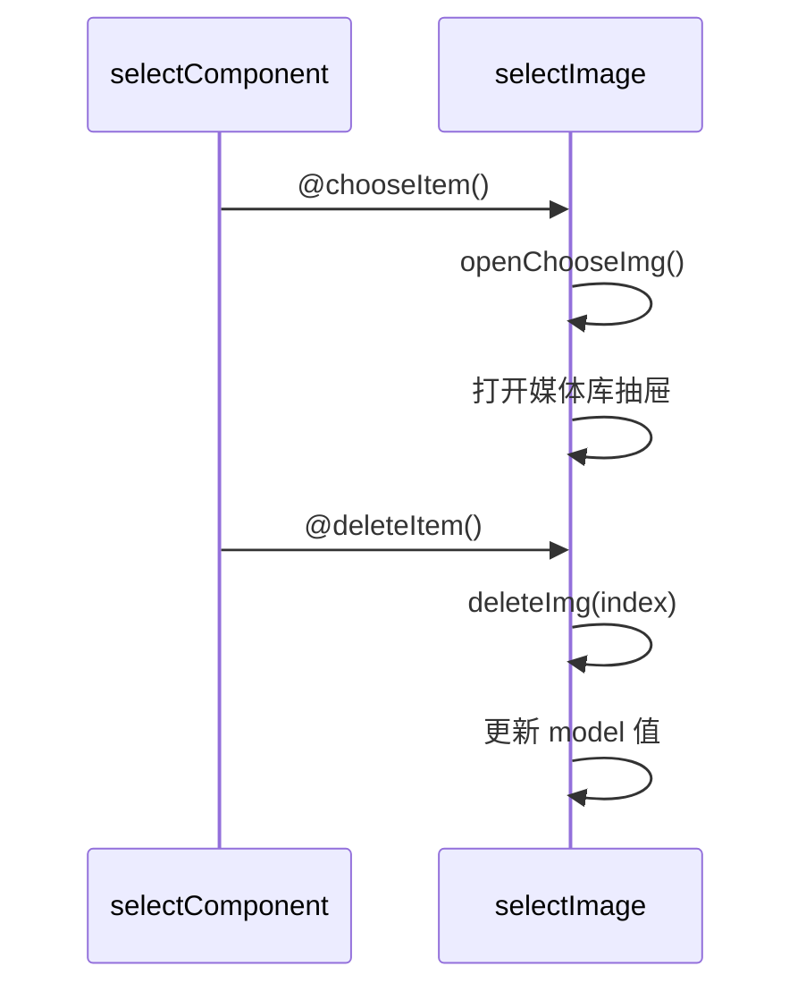
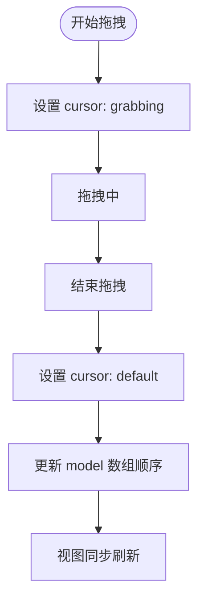

# 图片选择器 (selectImage)

<cite>
**本文档引用文件**  
- [selectImage.vue](file://web/src/components/selectImage/selectImage.vue)
- [selectComponent.vue](file://web/src/components/selectImage/selectComponent.vue)
</cite>

## 目录
1. [组件设计目的与使用场景](#组件设计目的与使用场景)  
2. [主从组件通信机制](#主从组件通信机制)  
3. [核心属性与事件设计](#核心属性与事件设计)  
4. [典型业务调用示例](#典型业务调用示例)  
5. [多选模式与拖拽排序](#多选模式与拖拽排序)  
6. [上传联动与完整流程](#上传联动与完整流程)  
7. [响应式布局表现](#响应式布局表现)  
8. [状态管理集成实践](#状态管理集成实践)

## 组件设计目的与使用场景

图片选择器组件（selectImage）作为图像资源的统一入口，主要用于表单或配置界面中实现图片/视频资源的选择功能。该组件通过封装媒体库弹窗、分类树、搜索过滤、预览选择等能力，为用户提供直观的视觉化资源管理体验。

在用户头像设置、轮播图配置、商品图集上传等需要图像输入的业务场景中，该组件可作为标准控件嵌入。其设计目标是降低重复开发成本，统一交互规范，并支持灵活扩展以适应不同类型的媒体资源管理需求。

**Section sources**  
- [selectImage.vue](file://web/src/components/selectImage/selectImage.vue#L1-L504)

## 主从组件通信机制

`selectImage.vue` 为主控件，负责整体逻辑控制与数据绑定；`selectComponent.vue` 为子组件，承担单个图像占位符的渲染与交互。两者通过标准 Vue 事件机制进行通信：

- **事件触发**：当用户点击 `selectComponent` 的空白区域时，触发 `@chooseItem` 事件，通知父组件打开媒体库；
- **删除操作**：点击已选图片右上角的删除图标时，触发 `@deleteItem` 事件，由父组件处理模型更新；
- **数据传递**：父组件通过 `model` prop 向子组件传递当前选中的图片 URL，子组件利用计算属性 `imgUrl` 实现安全解析与预览。

这种父子分离的设计实现了关注点分离，使 `selectComponent` 可独立复用，而 `selectImage` 聚焦于复杂状态管理。



**Diagram sources**  
- [selectImage.vue](file://web/src/components/selectImage/selectImage.vue#L149-L206)  
- [selectComponent.vue](file://web/src/components/selectImage/selectComponent.vue#L22-L85)

**Section sources**  
- [selectImage.vue](file://web/src/components/selectImage/selectImage.vue#L149-L206)  
- [selectComponent.vue](file://web/src/components/selectImage/selectComponent.vue#L22-L85)

## 核心属性与事件设计

### Props 设计逻辑

| 属性名 | 类型 | 默认值 | 说明 |
|--------|------|--------|------|
| multiple | Boolean | false | 是否启用多选模式 |
| fileType | String | '' | 限制选择类型（image/video） |
| maxUpdateCount | Number | 0 | 多选时最大可添加数量（0 表示无限制） |
| rounded | Boolean | false | 是否显示为圆形样式 |

其中 `modelValue` 使用 `defineModel()` 实现双向绑定，自动适配 `v-model` 语法糖，支持字符串（单选）或数组（多选）类型。

### 事件设计逻辑

| 事件名 | 参数 | 触发时机 |
|--------|------|----------|
| update:modelValue | url 或 url 数组 | 用户确认选择后触发，用于同步最新值 |
| change | url 或 url 数组 | 选择发生变更时触发，可用于监听变化 |

事件流遵循“选择 → 验证 → 提交 → 关闭”流程，在 `chooseImg()` 方法中完成类型校验与模型赋值，并最终关闭抽屉。

**Section sources**  
- [selectImage.vue](file://web/src/components/selectImage/selectImage.vue#L178-L206)

## 典型业务调用示例

### 用户头像设置场景

```vue
<SelectImage
  v-model="userStore.userInfo.headerImg"
  file-type="image"
  rounded
/>
```

此用法结合 Pinia 状态管理，直接绑定用户信息中的头像字段，启用圆形裁剪样式，确保仅允许上传图片格式。

### 轮播图配置场景

```vue
<SelectImage
  v-model="carouselImages"
  multiple
  :max-update-count="5"
  file-type="image"
/>
```

支持最多选择 5 张图片用于轮播展示，开启多选模式并限制类型为图像。

**Section sources**  
- [person.vue](file://web/src/view/person/person.vue#L14-L19)

## 多选模式与拖拽排序

在 `multiple=true` 模式下，组件使用 `vuedraggable` 实现图片顺序调整功能：

- 列表项包含拖动手柄（菜单图标），悬停时显示；
- 使用 `ghost-class` 定义拖拽过程中的视觉反馈；
- `@start` 和 `@end` 钩子控制光标样式变化；
- 数据模型直接绑定至 `v-model="model"`，确保拖拽结果实时持久化。

对于已选图片的删除操作，通过 `deleteImg(index)` 删除指定索引项，避免影响其他元素。



**Diagram sources**  
- [selectImage.vue](file://web/src/components/selectImage/selectImage.vue#L1-L28)  
- [selectImage.vue](file://web/src/components/selectImage/selectImage.vue#L478-L503)

**Section sources**  
- [selectImage.vue](file://web/src/components/selectImage/selectImage.vue#L1-L28)

## 上传联动与完整流程

组件内置多种上传方式，实现“先上传后选择”的闭环流程：

1. **普通上传**：`upload-image` 支持基础图片上传；
2. **通用上传**：`upload-common` 支持任意文件类型；
3. **裁剪上传**：`cropper-image` 提供图像裁剪功能；
4. **二维码上传**：`QRCodeUpload` 支持扫码上传。

所有上传组件均监听 `@on-success` 事件，成功后调用 `onSuccess()` 方法刷新媒体库列表，确保新上传资源立即可见。用户可在同一界面完成上传 → 编辑名称 → 选择使用的全流程操作。

**Section sources**  
- [selectImage.vue](file://web/src/components/selectImage/selectImage.vue#L52-L73)

## 响应式布局表现

组件采用 Flex + Tailwind CSS 构建响应式结构：

- 单选模式下固定宽度容器（w-56）；
- 多选模式下使用 `flex-wrap` 自动换行；
- 抽屉宽度设为 880px，右侧内容区固定 605px，左侧分类树 256px；
- 图片缩略图统一为 160x160px（w-40 h-40）；
- 支持 `rounded` 属性切换圆角与圆形显示。

在不同屏幕尺寸下均能保持良好可读性与操作便利性。

**Section sources**  
- [selectImage.vue](file://web/src/components/selectImage/selectImage.vue#L1-L504)

## 状态管理集成实践

组件与 Pinia 状态管理无缝集成，典型案例如：

```js
import { useUserStore } from "@/pinia";
const userStore = useUserStore();
```

通过将 `v-model` 直接绑定到 `userStore.userInfo.headerImg`，实现跨页面状态共享。任何位置修改头像都将自动同步至全局状态，无需额外事件广播或 watcher 监听。

最佳实践建议：
- 将媒体资源路径存储于 Pinia store 中；
- 在组件销毁前确保状态已提交；
- 利用 `@on-success` 回调触发状态更新；
- 避免在本地维护冗余副本，防止状态不一致。

**Section sources**  
- [customPic/index.vue](file://web/src/components/customPic/index.vue#L22-L25)