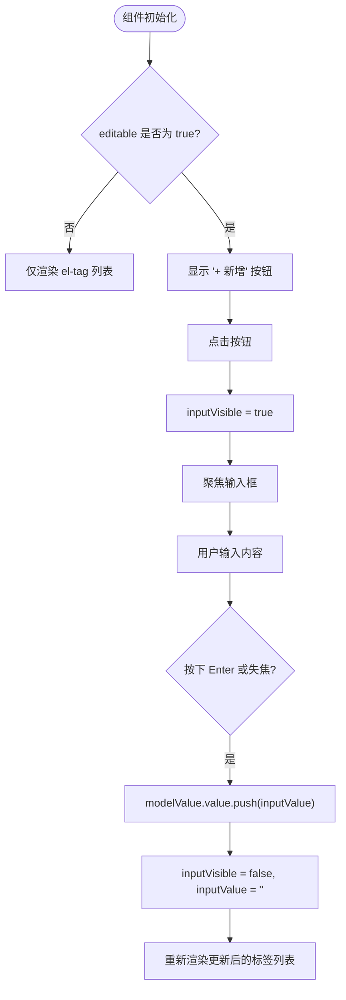

# 数组控制器 (arrayCtrl)

<cite>
**本文档中引用的文件**  
- [arrayCtrl.vue](file://web/src/components/arrayCtrl/arrayCtrl.vue)
- [sysParams.vue](file://web/src/view/superAdmin/params/sysParams.vue)
- [sysDictionaryDetail.vue](file://web/src/view/superAdmin/dictionary/sysDictionaryDetail.vue)
- [template_funcs.go](file://server/utils/autocode/template_funcs.go)
</cite>

## 目录
1. [简介](#简介)
2. [核心功能与设计原理](#核心功能与设计原理)
3. [双向绑定机制详解](#双向绑定机制详解)
4. [实际应用场景分析](#实际应用场景分析)
5. [嵌套表单控件支持](#嵌套表单控件支持)
6. [自定义插槽扩展能力](#自定义插槽扩展能力)
7. [验证规则集成（Element Plus Form）](#验证规则集成element-plus-form)
8. [性能优化建议](#性能优化建议)
9. [结论](#结论)

## 简介
`arrayCtrl` 是 gin-vue-admin 框架中的一个关键 UI 组件，专为处理动态数组型表单项而设计。它广泛应用于需要对参数配置、字典项等可变长度数据进行增删改操作的复杂场景。该组件通过 `v-model` 实现与父级表单数据的双向绑定，提供直观的标签式交互界面，并支持添加、删除和排序等基本操作。

其主要优势在于简洁的 API 设计、良好的可复用性以及与框架其他部分（如自动代码生成系统）的高度集成。在 `sysParams` 参数设置和 `sysDictionaryDetail` 字典明细管理等功能模块中均有实际应用。

**Section sources**
- [arrayCtrl.vue](file://web/src/components/arrayCtrl/arrayCtrl.vue#L1-L66)

## 核心功能与设计原理
`arrayCtrl` 组件的核心功能是可视化地管理字符串数组，允许用户以标签形式查看现有项，并通过按钮或输入框新增条目。其设计遵循 Vue 3 的 Composition API 和 `<script setup>` 语法糖，具备清晰的响应式逻辑结构。

组件采用 `flex` 布局将所有标签水平排列，并使用 `el-tag` 显示每个数组元素。当 `editable` 属性为真时，提供“+ 新增”按钮触发输入模式，在此模式下会渲染一个 `el-input` 输入框供用户输入新值。输入完成后按 Enter 键或失去焦点即可提交并关闭输入框。

整个组件的状态由三个响应式变量控制：
- `modelValue`: 通过 `defineModel()` 接收外部绑定的数组
- `inputVisible`: 控制是否显示输入框
- `inputValue`: 存储当前输入框中的临时文本



**Diagram sources**
- [arrayCtrl.vue](file://web/src/components/arrayCtrl/arrayCtrl.vue#L1-L66)

**Section sources**
- [arrayCtrl.vue](file://web/src/components/arrayCtrl/arrayCtrl.vue#L1-L66)

## 双向绑定机制详解
`arrayCtrl` 通过 Vue 3 的 `defineModel()` 宏实现标准的 `v-model` 双向绑定。这使得父组件可以像使用原生 input 一样直接绑定一个数组变量：

```vue
<ArrayCtrl v-model="myArray" :editable="true" />
```

内部实现上，`modelValue` 是一个响应式引用（ref），任何对其 `.value` 的修改都会同步到父组件。例如：
- **删除操作**：调用 `handleClose(tag)` 方法时，使用 `splice()` 从 `modelValue.value` 中移除指定元素。
- **新增操作**：调用 `handleInputConfirm()` 时，使用 `push()` 将 `inputValue` 添加至 `modelValue.value`。

这种设计确保了数据流的一致性和可预测性，符合 Vue 的响应式原则。

值得注意的是，由于直接修改数组原型方法（如 `push`, `splice`）会触发 Vue 的依赖追踪，因此无需额外调用 `$emit('update:modelValue')`，`defineModel()` 已自动处理了更新通知。

**Section sources**
- [arrayCtrl.vue](file://web/src/components/arrayCtrl/arrayCtrl.vue#L1-L66)

## 实际应用场景分析
### sysParams 参数配置
在 `sysParams.vue` 中，虽然未直接展示 `arrayCtrl` 的使用，但根据后端模板生成逻辑（见 `template_funcs.go`），当某个字段类型为 `"array"` 时，系统会自动生成包含 `ArrayCtrl` 的详情查看区域。这意味着对于存储 JSON 数组格式的参数值，前端可通过 `arrayCtrl` 进行可视化展示。

例如，若某参数键为 `allowed_ips`，其值为 `["192.168.1.1", "10.0.0.5"]`，则在查看详情时将呈现为两个可关闭的标签。

### sysDictionaryDetail 字典明细管理
尽管 `sysDictionaryDetail.vue` 当前实现为独立表格维护字典项，但从架构角度看，`arrayCtrl` 可作为替代方案用于轻量级字典编辑场景。例如在一个表单中需要让用户选择多个预设标签时，可用 `arrayCtrl` 动态管理这些选中项。

此外，结合 JSON Schema 动态渲染能力，可在运行时根据 schema 定义决定是否启用 `arrayCtrl` 来编辑特定字段，从而实现高度灵活的表单构造。

```mermaid
classDiagram
class ArrayCtrl {
+modelValue : string[]
+editable : boolean
-inputVisible : boolean
-inputValue : string
+handleClose(tag : string) : void
+showInput() : void
+handleInputConfirm() : void
}
class SysParamsView {
+formData : { name, key, value, desc }
+detailForm : Object
+getDetails(row) : Promise~void~
}
class SysDictionaryDetailView {
+formData : { label, value, status, sort }
+props : { sysDictionaryID }
+getTableData() : Promise~void~
}
SysParamsView ..> ArrayCtrl : 使用 v-model 绑定 value 字段若为数组
SysDictionaryDetailView ..> ArrayCtrl : 可选嵌入用于多选编辑
```

**Diagram sources**
- [arrayCtrl.vue](file://web/src/components/arrayCtrl/arrayCtrl.vue#L1-L66)
- [sysParams.vue](file://web/src/view/superAdmin/params/sysParams.vue#L1-L604)
- [sysDictionaryDetail.vue](file://web/src/view/superAdmin/dictionary/sysDictionaryDetail.vue#L1-L321)
- [template_funcs.go](file://server/utils/autocode/template_funcs.go#L593-L627)

**Section sources**
- [sysParams.vue](file://web/src/view/superAdmin/params/sysParams.vue#L1-L604)
- [sysDictionaryDetail.vue](file://web/src/view/superAdmin/dictionary/sysDictionaryDetail.vue#L1-L321)
- [template_funcs.go](file://server/utils/autocode/template_funcs.go#L593-L627)

## 嵌套表单控件支持
目前 `arrayCtrl` 主要用于管理字符串数组，但其设计理念支持扩展以容纳更复杂的嵌套结构。通过自定义插槽（slot）机制，可将任意子表单控件嵌入每个数组项中。

例如，设想一个“联系人列表”场景，每项不仅包含姓名，还包含电话和邮箱。此时可通过以下方式扩展：
```vue
<ArrayCtrl v-model="contacts">
  <template #item="{ item, index }">
    <el-form-item label="姓名">
      <el-input v-model="item.name" />
    </el-form-item>
    <el-form-item label="电话">
      <el-input v-model="item.phone" />
    </el-input>
    <el-form-item label="邮箱">
      <el-input v-model="item.email" />
    </el-input>
  </template>
</ArrayCtrl>
```

虽然当前版本尚未实现此功能，但基于 Vue 的插槽系统，这是完全可行的技术路径，未来可通过升级组件支持此类高级用例。

**Section sources**
- [arrayCtrl.vue](file://web/src/components/arrayCtrl/arrayCtrl.vue#L1-L66)

## 自定义插槽扩展能力
`arrayCtrl` 当前版本虽未显式暴露插槽接口，但从其模板结构来看，具备良好的扩展潜力。通过引入具名插槽（如 `#tag` 或 `#input`），开发者可完全自定义标签外观或输入控件样式。

典型扩展场景包括：
- 使用不同颜色或图标的 `el-tag` 表示不同类型的数据项
- 替换默认输入框为下拉选择器（`el-select`）以限制输入选项
- 添加拖拽手柄以支持手动排序（配合 `sortablejs`）

建议未来的迭代版本增加如下插槽支持：
```vue
<template #tag="{ tag, index }">
  <el-tag closable @close="handleClose(tag)">
    <el-icon><User /></el-icon>{{ tag }}
  </el-tag>
</template>
```

这将进一步提升组件的灵活性和适用范围。

**Section sources**
- [arrayCtrl.vue](file://web/src/components/arrayCtrl/arrayCtrl.vue#L1-L66)

## 验证规则集成（Element Plus Form）
`arrayCtrl` 可无缝集成至 Element Plus 的 `el-form` 表单体系中，参与统一的表单验证流程。只要将其置于 `el-form-item` 内，并为其绑定的数组字段配置适当的校验规则即可。

例如，在 `sysParams` 表单中，若 `value` 字段预期为非空数组，则可定义如下规则：
```js
const rule = reactive({
  value: [
    {
      validator: (rule, value, callback) => {
        if (!value || value.length === 0) {
          callback(new Error('至少需要一个值'))
        } else {
          callback()
        }
      },
      trigger: 'change'
    }
  ]
})
```

由于 `arrayCtrl` 正确实现了 `v-model` 协议，`el-form-item` 能够监听其变化事件并触发验证，确保数据完整性。

**Section sources**
- [sysParams.vue](file://web/src/view/superAdmin/params/sysParams.vue#L1-L604)

## 性能优化建议
为避免频繁的响应式操作影响性能，特别是在处理大型数组时，建议采取以下措施：

1. **批量操作优化**：避免逐个 `push` 元素，应先构建完整数组再一次性赋值：
   ```js
   // ❌ 不推荐
   items.value.push(item1)
   items.value.push(item2)

   // ✅ 推荐
   items.value = [...items.value, item1, item2]
   ```

2. **虚拟滚动（Virtual Scrolling）**：当数组长度超过一定阈值（如 100 项），应考虑使用 `el-scrollbar` 结合虚拟滚动技术，仅渲染可视区域内的标签，减少 DOM 节点数量。

3. **防抖输入**：对于可能触发远程查询的输入场景，应对 `handleInputConfirm` 添加防抖处理，防止高频请求。

4. **Key 管理**：确保 `v-for` 中的 `:key` 具有唯一性和稳定性。当前使用 `tag` 作为 key 在字符串重复时可能导致异常行为，建议改用索引或唯一 ID。

5. **惰性加载**：在大数据场景下，可结合分页或懒加载策略，仅在用户展开时加载全部数据。

**Section sources**
- [arrayCtrl.vue](file://web/src/components/arrayCtrl/arrayCtrl.vue#L1-L66)

## 结论
`arrayCtrl` 组件作为 gin-vue-admin 框架中处理动态数组输入的核心工具，凭借简洁的设计和高效的双向绑定机制，有效支撑了诸如参数配置、字典管理等复杂业务场景。其与自动代码生成系统的深度集成进一步提升了开发效率。

尽管当前功能集中于字符串数组管理，但其架构具备良好的扩展性，未来可通过引入自定义插槽、嵌套表单支持和性能优化机制，演变为更强大的复合型表单控件。