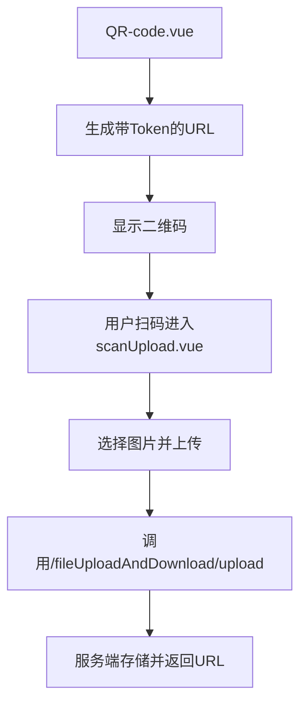
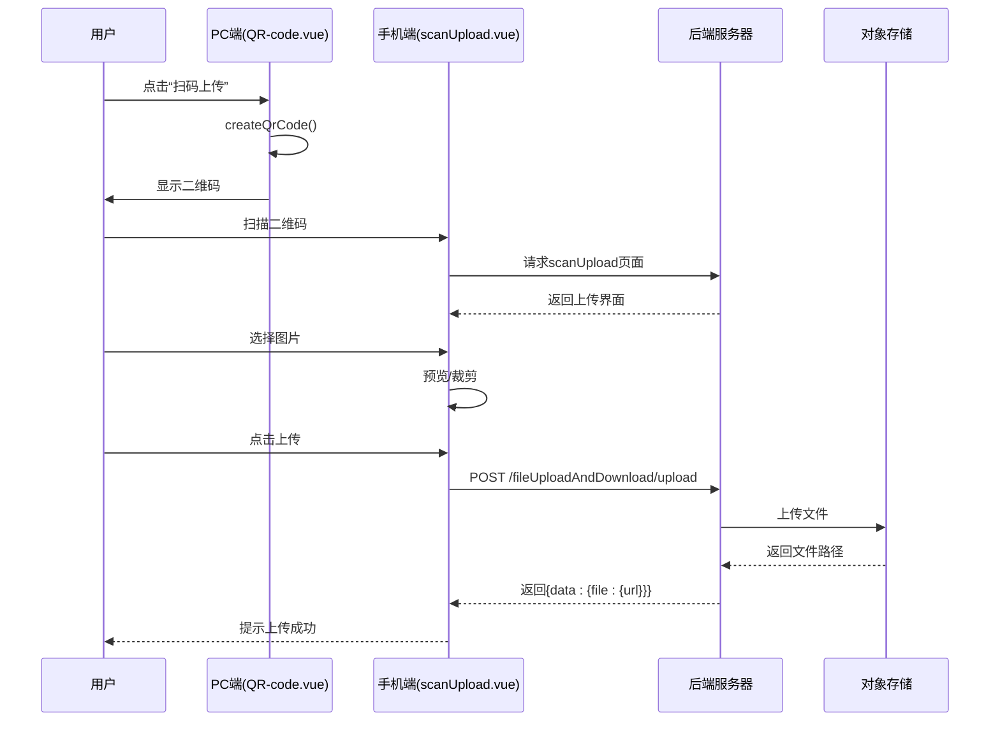
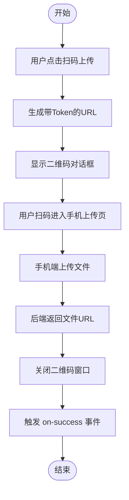

# 二维码上传组件 (QR-code.vue)

<cite>
**本文档引用文件**  
- [QR-code.vue](file://web/src/components/upload/QR-code.vue)
- [common.vue](file://web/src/components/upload/common.vue)
- [scanUpload.vue](file://web/src/view/example/upload/scanUpload.vue)
- [exa_file_upload_download.go](file://server/api/v1/example/exa_file_upload_download.go)
- [exa_file_upload_download.go](file://server/service/example/exa_file_upload_download.go)
</cite>

## 目录
1. [简介](#简介)
2. [项目结构](#项目结构)
3. [核心组件](#核心组件)
4. [架构概览](#架构概览)
5. [详细组件分析](#详细组件分析)
6. [依赖分析](#依赖分析)
7. [性能考量](#性能考量)
8. [故障排查指南](#故障排查指南)
9. [结论](#结论)

## 简介
本组件 `QR-code.vue` 是一个专为扫码上传设计的前端功能模块，其特殊用途在于生成动态二维码后引导用户跳转至移动端上传页面。该组件并未直接使用 `qrcode.js` 或 `canvas.toDataURL()` 将二维码转换为 Blob 并注入上传队列，而是通过生成包含身份令牌和类别的唯一 URL 二维码，实现跨设备文件上传流程。此机制广泛应用于营销活动、电子凭证分发等业务场景中，支持自定义参数如颜色与容错率，并通过后端接口验证上传结果。

## 项目结构
该组件位于前端 `web/src/components/upload/` 目录下，与 `common.vue` 共同构成上传体系的核心部分。配套的接收页面 `scanUpload.vue` 存在于示例模块中，负责实际的图像选择与上传操作。后端 API 接口由 `exa_file_upload_download.go` 提供支持，完成文件持久化及路径返回。



**Diagram sources**
- [QR-code.vue](file://web/src/components/upload/QR-code.vue#L1-L65)
- [scanUpload.vue](file://web/src/view/example/upload/scanUpload.vue#L1-L245)
- [exa_file_upload_download.go](file://server/api/v1/example/exa_file_upload_download.go#L1-L136)

**Section sources**
- [QR-code.vue](file://web/src/components/upload/QR-code.vue#L1-L65)
- [scanUpload.vue](file://web/src/view/example/upload/scanUpload.vue#L1-L245)

## 核心组件

`QR-code.vue` 的主要职责是构建一个可扫描的二维码链接，该链接指向 `/scanUpload` 页面并携带 `classId` 和用户 `token` 参数，确保上传权限安全可控。点击“扫码上传”按钮后弹出对话框展示二维码，用户使用手机浏览器或微信等应用扫码即可进入上传界面。

**Section sources**
- [QR-code.vue](file://web/src/components/upload/QR-code.vue#L1-L65)

## 架构概览

整个“生成→下载→上传”流程采用前后端分离设计：
1. 前端生成含认证信息的专属上传链接；
2. 用户扫码后在移动设备打开上传页；
3. 移动端完成图片选取、预览、裁剪（可选）后提交；
4. 后端接收文件并通过配置的 OSS（如本地、七牛云等）进行存储；
5. 成功后返回文件访问 URL，可用于后续展示或分享。



**Diagram sources**
- [QR-code.vue](file://web/src/components/upload/QR-code.vue#L1-L65)
- [scanUpload.vue](file://web/src/view/example/upload/scanUpload.vue#L1-L245)
- [exa_file_upload_download.go](file://server/api/v1/example/exa_file_upload_download.go#L1-L136)

## 详细组件分析

### QR-code.vue 分析
该组件利用 `vue-qr` 库渲染二维码，内容为拼接后的完整 URL，包括协议、主机、路由、classId、token 及时间戳以防止缓存。二维码样式可通过属性配置，如深色点阵为绿色、背景白色、自动适配颜色等。

#### 用户交互设计
- **按钮状态切换**：点击“扫码上传”即显示二维码模态框，关闭即重置。
- **防重复提交控制**：未显式锁定按钮，但每次生成新时间戳保证链接唯一性，避免并发冲突。
- **完成回调**：点击“完成上传”仅关闭弹窗并触发 `on-success` 事件，具体逻辑由父组件决定。



**Diagram sources**
- [QR-code.vue](file://web/src/components/upload/QR-code.vue#L1-L65)

**Section sources**
- [QR-code.vue](file://web/src/components/upload/QR-code.vue#L1-L65)

### scanUpload.vue 分析
作为二维码跳转的目标页，`scanUpload.vue` 使用 `el-upload` 组件结合 `VueCropper` 实现图片上传与裁剪功能。它从 URL 参数提取 `classId` 和 `token`，用于上传时的身份验证和分类归属。

- 支持 JPG/PNG/SVG/WebP 图像格式；
- 文件大小限制为 8MB；
- 提供旋转、缩放、裁剪等编辑能力；
- 上传前检查 MIME 类型与尺寸。

**Section sources**
- [scanUpload.vue](file://web/src/view/example/upload/scanUpload.vue#L1-L245)

### common.vue 分析
作为普通上传入口，`common.vue` 提供基础的多文件上传功能，使用 Element Plus 的 `el-upload` 组件对接 `/fileUploadAndDownload/upload` 接口，附带 `classId` 和 `x-token` 认证头。

- 限制单图不超过 500KB，视频不超过 5MB；
- 自动检测媒体类型；
- 失败提示与加载状态反馈完善。

**Section sources**
- [common.vue](file://web/src/components/upload/common.vue#L1-L90)

## 依赖分析

前端依赖关系清晰：
- `QR-code.vue` → `vue-qr`（二维码生成）
- `scanUpload.vue` → `vue-cropper`（图片裁剪）
- 所有上传组件 → `useUserStore`（获取 token）
- 调用统一上传接口 `/fileUploadAndDownload/upload`

后端依赖：
- `FileUploadAndDownloadApi.UploadFile` 处理上传请求；
- `upload.NewOss()` 根据配置决定存储方式（本地、MinIO、七牛等）；
- 数据库记录文件元信息（名称、路径、标签、classId）。

```mermaid
graph LR
A[QR-code.vue] --> B[vue-qr]
C[scanUpload.vue] --> D[vue-cropper]
A & C & E[common.vue] --> F[useUserStore]
A --> G[/scanUpload]
C & E --> H[/fileUploadAndDownload/upload]
H --> I[FileUploadAndDownloadApi]
I --> J[OSS Service]
J --> K[Local/MinIO/Qiniu/etc.]
I --> L[MySQL/PostgreSQL]
```

**Diagram sources**
- [QR-code.vue](file://web/src/components/upload/QR-code.vue#L1-L65)
- [common.vue](file://web/src/components/upload/common.vue#L1-L90)
- [scanUpload.vue](file://web/src/view/example/upload/scanUpload.vue#L1-L245)
- [exa_file_upload_download.go](file://server/api/v1/example/exa_file_upload_download.go#L1-L136)
- [exa_file_upload_download.go](file://server/service/example/exa_file_upload_download.go#L1-L123)

**Section sources**
- [exa_file_upload_download.go](file://server/api/v1/example/exa_file_upload_download.go#L1-L136)
- [exa_file_upload_download.go](file://server/service/example/exa_file_upload_download.go#L1-L123)

## 性能考量
- 二维码生成轻量，不影响主进程；
- 移动端上传支持裁剪压缩，减少传输体积；
- 后端使用异步写入与对象存储解耦，提升响应速度；
- 前端上传校验前置，降低无效请求对服务的压力。

## 故障排查指南
常见问题及解决方案：

| 问题现象 | 可能原因 | 解决方法 |
|--------|--------|--------|
| 二维码无法扫码 | URL 过长或包含非法字符 | 检查 `codeUrl` 拼接逻辑，确保 URL 编码正确 |
| 扫码后页面空白 | 路由未注册或 token 失效 | 确认 `/scanUpload` 路由存在且 token 有效 |
| 上传失败提示“接收文件失败” | 后端未收到文件或 header 错误 | 检查 `multipart/form-data` 格式是否正确 |
| 上传成功但无记录 | `noSave=1` 导致未入库 | 确保上传时不附加 `noSave=1` 参数 |
| 文件访问 404 | OSS 配置错误或路径不匹配 | 检查 `filePath` 返回值与实际存储位置一致性 |

**Section sources**
- [exa_file_upload_download.go](file://server/api/v1/example/exa_file_upload_download.go#L1-L136)
- [exa_file_upload_download.go](file://server/service/example/exa