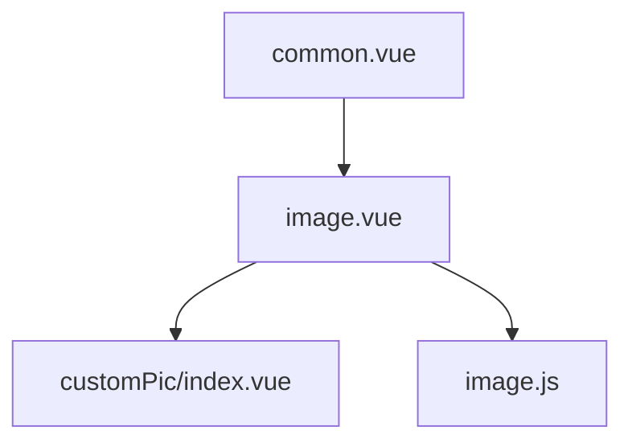
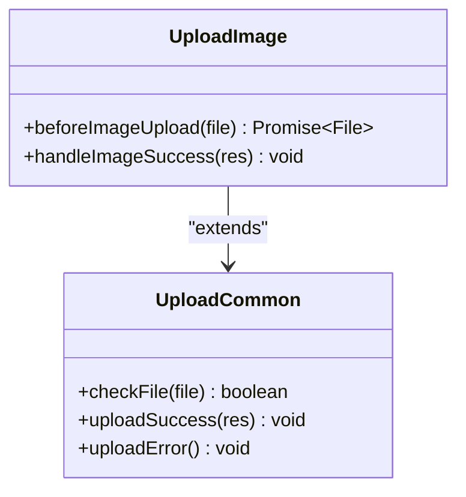
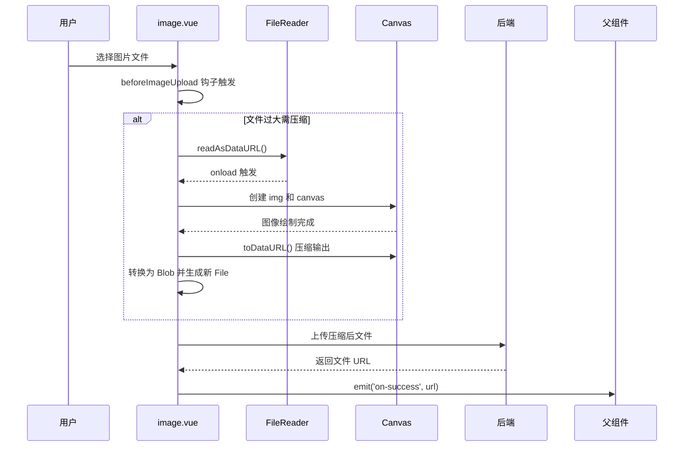

# 图片上传组件 (image.vue)

<cite>
**本文档引用文件**  
- [image.vue](file://web/src/components/upload/image.vue)
- [common.vue](file://web/src/components/upload/common.vue)
- [upload.vue](file://web/src/view/example/upload/upload.vue)
- [image.js](file://web/src/utils/image.js)
- [index.vue](file://web/src/components/customPic/index.vue)
</cite>

## 目录
1. [简介](#简介)
2. [项目结构](#项目结构)
3. [核心组件](#核心组件)
4. [架构概览](#架构概览)
5. [详细组件分析](#详细组件分析)
6. [依赖分析](#依赖分析)
7. [性能考虑](#性能考虑)
8. [故障排除指南](#故障排除指南)
9. [结论](#结论)

## 简介
`image.vue` 是基于 `common.vue` 扩展的专用图片上传组件，支持图片预览、多图上传与排序、缩略图展示，并集成删除确认对话框。该组件通过监听上传成功事件动态更新图片列表，结合实际用例说明如何配置 `accept='image/*'` 限制输入类型，并处理后端返回的图片路径用于回显。同时支持图片尺寸校验及与 `cropper.vue` 的协作。

## 项目结构
本组件位于前端代码库中的上传模块，作为通用上传功能的特化版本，专注于图像资源管理。



**Diagram sources**
- [common.vue](file://web/src/components/upload/common.vue#L1-L90)
- [image.vue](file://web/src/components/upload/image.vue#L1-L102)
- [index.vue](file://web/src/components/customPic/index.vue#L1-L90)
- [image.js](file://web/src/utils/image.js#L1-L126)

**Section sources**
- [image.vue](file://web/src/components/upload/image.vue#L1-L102)
- [common.vue](file://web/src/components/upload/common.vue#L1-L90)

## 核心组件

`image.vue` 组件继承自 `common.vue`，扩展了针对图片上传的功能，包括压缩上传、格式校验和尺寸控制。它利用 `FileReader` 和 `canvas` 实现客户端图片压缩，并通过 `URL.createObjectURL` 提供本地预览能力。

**Section sources**
- [image.vue](file://web/src/components/upload/image.vue#L1-L102)
- [common.vue](file://web/src/components/upload/common.vue#L1-L90)

## 架构概览

整体架构以 Element Plus 的 `el-upload` 组件为基础，封装为可复用的 Vue 组件。`common.vue` 提供基础文件上传逻辑，`image.vue` 在此基础上增加图片专属逻辑。



**Diagram sources**
- [common.vue](file://web/src/components/upload/common.vue#L1-L90)
- [image.vue](file://web/src/components/upload/image.vue#L1-L102)

## 详细组件分析

### image.vue 分析

`image.vue` 是一个专门用于图片上传的 Vue 组件，其主要职责是实现图片压缩上传、格式验证以及成功后的 URL 回显。

#### 图片预览与压缩机制
组件使用 `FileReader` 将选中图片读取为 Data URL，并借助 `canvas` 进行等比缩放和质量压缩。当图片超过设定大小（默认 2MB）或分辨率（默认 1920px）时自动触发压缩流程。



**Diagram sources**
- [image.vue](file://web/src/components/upload/image.vue#L45-L75)
- [image.js](file://web/src/utils/image.js#L1-L91)

#### 多图上传与排序支持
虽然当前 `image.vue` 设置为单文件上传（`:multiple="false"`），但可通过修改配置支持多图上传。排序功能由外部组件维护，上传成功后通过 `onSuccess` 回调刷新列表即可实现顺序更新。

#### 缩略图展示逻辑
缩略图展示由 `customPic/index.vue` 组件完成。`upload.vue` 示例页面中通过 `<CustomPic pic-type="file" :pic-src="scope.row.url" preview/>` 实现带预览功能的缩略图渲染。

**Section sources**
- [image.vue](file://web/src/components/upload/image.vue#L1-L102)
- [image.js](file://web/src/utils/image.js#L1-L91)
- [index.vue](file://web/src/components/customPic/index.vue#L1-L90)

### 与 cropper.vue 协作可能性
`image.vue` 可与 `cropper.vue` 协同工作：用户先上传原始图片，再进入裁剪界面进行编辑。裁剪完成后调用相同上传接口提交最终结果，实现“上传 → 裁剪 → 提交”完整流程。

## 依赖分析

组件间存在明确的依赖关系，`image.vue` 依赖于 `common.vue` 的上传基础设施，并使用工具类进行图片处理。

```mermaid
dependency-graph
graph TD
A[image.vue] --> B[common.vue]
A --> C[image.js]
A --> D[customPic/index.vue]
B --> E[Element Plus Upload]
C --> F[canvas API]
D --> G[el-image preview]
```

**Diagram sources**
- [image.vue](file://web/src/components/upload/image.vue#L1-L102)
- [common.vue](file://web/src/components/upload/common.vue#L1-L90)
- [image.js](file://web/src/utils/image.js#L1-L126)
- [index.vue](file://web/src/components/customPic/index.vue#L1-L90)

**Section sources**
- [image.vue](file://web/src/components/upload/image.vue#L1-L102)
- [common.vue](file://web/src/components/upload/common.vue#L1-L90)
- [image.js](file://web/src/utils/image.js#L1-L126)

## 性能考虑

- **客户端压缩减轻服务器压力**：通过 `ImageCompress` 类在浏览器端完成图片压缩，减少网络传输体积和服务器存储负担。
- **内存使用优化**：使用 `FileReader` + `canvas` 流式处理大图，避免直接加载高分辨率图像导致内存溢出。
- **异步处理不阻塞 UI**：所有图片操作均在 Promise 中执行，确保界面响应性。

## 故障排除指南

常见问题及其解决方案：

| 问题现象 | 可能原因 | 解决方案 |
|--------|--------|--------|
| 上传失败提示格式错误 | 文件非 JPG/PNG | 检查是否仅允许 `.jpg` 或 `.png` |
| 图片未压缩 | 尺寸小于阈值 | 调整 `fileSize` 属性值 |
| 预览空白 | URL 未正确拼接 | 检查 `VITE_BASE_API` 环境变量配置 |
| 删除无反应 | 未触发 `getCategories()` | 确保删除成功后刷新数据 |

**Section sources**
- [image.vue](file://web/src/components/upload/image.vue#L45-L75)
- [upload.vue](file://web/src/view/example/upload/upload.vue#L1-L448)
- [image.js](file://web/src/utils/image.js#L1-L126)

## 结论

`image.vue` 成功基于 `common.vue` 扩展出完整的图片上传能力，具备格式校验、自动压缩、预览回显等关键特性。结合 `customPic` 组件实现美观的缩略图展示，并可通过事件机制灵活集成至各类业务场景。未来可进一步增强对 WebP 支持、EXIF 信息保留等功能，提升用户体验。