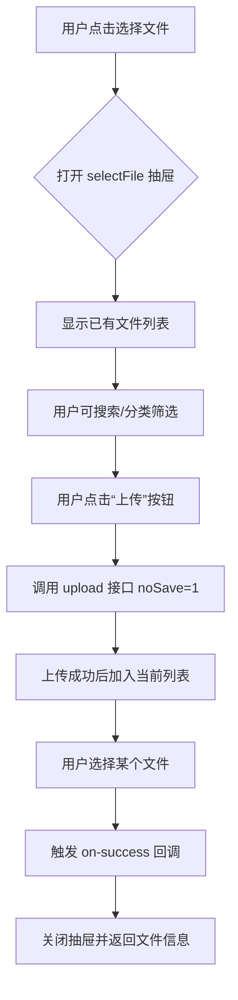
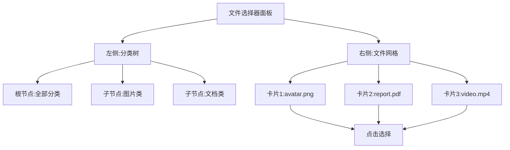

# 文件选择器 (selectFile)

<cite>
**本文档引用的文件**
- [selectFile.vue](file://web/src/components/selectFile/selectFile.vue)
- [selectImage.vue](file://web/src/components/selectImage/selectImage.vue)
- [attachmentCategory.js](file://web/src/api/attachmentCategory.js)
- [exa_attachment_category.go](file://server/api/v1/example/exa_attachment_category.go)
- [sys_operation_record.go](file://server/api/v1/system/sys_operation_record.go)
</cite>

## 目录
1. [简介](#简介)
2. [核心功能与定位](#核心功能与定位)
3. [与上传组件的区别](#与上传组件的区别)
4. [文件类型过滤机制](#文件类型过滤机制)
5. [列表展示与交互样式](#列表展示与交互样式)
6. [选择回调机制](#选择回调机制)
7. [业务场景应用](#业务场景应用)
8. [表单集成示例](#表单集成示例)
9. [数据关联方式](#数据关联方式)
10. [权限控制实现思路](#权限控制实现思路)

## 简介

`selectFile` 组件是 `gin-vue-admin` 框架中用于从已有文件库中选择文件的前端组件,其主要职责在于“二次引用”而非“上传行为”。该组件适用于需要在表单中关联已上传附件、文档等资源的业务场景,如公告发布、工单系统、内容管理系统等。

通过调用后端提供的文件列表接口,`selectFile` 能够渲染出可浏览和选择的文件集合,并支持分类筛选、分页加载等功能。它与直接负责上传操作的 `upload` 组件形成互补关系,共同构建完整的文件管理能力。

**Section sources**
- [selectFile.vue](file://web/src/components/selectFile/selectFile.vue)

## 核心功能与定位

`selectFile` 组件的核心功能是提供一个用户界面,允许用户从服务器上已存在的文件中进行选择,并将所选文件的信息(通常是 URL 和名称)回传给父组件或绑定模型。其设计初衷是为了避免重复上传相同文件,提升资源复用率。

该组件通常以模态框或抽屉形式弹出,内部集成了文件列表展示、搜索、分类导航以及上传新文件的功能入口。用户可以在不离开当前页面的情况下完成文件的选择操作。

相较于传统的 `<input type="file">` 或简单的上传按钮,`selectFile` 更强调对“已有资源”的管理和利用,体现了从“创建”到“引用”的功能演进。

**Section sources**
- [selectFile.vue](file://web/src/components/selectFile/selectFile.vue)
- [selectImage.vue](file://web/src/components/selectImage/selectImage.vue)

## 与上传组件的区别

| 特性 | `selectFile` 组件 | `upload` 组件 |
|------|------------------|---------------|
| **主要目的** | 引用已有文件 | 执行文件上传 |
| **触发动作** | 浏览并选择 | 上传新文件 |
| **是否保存记录** | 不直接保存(仅引用) | 默认保存至数据库 |
| **API 调用** | `/fileUploadAndDownload/getFileList` | `/fileUploadAndDownload/upload` |
| **使用场景** | 表单附件关联、文档引用 | 新增文件、头像设置 |

值得注意的是,在 `selectFile` 的模板中虽然也包含了 `<el-upload>` 元素,但其 `action` 地址带有 `noSave=1` 参数,表明此处的上传仅用于临时预览或即时添加,不会持久化存储元数据,真正的作用仍是为用户提供“即时上传 + 立即选择”的流畅体验。



**Diagram sources**
- [selectFile.vue](file://web/src/components/selectFile/selectFile.vue)

**Section sources**
- [selectFile.vue](file://web/src/components/selectFile/selectFile.vue)
- [common.vue](file://web/src/components/upload/common.vue)

## 文件类型过滤机制

`selectFile` 组件本身未直接实现复杂的文件类型过滤逻辑,而是依赖于其兄弟组件 `selectImage` 的实现模式来推断通用机制。实际项目中,可通过 `accept` 属性或 `fileType` 参数控制允许选择的文件类型。

例如,在 `selectImage.vue` 中定义了 `imageTypeList` 和 `videoTypeList`,并在 `chooseImg` 函数中根据 `props.fileType` 进行校验:

```js
const listObj = {
  image: imageTypeList,
  video: videoTypeList
}

const chooseImg = (url) => {
  if (props.fileType) {
    const typeSuccess = listObj[props.fileType].some(item => 
      url?.toLowerCase().includes(item)
    )
    if (!typeSuccess) {
      ElMessage.error('当前类型不支持使用')
      return
    }
  }
  model.value = url
  drawer.value = false
}
```

因此,`selectFile` 可通过类似方式扩展以支持按 MIME 类型或扩展名过滤,确保只能选择符合要求的文件。

**Section sources**
- [selectImage.vue](file://web/src/components/selectImage/selectImage.vue)

## 列表展示与交互样式

`selectFile` 组件采用 Element Plus 的 `el-upload` 组件作为基础容器,结合 `el-drawer` 或内联布局实现文件列表的展示。文件以缩略图卡片形式排列,每项包含:

- 文件缩略图(图片类)
- 文件名(自动省略超出部分)
- 删除图标(hover 显示)
- 分页控件(支持翻页)

用户可以通过点击卡片选择文件,多选模式下支持拖拽排序(借助 `vuedraggable`)。此外,还提供了分类树形导航(`el-tree`),便于按目录结构查找文件。

分类数据来源于 `exa_attachment_category` 模块,通过 `getCategoryList` API 获取层级结构,并在前端递归渲染。



**Diagram sources**
- [selectImage.vue](file://web/src/components/selectImage/selectImage.vue)

**Section sources**
- [selectImage.vue](file://web/src/components/selectImage/selectImage.vue)

## 选择回调机制

`selectFile` 使用 Vue 3 的 `defineModel` 实现双向绑定,当用户选择文件后,会自动更新绑定的 `v-model` 值。同时,通过 `emits` 触发 `on-success` 事件,通知父组件选择已完成。

关键代码逻辑如下:

```js
const model = defineModel({ type: Array })
const fileList = ref(model.value || [])

const uploadSuccess = (res) => {
  const { data, code } = res
  if (code !== 0) {
    // 错误处理
    return
  }
  model.value.push({
    name: data.file.name,
    url: data.file.url
  })
  emits('on-success', res)
}
```

对于单选情况,可将 `model.value` 设为字符串；多选则为数组。回调函数可用于进一步处理选中的文件路径,如提交表单、预览内容等。

**Section sources**
- [selectFile.vue](file://web/src/components/selectFile/selectFile.vue)

## 业务场景应用

### 1. 附件管理
在发布公告、创建工单、撰写文章等场景中,常需附加多个文件。`selectFile` 提供统一入口,让用户从历史上传中挑选所需附件,减少重复上传负担。

### 2. 文档关联
在审批流程、合同管理系统中,不同阶段可能需要引用同一份原始文档。通过 `selectFile`,各环节人员均可快速定位并引用该文件,保证一致性。

### 3. 富文本编辑器集成
与 `RichEdit` 组件结合,允许用户在编辑内容时插入已有图片或下载链接,提升编辑效率。

### 4. 用户资料补充
在个人中心或员工