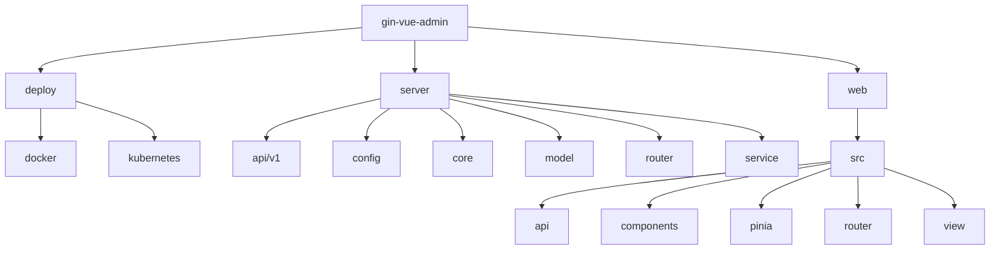
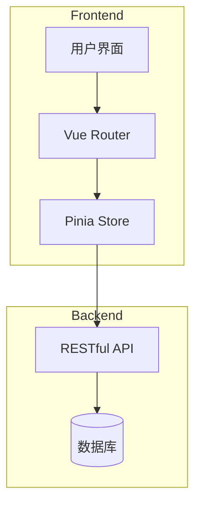
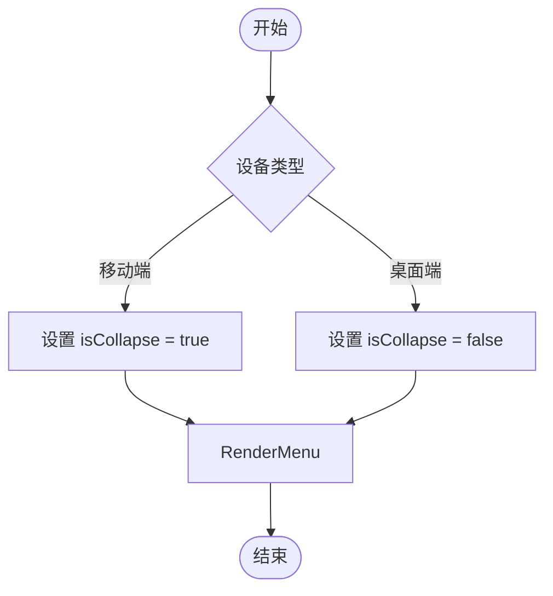
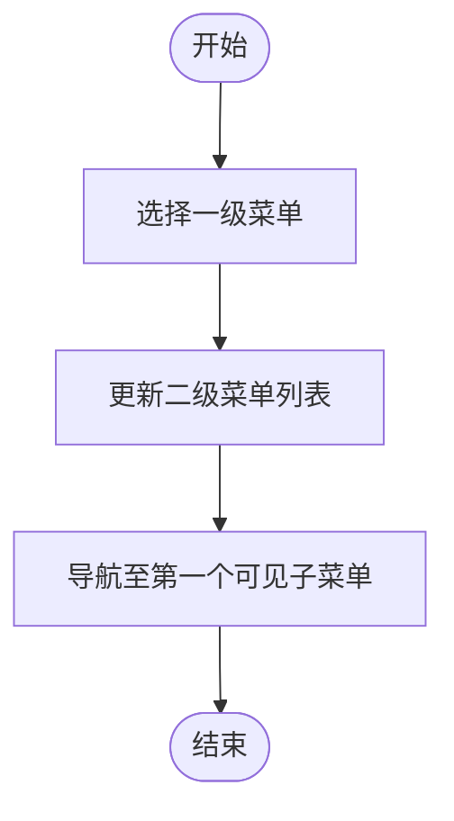
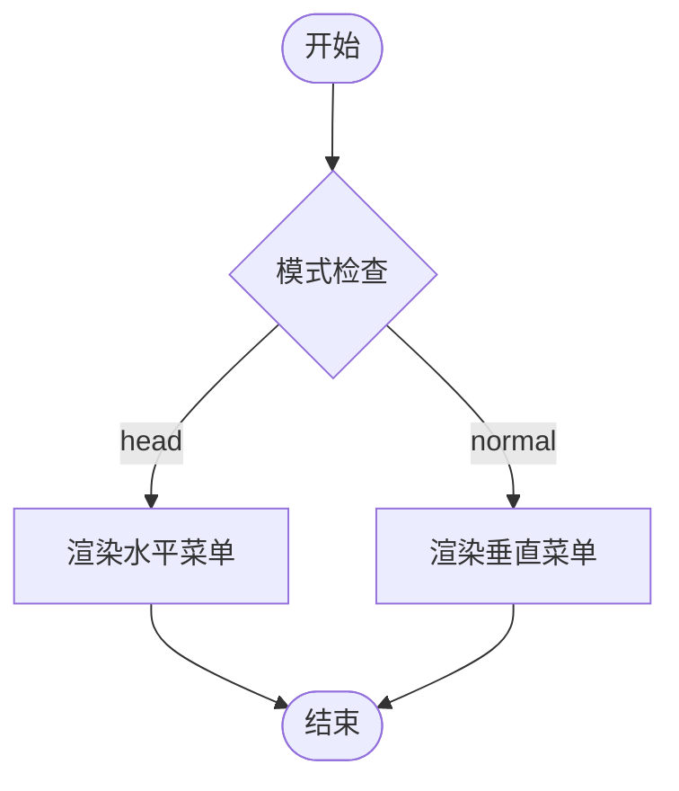
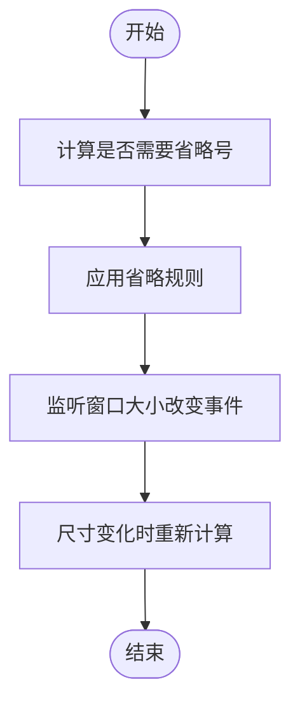
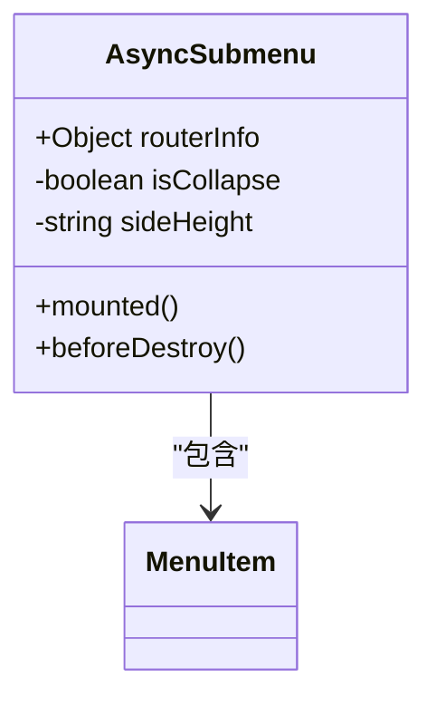
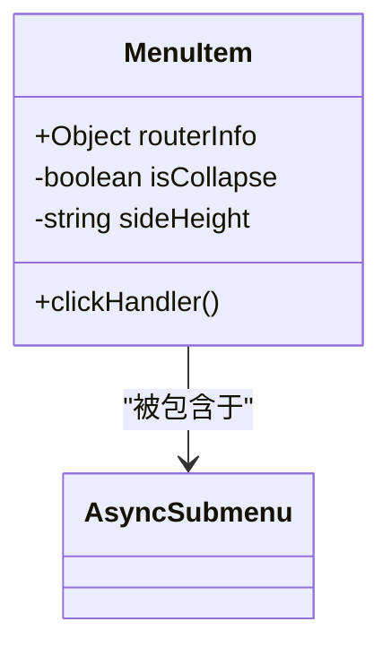

# 侧边栏组件

<cite>
**本文档中引用的文件**
- [asyncSubmenu.vue](file://web/src/view/layout/aside/asideComponent/asyncSubmenu.vue)
- [menuItem.vue](file://web/src/view/layout/aside/asideComponent/menuItem.vue)
- [normalMode.vue](file://web/src/view/layout/aside/normalMode.vue)
- [sidebarMode.vue](file://web/src/view/layout/aside/sidebarMode.vue)
- [combinationMode.vue](file://web/src/view/layout/aside/combinationMode.vue)
- [headMode.vue](file://web/src/view/layout/aside/headMode.vue)
- [app.js](file://web/src/pinia/modules/app.js)
- [router.js](file://web/src/pinia/modules/router.js)
</cite>

## 目录
1. [简介](#简介)
2. [项目结构](#项目结构)
3. [核心组件](#核心组件)
4. [架构概述](#架构概述)
5. [详细组件分析](#详细组件分析)
6. [依赖分析](#依赖分析)
7. [性能考虑](#性能考虑)
8. [故障排除指南](#故障排除指南)
9. [结论](#结论)

## 简介
本项目是一个基于 Gin 和 Vue 的前后端分离管理系统，名为 gin-vue-admin。它提供了一套完整的后台管理解决方案，包括用户权限管理、菜单配置、系统监控等功能。前端使用 Vue 3 和 Pinia 进行状态管理，后端采用 Go 语言开发，支持多种数据库和部署方式。

## 项目结构
该项目分为 `server` 和 `web` 两个主要部分，分别对应后端服务和前端界面。此外还包括部署相关的 Docker 和 Kubernetes 配置文件。



**Diagram sources**
- [project_structure](file://project_structure)

**Section sources**
- [project_structure](file://project_structure)

## 核心组件
侧边栏布局组件是该系统的重要组成部分之一，负责展示导航菜单并支持多种显示模式。这些模式通过 Vuex/Pinia 状态驱动，并结合 CSS 类名实现动态切换。

**Section sources**
- [asyncSubmenu.vue](file://web/src/view/layout/aside/asideComponent/asyncSubmenu.vue)
- [menuItem.vue](file://web/src/view/layout/aside/asideComponent/menuItem.vue)
- [normalMode.vue](file://web/src/view/layout/aside/normalMode.vue)
- [sidebarMode.vue](file://web/src/view/layout/aside/sidebarMode.vue)
- [combinationMode.vue](file://web/src/view/layout/aside/combinationMode.vue)
- [headMode.vue](file://web/src/view/layout/aside/headMode.vue)

## 架构概述
系统的整体架构采用了典型的前后端分离设计，前端通过 API 调用与后端进行数据交互。前端页面由多个可复用的组件构成，其中侧边栏组件根据不同的模式（normalMode、sidebarMode、combinationMode、headMode）来调整其布局和行为。



**Diagram sources**
- [main.go](file://server/main.go#L1-L20)
- [router.js](file://web/src/router/index.js#L1-L30)

## 详细组件分析
### 经典模式 (normalMode)
经典模式是最常见的侧边栏布局，左侧固定宽度的菜单栏可以展开或收起。这种模式适用于大多数桌面应用场景。

#### 实现机制
- 使用 `el-menu` 组件构建菜单结构。
- 通过 `isCollapse` 变量控制菜单是否折叠。
- 利用 `computed` 属性动态计算侧边栏宽度。



**Diagram sources**
- [normalMode.vue](file://web/src/view/layout/aside/normalMode.vue#L1-L120)

**Section sources**
- [normalMode.vue](file://web/src/view/layout/aside/normalMode.vue#L1-L120)

### 侧栏模式 (sidebarMode)
侧栏模式将一级菜单常驻在较窄的侧边栏中，二级菜单则并列显示在其右侧。这种方式提高了空间利用率，适合需要频繁切换顶级分类的应用场景。

#### 实现机制
- 一级菜单始终处于折叠状态。
- 当选择某个一级菜单时，其子菜单会在相邻区域显示。
- 通过监听路由变化自动更新当前激活的一级菜单项。



**Diagram sources**
- [sidebarMode.vue](file://web/src/view/layout/aside/sidebarMode.vue#L1-L300)

**Section sources**
- [sidebarMode.vue](file://web/src/view/layout/aside/sidebarMode.vue#L1-L300)

### 组合模式 (combinationMode)
组合模式结合了顶部水平菜单和左侧垂直菜单的优点，在不同条件下分别显示相应的菜单区域。当 `mode` 为 'head' 时仅显示顶部菜单；为 'normal' 时则恢复传统的左侧菜单。

#### 实现机制
- 根据传入的 `mode` 参数决定渲染哪个部分。
- 顶部菜单使用 `mode="horizontal"` 的 `el-menu`。
- 左侧菜单保持原有的垂直布局逻辑。



**Diagram sources**
- [combinationMode.vue](file://web/src/view/layout/aside/combinationMode.vue#L1-L146)

**Section sources**
- [combinationMode.vue](file://web/src/view/layout/aside/combinationMode.vue#L1-L146)

### 顶部模式 (headMode)
顶部模式完全移除了左侧菜单，所有导航选项都集中在页面上方的水平菜单栏内。此模式特别适合内容密集型应用或者希望最大化主要内容区域的情况。

#### 实现机制
- 移除所有关于左侧菜单的 DOM 元素。
- 将原本属于左侧菜单的所有条目迁移到顶部 `el-menu` 中。
- 添加响应式处理以确保小屏幕上也能正常工作。



**Diagram sources**
- [headMode.vue](file://web/src/view/layout/aside/headMode.vue#L1-L139)

**Section sources**
- [headMode.vue](file://web/src/view/layout/aside/headMode.vue#L1-L139)

### asyncSubmenu.vue 和 menuItem.vue 分析
这两个组件共同构成了递归渲染动态菜单的基础单元。它们能够支持多级嵌套以及权限过滤功能。

#### asyncSubmenu.vue
用于表示含有子菜单的父级菜单项。它接收一个包含路由信息的对象作为属性，并据此生成对应的 UI 元素。

##### 特性
- 支持图标显示（通过 `routerInfo.meta.icon`）
- 文字标题绑定（通过 `routerInfo.meta.title`）
- 动态高度设置（利用 `sideHeight` 计算属性）



**Diagram sources**
- [asyncSubmenu.vue](file://web/src/view/layout/aside/asideComponent/asyncSubmenu.vue#L1-L66)

**Section sources**
- [asyncSubmenu.vue](file://web/src/view/layout/aside/asideComponent/asyncSubmenu.vue#L1-L66)

#### menuItem.vue
代表单个可点击的菜单项，通常位于叶子节点位置。同样也具备图标和文字展示能力。

##### 特性
- 条件性地显示首字母缩写（仅在折叠状态下）
- 完整标题始终可用（作为工具提示或其他形式呈现）



**Diagram sources**
- [menuItem.vue](file://web/src/view/layout/aside/asideComponent/menuItem.vue#L1-L49)

**Section sources**
- [menuItem.vue](file://web/src/view/layout/aside/asideComponent/menuItem.vue#L1-L49)

## 依赖分析
整个侧边栏组件体系依赖于以下几个关键模块：
- **Pinia Store**: 提供全局状态管理，特别是 `appStore` 和 `routerStore` 对应的主题配置和路由信息。
- **Vue Router**: 处理页面间的跳转逻辑。
- **Element Plus**: UI 框架，提供了诸如 `el-menu`, `el-sub-menu`, `el-menu-item` 等基础组件。

```mermaid
dependency-graph
AppStore --> SideBarComponent
RouterStore --> SideBarComponent
VueRouter --> SideBarComponent
ElementPlus --> SideBarComponent
```

**Diagram sources**
- [app.js](file://web/src/pinia/modules/app.js#L5-L154)
- [router.js](file://web/src/pinia/modules/router.js#L49-L182)

**Section sources**
- [app.js](file://web/src/pinia/modules/app.js#L5-L154)
- [router.js](file://web/src/pinia/modules/router.js#L49-L182)

## 性能考虑
为了保证良好的用户体验，开发者需要注意以下几点：
- 减少不必要的重绘操作，例如合理使用 `v-if` 和 `v-show`。
- 对长列表进行虚拟滚动优化。
- 避免在循环内部执行复杂计算或 DOM 查询。

## 故障排除指南
遇到问题时，请按照以下步骤排查：
1. 确认相关组件是否正确导入且没有拼写错误。
2. 检查 Pinia store 中的状态值是否按预期更新。
3. 查看浏览器控制台是否有 JavaScript 错误报告。
4. 审核网络请求日志，确认 API 返回的数据格式符合要求。

**Section sources**
- [errors.go](file://server/model/response/common.go#L10-L50)
- [debug.go](file://server/utils/logger.go#L15-L40)

## 结论
通过对侧边栏组件的深入解析，我们了解到了如何利用现代前端技术栈实现灵活多变的导航布局。无论是简单的线性排列还是复杂的分层结构，都可以通过合理的组件设计和状态管理轻松达成目标。未来还可以进一步探索更多创新性的交互方式，提升产品的易用性和美观度。