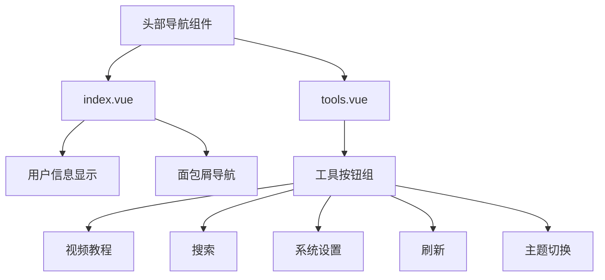
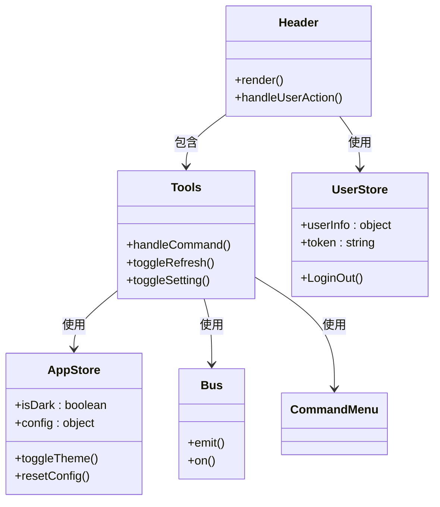
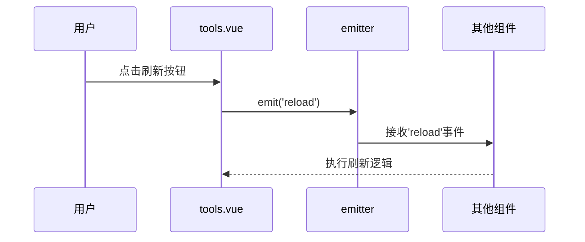
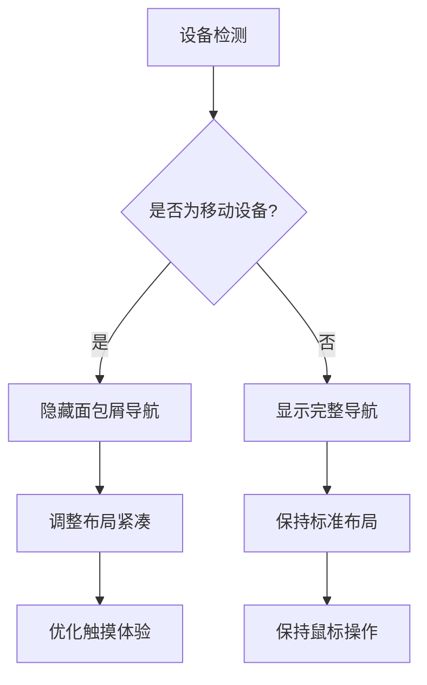
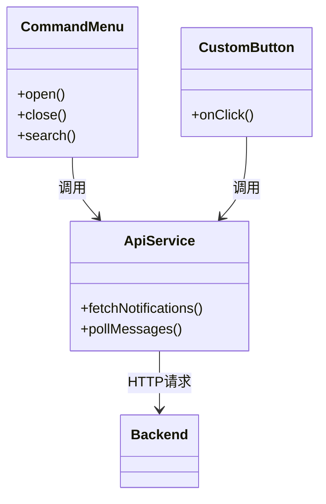

# 头部导航组件

<cite>
**本文档引用的文件**
- [header.vue](file://web/src/view/layout/header/index.vue)
- [tools.vue](file://web/src/view/layout/header/tools.vue)
- [app.js](file://web/src/pinia/modules/app.js)
- [user.js](file://web/src/pinia/modules/user.js)
- [router.js](file://web/src/pinia/modules/router.js)
- [setting/index.vue](file://web/src/view/layout/setting/index.vue)
- [bus.js](file://web/src/utils/bus.js)
- [commandMenu/index.vue](file://web/src/components/commandMenu/index.vue)
</cite>

## 目录
1. [简介](#简介)
2. [项目结构](#项目结构)
3. [核心组件](#核心组件)
4. [架构概述](#架构概述)
5. [详细组件分析](#详细组件分析)
6. [依赖分析](#依赖分析)
7. [性能考虑](#性能考虑)
8. [故障排除指南](#故障排除指南)
9. [结论](#结论)

## 简介
头部导航组件是 gin-vue-admin 系统的核心交互区域，集成了系统Logo、搜索框、国际化切换、通知中心、用户头像下拉菜单等关键功能。该组件通过 Pinia 状态管理实现主题设置、全屏切换、锁屏等工具功能的状态同步，并采用响应式设计适配不同屏幕尺寸。在窄屏模式下，组件会自动隐藏非关键元素并激活移动端菜单入口，确保用户体验的一致性。

## 项目结构
头部导航组件位于 `web/src/view/layout/header/` 目录下，主要由两个核心文件构成：`index.vue` 负责整体布局和用户信息展示，`tools.vue` 管理各类工具按钮。组件与 Pinia 状态管理模块紧密集成，通过 `appStore` 管理应用配置，`userStore` 管理用户状态，并利用事件总线 `bus.js` 实现跨组件通信。



**Diagram sources**
- [header.vue](file://web/src/view/layout/header/index.vue)
- [tools.vue](file://web/src/view/layout/header/tools.vue)

**Section sources**
- [header.vue](file://web/src/view/layout/header/index.vue)
- [tools.vue](file://web/src/view/layout/header/tools.vue)

## 核心组件
头部导航组件的核心功能包括系统Logo展示、面包屑导航、用户信息下拉菜单和工具栏。系统Logo点击可返回首页，面包屑导航显示当前页面路径（在侧边栏模式下），用户信息区域包含头像、昵称和角色信息，并提供个人信息查看和登出功能。工具栏集成多个实用功能，如视频教程指引、全局搜索、系统设置、页面刷新和主题切换。

**Section sources**
- [header.vue](file://web/src/view/layout/header/index.vue)
- [tools.vue](file://web/src/view/layout/header/tools.vue)

## 架构概述
头部导航组件采用 Vue 3 的 Composition API 设计，通过 Pinia 实现状态管理，利用 Element Plus 组件库构建 UI。组件间通信通过 mitt 事件总线实现，确保了松耦合的设计。响应式适配通过监测设备类型变量实现，在移动设备上自动调整布局，隐藏次要元素。



**Diagram sources**
- [header.vue](file://web/src/view/layout/header/index.vue)
- [tools.vue](file://web/src/view/layout/header/tools.vue)
- [app.js](file://web/src/pinia/modules/app.js)
- [user.js](file://web/src/pinia/modules/user.js)
- [bus.js](file://web/src/utils/bus.js)

## 详细组件分析

### 工具组件分析
工具组件 `tools.vue` 集成了多个实用功能，每个功能都通过清晰的事件处理机制与系统其他部分交互。组件使用 Pinia 状态管理来同步应用状态，确保状态变更在整个应用中保持一致。

#### 事件通信机制
工具组件通过 mitt 事件总线实现跨组件通信。例如，当用户点击刷新按钮时，组件触发 `reload` 事件，该事件被其他监听组件捕获并执行相应操作。这种设计模式实现了组件间的松耦合，提高了代码的可维护性和可测试性。



**Diagram sources**
- [tools.vue](file://web/src/view/layout/header/tools.vue)
- [bus.js](file://web/src/utils/bus.js)

#### Pinia 状态同步策略
工具组件通过 Pinia 实现状态同步。组件导入 `useAppStore` 并创建 store 实例，通过调用 store 提供的方法来修改应用状态。例如，主题切换功能通过调用 `appStore.toggleTheme()` 方法来改变应用的暗色模式状态，该状态变更会自动反映在所有使用该状态的组件中。

```mermaid
flowchart TD
A[用户操作] --> B{判断操作类型}
B --> |主题切换| C[调用appStore.toggleTheme()]
B --> |系统设置| D[打开设置抽屉]
B --> |刷新| E[触发reload事件]
B --> |搜索| F[打开命令菜单]
C --> G[更新Pinia状态]
G --> H[自动同步到所有组件]
D --> I[显示设置界面]
E --> J[通知其他组件刷新]
F --> K[显示搜索对话框]
```

**Diagram sources**
- [tools.vue](file://web/src/view/layout/header/tools.vue)
- [app.js](file://web/src/pinia/modules/app.js)
- [setting/index.vue](file://web/src/view/layout/setting/index.vue)
- [commandMenu/index.vue](file://web/src/components/commandMenu/index.vue)

**Section sources**
- [tools.vue](file://web/src/view/layout/header/tools.vue)
- [app.js](file://web/src/pinia/modules/app.js)

### 响应式适配方案
头部导航组件采用响应式设计，能够根据屏幕尺寸自动调整布局。通过 `device` 状态变量检测设备类型，在移动设备上隐藏面包屑导航等非关键元素，并调整菜单显示方式。



**Diagram sources**
- [header.vue](file://web/src/view/layout/header/index.vue)
- [app.js](file://web/src/pinia/modules/app.js)

**Section sources**
- [header.vue](file://web/src/view/layout/header/index.vue)

### 自定义扩展机制
系统提供了灵活的扩展机制，允许开发者添加自定义操作按钮并与后端 API 联动。通过命令菜单组件，可以集成消息提醒轮询等高级功能。



**Diagram sources**
- [commandMenu/index.vue](file://web/src/components/commandMenu/index.vue)
- [api.js](file://web/src/api/user.js)

## 依赖分析
头部导航组件依赖于多个核心模块，包括 Pinia 状态管理、Element Plus UI 组件库、Vue Router 路由系统和自定义工具函数。这些依赖关系通过 ES6 模块导入机制管理，确保了代码的模块化和可维护性。

```mermaid
dependency-graph
"header.vue" --> "tools.vue"
"header.vue" --> "pinia/modules/user.js"
"header.vue" --> "pinia/modules/app.js"
"tools.vue" --> "pinia/modules/app.js"
"tools.vue" --> "utils/bus.js"
"tools.vue" --> "components/commandMenu/index.vue"
"setting/index.vue" --> "pinia/modules/app.js"
"commandMenu/index.vue" --> "pinia/modules/router.js"
"commandMenu/index.vue" --> "pinia/modules/user.js"
```

**Diagram sources**
- [go.mod](file://server/go.mod)
- [package.json](file://web/package.json)

**Section sources**
- [header.vue](file://web/src/view/layout/header/index.vue)
- [tools.vue](file://web/src/view/layout/header/tools.vue)
- [app.js](file://web/src/pinia/modules/app.js)
- [user.js](file://web/src/pinia/modules/user.js)
- [router.js](file://web/src/pinia/modules/router.js)

## 性能考虑
头部导航组件在设计时充分考虑了性能因素。通过 Pinia 的响应式系统，仅在状态变更时触发必要的重新渲染。事件总线的使用避免了深层组件树的 prop 传递，减少了不必要的组件更新。此外，组件采用了懒加载策略，仅在需要时才加载相关功能模块。

## 故障排除指南
当头部导航组件出现异常时，可按照以下步骤进行排查：
1. 检查 Pinia store 是否正确初始化
2. 验证事件总线连接是否正常
3. 确认组件间的依赖关系是否正确导入
4. 检查响应式变量的更新逻辑
5. 验证 API 调用是否成功

**Section sources**
- [tools.vue](file://web/src/view/layout/header/tools.vue)
- [bus.js](file://web/src/utils/bus.js)
- [app.js](file://web/src/pinia/modules/app.js)

## 结论
头部导航组件作为 gin-vue-admin 系统的重要组成部分，通过合理的架构设计和状态管理，实现了丰富的功能和良好的用户体验。组件的模块化设计和清晰的依赖关系使其易于维护和扩展，响应式适配确保了在不同设备上的良好表现。通过深入理解组件的内部机制，开发者可以更好地利用其功能并进行定制化开发。