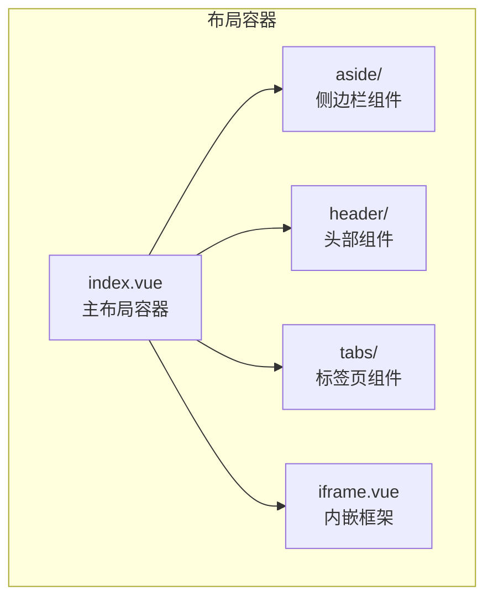
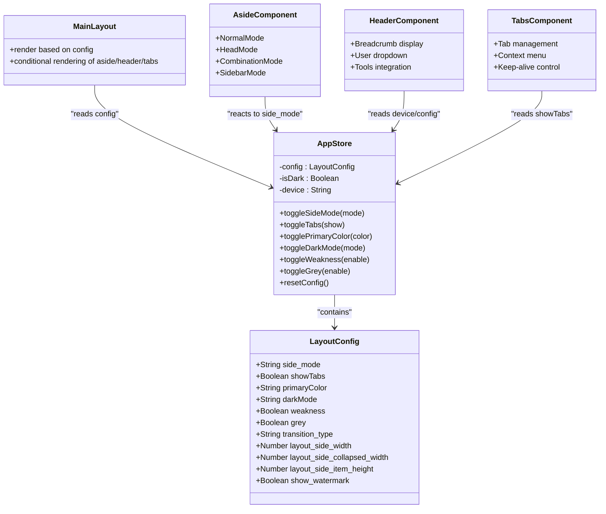
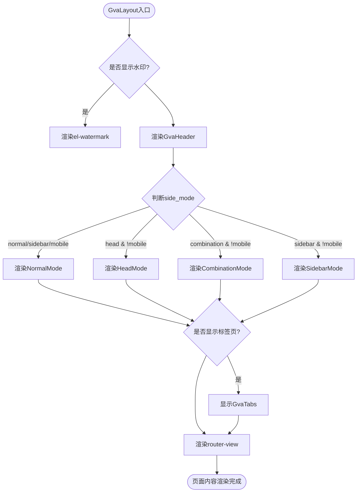
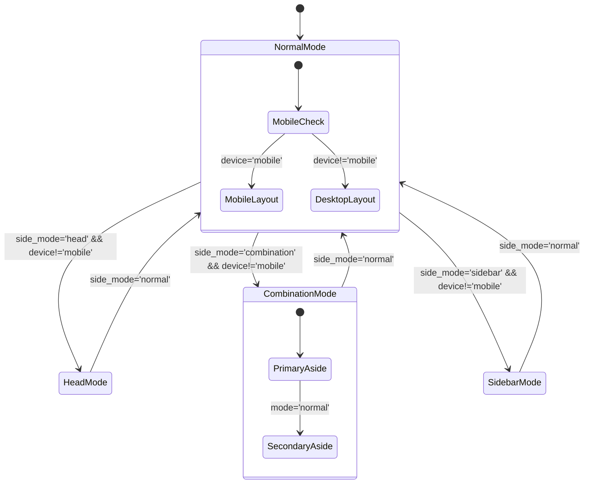
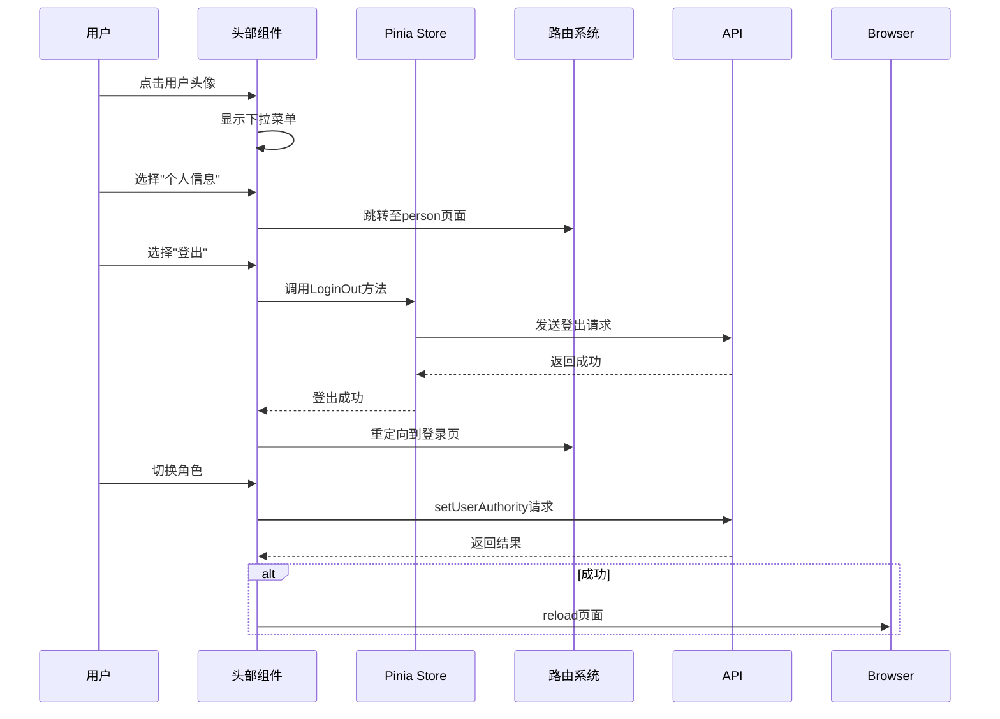
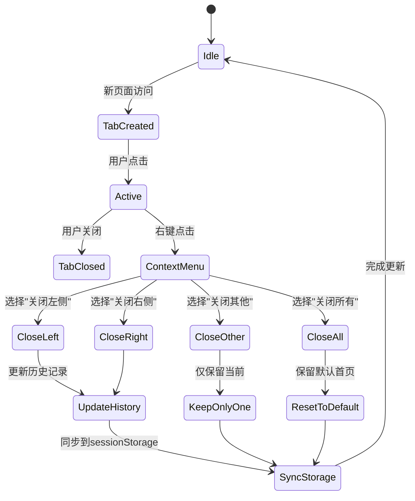

# 布局组件

<cite>
**本文档引用文件**  
- [index.vue](file://web/src/view/layout/index.vue)
- [aside/index.vue](file://web/src/view/layout/aside/index.vue)
- [header/index.vue](file://web/src/view/layout/header/index.vue)
- [tabs/index.vue](file://web/src/view/layout/tabs/index.vue)
- [iframe.vue](file://web/src/view/layout/iframe.vue)
- [app.js](file://web/src/pinia/modules/app.js)
- [main.scss](file://web/src/style/main.scss)
- [index.scss](file://web/src/style/element/index.scss)
- [layoutModeCard.vue](file://web/src/view/layout/setting/components/layoutModeCard.vue)
</cite>

## 目录
1. [简介](#简介)
2. [项目结构](#项目结构)
3. [核心组件](#核心组件)
4. [架构概述](#架构概述)
5. [详细组件分析](#详细组件分析)
6. [依赖分析](#依赖分析)
7. [性能考虑](#性能考虑)
8. [故障排除指南](#故障排除指南)
9. [结论](#结论)

## 简介
本系统采用模块化布局设计，通过组合式组件实现灵活的界面配置。整体布局由侧边栏（aside）、头部导航（header）、标签页（tabs）、iframe容器及主布局容器构成，支持多种显示模式切换，并通过Pinia状态管理实现动态主题与响应式控制。

## 项目结构
系统前端布局相关组件集中于`web/src/view/layout`目录下，形成完整的UI容器体系。各组件按功能划分，通过条件渲染机制实现多模式切换。



**Diagram sources**
- [index.vue](file://web/src/view/layout/index.vue#L1-L115)
- [aside/index.vue](file://web/src/view/layout/aside/index.vue#L1-L40)
- [header/index.vue](file://web/src/view/layout/header/index.vue#L1-L141)
- [tabs/index.vue](file://web/src/view/layout/tabs/index.vue#L1-L426)
- [iframe.vue](file://web/src/view/layout/iframe.vue#L1-L74)

**Section sources**
- [index.vue](file://web/src/view/layout/index.vue#L1-L115)

## 核心组件
系统布局体系包含五大核心组件：主容器、侧边栏、头部、标签页和iframe容器。这些组件协同工作，构建出可配置的企业级管理后台界面。

**Section sources**
- [index.vue](file://web/src/view/layout/index.vue#L1-L115)
- [aside/index.vue](file://web/src/view/layout/aside/index.vue#L1-L40)
- [header/index.vue](file://web/src/view/layout/header/index.vue#L1-L141)
- [tabs/index.vue](file://web/src/view/layout/tabs/index.vue#L1-L426)
- [iframe.vue](file://web/src/view/layout/iframe.vue#L1-L74)

## 架构概述
系统采用基于Vue 3 + Pinia的状态驱动布局架构，通过中央store统一管理界面配置，实现组件间的解耦与数据同步。



**Diagram sources**
- [app.js](file://web/src/pinia/modules/app.js#L5-L154)
- [index.vue](file://web/src/view/layout/index.vue#L1-L115)

## 详细组件分析

### 主布局容器分析
主布局容器作为整个应用的根组件，负责协调各个子组件的显示逻辑，并根据设备类型和用户配置进行自适应调整。

#### 组件关系图


**Diagram sources**
- [index.vue](file://web/src/view/layout/index.vue#L1-L115)

**Section sources**
- [index.vue](file://web/src/view/layout/index.vue#L1-L115)

### 侧边栏组件分析
侧边栏组件根据不同的布局模式提供四种显示方式：经典模式、顶部模式、混合模式和侧栏常驻模式，满足多样化的导航需求。

#### 多模式切换逻辑


**Diagram sources**
- [aside/index.vue](file://web/src/view/layout/aside/index.vue#L1-L40)

**Section sources**
- [aside/index.vue](file://web/src/view/layout/aside/index.vue#L1-L40)

### 头部导航组件分析
头部组件不仅提供品牌标识和路由跳转功能，还集成了面包屑导航、工具栏和用户信息下拉菜单，增强用户体验。

#### 用户交互流程


**Diagram sources**
- [header/index.vue](file://web/src/view/layout/header/index.vue#L1-L141)

**Section sources**
- [header/index.vue](file://web/src/view/layout/header/index.vue#L1-L141)

### 标签页组件分析
标签页组件实现了完整的多标签页管理功能，包括标签创建、关闭、右键菜单操作以及会话持久化等高级特性。

#### 标签管理状态机


**Diagram sources**
- [tabs/index.vue](file://web/src/view/layout/tabs/index.vue#L1-L426)

**Section sources**
- [tabs/index.vue](file://web/src/view/layout/tabs/index.vue#L1-L426)

### iframe容器分析
iframe容器用于嵌入外部网页内容，支持URL参数传递和页面刷新机制，确保内嵌内容的安全性和可用性。

#### 内容加载流程
```mermaid
flowchart TD
    A([Iframe组件挂载]) --> B{是否存在url参数?}
    B -->|是| C[使用query.url作为源地址]
    B -->|否| D[使用默认官网地址]
    C --> E[创建iframe元素]
    D --> E
    E --> F[监听reload事件]
    F --> G{是否需要重新加载?}
    G -->|是| H[触发reloadFlag变化]
    G -->|否| I[保持现有内容]
    H --> J[销毁并重建iframe]
    J --> K[完成重新加载]
    I --> L[加载