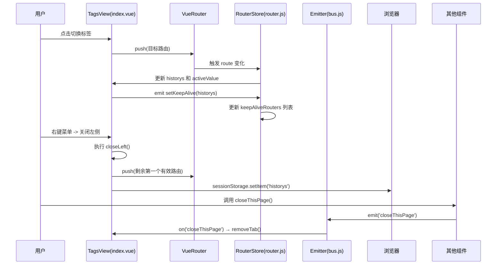
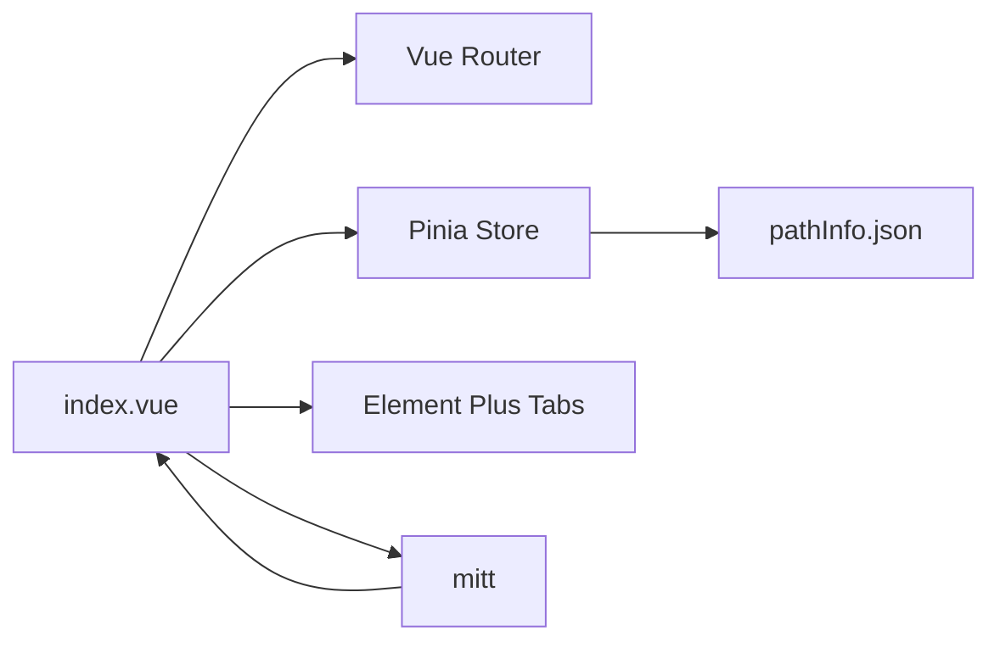

# 标签页组件

<cite>
**本文档中引用的文件**
- [index.vue](file://web/src/view/layout/tabs/index.vue)
- [router.js](file://web/src/pinia/modules/router.js)
- [pathInfo.json](file://web/src/pathInfo.json)
- [fmtRouterTitle.js](file://web/src/utils/fmtRouterTitle.js)
- [bus.js](file://web/src/utils/bus.js)
- [closeThisPage.js](file://web/src/utils/closeThisPage.js)
</cite>

## 目录
1. [简介](#简介)
2. [项目结构](#项目结构)
3. [核心组件](#核心组件)
4. [架构概述](#架构概述)
5. [详细组件分析](#详细组件分析)
6. [依赖分析](#依赖分析)
7. [性能考虑](#性能考虑)
8. [故障排除指南](#故障排除指南)
9. [结论](#结论)

## 简介
本文件详细阐述了多标签页(Tags View)组件的设计原理与用户体验优化策略。该组件基于路由历史记录动态生成可关闭标签,支持点击切换、拖拽排序、右键菜单操作等交互功能。通过缓存机制(keep-alive)与路由key的映射关系,避免重复加载页面实例。同时,针对标签溢出情况提供了滑动交互与“更多”下拉菜单处理逻辑,并实现了清除缓存、批量关闭、固定标签等高级功能。

## 项目结构
标签页组件位于前端项目的布局模块中,作为主界面的一部分,负责管理用户访问过的页面历史记录并提供便捷的导航方式。

```mermaid
graph TB
subgraph "前端 (web)"
Layout["layout/"]
Tabs["tabs/index.vue"]
Pinia["pinia/modules/router.js"]
Utils["utils/"]
PathInfo["pathInfo.json"]
end
Tabs --> Pinia : "监听 setKeepAlive 事件"
Pinia --> PathInfo : "获取组件名称映射"
Utils --> Tabs : "提供 fmtTitle 工具函数"
Utils --> Bus : "全局事件通信"
```

**Diagram sources**
- [index.vue](file://web/src/view/layout/tabs/index.vue)
- [router.js](file://web/src/pinia/modules/router.js)
- [pathInfo.json](file://web/src/pathInfo.json)
- [fmtRouterTitle.js](file://web/src/utils/fmtRouterTitle.js)
- [bus.js](file://web/src/utils/bus.js)

**Section sources**
- [index.vue](file://web/src/view/layout/tabs/index.vue)
- [router.js](file://web/src/pinia/modules/router.js)

## 核心组件
多标签页组件的核心在于维护一个路由历史栈(`historys`),并通过 `el-tabs` 组件渲染为可视化的标签列表。每个标签对应一个唯一的路由状态,包括名称、查询参数和路径参数,确保即使同一页面不同参数也能独立存在。

组件通过监听当前路由变化自动更新历史记录,并利用 `sessionStorage` 持久化存储,实现刷新后恢复上次会话的功能。此外,通过 `mitt` 实现的事件总线(`emitter`)进行跨组件通信,如触发关闭当前页、切换标签等操作。

**Section sources**
- [index.vue](file://web/src/view/layout/tabs/index.vue)
- [router.js](file://web/src/pinia/modules/router.js)
- [closeThisPage.js](file://web/src/utils/closeThisPage.js)

## 架构概述
整个标签页系统的运行依赖于多个模块协同工作:路由模块负责解析和跳转；Pinia 状态管理模块维护 keep-alive 缓存列表；工具模块提供格式化标题、事件通信等功能。



**Diagram sources**
- [index.vue](file://web/src/view/layout/tabs/index.vue)
- [router.js](file://web/src/pinia/modules/router.js)
- [bus.js](file://web/src/utils/bus.js)

## 详细组件分析

### 多标签页组件分析
该组件实现了完整的标签生命周期管理,包括添加、切换、关闭、持久化等功能。

#### 动态标签生成与唯一性识别
系统通过组合 `route.name`、`query` 和 `params` 生成唯一键值,防止相同页面因参数不同而冲突:

```js
const getFmtString = (item) => {
  return item.name + JSON.stringify(item.query) + JSON.stringify(item.params)
}
```

此方法确保即使两个页面使用相同的路由名称,只要查询或路径参数不同,就会被视为不同的标签。

**Section sources**
- [index.vue](file://web/src/view/layout/tabs/index.vue)

#### 缓存机制与 keep-alive 映射关系
为了提升性能,所有在标签页中打开的页面均被加入 `keep-alive` 缓存。这一过程由 `setKeepAliveRouters` 函数完成,其逻辑如下:

1. 从原始配置 `keepAliveRoutersArr` 中继承预设缓存项；
2. 遍历当前 `historys`,根据 `routeMap` 查找对应路由信息,并通过 `pathInfo.json` 获取实际组件名；
3. 若子路由被打开,则父级路由也需加入缓存(通过 `nameMap` 映射)；
4. 去重后赋值给 `keepAliveRouters.value`,驱动 `<keep-alive include>` 更新。

```js
const setKeepAliveRouters = (history) => {
  const keepArrTemp = []
  keepArrTemp.push(...keepAliveRoutersArr)
  
  history.forEach((item) => {
    const routeInfo = routeMap[item.name]
    if (routeInfo && routeInfo.meta && routeInfo.meta.path) {
      const componentName = pathInfo[routeInfo.meta.path]
      if (componentName) {
        keepArrTemp.push(componentName)
      }
    }
    if (nameMap[item.name]) {
      keepArrTemp.push(nameMap[item.name])
    }
  })
  
  keepAliveRouters.value = Array.from(new Set(keepArrTemp))
}
```

**Diagram sources**
- [router.js](file://web/src/pinia/modules/router.js#L52-L76)

**Section sources**
- [router.js](file://web/src/pinia/modules/router.js#L52-L76)
- [pathInfo.json](file://web/src/pathInfo.json)

#### 标题动态格式化机制
支持模板语法 `${param}` 的标题格式化功能,允许将路由参数嵌入到标签标题中显示:

```js
export const fmtTitle = (title, now) => {
  const reg = /\$\{(.+?)\}/
  const reg_g = /\$\{(.+?)\}/g
  const result = title.match(reg_g)
  if (result) {
    result.forEach((item) => {
      const key = item.match(reg)[1]
      const value = now.params[key] || now.query[key]
      title = title.replace(item, value)
    })
  }
  return title
}
```

例如,若路由元数据 `meta.title = "编辑用户 ${id}"`,当参数 `id=123` 时,标签标题将自动变为“编辑用户 123”。

**Diagram sources**
- [fmtRouterTitle.js](file://web/src/utils/fmtRouterTitle.js#L0-L12)

**Section sources**
- [fmtRouterTitle.js](file://web/src/utils/fmtRouterTitle.js#L0-L12)
- [index.vue](file://web/src/view/layout/tabs/index.vue)

#### 右键菜单与批量操作
组件内置右键菜单,支持四种高级关闭操作:
- **关闭所有**:仅保留默认首页；
- **关闭左侧**:保留当前及右侧标签；
- **关闭右侧**:保留当前及左侧标签；
- **关闭其他**:仅保留当前标签。

这些操作均通过修改 `historys` 数组并同步至 `sessionStorage` 实现,且在必要时自动跳转至新激活页面。

**Section sources**
- [index.vue](file://web/src/view/layout/tabs/index.vue#L80-L120)

#### 标签溢出处理与交互优化
当标签数量过多导致水平空间不足时,组件依赖 Element Plus 自带的滚动能力实现滑动交互。用户可通过鼠标滚轮或手动拖拽标签栏实现左右浏览。

虽然未显式实现“更多”下拉菜单,但可通过 CSS 控制最大宽度配合隐藏溢出部分,未来可扩展为折叠式下拉展示。

**Section sources**
- [index.vue](file://web/src/view/layout/tabs/index.vue)

#### 全局事件通信机制
通过 `mitt` 创建的 `emitter` 实现跨组件通信,关键事件包括:
- `'setKeepAlive'`:通知缓存模块更新 keep-alive 列表；
- `'closeThisPage'`:请求关闭当前页面；
- `'switchTab'`:外部强制切换标签；
- `'setQuery'`:更新当前标签的 query 参数。

这种解耦设计使得非父子组件也能安全地控制标签行为。

**Diagram sources**
- [bus.js](file://web/src/utils/bus.js#L3-L3)
- [closeThisPage.js](file://web/src/utils/closeThisPage.js#L2-L4)

**Section sources**
- [bus.js](file://web/src/utils/bus.js#L3-L3)
- [closeThisPage.js](file://web/src/utils/closeThisPage.js#L2-L4)

## 依赖分析
标签页组件高度依赖以下模块:
- **Vue Router**:提供当前路由信息,驱动标签增删改查；
- **Pinia**:集中管理 `keepAliveRouters` 和 `historys` 状态；
- **Element Plus Tabs**:UI 层基础组件,提供标签容器与交互能力；
- **mitt**:轻量级事件总线,实现跨层级通信；
- **pathInfo.json**:静态映射表,用于将路由路径转换为组件名以供 keep-alive 使用。



**Diagram sources**
- [index.vue](file://web/src/view/layout/tabs/index.vue)
- [router.js](file://web/src/pinia/modules/router.js)

**Section sources**
- [index.vue](file://web/src/view/layout/tabs/index.vue)
- [router.js](file://web/src/pinia/modules/router.js)
- [pathInfo.json](file://web/src/pathInfo.json)
- [bus.js](file://web/src/utils/bus.js)

## 性能考虑
- **缓存复用**:通过 `keep-alive` 避免频繁创建销毁组件实例,显著提升页面切换速度；
- **去重机制**:使用 `Set` 对 `keepAliveRouters` 去重,防止内存泄漏；
- **节流更新**:`watch` 设置 `deep: true` 但合理控制触发频率,避免过度响应；
- **本地存储优化**:仅在必要时写入 `sessionStorage`,减少 I/O 操作；
- **懒加载支持**:结合路由懒加载,进一步降低初始加载负担。

尽管功能丰富,但在极端情况下(如打开上百个标签),仍建议引入虚拟滚动或自动归档机制以保障流畅性。

## 故障排除指南
常见问题及解决方案:

| 问题现象 | 可能原因 | 解决方案 |
|--------|--------|---------|
| 标签无法关闭 | `closable` 条件判断错误 | 检查是否为首页且唯一标签 |
| 页面未缓存 | 组件名未正确映射 | 确认 `pathInfo.json` 包含对应路径 |
|