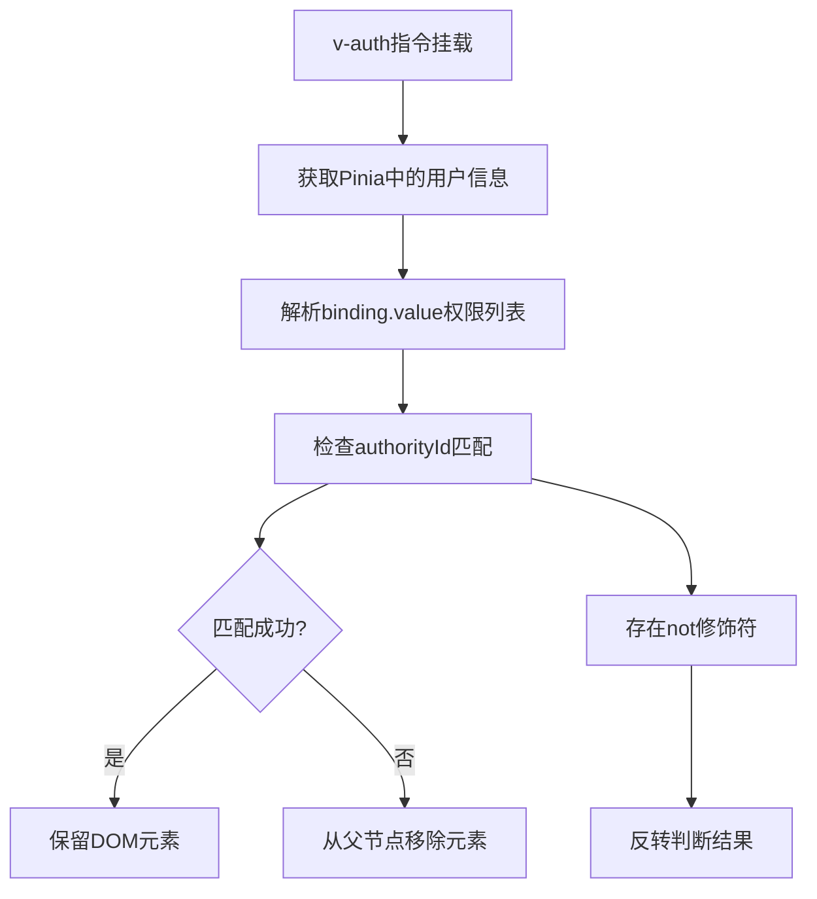
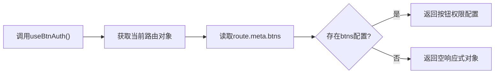
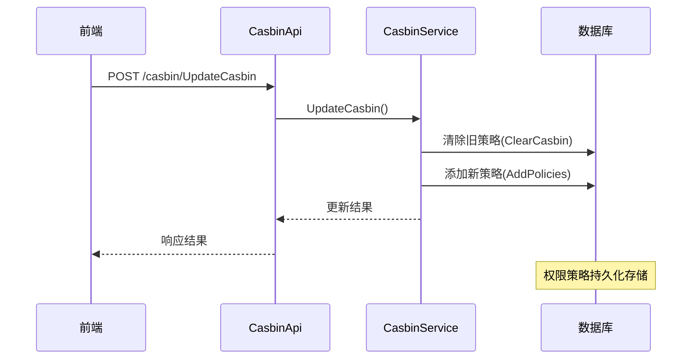
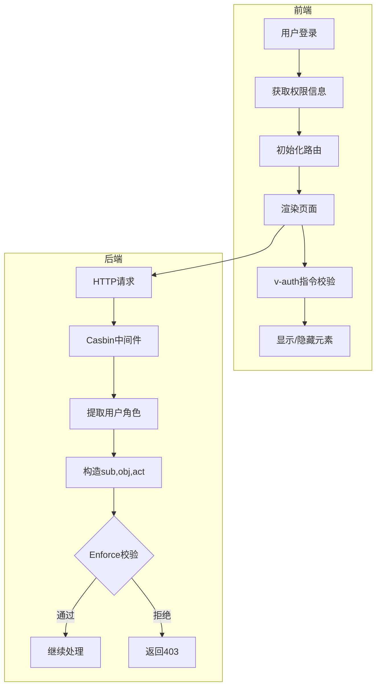

# 指令与权限控制

<cite>
**本文档引用文件**
- [auth.js](file://web/src/directive/auth.js)
- [btnAuth.js](file://web/src/utils/btnAuth.js)
- [user.js](file://web/src/pinia/modules/user.js)
- [sys_casbin.go](file://server/api/v1/system/sys_casbin.go)
- [casbin_rbac.go](file://server/middleware/casbin_rbac.go)
- [sys_casbin.go](file://server/service/system/sys_casbin.go)
- [sys_casbin.go](file://server/model/system/request/sys_casbin.go)
</cite>

## 目录
1. [简介](#简介)
2. [v-auth指令实现原理](#v-auth指令实现原理)
3. [按钮权限判断工具函数](#按钮权限判断工具函数)
4. [后端Casbin权限模型同步机制](#后端casbin权限模型同步机制)
5. [权限配置与验证流程](#权限配置与验证流程)
6. [常见问题排查指南](#常见问题排查指南)
7. [总结](#总结)

## 简介
本系统采用前后端分离架构，通过v-auth自定义指令和btnAuth工具函数实现前端细粒度的权限控制。系统基于Casbin RBAC（基于角色的访问控制）模型，在用户登录时获取权限信息，并在前端动态控制DOM元素的显示隐藏，同时后端通过中间件进行API级别的权限校验。

## v-auth指令实现原理

`v-auth` 是一个Vue自定义指令，用于根据用户权限动态控制页面元素的显示与隐藏。该指令通过Pinia状态管理获取当前用户的权限信息，并与绑定值进行比对，决定是否保留或移除DOM元素。

指令的核心逻辑如下：
- 从Pinia的user模块中获取当前用户信息
- 解析指令绑定的权限标识列表
- 判断当前用户权限ID是否匹配任一指定权限
- 支持not修饰符实现反向权限判断
- 不满足权限条件时直接从父节点移除元素

**Diagram sources**
- [auth.js](file://web/src/directive/auth.js#L1-L25)
- [user.js](file://web/src/pinia/modules/user.js#L12-L151)

**Section sources**
- [auth.js](file://web/src/directive/auth.js#L1-L25)
- [user.js](file://web/src/pinia/modules/user.js#L12-L151)

## 按钮权限判断工具函数

`useBtnAuth` 是一个组合式API函数，用于在JavaScript逻辑中进行按钮级别权限判断。该函数从当前路由元信息中提取按钮权限配置，为组件提供响应式的权限判断能力。

该工具函数的特点包括：
- 基于Vue Router的meta字段存储按钮权限信息
- 使用reactive创建响应式对象确保视图更新
- 返回当前路由关联的所有按钮权限配置
- 可在组件逻辑中灵活调用进行条件判断

**Diagram sources**
- [btnAuth.js](file://web/src/utils/btnAuth.js#L2-L5)

**Section sources**
- [btnAuth.js](file://web/src/utils/btnAuth.js#L2-L5)

## 后端Casbin权限模型同步机制

系统后端采用Casbin作为权限管理引擎，实现了RBAC权限模型的数据同步机制。通过API接口将前端配置的权限规则持久化到数据库，并在运行时加载到内存中进行高效校验。

核心同步流程包括：
- 前端提交权限变更请求至UpdateCasbin接口
- 后端服务层更新GORM适配器中的策略规则
- 将权限策略写入数据库持久化存储
- 调用LoadPolicy刷新内存中的权限策略

**Diagram sources**
- [sys_casbin.go](file://server/api/v1/system/sys_casbin.go#L15-L69)
- [sys_casbin.go](file://server/service/system/sys_casbin.go#L20-L85)

**Section sources**
- [sys_casbin.go](file://server/api/v1/system/sys_casbin.go#L15-L69)
- [sys_casbin.go](file://server/service/system/sys_casbin.go#L20-L85)

## 权限配置与验证流程

系统的权限控制贯穿前后端，形成完整的权限验证闭环。从前端展示到后端接口访问，每个环节都进行了相应的权限校验。

### 完整权限流程

### 后端权限拦截器
`CasbinHandler` 中间件负责API级别的权限校验，其工作原理如下：
- 从JWT令牌中提取用户声明
- 解析请求路径和方法
- 构造Casbin校验所需的三个参数：主体(sub)、对象(obj)、动作(act)
- 调用Enforce方法进行权限决策
- 校验失败时中断请求并返回错误

**Diagram sources**
- [casbin_rbac.go](file://server/middleware/casbin_rbac.go#L1-L33)
- [sys_casbin.go](file://server/model/system/request/sys_casbin.go#L1-L27)

**Section sources**
- [casbin_rbac.go](file://server/middleware/casbin_rbac.go#L1-L33)
- [sys_casbin.go](file://server/model/system/request/sys_casbin.go#L1-L27)

## 常见问题排查指南

### 权限不生效问题
**可能原因及解决方案：**
- **缓存未清除**：用户登录后权限信息可能被缓存，需清除localStorage和sessionStorage
- **路由未刷新**：权限变更后需要重新登录或刷新路由表
- **大小写敏感**：检查权限标识的大小写是否完全匹配
- **路径前缀**：确认是否包含正确的系统路由前缀

**解决步骤：**
1. 清除浏览器本地存储数据
2. 重新登录系统
3. 检查network面板确认权限数据正确加载
4. 验证前端绑定值与后端配置一致

### 权限延迟问题
**现象描述：** 权限修改后前端仍显示旧权限状态

**根本原因：** Casbin策略加载存在延迟，或客户端缓存了旧的权限信息

**解决方案：**
- 调用FreshCasbin方法强制重新加载策略
- 在权限更新后通知所有在线用户刷新权限
- 实现WebSocket推送机制实时同步权限变更
- 设置合理的缓存过期时间

### 调试建议
- 打开浏览器开发者工具，检查Pinia状态中的userInfo.authorityId
- 查看网络请求，确认GetUserInfo接口返回正确的权限数据
- 检查控制台是否有权限相关的警告或错误信息
- 验证Casbin策略数据库表(casbin_rule)中的记录是否正确更新

**Section sources**
- [user.js](file://web/src/pinia/modules/user.js#L12-L151)
- [auth.js](file://web/src/directive/auth.js#L1-L25)
- [sys_casbin.go](file://server/service/system/sys_casbin.go#L150-L173)

## 总结
本系统通过v-auth指令和btnAuth工具函数实现了前端细粒度的权限控制，结合Pinia状态管理和后端Casbin RBAC模型，构建了完整的权限管理体系。权限数据从前端展示到后端校验形成了闭环，既保证了用户体验又确保了系统安全。建议在实际使用中注意权限缓存的管理，及时刷新权限状态，避免因数据不同步导致的权限异常问题。