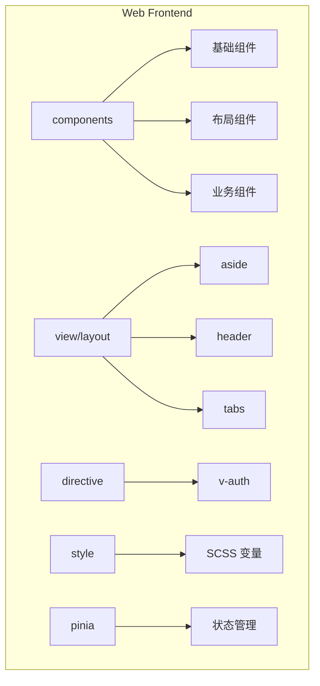
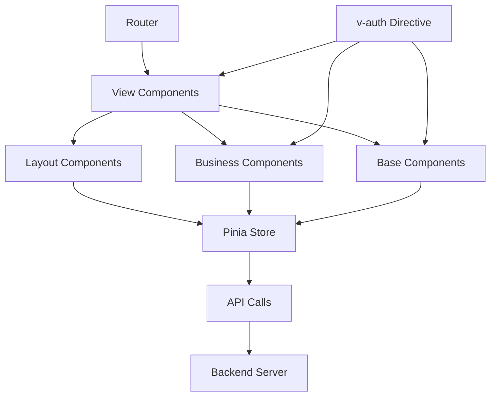
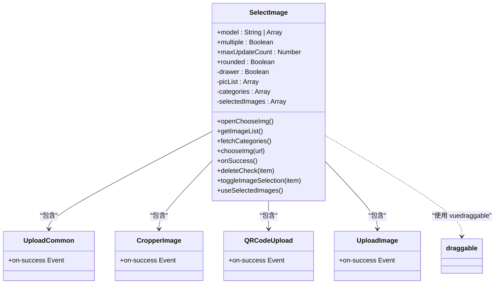
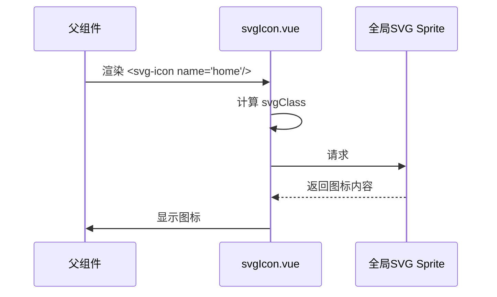
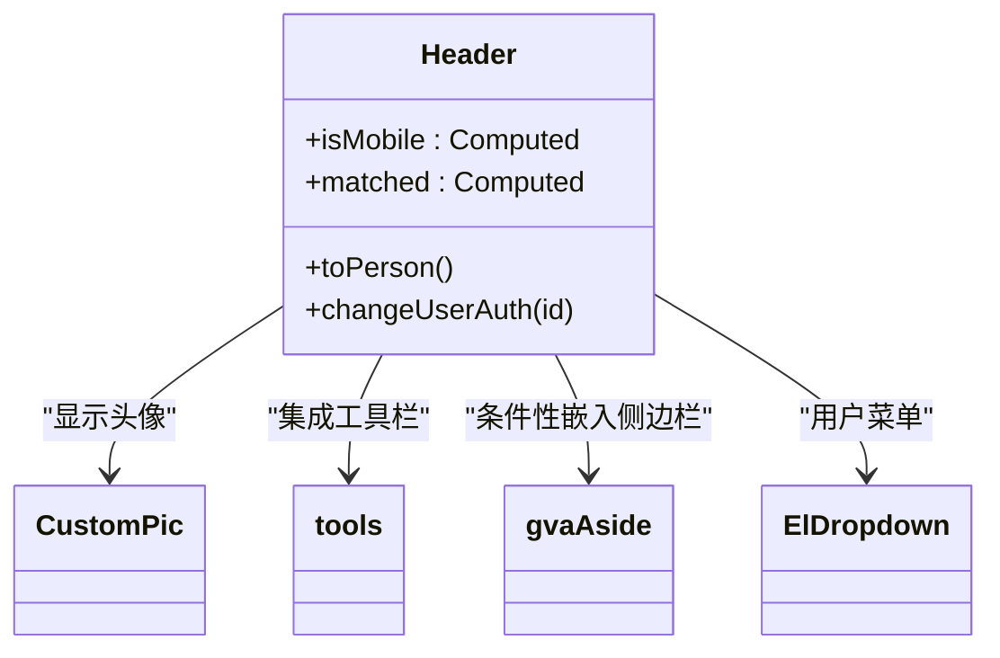
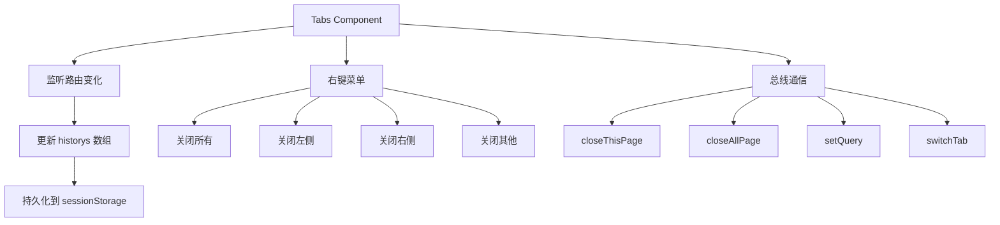

# 组件体系

<cite>
**本文档引用文件**
- [image.vue](file://web/src/components/upload/image.vue)
- [selectImage.vue](file://web/src/components/selectImage/selectImage.vue)
- [svgIcon.vue](file://web/src/components/svgIcon/svgIcon.vue)
- [exportExcel.vue](file://web/src/components/exportExcel/exportExcel.vue)
- [rich-edit.vue](file://web/src/components/richtext/rich-edit.vue)
- [normalMode.vue](file://web/src/view/layout/aside/normalMode.vue)
- [headMode.vue](file://web/src/view/layout/aside/headMode.vue)
- [combinationMode.vue](file://web/src/view/layout/aside/combinationMode.vue)
- [sidebarMode.vue](file://web/src/view/layout/aside/sidebarMode.vue)
- [index.vue](file://web/src/view/layout/aside/index.vue)
- [header/index.vue](file://web/src/view/layout/header/index.vue)
- [tabs/index.vue](file://web/src/view/layout/tabs/index.vue)
- [auth.js](file://web/src/directive/auth.js)
- [main.scss](file://web/src/style/main.scss)
- [element_visiable.scss](file://web/src/style/element_visiable.scss)
- [btnAuth.js](file://web/src/utils/btnAuth.js)
</cite>

## 目录
1. [简介](#简介)
2. [项目结构](#项目结构)
3. [核心组件](#核心组件)
4. [架构概览](#架构概览)
5. [详细组件分析](#详细组件分析)
6. [依赖分析](#依赖分析)
7. [性能考量](#性能考量)
8. [故障排除指南](#故障排除指南)
9. [结论](#结论)

## 简介
本文档旨在全面介绍 gin-vue-admin 前端项目的组件体系,涵盖基础组件、布局组件、业务组件的设计与实现。重点阐述权限控制机制(v-auth 指令和按钮权限)、组件封装原则、接口设计及最佳实践,为开发者提供高效复用和扩展组件库的指导。

## 项目结构
gin-vue-admin 的前端代码位于 `web/src` 目录下,采用典型的 Vue 3 + Pinia + Element Plus 架构。组件按功能分类存放于 `components` 目录,布局相关组件集中于 `view/layout` 目录。样式文件使用 SCSS 预处理器,全局配置和工具函数分别存放在 `core` 和 `utils` 目录中。



**图示来源**
- [web/src/components](file://web/src/components)
- [web/src/view/layout](file://web/src/view/layout)
- [web/src/directive](file://web/src/directive)
- [web/src/style](file://web/src/style)
- [web/src/pinia](file://web/src/pinia)

**章节来源**
- [web/src](file://web/src)

## 核心组件
本系统的核心组件体系围绕可复用性、一致性和权限控制构建。基础组件提供原子化 UI 元素,布局组件定义页面骨架,业务组件封装特定功能逻辑。通过 Pinia 进行全局状态管理,并利用自定义指令实现细粒度的权限控制。

**章节来源**
- [web/src/components](file://web/src/components)
- [web/src/view/layout](file://web/src/view/layout)
- [web/src/directive/auth.js](file://web/src/directive/auth.js)

## 架构概览
整个前端应用采用模块化分层架构。视图层由路由驱动,通过组合基础、布局和业务组件构建完整页面。逻辑层通过 Pinia Store 管理用户信息、应用配置等全局状态。数据层通过 API 模块与后端交互。权限指令在 DOM 渲染时动态控制元素的显示与隐藏。



**图示来源**
- [web/src/router/index.js](file://web/src/router/index.js)
- [web/src/pinia](file://web/src/pinia)
- [web/src/api](file://web/src/api)
- [web/src/directive/auth.js](file://web/src/directive/auth.js)

## 详细组件分析
对关键组件进行深入剖析,理解其内部实现和使用方式。

### 基础组件分析
基础组件是构建用户界面的基石,提供标准化的输入、展示和交互能力。

#### upload 组件
`upload/image.vue` 组件封装了图片上传功能,集成了自动压缩逻辑。当上传文件大小超过预设阈值(默认 2MB)或尺寸过大时,会调用 `imageCompress` 工具进行前端压缩,优化上传体验。

```mermaid
flowchart TD
Start([开始上传]) --> ValidateType["验证文件类型 (JPG/PNG)"]
ValidateType --> TypeValid{"类型有效?"}
TypeValid --> |否| ShowError["显示错误信息"]
TypeValid --> |是| CheckSize["检查文件大小"]
CheckSize --> SizeValid{"超出限制? (" fileSize "KB)"]
SizeValid --> |否| UploadDirect["直接上传"]
SizeValid --> |是| Compress["执行前端压缩"]
Compress --> UploadCompressed["上传压缩后文件"]
UploadDirect --> Success["触发 on-success 事件"]
UploadCompressed --> Success
ShowError --> End([结束])
Success --> End
```

**图示来源**
- [image.vue](file://web/src/components/upload/image.vue#L0-L102)

**章节来源**
- [image.vue](file://web/src/components/upload/image.vue)

#### selectImage 组件
`selectImage/selectImage.vue` 是一个功能丰富的媒体选择器,支持单选、多选、拖拽排序和在线编辑。它整合了上传、裁剪、二维码识别等多种子组件,通过 Drawer 弹窗提供统一的媒体库访问入口。



**图示来源**
- [selectImage.vue](file://web/src/components/selectImage/selectImage.vue#L0-L503)

**章节来源**
- [selectImage.vue](file://web/src/components/selectImage/selectImage.vue)

#### svgIcon 组件
`svgIcon/svgIcon.vue` 组件用于渲染 SVG 图标。它通过 `xlink:href` 动态引用预先注册的 SVG Symbol,实现了图标的按需加载和复用。支持通过 `name` 属性指定图标,`color` 属性控制颜色。



**图示来源**
- [svgIcon.vue](file://web/src/components/svgIcon/svgIcon.vue#L0-L32)

**章节来源**
- [svgIcon.vue](file://web/src/components/svgIcon/svgIcon.vue)

### 布局组件分析
布局组件负责构建应用的整体页面结构和导航体系。

#### aside 组件
侧边栏组件 (`view/layout/aside`) 提供了多种显示模式(normal, head, combination, sidebar),根据应用配置 `config.side_mode` 和设备类型 `device` 动态切换。它通过 Pinia Store 获取全局配置,实现了响应式布局。

```mermaid
flowchart LR
A[Aside Container] --> B{side_mode}
B --> |"normal"| C[NormalMode]
B --> |"head" and not mobile"| D[HeadMode]
B --> |"combination" and not mobile"| E[CombinationMode]
B --> |"sidebar" and not mobile"| F[SidebarMode]
B --> |"mobile"| C
C --> G[菜单列表]
D --> H[顶部菜单]
E --> I[头部+侧边混合]
F --> J[独立侧边栏]
```

**图示来源**
- [index.vue](file://web/src/view/layout/aside/index.vue#L0-L39)

**章节来源**
- [index.vue](file://web/src/view/layout/aside/index.vue)

#### header 组件
头部组件 (`view/layout/header`) 包含应用 Logo、面包屑导航和用户操作区。它根据 `side_mode` 决定是否显示内联侧边栏,并集成 `tools` 子组件提供主题切换等功能。用户信息来自 Pinia Store。



**图示来源**
- [header/index.vue](file://web/src/view/layout/header/index.vue#L0-L140)

**章节来源**
- [header/index.vue](file://web/src/view/layout/header/index.vue)

#### tabs 组件
标签页组件 (`view/layout/tabs`) 管理用户的浏览历史,支持标签的增删改查。它利用 `sessionStorage` 持久化存储历史记录,并通过 `emitter` 总线与其他组件通信,实现如“关闭当前页”等全局操作。



**图示来源**
- [tabs/index.vue](file://web/src/view/layout/tabs