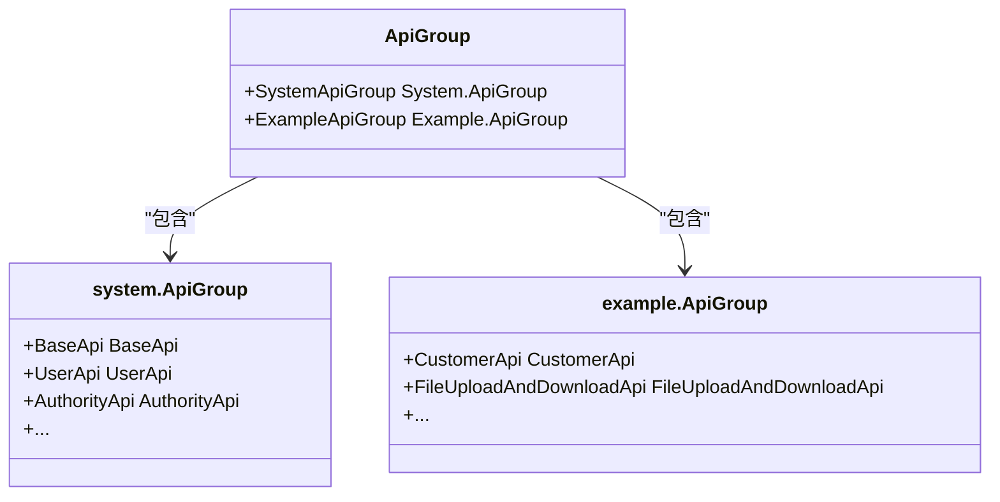
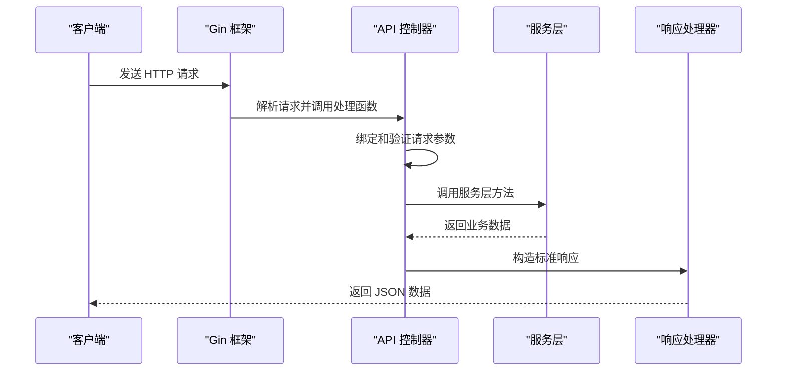
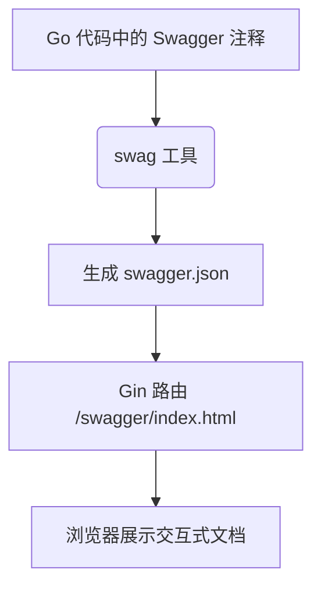

# API 接口层

<cite>
**本文档引用的文件**
- [enter.go](file://server/api/v1/enter.go)
- [sys_user.go](file://server/api/v1/system/sys_user.go)
- [request/sys_user.go](file://server/model/system/request/sys_user.go)
- [response/sys_user.go](file://server/model/system/response/sys_user.go)
- [swagger.json](file://server/docs/swagger.json)
</cite>

## 目录
1. [简介](#简介)
2. [API 分组与路由注册机制](#api-分组与路由注册机制)
3. [典型 RESTful API 实现分析](#典型-restful-api-实现分析)
4. [请求与响应结构体设计](#请求与响应结构体设计)
5. [Swagger 文档生成与使用](#swagger-文档生成与使用)

## 简介
本项目采用 Gin 框架构建 RESTful API 接口层，位于 `server/api/v1` 目录下。该层作为业务逻辑与 HTTP 请求之间的桥梁，负责接收客户端请求、调用服务层处理业务逻辑，并返回标准化的 JSON 响应。API 层通过模块化设计，将不同功能划分为独立的分组（如 system、example），并通过统一的注册机制集成到 Gin 路由引擎中。

## API 分组与路由注册机制



**图表来源**
- [enter.go](file://server/api/v1/enter.go#L1-L13)
- [system/enter.go](file://server/api/v1/system/enter.go#L1-L49)
- [example/enter.go](file://server/api/v1/example/enter.go#L1-L15)

API 接口层的核心是分组管理机制。在 `server/api/v1/enter.go` 文件中定义了 `ApiGroup` 结构体，它聚合了所有功能模块的 API 分组，如 `SystemApiGroup` 和 `ExampleApiGroup`。每个子分组（如 `system.ApiGroup`）又包含了该模块下的具体 API 控制器，例如用户管理、权限管理等。

这种设计实现了高内聚低耦合的架构：各模块独立维护自己的 API 接口，而顶层的 `ApiGroupApp` 全局变量（`var ApiGroupApp = new(ApiGroup)`）则提供了一个统一的访问入口，使得其他层（如路由层）可以方便地引用任何 API 接口。

**章节来源**
- [enter.go](file://server/api/v1/enter.go#L1-L13)
- [system/enter.go](file://server/api/v1/system/enter.go#L1-L49)
- [example/enter.go](file://server/api/v1/example/enter.go#L1-L15)

## 典型 RESTful API 实现分析



**图表来源**
- [sys_user.go](file://server/api/v1/system/sys_user.go#L1-L522)
- [router/system/sys_user.go](file://server/router/system/sys_user.go#L1-L28)

以 `sys_user.go` 中的 `GetUserList` 函数为例，详细说明一个典型的 RESTful API 处理流程：

1.  **接收 HTTP 请求**：函数签名 `func (b *BaseApi) GetUserList(c *gin.Context)` 表明这是一个绑定在 `BaseApi` 结构体上的方法，其参数 `*gin.Context` 封装了完整的 HTTP 请求和响应上下文。
2.  **解析与校验请求参数**：使用 `c.ShouldBindJSON(&pageInfo)` 将请求体中的 JSON 数据反序列化到 `systemReq.GetUserList` 结构体实例中。随后调用 `utils.Verify(pageInfo, utils.PageInfoVerify)` 进行字段级别的有效性校验。
3.  **调用服务层**：通过预定义的全局服务实例 `userService`，调用其 `GetUserInfoList(pageInfo)` 方法来执行核心的业务逻辑（如数据库查询）。这遵循了清晰的分层原则，API 层不包含具体的业务规则。
4.  **处理响应**：根据服务层的返回结果，使用 `response.OkWithDetailed()` 或 `response.FailWithMessage()` 等工具函数构造符合项目规范的 JSON 响应体，并通过 `c.JSON()` 发送回客户端。

**章节来源**
- [sys_user.go](file://server/api/v1/system/sys_user.go#L1-L522)

## 请求与响应结构体设计

```mermaid
classDiagram
class request.Register {
+Username string
+Password string
+NickName string
+AuthorityId uint
+Enable int
+Phone string
+Email string
}
class response.LoginResponse {
+User system.SysUser
+Token string
+ExpiresAt int64
}
class common.Response {
+Success bool
+Data interface{}
+Msg string
}
response.LoginResponse --> common.Response : "继承"
request.Register --> common.Request : "继承"
```

**图表来源**
- [request/sys_user.go](file://server/model/system/request/sys_user.go#L1-L72)
- [response/sys_user.go](file://server/model/system/response/sys_user.go#L1-L15)
- [common/request/common.go](file://server/model/common/request/common.go)
- [common/response/response.go](file://server/model/common/response/response.go)

请求（request）和响应（response）子包是保证 API 接口健壮性和一致性的重要组成部分。

*   **请求结构体**：位于 `model/system/request` 等目录下，用于定义 API 的输入契约。它们通常包含：
    *   `json` 标签：指导 Gin 如何从 JSON 请求体中映射字段。
    *   验证标签（如 `binding:"required"`）或配合 `utils.Verify` 使用的自定义验证规则，确保输入数据的有效性。
    *   示例中的 `Register` 结构体就清晰地定义了用户注册所需的全部字段。

*   **响应结构体**：位于 `model/system/response` 等目录下，用于封装 API 的输出数据。它们通常包含：
    *   对核心数据模型（如 `system.SysUser`）的嵌套引用。
    *   附加信息，如 JWT 令牌（`LoginResponse` 中的 `Token` 字段）。
    *   最终的响应会包装在一个通用的 `response.Response` 结构体中，该结构体包含 `success`、`data` 和 `msg` 等标准字段，便于前端统一处理。

**章节来源**
- [request/sys_user.go](file://server/model/system/request/sys_user.go#L1-L72)
- [response/sys_user.go](file://server/model/system/response/sys_user.go#L1-L15)

## Swagger 文档生成与使用



**图表来源**
- [swagger.json](file://server/docs/swagger.json)
- [sys_user.go](file://server/api/v1/system/sys_user.go#L1-L522)

项目通过 `swag` 工具自动生成 OpenAPI (Swagger) 规范文档。其工作原理如下：

1.  **注释驱动**：开发者在 API 处理函数上方使用特定格式的注释（如 `@Tags`, `@Summary`, `@Param`, `@Success`）来描述接口的元数据。
2.  **文档生成**：运行 `swag init` 命令，工具会扫描代码中的这些注释，并生成一个 `swagger.json` 文件（位于 `server/docs/` 目录下）。
3.  **文档访问**：项目启动后，可以通过 `/swagger/index.html` 路径访问一个美观的、可交互的 Web UI。该 UI 渲染 `swagger.json` 的内容，允许开发者和测试人员直接在浏览器中查看 API 列表、参数说明、示例请求，并进行在线调试。

`swagger.json` 文件是整个文档的核心，它是一个符合 OpenAPI 2.0 规范的 JSON 文件，完整地描述了所有 API 的路径、方法、参数、请求体、响应体和状态码。

**章节来源**
- [swagger.json](file://server/docs/swagger.json#L1-L10046)
- [sys_user.go](file://server/api/v1/system/sys_user.go#L1-L522)