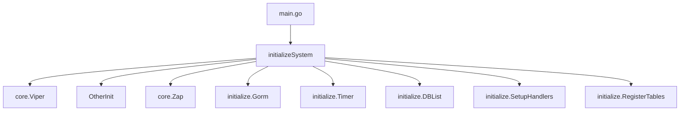
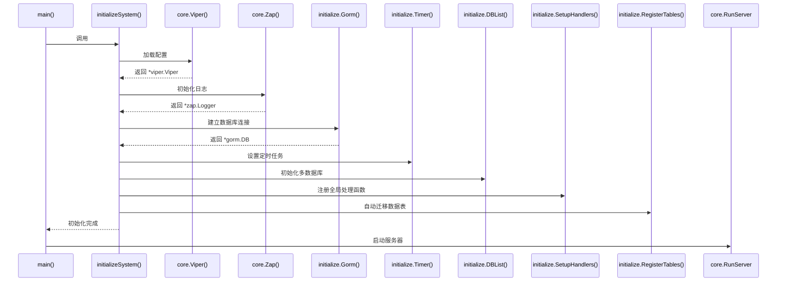

# 主初始化流程

<cite>
**本文档中引用的文件**
- [main.go](file://server/main.go)
- [initialize/init.go](file://server/initialize/init.go)
- [core/viper.go](file://server/core/viper.go)
- [core/zap.go](file://server/core/zap.go)
- [initialize/gorm.go](file://server/initialize/gorm.go)
- [initialize/timer.go](file://server/initialize/timer.go)
- [initialize/db_list.go](file://server/initialize/db_list.go)
- [initialize/router.go](file://server/initialize/router.go)
- [service/system/sys_initdb.go](file://server/service/system/sys_initdb.go)
- [router/system/sys_system.go](file://server/router/system/sys_system.go)
</cite>

## 目录
1. [项目结构](#项目结构)
2. [主入口与初始化函数调用链](#主入口与初始化函数调用链)
3. [系统配置加载](#系统配置加载)
4. [日志系统初始化](#日志系统初始化)
5. [数据库连接建立](#数据库连接建立)
6. [Redis 初始化](#redis-初始化)
7. [路由注册](#路由注册)
8. [Casbin 权限策略加载](#casbin-权限策略加载)
9. [定时任务启动](#定时任务启动)
10. [初始化优先级控制机制](#初始化优先级控制机制)
11. [错误传播与日志输出模式](#错误传播与日志输出模式)

## 项目结构

gin-vue-admin 后端项目采用分层架构设计,核心代码位于 `server` 目录下。主要模块包括:
- `config`: 系统配置定义
- `core`: 核心功能组件(Viper、Zap、Gin服务器)
- `global`: 全局变量管理
- `initialize`: 系统初始化逻辑
- `router`: 路由定义
- `service`: 业务服务实现
- `model`: 数据模型定义

该结构实现了关注点分离,便于维护和扩展。

**Diagram sources**
- [main.go](file://server/main.go#L38-L50)

**Section sources**
- [main.go](file://server/main.go#L1-L52)

## 主入口与初始化函数调用链

程序从 `main.go` 文件的 `main()` 函数开始执行,首先调用 `initializeSystem()` 完成系统初始化,然后通过 `core.RunServer()` 启动Gin Web服务器。

`initializeSystem()` 是整个初始化流程的核心函数,按顺序执行以下关键步骤:
1. 配置加载(Viper)
2. 其他基础初始化(OtherInit)
3. 日志系统初始化(Zap)
4. 数据库连接(Gorm)
5. 定时任务设置(Timer)
6. 多数据库列表初始化(DBList)
7. 全局处理器设置(SetupHandlers)
8. 数据表自动迁移(RegisterTables)

**Diagram sources**
- [main.go](file://server/main.go#L29-L34)
- [main.go](file://server/main.go#L38-L50)

**Section sources**
- [main.go](file://server/main.go#L29-L50)

## 系统配置加载

系统配置通过 `core.Viper()` 函数进行加载,使用 Viper 库读取 YAML 格式的配置文件(默认为 `config.yaml`)。该过程包含以下步骤:

1. 确定配置文件路径
2. 创建 Viper 实例并设置文件类型为 YAML
3. 读取配置文件内容
4. 启用配置热重载监听
5. 将配置反序列化到全局配置对象 `global.GVA_CONFIG`
6. 设置自动化代码生成的根目录路径

若配置文件读取或反序列化失败,将触发 panic 异常,确保系统不会在配置错误的情况下运行。

**Section sources**
- [core/viper.go](file://server/core/viper.go#L16-L41)

## 日志系统初始化

日志系统通过 `core.Zap()` 函数初始化,基于 Uber 的 zap 日志库构建。初始化流程如下:

1. 检查日志存储目录是否存在,若不存在则创建
2. 根据配置中的日志级别创建多个 zapcore.Core
3. 使用 zapcore.NewTee 组合所有 Core
4. 构建最终的 Logger 实例
5. 如果启用显示调用行号,则添加 AddCaller 选项

日志系统支持多种输出级别,并可根据配置灵活调整输出格式和目标位置。

**Section sources**
- [core/zap.go](file://server/core/zap.go#L14-L31)

## 数据库连接建立

数据库连接通过 `initialize.Gorm()` 函数建立,根据配置中的数据库类型(mysql、pgsql、oracle、mssql、sqlite)选择相应的驱动进行连接。具体流程为:

1. 判断 `global.GVA_CONFIG.System.DbType` 配置值
2. 调用对应类型的 Gorm 初始化函数(如 GormMysql、GormPgSql 等)
3. 将活动数据库名称指针赋值给 `global.GVA_ACTIVE_DBNAME`
4. 返回 *gorm.DB 连接实例

数据库连接实例被保存在 `global.GVA_DB` 全局变量中,供后续操作使用。

**Section sources**
- [initialize/gorm.go](file://server/initialize/gorm.go#L13-L34)

## Redis 初始化

虽然当前上下文未直接展示 Redis 初始化代码,但根据项目结构可推断其初始化逻辑应在 `initialize/redis.go` 中实现。通常流程包括:

1. 读取 Redis 配置参数(地址、端口、密码等)
2. 建立 Redis 连接客户端
3. 测试连接可用性
4. 将客户端实例存储到全局变量中

Redis 主要用于 JWT 黑名单缓存和其他临时数据存储。

## 路由注册

路由注册通过 `initialize.Routers()` 函数完成,该函数构建 Gin Engine 并注册所有路由组。主要步骤包括:

1. 创建 Gin 引擎实例
2. 添加 Recovery 和 Logger 中间件
3. 注册 MCP(Model Control Protocol)相关路由
4. 设置静态资源路由
5. 注册 Swagger 文档路由
6. 创建公共和私有路由组
7. 分别注册无需认证的基础路由和需要 JWT 认证的私有路由
8. 注册各模块的具体路由(用户、菜单、权限、字典等)
9. 安装插件路由
10. 返回配置好的 Router 实例

特别地,system 模块的 system 相关路由通过 `systemRouter.InitSystemRouter(PrivateGroup)` 注册,提供获取服务器信息、设置系统配置等功能。

**Section sources**
- [initialize/router.go](file://server/initialize/router.go#L94)
- [router/system/sys_system.go](file://server/router/system/sys_system.go#L9-L21)

## Casbin 权限策略加载

Casbin 权限策略的加载是通过中间件机制实现的。在路由注册过程中,私有路由组应用了 `middleware.CasbinHandler()` 中间件。该中间件负责:

1. 初始化 Casbin Enforcer
2. 从数据库或文件加载权限策略规则
3. 在每次请求时进行权限校验
4. 决定是否放行请求

具体的 Casbin 路由也通过 `systemRouter.InitCasbinRouter(PrivateGroup)` 进行注册,提供动态管理权限策略的API接口。

## 定时任务启动

定时任务通过 `initialize.Timer()` 函数启动,使用 cron 表达式调度。当前系统内置了一个每日执行的定时任务:

- **任务标识**: ClearDB
- **执行周期**: @daily (每天一次)
- **执行内容**: 调用 `task.ClearTable(global.GVA_DB)` 清理数据库中的日志和黑名单内容

该函数以 goroutine 方式运行,避免阻塞主初始化流程。未来可在此基础上扩展更多定时任务。

**Section sources**
- [initialize/timer.go](file://server/initialize/timer.go#L11-L36)

## 初始化优先级控制机制

系统通过 `register_init.go` 文件和 `sys_initdb.go` 中的 `SubInitializer` 接口实现初始化优先级控制。关键机制如下:

1. 定义 `SubInitializer` 接口,包含 `InitializerName()` 方法
2. 使用 `init()` 函数自动导入 `server/source/system` 和 `server/source/example` 包,触发其中的初始化注册
3. 通过 `RegisterInit(order int, i SubInitializer)` 函数注册带顺序标记的初始化器
4. 使用常量定义优先级等级:
   - `InitOrderSystem = 10` (系统级)
   - `InitOrderInternal = 1000` (内部扩展)
   - `InitOrderExternal = 100000` (外部插件)

在数据库初始化阶段,通过对 `initializers` 切片排序来保证依赖关系正确的执行顺序,满足复杂场景下的初始化