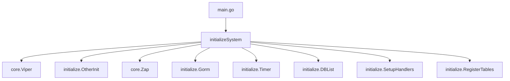
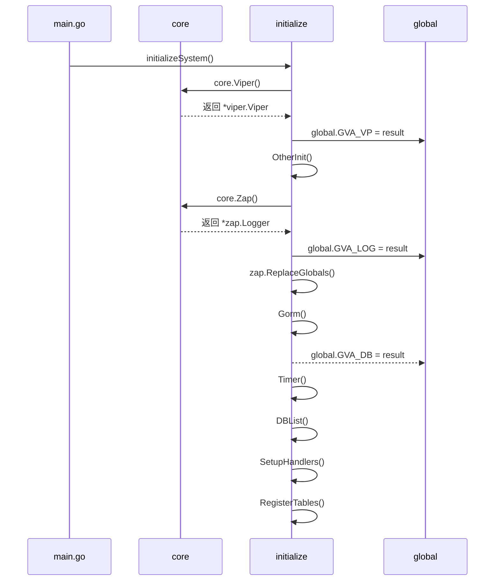
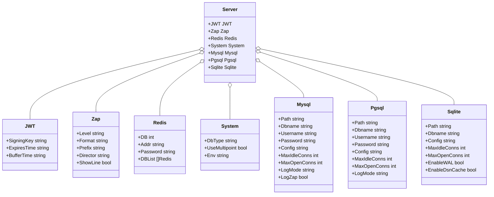

# 初始化流程

<cite>
**本文档中引用的文件**
- [main.go](file://server/main.go)
- [viper.go](file://server/core/viper.go)
- [zap.go](file://server/core/zap.go)
- [gorm.go](file://server/initialize/gorm.go)
- [timer.go](file://server/initialize/timer.go)
- [db_list.go](file://server/initialize/db_list.go)
- [other.go](file://server/initialize/other.go)
- [init.go](file://server/initialize/init.go)
- [reload.go](file://server/initialize/reload.go)
- [register_init.go](file://server/initialize/register_init.go)
- [config.go](file://server/config/config.go)
- [casbin_util.go](file://server/utils/casbin_util.go)
</cite>

## 目录
1. [简介](#简介)
2. [项目结构](#项目结构)
3. [核心组件](#核心组件)
4. [架构概览](#架构概览)
5. [详细组件分析](#详细组件分析)
6. [依赖分析](#依赖分析)
7. [性能考虑](#性能考虑)
8. [故障排除指南](#故障排除指南)
9. [结论](#结论)

## 简介
gin-vue-admin 是一个基于 Gin 和 Vue 的全栈开发基础平台,其后端系统初始化流程设计严谨、模块化清晰。本文档深入解析从 `main.go` 调用 `initialize.InitSystem()` 开始的完整启动过程,涵盖配置加载(viper)、日志初始化(zap)、数据库连接(GORM 支持 MySQL、PostgreSQL、SQLite 等)、Redis 连接、定时任务、Casbin 权限引擎加载等核心组件的初始化顺序与依赖关系。同时解释 viper 如何读取 config.yaml 并映射到 config 包中的结构体,说明各初始化函数在 register_init.go 中的注册机制,并提供初始化流程的时序图以及常见初始化失败的原因及排查方法。

## 项目结构
gin-vue-admin 后端主要由以下几个关键目录构成:`core` 负责核心功能如 Viper 配置和 Zap 日志；`global` 存放全局变量；`initialize` 包含所有初始化逻辑；`config` 定义了配置结构体；`utils` 提供通用工具函数。这种分层架构确保了代码的高度可维护性和扩展性。

**Diagram sources**
- [main.go](file://server/main.go#L0-L50)
- [viper.go](file://server/core/viper.go#L16-L41)
- [zap.go](file://server/core/zap.go#L14-L31)
- [gorm.go](file://server/initialize/gorm.go#L13-L34)
- [timer.go](file://server/initialize/timer.go#L11-L36)
- [db_list.go](file://server/initialize/db_list.go#L10-L35)
- [other.go](file://server/initialize/other.go#L12-L31)
- [init.go](file://server/initialize/init.go#L9-L14)

**Section sources**
- [main.go](file://server/main.go#L0-L50)
- [core/viper.go](file://server/core/viper.go#L16-L41)
- [core/zap.go](file://server/core/zap.go#L14-L31)
- [initialize/gorm.go](file://server/initialize/gorm.go#L13-L34)
- [initialize/timer.go](file://server/initialize/timer.go#L11-L36)
- [initialize/db_list.go](file://server/initialize/db_list.go#L10-L35)
- [initialize/other.go](file://server/initialize/other.go#L12-L31)
- [initialize/init.go](file://server/initialize/init.go#L9-L14)

## 核心组件
系统初始化的核心在于一系列有序执行的初始化函数,它们共同构建了一个稳定运行的应用环境。这些函数包括但不限于配置加载、日志设置、数据库连接建立、定时任务注册等。每个组件都通过特定的方式进行初始化,并且相互之间存在明确的依赖关系。

**Section sources**
- [main.go](file://server/main.go#L0-L50)
- [core/viper.go](file://server/core/viper.go#L16-L41)
- [core/zap.go](file://server/core/zap.go#L14-L31)
- [initialize/gorm.go](file://server/initialize/gorm.go#L13-L34)
- [initialize/timer.go](file://server/initialize/timer.go#L11-L36)

## 架构概览
整个系统的初始化流程遵循严格的顺序,以保证前置条件满足后续操作的需求。首先是配置文件的加载,接着是日志系统的准备,然后才是数据库和其他外部服务的连接。这样的设计不仅提高了系统的健壮性,也便于开发者理解和调试。

**Diagram sources**
- [main.go](file://server/main.go#L0-L50)
- [viper.go](file://server/core/viper.go#L16-L41)
- [zap.go](file://server/core/zap.go#L14-L31)
- [gorm.go](file://server/initialize/gorm.go#L13-L34)
- [timer.go](file://server/initialize/timer.go#L11-L36)
- [db_list.go](file://server/initialize/db_list.go#L10-L35)
- [other.go](file://server/initialize/other.go#L12-L31)
- [init.go](file://server/initialize/init.go#L9-L14)

## 详细组件分析
### 配置加载 (Viper)
使用 Viper 库来加载配置文件 `config.yaml`,并将其中的内容映射到 `config.Server` 结构体实例中。此过程发生在 `core.Viper()` 函数内,它会自动检测配置文件路径并监听变更事件,在配置更改时重新加载。

**Section sources**
- [viper.go](file://server/core/viper.go#L16-L41)
- [config.go](file://server/config/config.go#L0-L40)

#### 对象导向组件:

**Diagram sources**
- [config.go](file://server/config/config.go#L0-L40)

### 日志初始化 (Zap)
Zap 日志库的初始化由 `core.Zap()` 函数完成。该函数根据当前配置创建相应的日志输出核心,并