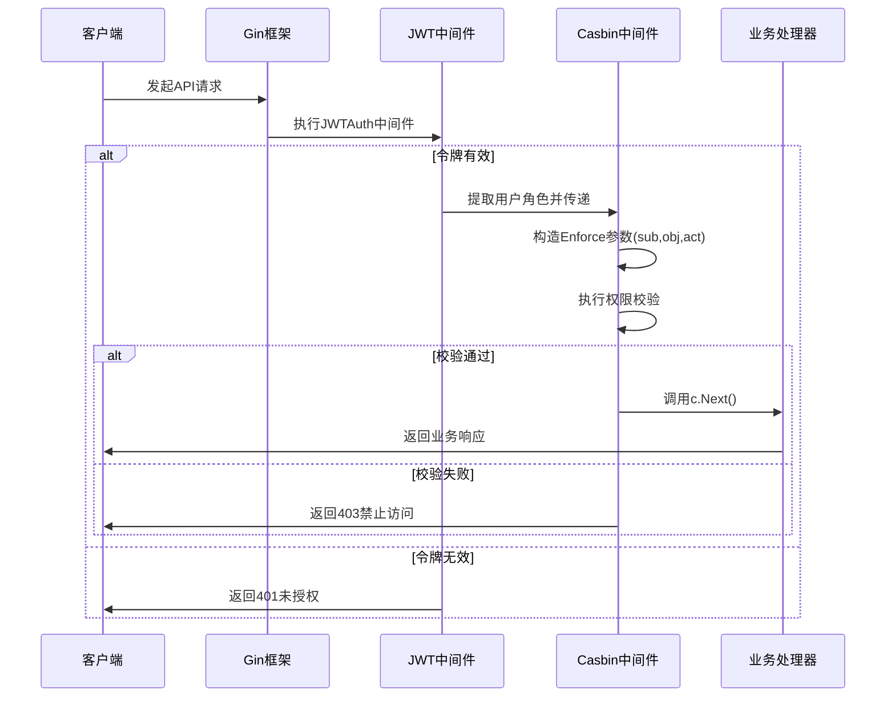

# Casbin RBAC 初始化

<cite>
**本文档中引用的文件**
- [sys_casbin.go](file://server/api/v1/system/sys_casbin.go)
- [casbin_rbac.go](file://server/middleware/casbin_rbac.go)
- [sys_casbin.go](file://server/service/system/sys_casbin.go)
- [casbin.go](file://server/source/system/casbin.go)
- [router.go](file://server/initialize/router.go)
- [config.go](file://server/config/config.go)
- [casbin_util.go](file://server/utils/casbin_util.go)
</cite>

## 目录
1. [系统初始化阶段Casbin权限加载流程](#系统初始化阶段casbin权限加载流程)
2. [中间件注册与Gin路由集成机制](#中间件注册与gin路由集成机制)
3. [权限缓存更新策略与同步配置](#权限缓存更新策略与同步配置)
4. [多节点部署数据一致性保障](#多节点部署数据一致性保障)
5. [自定义匹配器实现逻辑](#自定义匹配器实现逻辑)
6. [常见权限问题排查指南](#常见权限问题排查指南)

## 系统初始化阶段Casbin权限加载流程

Casbin权限引擎在系统启动时通过`server/source/system/casbin.go`中的`initCasbin`结构体完成初始化。该过程遵循系统初始化框架,通过`RegisterInit`函数注册到初始化序列中,在数据库连接建立后自动执行。

初始化流程首先调用`MigrateTable`方法确保`casbin_rule`表存在并正确迁移,随后通过`InitializeData`方法将预定义的权限策略批量写入数据库。这些策略以`adapter.CasbinRule`结构体数组形式存储,包含不同角色(V0字段)对各API接口(V1路径,V2方法)的访问控制规则。例如,角色ID为888的管理员拥有用户管理、API管理、菜单管理等核心功能的完整权限。

权限数据持久化适配器通过`gorm-adapter/v3`实现,由`utils.GetCasbin()`函数提供单例化的`SyncedCachedEnforcer`实例。该实例在首次调用时通过`once.Do`保证线程安全地完成初始化:从全局数据库连接`global.GVA_DB`创建GORM适配器,并加载包含请求定义、策略定义、角色定义和匹配器的完整模型配置。模型中的`keyMatch2`函数支持路径参数的通配符匹配,如`/user/:id`模式。

**Section sources**
- [casbin.go](file://server/source/system/casbin.go#L0-L303)
- [casbin_util.go](file://server/utils/casbin_util.go#L18-L51)

## 中间件注册与Gin路由集成机制

Casbin RBAC中间件通过`middleware/casbin_rbac.go`中的`CasbinHandler`函数实现。该中间件在`server/initialize/router.go`的路由注册阶段被集成到私有路由组(PrivateGroup)中,位于JWT认证中间件之后,形成`JWTAuth() -> CasbinHandler()`的双重防护链。

当HTTP请求到达时,`CasbinHandler`首先调用`utils.GetClaims(c)`从JWT令牌中提取用户声明,获取当前用户的角色ID(AuthorityId)。然后解析请求的URL路径,去除系统路由前缀(如`/api/v1`),得到用于权限校验的资源对象(obj)。同时获取请求的HTTP方法(act)作为操作类型(act),并将角色ID转换为字符串作为主体(sub)。

核心权限校验由`e.Enforce(sub, obj, act)`方法执行,该方法查询Casbin策略模型,判断是否存在允许该主体对特定对象执行特定操作的规则。若校验失败,中间件立即返回403状态码并终止请求处理；若成功,则调用`c.Next()`将控制权交给后续处理器。

**Diagram sources**
- [casbin_rbac.go](file://server/middleware/casbin_rbac.go#L0-L33)
- [router.go](file://server/initialize/router.go#L105-L122)

**Section sources**
- [casbin_rbac.go](file://server/middleware/casbin_rbac.go#L0-L33)
- [router.go](file://server/initialize/router.go#L105-L122)

## 权限缓存更新策略与同步配置

Casbin使用`SyncedCachedEnforcer`来提升性能,其内置缓存默认过期时间为3600秒(1小时),通过`SetExpireTime(60 * 60)`设置。这意味着权限策略在内存中缓存一小时,避免了每次请求都查询数据库的开销。

当管理员通过`sys_casbin.go`服务层修改权限时,系统采用分步更新策略。`UpdateCasbin`方法首先进行权限合法性检查,清除旧策略(`ClearCasbin`),然后添加新策略(`AddPolicies`)。但此时变更仅存在于数据库,内存中的Casbin策略尚未更新。为了使变更立即生效,必须显式调用`FreshCasbin`方法,该方法触发`LoadPolicy()`操作,强制从数据库重新加载所有策略到内存缓存。

`FreshCasbin` API(`/api/freshCasbin` GET)可供手动调用刷新缓存。此外,系统配置`config.yaml`中的`system.useStrictAuth`选项影响API变更时的行为:若启用严格模式,更新API时会验证新路径是否在权限列表中,增强了安全性但也增加了校验开销。

**Section sources**
- [sys_casbin.go](file://server/service/system/sys_casbin.go#L141-L172)
- [config.go](file://server/config/config.go#L0-L40)

## 多节点部署数据一致性保障

在多节点集群部署场景下,各节点独立维护自己的Casbin内存缓存。由于缓存是本地的,一个节点上执行的`FreshCasbin`操作不会自动同步到其他节点,这可能导致短暂的权限策略不一致。

系统本身未内置跨节点的缓存同步机制。为保障数据一致性,建议采取以下措施:
1. **集中式管理**:确保所有权限变更操作通过统一的管理后台或API入口进行。
2. **自动化脚本**:在执行权限更新后,通过运维脚本或CI/CD流水线,依次调用所有节点的`/api/freshCasbin`端点强制刷新缓存。
3. **监控告警**:监控各节点的健康状态和配置版本,及时发现因缓存不一致导致的问题。
4. **依赖数据库**:最终的权威策略始终存储在数据库中,即使缓存过期,最坏情况下也只是增加一次数据库查询,不会导致永久性错误。

**Section sources**
- [sys_casbin.go](file://server/service/system/sys_casbin.go#L170-L172)

## 自定义匹配器实现逻辑

Casbin的匹配逻辑在`utils/casbin_util.go`的`GetCasbin`函数中通过字符串定义的模型进行配置。核心匹配器`m`的表达式为:
`r.sub == p.sub && keyMatch2(r.obj,p.obj) && r.act == p.act`
此表达式实现了RBAC的核心三元组校验:
- `r.sub == p.sub`:请求的主体(用户角色ID)必须等于策略中的主体。
- `keyMatch2(r.obj,p.obj)`:请求的对象(API路径)需与策略中的对象匹配。`keyMatch2`函数支持`:param`和`*`通配符,例如策略中的`/user/:id`可以匹配`/user/123`和`/user/456`。
- `r.act == p.act`:请求的操作(HTTP方法)必须与策略中定义的操作完全相同。

此模型设计简洁高效,适用于标准的基于角色的访问控制场景。如需更复杂的逻辑(如基于属性的访问控制ABAC),可扩展此模型,但这需要修改源代码并重新编译。

**Section sources**
- [casbin_util.go](file://server/utils/casbin_util.go#L18-L51)

## 常见权限问题排查指南

当遇到权限不生效的问题时,可按以下步骤排查:

1.  **检查JWT令牌**:确认请求头中携带了有效的JWT令牌,且令牌未过期。可通过在线工具解码JWT,验证其中的`authorityId`字段是否正确。
2.  **核对API路径和方法**:仔细比对请求的实际路径(去除路由前缀后)和HTTP方法,是否与Casbin策略中定义的`V1`(Path)和`V2`(Method)完全一致。注意大小写和斜杠。
3.  **验证策略是否存在**:直接查询数据库的`casbin_rule`表,确认目标角色(`V0`)对应的权限策略已正确插入。可使用`GetPolicyPathByAuthorityId` API接口查询指定角色的所有权限。
4.  **检查缓存是否过期**:如果最近修改了权限,请确认是否已调用`FreshCasbin` API刷新了内存缓存。在多节点环境下,需确认所有节点都已刷新。
5.  **查看日志输出**:检查服务器日志,`zap.L().Error`可能记录了适配器初始化失败或模型加载错误等关键信息。
6.  **调试中间件**:在`casbin_rbac.go`的`CasbinHandler`函数中添加临时日志,打印出`sub`, `obj`, `act`的具体值以及`Enforce`的返回结果,有助于定位匹配失败的原因。

**Section sources**
- [casbin_rbac.go](file://server/middleware/casbin_rbac.go#L0-L33)
- [sys_casbin.go](file://server/service/system/sys_casbin.go#L170-L172)
- [casbin_util.go](file://server/utils/casbin_util.go#L18-L51)