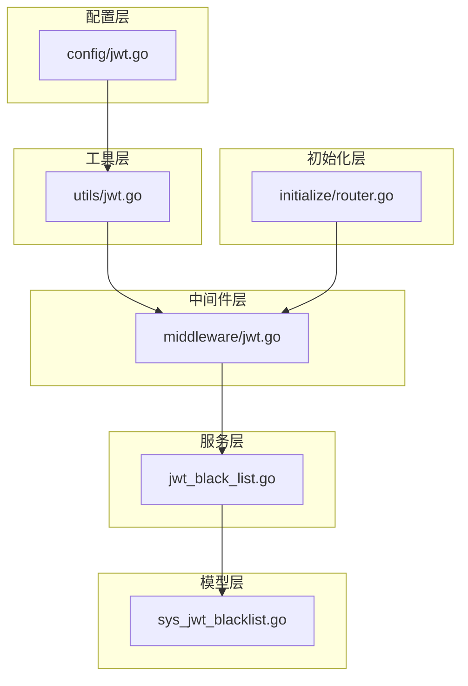
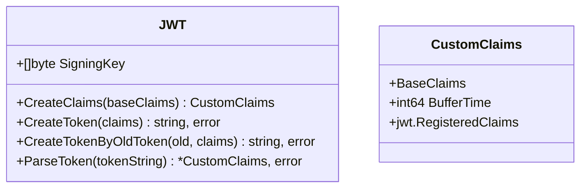
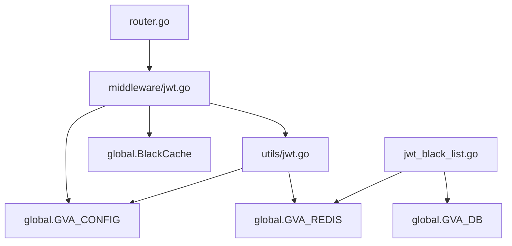

# JWT 认证初始化

<cite>
**本文档引用文件**
- [jwt.go](file://server/middleware/jwt.go)
- [config/jwt.go](file://server/config/jwt.go)
- [utils/jwt.go](file://server/utils/jwt.go)
- [model/system/sys_jwt_blacklist.go](file://server/model/system/sys_jwt_blacklist.go)
- [service/system/jwt_black_list.go](file://server/service/system/jwt_black_list.go)
- [core/viper.go](file://server/core/viper.go)
- [initialize/router.go](file://server/initialize/router.go)
</cite>

## 目录
1. [简介](#简介)
2. [项目结构](#项目结构)
3. [核心组件](#核心组件)
4. [架构概览](#架构概览)
5. [详细组件分析](#详细组件分析)
6. [依赖分析](#依赖分析)
7. [性能考虑](#性能考虑)
8. [故障排除指南](#故障排除指南)
9. [结论](#结论)

## 简介
本文件深入解析 gin-vue-admin 项目中 JWT 中间件的初始化与运行机制，重点阐述系统启动时如何加载配置、实现 Token 的签发与验证逻辑，并结合 Redis 实现 Token 黑名单机制以防止劫持。文档涵盖从配置读取、中间件拦截流程到错误处理和性能优化建议的完整技术细节。

## 项目结构
JWT 相关功能分布在多个模块中，形成清晰的关注点分离：



**Diagram sources**
- [config/jwt.go](file://server/config/jwt.go)
- [utils/jwt.go](file://server/utils/jwt.go)
- [middleware/jwt.go](file://server/middleware/jwt.go)
- [service/system/jwt_black_list.go](file://server/service/system/jwt_black_list.go)
- [model/system/sys_jwt_blacklist.go](file://server/model/system/sys_jwt_blacklist.go)
- [initialize/router.go](file://server/initialize/router.go)

**Section sources**
- [config/jwt.go](file://server/config/jwt.go)
- [utils/jwt.go](file://server/utils/jwt.go)
- [middleware/jwt.go](file://server/middleware/jwt.go)

## 核心组件
系统通过多层协作完成 JWT 全生命周期管理：
- **配置管理**：`viper` 模块加载 `config.yaml` 中的 JWT 参数。
- **Token 操作**：`utils/jwt.go` 提供创建、解析、刷新 Token 的核心方法。
- **请求拦截**：`middleware/jwt.go` 在路由层面拦截并校验 Token。
- **黑名单机制**：基于 Redis 和数据库双重存储，实现失效 Token 的快速判断。

**Section sources**
- [core/viper.go](file://server/core/viper.go#L1-L77)
- [utils/jwt.go](file://server/utils/jwt.go#L1-L106)
- [middleware/jwt.go](file://server/middleware/jwt.go#L1-L89)

## 架构概览
整个 JWT 鉴权流程在 Gin 框架的中间件链中执行，其控制流如下图所示：

```mermaid
sequenceDiagram
participant Client as 客户端
participant Router as 路由器
participant JWTAuth as JWT中间件
participant JWTUtil as JWT工具
participant Redis as Redis缓存
participant DB as 数据库
Client->>Router : 发起API请求(Authorization头含token)
Router->>JWTAuth : 调用JWTAuth中间件
JWTAuth->>JWTAuth : 调用utils.GetToken提取token
alt token缺失
JWTAuth-->>Client : 返回401未授权
return
end
JWTAuth->>Redis : 查询token是否在黑名单
Redis-->>JWTAuth : 返回存在状态
alt token在黑名单
JWTAuth-->>Client : 返回"异地登录或令牌失效"
return
end
JWTAuth->>JWTUtil : 调用ParseToken解析token
alt 解析失败
alt 过期
JWTAuth-->>Client : 返回"登录已过期"
else 其他错误
JWTAuth-->>Client : 返回具体错误信息
end
return
end
JWTAuth->>JWTAuth : 设置claims至上下文
alt 接近过期(bufferTime内)
JWTAuth->>JWTUtil : CreateTokenByOldToken生成新token
JWTUtil-->>JWTAuth : 返回新token
JWTAuth->>Client : 设置new-token/new-expires-at响应头
alt 启用多点登录
JWTAuth->>Redis : SetRedisJWT更新Redis中的token
end
end
JWTAuth->>Client : 继续后续处理(c.Next())
```

**Diagram sources**
- [middleware/jwt.go](file://server/middleware/jwt.go#L14-L76)
- [utils/jwt.go](file://server/utils/jwt.go#L50-L75)
- [utils/jwt.go](file://server/utils/jwt.go#L95-L104)

## 详细组件分析

### JWT 中间件分析
`JWTAuth` 中间件是鉴权的核心入口，负责拦截请求并执行完整的 Token 校验流程。

#### 请求拦截与 Token 提取
中间件首先从请求头部或 Cookie 中提取 `x-token`，若不存在则立即终止请求并返回未授权响应。

**Section sources**
- [middleware/jwt.go](file://server/middleware/jwt.go#L16-L21)

#### 黑名单校验
使用全局缓存 `global.BlackCache` 快速判断 Token 是否已被拉黑，防止已注销或被踢下线的 Token 继续使用。

**Section sources**
- [middleware/jwt.go](file://server/middleware/jwt.go#L22-L27)
- [middleware/jwt.go](file://server/middleware/jwt.go#L80-L88)

#### Token 解析与续期
调用 `utils.NewJWT().ParseToken()` 解析 Token 内容。当检测到 Token 即将过期（剩余时间小于缓冲时间），自动签发新 Token 并通过响应头返回给客户端，实现无感刷新。

**Section sources**
- [middleware/jwt.go](file://server/middleware/jwt.go#L28-L76)

### JWT 工具类分析
`utils/jwt.go` 封装了所有与 JWT 相关的底层操作。

#### 初始化与签名密钥加载
`NewJWT()` 函数从全局配置 `GVA_CONFIG.JWT.SigningKey` 加载签名密钥，确保每次签发和验证都使用相同的密钥。



**Diagram sources**
- [utils/jwt.go](file://server/utils/jwt.go#L25-L29)
- [utils/jwt.go](file://server/utils/jwt.go#L31-L50)

#### Redis Token 存储
`SetRedisJWT` 方法将用户的最新有效 Token 存入 Redis，键为用户名，值为 Token，过期时间与 JWT 一致，支持多点登录场景下的 Token 管理。

**Section sources**
- [utils/jwt.go](file://server/utils/jwt.go#L95-L104)

### 配置管理分析
系统使用 Viper 库实现灵活的配置管理，JWT 相关参数定义在 `config/jwt.go` 结构体中。

| 配置项 | 类型 | 描述 |
|--------|------|------|
| signing-key | string | JWT 签名密钥，用于HS256算法 |
| expires-time | string | Token 过期时间，如"72h" |
| buffer-time | string | 刷新缓冲时间，如"6h" |
| issuer | string | 签发者标识 |

**Section sources**
- [config/jwt.go](file://server/config/jwt.go#L3-L10)
- [core/viper.go](file://server/core/viper.go#L1-L77)

## 依赖分析
JWT 功能模块依赖于多个核心组件协同工作。



**Diagram sources**
- [middleware/jwt.go](file://server/middleware/jwt.go)
- [utils/jwt.go](file://server/utils/jwt.go)
- [service/system/jwt_black_list.go](file://server/service/system/jwt_black_list.go)
- [initialize/router.go](file://server/initialize/router.go)

**Section sources**
- [middleware/jwt.go](file://server/middleware/jwt.go)
- [utils/jwt.go](file://server/utils/jwt.go)
- [service/system/jwt_black_list.go](file://server/service/system/jwt_black_list.go)
- [initialize/router.go](file://server/initialize/router.go)

## 性能考虑
为提升 JWT 鉴权性能，系统采用以下策略：
- **内存缓存黑名单**：使用 `global.BlackCache` (go-cache) 在内存中缓存黑名单，避免每次请求都查询数据库。
- **并发安全的Token刷新**：`CreateTokenByOldToken` 使用 `singleflight` 机制 (`global.GVA_Concurrency_Control.Do`) 防止高并发下重复创建 Token。
- **Redis集中管理**：通过 Redis 统一管理用户当前有效 Token，便于实现“踢人下线”功能。

**Section sources**
- [middleware/jwt.go](file://server/middleware/jwt.go#L60-L68)
- [utils/jwt.go](file://server/utils/jwt.go#L77-L88)
- [utils/jwt.go](file://server/utils/jwt.go#L95-L104)

## 故障排除指南
常见问题及解决方案：

| 错误码/消息 | 可能原因 | 解决方案 |
|------------|---------|---------|
| 未登录或非法访问，请登录 | 请求缺少 x-token 头部 | 检查前端是否正确携带 Token |
| 登录已过期，请重新登录 | Token 超出有效期 | 用户需重新登录获取新 Token |
| 您的帐户异地登陆或令牌失效 | Token 在黑名单中 | 检查用户是否在其他设备登录导致被踢 |
| 无效签名 | Token 被篡改或密钥不匹配 | 核对服务器 signing-key 配置 |
| 无法处理此token | Token 格式错误 | 检查 Token