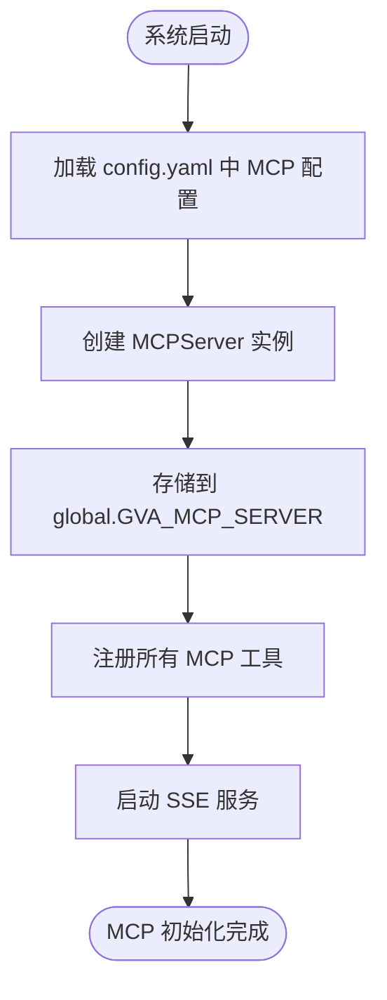
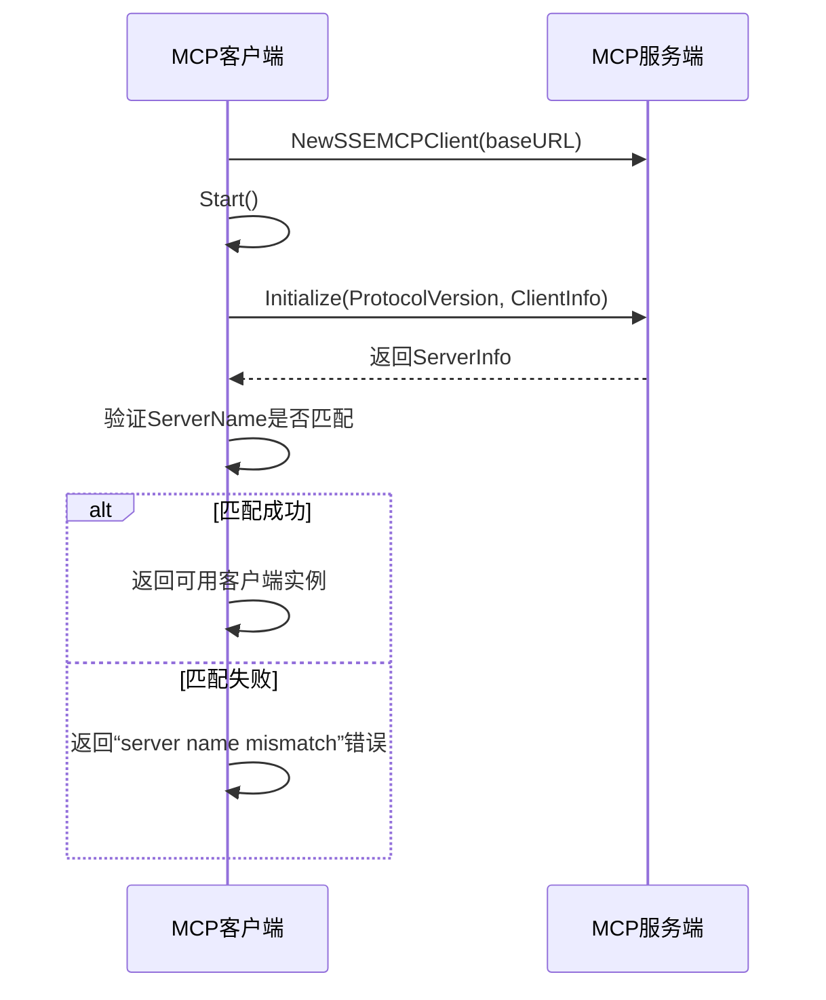
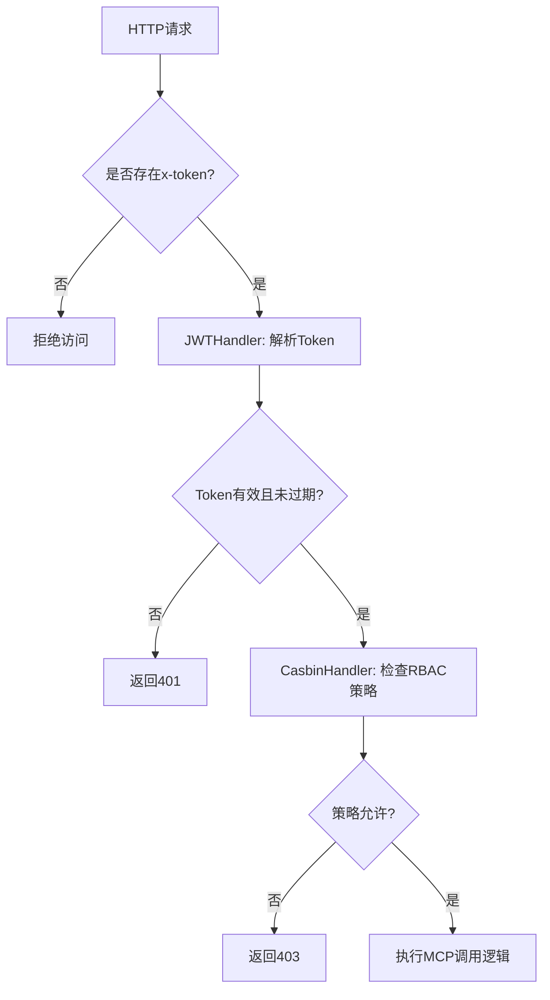

# MCP 安全上下文初始化

<cite>
**本文档引用文件**  
- [mcp.go](file://server/config/mcp.go)
- [mcp.go](file://server/initialize/mcp.go)
- [client.go](file://server/mcp/client/client.go)
- [jwt.go](file://server/middleware/jwt.go)
- [casbin_rbac.go](file://server/middleware/casbin_rbac.go)
</cite>

## 目录
1. [简介](#简介)  
2. [MCP 配置与初始化流程](#mcp-配置与初始化流程)  
3. [安全通信通道与客户端连接建立](#安全通信通道与客户端连接建立)  
4. [MCP 与其他安全组件的协同机制](#mcp-与其他安全组件的协同机制)  
5. [认证鉴权日志追踪方法](#认证鉴权日志追踪方法)  
6. [常见异常处理策略](#常见异常处理策略)  
7. [总结](#总结)

## 简介
MCP(Model Context Protocol)是 gin-vue-admin 系统中用于实现模型上下文交互的核心协议。在系统启动阶段,MCP 安全上下文通过一系列初始化步骤构建,包括加载配置、创建服务实例、注册工具集以及建立客户端连接。该过程确保了后续模块间通信的安全性与一致性,并与 JWT 身份认证和 Casbin 权限控制机制深度集成,形成完整的安全调用链路。

本文档详细阐述 MCP 在系统初始化期间的安全上下文构建流程,说明其如何与系统其他安全组件协同工作,并提供调用链中的日志追踪方法及异常处理策略。

## MCP 配置与初始化流程

MCP 的初始化始于 `config.MCP` 结构体的定义,该结构体位于 `server/config/mcp.go` 文件中,包含名称、版本、SSE 路径、消息路径和 URL 前缀等关键字段。这些配置项由 Viper 框架从 YAML 配置文件加载并注入至全局变量 `global.GVA_CONFIG.MCP` 中。

实际初始化逻辑在 `server/initialize/mcp.go` 的 `McpRun()` 函数中执行。该函数首先根据配置创建一个 `MCPServer` 实例,并将其赋值给全局变量 `GVA_MCP_SERVER`,以便后续模块访问。随后调用 `RegisterAllTools(s)` 注册所有预定义的 MCP 工具(如 `currentTime`、`getNickname` 等),最后使用 SSE(Server-Sent Events)方式启动服务器,绑定指定的事件流路径和基础 URL。



**Diagram sources**  
- [mcp.go](file://server/config/mcp.go#L0-L9)
- [mcp.go](file://server/initialize/mcp.go#L0-L24)

**Section sources**  
- [mcp.go](file://server/config/mcp.go#L0-L9)
- [mcp.go](file://server/initialize/mcp.go#L0-L24)

## 安全通信通道与客户端连接建立

MCP 客户端连接的建立由 `server/mcp/client/client.go` 中的 `NewClient()` 函数负责。该函数接收目标服务的基础 URL、客户端名称、版本号和服务端预期名称作为参数,执行以下关键步骤:

1. **创建 SSE 客户端**:调用第三方库 `mcp-go/client` 的 `NewSSEMCPClient(baseUrl)` 创建基于 SSE 的长连接。
2. **启动客户端**:通过 `client.Start(ctx)` 启动客户端监听事件流。
3. **发送初始化请求**:构造 `InitializeRequest` 请求,携带当前客户端信息(名称、版本)和最新协议版本号,向服务端发起握手。
4. **验证服务端身份**:检查返回结果中的 `ServerInfo.Name` 是否与预期一致,防止中间人攻击或误连错误服务。

此过程未显式启用 TLS 加密,但可通过反向代理(如 Nginx)在部署层统一配置 HTTPS。若需原生支持 TLS,可在 `NewSSEMCPClient` 中传入自定义 HTTP 客户端并配置 TLS 选项。



**Diagram sources**  
- [client.go](file://server/mcp/client/client.go#L0-L38)

**Section sources**  
- [client.go](file://server/mcp/client/client.go#L0-L38)

## MCP 与其他安全组件的协同机制

MCP 并非独立运行,而是与系统的 JWT 认证和 Casbin RBAC 授权机制紧密结合,共同保障调用安全。

### JWT 身份认证集成
所有对 MCP 功能的调用均需通过受保护的 API 接口触发(如 `/autoCode/mcpTest`)。这些接口由 `JWTAuth()` 中间件保护,该中间件从请求头 `x-token` 或 Cookie 中提取 JWT 令牌,解析用户身份信息(如用户名、角色ID、过期时间),并将声明(claims)存入 Gin 上下文中供后续使用。

在测试 MCP 工具时,API 层会先完成 JWT 验证,再创建 MCP 客户端进行远程调用,从而确保只有合法登录用户才能发起操作。

### Casbin 权限控制集成
在 JWT 认证之后,`CasbinHandler()` 中间件进一步执行细粒度权限校验。它从上下文中获取用户的角色 ID(AuthorityId),结合当前请求的路径(去除路由前缀后)和 HTTP 方法(GET/POST 等),查询 Casbin 策略数据库判断是否允许访问。

例如,只有具备特定权限的角色才能调用 MCP 自动代码生成功能。这种双层防护机制有效防止了越权访问。



**Diagram sources**  
- [jwt.go](file://server/middleware/jwt.go#L0-L88)
- [casbin_rbac.go](file://server/middleware/casbin_rbac.go#L0-L33)

**Section sources**  
- [jwt.go](file://server/middleware/jwt.go#L0-L88)
- [casbin_rbac.go](file://server/middleware/casbin_rbac.go#L0-L33)

## 认证鉴权日志追踪方法

为便于调试和审计,系统在多个层级记录了 MCP 调用过程中的安全上下文信息:

1. **JWT 解析日志**:当 `ParseToken` 失败时,会在日志中输出具体错误原因(如过期、签名无效),帮助定位认证问题。
2. **黑名单检测日志**:若发现 token 存在于 JWT 黑名单中(表示已被注销或异地登录),系统将记录相关事件。
3. **Casbin 决策日志**:可通过开启 Casbin 的日志模式查看每次 `Enforce` 调用的输入参数及决策结果。
4. **MCP 调用日志**:在 `auto_code_mcp.go` 的 `MCPTest` 接口中,可通过 `response.OkWithData` 返回调用结果,前端可将其展示为执行日志。

此外,建议在生产环境中结合 ELK 或 Loki 等日志系统,集中收集 `global.GVA_LOG` 输出的日志,实现跨服务的安全事件追踪。

**Section sources**  
- [jwt.go](file://server/middleware/jwt.go#L0-L88)
- [casbin_rbac.go](file://server/middleware/casbin_rbac.go#L0-L33)
- [auto_code_mcp.go](file://server/api/v1/system/auto_code_mcp.go#L76-L143)

## 常见异常处理策略

### 连接超时
MCP 客户端默认使用标准 HTTP 客户端,无显式超时设置。建议在 `NewSSEMCPClient` 时传入自定义 `http.Client` 并配置 `Timeout` 字段(如 30 秒),避免长时间阻塞。

### 凭证失效
- **JWT 过期**:中间件自动检测 `TokenExpired` 错误并向响应头写入 `new-token` 和 `new-expires-at`,提示前端刷新令牌。
- **Token 被加入黑名单**:当用户登出或管理员禁用账户时,系统会将 token 加入 Redis 黑名单,后续请求将被拒绝。
- **服务端名称不匹配**:`NewClient` 显式检查 `result.ServerInfo.Name`,防止客户端连接到伪造的服务端。

### 工具调用失败
- 若 `CallTool` 返回错误,应捕获并转换为用户友好的提示信息(如“工具调用失败”)。
- 若返回内容为空(`len(result.Content) == 0`),也应视为异常情况处理。

```go
// 示例:异常处理片段(概念性代码)
if err != nil {
    response.FailWithMessage("工具调用失败", c)
    return
}
if len(result.Content) == 0 {
    response.FailWithMessage("工具未返回任何内容", c)
    return
}
```

**Section sources**  
- [client.go](file://server/mcp/client/client.go#L0-L38)
- [auto_code_mcp.go](file://server/api/v1/system/auto_code_mcp.go#L117-L143)

## 总结
MCP 安全上下文的初始化是一个多阶段、多层次的过程,涵盖了配置加载、服务启动、客户端连接、身份认证与权限控制等多个环节。通过与 JWT 和 Casbin 的深度集成,系统实现了从“谁在调用”到“能否调用”的完整安全闭环。同时,清晰的日志输出和健壮的异常处理机制为系统的可维护性和安全性提供了有力保障。

未来可考虑增强点包括:原生支持 TLS 传输加密、引入 OAuth2/OpenID Connect 更高级别的认证机制、以及对 MCP