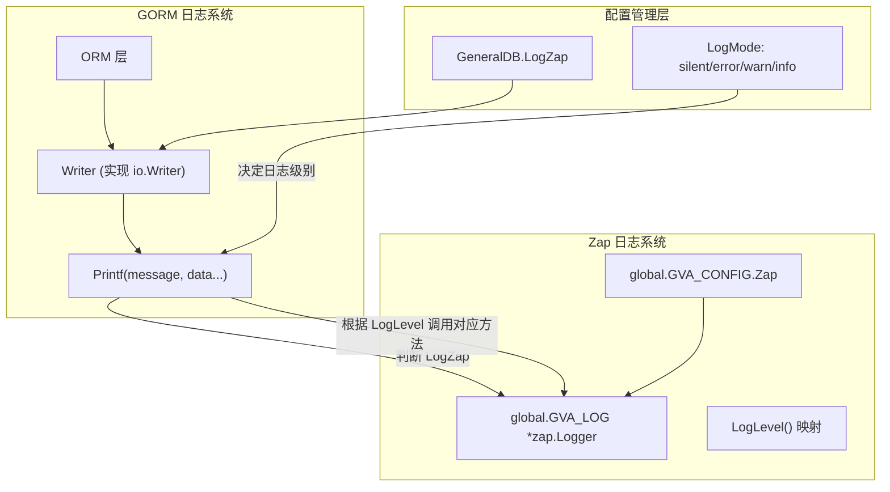

# GORM 日志集成

<cite>
**本文档引用文件**
- [gorm_logger_writer.go](file://server/initialize/internal/gorm_logger_writer.go)
- [zap.go](file://server/config/zap.go)
- [db_list.go](file://server/config/db_list.go)
- [config.go](file://server/config/config.go)
- [global.go](file://server/global/global.go)
- [zap_core.go](file://server/core/internal/zap_core.go)
</cite>

## 目录
1. [引言](#引言)
2. [GORM 与 Zap 集成架构](#gorm-与-zap-集成架构)
3. [核心组件分析](#核心组件分析)
4. [日志级别控制机制](#日志级别控制机制)
5. [配置策略与环境分离](#配置策略与环境分离)
6. [性能影响评估与调优建议](#性能影响评估与调优建议)
7. [结论](#结论)

## 引言
本项目通过自定义 `Writer` 结构体实现了 GORM ORM 框架与 Zap 日志系统的深度集成。该方案允许将数据库层的 SQL 执行日志统一输出至全局日志系统,支持开发调试和生产环境的日志策略分离。通过配置化方式控制日志级别、输出格式及慢查询检测等特性,确保了系统的可观测性与可维护性。

## GORM 与 Zap 集成架构



**图示来源**
- [gorm_logger_writer.go](file://server/initialize/internal/gorm_logger_writer.go#L1-L40)
- [db_list.go](file://server/config/db_list.go#L32-L45)
- [global.go](file://server/global/global.go#L33)

**章节来源**
- [gorm_logger_writer.go](file://server/initialize/internal/gorm_logger_writer.go#L1-L40)
- [db_list.go](file://server/config/db_list.go#L29-L45)

## 核心组件分析

### Writer 结构体实现原理
`Writer` 结构体位于 `server/initialize/internal/gorm_logger_writer.go`,实现了 GORM 的 `logger.Writer` 接口。其主要职责是拦截所有来自 GORM 的日志输出请求,并将其转发到 Zap 日志系统中。

该结构体包含两个字段:
- `config`: 类型为 `config.GeneralDB`,用于获取当前数据库连接的日志配置(如是否启用 Zap 写入)
- `writer`: 原始的 `logger.Writer`,在本实现中未实际使用

构造函数 `NewWriter(config)` 返回一个初始化后的 `*Writer` 实例。

#### Printf 方法执行流程
`Printf(message string, data ...any)` 是唯一需要实现的方法,其逻辑如下:

1. **强制输出到控制台**:使用标准库 `fmt.Printf` 将原始日志打印到终端,保证开发者始终能看到 SQL 执行情况。
2. **条件写入 Zap 日志**:检查 `config.LogZap` 是否开启:
   - 若关闭,则不进行任何额外操作；
   - 若开启,则根据 `config.LogLevel()` 返回的级别,调用对应的 `global.GVA_LOG` 方法(Debug/Info/Warn/Error)。

此设计实现了“双通道”日志输出:既保留了 GORM 默认的终端输出能力,又扩展了结构化日志记录功能。

**章节来源**
- [gorm_logger_writer.go](file://server/initialize/internal/gorm_logger_writer.go#L1-L40)

## 日志级别控制机制

日志级别由 `GeneralDB.LogMode` 字段决定,其值映射关系如下表所示:

| LogMode 配置值 | 对应 GORM 日志级别 | Zap 输出级别 |
|----------------|--------------------|-------------|
| silent         | Silent             | Debug       |
| error          | Error              | Error       |
| warn           | Warn               | Warn        |
| info           | Info               | Info        |
| 其他(默认)   | Info               | Info        |

该映射通过 `GeneralDB.LogLevel()` 方法完成,该方法定义于 `server/config/db_list.go` 中。它接收字符串形式的日志模式,转换为 GORM 所需的 `logger.LogLevel` 枚举类型。

值得注意的是,即使设置为 `silent` 模式,仍会以 `Debug` 级别写入 Zap 日志,这有助于在必要时追溯静默模式下的数据库行为,同时避免污染常规日志流。

**章节来源**
- [db_list.go](file://server/config/db_list.go#L32-L45)

## 配置策略与环境分离

### 启用/禁用 GORM 日志输出

通过配置项 `log-zap` 控制是否将 GORM 日志写入 Zap:

```yaml
mysql:
  log-zap: true  # 开启写入
  log-mode: info # 日志级别
```

当 `log-zap: false` 时,仅输出到控制台；当为 `true` 时,同时写入 Zap 日志文件。

### Zap 全局配置解析

`server/config/zap.go` 定义了 `Zap` 结构体,包含以下关键字段:

- `Level`: 最低日志级别(debug/info/warn/error/fatal)
- `Format`: 输出格式(console/json)
- `Director`: 日志目录路径
- `LogInConsole`: 是否同时输出到控制台
- `RetentionDay`: 日志保留天数
- `ShowLine`: 是否显示调用行号

这些配置最终被 `core/zap.go` 中的 `Zap()` 函数读取并构建出全局 `*zap.Logger` 实例,存储于 `global.GVA_LOG` 变量中。

#### 日志核心初始化流程
1. 检查日志目录是否存在,若不存在则创建
2. 解析 `Levels()` 获取所有需启用的日志等级
3. 为每个等级创建独立的 `ZapCore`
4. 使用 `zapcore.NewTee` 合并多个 Core,实现多级并发输出
5. 若 `ShowLine` 开启,则附加调用栈信息

**章节来源**
- [zap.go](file://server/config/zap.go#L1-L70)
- [core/zap.go](file://server/core/zap.go#L1-L30)
- [config.go](file://server/config/config.go#L1-L40)

## 性能影响评估与调优建议

### 性能影响分析

| 影响维度       | 描述 |
|----------------|------|
| I/O 开销       | 开启 `log-zap` 后,每次 SQL 执行都会触发磁盘写入,尤其在高并发场景下可能成为瓶颈 |
| 内存占用       | 多个 `ZapCore` 实例共存,增加内存开销；但 zap 本身具有缓冲机制,影响可控 |
| CPU 开销       | 格式化 SQL 语句、参数插值、编码序列化等操作带来额外 CPU 消耗 |
| 日志体积       | `info` 级别下每条 SQL 均被记录,长期运行可能导致日志文件迅速膨胀 |

### 调优建议

1. **生产环境推荐配置**:
   ```yaml
   mysql:
     log-mode: warn
     log-zap: true
   ```
   仅记录警告及以上级别日志,减少冗余信息。

2. **开发环境建议开启完整日志**:
   ```yaml
   mysql:
     log-mode: info
     log-zap: true
   ```

3. **禁用不必要的日志输出**:
   在性能敏感服务中可临时关闭 `log-zap`,仅保留控制台输出用于调试。

4. **合理设置日志保留周期**:
   通过 `retention-day` 控制日志清理频率,防止磁盘空间耗尽。

5. **使用异步写入模式**(若 zap 支持):
   当前实现为同步写入,未来可考虑引入缓冲队列提升吞吐量。

6. **监控日志写入延迟**:
   结合 Prometheus 等工具监控 `zap` 写入耗时,及时发现潜在问题。

**章节来源**
- [zap.go](file://server/config/zap.go#L1-L70)
- [gorm_logger_writer.go](file://server/initialize/internal/gorm_logger_writer.go#L1-L40)

## 结论
本项目通过封装 `Writer` 结构体,成功实现了 GORM 与 Zap 的无缝集成。该方案具备良好的灵活性与可配置性,支持按环境差异化配置日志策略。通过 `LogZap` 和 `LogMode` 两个开关,实现了开发调试与生产部署之间的平滑切换。尽管存在一定的性能开销,但通过合理的配置优化,能够在可观测性与系统性能之间取得良好平衡。建议在生产环境中采用 `warn` 或更高日志级别,并定期审查日志策略的有效性。