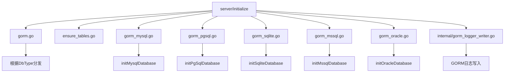
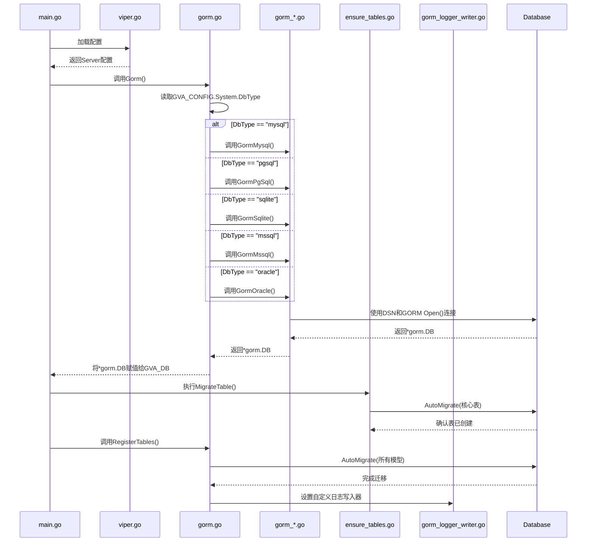
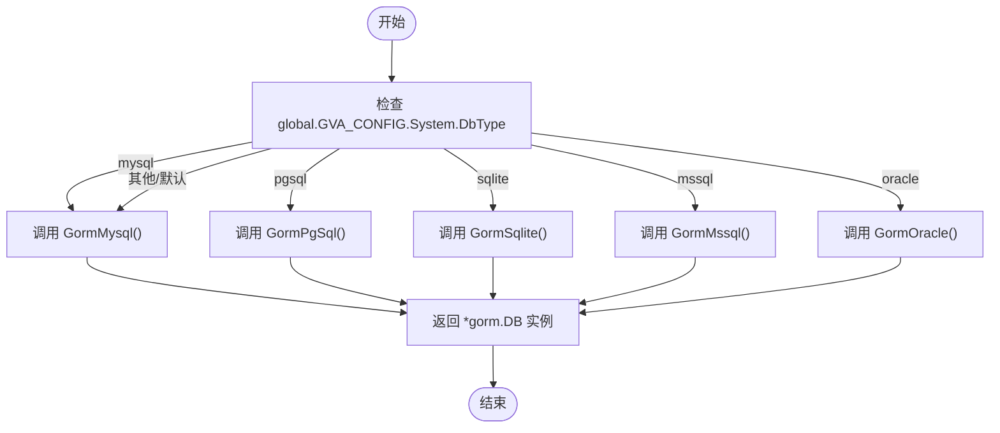
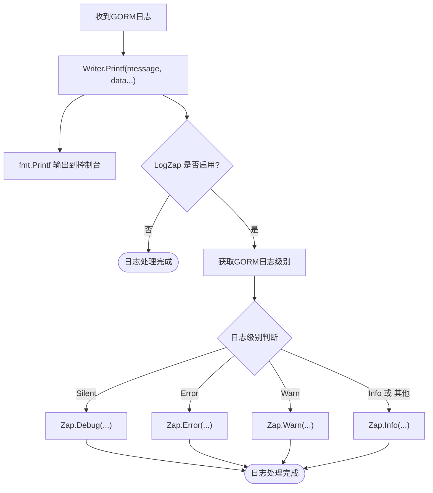
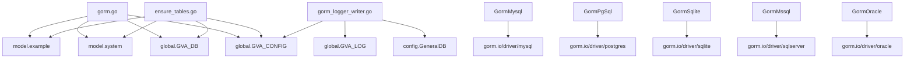

# 数据库初始化

<cite>
**本文档中引用的文件**
- [gorm.go](file://server/initialize/gorm.go)
- [ensure_tables.go](file://server/initialize/ensure_tables.go)
- [gorm_logger_writer.go](file://server/initialize/internal/gorm_logger_writer.go)
- [config.go](file://server/config/config.go)
- [global.go](file://server/global/global.go)
</cite>

## 目录
1. [简介](#简介)
2. [项目结构](#项目结构)
3. [核心组件](#核心组件)
4. [架构概述](#架构概述)
5. [详细组件分析](#详细组件分析)
6. [依赖分析](#依赖分析)
7. [性能考虑](#性能考虑)
8. [故障排除指南](#故障排除指南)
9. [结论](#结论)

## 简介
本文件系统阐述了 GORM ORM 框架在 `gin-vue-admin` 项目中的初始化流程。重点包括对多种数据库(MySQL、PostgreSQL、SQLite、SQL Server、Oracle)的支持机制,通过配置动态选择驱动并建立连接。文档详细说明了 `gorm.go` 文件如何根据配置中的 `DBType` 动态调用对应的数据库初始化函数,以及 `ensure_tables.go` 如何确保核心数据表(如 `sys_user`、`sys_api`)在服务启动时自动创建。此外,还分析了 GORM 日志写入器(`gorm_logger_writer.go`)与系统日志(Zap)的集成方式,并提供了数据库连接池参数的调优建议。

## 项目结构
`gin-vue-admin` 的数据库相关初始化逻辑主要集中在 `server/initialize` 目录下。该目录负责应用启动时的核心资源准备,包括数据库连接、Redis、路由注册等。数据库初始化相关的文件被清晰地组织,每个主流数据库都有独立的初始化函数文件(如 `gorm_mysql.go`、`gorm_pgsql.go`),而通用的逻辑则由 `gorm.go` 和 `ensure_tables.go` 统一协调。

**Diagram sources**
- [gorm.go](file://server/initialize/gorm.go)
- [gorm_mysql.go](file://server/initialize/gorm_mysql.go)
- [gorm_pgsql.go](file://server/initialize/gorm_pgsql.go)
- [gorm_sqlite.go](file://server/initialize/gorm_sqlite.go)
- [gorm_mssql.go](file://server/initialize/gorm_mssql.go)
- [gorm_oracle.go](file://server/initialize/gorm_oracle.go)
- [gorm_logger_writer.go](file://server/initialize/internal/gorm_logger_writer.go)

**Section sources**
- [gorm.go](file://server/initialize/gorm.go)
- [ensure_tables.go](file://server/initialize/ensure_tables.go)
- [gorm_logger_writer.go](file://server/initialize/internal/gorm_logger_writer.go)

## 核心组件

GORM 初始化流程的核心组件包括:
1.  **`Gorm()` 函数**: 位于 `gorm.go`,是整个数据库初始化的入口点,负责根据全局配置决定使用哪个数据库驱动。
2.  **`RegisterTables()` 函数**: 同样位于 `gorm.go`,负责调用 GORM 的 `AutoMigrate` 方法来创建或更新数据库表结构。
3.  **`ensureTables` 结构体**: 实现了 `system.SubInitializer` 接口,作为初始化链的一部分,在更早的阶段确保核心表的存在。
4.  **`Writer` 结构体**: 位于 `gorm_logger_writer.go`,是 GORM 日志系统的自定义写入器,用于将 GORM 的日志输出到控制台和/或 Zap 日志系统。

**Section sources**
- [gorm.go](file://server/initialize/gorm.go#L1-L79)
- [ensure_tables.go](file://server/initialize/ensure_tables.go#L1-L114)
- [gorm_logger_writer.go](file://server/initialize/internal/gorm_logger_writer.go#L1-L42)

## 架构概述

整个数据库初始化流程遵循一个清晰的架构:首先,应用读取配置文件(`config.yaml`)并将其加载到全局变量 `GVA_CONFIG` 中。随后,`gorm.go` 中的 `Gorm()` 函数被调用,它检查 `GVA_CONFIG.System.DbType` 的值,并据此调用相应的数据库初始化函数(如 `GormMysql()`)。这些具体的初始化函数会构建数据库源名称(DSN),并使用 GORM 的 `Open` 方法建立数据库连接,最终返回一个 `*gorm.DB` 实例,该实例被赋值给全局变量 `GVA_DB`。紧接着,`ensure_tables.go` 中的 `MigrateTable` 方法会被执行,确保所有核心表都已存在。最后,`gorm.go` 中的 `RegisterTables()` 函数再次进行迁移,以确保所有模型都被正确注册。

**Diagram sources**
- [gorm.go](file://server/initialize/gorm.go#L1-L79)
- [ensure_tables.go](file://server/initialize/ensure_tables.go#L1-L114)
- [gorm_logger_writer.go](file://server/initialize/internal/gorm_logger_writer.go#L1-L42)
- [global.go](file://server/global/global.go#L25-L30)

## 详细组件分析

### GORM 初始化机制分析
`gorm.go` 文件中的 `Gorm()` 函数是多数据库支持的核心。它通过一个 `switch` 语句,根据 `global.GVA_CONFIG.System.DbType` 的字符串值来决定初始化哪个数据库。这种设计模式实现了运行时的多态性,使得应用无需重新编译即可切换底层数据库。每种数据库类型(如 MySQL, PostgreSQL)都有其专用的初始化函数(`GormMysql`, `GormPgSql`),这些函数封装了特定于该数据库的连接细节。

#### GORM 初始化流程图

**Diagram sources**
- [gorm.go](file://server/initialize/gorm.go#L1-L25)

**Section sources**
- [gorm.go](file://server/initialize/gorm.go#L1-L25)
- [config.go](file://server/config/config.go#L2-L39)

### 表结构自动创建机制分析
`ensure_tables.go` 文件实现了一个名为 `ensureTables` 的结构体,它通过 `init()` 函数将自身注册到系统的初始化链中。其 `MigrateTable` 方法会在主数据库连接建立后立即执行。该方法获取当前的 `*gorm.DB` 实例,并对一系列核心模型(如 `SysApi`, `SysUser`)调用 `AutoMigrate`。这确保了即使在首次部署时,这些关键表也能被自动创建。`TableCreated` 方法则用于检查这些表是否已经存在,为后续的初始化步骤提供依据。

**Section sources**
- [ensure_tables.go](file://server/initialize/ensure_tables.go#L1-L114)
- [gorm.go](file://server/initialize/gorm.go#L36-L78)

### GORM 日志集成分析
`gorm_logger_writer.go` 文件定义了一个 `Writer` 结构体,它实现了 GORM 所需的日志写入接口。`NewWriter` 函数接收一个 `config.GeneralDB` 配置对象,从而可以访问 `LogZap` 和 `LogLevel` 等设置。`Printf` 方法是核心,它首先将日志内容格式化输出到标准控制台。然后,如果配置中启用了 `LogZap`,它会根据 GORM 的日志级别(Silent, Error, Warn, Info)将消息转发到对应的 Zap 日志级别(Debug, Error, Warn, Info),实现了日志的统一管理和持久化。

#### GORM 日志写入流程

**Diagram sources**
- [gorm_logger_writer.go](file://server/initialize/internal/gorm_logger_writer.go#L1-L42)

**Section sources**
- [gorm_logger_writer.go](file://server/initialize/internal/gorm_logger_writer.go#L1-L42)
- [config.go](file://server/config/config.go#L16-L30)

## 依赖分析

数据库初始化模块与其他模块存在明确的依赖关系。`gorm.go` 和 `ensure_tables.go` 依赖于 `global` 包来访问全局配置 `GVA_CONFIG` 和全局数据库实例 `GVA_DB`。它们也依赖于 `model/system` 和 `model/example` 包中的数据模型来执行 `AutoMigrate`。`gorm_logger_writer.go` 依赖于 `config` 包来获取日志配置,并依赖于 `global` 包中的 `GVA_LOG` 来进行实际的日志记录。各个具体的数据库初始化函数(如 `GormMysql`)则依赖于各自的 GORM 驱动包(如 `gorm.io/driver/mysql`)。

**Diagram sources**
- [gorm.go](file://server/initialize/gorm.go)
- [ensure_tables.go](file://server/initialize/ensure_tables.go)
- [gorm_logger_writer.go](file://server/initialize/internal/gorm_logger_writer.go)
- [gorm_mysql.go](file://server/initialize/gorm_mysql.go)
- [gorm_pgsql.go](file://server/initialize/gorm_pgsql.go)
- [gorm_sqlite.go](file://server/initialize/gorm_sqlite.go)
- [gorm_mssql.go](file://server/initialize/gorm_mssql.go)
- [gorm_oracle.go](file://server/initialize/gorm_oracle.go)

**Section sources**
- [gorm.go](file://server/initialize/gorm.go)
- [ensure_tables.go](file://server/initialize/ensure_tables.go)
- [gorm_logger_writer.go](