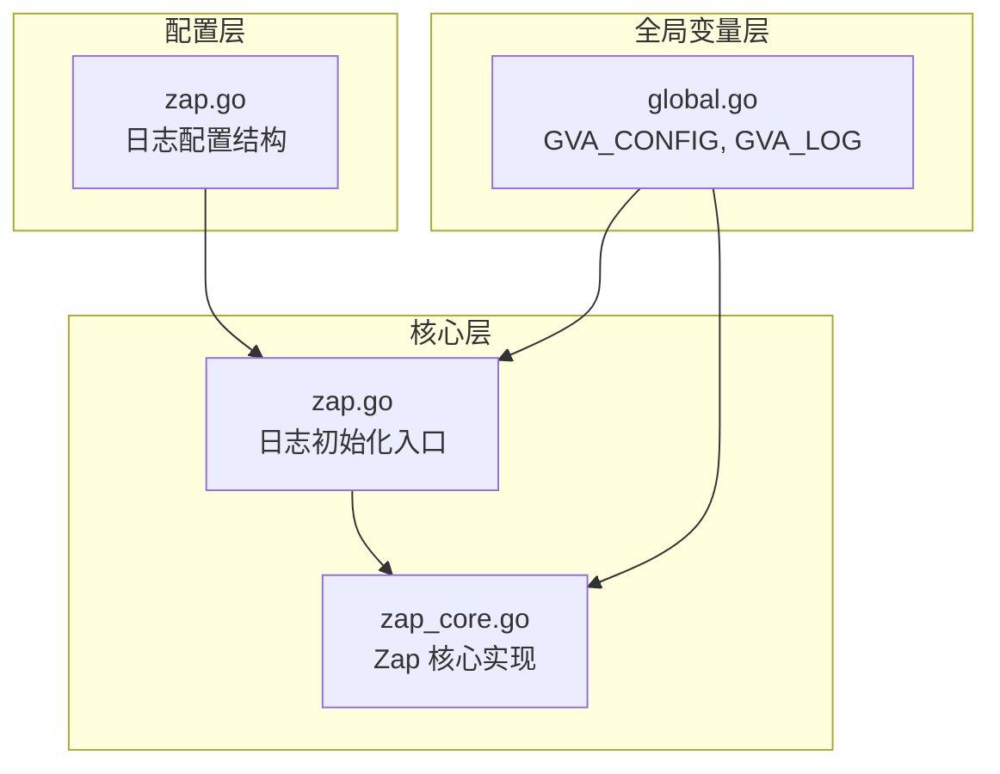
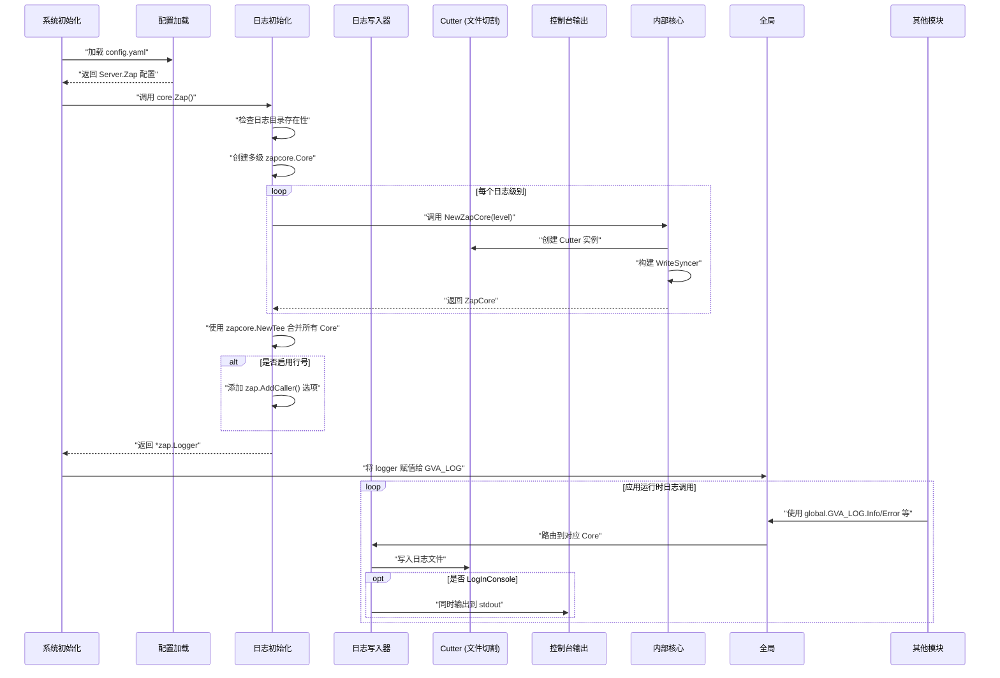
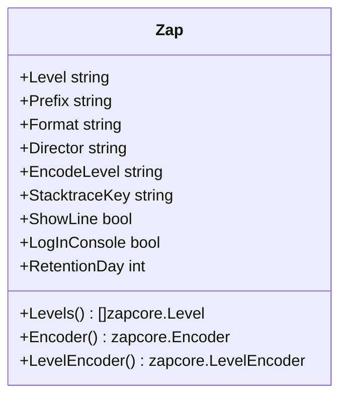
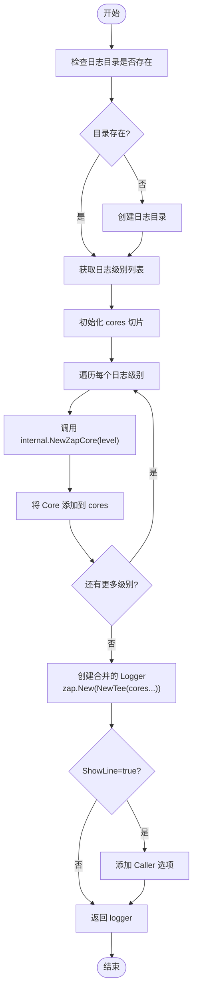
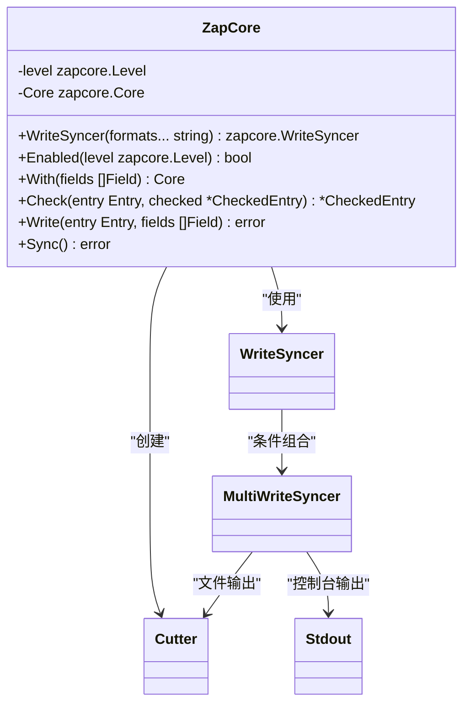
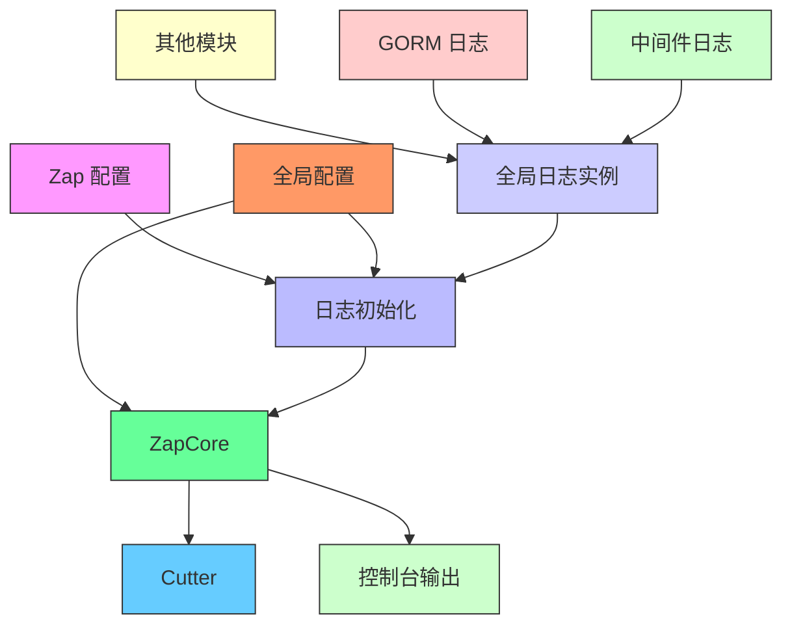

# 日志系统初始化

<cite>
**本文档引用文件**  
- [zap.go](file://server/core/zap.go)
- [zap.go](file://server/config/zap.go)
- [zap_core.go](file://server/core/internal/zap_core.go)
- [global.go](file://server/global/global.go)
</cite>

## 目录
1. [简介](#简介)
2. [项目结构](#项目结构)
3. [核心组件](#核心组件)
4. [架构概述](#架构概述)
5. [详细组件分析](#详细组件分析)
6. [依赖分析](#依赖分析)
7. [性能考量](#性能考量)
8. [故障排除指南](#故障排除指南)
9. [结论](#结论)

## 简介
本文档全面介绍基于 Zap 的日志系统在 gin-vue-admin 项目中的初始化配置与使用规范。重点说明如何根据 `config/zap.go` 中的配置创建结构化日志记录器，支持控制台输出、文件滚动、级别过滤等功能。同时解释日志切割策略（按大小/日期）、保留天数、压缩归档等参数的实际效果，并提供自定义字段注入和上下文追踪集成方法。

## 项目结构

**图示来源**
- [zap.go](file://server/config/zap.go#L1-L70)
- [zap.go](file://server/core/zap.go#L1-L30)
- [zap_core.go](file://server/core/internal/zap_core.go#L1-L68)
- [global.go](file://server/global/global.go#L1-L68)

**本节来源**
- [zap.go](file://server/config/zap.go#L1-L70)
- [zap.go](file://server/core/zap.go#L1-L30)

## 核心组件

该日志系统由四个关键部分构成：配置定义 (`config/zap.go`)、初始化逻辑 (`core/zap.go`)、底层核心实现 (`core/internal/zap_core.go`) 和全局状态管理 (`global/global.go`)。通过这些组件协同工作，实现了灵活可配置的高性能日志系统。

**本节来源**
- [zap.go](file://server/config/zap.go#L1-L70)
- [zap.go](file://server/core/zap.go#L1-L30)
- [zap_core.go](file://server/core/internal/zap_core.go#L1-L68)
- [global.go](file://server/global/global.go#L30-L33)

## 架构概述

**图示来源**
- [zap.go](file://server/core/zap.go#L14-L31)
- [zap_core.go](file://server/core/internal/zap_core.go#L15-L23)
- [zap_core.go](file://server/core/internal/zap_core.go#L25-L37)
- [global.go](file://server/global/global.go#L33-L33)

## 详细组件分析

### 配置结构分析

`Zap` 结构体定义了所有可配置的日志参数：

**图示来源**
- [zap.go](file://server/config/zap.go#L7-L15)

#### 功能说明
- **Level**: 设置最低日志级别（debug/info/warn/error/fatal）
- **Prefix**: 日志时间戳前缀
- **Format**: 输出格式（json/console）
- **Director**: 日志文件存储目录
- **EncodeLevel**: 日志级别编码方式（带颜色/不带颜色，大小写）
- **ShowLine**: 是否显示代码行号
- **LogInConsole**: 是否同时输出到控制台
- **RetentionDay**: 日志文件保留天数

**本节来源**
- [zap.go](file://server/config/zap.go#L7-L15)

### 初始化流程分析

`core/zap.go` 中的 `Zap()` 函数负责创建最终的 `*zap.Logger` 实例。

**图示来源**
- [zap.go](file://server/core/zap.go#L14-L31)

**本节来源**
- [zap.go](file://server/core/zap.go#L14-L31)

### 核心写入机制分析

`ZapCore` 类型封装了 zapcore.Core 并实现了动态路径切换能力。

**图示来源**
- [zap_core.go](file://server/core/internal/zap_core.go#L10-L67)

特别地，在 `Write()` 方法中支持通过特定字段（如 business/folder/directory）动态改变日志输出路径，实现业务隔离。

**本节来源**
- [zap_core.go](file://server/core/internal/zap_core.go#L10-L67)

## 依赖分析

**图示来源**
- [zap.go](file://server/config/zap.go#L7-L15)
- [zap.go](file://server/core/zap.go#L14-L31)
- [zap_core.go](file://server/core/internal/zap_core.go#L10-L67)
- [global.go](file://server/global/global.go#L30-L33)

**本节来源**
- [zap.go](file://server/config/zap.go#L7-L15)
- [zap.go](file://server/core/zap.go#L14-L31)
- [zap_core.go](file://server/core/internal/zap_core.go#L10-L67)
- [global.go](file://server/global/global.go#L30-L33)

## 性能考量

Zap 是一个高性能日志库，其性能优势主要体现在：
- 使用结构化日志而非字符串拼接
- 零分配 API 设计减少 GC 压力
- 并行处理多个日志级别
- 支持异步写入（需额外配置）

在高并发场景下，建议：
1. 避免频繁调用带有大量字段的日志语句
2.