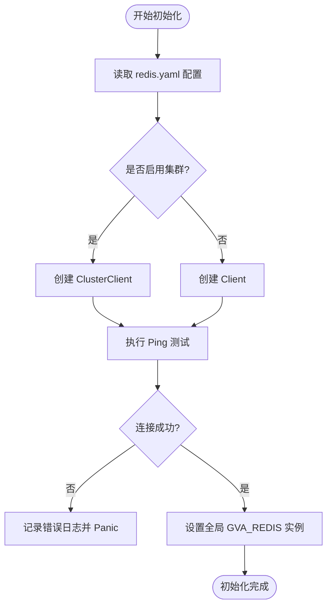
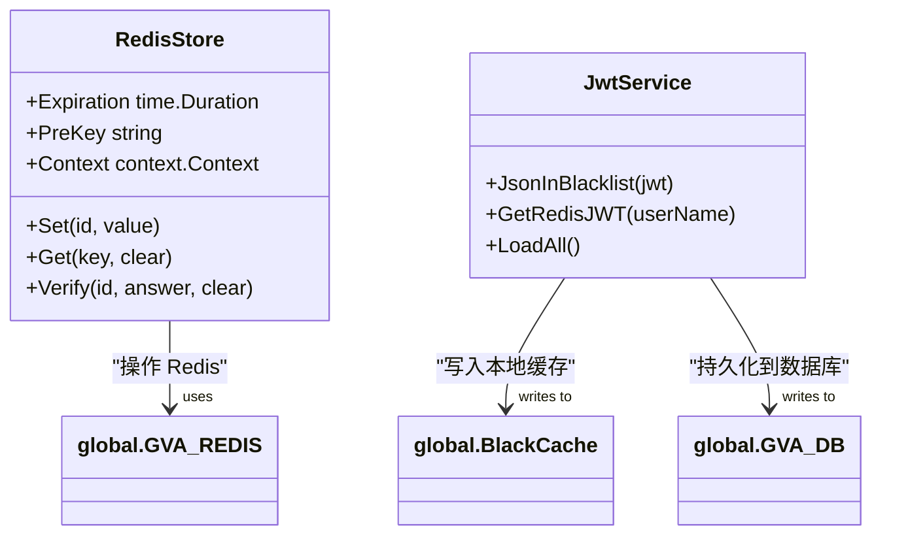

# 缓存系统初始化

<cite>
**本文档引用的文件**
- [redis.go](file://server/config/redis.go)
- [redis.go](file://server/initialize/redis.go)
- [redis.go](file://server/utils/captcha/redis.go)
- [global.go](file://server/global/global.go)
- [jwt_black_list.go](file://server/service/system/jwt_black_list.go)
</cite>

## 目录
1. [Redis 客户端初始化过程](#redis-客户端初始化过程)
2. [Redis 在项目中的核心角色](#redis-在项目中的核心角色)
3. [连接异常处理与断线重连策略](#连接异常处理与断线重连策略)
4. [性能监控指标采集方法](#性能监控指标采集方法)
5. [生产环境高可用部署最佳实践](#生产环境高可用部署最佳实践)

## Redis 客户端初始化过程

Redis 客户端的初始化由 `initialize/redis.go` 中的 `Redis()` 函数完成,该函数通过读取配置文件中定义的 `Redis` 结构体信息来建立连接。初始化流程包括从单例或集群模式中选择合适的连接方式,并设置数据库编号、密码等参数。

当 `UseCluster` 为 true 时,系统将使用 `redis.NewClusterClient` 创建集群客户端；否则使用 `redis.NewClient` 创建单实例客户端。连接建立后会执行 Ping 操作验证连通性,并记录日志。若连接失败,则抛出 panic 阻止服务启动。

**Diagram sources**
- [redis.go](file://server/initialize/redis.go#L12-L36)
- [redis.go](file://server/config/redis.go#L2-L9)

**Section sources**
- [redis.go](file://server/initialize/redis.go#L38-L44)
- [redis.go](file://server/config/redis.go#L2-L9)

## Redis 在项目中的核心角色

Redis 在本项目中承担多个关键职责:

### JWT 黑名单存储
用户登出时,JWT Token 被加入黑名单以防止再次使用。此功能通过调用 `/jwt/jsonInBlacklist` 接口实现,服务层将 token 写入数据库并同步至本地缓存 `BlackCache`,同时利用 Redis 提供快速查询能力。

### 验证码缓存
验证码模块使用 Redis 存储生成的 CAPTCHA 数据,前缀为 `"CAPTCHA_"`,有效期默认为 180 秒。`RedisStore` 实现了 `Set`、`Get` 和 `Verify` 方法,支持自动清除机制。

### 权限策略缓存
Casbin 权限规则通过 Redis 进行缓存加速,避免频繁访问数据库。每次权限变更后触发策略重载,确保实时生效。

**Diagram sources**
- [redis.go](file://server/utils/captcha/redis.go#L3-L60)
- [jwt_black_list.go](file://server/service/system/jwt_black_list.go#L0-L51)

**Section sources**
- [redis.go](file://server/utils/captcha/redis.go#L3-L60)
- [jwt_black_list.go](file://server/service/system/jwt_black_list.go#L0-L51)

## 连接异常处理与断线重连策略

系统在初始化阶段即进行连接测试,若 `Ping` 失败则直接 panic 终止程序。运行期间未显式实现自动重连逻辑,依赖 `go-redis` 客户端自身的连接池管理和底层 TCP 重试机制。

对于集群模式,客户端具备节点故障转移能力；单实例模式下建议结合外部健康检查和服务编排工具(如 Kubernetes)实现故障恢复。

日志记录采用 `zap` 库,在连接失败或操作异常时输出详细错误信息,便于排查问题。

**Section sources**
- [redis.go](file://server/initialize/redis.go#L12-L36)
- [global.go](file://server/global/global.go#L27-L27)

## 性能监控指标采集方法

目前系统未集成专门的 Redis 性能监控组件,但可通过以下方式获取基础指标:

- 利用 `redis.StatusCmd` 获取 INFO 信息,提取内存、QPS、连接数等数据。
- 结合 Zap 日志分析高频操作耗时。
- 使用 Prometheus 导出器扩展采集能力(需额外集成)。

建议在生产环境中引入 `redis_exporter` 并对接 Grafana 实现可视化监控。

**Section sources**
- [redis.go](file://server/initialize/redis.go#L12-L36)
- [global.go](file://server/global/global.go#L27-L27)

## 生产环境高可用部署最佳实践

### 部署架构
推荐采用 Redis 哨兵模式或 Redis Cluster 架构,避免单点故障。若使用云服务商托管实例(如 AWS ElastiCache、阿里云 Redis),可直接启用多可用区部署。

### 配置优化
- 设置合理的最大连接数和超时时间
- 启用 AOF 持久化保障数据安全
- 配置合适的内存淘汰策略(如 `allkeys-lru`)

### 安全措施
- 启用密码认证
- 限制网络访问白名单
- 定期轮换密钥

### 监控告警
- 部署 Prometheus + Alertmanager 实现阈值告警
- 监控 key 过期率、慢查询、CPU/内存使用率等核心指标

**Section sources**
- [redis.go](file://server/config/redis.go#L2-L9)
- [redis.go](file://server/initialize/redis.go#L12-L36)