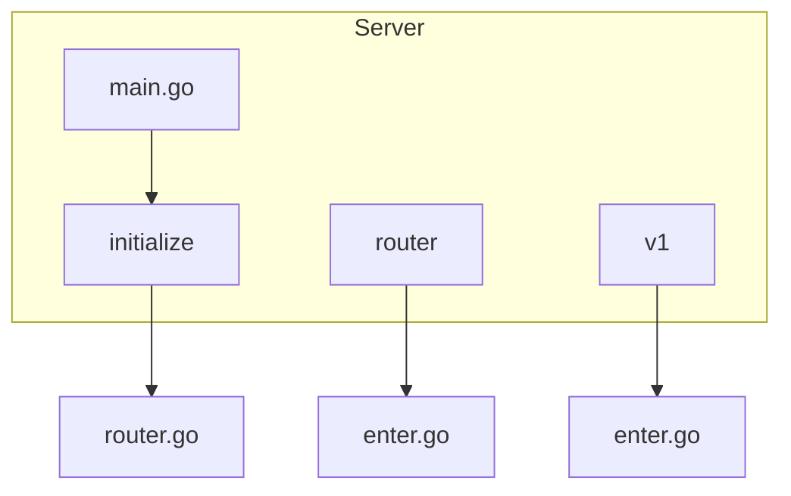
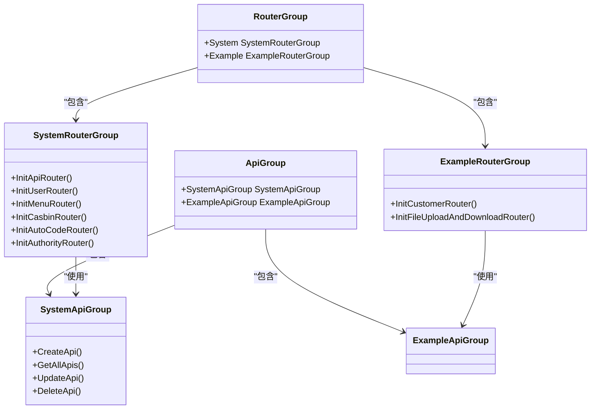
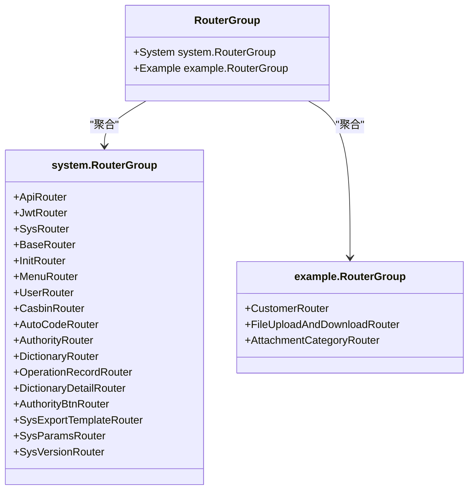
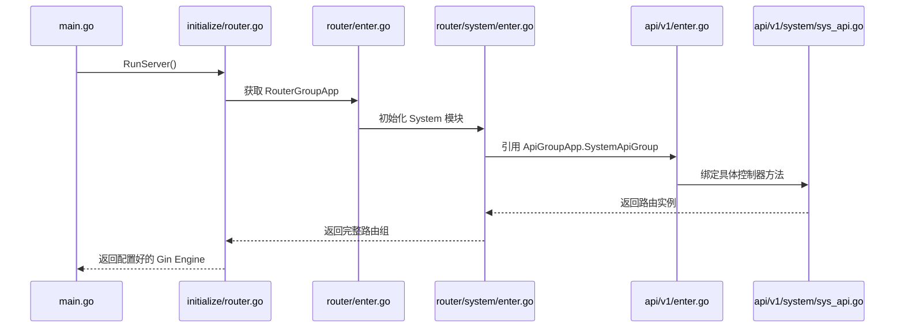
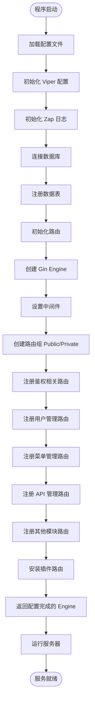
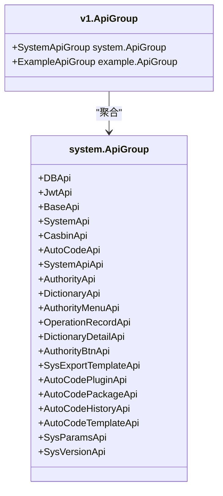
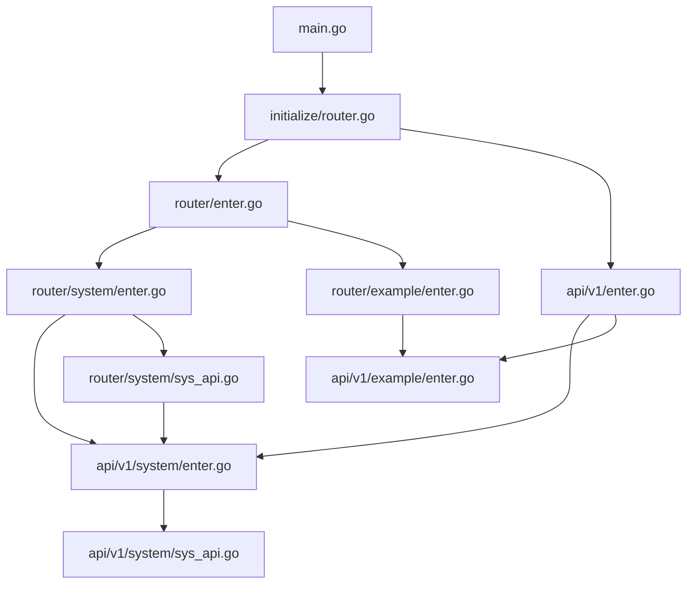

# 基础路由初始化

<cite>
**本文档中引用的文件**
- [router/enter.go](file://server/router/enter.go)
- [api/v1/enter.go](file://server/api/v1/enter.go)
- [router/system/enter.go](file://server/router/system/enter.go)
- [api/v1/system/enter.go](file://server/api/v1/system/enter.go)
- [initialize/router.go](file://server/initialize/router.go)
- [main.go](file://server/main.go)
- [router/system/sys_api.go](file://server/router/system/sys_api.go)
- [api/v1/system/sys_api.go](file://server/api/v1/system/sys_api.go)
</cite>

## 目录
1. [简介](#简介)
2. [项目结构](#项目结构)
3. [核心组件](#核心组件)
4. [架构概述](#架构概述)
5. [详细组件分析](#详细组件分析)
6. [依赖分析](#依赖分析)
7. [性能考虑](#性能考虑)
8. [故障排除指南](#故障排除指南)
9. [结论](#结论)

## 简介
本文件详细说明了 Gin-Vue-Admin 项目的路由注册流程，重点描述 `router.go` 如何调用 `enter.go` 初始化路由分组，并逐层加载系统模块（如用户、权限、API管理等）的路由定义。文档还解释了 v1 API 版本控制机制以及路由与控制器之间的映射关系。

## 项目结构

**图示来源**
- [router/enter.go](file://server/router/enter.go#L1-L14)
- [api/v1/enter.go](file://server/api/v1/enter.go#L1-L14)
- [initialize/router.go](file://server/initialize/router.go#L1-L124)

**章节来源**
- [router/enter.go](file://server/router/enter.go#L1-L14)
- [api/v1/enter.go](file://server/api/v1/enter.go#L1-L14)

## 核心组件

在 Gin-Vue-Admin 中，路由系统的初始化由多个核心组件协同完成。`router/enter.go` 定义了全局路由分组结构，通过嵌入式结构体组合方式聚合所有模块的路由。`api/v1/enter.go` 则定义了 API 分组结构，为各模块提供统一访问入口。`initialize/router.go` 负责实际的路由注册过程，将各个模块的路由挂载到 Gin 引擎上。

**章节来源**
- [router/enter.go](file://server/router/enter.go#L1-L14)
- [api/v1/enter.go](file://server/api/v1/enter.go#L1-L14)
- [initialize/router.go](file://server/initialize/router.go#L1-L124)

## 架构概述

**图示来源**
- [router/enter.go](file://server/router/enter.go#L9-L12)
- [api/v1/enter.go](file://server/api/v1/enter.go#L9-L12)
- [router/system/enter.go](file://server/router/system/enter.go#L4-L22)
- [api/v1/system/enter.go](file://server/api/v1/system/enter.go#L4-L25)

## 详细组件分析

### 路由分组初始化分析

#### 对象导向组件：

**图示来源**
- [router/enter.go](file://server/router/enter.go#L9-L12)
- [router/system/enter.go](file://server/router/system/enter.go#L4-L22)
- [router/example/enter.go](file://server/router/example/enter.go#L6-L10)

#### API服务组件：

**图示来源**
- [main.go](file://server/main.go#L1-L52)
- [initialize/router.go](file://server/initialize/router.go#L1-L124)
- [router/enter.go](file://server/router/enter.go#L7-L12)
- [router/system/enter.go](file://server/router/system/enter.go#L24-L46)
- [api/v1/enter.go](file://server/api/v1/enter.go#L7-L12)
- [api/v1/system/enter.go](file://server/api/v1/system/enter.go#L27-L49)

#### 复杂逻辑组件：

**图示来源**
- [main.go](file://server/main.go#L1-L52)
- [initialize/router.go](file://server/initialize/router.go#L1-L124)

**章节来源**
- [main.go](file://server/main.go#L1-L52)
- [initialize/router.go](file://server/initialize/router.go#L1-L124)

### v1 API版本控制机制分析

v1 API 版本控制通过 `api/v1` 包实现模块化组织。每个子模块（如 system、example）都有独立的 `ApiGroup` 结构体，通过 `ApiGroupApp` 全局变量统一管理。这种设计实现了版本隔离和模块解耦，便于未来扩展 v2 或更高版本的 API。

**图示来源**
- [api/v1/enter.go](file://server/api/v1/enter.go#L9-L12)
- [api/v1/system/enter.go](file://server/api/v1/system/enter.go#L4-L25)

**章节来源**
- [api/v1/enter.go](file://server/api/v1/enter.go#L1-L14)
- [api/v1/system/enter.go](file://server/api/v1/system/enter.go#L1-L50)

## 依赖分析

**图示来源**
- [main.go](file://server/main.go#L1-L52)
- [initialize/router.go](file://server/initialize/router.go#L1-L124)
- [router/enter.go](file://server/router/enter.go#L1-L14)
- [api/v1/enter.go](file://server/api/v1/enter.go#L1-L14)

**章节来源**
- [main.go](file://server/main.go#L1-L52)
- [initialize/router.go](file://server/initialize/router.go#L1-L124)

## 性能考虑
路由初始化过程采用懒加载模式，在应用启动时一次性完成所有路由注册，避免运行时动态注册带来的性能开销。通过中间件链式调用优化请求处理流程，确保高并发场景下的稳定性能表现。

## 故障排除指南

当遇到路由无法访问的问题时，应检查以下几点：
1. 确认对应模块的 `InitXXXRouter` 方法是否已在 `initialize/router.go` 中正确调用
2. 检查 `router/enter.go` 是否已导入相应模块的路由包
3. 验证 `api/v1/enter.go` 是否已声明对应的 API 分组
4. 确保控制器方法签名正确且已绑定到正确的路由路径

**章节来源**
- [initialize/router.go](file://server/initialize/router.go#L1-L124)
- [router/enter.go](file://server/router/enter.go#L1-L14)
- [api/v1/enter.go](file://server/api/v1/enter.go#L1-L14)

## 结论
Gin-Vue-Admin 的路由系统采用分层模块化设计，通过 `enter.go` 文件实现路由分组的初始化和聚合。该设计具有良好的可扩展性和维护性，支持灵活的 API 版本管理和模块化开发。v