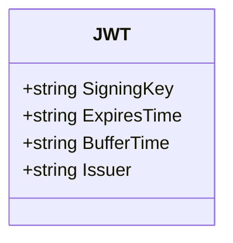
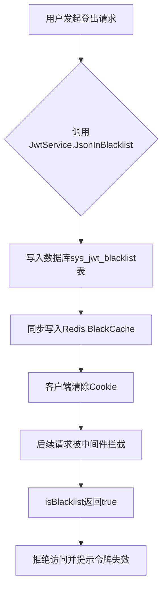

# JWT 认证配置

<cite>
**本文档引用文件**  
- [jwt.go](file://server/config/jwt.go)
- [middleware/jwt.go](file://server/middleware/jwt.go)
- [sys_jwt_blacklist.go](file://server/model/system/sys_jwt_blacklist.go)
- [jwt_black_list.go](file://server/service/system/jwt_black_list.go)
- [utils/jwt.go](file://server/utils/jwt.go)
- [request/jwt.go](file://server/model/system/request/jwt.go)
- [global.go](file://server/global/global.go)
</cite>

## 目录
1. [简介](#简介)
2. [JWT 配置参数详解](#jwt-配置参数详解)
3. [中间件请求拦截与身份验证流程](#中间件请求拦截与身份验证流程)
4. [Token 注销与黑名单机制](#token-注销与黑名单机制)
5. [安全最佳实践](#安全最佳实践)
6. [总结](#总结)

## 简介
本项目采用基于 JWT(JSON Web Token)的无状态认证机制,实现用户登录后的身份验证与权限控制。系统通过配置签名密钥、过期时间、签发者等参数确保 Token 安全性,并结合 Redis 缓存与数据库持久化实现 Token 黑名单管理,支持用户登出后立即失效 Token。中间件层负责拦截请求、解析 Token 并提取用户信息,为后续业务逻辑提供身份上下文。

## JWT 配置参数详解

`server/config/jwt.go` 文件定义了 JWT 的核心配置项,这些参数直接影响 Token 的安全性与生命周期:



**图示来源**
- [jwt.go](file://server/config/jwt.go#L3-L9)

### 关键字段说明

| 字段名 | 作用 | 推荐设置 |
|--------|------|----------|
| `SigningKey` | HMAC 签名密钥,用于生成和验证 Token 签名 | 至少 32 位随机字符串,建议使用环境变量注入 |
| `ExpiresTime` | Token 过期时间,如 "72h" 表示 72 小时 | 建议不超过 24 小时,短周期降低泄露风险 |
| `BufferTime` | 刷新缓冲时间,在此时间内自动刷新 Token | 设置为总有效期的 1/3,例如 8 小时 |
| `Issuer` | 签发者标识,防止跨系统伪造 | 明确指定服务名称,如 "gin-vue-admin" |

该配置在程序启动时加载至全局变量 `global.GVA_CONFIG.JWT`,供其他模块调用。

**节来源**
- [jwt.go](file://server/config/jwt.go#L3-L9)
- [global.go](file://server/global/global.go#L30)

## 中间件请求拦截与身份验证流程

`middleware/jwt.go` 实现了 JWT 中间件,负责拦截所有受保护路由的 HTTP 请求,完成 Token 验证与用户身份注入。

### 执行流程分析

```mermaid
sequenceDiagram
participant Client as 客户端
participant Middleware as JWT中间件
participant Utils as JWT工具类
participant Redis as Redis缓存
Client->>Middleware : 发送请求(x-token头)
Middleware->>Utils : GetToken(从Cookie或Header获取)
alt 未携带Token
Middleware->>Client : 返回401未授权
stop
end
Middleware->>Redis : isBlacklist?(查询是否在黑名单)
alt 在黑名单中
Middleware->>Client : 返回令牌失效+清除Cookie
stop
end
Middleware->>Utils : NewJWT() 创建JWT实例
Utils-->>Middleware : 返回JWT对象
Middleware->>Utils : ParseToken(解析Token内容)
alt 解析失败
alt Token已过期
Middleware->>Client : 返回“登录已过期”
else 其他错误
Middleware->>Client : 返回具体错误信息
end
Middleware->>Utils : ClearToken(清除客户端Token)
stop
end
Middleware->>Middleware : 检查是否接近过期(BufferTime内)
alt 是,则刷新Token
Middleware->>Utils : CreateTokenByOldToken(旧Token生成新Token)
Utils-->>Middleware : 返回新Token
Middleware->>Client : 设置new-token响应头
Middleware->>Redis : SetRedisJWT(更新Redis中的Token)
end
Middleware->>Middleware : c.Set("claims", claims) 注入上下文
Middleware->>Client : 继续处理请求(c.Next())
```

**图示来源**
- [middleware/jwt.go](file://server/middleware/jwt.go#L10-L88)
- [utils/jwt.go](file://server/utils/jwt.go#L25-L29)

### 核心功能点

- **多源 Token 获取**:支持从 Cookie 或 Header 提取 `x-token`
- **黑名单检查**:每次请求前校验 Token 是否已被拉黑
- **自动刷新机制**:在缓冲期内自动生成新 Token,提升用户体验
- **上下文注入**:将解析出的用户声明(Claims)存入 Gin 上下文,供后续处理器使用

**节来源**
- [middleware/jwt.go](file://server/middleware/jwt.go#L10-L88)
- [utils/claims.go](file://server/utils/claims.go#L13-L25)

## Token 注销与黑名单机制

为实现用户主动登出后 Token 失效,系统设计了双层黑名单机制:内存缓存 + 数据库持久化。

### 黑名单数据结构

```go
type JwtBlacklist struct {
	global.GVA_MODEL
	Jwt string `gorm:"type:text;comment:jwt"`
}
```

存储于 `sys_jwt_blacklist` 表中,记录所有被注销的 Token。

### 注销流程

当用户执行登出操作时,触发以下流程:



**图示来源**
- [sys_jwt_blacklist.go](file://server/model/system/sys_jwt_blacklist.go#L3-L10)
- [jwt_black_list.go](file://server/service/system/jwt_black_list.go#L15-L25)

### 初始化加载机制

系统启动时会调用 `LoadAll()` 方法,将数据库中所有历史黑名单 Token 加载到本地缓存 `BlackCache` 中,避免频繁查询数据库影响性能。

**节来源**
- [jwt_black_list.go](file://server/service/system/jwt_black_list.go#L40-L52)
- [sys_jwt_blacklist.go](file://server/model/system/sys_jwt_blacklist.go#L3-L10)

## 安全最佳实践

### 防止重放攻击

- 所有敏感接口应启用 JWT 认证中间件
- 使用 HTTPS 传输,防止 Token 被窃听
- 设置合理过期时间(建议 ≤24h),减少暴露窗口

### 密钥轮换策略

虽然当前实现未直接支持密钥轮换,但可通过以下方式升级:
- 部署新版本时更换 `SigningKey` 配置
- 强制所有在线用户重新登录
- 渐进式淘汰旧密钥签发的 Token(需扩展解析逻辑支持多密钥)

### Token 刷新机制

系统已在中间件中实现自动刷新:
- 当剩余有效期小于 `BufferTime` 时触发刷新
- 新 Token 通过响应头 `new-token` 和 `new-expires-at` 返回前端
- 前端需监听并更新本地存储的 Token

### Redis 缓存优化

- 使用 `SetRedisJWT` 将用户名与最新 Token 关联
- 支持多点登录场景下的 Token 跟踪
- 结合 `UseMultipoint` 配置开关灵活启用

**节来源**
- [utils/jwt.go](file://server/utils/jwt.go#L95-L105)
- [middleware/jwt.go](file://server/middleware/jwt.go#L60-L75)

## 总结

本系统实现了完整的基于 JWT 的无状态认证方案,具备以下特点:
- 配置灵活:关键参数集中管理,易于调整
- 安全可靠:支持黑名单机制,可即时吊销 Token
- 用户友好:内置自动刷新,减少重复登录
- 扩展性强:基于 Gin 中间件架构,便于集成其他安全策略

通过合理配置参数