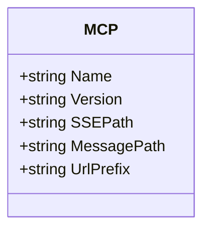
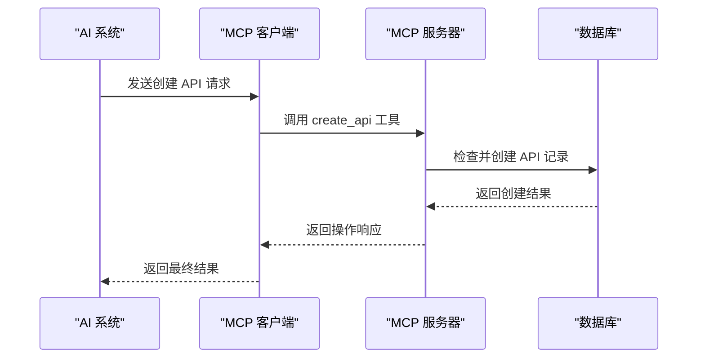
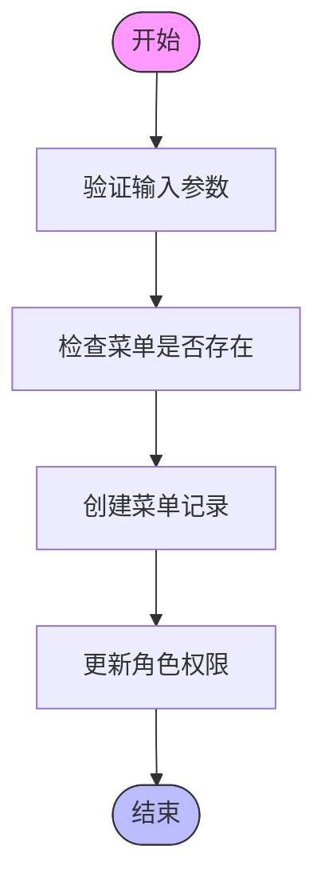
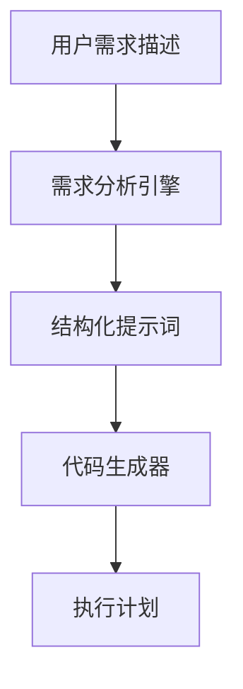
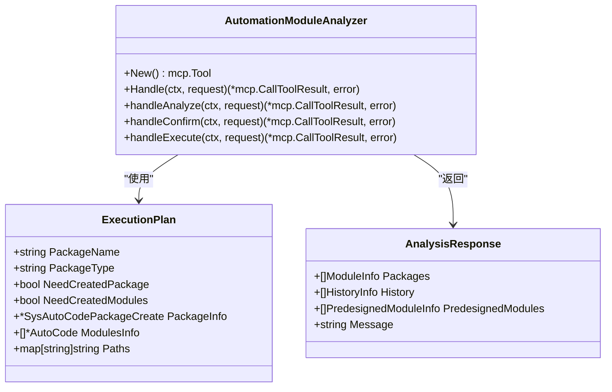
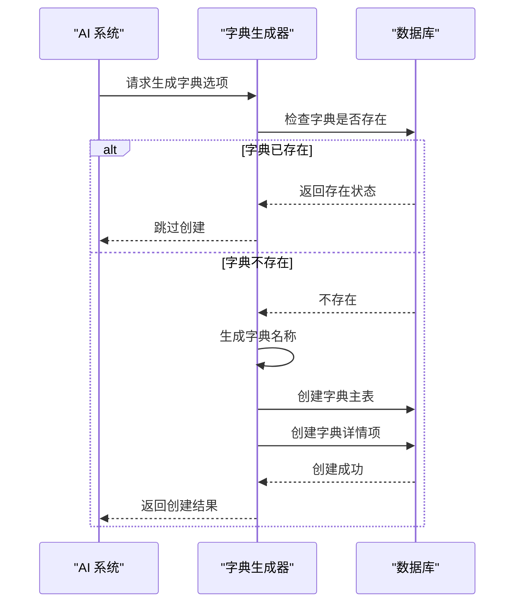
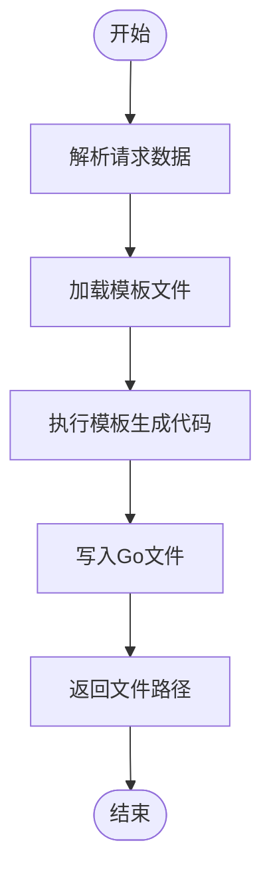
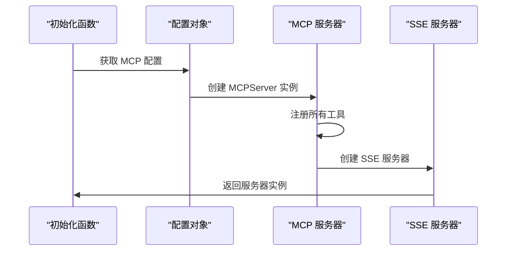

# MCP 协议配置

<cite>
**本文档引用文件**
- [mcp.go](file://server/config/mcp.go)
- [auto_code_mcp.go](file://server/api/v1/system/auto_code_mcp.go)
- [auto_code_mcp.go](file://server/service/system/auto_code_mcp.go)
- [sys_auto_code_mcp.go](file://server/model/system/request/sys_auto_code_mcp.go)
- [gva_auto_generate.go](file://server/mcp/gva_auto_generate.go)
- [api_creator.go](file://server/mcp/api_creator.go)
- [menu_creator.go](file://server/mcp/menu_creator.go)
- [requirement_analyzer.go](file://server/mcp/requirement_analyzer.go)
- [dictionary_generator.go](file://server/mcp/dictionary_generator.go)
- [enter.go](file://server/mcp/enter.go)
- [mcp.go](file://server/initialize/mcp.go)
</cite>

## 目录
1. [MCP 配置结构解析](#mcp-配置结构解析)
2. [AI 辅助开发能力集成](#ai-辅助开发能力集成)
3. [核心组件功能详解](#核心组件功能详解)
4. [前后端联动实现路径](#前后端联动实现路径)
5. [调试与代理设置](#调试与代理设置)

## MCP 配置结构解析

`mcp.go` 文件定义了 MCP 服务的核心配置结构,包含服务端点、API 密钥、上下文长度、模型标识等关键参数。该配置通过 Viper 进行管理,并在系统启动时加载。



**图表来源**
- [mcp.go](file://server/config/mcp.go#L3-L10)

**章节来源**
- [mcp.go](file://server/config/mcp.go#L3-L10)

## AI 辅助开发能力集成

MCP 协议通过 `server/mcp/` 目录下的多个组件实现 AI 辅助开发能力的集成。这些组件作为工具注册到 MCP 服务器中,供 AI 调用以完成特定任务。

### API 创建器

`api_creator.go` 实现了自动创建后端 API 记录的功能。当 AI 编辑器需要添加新的 API 接口时,可通过此工具自动创建对应的权限记录。



**图表来源**
- [api_creator.go](file://server/mcp/api_creator.go#L38-L201)

**章节来源**
- [api_creator.go](file://server/mcp/api_creator.go#L38-L201)

### 菜单生成器

`menu_creator.go` 提供了前端菜单项的自动化生成功能。当需要为新功能模块创建前端页面时,可通过此工具自动生成对应的菜单配置。



**图表来源**
- [menu_creator.go](file://server/mcp/menu_creator.go#L37-L287)

**章节来源**
- [menu_creator.go](file://server/mcp/menu_creator.go#L37-L287)

### 需求分析器

`requirement_analyzer.go` 是所有 MCP 工具的首选入口,负责将用户的自然语言需求转换为 AI 可理解的结构化提示词,引导后续的代码生成流程。



**图表来源**
- [requirement_analyzer.go](file://server/mcp/requirement_analyzer.go#L26-L139)

**章节来源**
- [requirement_analyzer.go](file://server/mcp/requirement_analyzer.go#L26-L139)

## 核心组件功能详解

### 自动化模块分析器

`gva_auto_generate.go` 中的 `AutomationModuleAnalyzer` 是核心执行工具,接收 `requirement_analyzer` 的分析结果并执行具体的模块创建操作。它支持批量创建多个模块,并能自动处理字典创建等关联任务。



**图表来源**
- [gva_auto_generate.go](file://server/mcp/gva_auto_generate.go#L38-L799)

**章节来源**
- [gva_auto_generate.go](file://server/mcp/gva_auto_generate.go#L38-L799)

### 字典选项生成器

`dictionary_generator.go` 提供智能字典选项生成功能。当字段需要使用字典类型时,系统会自动检查字典是否存在,若不存在则创建对应的字典及默认选项。



**图表来源**
- [dictionary_generator.go](file://server/mcp/dictionary_generator.go#L26-L310)

**章节来源**
- [dictionary_generator.go](file://server/mcp/dictionary_generator.go#L26-L310)

## 前后端联动实现路径

`auto_code_mcp.go` 文件实现了前后端联动的关键接口,通过 MCP 协议连接 AI 系统与后端服务。

### 服务端点配置

在 `server/api/v1/system/auto_code_mcp.go` 中定义了三个主要端点:

- `/autoCode/mcp`: 创建 MCP 工具
- `/autoCode/mcpList`: 获取可用工具列表
- `/autoCode/mcpTest`: 测试 MCP 工具调用

```mermaid
graph LR
Frontend[前端界面] --> |HTTP POST| MCPCreate[/autoCode/mcp]
Frontend --> |HTTP POST| MCPTList[/autoCode/mcpList]
Frontend --> |HTTP POST| MCPTTest[/autoCode/mcpTest]
MCPCreate --> Service[autoCodeTemplateService]
MCPTList --> Client[MCP 客户端]
MCPTTest --> Client
Service --> Response[创建成功响应]
Client --> Response[工具列表/测试结果]
```

**图表来源**
- [auto_code_mcp.go](file://server/api/v1/system/auto_code_mcp.go#L10-L144)

**章节来源**
- [auto_code_mcp.go](file://server/api/v1/system/auto_code_mcp.go#L10-L144)

### 服务层实现

`server/service/system/auto_code_mcp.go` 中的 `CreateMcp` 方法负责实际的 MCP 工具创建逻辑,使用 Go 模板引擎生成工具代码文件。



**图表来源**
- [auto_code_mcp.go](file://server/service/system/auto_code_mcp.go#L9-L45)

**章节来源**
- [auto_code_mcp.go](file://server/service/system/auto_code_mcp.go#L9-L45)

## 调试与代理设置

### 日志开启方法

要调试 MCP 通信链路,可以通过以下方式开启详细日志:

1. 在 `config.yaml` 中确保日志级别设置为 `debug`
2. 使用 `global.GVA_LOG` 记录关键操作
3. 在工具调用前后添加日志输出

```go
global.GVA_LOG.Info("API列表获取成功",
    zap.Int("数据库API数量", len(databaseApis)),
    zap.Int("gin路由API数量", len(ginApis)),
    zap.Int("总数量", response.TotalCount))
```

### 代理设置技巧

在 `server/initialize/mcp.go` 中,MCP 服务器的初始化过程允许灵活配置各种端点:



**图表来源**
- [mcp.go](file://server/initialize/mcp.go#L7-L25)

**章节来源**
- [mcp.go](file://server/initialize/mcp.go#L7-L25)