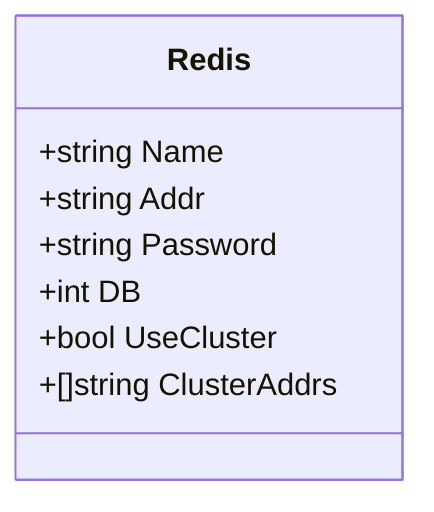
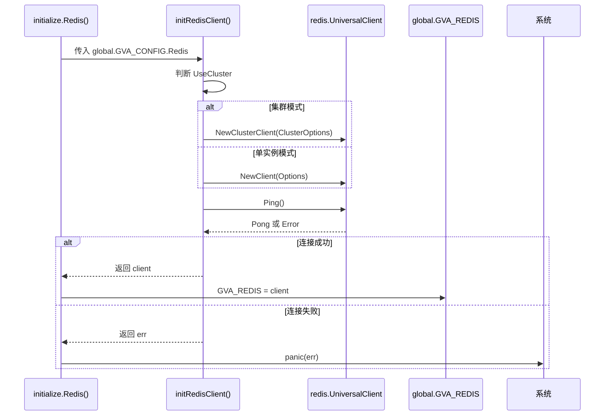

# Redis 配置

<cite>
**本文档引用的文件**
- [redis.go](file://server/config/redis.go)
- [redis.go](file://server/initialize/redis.go)
- [config.yaml](file://server/config.yaml)
- [global.go](file://server/global/global.go)
</cite>

## 目录
1. [Redis 配置结构体详解](#redis-配置结构体详解)
2. [Viper 配置绑定机制](#viper-配置绑定机制)
3. [Redis 客户端初始化流程](#redis-客户端初始化流程)
4. [多实例 Redis 支持与复用机制](#多实例-redis-支持与复用机制)
5. [高可用部署模式配置建议](#高可用部署模式配置建议)
6. [监控与优化策略](#监控与优化策略)

## Redis 配置结构体详解

`Redis` 结构体定义了 Redis 连接的核心参数，位于 `server/config/redis.go` 文件中。该结构体通过 `mapstructure` 标签与 YAML 配置文件进行映射，确保配置项正确加载。



**图示来源**
- [redis.go](file://server/config/redis.go#L3-L11)

**字段说明：**
- **Name**: 当前 Redis 实例的名称标识，用于多实例场景下的区分。
- **Addr**: Redis 服务器地址和端口（格式为 `host:port`），适用于单实例连接。
- **Password**: 认证密码，若未设置则为空字符串。
- **DB**: 指定使用的数据库索引号（仅适用于单实例模式）。
- **UseCluster**: 布尔值，指示是否启用 Redis 集群模式。
- **ClusterAddrs**: 集群节点地址列表，在 `UseCluster` 为 `true` 时生效。

**Section sources**
- [redis.go](file://server/config/redis.go#L3-L11)

## Viper 配置绑定机制

系统使用 Viper 库实现配置文件的读取与结构体绑定。`config.yaml` 中的 `redis` 块会自动映射到 `config.Redis` 结构体，得益于字段上的 `yaml` 和 `mapstructure` 标签。

例如，以下 YAML 配置：
```yaml
redis:
  name: primary
  addr: 127.0.0.1:6379
  password: ""
  db: 0
  useCluster: false
```
会被解析并填充至 `global.GVA_CONFIG.Redis` 变量中。

全局配置对象 `GVA_CONFIG` 在 `server/global/global.go` 中声明，并由 Viper 在启动时完成初始化。

**Section sources**
- [config.yaml](file://server/config.yaml#L228-L234)
- [global.go](file://server/global/global.go#L30)

## Redis 客户端初始化流程

Redis 客户端的初始化由 `initialize/redis.go` 文件中的 `Redis()` 函数完成。其核心逻辑如下：

1. 调用 `initRedisClient()` 函数，传入 `global.GVA_CONFIG.Redis` 配置。
2. 根据 `UseCluster` 字段判断连接模式：
   - 若启用集群，则创建 `redis.NewClusterClient`
   - 否则创建 `redis.NewClient` 单实例客户端
3. 执行 `PING` 命令测试连接连通性。
4. 将成功建立的客户端赋值给全局变量 `global.GVA_REDIS`。

若连接失败，将记录错误日志并触发 panic，阻止服务继续启动。



**图示来源**
- [redis.go](file://server/initialize/redis.go#L12-L36)
- [redis.go](file://server/initialize/redis.go#L38-L44)

**Section sources**
- [redis.go](file://server/initialize/redis.go#L12-L44)

## 多实例 Redis 支持与复用机制

系统支持多个 Redis 实例，通过 `RedisList` 功能实现。`config.yaml` 中可定义 `redis-list` 数组，每个条目包含独立的连接配置。

`initialize.RedisList()` 函数遍历 `global.GVA_CONFIG.RedisList`，为每个配置项调用 `initRedisClient()` 创建客户端，并以 `Name` 为键存入 `global.GVA_REDISList` 映射中。

此机制被 JWT 黑名单、验证码存储等功能模块复用。例如：
- JWT 黑名单可通过指定缓存实例进行快速查询
- 验证码服务可使用专用 Redis 实例避免资源争抢

```mermaid
flowchart TD
A[启动 RunServer] --> B{UseRedis?}
B --> |是| C[调用 initialize.Redis()]
B --> |否| D[跳过]
C --> E[创建 GVA_REDIS 全局客户端]
B --> F{UseMultipoint?}
F --> |是| G[调用 initialize.RedisList()]
G --> H[遍历 RedisList 配置]
H --> I[为每个配置创建客户端]
I --> J[存入 GVA_REDISList[name]]
J --> K[完成初始化]
```

**图示来源**
- [redis.go](file://server/initialize/redis.go#L46-L58)
- [server.go](file://server/core/server.go#L11-L53)

**Section sources**
- [redis.go](file://server/initialize/redis.go#L46-L58)
- [server.go](file://server/core/server.go#L11-L53)

## 高可用部署模式配置建议

### 集群模式配置
当需要高可用和横向扩展能力时，应启用集群模式：
```yaml
redis:
  useCluster: true
  clusterAddrs:
    - 172.21.0.3:7000
    - 172.21.0.4:7001
    - 172.21.0.2:7002
```
注意：在集群模式下，`Addr` 和 `DB` 字段将被忽略。

### 哨兵模式支持
当前代码未直接支持哨兵模式，但可通过外部代理或修改 `initRedisClient` 扩展支持。建议未来版本增加 `UseSentinel` 字段及相应客户端初始化逻辑。

### 多实例分离策略
推荐按功能划分 Redis 实例：
- `cache`: 缓存数据
- `session`: 用户会话
- `captcha`: 验证码存储
- `blacklist`: JWT 黑名单

通过 `redis-list` 配置实现物理隔离，提升安全性和性能。

**Section sources**
- [config.yaml](file://server/config.yaml#L235-L248)

## 监控与优化策略

### 连接泄漏防范
- 使用连接池管理（由 go-redis 内部实现）
- 设置合理的超时时间（目前依赖默认值，建议在 `Options` 中显式配置 `DialTimeout`, `ReadTimeout`, `WriteTimeout`）
- 定期检查 `CLIENT LIST` 输出，监控空闲连接数

### 网络延迟优化
- 部署 Redis 与应用在同一内网环境
- 使用短连接探测机制（当前已有 `Ping()` 测试）
- 启用 TCP KeepAlive（可在 `net.Dialer` 中配置）

### 监控建议
- 记录 `Ping()` 延迟日志，用于健康检查
- 监控 `INFO` 命令输出的关键指标（内存、连接数、命中率）
- 结合 Prometheus 导出器收集性能数据
- 对 `panic(err)` 场景添加告警通知

**Section sources**
- [redis.go](file://server/initialize/redis.go#L28-L34)