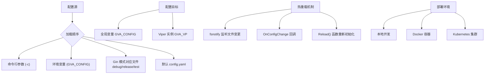
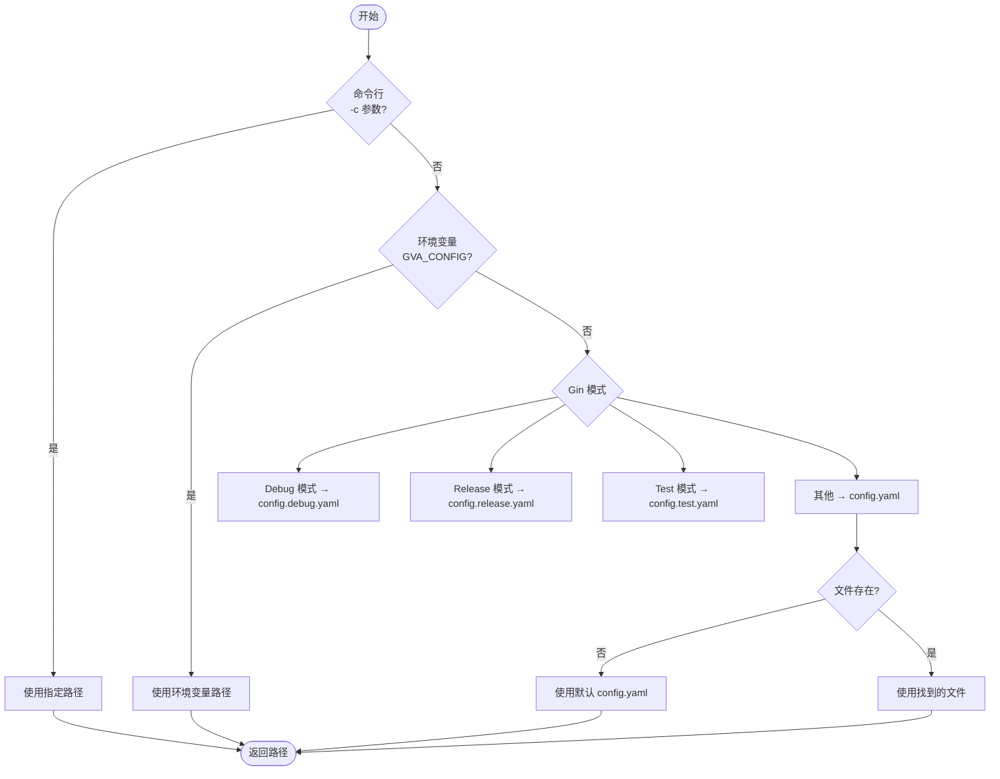
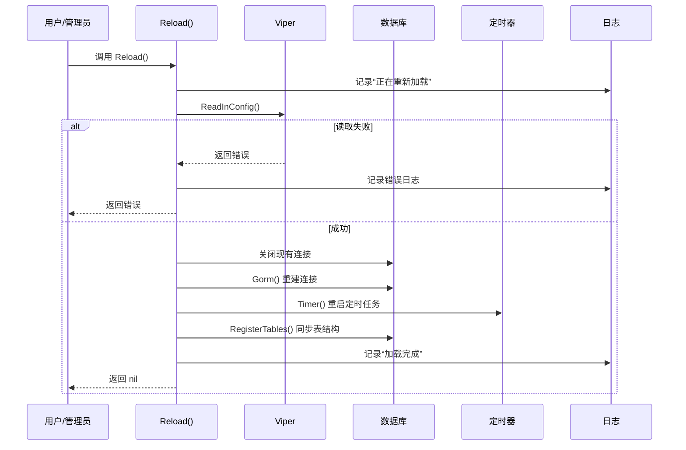
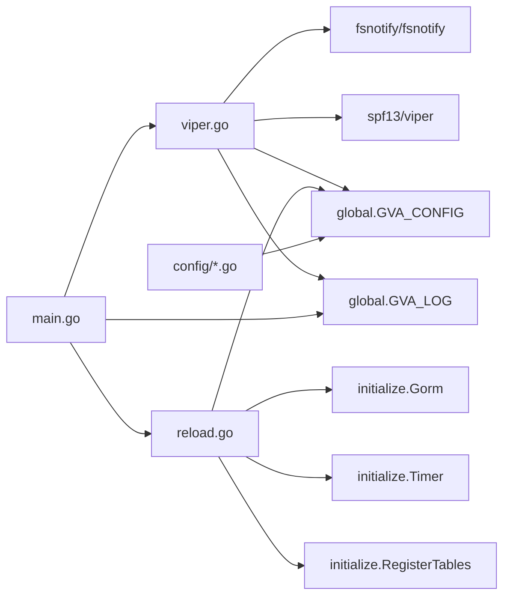

# 配置初始化

<cite>
**本文档中引用的文件**
- [viper.go](file://server/core/viper.go)
- [reload.go](file://server/initialize/reload.go)
- [config.yaml](file://server/config.yaml)
- [global.go](file://server/global/global.go)
- [system.go](file://server/config/system.go)
- [redis.go](file://server/config/redis.go)
- [gorm_pgsql.go](file://server/config/gorm_pgsql.go)
- [constant.go](file://server/core/internal/constant.go)
- [main.go](file://server/main.go)
- [entrypoint.sh](file://deploy/docker/entrypoint.sh)
- [gva-server-configmap.yaml](file://deploy/kubernetes/server/gva-server-configmap.yaml)
</cite>

## 目录
1. [简介](#简介)
2. [项目结构](#项目结构)
3. [核心组件](#核心组件)
4. [架构概述](#架构概述)
5. [详细组件分析](#详细组件分析)
6. [依赖分析](#依赖分析)
7. [性能考虑](#性能考虑)
8. [故障排除指南](#故障排除指南)
9. [结论](#结论)

## 简介
本文件深入讲解基于 Viper 的配置管理系统初始化过程。重点说明 `viper.go` 如何读取 `config.yaml` 或环境变量并映射到 `config` 包中的结构体(如 `system.DBConfig`、`system.Redis` 等)。同时解释在不同部署模式(本地开发、Docker、Kubernetes)下配置文件的加载优先级与覆盖机制,阐述配置项热重载(`reload.go`)的实现原理及使用场景,并列举常见配置错误(如数据库连接字符串格式错误)及其解决方案。

## 项目结构
该项目采用分层模块化设计,主要分为服务端(server)、前端(web)、部署脚本(deploy)三大部分。配置系统的核心位于 `server/core/viper.go`,通过 Viper 库实现多源配置加载和动态监听。配置定义分散在 `server/config/` 目录下的多个 Go 文件中,而默认配置值则由 `server/config.yaml` 提供。系统支持从命令行参数、环境变量、不同 Gin 模式对应的配置文件等多个来源加载配置,确保灵活性和可移植性。



**Diagram sources**
- [viper.go](file://server/core/viper.go#L1-L76)
- [config.yaml](file://server/config.yaml#L0-L248)
- [constant.go](file://server/core/internal/constant.go#L3-L8)

**Section sources**
- [viper.go](file://server/core/viper.go#L1-L76)
- [config.yaml](file://server/config.yaml#L0-L248)
- [constant.go](file://server/core/internal/constant.go#L3-L8)

## 核心组件

`viper.go` 是整个配置系统的入口点,负责解析配置路径、读取配置内容并将之反序列化为全局结构体 `GVA_CONFIG`。`reload.go` 则提供了运行时重新加载配置的能力,允许系统在不重启的情况下应用新的配置变更。这些功能共同构成了一个灵活且健壮的配置管理框架。

**Section sources**
- [viper.go](file://server/core/viper.go#L1-L76)
- [reload.go](file://server/initialize/reload.go#L1-L45)

## 架构概述

该配置系统采用集中式管理模式,所有配置最终都汇聚到 `global.GVA_CONFIG` 这一全局变量中。Viper 作为中间层,不仅负责从多种来源读取 YAML 配置文件,还实现了文件变化的实时监听。当检测到配置文件修改后,会自动触发回调函数,将新配置重新加载进内存。此外,通过 `Reload()` 函数可以手动触发完整的系统重载流程,包括数据库连接重建等关键操作。

```mermaid
graph TB
subgraph "配置输入"
A[命令行 -c 参数]
B[环境变量 GVA_CONFIG]
C[Gin Mode: Debug/Release/Test]
D[默认 config.yaml]
end
subgraph "配置处理"
E[viper.Viper]
F[Unmarshal to struct]
G[Watch File Changes]
end
subgraph "配置输出"
H[global.GVA_CONFIG]
I[global.GVA_VP]
end
subgraph "热重载"
J[fsnotify.Event]
K[OnConfigChange]
L[Reload()]
M[Re-init DB, Timer, etc.]
end
A --> E
B --> E
C --> E
D --> E
E --> F --> H
E --> I
G --> J --> K --> L --> M
```

**Diagram sources**
- [viper.go](file://server/core/viper.go#L1-L76)
- [global.go](file://server/global/global.go#L1-L68)
- [reload.go](file://server/initialize/reload.go#L1-L45)

## 详细组件分析

### Viper 初始化流程分析

`Viper()` 函数是配置初始化的核心,它首先调用 `getConfigPath()` 确定要加载的配置文件路径,然后创建一个新的 Viper 实例进行读取和反序列化。此过程中设置了配置类型为 YAML,并启用了文件监听功能。

#### 配置路径选择逻辑


**Diagram sources**
- [viper.go](file://server/core/viper.go#L30-L76)
- [constant.go](file://server/core/internal/constant.go#L3-L8)

**Section sources**
- [viper.go](file://server/core/viper.go#L30-L76)
- [constant.go](file://server/core/internal/constant.go#L3-L8)

### 配置结构体映射分析

系统中的各个模块都有对应的配置结构体,例如 `system.System` 和 `Redis`,它们通过 `mapstructure` 标签与 YAML 文件中的字段建立映射关系。这种设计使得 Go 结构体能够准确地从 YAML 中提取数据。

#### 配置结构体示例
```mermaid
classDiagram
class System {
+string DbType
+string OssType
+string RouterPrefix
+int Addr
+int LimitCountIP
+int LimitTimeIP
+bool UseMultipoint
+bool UseRedis
+bool UseMongo
+bool UseStrictAuth
}
class Redis {
+string Name
+string Addr
+string Password
+int DB
+bool UseCluster
+[]string ClusterAddrs
}
System : mapstructure : "db-type" json : "db-type" yaml : "db-type"
System : mapstructure : "oss-type" ...
Redis : mapstructure : "addr" json : "addr" yaml : "addr"
Redis : mapstructure : "useCluster" ...
note right of System
对应 config.yaml 中 system 节点
end
note right of Redis
对应 config.yaml 中 redis 节点
end
```

**Diagram sources**
- [system.go](file://server/config/system.go#L1-L14)
- [redis.go](file://server/config/redis.go#L1-L10)
- [config.yaml](file://server/config.yaml#L0-L248)

**Section sources**
- [system.go](file://server/config/system.go#L1-L14)
- [redis.go](file://server/config/redis.go#L1-L10)

### 配置热重载机制分析

`reload.go` 中的 `Reload()` 函数实现了优雅的配置重载。它不仅重新读取配置文件,还会关闭旧的数据库连接并建立新的连接,同时重新注册定时任务和数据表,确保整个系统状态与最新配置保持一致。

#### 热重载执行流程


**Diagram sources**
- [reload.go](file://server/initialize/reload.go#L1-L45)
- [viper.go](file://server/core/viper.go#L1-L76)

**Section sources**
- [reload.go](file://server/initialize/reload.go#L1-L45)

## 依赖分析

该配置系统依赖于多个外部库和内部模块协同工作。Viper 负责配置读取和监听,fsnotify 提供文件系统事件通知,zap 用于日志记录,而 GORM 和 Redis 客户端则依赖配置信息建立连接。各组件之间耦合度适中,通过全局变量进行通信,便于统一管理和访问。



**Diagram sources**
- [viper.go](file://server/core/viper.go#L1-L76)
- [reload.go](file://server/initialize/reload.go#L1-L45)
- [main.go](file://server/main.go#L1-L51)
- [global.go](file://server/global/global.go#L1-L68)

**Section sources**
- [viper.go](file://server/core/viper.go#L1-L76)
- [reload.go](file://server/initialize/reload.go#L1-L45)
- [main.go](file://server/main.go#L1-L51)

## 性能考虑

配置系统本身对性能影响极小,因为配置读取仅在启动时发生一次。然而,启用 `WatchConfig()` 后会持续监听文件系统事件,这可能会带来轻微的 I/O 开销。建议在生产环境中避免频繁修改配置文件。另外,`Reload()` 操作涉及数据库连接重建和表结构同步,属于重量级操作,应谨慎调用,最好在低峰期执行。

## 故障排除指南

以下是一些常见的配置相关问题及其解决方案:

| 问题现象 | 可能原因 | 解决方案 |
|--------|--------|--------|
| 启动时报错 "fatal error config file" | 配置文件路径错误或权限不足 | 检查 `-c` 参数、`GVA_CONFIG` 环境变量或默认路径是否存在有效文件 |
| Redis 连接失败 | `addr` 格式错误或密码不匹配 | 确认 `redis.addr` 是否包含正确 IP 和端口,检查 `password` 字段 |
| 数据库无法连接 | DSN 信息缺失或网络不通 | 确保 `mysql.path`, `username`, `password` 等字段已正确填写,测试网络连通性 |
| 修改配置后未生效 | 未启用热重载或未调用 `Reload()` | 确认是否监听了文件变化,或手动调用 `Reload()` 函数 |
| Kubernetes 中配置未更新 | ConfigMap 未挂载或 Pod 未重启 | 检查 Deployment 是否正确引用 ConfigMap,必要时滚动更新 Pod |

**Section sources**
- [viper.go](file://server/core/viper.go#L1-L76)
- [reload.go](file://server/initialize/reload.go#L1-L45)
- [gva-server-configmap.yaml](file://deploy/kubernetes/server/gva-server-config