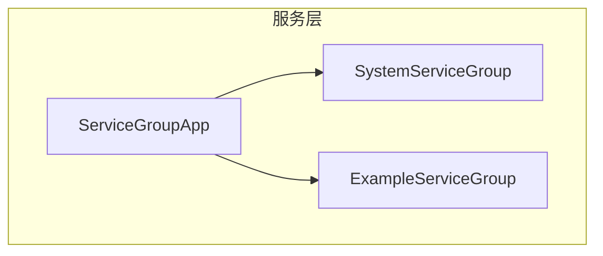
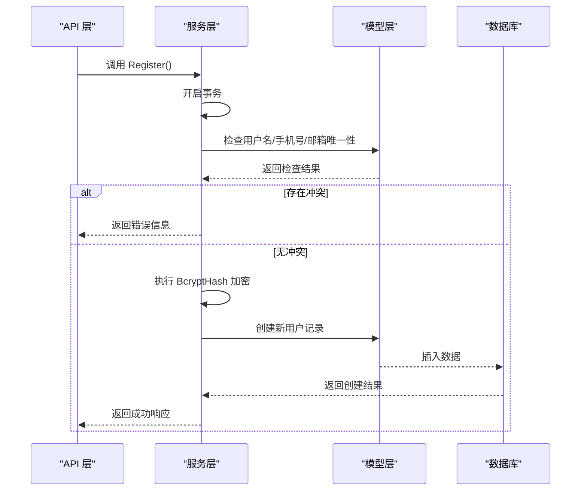
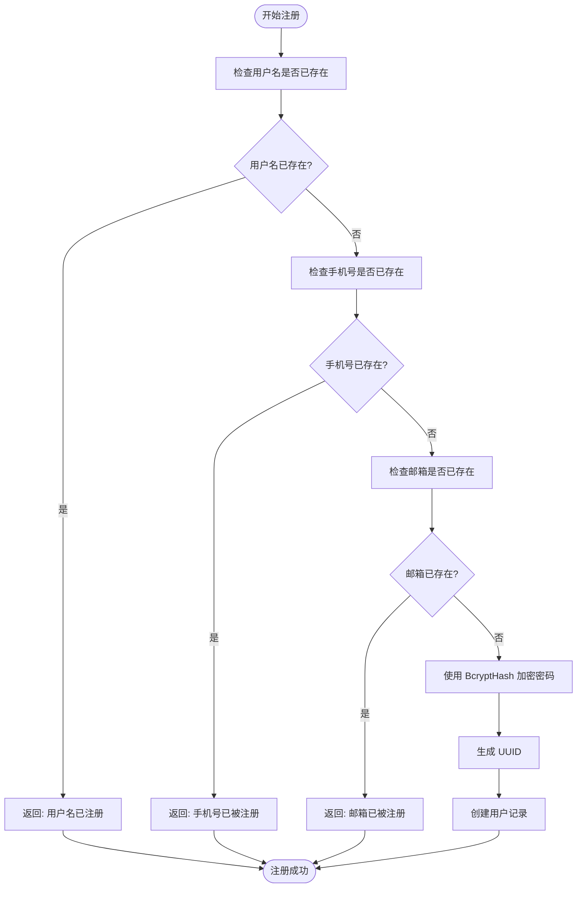
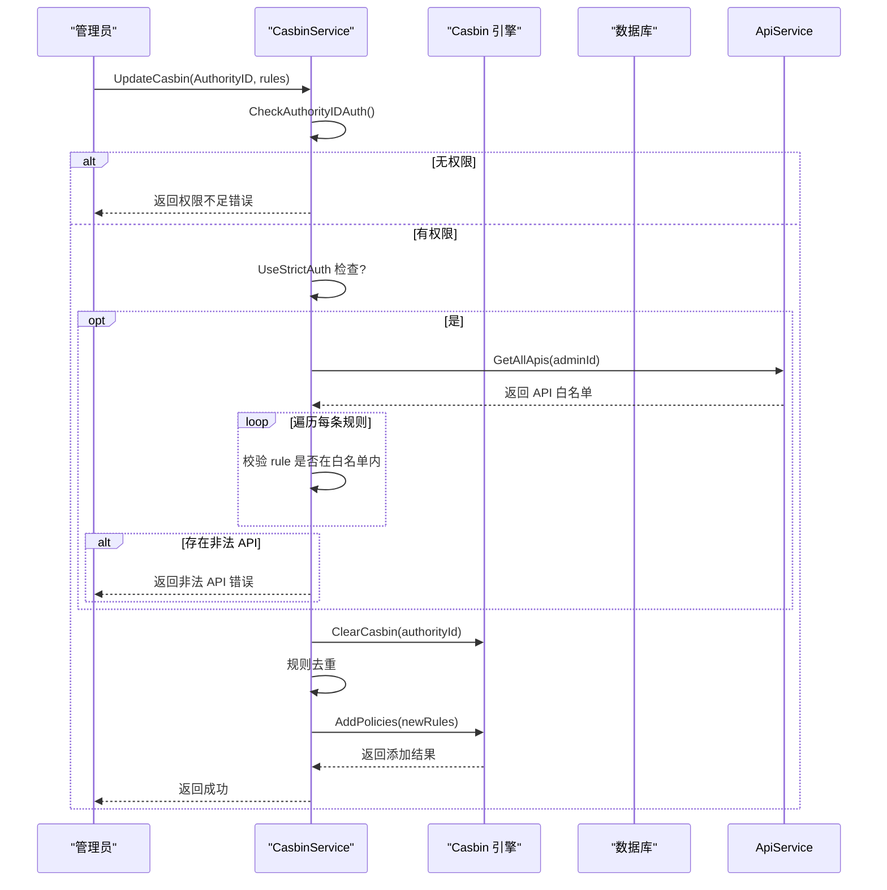
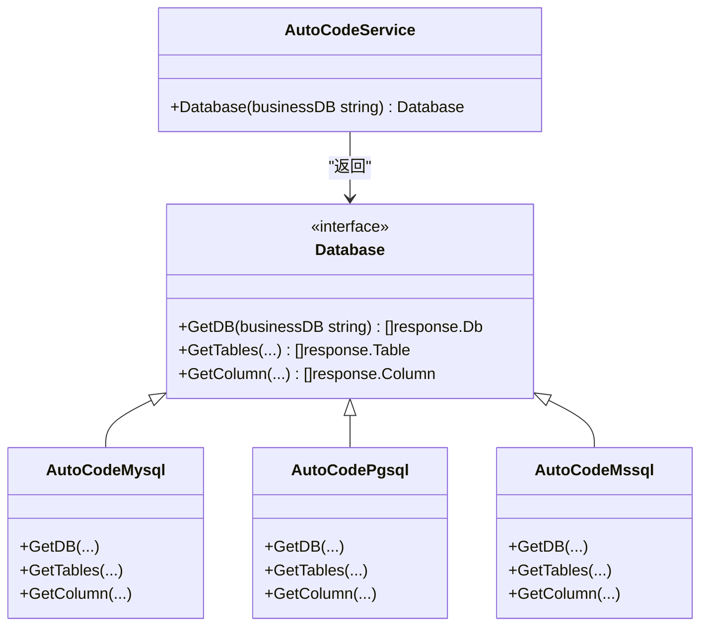
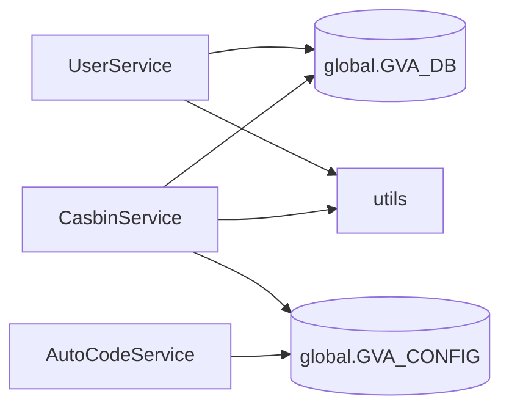

# 服务层

<cite>
**本文档中引用的文件**   
- [enter.go](file://server/service/enter.go)
- [sys_user.go](file://server/service/system/sys_user.go)
- [sys_casbin.go](file://server/service/system/sys_casbin.go)
- [sys_auto_code_interface.go](file://server/service/system/sys_auto_code_interface.go)
- [hash.go](file://server/utils/hash.go)
- [casbin_util.go](file://server/utils/casbin_util.go)
</cite>

## 目录
1. [简介](#简介)
2. [项目结构](#项目结构)
3. [核心组件](#核心组件)
4. [架构概述](#架构概述)
5. [详细组件分析](#详细组件分析)
6. [依赖分析](#依赖分析)
7. [性能考虑](#性能考虑)
8. [故障排除指南](#故障排除指南)
9. [结论](#结论)

## 简介
本文件深入剖析 gin-vue-admin 项目中服务层（service）的设计与职责。重点解析服务注册机制、业务逻辑协调、权限管理及接口抽象等核心功能，旨在为开发者提供清晰的服务层实现原理和最佳实践指导。

## 项目结构
服务层位于 `server/service` 目录下，采用分组化设计，主要包含系统（system）和示例（example）两大模块。每个模块通过独立的 `enter.go` 文件进行服务实例的聚合与导出，形成清晰的调用入口。

**图源**
- [enter.go](file://server/service/enter.go#L1-L13)

**节源**
- [enter.go](file://server/service/enter.go#L1-L13)

## 核心组件
服务层是连接 API 层与模型（model）层的核心枢纽，负责封装所有业务逻辑规则，确保数据访问的安全性与一致性。其主要职责包括用户管理、权限控制、自动代码生成等关键功能。

**节源**
- [sys_user.go](file://server/service/system/sys_user.go#L1-L454)
- [sys_casbin.go](file://server/service/system/sys_casbin.go#L1-L174)

## 架构概述
服务层采用典型的分层架构模式，API 层接收请求后调用对应的服务方法，服务层再通过 GORM 操作数据库模型完成数据持久化，并在过程中执行密码加密、权限校验等业务规则。

**图源**
- [sys_user.go](file://server/service/system/sys_user.go#L34-L79)
- [hash.go](file://server/utils/hash.go#L7-L10)

## 详细组件分析

### 用户服务分析
`UserService` 是系统中最核心的服务之一，负责处理用户的注册、登录、信息修改等全生命周期管理。

#### 注册流程
用户注册时，服务层会执行一系列原子性操作：
1. 使用数据库事务保证操作的完整性。
2. 检查用户名、手机号、邮箱的全局唯一性（排除软删除状态）。
3. 调用 `utils.BcryptHash` 对明文密码进行哈希加密。
4. 生成 UUID 并创建用户记录。

**图源**
- [sys_user.go](file://server/service/system/sys_user.go#L34-L79)
- [hash.go](file://server/utils/hash.go#L7-L10)

**节源**
- [sys_user.go](file://server/service/system/sys_user.go#L34-L79)

### Casbin 权限服务分析
`CasbinService` 提供了动态更新基于角色的访问控制（RBAC）策略的能力。

#### UpdateCasbin 方法
该方法用于更新指定角色的 API 访问权限：
1. 首先验证管理员是否有权修改目标角色。
2. 在严格模式下，校验待授权的 API 是否存在于系统白名单中。
3. 清除该角色原有的所有权限规则。
4. 对新的权限规则进行去重处理。
5. 批量添加新的权限策略到 Casbin 引擎。

**图源**
- [sys_casbin.go](file://server/service/system/sys_casbin.go#L25-L73)
- [casbin_util.go](file://server/utils/casbin_util.go#L15-L52)

**节源**
- [sys_casbin.go](file://server/service/system/sys_casbin.go#L25-L73)

### 接口抽象与扩展分析
服务层通过接口（interface）实现了良好的解耦与可扩展性。

#### 数据库适配器模式
`AutoCodeService.Database` 方法根据配置动态返回对应数据库类型的实现，支持 MySQL、PostgreSQL、MSSQL、Oracle 和 SQLite。

**图源**
- [sys_auto_code_interface.go](file://server/service/system/sys_auto_code_interface.go#L15-L54)

**节源**
- [sys_auto_code_interface.go](file://server/service/system/sys_auto_code_interface.go#L15-L54)

## 依赖分析
服务层高度依赖全局数据库实例（`global.GVA_DB`）、日志组件（`global.GVA_LOG`）以及工具包（`utils`），并通过单例模式获取 Casbin 引擎实例，确保资源的高效利用。

**图源**
- [sys_user.go](file://server/service/system/sys_user.go#L10-L13)
- [sys_casbin.go](file://server/service/system/sys_casbin.go#L10-L13)
- [sys_auto_code_interface.go](file://server/service/system/sys_auto_code_interface.go#L10-L11)

**节源**
- [sys_user.go](file://server/service/system/sys_user.go#L10-L13)
- [sys_casbin.go](file://server/service/system/sys_casbin.go#L10-L13)
- [sys_auto_code_interface.go](file://server/service/system/sys_auto_code_interface.go#L10-L11)

## 性能考虑
- **事务管理**：关键操作如用户注册、权限变更均使用数据库事务，保障数据一致性。
- **缓存机制**：Casbin 引擎使用 `SyncedCachedEnforcer`，设置一小时过期时间，减少策略加载开销。
- **批量操作**：权限更新采用 `AddPolicies` 批量插入，提升效率。
- **预加载**：用户查询时预加载关联的角色信息，避免 N+1 查询问题。

## 故障排除指南
常见问题及解决方案：
- **密码无法匹配**：确认前端传入密码是否经过正确加密，或检查 `BcryptCheck` 函数实现。
- **权限不生效**：调用 `FreshCasbin()` 方法重新加载策略，或检查数据库中 `casbin_rule` 表数据。
- **唯一约束冲突**：