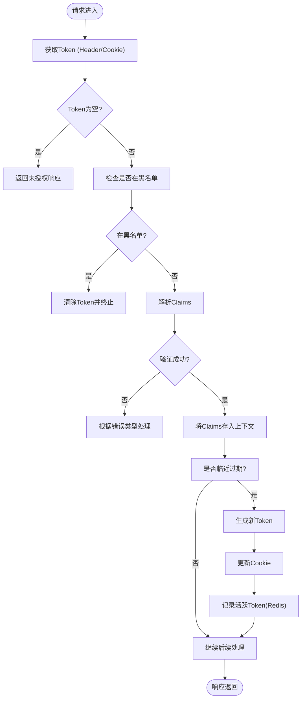

# JWT认证中间件

<cite>
**本文档引用文件**  
- [jwt.go](file://server/middleware/jwt.go)
- [jwt.go](file://server/utils/jwt.go)
- [sys_jwt_blacklist.go](file://server/model/system/sys_jwt_blacklist.go)
- [jwt.go](file://server/model/system/request/jwt.go)
- [claims.go](file://server/utils/claims.go)
- [response.go](file://server/model/common/response/response.go)
- [sys_user.go](file://server/api/v1/system/sys_user.go)
- [sys_jwt_blacklist.go](file://server/api/v1/system/sys_jwt_blacklist.go)
</cite>

## 目录
1. [简介](#简介)
2. [核心组件分析](#核心组件分析)
3. [JWT解析与验证流程](#jwt解析与验证流程)
4. [Token过期处理与自动刷新机制](#token过期处理与自动刷新机制)
5. [黑名单拦截机制](#黑名单拦截机制)
6. [用户身份信息提取](#用户身份信息提取)
7. [请求示例与头部处理](#请求示例与头部处理)
8. [路由链执行顺序](#路由链执行顺序)
9. [与Casbin权限系统集成](#与casbin权限系统集成)
10. [常见问题排查](#常见问题排查)
11. [性能优化建议](#性能优化建议)

## 简介
本项目采用JWT（JSON Web Token）作为主要的用户身份认证机制，通过中间件实现无状态的身份校验。整个流程包括Token生成、解析、验证、刷新及黑名单管理，并与Casbin权限控制系统深度集成，确保安全性和灵活性。

## 核心组件分析

### JWT中间件结构
JWT中间件位于`server/middleware/jwt.go`，其核心函数为`JWTAuth()`，返回一个Gin框架的处理器函数，用于在HTTP请求链中执行身份验证逻辑。



**Diagram sources**
- [jwt.go](file://server/middleware/jwt.go#L14-L76)
- [claims.go](file://server/utils/claims.go#L41-L54)

**Section sources**
- [jwt.go](file://server/middleware/jwt.go#L14-L76)
- [claims.go](file://server/utils/claims.go#L41-L54)

## JWT解析与验证流程

### 解析流程详解
当客户端发起请求时，中间件首先尝试从请求头`x-token`或Cookie中获取JWT字符串。若两者均不存在，则判定为未登录状态。

#### 关键步骤：
1. **获取Token**：调用`utils.GetToken(c)`优先读取Header，若失败则尝试从Cookie读取。
2. **黑名单校验**：使用`isBlacklist(token)`检查该Token是否已被加入全局缓存黑名单。
3. **签名验证**：通过`j.ParseToken(token)`进行JWT标准验证，包含签名有效性、过期时间等。
4. **错误分类处理**：区分Token过期、签名无效、格式错误等异常情况并返回相应提示。

```mermaid
sequenceDiagram
participant Client as "客户端"
participant Middleware as "JWT中间件"
participant Utils as "Utils工具包"
Client->>Middleware : 发起API请求
Middleware->>Utils : GetToken(从Header/Cookie)
Utils-->>Middleware : 返回Token字符串
alt Token为空
Middleware->>Client : 401 未登录
return
end
Middleware->>Middleware : isBlacklist(Token)
alt 在黑名单中
Middleware->>Client : 401 账户异地登录或令牌失效
return
end
Middleware->>Utils : j.ParseToken(Token)
Utils-->>Middleware : 返回Claims或错误
alt 验证失败
cond TokenExpired
Middleware->>Client : 401 登录已过期
else 其他错误
Middleware->>Client : 401 错误详情
end
return
end
Middleware->>Middleware : c.Set("claims", claims)
Middleware->>Client : 继续执行后续Handler
```

**Diagram sources**
- [jwt.go](file://server/middleware/jwt.go#L14-L76)
- [jwt.go](file://server/utils/jwt.go#L50-L80)

**Section sources**
- [jwt.go](file://server/middleware/jwt.go#L14-L76)
- [jwt.go](file://server/utils/jwt.go#L50-L80)

## Token过期处理与自动刷新机制

### 缓冲时间设计
系统引入“缓冲时间”（BufferTime）概念，在Token即将过期前自动签发新Token，避免用户突然掉线。

#### 刷新条件判断：
```go
if claims.ExpiresAt.Unix()-time.Now().Unix() < claims.BufferTime {
    // 触发刷新逻辑
}
```

#### 自动刷新流程：
1. 计算新的过期时间：`time.Now().Add(dr)`
2. 使用旧Token和现有Claims生成新Token
3. 将新Token写入响应Header：`new-token` 和 `new-expires-at`
4. 更新客户端Cookie中的Token
5. 若启用多点登录，则同步更新Redis中用户的最新活跃Token

此机制实现了无缝续签体验，同时保持安全性。

**Section sources**
- [jwt.go](file://server/middleware/jwt.go#L60-L75)
- [jwt.go](file://server/utils/jwt.go#L30-L49)

## 黑名单拦截机制

### 黑名单数据模型
定义于`server/model/system/sys_jwt_blacklist.go`，结构如下：

```go
type JwtBlacklist struct {
    global.GVA_MODEL
    Jwt string `gorm:"type:text;comment:jwt"`
}
```

### 拦截实现方式
当前版本使用内存缓存`global.BlackCache`进行快速查询，而非直接查询数据库，提升性能。

```go
func isBlacklist(jwt string) bool {
    _, ok := global.BlackCache.Get(jwt)
    return ok
}
```

#### 主动作废流程：
用户登出或管理员强制下线时，调用`JsonInBlacklist`接口将当前Token加入黑名单：

```go
func (j *JwtApi) JsonInBlacklist(c *gin.Context) {
    token := utils.GetToken(c)
    jwt := system.JwtBlacklist{Jwt: token}
    err := jwtService.JsonInBlacklist(jwt)
    // ...
}
```

未来可扩展为持久化存储+定时清理策略。

**Section sources**
- [sys_jwt_blacklist.go](file://server/model/system/sys_jwt_blacklist.go#L4-L8)
- [jwt.go](file://server/middleware/jwt.go#L84-L87)
- [sys_jwt_blacklist.go](file://server/api/v1/system/sys_jwt_blacklist.go#L21-L32)

## 用户身份信息提取

### Claims结构定义
位于`server/model/system/request/jwt.go`，包含基础信息与注册声明：

```go
type CustomClaims struct {
    BaseClaims
    BufferTime int64
    jwt.RegisteredClaims
}

type BaseClaims struct {
    UUID        uuid.UUID
    ID          uint
    Username    string
    NickName    string
    Name        string
    AuthorityId uint
}
```

### 上下文传递
验证成功后，中间件将解析出的`claims`对象存入Gin上下文：

```go
c.Set("claims", claims)
```

后续业务逻辑可通过`c.Get("claims")`获取用户身份信息，如权限ID、用户名等，用于个性化服务或权限判断。

**Section sources**
- [jwt.go](file://server/model/system/request/jwt.go#L10-L22)
- [jwt.go](file://server/middleware/jwt.go#L70)

## 请求示例与头部处理

### 正常请求示例
```http
GET /api/v1/user/info HTTP/1.1
Host: localhost:8888
x-token: eyJhbGciOiJIUzI1NiIsInR5cCI6IkpXVCJ9.xxxxx
```

### 响应中携带新Token
当触发自动刷新时，响应头会包含：
```http
HTTP/1.1 200 OK
new-token: eyJhbGciOiJIUzI1NiIsInR5cCI6IkpXVCJ9.yyyyy
new-expires-at: 1735689600
Set-Cookie: x-token=eyJhbGciOiJIUzI1NiIsInR5cCI6IkpXVCJ9.yyyyy; Path=/; Max-Age=604800
```

前端需监听这些Header并更新本地存储的Token。

**Section sources**
- [jwt.go](file://server/middleware/jwt.go#L65-L68)
- [claims.go](file://server/utils/claims.go#L27-L39)

##