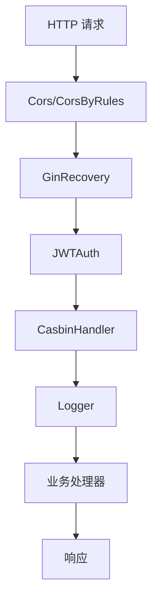
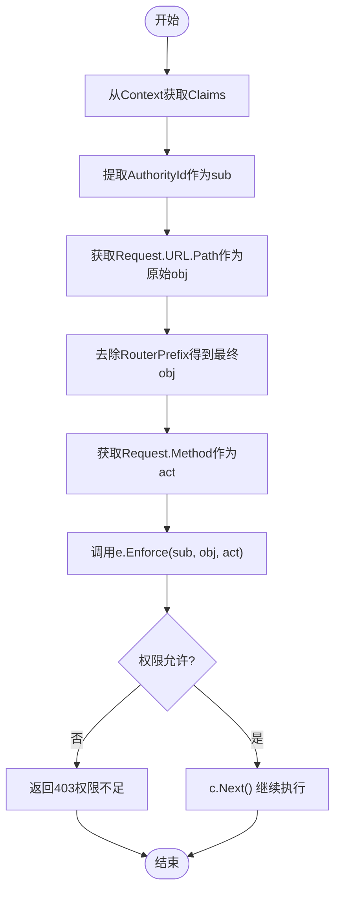

# 中间件体系

<cite>
**本文档引用文件**
- [casbin_rbac.go](file://server/middleware/casbin_rbac.go)
- [cors.go](file://server/middleware/cors.go)
- [error.go](file://server/middleware/error.go)
- [jwt.go](file://server/middleware/jwt.go)
- [logger.go](file://server/middleware/logger.go)
- [timeout.go](file://server/middleware/timeout.go)
- [claims.go](file://server/utils/claims.go)
- [jwt.go](file://server/utils/jwt.go)
- [casbin_util.go](file://server/utils/casbin_util.go)
- [router.go](file://server/initialize/router.go)
- [config.go](file://server/config/config.go)
- [cors.go](file://server/config/cors.go)
</cite>

## 目录
1. [引言](#引言)
2. [中间件架构概览](#中间件架构概览)
3. [核心中间件详解](#核心中间件详解)
   - [JWT 身份认证中间件](#jwt-身份认证中间件)
   - [Casbin RBAC 权限控制中间件](#casbin-rbac-权限控制中间件)
   - [CORS 跨域配置中间件](#cors-跨域配置中间件)
   - [日志记录中间件](#日志记录中间件)
   - [错误恢复与超时处理](#错误恢复与超时处理)
4. [辅助中间件机制](#辅助中间件机制)
5. [中间件执行顺序与调试](#中间件执行顺序与调试)
6. [自定义中间件开发](#自定义中间件开发)
7. [总结](#总结)

## 引言
`gin-vue-admin` 是一个基于 Gin 和 Vue 的全栈开发框架,其安全性、可扩展性和易用性在很大程度上依赖于精心设计的中间件体系。本文档深入剖析该系统的中间件架构,重点解析 JWT 认证、Casbin 权限控制、CORS 配置、日志记录等核心中间件的工作原理,并探讨错误处理、超时控制等辅助机制。同时,提供中间件执行流程的调试方法及自定义中间件(如限流、审计)的开发与集成实践。

## 中间件架构概览
`gin-vue-admin` 的中间件主要位于 `server/middleware` 目录下,通过 `server/initialize/router.go` 文件中的 `Routers()` 函数进行全局注册和链式调用。中间件按功能可分为认证、授权、安全、日志、错误处理等类别,共同构建了应用的安全网关和请求处理流水线。



**Diagram sources**
- [router.go](file://server/initialize/router.go#L80-L120)
- [cors.go](file://server/middleware/cors.go#L10-L27)
- [error.go](file://server/middleware/error.go#L12-L61)
- [jwt.go](file://server/middleware/jwt.go#L14-L76)
- [casbin_rbac.go](file://server/middleware/casbin_rbac.go#L13-L32)
- [logger.go](file://server/middleware/logger.go#L40-L89)

**Section sources**
- [router.go](file://server/initialize/router.go#L1-L124)

## 核心中间件详解

### JWT 身份认证中间件
JWT 中间件 (`middleware.JWTAuth`) 是系统安全的第一道防线,负责验证用户身份的有效性。

**工作流程:**
1.  **Token 提取**:从请求头 `x-token` 或 Cookie 中获取 JWT Token。
2.  **黑名单校验**:检查 Token 是否存在于 Redis 黑名单中(用于实现单点登录或多点登录失效)。
3.  **Token 解析**:使用预设的密钥 (`SigningKey`) 解析 Token,提取其中的声明 (Claims)。
4.  **过期判断**:若 Token 即将过期(剩余时间小于缓冲时间 `BufferTime`),则自动签发一个新的 Token 并通过响应头 `new-token` 和 `new-expires-at` 返回给客户端,实现无感刷新。
5.  **上下文注入**:将解析出的用户身份信息(`claims`)存入 Gin 上下文,供后续中间件和业务逻辑使用。

```mermaid
sequenceDiagram
participant Client as 客户端
participant Middleware as JWTAuth中间件
participant Utils as utils工具包
participant Redis as Redis缓存
Client->>Middleware : 发送带x-token的请求
Middleware->>Utils : GetToken(从Header/Cookie)
alt Token为空
Middleware-->>Client : 返回401未登录
return
end
Middleware->>Redis : 查询Token是否在黑名单
alt 在黑名单中
Middleware-->>Client : 返回401令牌失效
return
end
Middleware->>Utils : NewJWT().ParseToken(Token)
alt 解析失败且为过期
Middleware-->>Client : 返回401登录过期
return
alt 其他解析错误
Middleware-->>Client : 返回401错误详情
return
end
Utils-->>Middleware : 返回Claims
alt Claims即将过期
Middleware->>Utils : CreateTokenByOldToken(旧Token, 新Claims)
Utils-->>Middleware : 返回新Token
Middleware->>Redis : SetRedisJWT(用户名, 新Token)
Middleware->>Client : 设置响应头 new-token/new-expires-at
end
Middleware->>Middleware : c.Set("claims", Claims)
Middleware->>Middleware : c.Next()
```

**Diagram sources**
- [jwt.go](file://server/middleware/jwt.go#L14-L76)
- [claims.go](file://server/utils/claims.go#L41-L64)
- [jwt.go](file://server/utils/jwt.go#L25-L45)

**Section sources**
- [jwt.go](file://server/middleware/jwt.go#L1-L88)

### Casbin RBAC 权限控制中间件
Casbin 中间件 (`middleware.CasbinHandler`) 实现了基于角色的细粒度访问控制 (RBAC),确保用户只能访问其被授权的资源。

**工作流程:**
1.  **获取用户信息**:从 Gin 上下文中取出由 JWT 中间件注入的 `claims`,从中提取用户的 `AuthorityId`(角色ID)。
2.  **构造请求参数**:
    *   `sub` (Subject): 用户的角色ID。
    *   `obj` (Object): 请求的路径(去除路由前缀后的部分)。
    *   `act` (Action): HTTP 请求方法(GET, POST, PUT, DELETE 等)。
3.  **策略决策**:调用 Casbin 的 `Enforce(sub, obj, act)` 方法,查询数据库中的策略表,判断该“角色-路径-方法”组合是否被允许。
4.  **权限判定**:如果 `Enforce` 返回 `false`,则立即中断请求,返回“权限不足”的错误；否则放行,继续执行后续逻辑。



**Diagram sources**
- [casbin_rbac.go](file://server/middleware/casbin_rbac.go#L13-L32)
- [casbin_util.go](file://server/utils/casbin_util.go#L18-L51)
- [sys_casbin.go](file://server/service/system/sys_casbin.go#L25-L172)

**Section sources**
- [casbin_rbac.go](file://server/middleware/casbin_rbac.go#L1-L33)

### CORS 跨域配置中间件
CORS 中间件 (`middleware.Cors` 和 `middleware.CorsByRules`) 用于解决前端开发中的跨域资源共享问题。

**两种模式:**
*   **宽松模式 (`Cors`)**:对所有来源 (`Access-Control-Allow-Origin: origin`) 开放,适用于开发环境。
*   **严格模式 (`CorsByRules`)**:根据 `config.yaml` 中的 `cors.whitelist` 白名单配置进行精确匹配,仅允许列表中的域名访问,生产环境推荐使用。

**关键配置项:**
*   `allow-origin`: 允许的源。
*   `allow-methods`: 允许的 HTTP 方法。
*   `allow-headers`: 允许携带的请求头。
*   `expose-headers`: 允许客户端访问的响应头。
*   `allow-credentials`: 是否允许发送凭据(如 Cookie)。

**处理逻辑:**
1.  检查请求方法是否为 `OPTIONS`(预检请求)。如果是,则直接返回 `204 No Content` 状态码,不执行后续业务逻辑。
2.  根据配置模式设置相应的响应头。
3.  放行请求至下一个中间件。

**Section sources**
- [cors.go](file://server/middleware/cors.go#L10-L62)
- [cors.go](file://server/config/cors.go#L1-L14)

### 日志记录中间件
日志中间件 (`middleware.Logger`) 负责记录每个 HTTP 请求的详细信息,是系统可观测性的基础。

**功能特点:**
*   **结构化日志**:输出 JSON 格式的日志,包含时间、路径、查询参数、IP、User-Agent、耗时、错误信息等。
*   **灵活过滤**:支持通过 `Filter` 函数自定义哪些请求需要记录完整 Body。
*   **脱敏处理**:可通过 `FilterKeyword` 回调对敏感字段进行过滤或