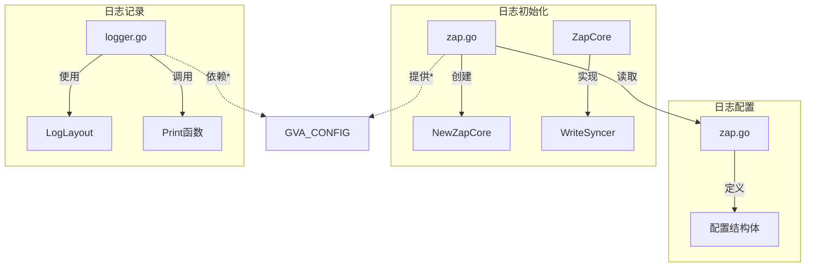
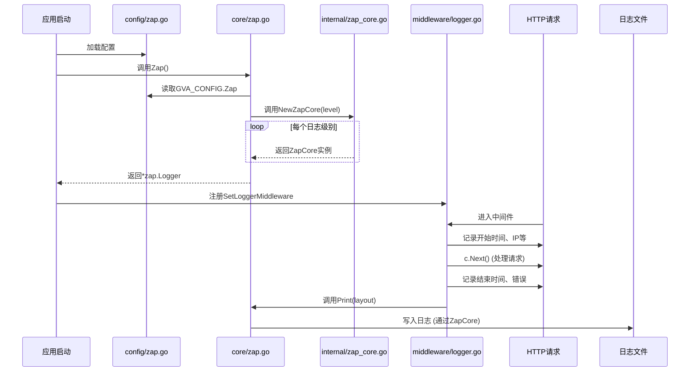
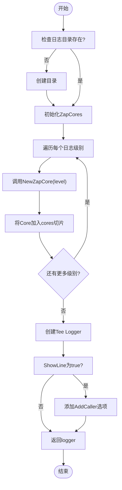
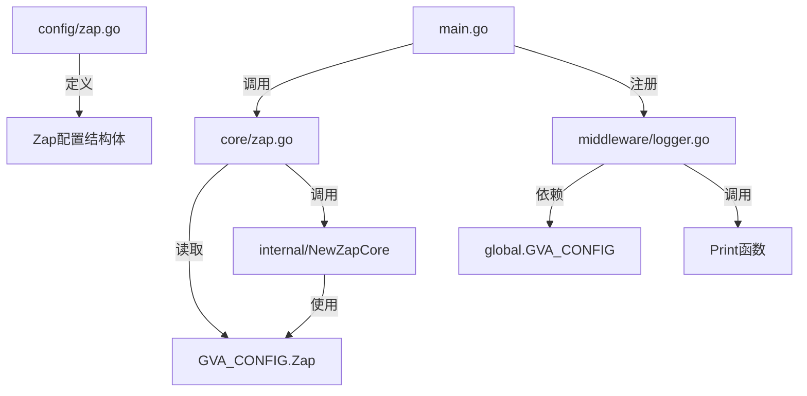

# 日志记录中间件

<cite>
**本文档引用的文件**
- [logger.go](file://server/middleware/logger.go)
- [zap.go](file://server/core/zap.go)
- [zap.go](file://server/config/zap.go)
- [config.go](file://server/config/config.go)
- [zap_core.go](file://server/core/internal/zap_core.go)
</cite>

## 目录
1. [简介](#简介)
2. [项目结构](#项目结构)
3. [核心组件](#核心组件)
4. [架构概述](#架构概述)
5. [详细组件分析](#详细组件分析)
6. [依赖分析](#依赖分析)
7. [性能考量](#性能考量)
8. [故障排除指南](#故障排除指南)
9. [结论](#结论)

## 简介
本文档深入剖析 `gin-vue-admin` 项目中基于 Zap 日志库构建的日志记录中间件。重点阐述 `logger.go` 如何捕获 HTTP 请求的完整上下文（包括 IP、方法、URL、状态码等），并说明其与日志配置 (`config/zap.go`) 和初始化逻辑 (`core/zap.go`) 的紧密依赖关系。同时，探讨了结构化日志在请求追踪和操作审计中的价值，并提供性能优化建议。

## 项目结构
日志功能主要分布在三个核心目录下：
- `server/middleware/`: 包含 `logger.go`，负责拦截请求并生成日志数据。
- `server/config/`: 包含 `zap.go`，定义了日志的配置项。
- `server/core/`: 包含 `zap.go` 和 `internal/zap_core.go`，负责根据配置初始化并创建最终的 Zap 日志实例。



**Diagram sources**
- [config/zap.go](file://server/config/zap.go#L1-L72)
- [core/zap.go](file://server/core/zap.go#L1-L33)
- [middleware/logger.go](file://server/middleware/logger.go#L1-L90)

**Section sources**
- [config/zap.go](file://server/config/zap.go#L1-L72)
- [core/zap.go](file://server/core/zap.go#L1-L33)
- [middleware/logger.go](file://server/middleware/logger.go#L1-L90)

## 核心组件
本节分析构成日志系统的核心组件：`LogLayout` 结构体用于封装单次请求的所有上下文信息；`Logger` 结构体作为中间件的配置和行为载体；`Zap` 函数负责根据全局配置创建高性能的 Zap 日志器。

**Section sources**
- [middleware/logger.go](file://server/middleware/logger.go#L10-L38)
- [core/zap.go](file://server/core/zap.go#L14-L31)

## 架构概述
整个日志系统的运行流程如下：应用启动时，`core/zap.go` 会读取 `config/zap.go` 中的配置，通过 `internal.NewZapCore` 创建一个或多个 `ZapCore` 实例，这些实例决定了日志的输出位置（文件/控制台）、格式（JSON/Console）和级别。随后，`middleware/logger.go` 中的 `DefaultLogger` 或自定义 `Logger` 会利用这个已初始化的 Zap 实例（通过 `Print` 函数）来输出结构化的请求日志。



**Diagram sources**
- [core/zap.go](file://server/core/zap.go#L14-L31)
- [middleware/logger.go](file://server/middleware/logger.go#L40-L77)

## 详细组件分析

### 日志布局与中间件分析
`LogLayout` 结构体是日志数据的容器，它精确地收集了一次 HTTP 请求的关键信息。

#### 类图
```mermaid
classDiagram
class LogLayout {
+Time time.Time
+Metadata map[string]interface{}
+Path string
+Query string
+Body string
+IP string
+UserAgent string
+Error string
+Cost time.Duration
+Source string
}
class Logger {
-Filter func(c *gin.Context) bool
-FilterKeyword func(layout *LogLayout) bool
-AuthProcess func(c *gin.Context, layout *LogLayout)
-Print func(LogLayout)
-Source string
+SetLoggerMiddleware() gin.HandlerFunc
}
Logger --> LogLayout : "生成"
```

**Diagram sources**
- [middleware/logger.go](file://server/middleware/logger.go#L10-L38)

**Section sources**
- [middleware/logger.go](file://server/middleware/logger.go#L10-L90)

### 配置与初始化逻辑分析
`config/zap.go` 定义了可配置的参数，而 `core/zap.go` 则是将这些参数转化为实际日志能力的桥梁。

#### 流程图


**Diagram sources**
- [core/zap.go](file://server/core/zap.go#L14-L31)
- [config/zap.go](file://server/config/zap.go#L1-L72)

## 依赖分析
日志系统各组件间存在明确的依赖关系。



**Diagram sources**
- [config/zap.go](file://server/config/zap.go#L1-L72)
- [core/zap.go](file://server/core/zap.go#L14-L31)
- [middleware/logger.go](file://server/middleware/logger.go#L40-L77)

**Section sources**
- [config/zap.go](file://server/config/zap.go#L1-L72)
- [core/zap.go](file://server/core/zap.go#L14-L31)
- [middleware/logger.go](file://server/middleware/logger.go#L1-L90)

## 性能考量
该日志中间件的设计对性能有潜在影响：
1. **高吞吐场景**: 在每秒处理大量请求时，同步写入磁盘可能成为瓶颈。建议评估是否需要引入采样机制（例如，只记录错误或慢请求），或确保日志写入是异步的（Zap 默认支持缓冲和异步写入，但需确认 `WriteSyncer` 的实现）。
2. **Body 读取**: 当 `Filter` 函数返回 `false` 时，中间件会调用 `c.GetRawData()` 读取请求体，这会消耗内存并可能影响性能，应谨慎使用。
3. **JSON 序列化**: `DefaultLogger` 使用 `json.Marshal` 将 `LogLayout` 序列化，这是一个相对耗时的操作。对于极致性能要求，可以考虑更高效的序列化方式或直接使用 Zap 的原生字段 API。

## 故障排除指南
- **日志未生成**: 检查 `config.yaml` 中 `zap.director` 路径是否有写入权限，以及 `zap.level` 是否设置得过高（如 `error`），导致 `info` 级别的请求日志被过滤。
- **日志格式错误**: 确认 `config.yaml` 中 `zap.format` 的值为 `json` 或 `console`，拼写错误会导致使用默认的 `LowercaseLevelEncoder`。
- **控制台无日志**: 如果希望在控制台也看到日志，请确保 `config.yaml` 中 `zap.log-in-console` 设置为 `true`。

## 结论
`gin-vue-admin` 的日志中间件通过 `logger.go`、`config/zap.go` 和 `core/zap.go` 的协同工作，实现了强大的结构化日志记录功能。它能够全面捕获 HTTP 请求上下文，便于问题追踪和安全审计。通过灵活的配置，开发者可以控制日志的级别、格式和存储策略。在生产环境中，应关注其性能表现，并根据需要调整配置以平衡可观测性和系统开销。通过扩展 `Metadata` 字段，可以轻松集成 `trace_id` 等全链路追踪信息。