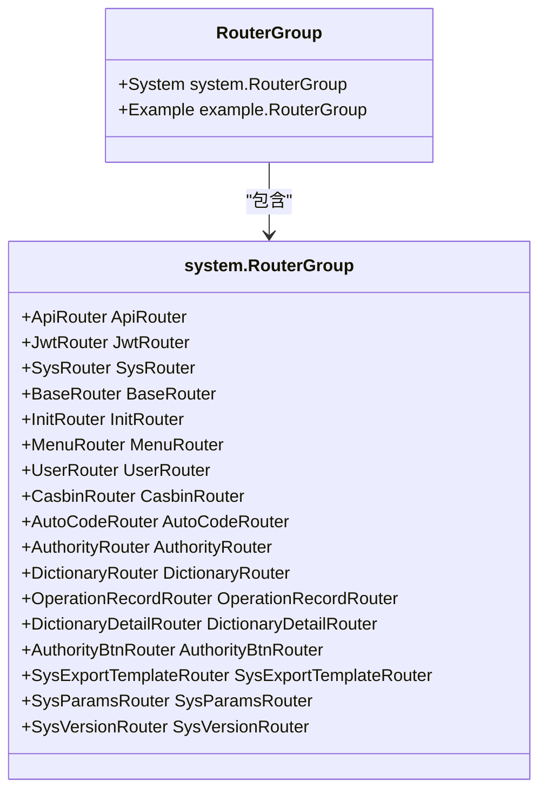
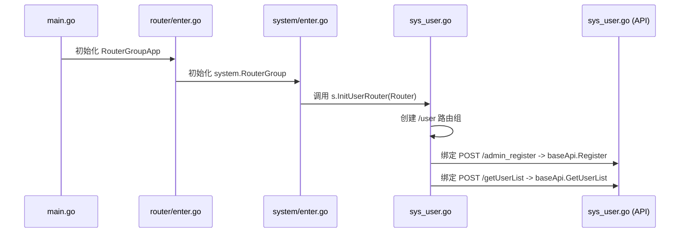
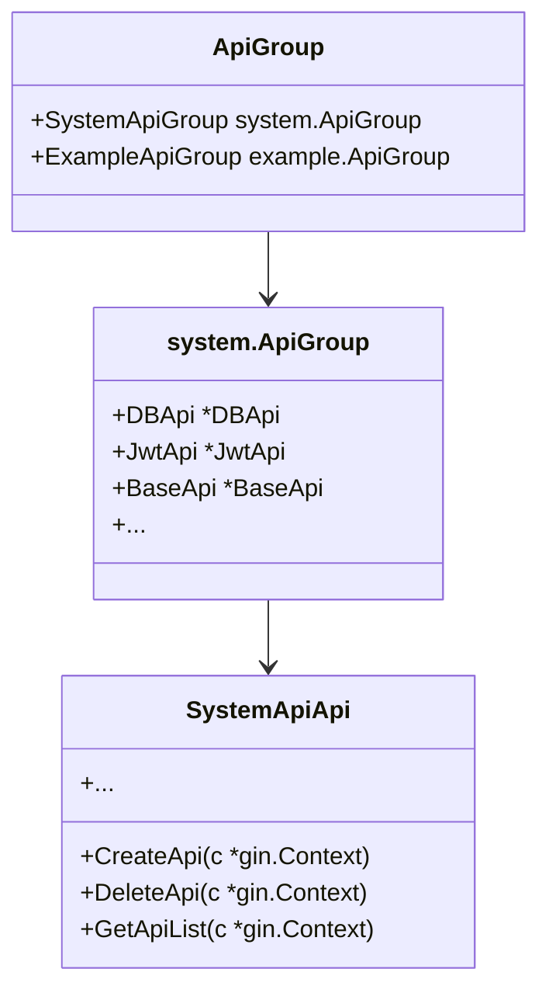
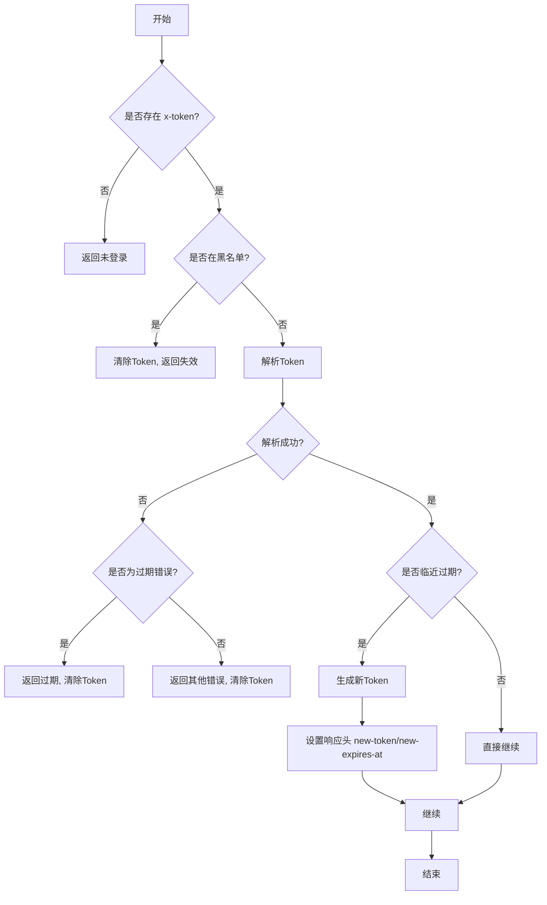

# 路由与中间件

<cite>
**本文档引用文件**  
- [enter.go](file://server/router/enter.go)
- [system/enter.go](file://server/router/system/enter.go)
- [v1/enter.go](file://server/api/v1/enter.go)
- [system/sys_api.go](file://server/api/v1/system/sys_api.go)
- [middleware/jwt.go](file://server/middleware/jwt.go)
- [middleware/casbin_rbac.go](file://server/middleware/casbin_rbac.go)
- [middleware/cors.go](file://server/middleware/cors.go)
- [middleware/logger.go](file://server/middleware/logger.go)
- [system/sys_user.go](file://server/router/system/sys_user.go)
- [system/sys_jwt.go](file://server/router/system/sys_jwt.go)
- [system/sys_casbin.go](file://server/router/system/sys_casbin.go)
- [system/sys_authority.go](file://server/router/system/sys_authority.go)
- [system/sys_menu.go](file://server/router/system/sys_menu.go)
</cite>

## 目录
1. [引言](#引言)
2. [路由注册机制](#路由注册机制)
3. [核心中间件体系](#核心中间件体系)
4. [中间件执行顺序与请求生命周期](#中间件执行顺序与请求生命周期)
5. [自定义中间件开发指南](#自定义中间件开发指南)
6. [结论](#结论)

## 引言
gin-vue-admin 是一个基于 Gin 和 Vue 的前后端分离权限管理系统，其路由注册机制和中间件体系是系统安全性和可扩展性的核心。本文深入分析该系统的路由分组注册方式、API 处理函数的关联机制，并详细解析 JWT 认证、Casbin RBAC 权限控制、CORS 跨域处理及日志记录等核心中间件的工作原理。

## 路由注册机制

gin-vue-admin 采用模块化、分层化的路由注册设计，通过 `router/enter.go` 中的 `RouterGroupApp` 结构体统一管理不同功能模块的路由组。系统主要分为 `system`（系统管理）和 `example`（示例模块）两大路由组。

**图示来源**
- [enter.go](file://server/router/enter.go#L7-L10)
- [system/enter.go](file://server/router/system/enter.go#L8-L25)

每个子模块（如用户、权限、菜单）都实现了独立的 `*Router` 结构体及其 `InitXXXRouter` 方法。以用户路由为例，`UserRouter.InitUserRouter` 方法接收一个 `*gin.RouterGroup` 参数，在其下创建 `/user` 前缀的子路由组，并绑定具体的 API 处理函数。

**图示来源**
- [system/sys_user.go](file://server/router/system/sys_user.go#L9-L28)

API 处理函数位于 `api/v1` 目录下，通过 `api/v1/enter.go` 中的 `ApiGroupApp` 进行集中管理。`RouterGroup` 通过导入并引用 `ApiGroupApp.SystemApiGroup` 下的具体 API 实例，实现路由与业务逻辑的解耦。

**图示来源**
- [v1/enter.go](file://server/api/v1/enter.go#L7-L10)
- [system/sys_api.go](file://server/api/v1/system/sys_api.go#L14-L16)

**本节来源**
- [enter.go](file://server/router/enter.go)
- [system/enter.go](file://server/router/system/enter.go)
- [v1/enter.go](file://server/api/v1/enter.go)
- [system/sys_api.go](file://server/api/v1/system/sys_api.go)
- [system/sys_user.go](file://server/router/system/sys_user.go)

## 核心中间件体系

### JWT 认证中间件

JWT 中间件 (`middleware/jwt.go`) 负责用户身份认证。它从请求头中提取 `x-token`，利用 `utils.JWT` 工具类进行解析和验证。

1.  **令牌提取与黑名单检查**：首先调用 `utils.GetToken(c)` 获取令牌，并检查其是否存在于 Redis 黑名单中（用于实现退出登录或强制下线）。
2.  **令牌解析**：使用预设的密钥和算法解析 JWT 令牌，获取其中的声明（Claims），包括用户ID、角色、过期时间等。
3.  **过期处理与自动刷新**：若令牌即将过期（剩余时间小于缓冲区时间），中间件会生成一个新的令牌，并通过响应头 `new-token` 和 `new-expires-at` 返回给前端，实现无感刷新。
4.  **上下文注入**：将解析出的 `claims` 存入 Gin 上下文 (`c.Set("claims", claims)`)，供后续处理器使用。

**图示来源**
- [middleware/jwt.go](file://server/middleware/jwt.go#L10-L88)

### Casbin RBAC 中间件

Casbin 中间件 (`middleware/casbin_rbac.go`) 实现了基于角色的访问控制（RBAC）。它在 JWT 认证成功后执行，确保用户只能访问其角色被授权的资源。

1.  **获取用户信息**：从 Gin 上下文中取出由 JWT 中间件注入的 `claims`，从中提取用户的 `AuthorityId`（角色ID）。
2.  **构建策略查询参数**：
    -   `sub` (Subject): 用户的角色ID（字符串形式）。
    -   `obj` (Object): 请求的资源路径，通常为去除路由前缀后的 API 路径。
    -   `act` (Action): HTTP 请求方法（GET, POST, PUT, DELETE 等）。
3.  **执行权限检查**：调用 `e.Enforce(sub, obj, act)` 查询 Casbin 策略数据库，判断该角色是否有权执行此操作。
4.  **决策与拦截**：如果 `Enforce` 返回 `false`，则立即终止请求，返回“权限不足”的错误；否则放行，进入下一个中间件或处理器。

**本节来源**
- [middleware/casbin_rbac.go](file://server/middleware/casbin_rbac.go#L10-L33)

### CORS 中间件

CORS 中间件 (`middleware/cors.go`) 解决浏览器的跨域资源共享问题。系统提供了两种模式：

1.  **宽松模式 (`allow-all`)**：通过 `Cors()` 函数实现，允许所有来源 (`Access-Control-Allow-Origin: *`)，并开放常用的请求头和方法。对于 `OPTIONS` 预检请求，直接返回 `204 No Content`。
2.  **严格白名单模式 (`strict-whitelist`)**：通过 `CorsByRules()` 函数实现，只允许配置文件 (`config.yaml`) 中明确列出的域名访问。它会检查请求头中的 `Origin` 是否在白名单内，若匹配则返回相应的 CORS 头；若不匹配且为严格模式，则拒绝请求。

**本节来源**
- [middleware/cors.go](file://server/middleware/cors.go#L10-L73)

### 日志中间件

日志中间件 (`middleware/logger.go`) 记录每次 HTTP 请求的详细信息