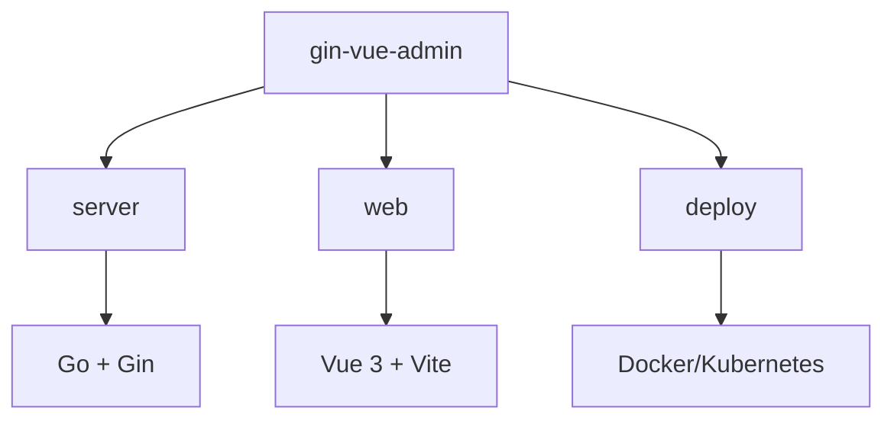

# 开发环境搭建

<cite>
**本文档中引用的文件**  
- [config.yaml](file://server/config.yaml)
- [main.go](file://server/main.go)
- [package.json](file://web/package.json)
- [vite.config.js](file://web/vite.config.js)
</cite>

## 目录
1. [简介](#简介)
2. [项目结构概览](#项目结构概览)
3. [后端开发环境配置](#后端开发环境配置)
4. [前端开发环境配置](#前端开发环境配置)
5. [数据库与Redis配置](#数据库与redis配置)
6. [运行后端服务(Gin)](#运行后端服务gin)
7. [运行前端应用(Vue)](#运行前端应用vue)
8. [常见问题排查](#常见问题排查)
9. [总结](#总结)

## 简介
本指南旨在为开发者提供完整的本地开发环境搭建流程,涵盖 Go、Node.js、数据库及 Redis 的安装与配置。详细说明如何分别启动 Gin 后端服务和 Vue 前端应用,并包含依赖管理、配置文件准备以及常见环境问题的解决方案。

## 项目结构概览
该项目采用前后端分离架构:
- `server/`:基于 Go 和 Gin 框架的后端服务
- `web/`:基于 Vue 3 和 Vite 的前端应用
- `deploy/`:Docker 和 Kubernetes 部署配置
- 根目录包含构建脚本(Makefile)、文档和版本控制文件

此结构支持独立开发与联合调试,便于通过 API 进行前后端交互。



**Diagram sources**
- [server/main.go](file://server/main.go)
- [web/package.json](file://web/package.json)

**Section sources**
- [server/main.go](file://server/main.go)
- [web/package.json](file://web/package.json)

## 后端开发环境配置
### Go 环境要求
- 版本:Go 1.18 或更高版本
- 安装方式:建议使用官方安装包或版本管理工具(如 gvm)

### 初始化后端依赖
在 `server/` 目录下执行以下命令以下载并整理模块依赖:

```bash
cd server
go mod tidy
```

该操作将自动解析 `go.mod` 中声明的依赖项并同步至本地缓存。

**Section sources**
- [main.go](file://server/main.go#L1-L10)

## 前端开发环境配置
### Node.js 版本要求
- 版本:Node.js v16 或更高版本
- 推荐使用 nvm(Node Version Manager)进行多版本管理

### 安装前端依赖
进入 `web/` 目录并运行:

```bash
cd web
npm install
```

此命令会根据 `package.json` 文件安装所有生产与开发依赖。

**Section sources**
- [package.json](file://web/package.json#L1-L10)

## 数据库与Redis配置
### 支持的数据库类型
项目支持多种数据库,包括:
- MySQL
- PostgreSQL
- SQLite
- Oracle
- MSSQL

默认配置使用 **PostgreSQL**,可在 `config.yaml` 中修改 `system.db-type` 字段切换。

### 数据库初始化
确保已安装对应数据库服务并创建数据库实例。例如 PostgreSQL 默认配置如下:

```yaml
pgsql:
  path: 127.0.0.1
  port: "5433"
  db-name: gva2
  username: postgres
  password: "123456"
  config: sslmode=disable TimeZone=Asia/Shanghai
```

首次运行时,程序将自动调用 `initialize.RegisterTables()` 创建所需数据表。

### Redis 配置
Redis 用于缓存和 JWT 黑名单管理,默认配置如下:

```yaml
redis:
  addr: 127.0.0.1:6379
  password: ""
  db: 0
  useCluster: false
```

若需启用 Redis,请将 `system.use-redis` 设置为 `true`。

**Section sources**
- [config.yaml](file://server/config.yaml#L1-L248)

## 运行后端服务(Gin)
### 启动步骤
1. 确保 Go 环境已正确配置
2. 执行依赖整理:`go mod tidy`
3. 编译并运行主程序:

```bash
cd server
go run main.go
```

服务将在 `system.addr` 指定的端口(默认 `8888`)启动。

### 自动化生成说明
项目使用 Swag 自动生成 Swagger 文档,入口文件为 `main.go`,相关注解如下:

```go
// @title                       Gin-Vue-Admin Swagger API接口文档
// @version                     v2.8.5
// @BasePath                    /
```

可通过访问 `/swagger/index.html` 查看 API 文档。

**Section sources**
- [main.go](file://server/main.go#L1-L52)

## 运行前端应用(Vue)
### 启动步骤
1. 确保 Node.js v16+ 已安装
2. 安装依赖:`npm install`
3. 启动开发服务器:

```bash
cd web
npm run serve
```

前端应用将通过 Vite 在本地启动,默认监听端口由 `.env` 文件中的 `VITE_CLI_PORT` 控制。

### 构建生产版本
执行以下命令生成静态资源:

```bash
npm run build
```

输出目录为 `dist/`,可部署至任意 Web 服务器。

### 反向代理配置
Vite 配置了代理规则,将 `/api` 请求转发至后端服务:

```js
proxy: {
  [process.env.VITE_BASE_API]: {
    target: `${process.env.VITE_BASE_PATH}:${process.env.VITE_SERVER_PORT}/`,
    changeOrigin: true,
    rewrite: (path) => path.replace(/^\/api/, '')
  }
}
```

确保 `.env.development` 文件中正确设置后端地址。

**Section sources**
- [vite.config.js](file://web/vite.config.js#L1-L122)
- [package.json](file://web/package.json#L1-L86)

## 常见问题排查
### 端口冲突
- **现象**:服务无法启动,提示“address already in use”
- **解决方法**:
  - 修改 `config.yaml` 中的 `system.addr` 更改后端端口
  - 修改 `.env` 文件中的 `VITE_CLI_PORT` 更改前端端口
  - 使用 `lsof -i :端口号` 查找占用进程并终止

### 依赖下载失败
- **Go 模块失败**:
  - 设置代理:`go env -w GOPROXY=https://goproxy.cn,direct`
  - 清理缓存:`go clean -modcache`
- **NPM 安装失败**:
  - 更换镜像源:`npm config set registry https://registry.npmmirror.com`
  - 清理缓存:`npm cache clean --force`

### 数据库连接失败
- 检查 `config.yaml` 中数据库配置是否正确
- 确认数据库服务正在运行
- 若使用远程数据库,检查防火墙和网络策略

### Redis 未启动导致错误
- 若 `use-redis: true` 但 Redis 未运行,会导致 JWT 验证失败
- 解决方案:
  - 启动 Redis 服务
  - 或临时关闭 Redis 功能:`system.use-redis: false`

**Section sources**
- [config.yaml](file://server/config.yaml#L1-L248)
- [main.go](file://server/main.go#L1-L52)

## 总结
本文档提供了 gin-vue-admin 项目的完整本地开发环境搭建指南,覆盖 Go 与 Node.js 环境配置、数据库初始化、Redis 设置、前后端服务启动流程及常见问题处理。开发者可根据此文档快速构建可运行的开发环境,提升开发效率。