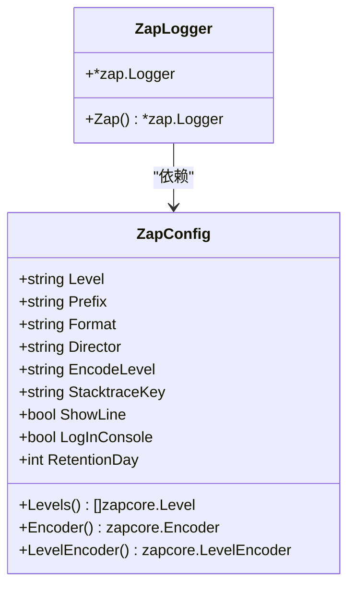
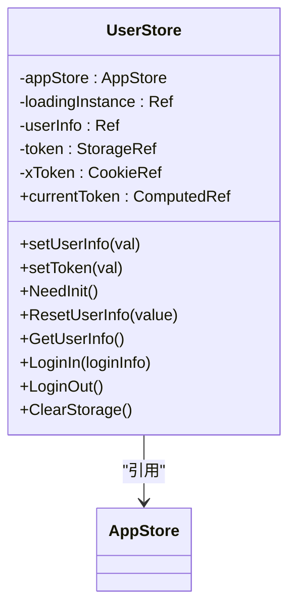
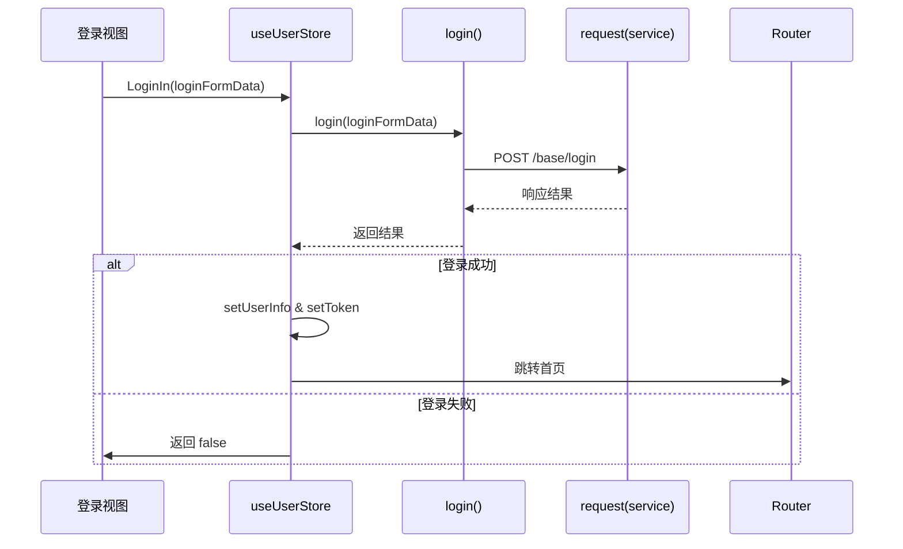

# 编码规范

<cite>
**本文档中引用的文件**
- [zap.go](file://server/config/zap.go)
- [zap.go](file://server/core/zap.go)
- [config.go](file://server/config/config.go)
- [eslint.config.mjs](file://web/eslint.config.mjs)
- [user.js](file://web/src/pinia/modules/user.js)
- [user.js](file://web/src/api/user.js)
</cite>

## 目录
1. [简介](#简介)
2. [Go 语言编码规范](#go-语言编码规范)
   - [命名约定](#命名约定)
   - [错误处理模式](#错误处理模式)
   - [日志记录标准（Zap）](#日志记录标准zap)
   - [接口设计原则](#接口设计原则)
3. [前端编码规范](#前端编码规范)
   - [JavaScript/TypeScript 风格（ESLint 规则）](#javascripttypescript-风格eslint-规则)
   - [Vue 组件命名](#vue-组件命名)
   - [Pinia Store 结构](#pinia-store-结构)
   - [API 函数封装方式](#api-函数封装方式)
4. [代码格式化工具配置与使用](#代码格式化工具配置与使用)
   - [gofmt 配置与使用](#gofmt-配置与使用)
   - [ESLint 配置与使用](#eslint-配置与使用)

## 简介
本编码规范旨在统一 `gin-vue-admin` 项目的代码风格，涵盖后端 Go 和前端 JavaScript/TypeScript 的开发实践。通过定义一致的命名、结构、错误处理和工具链配置，提升代码可读性、可维护性和团队协作效率。

## Go 语言编码规范

### 命名约定
- **结构体类型**：采用大驼峰命名法（PascalCase），如 `Zap`、`SysUser`。
- **变量与函数**：采用小驼峰命名法（camelCase），如 `logger`、`getUserInfo`。
- **常量与包名**：使用全小写，单词间以下划线分隔（如有必要），如 `const debugLevel`。
- **导出标识符**：首字母大写表示对外导出，遵循 Go 官方惯例。

**Section sources**
- [zap.go](file://server/config/zap.go#L7-L17)
- [config.go](file://server/config/config.go#L4)

### 错误处理模式
- 所有函数在发生错误时应返回 `(result, error)` 形式的双返回值。
- 不应忽略错误，必须显式检查并处理或向上层传递。
- 自定义错误可通过 `errors.New()` 或 `fmt.Errorf()` 创建，并建议使用 `github.com/pkg/errors` 进行堆栈追踪（若项目引入）。
- 在中间件或全局处理器中统一捕获 panic 并转换为 HTTP 错误响应。

### 日志记录标准（Zap）
项目使用 `go.uber.org/zap` 作为高性能日志库，其配置位于 `server/config/zap.go`。

- **日志级别**：支持 `Debug`, `Info`, `Warn`, `Error`, `DPanic`, `Panic`, `Fatal`。
- **输出格式**：可通过 `Format` 字段设置为 `"console"` 或 `"json"`。
- **编码器配置**：
  - 时间格式固定为 `"2006-01-02 15:04:05.000"`，带前缀。
  - 支持多种等级编码方式（小写、大写、带颜色等）。
- **日志位置**：由 `Director` 指定目录，自动创建。
- **控制台输出**：通过 `LogInConsole` 控制是否同时输出到终端。
- **调用行号显示**：通过 `ShowLine` 启用。

初始化逻辑在 `server/core/zap.go` 中实现，确保多级日志核心合并输出。

**Diagram sources**
- [zap.go](file://server/config/zap.go#L7-L70)
- [zap.go](file://server/core/zap.go#L14-L31)

**Section sources**
- [zap.go](file://server/config/zap.go#L7-L70)
- [zap.go](file://server/core/zap.go#L14-L31)

### 接口设计原则
- 接口应保持简洁，遵循最小接口原则。
- 方法命名清晰表达意图，参数与返回值明确。
- 尽量避免大型接口，鼓励细粒度接口组合。
- 使用接口进行依赖注入，提高测试性和解耦。

## 前端编码规范

### JavaScript/TypeScript 风格（ESLint 规则）
项目使用 `eslint.config.mjs` 进行 ESLint 配置，基于 `@eslint/js` 和 `eslint-plugin-vue`。

主要规则包括：
- 启用最新 ECMAScript 特性（`ecmaVersion: 'latest'`）。
- 允许每行多个 Vue 属性（`vue/max-attributes-per-line: 0`）。
- 禁用对 `_` 开头参数的未使用变量警告（`no-unused-vars: ['error', { argsIgnorePattern: '^_' }]`）。
- 忽略原生对象扩展警告（`no-extend-native: 'off'`）。
- 忽略独立代码块警告（`no-lone-blocks: 'off'`）。
- 允许 v-model 参数（`vue/no-v-model-argument: 0`）。
- 关闭组件名称多词限制（`vue/multi-word-component-names: 'off'`）。

忽略路径包含构建产物和静态资源。

**Section sources**
- [eslint.config.mjs](file://web/eslint.config.mjs#L1-L30)

### Vue 组件命名
- 单文件组件（`.vue`）使用 PascalCase 命名，如 `Login.vue`、`UserInfoCard.vue`。
- 组件注册时也使用 PascalCase。
- 模板中标签可使用 kebab-case（推荐一致性）。

### Pinia Store 结构
Pinia 模块位于 `web/src/pinia/modules/` 目录下，每个模块独立管理状态。

- 使用 `defineStore` 定义模块，命名采用小驼峰，如 `useUserStore`。
- 状态（state）使用 `ref` 或 `reactive` 包装。
- 提供 `getters`（通过 `computed` 实现）和 `actions`（异步操作）。
- 模块间可通过 `useOtherStore()` 实现依赖。

示例：用户状态管理包含登录、登出、信息获取等功能。

**Diagram sources**
- [user.js](file://web/src/pinia/modules/user.js#L12-L151)

**Section sources**
- [user.js](file://web/src/pinia/modules/user.js#L12-L151)

### API 函数封装方式
所有 API 请求封装在 `web/src/api/` 目录下的 `.js` 文件中。

- 使用统一的 `service` 实例（来自 `@/utils/request`）发送请求。
- 每个 API 函数返回 Promise，采用 `export const functionName = (data) => service({...})` 形式。
- URL、方法、数据体清晰分离。
- 支持 GET、POST、PUT、DELETE 等 HTTP 动词。
- 函数上方保留 Swagger 注释（`// @Tags`, `// @Summary` 等），便于文档生成。

示例：`login` 函数封装了 `/base/login` 的 POST 请求。

**Diagram sources**
- [user.js](file://web/src/api/user.js#L5-L11)
- [user.js](file://web/src/pinia/modules/user.js#L12-L151)

**Section sources**
- [user.js](file://web/src/api/user.js#L5-L11)
- [user.js](file://web/src/pinia/modules/user.js#L12-L151)

## 代码格式化工具配置与使用

### gofmt 配置与使用
- 项目默认使用 `gofmt` 或 `goimports` 进行格式化。
- 推荐编辑器集成 `gopls`，保存时自动格式化。
- 执行命令：`gofmt -w .` 或 `goimports -w .` 格式化当前目录及子目录。

### ESLint 配置与使用
- ESLint 配置文件为 `web/eslint.config.mjs`，使用新版 flat config。
- 安装依赖：`npm install --save-dev eslint @eslint/js eslint-plugin-vue globals`。
- 运行检查：`npx eslint src/**/*.{js,vue}`
- 自动修复：`npx eslint src/**/*.{js,vue} --fix`
- 建议在 IDE 中启用 ESLint 插件实现实时提示。