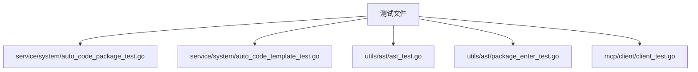

# 测试策略

<cite>
**本文档引用的文件**
- [sys_user.go](file://server/model/system/sys_user.go)
- [sys_user.go](file://server/service/system/sys_user.go)
- [sys_user.go](file://server/api/v1/system/sys_user.go)
- [request/sys_user.go](file://server/model/system/request/sys_user.go)
- [response/sys_user.go](file://server/model/system/response/sys_user.go)
- [validator.go](file://server/utils/validator.go)
- [auto_code_package_test.go](file://server/service/system/auto_code_package_test.go)
- [auto_code_template_test.go](file://server/service/system/auto_code_template_test.go)
- [client_test.go](file://server/mcp/client/client_test.go)
- [ast_test.go](file://server/utils/ast/ast_test.go)
</cite>

## 目录
1. [简介](#简介)
2. [项目测试结构概览](#项目测试结构概览)
3. [核心组件:SysUser 服务测试分析](#核心组件sysuser-服务测试分析)
4. [Go 单元测试编写规范](#go-单元测试编写规范)
5. [数据库交互与测试隔离](#数据库交互与测试隔离)
6. [前端 API 客户端模拟测试策略](#前端-api-客户端模拟测试策略)
7. [集成测试思路与用例组织](#集成测试思路与用例组织)
8. [测试执行与覆盖率报告](#测试执行与覆盖率报告)
9. [结论](#结论)

## 简介
`gin-vue-admin` 是一个基于 Gin 和 Vue.js 的全栈开发框架,提供了丰富的后台管理功能。为了确保系统的稳定性和可靠性,建立一套完善的测试体系至关重要。本文档旨在系统性地介绍 `gin-vue-admin` 的测试体系与实施策略,以 `sys_user` 服务为例,深入讲解 Go 单元测试的编写规范、数据库交互的测试隔离、前端 API 客户端的模拟测试策略以及集成测试的基本思路。

## 项目测试结构概览
`gin-vue-admin` 项目的测试文件遵循 Go 语言的标准命名约定,即在被测试的源代码文件名后添加 `_test.go` 后缀。例如,`sys_user.go` 文件的测试文件为 `sys_user_test.go`(虽然在当前上下文中未直接提供,但这是标准做法)。项目中存在多个测试文件,分布在不同的包中,如 `server/service/system/` 目录下的 `auto_code_package_test.go` 和 `auto_code_template_test.go`,以及 `server/utils/ast/` 目录下的多个 `*_test.go` 文件。这些测试文件共同构成了项目的测试套件。



**Diagram sources**
- [auto_code_package_test.go](file://server/service/system/auto_code_package_test.go)
- [auto_code_template_test.go](file://server/service/system/auto_code_template_test.go)
- [ast_test.go](file://server/utils/ast/ast_test.go)
- [package_enter_test.go](file://server/utils/ast/package_enter_test.go)
- [client_test.go](file://server/mcp/client/client_test.go)

**Section sources**
- [project_structure](file://workspace_path)

## 核心组件:SysUser 服务测试分析
`SysUser` 服务是 `gin-vue-admin` 中用户管理的核心组件,负责处理用户的注册、登录、信息更新、权限设置等关键业务逻辑。其主要方法包括 `Register`、`Login`、`SetUserInfo`、`DeleteUser` 等。对这些方法进行充分的单元测试是保证用户数据安全和系统功能正确的基础。

### SysUser 结构体定义
`SysUser` 结构体定义了用户实体的数据模型,包含用户名、密码、昵称、角色ID等字段,并通过 GORM 标签映射到数据库表 `sys_users`。

```go
type SysUser struct {
	global.GVA_MODEL
	UUID          uuid.UUID      `json:"uuid" gorm:"index;comment:用户UUID"`
	Username      string         `json:"userName" gorm:"index;comment:用户登录名"`
	Password      string         `json:"-"  gorm:"comment:用户登录密码"`
	NickName      string         `json:"nickName" gorm:"default:系统用户;comment:用户昵称"`
	// ... 其他字段
}
```

**Section sources**
- [sys_user.go](file://server/model/system/sys_user.go#L19-L36)

### UserService 方法实现
`UserService` 结构体实现了对 `SysUser` 实体的操作。其方法通常使用事务来确保数据一致性,并包含详细的错误检查和处理逻辑。

#### 用户注册 (Register)
该方法在创建新用户前,会检查用户名、手机号和邮箱的唯一性,并使用 bcrypt 对密码进行哈希加密。

```go
func (userService *UserService) Register(u system.SysUser, operatorId uint, operatorName string) (userInter system.SysUser, err error) {
	// ...
}
```

#### 用户登录 (Login)
支持通过用户名或手机号登录,查询用户信息并验证密码。

```go
func (userService *UserService) Login(u *system.SysUser) (userInter *system.SysUser, err error) {
	// ...
}
```

#### 更新用户信息 (SetUserInfo)
在更新用户信息时,会检查新的用户名和手机号是否已被其他用户占用。

```go
func (userService *UserService) SetUserInfo(req system.SysUser, operatorId uint, operatorName string) error {
	// ...
}
```

**Section sources**
- [sys_user.go](file://server/service/system/sys_user.go#L34-L79)
- [sys_user.go](file://server/service/system/sys_user.go#L88-L103)
- [sys_user.go](file://server/service/system/sys_user.go#L294-L344)

## Go 单元测试编写规范
`gin-vue-admin` 遵循 Go 语言的单元测试最佳实践。

### 测试文件命名
测试文件必须与被测试的包位于同一目录下,并且文件名必须是被测试文件名加上 `_test.go` 后缀。例如,`sys_user.go` 的测试文件应命名为 `sys_user_test.go`。

### TestXxx 函数结构
每个测试函数都必须以 `Test` 开头,后跟一个大写字母开头的名称,参数为 `*testing.T`。`*testing.T` 类型提供了记录日志、标记测试失败等方法。

```go
func TestUserService_Register(t *testing.T) {
	// 测试逻辑
}
```

### 表驱动测试模式的应用
对于需要测试多种输入情况的方法,推荐使用表驱动测试(Table-Driven Tests)。这可以显著减少重复代码,使测试用例更加清晰和易于维护。

```go
func TestValidate(t *testing.T) {
	tests := []struct {
		name     string
		input    interface{}
		rules    utils.Rules
		wantErr  bool
	}{
		{"ValidString", "hello", utils.Rules{"notEmpty": {utils.NotEmpty()}}, false},
		{"EmptyString", "", utils.Rules{"notEmpty": {utils.NotEmpty()}}, true},
		// ... 更多测试用例
	}

	for _, tt := range tests {
		t.Run(tt.name, func(t *testing.T) {
			err := utils.Verify(tt.input, tt.rules)
			if (err != nil) != tt.wantErr {
				t.Errorf("Verify() error = %v, wantErr %v", err, tt.wantErr)
			}
		})
	}
}
```

**Section sources**
- [validator_test.go](file://server/utils/validator_test.go)

## 数据库交互与测试隔离
由于 `SysUser` 服务高度依赖数据库,因此在单元测试中必须解决数据库交互的问题,避免测试污染真实数据或因外部依赖导致测试不稳定。

### 使用内存数据库
一种常见的策略是使用 SQLite 内存数据库 (`:memory:`)。它速度快,且每次运行都是独立的,非常适合单元测试。可以在测试初始化时创建一个新的内存数据库实例,并迁移所需的表结构。

### Mock 接口
另一种更高级的策略是使用接口和依赖注入。将数据库操作抽象成一个接口,然后在测试中提供一个 mock 实现。这样可以完全控制数据库的返回值,精确地模拟各种场景(如成功、失败、超时)。

尽管当前代码片段没有直接展示 mock 的使用,但 `global.GVA_DB` 是一个全局变量,理论上可以通过在测试中替换它来实现某种形式的 mock 或 stub。

### 服务层方法覆盖率评估
测试覆盖率是衡量测试完整性的重要指标。目标是让关键业务逻辑(如 `Register` 中的唯一性检查、`Login` 中的密码验证)达到 100% 的语句覆盖率和分支覆盖率。可以使用 `go test -cover` 命令生成覆盖率报告。

**Section sources**
- [sys_user.go](file://server/service/system/sys_user.go)

## 前端 API 客户端模拟测试策略
前端应用通过 API 与后端通信。为了确保前端逻辑的独立可测性,需要在不依赖真实后端的情况下进行测试。

### 拦截 axios 请求
可以在前端测试中拦截所有 `axios` 发出的 HTTP 请求,并根据预设的规则返回模拟的响应数据。这使得前端组件可以在“脱机”状态下进行测试。

### 使用 MSW (Mock Service Worker)
`MSW` 是一个现代的 API mocking 库,它通过 Service Worker 在网络层面拦截请求,比简单的 axios 拦截器更强大和真实。它可以模拟延迟、错误状态码等复杂网络行为。

在 `gin-vue-admin` 的 `web/src/api/` 目录下,有 `user.js` 等文件封装了对用户 API 的调用。这些文件是前端模拟测试的主要目标。

**Section sources**
- [user.js](file://web/src/api/user.js)

## 集成测试思路与现有测试用例的组织结构
集成测试关注的是多个组件协同工作时的行为。

### 基本思路
1.  **启动服务**:在测试环境中启动完整的 Gin 服务器。
2.  **发送 HTTP 请求**:使用 `net/http/httptest` 包或直接发起 HTTP 请求来调用 API 端点。
3.  **验证响应**:检查返回的状态码、响应体内容是否符合预期。
4.  **验证副作用**:检查数据库中的数据是否按预期发生了变化。

### 现有测试用例的组织结构
从项目结构看,现有的测试用例主要集中在 `server/utils/ast/` 和 `server/service/system/` 目录下。这些测试可能更多地偏向于单元测试或组件测试,而非完整的端到端集成测试。一个理想的集成测试套件应该覆盖核心的业务流程,例如:
- 注册 -> 登录 -> 获取用户信息 -> 修改信息 -> 注销

**Section sources**
- [project_structure](file://workspace_path)

## 测试执行与覆盖率报告
可以使用标准的 `go test` 命令来执行测试套件。

### 执行测试套件
```bash
# 运行当前目录下的所有测试
go test

# 运行指定包下的所有测试
go test ./server/service/system/

# 运行匹配特定模式的测试函数
go test -run TestUserService_Register
```

### 生成覆盖率报告
```bash
# 生成覆盖率数据文件
go test -coverprofile=coverage.out

# 查看文本格式的覆盖率
go tool cover -func=coverage.out

# 生成 HTML 报告并在浏览器中打开
go tool cover -html=coverage.out
```

**Section sources**
- [command_line]

## 结论
`gin-vue-admin` 项目具备一定的测试基础,但仍有提升空间。通过采用表驱动测试、利用内存数据库或接口 mock 来隔离数据库依赖、结合 MSW 等工具进行前端模拟测试,并建立完整的集成测试流程,可以构建一个健壮、可靠的测试体系。这不仅能有效防止回归错误,还能提高代码质量和开发效率。建议未来增加更多针对核心业务逻辑的单元和集成测试用例,并将覆盖率作为持续集成流程的一部分。