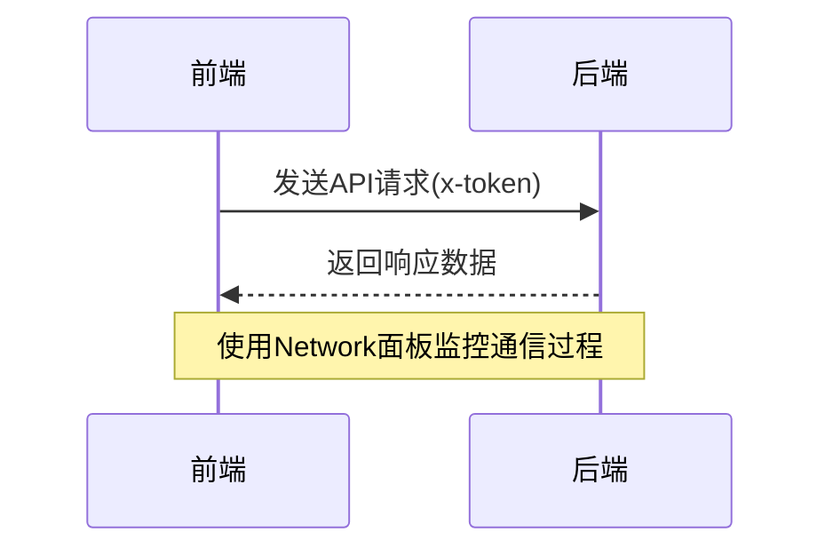

# 调试技巧

<cite>
**本文档中引用的文件**  
- [main.go](file://server/main.go)
- [server.go](file://server/core/server.go)
- [zap.go](file://server/core/zap.go)
- [Gorm.go](file://server/initialize/gorm.go)
- [router.go](file://server/initialize/router.go)
- [jwt.go](file://server/middleware/jwt.go)
- [casbin_rbac.go](file://server/middleware/casbin_rbac.go)
- [sys_user.go](file://server/service/system/sys_user.go)
- [sys_user.go](file://server/api/v1/system/sys_user.go)
- [config.yaml](file://server/config.yaml)
- [vite.config.js](file://web/vite.config.js)
- [request.js](file://web/src/utils/request.js)
</cite>

## 目录
1. [简介](#简介)
2. [后端调试实践](#后端调试实践)
3. [前端调试实践](#前端调试实践)
4. [前后端联调策略](#前后端联调策略)
5. [常见问题与规避方法](#常见问题与规避方法)
6. [总结](#总结)

## 简介
gin-vue-admin 是一个基于 Gin 和 Vue 的全栈开发基础平台,提供了丰富的功能模块和插件扩展能力。在实际开发过程中,高效的调试技巧对于快速定位和解决问题至关重要。本文将详细介绍该项目的前后端调试最佳实践,涵盖 Delve 调试器使用、Zap 日志系统配置、Postman 测试、Vue Devtools 使用以及 Vite 热重载等关键技术点。

## 后端调试实践

### 使用 Delve 调试器对接 Gin 框架
Delve 是 Go 语言的官方调试工具,能够有效帮助开发者排查接口逻辑问题。在 gin-vue-admin 项目中,可以通过以下步骤进行调试:

1. **安装 Delve**:
   ```bash
   go install github.com/go-delve/delve/cmd/dlv@latest
   ```

2. **启动调试会话**:
   在项目根目录下运行:
   ```bash
   dlv debug server/main.go
   ```

3. **设置断点**:
   在关键代码处设置断点,例如用户注册逻辑:
   ```bash
   (dlv) break server/api/v1/system/sys_user.go:162
   ```

4. **变量观察与调用栈分析**:
   使用 `print` 命令查看变量值,使用 `stack` 查看调用栈信息。

**Section sources**
- [main.go](file://server/main.go#L1-L52)
- [sys_user.go](file://server/api/v1/system/sys_user.go#L130-L180)

### 结合 Zap 日志系统实现结构化日志输出
Zap 是高性能的日志库,在 gin-vue-admin 中用于记录系统运行状态。通过合理配置不同日志级别,可以追踪请求生命周期与异常信息。

1. **配置日志级别**:
   修改 `server/config.yaml` 文件中的 Zap 配置项:
   ```yaml
   zap:
     level: "debug"
     format: "console"
     prefix: "[GIN-VUE-ADMIN]"
     director: "log"
     show-line: true
   ```

2. **日志输出示例**:
   当发生错误时,系统会自动记录详细信息:
   ```go
   global.GVA_LOG.Error("注册失败!", zap.Error(err))
   ```

**Section sources**
- [zap.go](file://server/core/zap.go#L14-L31)
- [config.yaml](file://server/config.yaml#L1-L20)

### 使用 Postman 或 curl 对 RESTful API 进行手动测试与验证
为了确保接口正确性,建议使用 Postman 或 curl 工具对 API 进行测试。

1. **Postman 测试流程**:
   - 导入 Swagger 文档生成的集合
   - 设置环境变量(如 base URL)
   - 添加认证头 `x-token`
   - 发送请求并检查响应结果

2. **curl 示例**:
   ```bash
   curl -X POST http://127.0.0.1:8888/user/admin_register \
     -H "Content-Type: application/json" \
     -H "x-token: your_token_here" \
     -d '{"username":"test","password":"123456"}'
   ```

**Section sources**
- [router.go](file://server/initialize/router.go#L35-L122)
- [sys_user.go](file://server/api/v1/system/sys_user.go#L130-L180)

## 前端调试实践

### 使用 Vue Devtools 监控组件状态、props 和事件流
Vue Devtools 提供了强大的组件树视图和状态管理功能,有助于理解数据流动。

1. **安装 Vue Devtools 扩展**:
   在 Chrome 浏览器中安装 Vue.js devtools 插件。

2. **监控组件状态**:
   打开开发者工具,切换到 Vue 标签页,选择目标组件查看其 props、data 和 computed 属性。

3. **跟踪事件流**:
   利用 Events 功能观察组件间通信过程。

**Section sources**
- [vite.config.js](file://web/vite.config.js#L1-L50)
- [request.js](file://web/src/utils/request.js#L1-L30)

### 利用 Vite 的热重载机制快速迭代开发
Vite 提供了极快的冷启动速度和即时热更新能力。

1. **启动开发服务器**:
   ```bash
   npm run dev
   ```

2. **修改代码即时生效**:
   编辑任何 `.vue` 或 `.js` 文件后,浏览器将自动刷新相关模块。

**Section sources**
- [vite.config.js](file://web/vite.config.js#L1-L50)

### 通过浏览器开发者工具的 Network 面板拦截和分析 HTTP 请求/响应数据
Network 面板是诊断网络问题的关键工具。

1. **捕获请求**:
   打开开发者工具 → Network 标签页,执行操作触发 API 调用。

2. **分析请求详情**:
   检查请求头、响应体、状态码等信息,确认是否符合预期。

**Section sources**
- [request.js](file://web/src/utils/request.js#L1-L30)

## 前后端联调策略

### 定位前后端交互问题
当遇到接口不通或数据不一致的情况时,应按照以下步骤排查:

1. **确认接口地址和参数**:
   检查前端发送的 URL 和 payload 是否正确。

2. **验证认证信息**:
   确保 `x-token` 头部已正确传递。

3. **比对日志输出**:
   查看后端日志是否有相关错误记录。



**Diagram sources**
- [request.js](file://web/src/utils/request.js#L1-L30)
- [jwt.go](file://server/middleware/jwt.go#L14-L76)

## 常见问题与规避方法

### JWT 认证失效
**现象**:频繁提示“登录已过期”。
**解决方案**:
- 检查 token 刷新逻辑
- 确认 `expires-time` 配置合理

### 数据库连接失败
**现象**:服务启动时报错无法连接数据库。
**解决方案**:
- 核实 `config.yaml` 中数据库配置
- 确保数据库服务正在运行

### CORS 跨域问题
**现象**:浏览器报跨域错误。
**解决方案**:
- 启用 `middleware.Cors()` 中间件
- 正确配置允许的源地址

**Section sources**
- [config.yaml](file://server/config.yaml#L1-L20)
- [jwt.go](file://server/middleware/jwt.go#L14-L76)
- [casbin_rbac.go](file://server/middleware/casbin_rbac.go#L13-L32)

## 总结
本文系统地介绍了 gin-vue-admin 项目的前后端调试最佳实践。通过掌握 Delve 调试器、Zap 日志系统、Postman 测试、Vue Devtools 和 Vite 热重载等技术,开发者可以显著提升开发效率和问题解决能力。同时,合理的联调策略和常见问题规避方法也为项目稳定运行提供了保障。