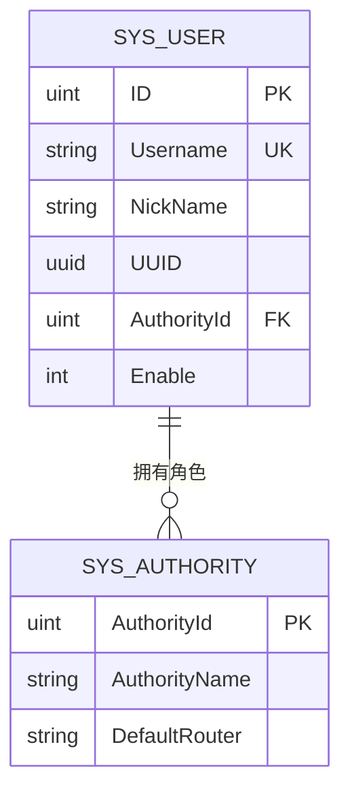

# 快速开始

<cite>
**本文档中引用的文件**
- [README.md](file://README.md)
- [Makefile](file://Makefile)
- [config.yaml](file://server/config.yaml)
- [docker-compose.yaml](file://deploy/docker-compose/docker-compose.yaml)
- [main.go](file://server/main.go)
- [viper.go](file://server/core/viper.go)
- [gorm.go](file://server/initialize/gorm.go)
- [sys_user.go](file://server/model/system/sys_user.go)
- [sys_authority.go](file://server/model/system/sys_authority.go)
</cite>

## 目录
1. [简介](#简介)
2. [环境准备](#环境准备)
3. [克隆项目](#克隆项目)
4. [配置后端数据库连接](#配置后端数据库连接)
5. [配置前端环境变量](#配置前端环境变量)
6. [启动服务](#启动服务)
7. [访问系统](#访问系统)
8. [常见问题与解决方案](#常见问题与解决方案)
9. [更多资源](#更多资源)

## 简介

`gin-vue-admin` 是一个基于 Vue 和 Gin 框架开发的全栈前后端分离的基础平台。本指南将指导新手用户如何在本地环境中部署和运行 `gin-vue-admin`，涵盖从克隆仓库到成功登录系统的完整流程。

**Section sources**
- [README.md](file://README.md#L1-L385)

## 环境准备

在开始之前，请确保您的开发环境已安装以下软件：

- **Git**: 用于克隆代码仓库
- **Go**: 版本 >= 1.22
- **Node.js**: 版本 > v18.16.0
- **Docker** (可选): 用于容器化部署
- **Docker Compose** (可选): 用于编排多容器应用

这些工具是运行 `gin-vue-admin` 的基本要求。

**Section sources**
- [README.md](file://README.md#L100-L105)

## 克隆项目

使用 Git 命令行工具克隆 `gin-vue-admin` 项目到本地：

```bash
git clone https://github.com/flipped-aurora/gin-vue-admin.git
cd gin-vue-admin
```

此命令会将整个项目仓库下载到当前目录，并进入项目根目录。

**Section sources**
- [README.md](file://README.md#L107-L110)

## 配置后端数据库连接

后端数据库配置位于 `server/config.yaml` 文件中。该文件使用 YAML 格式定义了多种数据库的支持选项。

### 数据库类型选择

在 `config.yaml` 中，通过 `system.db-type` 字段指定要使用的数据库类型。默认值为 `pgsql`：

```yaml
system:
  db-type: pgsql
```

支持的数据库类型包括：`mysql`、`pgsql`、`oracle`、`mssql` 和 `sqlite`。

### 配置 PostgreSQL 示例

以 PostgreSQL 为例，修改 `pgsql` 部分的配置：

```yaml
pgsql:
  path: 127.0.0.1
  port: "5433"
  config: sslmode=disable TimeZone=Asia/Shanghai
  db-name: gva2
  username: postgres
  password: "123456"
```

请根据您的实际数据库信息调整 `path`、`port`、`db-name`、`username` 和 `password`。

### 配置 MySQL 示例

如果选择 MySQL，需同时设置 `system.db-type` 为 `mysql` 并配置 `mysql` 区块：

```yaml
system:
  db-type: mysql

mysql:
  path: 127.0.0.1
  port: "3306"
  db-name: qmPlus
  username: root
  password: "your_password"
```

**Section sources**
- [config.yaml](file://server/config.yaml#L200-L248)
- [viper.go](file://server/core/viper.go#L1-L76)
- [gorm.go](file://server/initialize/gorm.go#L1-L79)

## 配置前端环境变量

前端项目位于 `web` 目录下。虽然项目中没有 `.env` 文件，但其配置主要通过 `vite.config.js` 和源码中的 API 地址进行管理。

### 前端API地址配置

前端通过 `request.js` 配置请求基础URL，默认指向 `http://localhost:8888`。您无需额外创建 `.env` 文件，除非需要覆盖默认行为。

若需自定义，可在 `web` 目录下创建 `.env` 文件：

```env
VITE_APP_BASE_API=http://localhost:8888
```

此配置会在构建时被 Vite 读取并注入到应用中。

**Section sources**
- [web/README.md](file://web/README.md#L1-L106)

## 启动服务

`gin-vue-admin` 提供了多种启动方式，包括使用 Makefile 和 Docker Compose。

### 使用 Makefile 启动

在项目根目录执行以下命令来构建并启动服务：

```bash
make build
```

此命令会依次构建前端和后端，并生成最终的可执行文件。

### 使用 Docker Compose 启动（推荐）

项目提供了完整的 Docker Compose 配置文件，位于 `deploy/docker-compose/docker-compose.yaml`。

#### 启动所有服务

```bash
cd deploy/docker-compose
docker-compose up -d
```

此命令将以守护进程模式启动所有服务，包括 Web 前端、Gin 后端、MySQL 和 Redis。

#### 预期输出

```bash
Creating network "docker-compose_network" with driver "bridge"
Creating volume "docker-compose_mysql" with default driver
Creating volume "docker-compose_redis" with default driver
Creating gva-mysql ... done
Creating gva-redis ... done
Creating gva-server ... done
Creating gva-web    ... done
```

#### 查看服务状态

```bash
docker-compose ps
```

**Section sources**
- [Makefile](file://Makefile#L1-L75)
- [docker-compose.yaml](file://deploy/docker-compose/docker-compose.yaml#L1-L90)

## 访问系统

服务启动后，您可以通过浏览器访问系统。

### 服务端口映射

- **前端 Web**: `http://localhost:8080`
- **后端 API**: `http://localhost:8888`
- **MySQL**: `localhost:13306`
- **Redis**: `localhost:16379`

### 登录系统

1. 打开浏览器，访问 `http://localhost:8080`
2. 使用默认管理员账户登录：
   - **用户名**: `admin`
   - **密码**: `123456`

登录成功后，您将进入系统管理后台界面。

### 默认管理员信息

系统预置了一个超级管理员账户，相关信息如下：

| 字段 | 值 |
|------|-----|
| 用户名 | admin |
| 密码 | 123456 |
| 角色 | 超级管理员 |
| 权限 | 拥有所有菜单和API权限 |

该账户信息定义在数据库初始化脚本中，首次启动时自动创建。



**Diagram sources**
- [sys_user.go](file://server/model/system/sys_user.go#L1-L65)
- [sys_authority.go](file://server/model/system/sys_authority.go#L1-L23)

**Section sources**
- [README.md](file://README.md#L50-L55)
- [sys_user.go](file://server/model/system/sys_user.go#L1-L65)

## 常见问题与解决方案

### 数据库连接失败

**问题现象**：后端服务无法连接数据库，日志显示连接超时或认证失败。

**解决方案**：
1. 检查 `config.yaml` 中的数据库地址、端口、用户名和密码是否正确
2. 确认数据库服务正在运行
3. 如果使用 Docker，检查容器间网络通信是否正常
4. 对于 MySQL，确保用户具有远程访问权限

### 端口冲突

**问题现象**：启动服务时报错 `port already allocated`。

**解决方案**：
1. 修改 `docker-compose.yaml` 中的端口映射：
   ```yaml
   ports:
     - '8081:8080'  # 前端端口改为8081
     - '8889:8888'  # 后端端口改为8889
   ```
2. 或者停止占用端口的其他进程

### 初始化数据未创建

**问题现象**：登录时提示用户不存在或密码错误。

**解决方案**：
1. 确保 `initialize.RegisterTables()` 函数被执行
2. 检查数据库中是否已创建 `sys_users` 表
3. 查看后端日志确认表结构迁移是否成功

### Redis 连接问题

当启用多点登录限制时，需要正确配置 Redis：

```yaml
system:
  use-multipoint: true
  use-redis: true

redis:
  addr: 127.0.0.1:6379
  password: ""
  db: 0
```

**Section sources**
- [config.yaml](file://server/config.yaml#L200-L248)
- [docker-compose.yaml](file://deploy/docker-compose/docker-compose.yaml