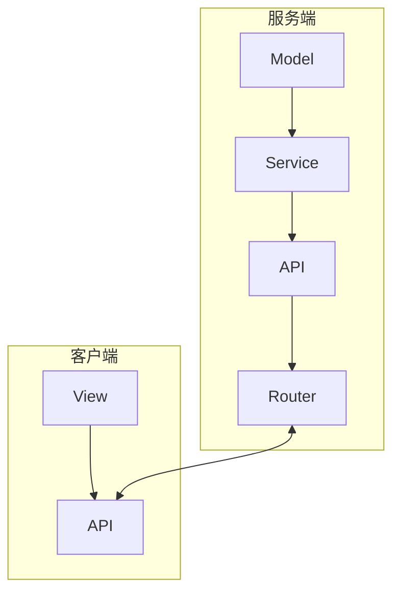
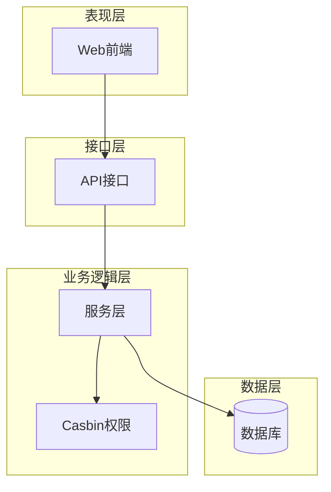
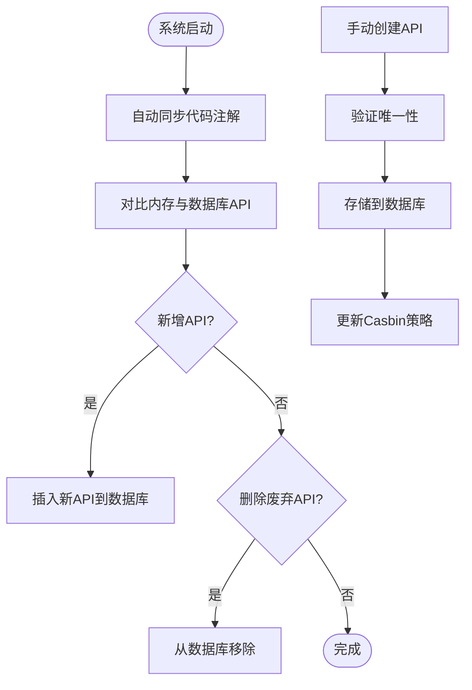
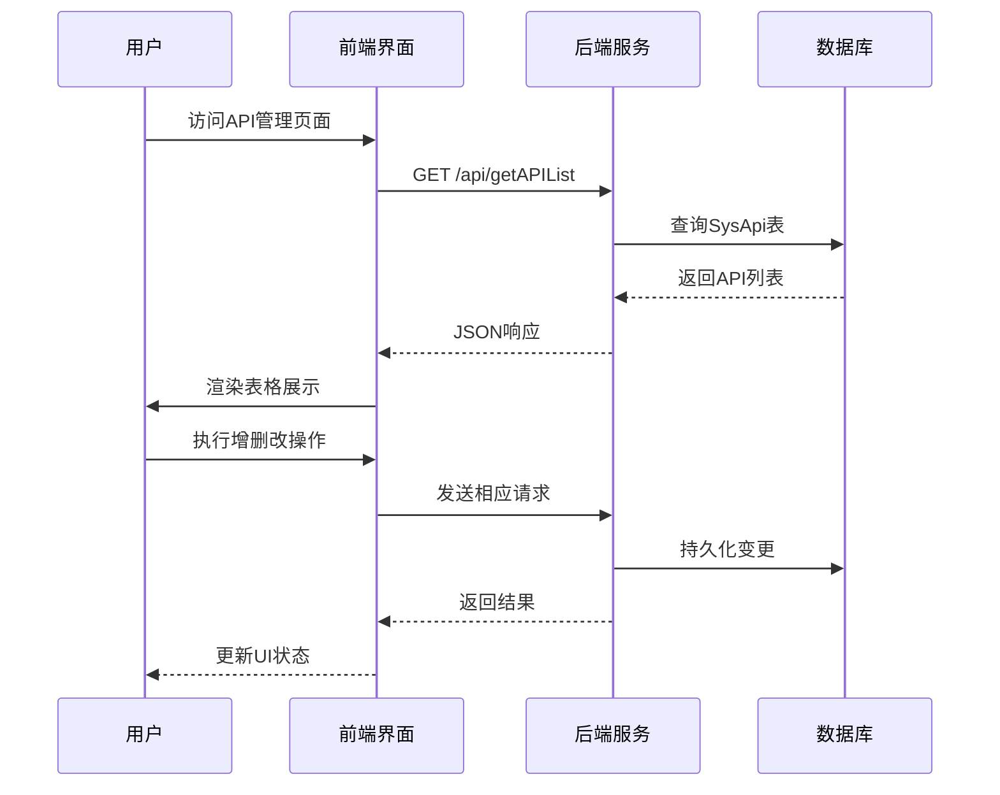
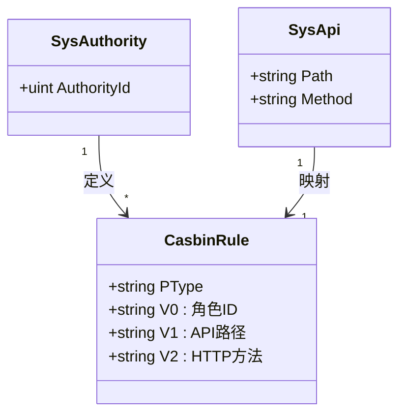
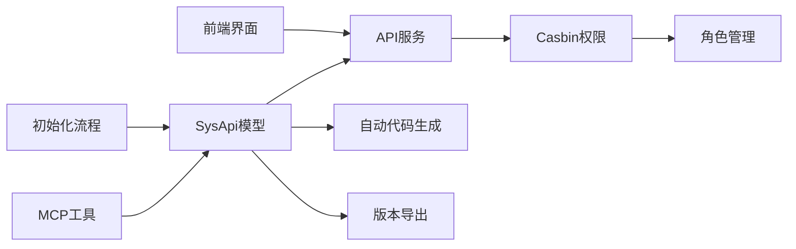

# API管理

<cite>
**本文档引用文件**  
- [sys_api.go](file://server/model/system/sys_api.go)
- [sys_casbin.go](file://server/service/system/sys_casbin.go)
- [sys_api.go](file://server/api/v1/system/sys_api.go)
- [sys_api.go](file://server/router/system/sys_api.go)
- [sys_api.go](file://server/service/system/sys_api.go)
- [api.js](file://web/src/api/api.js)
- [api.vue](file://web/src/view/superAdmin/api/api.vue)
- [api_creator.go](file://server/mcp/api_creator.go)
- [api_lister.go](file://server/mcp/api_lister.go)
- [ast.go](file://server/utils/ast/ast.go)
- [gorm.go](file://server/initialize/gorm.go)
</cite>

## 目录
1. [简介](#简介)
2. [项目结构](#项目结构)
3. [核心组件](#核心组件)
4. [架构概述](#架构概述)
5. [详细组件分析](#详细组件分析)
6. [依赖分析](#依赖分析)
7. [性能考虑](#性能考虑)
8. [故障排除指南](#故障排除指南)
9. [结论](#结论)

## 简介
本系统提供完整的API生命周期管理功能,涵盖API数据模型设计、自动注册机制、前端展示与操作、权限集成及版本控制等核心能力。通过SysApi数据模型统一管理所有接口元信息,并与Casbin权限系统深度集成,实现基于路径和方法的细粒度访问控制。

## 项目结构
系统采用前后端分离架构,API管理模块主要分布在服务端`server`目录下的model、api、service、router子模块中,以及客户端`web`目录的view和api子模块中。



**图源**
- [sys_api.go](file://server/model/system/sys_api.go)
- [api.js](file://web/src/api/api.js)

**节源**
- [sys_api.go](file://server/model/system/sys_api.go)
- [api.js](file://web/src/api/api.js)

## 核心组件
API管理模块的核心是SysApi数据模型,它定义了所有接口的元数据结构。该模型支持系统初始化时自动注册和手动录入两种方式,并通过前端界面实现完整的增删改查操作。同时,API信息作为资源被纳入Casbin权限体系,实现安全访问控制。

**节源**
- [sys_api.go](file://server/model/system/sys_api.go)
- [sys_casbin.go](file://server/service/system/sys_casbin.go)

## 架构概述
系统通过分层架构实现API管理功能:数据层由SysApi模型构成；业务逻辑层包含API同步、权限分配等功能；接口层暴露RESTful端点；表现层提供可视化操作界面。



**图源**
- [sys_api.go](file://server/model/system/sys_api.go)
- [sys_casbin.go](file://server/service/system/sys_casbin.go)

## 详细组件分析

### SysApi数据模型分析
SysApi结构体定义了API的核心属性及其用途:

```mermaid
classDiagram
    class SysApi {
        +uint ID
        +string Path
        +string Description
        +string ApiGroup
        +string Method
        +time.Time CreatedAt
        +time.Time UpdatedAt
        +*time.Time DeletedAt
    }
    note right of SysApi : "Path : API路径,用于路由匹配<br/>Description : API中文描述,便于理解<br/>ApiGroup : API组别,用于分类管理<br/>Method : 请求方法(POST/GET/PUT/DELETE)"
```

**图源**
- [sys_api.go](file://server/model/system/sys_api.go#L6-L12)

**节源**
- [sys_api.go](file://server/model/system/sys_api.go#L6-L12)

### API注册与同步机制
系统支持代码注解自动化同步和手动创建两种方式维护API列表。启动时通过AST解析自动发现接口,运行时可通过MCP工具或管理界面进行动态调整。



**图源**
- [ast.go](file://server/utils/ast/ast.go#L206-L233)
- [sys_api.go](file://server/service/system/sys_api.go#L54-L126)

**节源**
- [ast.go](file://server/utils/ast/ast.go#L206-L233)
- [sys_api.go](file://server/service/system/sys_api.go#L54-L126)

### 前端展示与操作流程
前端通过API调用获取列表数据,在管理界面中以表格形式展示所有API,并支持搜索、排序及CRUD操作。



**图源**
- [api.vue](file://web/src/view/superAdmin/api/api.vue)
- [sys_api.go](file://server/api/v1/system/sys_api.go)

**节源**
- [api.vue](file://web/src/view/superAdmin/api/api.vue)
- [sys_api.go](file://server/api/v1/system/sys_api.go)

### 权限集成机制
API路径和方法作为policymaker的资源参与权限分配,通过Casbin实现RBAC访问控制。



**图源**
- [sys_casbin.go](file://server/service/system/sys_casbin.go)
- [sys_api.go](file://server/model/system/sys_api.go)

**节源**
- [sys_casbin.go](file://server/service/system/sys_casbin.go)
- [sys_api.go](file://server/model/system/sys_api.go)

## 依赖分析
API管理模块与其他系统组件存在紧密依赖关系,形成完整的功能闭环。



**图源**
- [go.mod](file://go.mod)
- [sys_api.go](file://server/model/system/sys_api.go)

**节源**
- [go.mod](file://go.mod)
- [sys_api.go](file://server/model/system/sys_api.go)

## 性能考虑
为确保API管理功能的高效运行,系统在多个层面进行了优化设计:
- 使用GORM进行数据库操作,支持连接池和预编译
- 通过事务保证数据一致性
- 提供分页查询避免全量加载
- 利用缓存减少重复计算
- 支持批量操作降低网络开销

## 故障排除指南
常见问题及解决方案:
- **API未出现在管理列表**:检查是否被标记为忽略或尚未同步
- **权限配置不生效**:确认已调用FreshCasbin刷新策略
- **同步失败**:查看日志确认是否存在路径冲突
- **前端无法显示**:验证接口返回格式是否符合预期

**节源**
- [sys_casbin.go](file://server/service/system/sys_casbin.go#L170-L173)
- [sys_api.go](file://server/service/system/sys_api.go#L24-L29)

## 结论
本API管理系统实现了从定义、注册、展示到权限控制的完整闭环。通过标准化的数据模型和自动化同步机制,大幅提升了接口管理效率。与Casbin的深度集成确保了系统的安全性,而完善的前端交互则提供了良好的用户体验。建议定期审查API使用情况,及时清理废弃接口,并建立变更影响分析机制以保障系统稳定性。

</