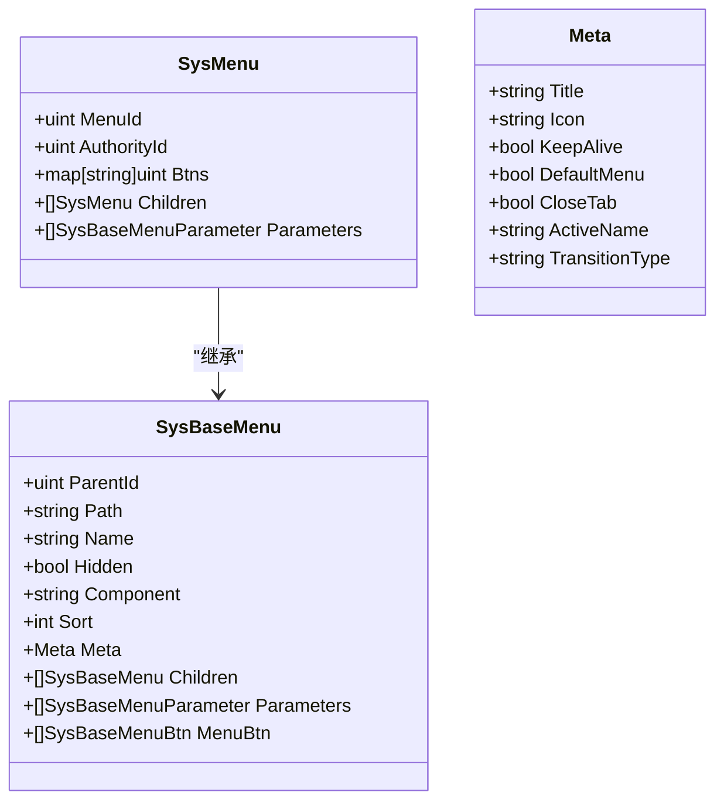
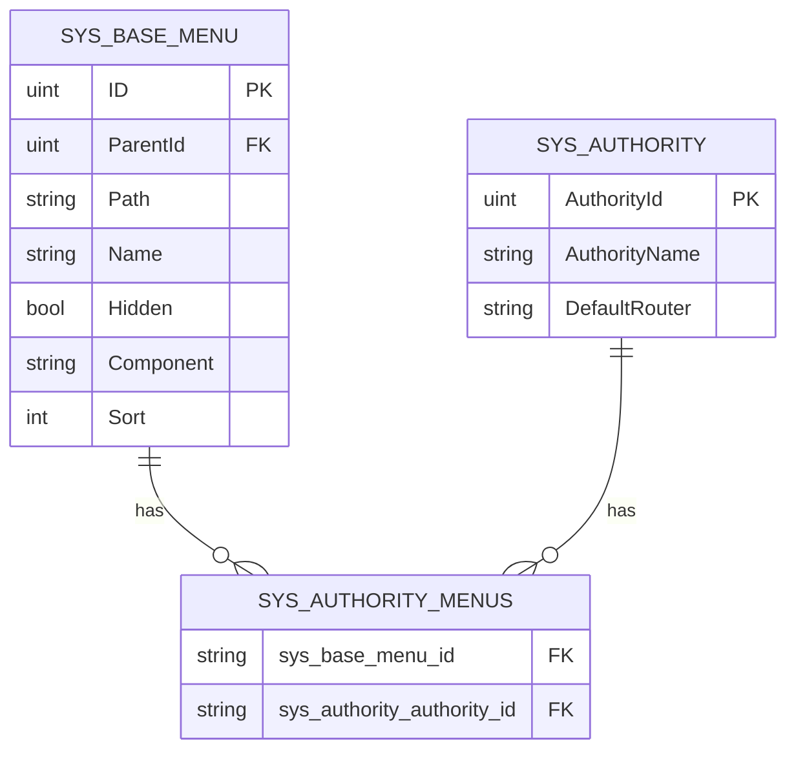
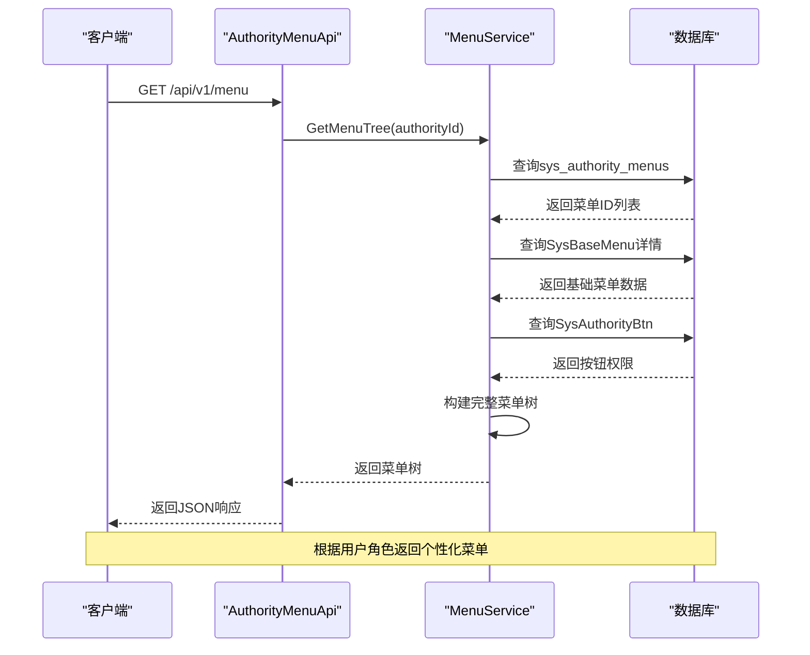
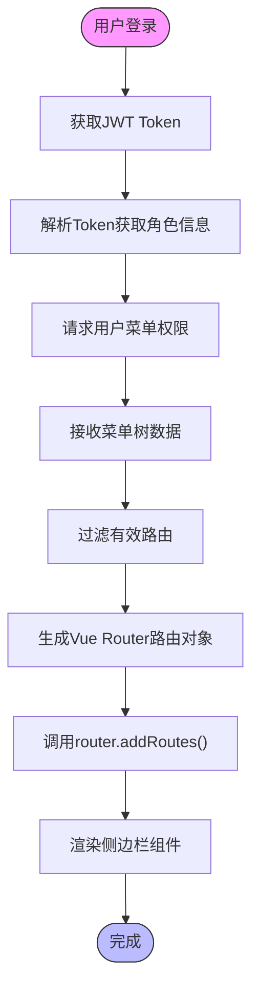

# 动态菜单系统

<cite>
**本文档引用的文件**
- [sys_base_menu.go](file://server/model/system/sys_base_menu.go)
- [sys_authority_menu.go](file://server/model/system/sys_authority_menu.go)
- [sys_authority.go](file://server/model/system/sys_authority.go)
- [sys_menu.go](file://server/service/system/sys_menu.go)
- [sys_version.go](file://server/service/system/sys_version.go)
- [menu_creator.go](file://server/mcp/menu_creator.go)
- [asyncRouter.js](file://web/src/utils/asyncRouter.js)
- [permission.js](file://web/src/permission.js)
</cite>

## 目录
1. [简介](#简介)
2. [核心模型分析](#核心模型分析)
3. [权限绑定机制](#权限绑定机制)
4. [后端API设计](#后端api设计)
5. [前端动态路由实现](#前端动态路由实现)
6. [复杂场景处理](#复杂场景处理)
7. [最佳实践](#最佳实践)

## 简介
动态菜单系统是gin-vue-admin框架的核心功能之一，实现了基于角色的个性化菜单展示。该系统通过数据库模型定义菜单结构，利用多对多关系表实现菜单与角色的灵活绑定，并通过前后端协同工作实现动态路由生成。本系统支持嵌套路由、隐藏菜单、外链跳转和按钮级权限控制等高级功能，为不同用户角色提供定制化的界面体验。

## 核心模型分析

### SysBaseMenu与SysMenu模型对比

在动态菜单系统中，`SysBaseMenu` 和 `SysMenu` 是两个关键的数据模型，它们分别代表基础菜单定义和角色关联菜单。

**SysBaseMenu模型** 定义了菜单的基础属性和结构：
- **ParentId**: 父菜单ID，用于构建树形结构
- **Path**: 路由路径，对应前端Vue Router的path
- **Name**: 路由名称，作为唯一标识符
- **Hidden**: 是否在侧边栏隐藏的布尔值
- **Component**: 前端组件路径，指定Vue组件文件位置
- **Sort**: 排序标记，决定菜单项的显示顺序
- **Meta**: 内嵌的附加属性结构，包含标题、图标、缓存设置等

**SysMenu模型** 继承自SysBaseMenu，并添加了与权限相关的字段：
- **MenuId**: 菜单ID，对应SysBaseMenu的主键
- **AuthorityId**: 角色ID，标识该菜单属于哪个角色
- **Btns**: 按钮权限映射，存储当前角色对该菜单的按钮操作权限

这两个模型的关系体现了系统的设计理念：SysBaseMenu作为全局共享的菜单模板库，而SysMenu则是在特定角色上下文中的实例化表现，包含了权限信息。

**图源**
- [sys_base_menu.go](file://server/model/system/sys_base_menu.go#L6-L20)
- [sys_authority_menu.go](file://server/model/system/sys_authority_menu.go#L2-L9)

**章节来源**
- [sys_base_menu.go](file://server/model/system/sys_base_menu.go#L6-L20)
- [sys_authority_menu.go](file://server/model/system/sys_authority_menu.go#L2-L9)

### 附加属性结构详解

Meta结构体封装了菜单的可视化和行为特性：
- **Title**: 菜单显示名称
- **Icon**: 图标标识符，通常对应SVG图标库中的名称
- **KeepAlive**: 是否启用页面缓存，true表示切换时保留组件状态
- **DefaultMenu**: 是否为基础路由（开发中）
- **CloseTab**: 是否自动关闭标签页
- **ActiveName**: 高亮菜单名称
- **TransitionType**: 路由切换动画类型

这些属性使得菜单配置更加灵活，能够满足复杂的UI需求。

## 权限绑定机制

### 多对多关系表设计

系统使用`sys_authority_menus`表实现菜单与角色的多对多关联。该表包含两个关键字段：
- **MenuId**: 对应SysBaseMenu的ID
- **AuthorityId**: 对应SysAuthority的角色ID

这种设计允许一个菜单被多个角色共享，同时也支持一个角色拥有多个菜单权限，实现了高度灵活的权限分配。

**图源**
- [sys_authority_menu.go](file://server/model/system/sys_authority_menu.go#L11-L14)
- [sys_authority.go](file://server/model/system/sys_authority.go#L6-L18)

**章节来源**
- [sys_authority_menu.go](file://server/model/system/sys_authority_menu.go#L11-L14)
- [sys_authority.go](file://server/model/system/sys_authority.go#L6-L18)

### 权限分配流程

当管理员为角色分配菜单权限时，系统执行以下步骤：
1. 验证管理者的权限等级是否足够进行此操作
2. 检查是否启用了严格的树形权限控制
3. 如果父角色不为0且开启了严格模式，则需要验证跨级操作的合法性
4. 将选中的菜单ID与角色ID的组合插入到sys_authority_menus表中

这一过程确保了权限分配的安全性和一致性。

## 后端API设计

### 菜单获取API

后端提供了`GetMenu` API来根据用户权限返回可访问的菜单树：

**图源**
- [sys_menu.go](file://server/service/system/sys_menu.go#L77-L84)
- [sys_menu.go](file://server/api/v1/system/sys_menu.go#L25-L36)

**章节来源**
- [sys_menu.go](file://server/service/system/sys_menu.go#L77-L84)
- [sys_menu.go](file://server/api/v1/system/sys_menu.go#L25-L36)

### 菜单树构建算法

`getMenuTreeMap`方法负责将扁平化的菜单数据转换为树形结构：
1. 首先查询当前角色的所有授权菜单ID
2. 根据这些ID获取完整的SysBaseMenu记录
3. 创建SysMenu实例并填充权限相关信息
4. 使用哈希表按ParentId分组，便于快速查找子节点
5. 递归构建完整的菜单树

这个算法的时间复杂度为O(n)，其中n是菜单项的数量，保证了即使在大型系统中也能高效运行。

## 前端动态路由实现

### asyncRouter机制

前端通过`asyncRouter`机制实现动态路由生成：

**图源**
- [asyncRouter.js](file://web/src/utils/asyncRouter.js)
- [permission.js](file://web/src/permission.js)

**章节来源**
- [asyncRouter.js](file://web/src/utils/asyncRouter.js)
- [permission.js](file://web/src/permission.js)

### 路由守卫集成

系统在`permission.js`中实现了完整的路由守卫逻辑：
1. 在每次路由跳转前检查用户登录状态
2. 如果未登录则重定向到登录页
3. 如果已登录但尚未获取菜单，则发起菜单获取请求
4. 根据返回的菜单数据动态添加路由
5. 验证目标路由是否在用户的权限范围内

这种设计确保了只有经过授权的用户才能访问相应的页面。

## 复杂场景处理

### 嵌套路由支持

系统完全支持嵌套路由，通过ParentId字段建立父子关系。当某个菜单项有子菜单时，其对应的Vue组件通常会包含`<router-view>`元素，实现内容区域的嵌套显示。排序字段(Sort)确保了同一层级菜单的正确显示顺序。

### 隐藏菜单与外链跳转

- **隐藏菜单**(Hidden=true): 不在侧边栏显示，但仍可通过直接URL访问，常用于详情页等二级页面
- **外链跳转**: 通过特殊组件路径配置，可以实现站外链接的打开，通常用于集成第三方服务或文档

### 按钮权限控制

除了菜单级别的访问控制，系统还实现了细粒度的按钮权限：
- 每个菜单可以定义多个按钮(`MenuBtn`)
- 按钮具有唯一的名称(key)和描述
- 角色权限中包含`btns`映射，记录该角色对各个按钮的操作权限
- 前端通过自定义指令`v-auth`控制按钮的显示与隐藏

这种方式实现了真正的"最小权限原则"，确保用户只能看到和操作其被授权的功能。

## 最佳实践

### 菜单缓存策略

建议采用以下缓存策略提升用户体验：
1. 登录后将菜单数据存储在Vuex store中
2. 设置合理的缓存有效期（如会话期间）
3. 当用户权限发生变化时主动清除缓存并重新获取
4. 可以考虑在localStorage中持久化菜单结构，减少首次加载时间

### 权限更新后的菜单刷新

当管理员修改了角色的菜单权限后，需要确保相关用户能够及时获得更新：
1. 服务端可以通过WebSocket通知受影响的客户端
2. 客户端监听权限变更事件，触发菜单重新获取
3. 或者在下一次路由跳转时强制刷新菜单数据
4. 提供手动刷新按钮作为备选方案

这些实践能够保证系统的安全性和用户体验的平衡。