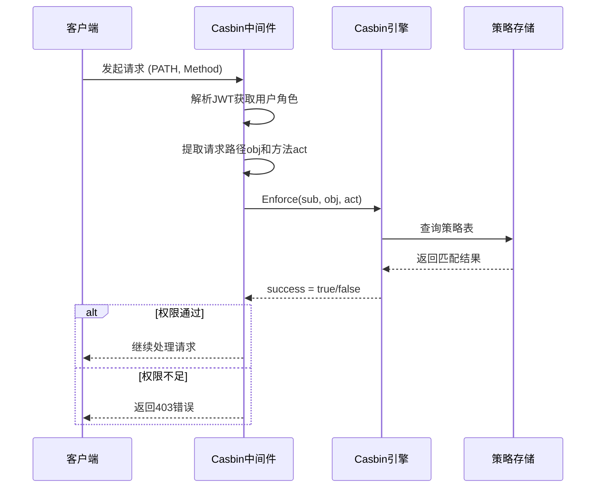
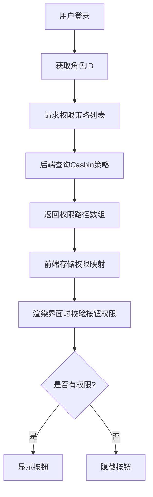

# 基于Casbin的RBAC权限控制

<cite>
**本文档引用文件**  
- [sys_authority.go](file://server/model/system/sys_authority.go)
- [casbin_rbac.go](file://server/middleware/casbin_rbac.go)
- [casbin.go](file://server/source/system/casbin.go)
- [sys_casbin.go](file://server/api/v1/system/sys_casbin.go)
- [config.yaml](file://server/config.yaml)
</cite>

## 目录
1. [简介](#简介)
2. [核心结构与字段解析](#核心结构与字段解析)
3. [Casbin中间件权限拦截机制](#casbin中间件权限拦截机制)
4. [权限策略配置与规则匹配](#权限策略配置与规则匹配)
5. [API与按钮级权限校验流程](#api与按钮级权限校验流程)
6. [权限继承与数据权限实现](#权限继承与数据权限实现)
7. [权限策略持久化与数据库同步](#权限策略持久化与数据库同步)
8. [前端按钮显隐控制实现](#前端按钮显隐控制实现)
9. [权限缓存刷新与策略同步](#权限缓存刷新与策略同步)
10. [总结](#总结)

## 简介
本系统采用基于Casbin的RBAC（基于角色的访问控制）权限模型，结合Gin-Vue-Admin框架实现了细粒度的权限管理。通过`SysAuthority`结构体定义角色层级关系，并利用Casbin进行动态权限验证，支持API接口级别和前端按钮级别的权限控制。整个权限体系涵盖角色创建、权限分配、策略持久化、继承机制及前后端协同控制等完整功能。

## 核心结构与字段解析

`SysAuthority`结构体是权限系统的核心数据模型，用于表示系统中的角色及其属性和关联关系。

```go
type SysAuthority struct {
	CreatedAt       time.Time       // 创建时间
	UpdatedAt       time.Time       // 更新时间
	DeletedAt       *time.Time      `sql:"index"`
	AuthorityId     uint            `json:"authorityId" gorm:"not null;unique;primary_key;comment:角色ID;size:90"` // 角色ID
	AuthorityName   string          `json:"authorityName" gorm:"comment:角色名"`                                    // 角色名
	ParentId        *uint           `json:"parentId" gorm:"comment:父角色ID"`                                       // 父角色ID
	DataAuthorityId []*SysAuthority `json:"dataAuthorityId" gorm:"many2many:sys_data_authority_id;"`
	Children        []SysAuthority  `json:"children" gorm:"-"`
	SysBaseMenus    []SysBaseMenu   `json:"menus" gorm:"many2many:sys_authority_menus;"`
	Users           []SysUser       `json:"-" gorm:"many2many:sys_user_authority;"`
	DefaultRouter   string          `json:"defaultRouter" gorm:"comment:默认菜单;default:dashboard"` // 默认菜单(默认dashboard)
}
```

### 字段说明

- **AuthorityId**: 角色唯一标识符，作为主键使用，在Casbin策略中作为主体（subject）。
- **AuthorityName**: 角色名称，便于用户识别和管理。
- **ParentId**: 指向父角色的ID，实现角色间的继承关系，支持多层嵌套。
- **DataAuthorityId**: 多对多关系字段，表示该角色可访问的数据权限范围。
- **Children**: 子角色列表，用于构建角色树形结构。
- **SysBaseMenus**: 关联的菜单项，决定角色可见的导航菜单。
- **DefaultRouter**: 角色登录后的默认跳转路由。

**Section sources**
- [sys_authority.go](file://server/model/system/sys_authority.go#L6-L18)

## Casbin中间件权限拦截机制

Casbin中间件负责在HTTP请求到达业务逻辑前进行权限检查，确保只有具备相应权限的用户才能执行操作。



**Diagram sources**
- [casbin_rbac.go](file://server/middleware/casbin_rbac.go#L13-L32)

**Section sources**
- [casbin_rbac.go](file://server/middleware/casbin_rbac.go#L13-L32)

## 权限策略配置与规则匹配

系统通过`model.conf`文件定义访问控制模型，典型的RBAC配置如下：

```ini
[request_definition]
r = sub, obj, act

[policy_definition]
p = sub, obj, act

[role_definition]
g = _, _

[policy_effect]
e = some(where (p.eft == allow))

[matchers]
m = g(r.sub, p.sub) && keyMatch(r.obj, p.obj) && regexMatch(r.act, p.act)
```

其中：
- `sub` 表示用户或角色
- `obj` 表示资源（如 `/user/getUserInfo`）
- `act` 表示操作（如 `GET`, `POST`）

实际策略存储于数据库`casbin_rule`表中，每条记录对应一个三元组 `(p, 角色ID, 路径, 方法)`。

**Section sources**
- [casbin.go](file://server/source/system/casbin.go#L50-L300)

## API与按钮级权限校验流程

### API权限校验流程

1. 用户发起API请求
2. JWT中间件解析Token获取`AuthorityId`
3. Casbin中间件截获请求，提取`path`和`method`
4. 调用`e.Enforce(sub, obj, act)`进行策略匹配
5. 匹配成功则放行，否则返回“权限不足”

### 按钮级权限校验流程

前端通过调用`/casbin/getPolicyPathByAuthorityId`接口获取当前角色的所有权限策略，然后根据路由和操作类型判断是否显示特定按钮。



**Diagram sources**
- [sys_casbin.go](file://server/api/v1/system/sys_casbin.go#L20-L70)
- [casbin_rbac.go](file://server/middleware/casbin_rbac.go#L13-L32)

**Section sources**
- [sys_casbin.go](file://server/api/v1/system/sys_casbin.go#L20-L70)

## 权限继承与数据权限实现

### 角色继承机制

通过`ParentId`字段建立父子角色关系，子角色自动继承父角色的所有权限。例如：

```text
超级管理员 (888)
├── 系统管理员 (8881)
└── 普通管理员 (9528)
```

当为“超级管理员”分配某项权限后，所有子角色均自动获得该权限。

### 数据权限实现

`DataAuthorityId`字段支持跨角色的数据共享配置，允许将特定角色的数据访问权限授予其他角色，实现灵活的数据隔离与共享策略。

**Section sources**
- [sys_authority.go](file://server/model/system/sys_authority.go#L6-L18)

## 权限策略持久化与数据库同步

权限策略通过GORM Adapter持久化到数据库`casbin_rule`表中，确保服务重启后策略不丢失。

初始化时，系统预置了基础权限策略（如角色ID为888、8881、9528的默认权限），并通过以下代码完成写入：

```go
entities := []adapter.CasbinRule{
    {Ptype: "p", V0: "888", V1: "/user/admin_register", V2: "POST"},
    // ... 更多策略
}
db.Create(&entities)
```

更新权限时调用`UpdateCasbin`接口，由`casbinService.UpdateCasbin`方法同步至数据库。

**Section sources**
- [casbin.go](file://server/source/system/casbin.go#L50-L300)

## 前端按钮显隐控制实现

前端通过`directive/auth.js`指令实现按钮级权限控制：

```javascript
// 示例：v-auth="'/user/deleteUser'"
Vue.directive('auth', {
  inserted(el, binding) {
    const permissions = store.getters.permissions;
    if (!permissions.includes(binding.value)) {
      el.parentNode.removeChild(el);
    }
  }
});
```

流程如下：
1. 登录后获取用户权限列表
2. 将权限存储于Vuex状态管理中
3. 使用`v-auth`指令绑定资源路径
4. 指令根据权限决定是否渲染DOM元素

**Section sources**
- [sys_casbin.go](file://server/api/v1/system/sys_casbin.go#L40-L70)

## 权限缓存刷新与策略同步

当权限发生变更时，需及时刷新Casbin内存中的策略以保证实时性。

### 策略更新接口

```go
func (cas *CasbinApi) UpdateCasbin(c *gin.Context) {
    var cmr request.CasbinInReceive
    _ = c.ShouldBindJSON(&cmr)
    adminAuthorityID := utils.GetUserAuthorityId(c)
    err := casbinService.UpdateCasbin(adminAuthorityID, cmr.AuthorityId, cmr.CasbinInfos)
    if err != nil {
        response.FailWithMessage("更新失败", c)
        return
    }
    response.OkWithMessage("更新成功", c)
}
```

该接口会：
1. 验证调用者权限
2. 删除旧策略
3. 写入新策略到数据库
4. 自动重载Casbin策略缓存

**Section sources**
- [sys_casbin.go](file://server/api/v1/system/sys_casbin.go#L20-L70)

## 总结

本系统基于Casbin构建了一套完整的RBAC权限管理体系，具备以下特点：
- 支持角色继承，简化权限分配
- 实现API级别和按钮级别的细粒度控制
- 权限策略持久化存储，保障数据一致性
- 前后端协同工作，提升用户体验
- 提供灵活的数据权限配置能力

通过合理设计`SysAuthority`结构体与Casbin策略配合，实现了高内聚、低耦合的权限控制系统，适用于复杂的企业级应用。