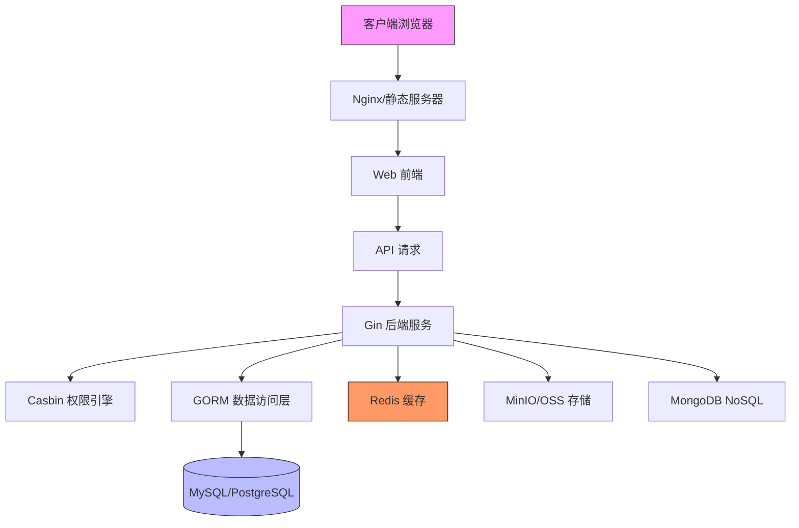
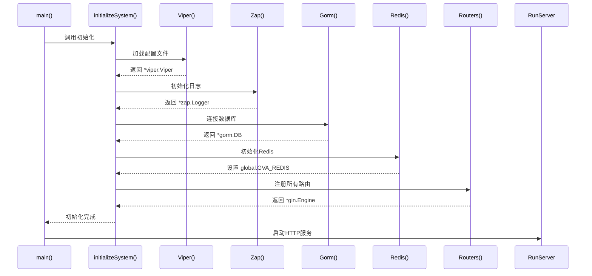
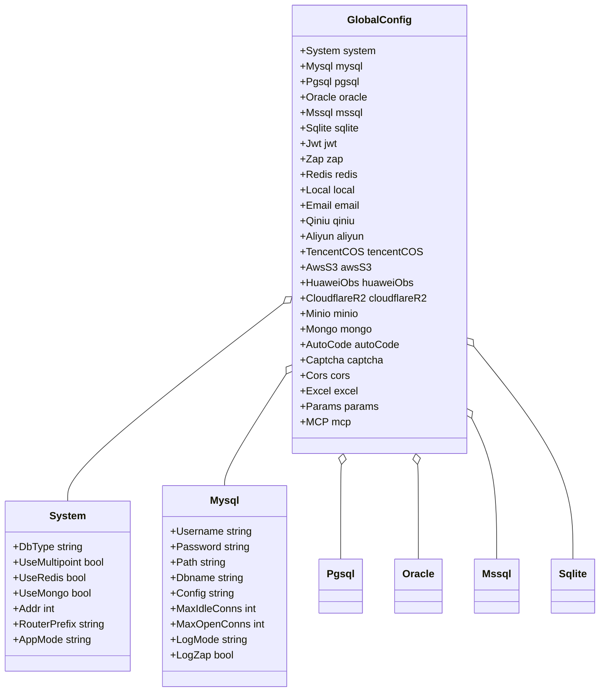
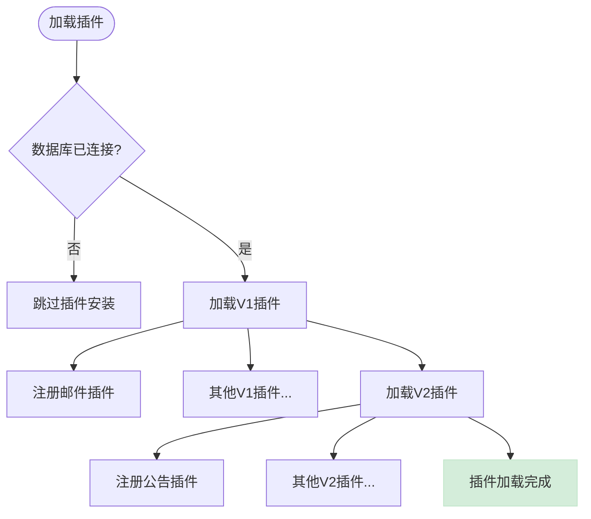

# 系统概述

<cite>
**本文档引用文件**  
- [README.md](file://README.md)
- [main.go](file://server/main.go)
- [viper.go](file://server/core/viper.go)
- [zap.go](file://server/core/zap.go)
- [gorm.go](file://server/initialize/gorm.go)
- [router.go](file://server/initialize/router.go)
- [redis.go](file://server/initialize/redis.go)
- [mcp.go](file://server/initialize/mcp.go)
- [plugin.go](file://server/initialize/plugin.go)
- [config.go](file://server/config/config.go)
- [plugin.go](file://server/plugin/announcement/plugin.go)
- [email/main.go](file://server/plugin/email/main.go)
</cite>

## 目录
1. [简介](#简介)
2. [项目结构](#项目结构)
3. [核心组件](#核心组件)
4. [架构概览](#架构概览)
5. [详细组件分析](#详细组件分析)
6. [依赖分析](#依赖分析)
7. [性能考量](#性能考量)
8. [故障排除指南](#故障排除指南)
9. [结论](#结论)

## 简介
gin-vue-admin 是一个基于 Gin 和 Vue 的全栈后台管理框架，采用前后端分离架构。该项目集成了 JWT 鉴权、动态路由、Casbin 权限控制、自动代码生成器等核心功能，旨在为开发者提供一个高效、可扩展的开发基础平台。通过 MVC 分层设计和模块化组织，系统实现了高内聚低耦合的架构特性。

**Section sources**
- [README.md](file://README.md#L1-L385)

## 项目结构
项目采用清晰的目录划分方式，分为 server（后端）和 web（前端）两大模块。后端基于 Go 语言构建，使用 Gin 框架处理 HTTP 请求；前端基于 Vue 3 和 Element Plus 构建用户界面。

```mermaid
graph TB
subgraph "根目录"
deploy[部署配置]
server[后端服务]
web[前端应用]
README[项目说明]
end
subgraph "后端 server"
api[API接口]
config[配置文件]
core[核心组件]
global[全局对象]
initialize[初始化逻辑]
middleware[中间件]
model[数据模型]
router[路由管理]
service[业务逻辑]
utils[工具函数]
end
subgraph "前端 web"
src[源码]
assets[静态资源]
components[组件库]
pinia[状态管理]
router[前端路由]
end
deploy --> server
deploy --> web
server < --> web
```

**Diagram sources**
- [README.md](file://README.md#L1-L385)

**Section sources**
- [README.md](file://README.md#L1-L385)

## 核心组件
系统的核心组件包括配置管理、日志记录、数据库连接、路由注册、权限控制和插件系统。这些组件通过依赖注入的方式在初始化阶段组装，确保系统的可维护性和可测试性。

**Section sources**
- [main.go](file://server/main.go#L1-L52)
- [core/viper.go](file://server/core/viper.go#L16-L41)
- [core/zap.go](file://server/core/zap.go#L14-L31)

## 架构概览
gin-vue-admin 采用典型的前后端分离架构，后端提供 RESTful API 接口，前端通过 Axios 调用接口获取数据并渲染页面。系统整体遵循 MVC 设计模式，各层职责分明。



**Diagram sources**
- [README.md](file://README.md#L1-L385)
- [main.go](file://server/main.go#L1-L52)

## 详细组件分析

### 初始化流程分析
系统启动时从 main.go 入口开始执行 initializeSystem 函数，依次初始化配置、日志、数据库、缓存等核心组件。



**Diagram sources**
- [main.go](file://server/main.go#L1-L52)
- [core/viper.go](file://server/core/viper.go#L16-L41)
- [core/zap.go](file://server/core/zap.go#L14-L31)
- [initialize/gorm.go](file://server/initialize/gorm.go#L13-L34)
- [initialize/redis.go](file://server/initialize/redis.go#L38-L44)
- [initialize/router.go](file://server/initialize/router.go#L35-L122)

**Section sources**
- [main.go](file://server/main.go#L1-L52)

### 配置管理组件
系统使用 Viper 库实现配置文件管理，支持 YAML 格式配置，并具备热更新能力。配置项涵盖数据库、JWT、OSS、Redis 等多个方面。



**Diagram sources**
- [config/config.go](file://server/config/config.go)
- [core/viper.go](file://server/core/viper.go#L16-L41)

### 插件化扩展机制
系统支持两种插件注册模式（V1 和 V2），允许开发者通过插件形式扩展功能。现有示例包括公告系统和邮件服务插件。



**Diagram sources**
- [initialize/plugin.go](file://server/initialize/plugin.go#L7-L14)
- [initialize/plugin_biz_v1.go](file://server/initialize/plugin_biz_v1.go#L20-L35)
- [initialize/plugin_biz_v2.go](file://server/initialize/plugin_biz_v2.go#L13-L15)
- [plugin/email/main.go](file://server/plugin/email/main.go#L10-L20)
- [plugin/announcement/plugin.go](file://server/plugin/announcement/plugin.go#L11-L11)

## 依赖分析
系统依赖关系复杂但组织有序，核心依赖包括：

```mermaid
graph LR
    A[gin-vue-admin] --> B[Gin]
    A --> C[GORM]
    A --> D[Vue 3]
    A --> E[Element Plus]
    A --> F[Casbin]
    A --> G[Zap]
    A --> H[Viper]
    A --> I[Redis]
    A --> J[MinIO SDK]
    A --> K[Qiniu SDK]
    A --> L[AWS S3 SDK]
    A --> M[Tencent COS SDK]
    
    B --> N[net/http]
    C --> O[database/sql]
    G --> P[go-redis/redis]
    H --> Q[fsnotify]
    
    style A fill:#ffcc00,stroke:#333
    style B fill:#4CAF50,stroke:#333,color:white
    style C fill:#219