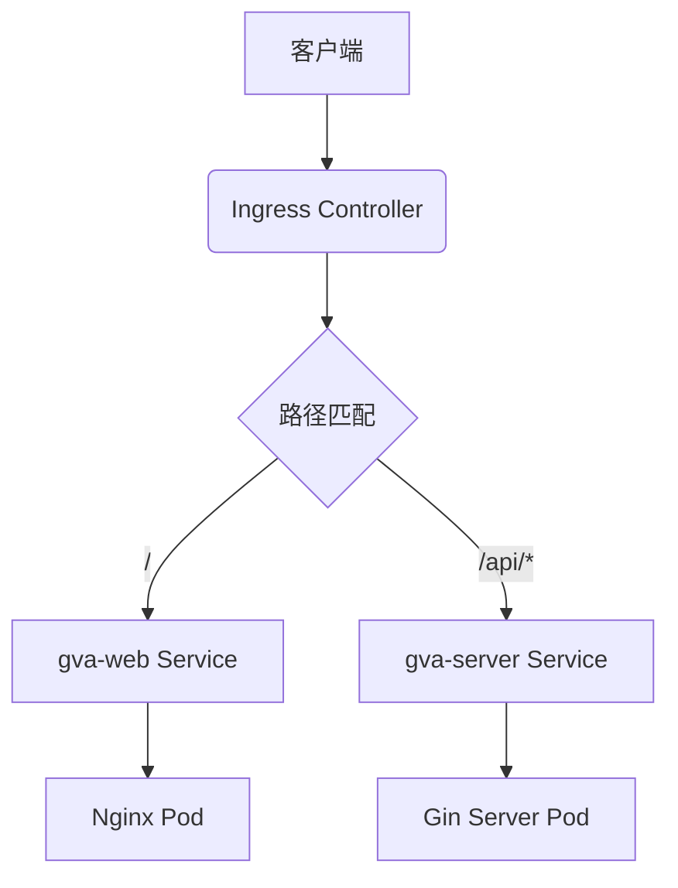

# Kubernetes 集群部署

<cite>
**本文档引用文件**  
- [gva-server-deployment.yaml](file://deploy/kubernetes/server/gva-server-deployment.yaml)
- [gva-server-service.yaml](file://deploy/kubernetes/server/gva-server-service.yaml)
- [gva-server-configmap.yaml](file://deploy/kubernetes/server/gva-server-configmap.yaml)
- [gva-web-deploymemt.yaml](file://deploy/kubernetes/web/gva-web-deploymemt.yaml)
- [gva-web-service.yaml](file://deploy/kubernetes/web/gva-web-service.yaml)
- [gva-web-ingress.yaml](file://deploy/kubernetes/web/gva-web-ingress.yaml)
- [gva-web-configmap.yaml](file://deploy/kubernetes/web/gva-web-configmap.yaml)
- [config.docker.yaml](file://server/config.docker.yaml)
</cite>

## 目录
1. [简介](#简介)
2. [后端服务部署配置](#后端服务部署配置)
3. [前端服务部署配置](#前端服务部署配置)
4. [配置管理机制](#配置管理机制)
5. [网络与服务暴露](#网络与服务暴露)
6. [安全与存储策略](#安全与存储策略)
7. [Helm 与 CI/CD 建议](#helm-与-cicd-建议)
8. [运维操作命令示例](#运维操作命令示例)

## 简介
本项目为基于 Gin 和 Vue 的全栈前后端分离开发平台，提供 JWT 鉴权、动态路由、Casbin 权限控制、代码生成器等核心功能。Kubernetes 部署方案将应用分为后端 API 服务（gva-server）和前端静态服务（gva-web），通过 Ingress 统一对外暴露，实现高可用与可扩展的生产级部署架构。

## 后端服务部署配置

### Pod 副本数与更新策略
在 `gva-server-deployment.yaml` 中，`spec.replicas: 1` 定义了后端服务初始运行一个 Pod 实例。该值可根据负载需求动态调整以实现水平扩展。Deployment 默认采用滚动更新（RollingUpdate）策略，确保更新过程中服务不中断，新旧 Pod 交替替换，保障业务连续性。

### 资源请求与限制
容器资源配置如下：
- **CPU 请求**: 100m，保证基础调度资源
- **CPU 限制**: 1000m（即 1 核），防止突发占用过多 CPU
- **内存请求**: 200Mi，确保稳定运行
- **内存限制**: 2000Mi（约 2GB），避免内存溢出导致节点不稳定

此配置平衡了性能与资源利用率，适用于中等负载场景。

### 就绪与存活探针
- **存活探针 (livenessProbe)**：通过 TCP 检查端口 8888 是否可连接，周期 5 秒，超时 1 秒，失败 1 次即判定失败，触发容器重启。
- **就绪探针 (readinessProbe)**：同样检查 8888 端口，初始延迟 30 秒（等待应用启动），周期 5 秒，连续 3 次失败后从 Service 后端移除，确保流量仅转发至健康实例。
- **启动探针 (startupProbe)**：允许最多 40 次检测（共 200 秒），用于慢启动应用，成功后才启用其他探针。

**Section sources**
- [gva-server-deployment.yaml](file://deploy/kubernetes/server/gva-server-deployment.yaml#L22-L73)

## 前端服务部署配置

### Web 层 Deployment 分析
`gva-web-deploymemt.yaml` 定义了前端 Nginx 服务：
- 运行镜像 `registry.cn-hangzhou.aliyuncs.com/gva/web:latest`
- 单副本部署 (`replicas: 1`)
- 资源限制：CPU 500m，内存 1000Mi
- 就绪探针检查 8080 端口，初始延迟 10 秒

容器通过 ConfigMap `my.conf` 挂载 Nginx 配置，实现静态资源服务与 API 反向代理。

### Service 作用
`gva-web-service.yaml` 创建类型为 `ClusterIP` 的 Service，将集群内部流量从端口 8080 转发至后端 Pod 的 8080 端口，为 Ingress 提供稳定的访问入口。

**Section sources**
- [gva-web-deploymemt.yaml](file://deploy/kubernetes/web/gva-web-deploymemt.yaml#L1-L51)
- [gva-web-service.yaml](file://deploy/kubernetes/web/gva-web-service.yaml#L1-L21)

## 配置管理机制

### ConfigMap 动态配置
`gva-server-configmap.yaml` 将 `config.docker.yaml` 文件内容作为键 `config.yaml` 存储于名为 `config.yaml` 的 ConfigMap 中。该配置通过卷挂载方式注入到 gva-server 容器的 `/go/src/github.com/flipped-aurora/gin-vue-admin/server/config.docker.yaml` 路径。

当 ConfigMap 更新后，可通过滚动更新 Deployment 使新配置生效，实现配置的动态管理。配置项涵盖 JWT 密钥、Redis 地址、数据库类型、日志级别等核心参数。

### 前端 Nginx 配置管理
`gva-web-configmap.yaml` 定义了 Nginx 的虚拟主机配置，包含：
- 静态资源根目录 `/usr/share/nginx/html`
- HTML 5 路由支持（`try_files $uri $uri/ /index.html`）
- API 请求反向代理至 `gva-server:8888`
- Swagger 文档特殊路径处理

**Section sources**
- [gva-server-configmap.yaml](file://deploy/kubernetes/server/gva-server-configmap.yaml#L1-L148)
- [gva-web-configmap.yaml](file://deploy/kubernetes/web/gva-web-configmap.yaml#L1-L31)
- [config.docker.yaml](file://server/config.docker.yaml#L1-L282)

## 网络与服务暴露

### Ingress 路由规则
`gva-web-ingress.yaml` 定义了基于域名 `demo.gin-vue-admin.com` 的 Ingress 规则：
- 根路径 `/` 流量转发至 `gva-web` 服务，服务前端页面
- 所有 `/api/*` 路径请求被重写并代理至后端 `gva-server:8888`，实现前后端同域部署，规避跨域问题
- 特别处理 `/api/swagger/index.html` 路径，确保 API 文档正确加载

此设计实现了单一入口、路径分流的微服务网关模式。



**Diagram sources**
- [gva-web-ingress.yaml](file://deploy/kubernetes/web/gva-web-ingress.yaml#L1-L17)
- [gva-web-service.yaml](file://deploy/kubernetes/web/gva-web-service.yaml#L1-L21)
- [gva-server-service.yaml](file://deploy/kubernetes/server/gva-server-service.yaml#L1-L21)

**Section sources**
- [gva-web-ingress.yaml](file://deploy/kubernetes/web/gva-web-ingress.yaml#L1-L17)

## 安全与存储策略

### Secrets 安全管理
当前配置中敏感信息（如邮箱密码、OSS 密钥）以明文形式存在于 ConfigMap，存在安全风险。建议将此类信息迁移至 Kubernetes Secret 资源，并通过环境变量或卷挂载方式注入容器，实现敏感数据加密存储与访问控制。

### 持久化存储声明
现有部署未定义持久化存储。若需持久化日志、上传文件等数据，应创建 PersistentVolumeClaim (PVC) 并挂载至相应路径（如 `/go/src/github.com/flipped-aurora/gin-vue-admin/server/log`）。对于数据库，推荐使用独立的 StatefulSet 或云数据库服务。

### 命名空间隔离
建议将 `gva-server` 和 `gva-web` 部署于独立的命名空间（如 `gin-vue-admin`），通过 NetworkPolicy 实现网络隔离，增强安全性与资源管理粒度。

**Section sources**
- [gva-server-deployment.yaml](file://deploy/kubernetes/server/gva-server-deployment.yaml#L1-L73)
- [gva-web-deploymemt.yaml](file://deploy/kubernetes/web/gva-web-deploymemt.yaml#L1-L51)

## Helm 与 CI/CD 建议

### Helm Chart 打包可能性
整个部署结构非常适合打包为 Helm Chart：
- `values.yaml` 可参数化镜像版本、副本数、资源配额、域名、配置项等
- 支持多环境（dev/staging/prod）差异化部署
- 便于版本管理和一键部署

Chart 应包含所有 Deployment、Service、ConfigMap、Ingress 等资源模板。

### CI/CD 集成思路
1. **代码推送触发**：Git 仓库 Push 或 Pull Request 触发流水线
2. **构建阶段**：分别构建 server 和 web 镜像并推送到镜像仓库
3. **部署阶段**：
   - 更新 Helm values.yaml 中的镜像标签
   - 执行 `helm upgrade` 实现滚动更新
   - 或直接应用更新后的 YAML 清单
4. **验证阶段**：运行自动化测试，检查服务健康状态
5. **回滚机制**：集成 `helm rollback` 或 `kubectl rollout undo` 命令

## 运维操作命令示例

### 应用部署
```bash
kubectl apply -f deploy/kubernetes/server/
kubectl apply -f deploy/kubernetes/web/
```

### 滚动更新
```bash
# 更新镜像触发滚动更新
kubectl set image deployment/gva-server gin-vue-admin-container=registry.cn-hangzhou.aliyuncs.com/gva/server:v1.1
```

### 回滚操作
```bash
# 回滚到上一个版本
kubectl rollout undo deployment/gva-server
# 查看回滚状态
kubectl rollout status deployment/gva-server
```

### 监控与日