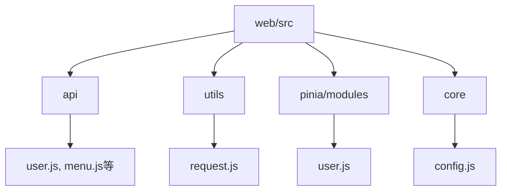
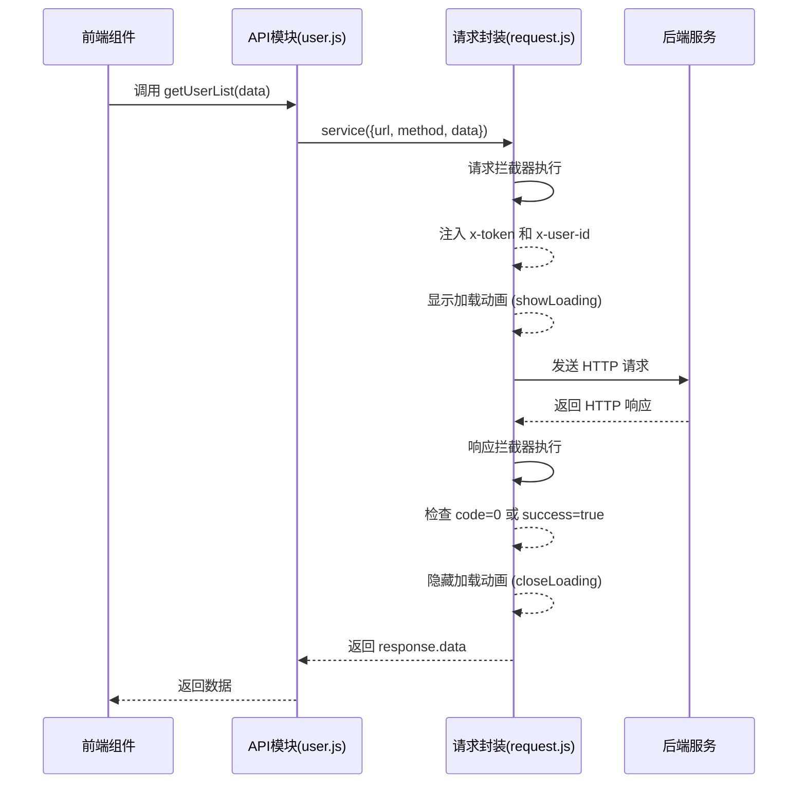
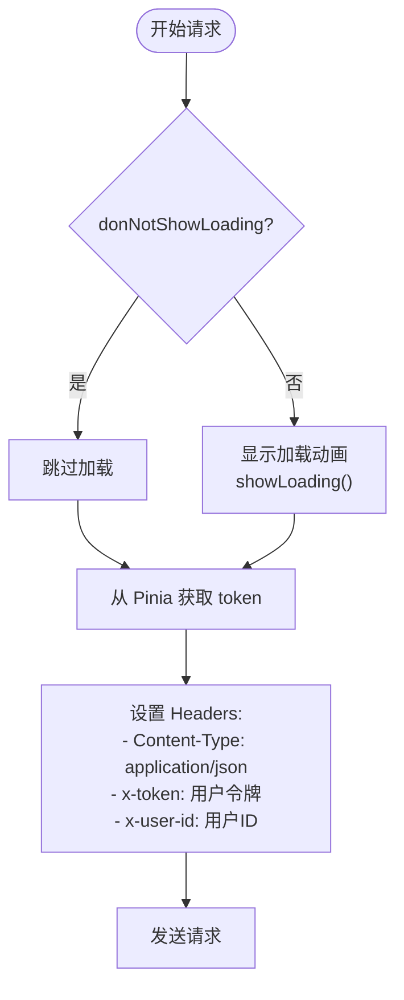
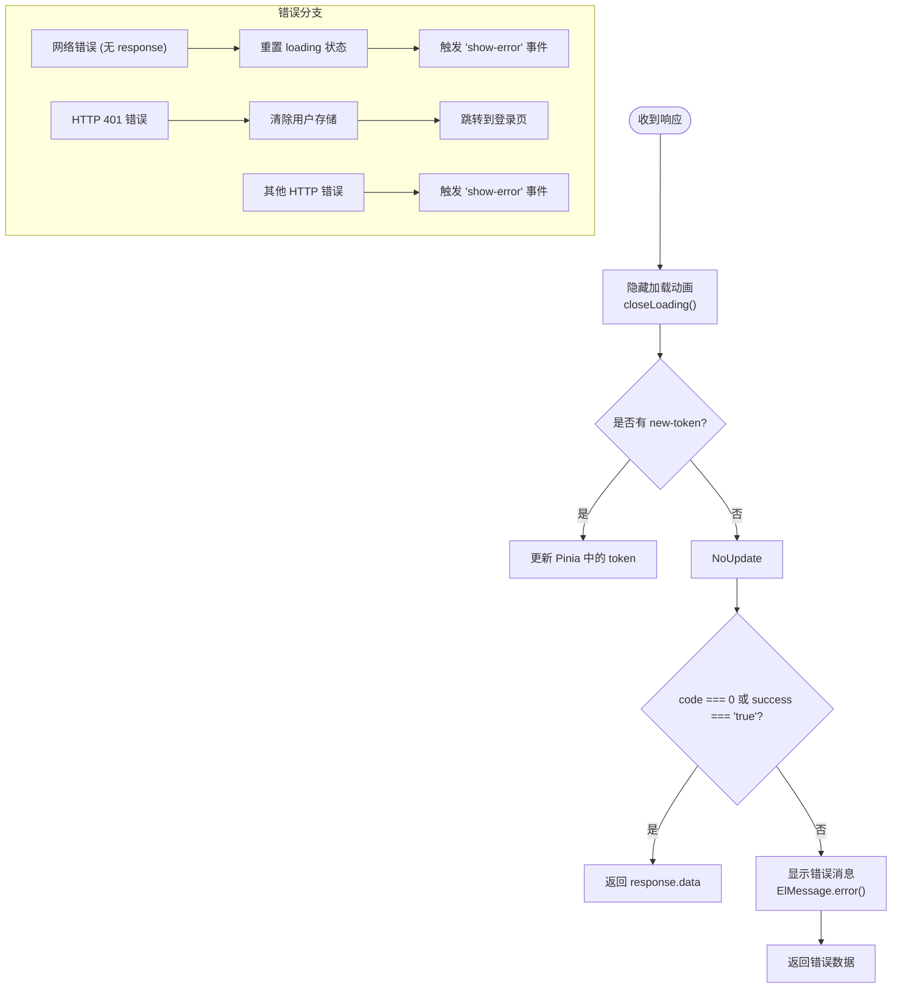
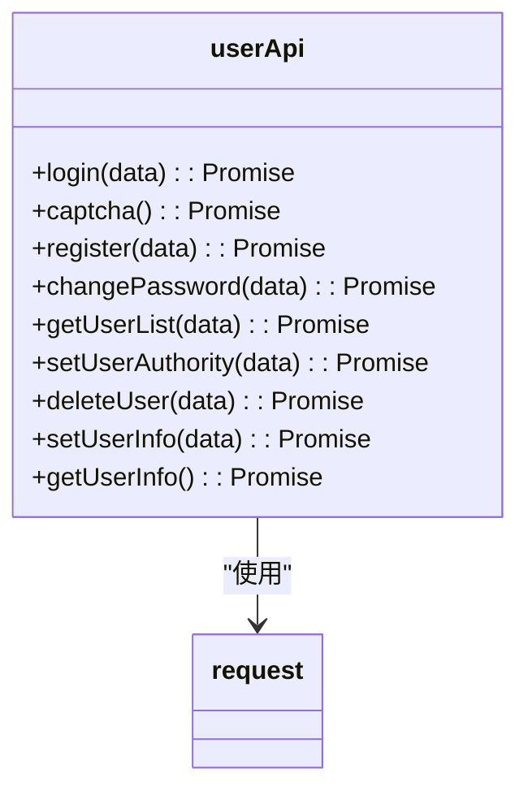
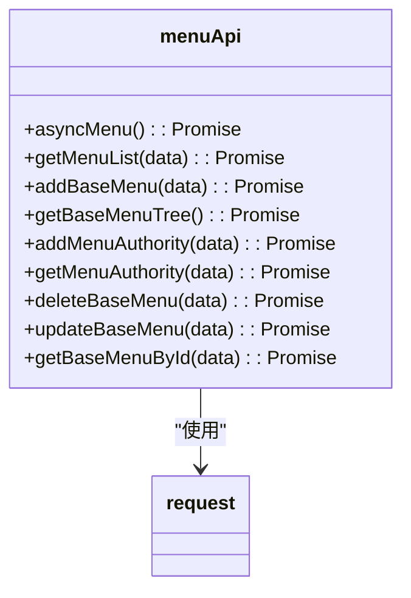
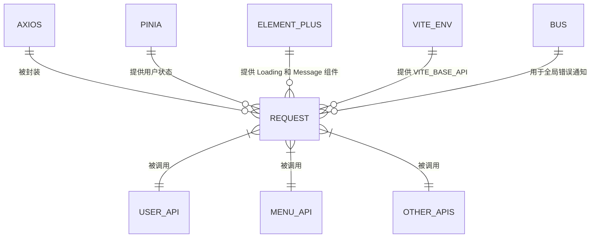
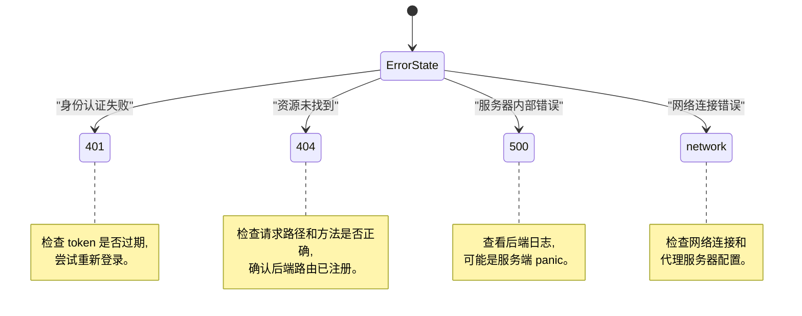

# API 客户端与请求封装

<cite>
**本文档引用的文件**
- [request.js](file://web/src/utils/request.js)
- [user.js](file://web/src/api/user.js)
- [menu.js](file://web/src/api/menu.js)
- [config.js](file://web/src/core/config.js)
- [vite.config.js](file://web/vite.config.js)
- [.env.development](file://web/.env.development)
- [.env.production](file://web/.env.production)
- [user.js](file://web/src/pinia/modules/user.js)
</cite>

## 目录
1. [简介](#简介)
2. [项目结构](#项目结构)
3. [核心组件](#核心组件)
4. [架构概述](#架构概述)
5. [详细组件分析](#详细组件分析)
6. [依赖分析](#依赖分析)
7. [性能考虑](#性能考虑)
8. [故障排除指南](#故障排除指南)
9. [结论](#结论)

## 简介
本技术文档全面解析了 `gin-vue-admin` 项目的前端 API 客户端实现,重点阐述了基于 Axios 的请求封装逻辑。文档详细说明了 `request.js` 中的 axios 实例配置、请求/响应拦截器的实现机制(包括 JWT 头部注入、统一错误处理和加载状态管理)、超时设置以及环境变量配置。同时,文档还介绍了各个 API 模块的组织结构和调用规范,并提供了安全、性能和调试方面的最佳实践。

## 项目结构
前端 API 相关代码主要位于 `web/src` 目录下,遵循清晰的模块化设计。

**图示来源**
- [request.js](file://web/src/utils/request.js)
- [user.js](file://web/src/api/user.js)
- [menu.js](file://web/src/api/menu.js)

**本节来源**
- [request.js](file://web/src/utils/request.js)
- [user.js](file://web/src/api/user.js)

## 核心组件
核心功能由 `request.js` 文件中的 axios 实例及其拦截器驱动,结合 `pinia` 状态管理来处理用户认证信息。

**本节来源**
- [request.js](file://web/src/utils/request.js#L1-L202)
- [user.js](file://web/src/pinia/modules/user.js#L12-L151)

## 架构概述
系统采用分层架构,API 调用通过一个全局封装的 axios 实例进行,该实例集成了认证、加载指示和错误处理。

**图示来源**
- [request.js](file://web/src/utils/request.js#L1-L202)
- [user.js](file://web/src/api/user.js#L0-L181)

## 详细组件分析

### 请求封装分析
`request.js` 是整个前端 API 通信的核心,它创建了一个预配置的 axios 实例,并通过拦截器实现了关键功能。

#### 请求拦截器
请求拦截器在每个请求发出前自动注入必要的头部信息。

**图示来源**
- [request.js](file://web/src/utils/request.js#L54-L123)
- [user.js](file://web/src/pinia/modules/user.js#L12-L151)

#### 响应拦截器
响应拦截器负责处理服务器返回的数据和各种错误情况。

**图示来源**
- [request.js](file://web/src/utils/request.js#L125-L201)
- [user.js](file://web/src/pinia/modules/user.js#L12-L151)

### API 模块组织
API 模块按业务功能划分,每个 `.js` 文件对应一个后端控制器。

#### 用户模块 (user.js)

**图示来源**
- [user.js](file://web/src/api/user.js#L0-L181)
- [request.js](file://web/src/utils/request.js)

#### 菜单模块 (menu.js)

**图示来源**
- [menu.js](file://web/src/api/menu.js#L0-L113)
- [request.js](file://web/src/utils/request.js)

**本节来源**
- [request.js](file://web/src/utils/request.js#L1-L202)
- [user.js](file://web/src/api/user.js#L0-L181)
- [menu.js](file://web/src/api/menu.js#L0-L113)

## 依赖分析
API 客户端的正常运行依赖于多个外部库和内部模块。

**图示来源**
- [request.js](file://web/src/utils/request.js)
- [vite.config.js](file://web/vite.config.js)
- [.env.development](file://web/.env.development)

**本节来源**
- [request.js](file://web/src/utils/request.js)
- [vite.config.js](file://web/vite.config.js)
- [.env.development](file://web/.env.development)

## 性能考虑
- **加载状态管理**: 通过 `activeAxios` 计数器和防抖定时器 (`setTimeout`) 精确控制加载动画的显示和隐藏,避免了不必要的闪烁。
- **强制关闭机制**: 设置了 30 秒的强制关闭定时器,防止因异常情况导致加载动画无法消失。
- **环境配置**: 使用 Vite 的环境变量 (`import.meta.env.VITE_BASE_API`) 进行动态代理配置,无需手动修改 baseURL。

## 故障排除指南
当遇到 API 调用问题时,可参考以下常见错误码:

**本节来源**
- [request.js](file://web/src/utils/request.js#L125-L201)
- [errorPreview/index.vue](file://web/src/components/errorPreview/index.vue#L55-L105)

## 结论
`gin-vue-admin` 的 API